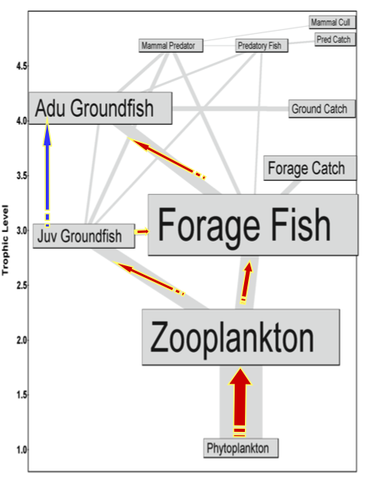
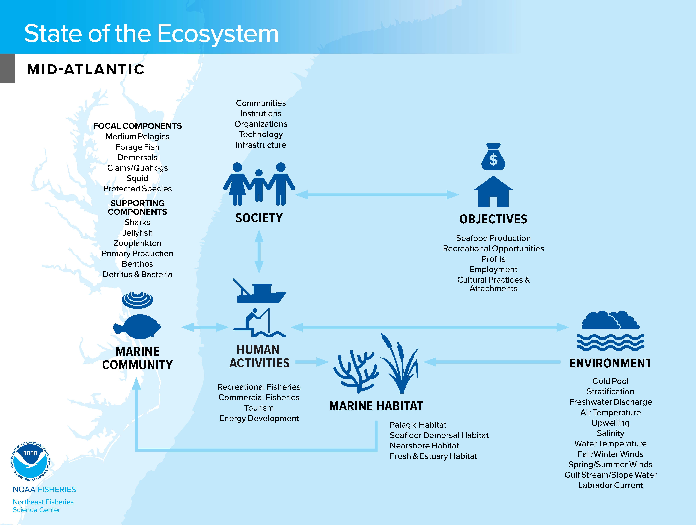
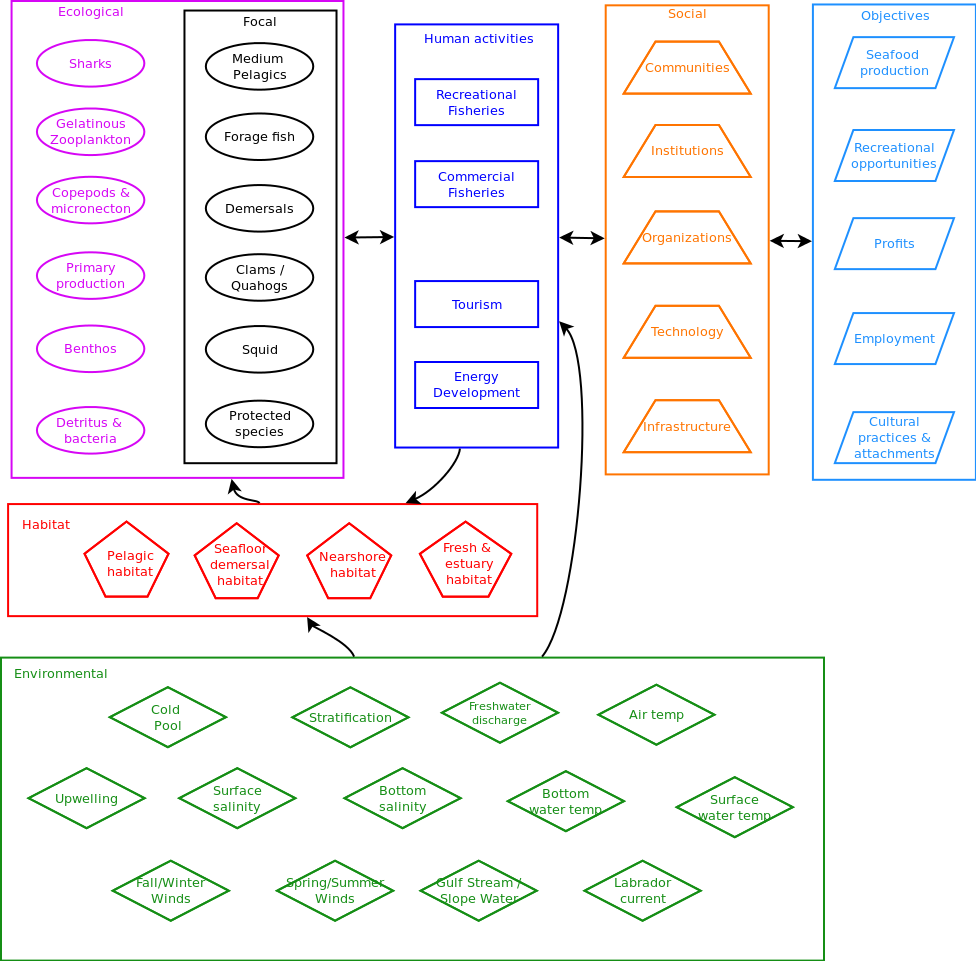
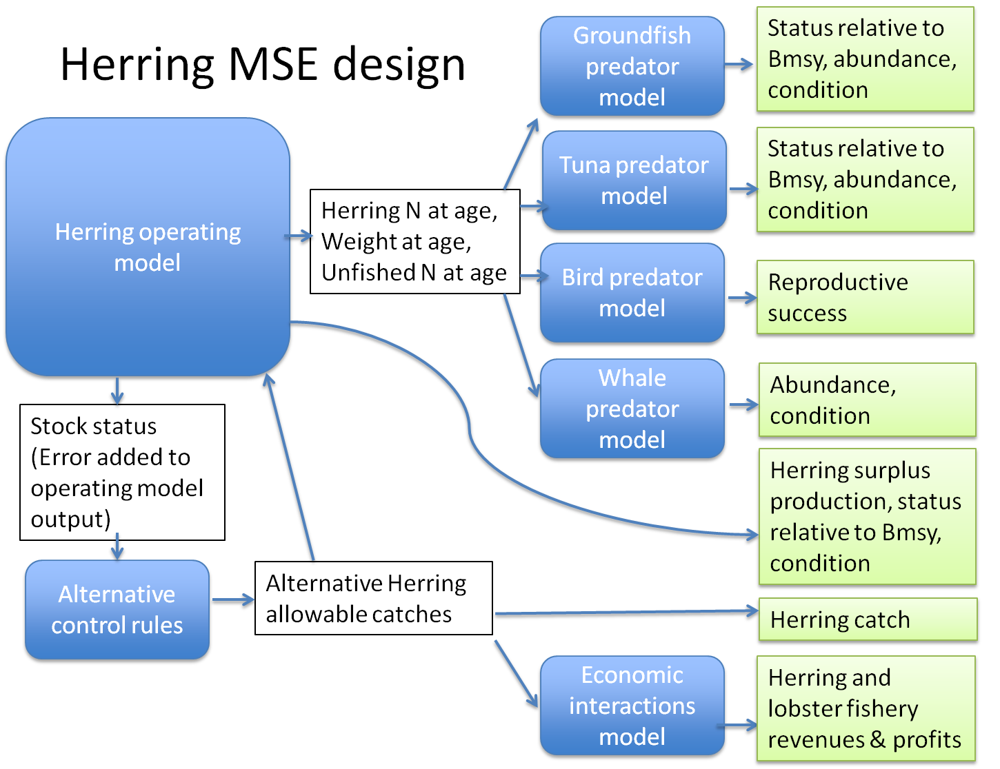

class: top, left

```{r setup, include=FALSE}

options(htmltools.dir.version = FALSE)
knitr::opts_chunk$set(echo = F,
                      warning = F,
                      message = F)
#Plotting and data libraries
library(ggplot2)
library(dplyr)
library(tidyr)
library(here)
library(kableExtra)
library(ggrepel)
library(stringr)
library(ggthemes)
library(readr)

data.dir <- here::here("data")


```

## What is a conceptual model?
```{r OAmod, echo = F, fig.align = "center", out.width="100%"}

```

.footnote[
Klinger, T., Chornesky, E. A., Whiteman, E. A., Chan, F., Largier, J. L., and Wakefield, W. W. 2017. Using integrated, ecosystem-level management to address intensifying ocean acidification and hypoxia in the California Current large marine ecosystem. Elem Sci Anth, 5: 16.
]
---
## What is a conceptual model?
```{r Karp, echo = F, fig.align = "center", out.width="70%"}
knitr::include_graphics("EDAB_images/KarpetalFig1.png")
```

.footnote[
Karp, M. A., Peterson, J. O., Lynch, P. D., Griffis, R. B., Adams, C. F., Arnold, W. S., Barnett, L. A. K., et al. 2019. Accounting for shifting distributions and changing productivity in the development of scientific advice for fishery management. ICES Journal of Marine Science. 
]
---
## What is a conceptual model?

.pull-left-40[

]

.pull-right-60[

]

.footnote[images courtesy Kerim Aydin and Min-Yang Lee]

---
## What is a conceptual model?
```{r PNWherring, echo = F, fig.align = "center", out.width="70%"}

```

.footnote[
Levin, P. S., Francis, T. B., and Taylor, N. G. 2016. Thirty-two essential questions for understanding the social–ecological system of forage fish: the case of Pacific Herring. Ecosystem Health and Sustainability, 2: e01213.
]

---
## What is a conceptual model?
```{r MASOE, echo = F, fig.align = "center", out.width="95%"}

```

.footnote[Mid-Atlantic 2019 State of the Ecosystem Report]

---
## What is a conceptual model?
```{r MAcons17, echo = F, fig.align = "center", out.width="75%"}

```

.footnote[Mid-Atlantic 2017 State of the Ecosystem Report]

---
## What is a conceptual model?
```{r MAconsfull, echo = F, fig.align = "center", out.width="85%"}

```

.footnote[Original Mid-Atlantic conceptual model (unpublished)]

---
## What is a conceptual model?
```{r GBmod, echo = F, fig.align = "center", out.width="75%"}

```

.footnote[
DePiper, G. S., Gaichas, S. K., Lucey, S. M., Pinto da Silva, P., Anderson, M. R., Breeze, H., Bundy, A., et al. 2017. Operationalizing integrated ecosystem assessments within a multidisciplinary team: lessons learned from a worked example. ICES Journal of Marine Science, 74: 2076–2086.
]

---
## How can we use them?

SOE: system overview, common idea of general relationships

Don't show the links!!

---
## How can we use them?

Bering FEP: ensure key relationships accounted

---
## How can we use them?

Pacific NW herring: generating further questions, research priorities

---
## How can we use them?

Cal current: specify links between quantitative models

---
## How can we use them? 

Herring MSE: link models matching management objectives

```{r OMdesign, echo = F, fig.align = "center", out.width="85%"}

```

---
## How can we use them?

MAFMC EAFM: 

---
## External Resources

* [Pacific herring conceptual modeling](https://esajournals.onlinelibrary.wiley.com/doi/10.1002/ehs2.1213)

* [California Current quantitative modeling](https://www.elementascience.org/articles/10.1525/elementa.338/)

* [Bering Sea conceptual modeling, p. 48](https://meetings.npfmc.org/CommentReview/DownloadFile?p=c334ad33-4139-4b5a-b205-a8b7c5028562.pdf&fileName=D6%20Final%20BS%20FEP%20Jan%202019.pdf)

* [Grand Banks conceptual modeling](https://academic.oup.com/icesjms/article/74/8/2076/3094701)

* [Draft summer flounder conceptual model visualization](https://gdepiper.github.io/Summer_Flounder_Conceptual_Models/sfconsmod_riskfactors_subplots.html)

* Slides available at https://noaa-edab.github.io/presentations

---

background-image: url("EDAB_images/IMG_2733.jpg")
background-size: cover

## Questions?


# Thank you!