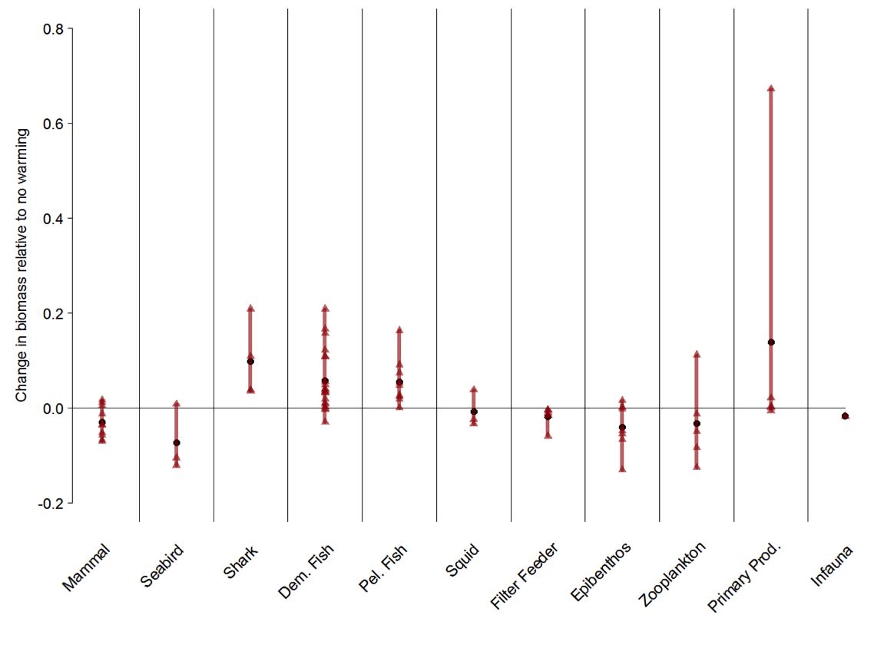
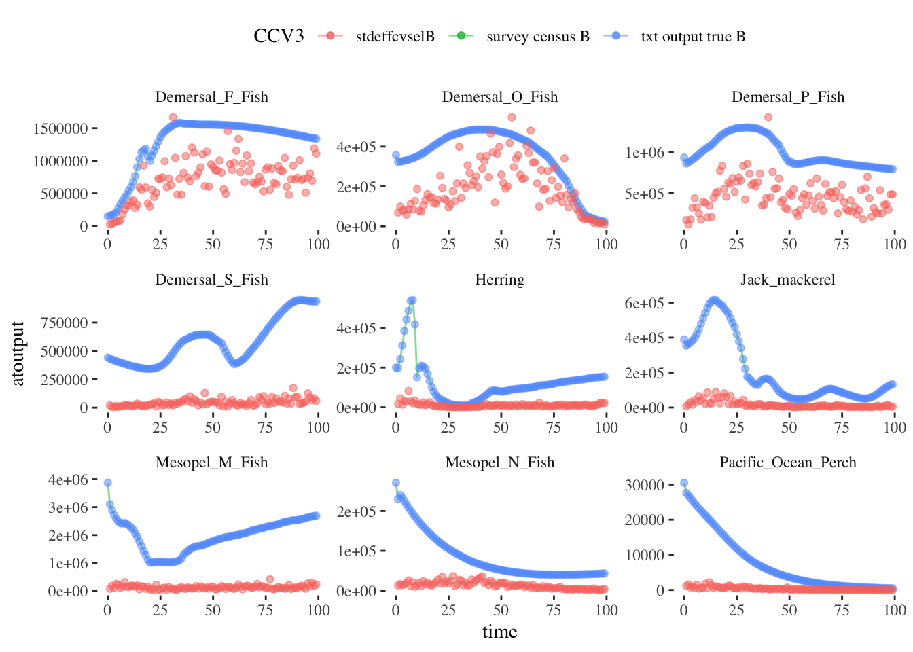

class: top, left

```{r setup, include=FALSE}

options(htmltools.dir.version = FALSE)
knitr::opts_chunk$set(echo = F,
                      warning = F,
                      message = F)
#Plotting and data libraries
library(ggplot2)
library(dplyr)
library(tidyr)
library(here)
library(kableExtra)
library(ggrepel)
library(stringr)

library(atlantisom)

data.dir <- here::here("data")

```

## We use models for a lot


---
## We have a lot of models


---
## How do we know they are right?

 * Fits to historical data (hindcast)
 
 * Influence of data over time (retrospective diagnostics)
 
 * Keep as simple and focused as possible
 
 * Simulation testing

## But What if 

##   data are noisy? 

##   we need to model complex interactions?

##   conditions change over time?


---
## End-to-end ecosystem operating models as dataset generators

Atlantis modeling framework: [Fulton et al. 2011](https://onlinelibrary.wiley.com/doi/full/10.1111/j.1467-2979.2011.00412.x), [Fulton and Smith 2004](https://www.ajol.info/index.php/ajms/article/view/33182)

.pull-left[
**Norwegian-Barents Sea**

[Hansen et al. 2016](https://www.imr.no/filarkiv/2016/04/fh-2-2016_noba_atlantis_model_til_web.pdf/nn-no), 
[2018](https://journals.plos.org/plosone/article?id=10.1371/journal.pone.0210419)


]
.pull-right[
**California Current**

[Marshall et al. 2017](https://onlinelibrary.wiley.com/doi/full/10.1111/gcb.13594), 
[Kaplan et al. 2017](https://www.sciencedirect.com/science/article/pii/S0304380016308262?via%3Dihub)


]


Building on global change projections:  [Hodgson et al. 2018](https://www.sciencedirect.com/science/article/pii/S0304380018301856?via%3Dihub), 
[Olsen et al. 2018](https://www.frontiersin.org/articles/10.3389/fmars.2018.00064/full)

---
## Why use Atlantis?

-  Mechanistic processes create internally consistent "truth"
-  Include cumulative effects of multiple processes:
  -  Climate drivers
  -  Species interactions 
  -  Spatial and seasonal variability
  -  Fisheries
  -  Oil spills, red tide, anything else Atlantis can do
-  Implemented for many ecosystems worldwide

## Why generate datasets instead of simulating within Atlantis?

-  Not all analyses need closed loop
-  Faster! 
-  Test many models or model configurations with the same dataset
-  Many dataset realizations from same "truth"; compare:
  -  Different observation error and bias
  -  Changing temporal and spatial survey coverage 
  -  Improved or degraded fishery observations


---
## Climate impacts in the operating model 


.footnote[
Hodgson, E. E., Kaplan, I. C., Marshall, K. N., Leonard, J., Essington, T. E., Busch, D. S., Fulton, E. A., et al. 2018. Consequences of spatially variable ocean acidification in the California Current: Lower pH drives strongest declines in benthic species in southern regions while greatest economic impacts occur in northern regions. Ecological Modelling, 383: 106–117.

Marshall, K. N., Kaplan, I. C., Hodgson, E. E., Hermann, A., Busch, D. S., McElhany, P., Essington, T. E., et al. 2017. Risks of ocean acidification in the California Current food web and fisheries: ecosystem model projections. Global Change Biology, 23: 1525–1539.

]

---
## Climate + cumulative impacts in the operating model 


---
## Specify uncertainty in assessment "data": What Would Poseidon Do?

What level of uncertainty do you want to carry through performance testing?
.pull-left[
1. Biological (Atlantis):

    1. appropriate sigma-R?

1. Survey specification (atlantisom):

    1. timing and spatial coverage?

    1. which species are captured?

    1. species-specific survey efficiency ("q")?

    1. selectivity at age for each species?

] 
.pull-right[
1. Survey uncertainty (atlantisom):

    1. additional observation error (survey cv for index)?
    
    1. effective sample size for biological samples?
    
1. Fishery uncertainty (atlantisom):
    
    1. additional observation error (catch cv for total)?
    
    1. catch sampled for length/age in all areas?
    
    1. effective sample size for biological samples?
]


---
## Get atlantisom  https://github.com/r4atlantis/atlantisom
.pull-left-70[

```{r getit, echo=TRUE, eval=FALSE}
# install.packages("devtools")
devtools::install_github("r4atlantis/atlantisom")
```

## atlantisom acknowlegements: 
##[Atlantis Summit December 2015](https://research.csiro.au/atlantis/atlantis-summit/)

```
atlantisom sgaichas$ git shortlog -sne
   203  kellijohnson <kellifayejohnson@gmail.com>
    65  sgaichas <sgaichas@gmail.com>
    47  Alexander Keth <alexander.keth@uni-hamburg.de>
    29  ChristineStawitz-NOAA <cstawitz@uw.edu>
    23  allanhicks <fishmanHicks@gmail.com>
    19  Sean Lucey <Sean.Lucey@NOAA.gov>
    13  hodgsone <emma.e.hodgson@gmail.com>
    11  gavinfay <gfay42@gmail.com>
     9  Kelli Johnson <kellifayejohnson@gmail.com>
     5  Emma Hodgson <ehodgson@Emmas-MacBook-Pro.local>
     4  christine.stawitz <christine.stawitz@noaa.gov>
     4  Christine Stawitz <cstawitz@uw.edu>
     3  unknown <rwildermuth@DT-322202-SMAST.UMDAR.umassd.edu>
     1  Gavin Fay <gfay42@gmail.com>
     1  sgaichas <sgaichas@users.noreply.github.com>
     1  thefaylab <gfay@umassd.edu>
```

]
.pull-right-30[

]


---
## Make Atlantis output into assessment model input

Example atlantisom workflows: 

1. Get true biomass, abundance, age composition, length composition, weight at age, fishery catch, fishery catch at age, fishery length composition, and fishery weight age age for a "sardine-like species": https://sgaichas.github.io/poseidon-dev/FullSardineTruthEx.html

1. Format these outputs and get other life history parameters for input into a stock assessment model ([Stock Synthesis](https://www.sciencedirect.com/science/article/abs/pii/S0165783612003293), using [`r4ss`](https://github.com/r4ss)):
https://sgaichas.github.io/poseidon-dev/CreateStockSynthesis.html

1. Get true and observed input data, format inputs, and run the assessment model: https://sgaichas.github.io/poseidon-dev/SardinesHakeatlantisom2SStest.html

1. In progress: compare assessment results with truth:
https://sgaichas.github.io/poseidon-dev/SkillAssessInit.html

---
## What can atlantisom do so far?
.pull-left[
Survey census test NOBA 
```{r ex-output1, echo = F, warning = F, message=F, fig.align = "center"}
knitr::include_graphics("EDAB_images/NOBAcensus.png")
```

True length composition NOBA
```{r ex-output3, echo = F, warning = F, message=F, fig.align = "center"}

```

]
.pull-right[
Standard survey test CCA
```{r ex-output2, echo = F, warning = F, message=F, fig.align = "center"}

```

Survey length composition CCA
```{r ex-output4, echo = F, warning = F, message=F, fig.align = "center"}

```

]

---
## A "sardine" assessment

Need: assessment model data inputs and life history parameters

*(model based on actual Sardine assessment in Stock Synthesis 3)*

.pull-left[
Data: 
  * survey biomass index 
  * survey length composition 
  * survey age composition (conditional catch at age)
  * fishery catch (tons) 
  * fishery length composition 
  * fishery age composition
]
.pull-right[
Parameters:
  * natural mortality (from total mortality)
  * growth curve (from survey length at age)
  * maturity at age (true)
  * unfished recruitment and steepness (true)
  * weight-length curve (true)
]

---
## A "sardine" assessment: setup

  * California Current Atlantis run with and without climate signal
  * Input data generated (e.g. sardine survey, below in green)
  * Parameters derived; simpler recruitment distribution

```{r sardsurv, echo = F, warning = F, message=F, out.width = "90%", fig.align = "left"}

```


---
## A "sardine" assessment: fits to data

.pull-left[


]

.pull-right[


]

---
## A "sardine" assessment: skill? (proof of concept)
.pull-left[
Biomass
```{r skillB, echo = F, warning = F, message=F, fig.align = "center"}

```
Fishing mortality
```{r skillF, echo = F, warning = F, message=F, fig.align = "center"}

```
]
.pull-right[
Recruitment
```{r skillR, echo = F, warning = F, message=F, fig.align = "center"}

```

Key: <span style="color:teal">True</span> <span style="color:red">SS3 estimate</span>
]
---
## Full disclosure!

.pull-left-60[
Still working on:

1. Functions for older Atlantis codebases (i.e., CCA model)

    1. Splitting aggregate age groups into true ages

    1. Interpolating aggregate age groups weight at age for true ages

    1. Fishery catch weight by area

1. Wrapper functions to generate data in fewer steps

1. Automated skill assessment functions

1. Inputs for models other than Stock Synthesis
]

.pull-right-40[

]


---
## P.S. What else could we test?


.footnote[
https://xkcd.com/1885/
]

---
## External Resources

* [Atlantis Model Documentation](https://github.com/Atlantis-Ecosystem-Model/Atlantis_example_and_instructions)

* [atlantisom R package](https://github.com/r4atlantis/atlantisom)

* [Testing atlantisom](https://github.com/sgaichas/poseidon-dev)

* Slides available at https://noaa-edab.github.io/presentations

---

background-image: url("EDAB_images/IMG_2733.jpg")
background-size: cover

## Questions?


# Tusen Takk til Havforskningsinstituttet!

---

# Extra slides

---
## Test both estimation and (simple) MSE capability

```{r poseidon, echo = F, fig.align = "center"}
knitr::include_graphics("EDAB_images/PoseidonDesign.png")
```

