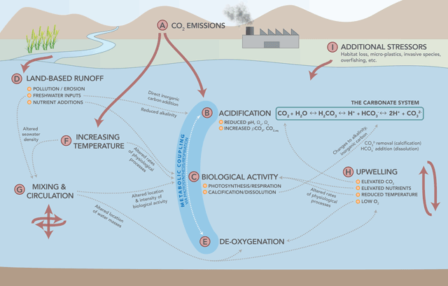
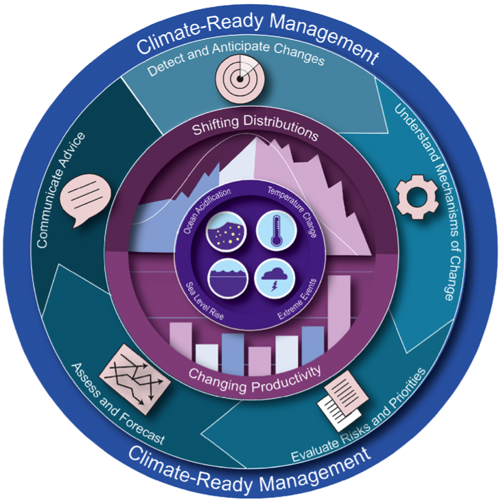
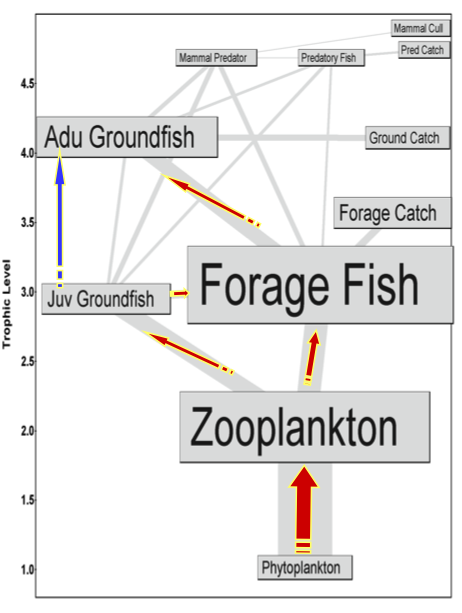
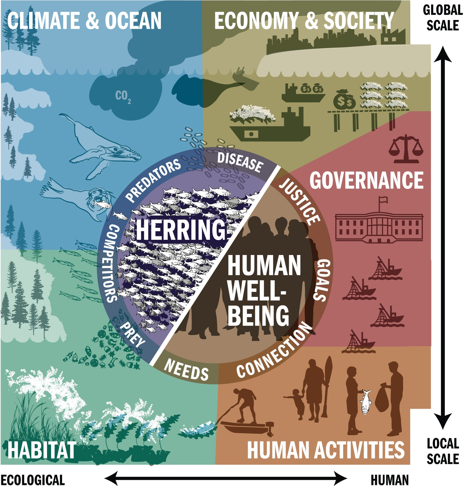
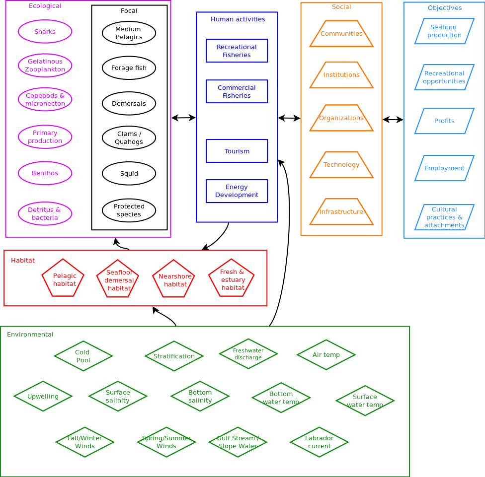
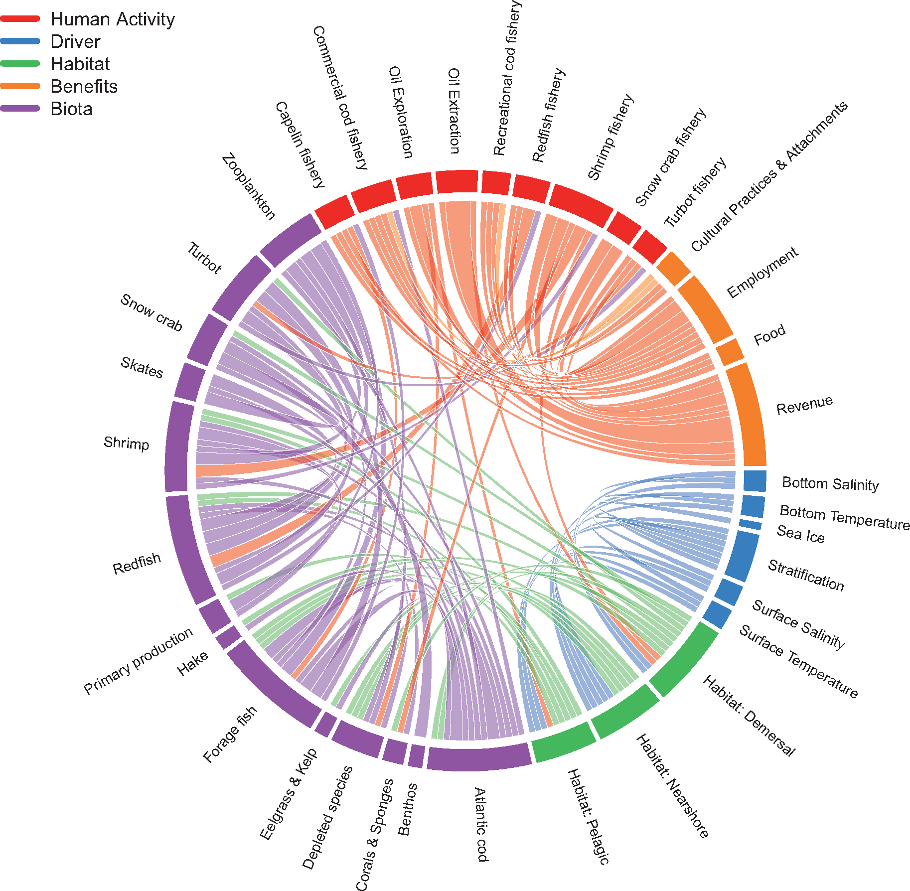
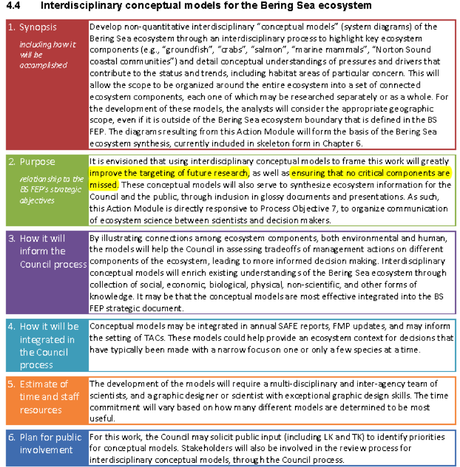
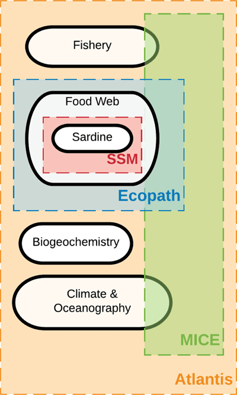
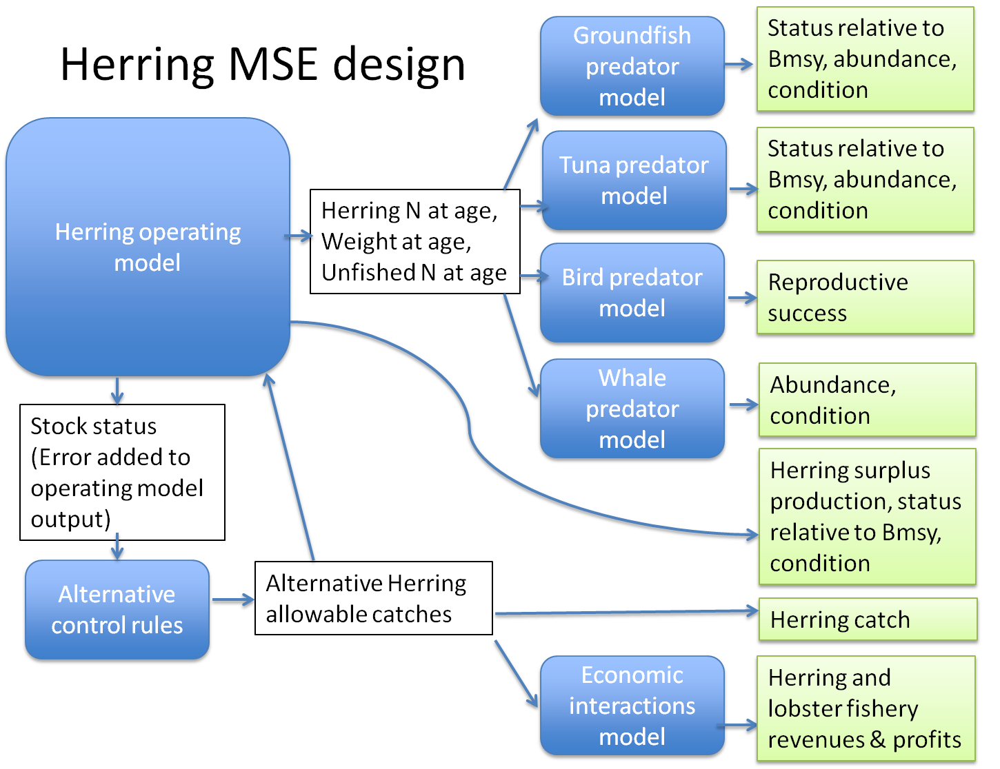

class: top, left

```{r setup, include=FALSE}

options(htmltools.dir.version = FALSE)
knitr::opts_chunk$set(echo = F,
                      warning = F,
                      message = F)
#Plotting and data libraries
library(ggplot2)
library(dplyr)
library(tidyr)
library(here)
library(kableExtra)
library(ggrepel)
library(stringr)
library(ggthemes)
library(readr)

data.dir <- here::here("data")


```

## What is a conceptual model?
```{r OAmod, echo = F, fig.align = "center", out.width="100%"}

```

.footnote[
Klinger, T., Chornesky, E. A., Whiteman, E. A., Chan, F., Largier, J. L., and Wakefield, W. W. 2017. Using integrated, ecosystem-level management to address intensifying ocean acidification and hypoxia in the California Current large marine ecosystem. Elem Sci Anth, 5: 16.
]
---
## What is a conceptual model?
```{r Karp, echo = F, fig.align = "center", out.width="70%"}

```

.footnote[
Karp, M. A., Peterson, J. O., Lynch, P. D., Griffis, R. B., Adams, C. F., Arnold, W. S., Barnett, L. A. K., et al. 2019. Accounting for shifting distributions and changing productivity in the development of scientific advice for fishery management. ICES Journal of Marine Science. 
]
---
## What is a conceptual model?

.pull-left-40[

]

.pull-right-60[

]

.footnote[images courtesy Kerim Aydin and Min-Yang Lee]

---
## What is a conceptual model?
```{r PNWherring, echo = F, fig.align = "center", out.width="68%"}

```

.footnote[
Levin, P. S., Francis, T. B., and Taylor, N. G. 2016. Thirty-two essential questions for understanding the social–ecological system of forage fish: the case of Pacific Herring. Ecosystem Health and Sustainability, 2: e01213.
]

---
## What is a conceptual model?
```{r MASOE, echo = F, fig.align = "center", out.width="95%"}
knitr::include_graphics("EDAB_images/MAB_conmod_overview.jpg")
```

.footnote[Mid-Atlantic 2019 State of the Ecosystem Report]

---
## What is a conceptual model?
```{r MAcons17, echo = F, fig.align = "center", out.width="75%"}

```

.footnote[Mid-Atlantic 2017 State of the Ecosystem Report]

---
## What is a conceptual model?
```{r MAconsfull, echo = F, fig.align = "center", out.width="85%"}
knitr::include_graphics("EDAB_images/MAB_3.png")
```

.footnote[Original Mid-Atlantic conceptual model (unpublished)]

---
## What is a conceptual model?
```{r GBmod, echo = F, fig.align = "center", out.width="75%"}

```

.footnote[
DePiper, G. S., Gaichas, S. K., Lucey, S. M., Pinto da Silva, P., Anderson, M. R., Breeze, H., Bundy, A., et al. 2017. Operationalizing integrated ecosystem assessments within a multidisciplinary team: lessons learned from a worked example. ICES Journal of Marine Science, 74: 2076–2086.
]

---
## How can we use them?

Visually communicate general relationships (Don't show all the links!!)

```{r NEScmod, echo = F, fig.align = "center", out.width="90%"}
knitr::include_graphics("EDAB_images/nes-components.png")
```


---
## How can we use them?
.pull-left-30[
Bering Sea Fishery Ecosystem Plan: ensure key relationships accounted
]
.pull-right-70[

]
.footnote[
Evans, D. 2019. Bering Sea Fishery Ecosystem Plan 2019. North Pacific Fishery Management Council, Anchorage, AK. https://meetings.npfmc.org/CommentReview/DownloadFile?p=c334ad33-4139-4b5a-b205-a8b7c5028562.pdf&fileName=D6%20Final%20BS%20FEP%20Jan%202019.pdf.

]
---
## How can we use them?
Pacific Northwest Herring: generating further questions, research priorities
.image-cap[
.pull-left[
#### Questions about broad social, political, and economic forces
1. How have global market forces influenced the commercial Herring fishery? How have the markets changed over time?
1. What are the social, cultural, and political motivations for Herring fisheries, and how have they changed over time?
1. What is the relationship between Herring fisheries and broader issues of indigenous rights?

#### Questions about human activities (and their effects on Herring)
1. What is the relative influence of fishing, other human activities and climate on Herring population dynamics, and how can the impacts be differentiated?
1. What are the cumulative effects of human activities (fishing, coastal development, toxins, etc.), predators and climate on Herring populations?
1. What are causes of historical disappearance of Herring, and is the current status of Herring a lingering consequence of historical impacts?
1. How does fishing affect spawn timing, and what impact does this have on population dynamics?
1. What are the ecological, economic, and cultural costs and benefits of alternative fisheries management strategies?

#### Climate questions
1.  How does global‐scale climate variability related to El Niño and the Pacific Decadal Oscillation influence Herring behavior and population dynamics?
1. How is changing climate affecting Herring populations?

]
.pull-right[
#### Institutional and governance questions
1. How do policies and management strategies that address the spatial distribution of fishing effort and the temporal order of fisheries better account for aboriginal rights as codified by court decisions and law?
1. What are the pros and cons of different temporal and spatial scales for adaptive Herring decision making?
1. How would different forms of knowledge alter definitions of overfishing thresholds and sustainable levels of fishing?
1. What role can institutional processes play in better facilitating the rebuilding of Herring populations?
1. How can we allocate harvest in such a way that supports ecological, economic, and cultural resilience?

#### Questions about human wellbeing
1. What thresholds of Herring abundance and distribution exist for meeting cultural objectives?
1. How do the economic and cultural benefits associated with the harvest of sac‐roe, spawn‐on‐kelp, adult fish for bait, and adult fish for food propagate through local and regional social systems? What are the consequences of this for equity and food security?
1. What nonfishing human activities are supported by Herring, that is, what is the value of the supportive ecosystem services provided by Herring?
1. What is the trade‐off between economics and human wellbeing if Herring remain in the ecosystem versus if they are harvested and removed from the system? How does this vary over the range of Pacific Herring?
]
]
.footnote[
Levin, P. S., Francis, T. B., and Taylor, N. G. 2016. Thirty-two essential questions for understanding the social–ecological system of forage fish: the case of Pacific Herring. Ecosystem Health and Sustainability, 2: e01213.
]

???
<!--
*Habitat questions*
1. Does the quantity and/or quality of spawning habitat determine Herring productivity and population size?
1. Does the artificial supplementation of spawning habitat (i.e., by trees or boughs) result in increases in the long‐term median Herring population size?
1. Are Herring using deeper spawning habitat? If so, why, and how does that affect their vulnerability to predation?

*Questions about Herring and the Herring food web*
1. Are Herring vital rates (e.g., recruitment, mortality) or behavior positively or negatively density dependent? How has the nature of density dependence changed over time?
1. How do the processes that determine or limit Herring population size vary across spatial and temporal scales?
1. What factors affect survival of Herring eggs, larvae and young‐of‐the‐year?
1. How has size structure changed over decadal to millennial time scales, and what are the causes and consequences of such changes?
1. What is the spatial structure of Herring populations, and what factors influence the degree of connectivity among sub‐populations? Has this changed over time?
1. What factors influence interannual and interdecadal movement of spawning Herring stocks?
1. What is the role of genetic and life‐history diversity in maintaining Herring populations? How has this changed over time?
1. What is the relative importance of bottom‐up versus top‐down processes for Herring behavior and population dynamics, and how has this varied over time?
1. What are the cross‐ecosystem linkages that influence Herring, and how have they changed over time?
1. How have changes in ocean productivity, predator abundance or other factors affected the long‐term median biomass of Herring?
-->

---
## How can we use them?
.pull-left-60[
California current: specify roles for and links between quantitative models to address a range of management questions
]
.pull-right-40[

]
.footnote[
Francis, T. B., Levin, P. S., Punt, A. E., Kaplan, I. C., Varney, A., and Norman, K. 2018. Linking knowledge to action in ocean ecosystem management: The Ocean Modeling Forum. Elem Sci Anth, 6: 83.
]
---
## How can we use them? 

New England Herring Management Strategy Evaluation: 
models quantitatively linked to performance metrics, management objectives

```{r OMdesign, echo = F, fig.align = "center", out.width="85%"}

```

---
## How can we use them?

.pull-left-70[

]
.pull-right-30[

MAFMC EAFM 

Refine:
Map interactions between risk elements for a selected high-priority fishery
]

1. Generate potential management questions
1. Evaluate available data / identify gaps
1. Starting point for quantitative analysis to address selected management question(s)

---
## External Resources

* [Pacific herring conceptual modeling](https://esajournals.onlinelibrary.wiley.com/doi/10.1002/ehs2.1213)

* [California Current quantitative modeling](https://www.elementascience.org/articles/10.1525/elementa.338/)

* [Bering Sea conceptual modeling, p. 48](https://meetings.npfmc.org/CommentReview/DownloadFile?p=c334ad33-4139-4b5a-b205-a8b7c5028562.pdf&fileName=D6%20Final%20BS%20FEP%20Jan%202019.pdf)

* [Grand Banks conceptual modeling](https://academic.oup.com/icesjms/article/74/8/2076/3094701)

* [Draft summer flounder conceptual model visualization](https://gdepiper.github.io/Summer_Flounder_Conceptual_Models/sfconsmod_riskfactors_subplots.html)

* Slides available at https://noaa-edab.github.io/presentations

---

background-image: url("EDAB_images/IMG_2733.jpg")
background-size: cover

## Questions?


# Thank you!