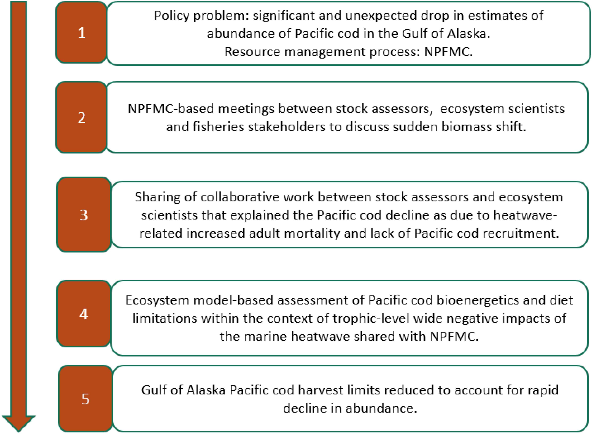

class: top, left

```{r setup, include=FALSE}

options(htmltools.dir.version = FALSE)
knitr::opts_chunk$set(echo = F,
                      warning = F,
                      message = F)
#Plotting and data libraries
library(ggplot2)
library(dplyr)
library(tidyr)
library(here)
library(kableExtra)
library(ggrepel)
library(stringr)
library(ggthemes)
library(readr)

data.dir <- here::here("data")

#herring MSE outputs
allres <- readRDS(file.path(data.dir,"allres.rds"))

#herring MSE plotting
#a better plotting theme than ggplot default? from https://rpubs.com/Koundy/71792
theme_Publication <- function(base_size=14, base_family="") {
      library(grid)
      library(ggthemes)
      (theme_foundation(base_size=base_size, base_family=base_family)
       + theme(plot.title = element_text(face = "bold",
                                         size = rel(1.2), hjust = 0.5),
               text = element_text(),
               panel.background = element_rect(colour = NA),
               plot.background = element_rect(colour = NA),
               panel.border = element_rect(colour = NA),
               axis.title = element_text(face = "bold",size = rel(1)),
               axis.title.y = element_text(angle=90,vjust =2),
               axis.title.x = element_text(vjust = -0.2),
               axis.text = element_text(), 
               axis.line = element_line(colour="black"),
               axis.ticks = element_line(),
               panel.grid.major = element_line(colour="#f0f0f0"),
               panel.grid.minor = element_blank(),
               legend.key = element_rect(colour = NA),
               legend.position = "right",
               legend.direction = "vertical",
               legend.key.size= unit(0.4, "cm"),
               legend.margin = unit(0, "cm"),
               legend.title = element_text(face="italic"),
               plot.margin=unit(c(10,5,5,5),"mm"),
               strip.background=element_rect(colour="#f0f0f0",fill="#f0f0f0"),
               strip.text = element_text(face="bold")
          ))
      
}

scale_fill_Publication <- function(...){
      library(scales)
      discrete_scale("fill","Publication",manual_pal(values = c("#386cb0","#fdb462","#7fc97f","#ef3b2c","#662506","#a6cee3","#fb9a99","#984ea3","#ffff33")), ...)

}

scale_colour_Publication <- function(...){
      library(scales)
      discrete_scale("colour","Publication",manual_pal(values = c("#386cb0","#fdb462","#7fc97f","#ef3b2c","#662506","#a6cee3","#fb9a99","#984ea3","#ffff33")), ...)

}


```

## [This paper](https://www.frontiersin.org/articles/10.3389/fmars.2019.00641/full) reviews example cases where scientists have had success in using ecosystem analysis and modeling to inform management priorities and stakeholder activities, and identifies practices that help bring new ecosystem science information into existing policy processes.

```{r paper, echo = F, fig.align = "center", out.width="80%"}

```

.footnote[
Townsend, H., Harvey, C. J., deReynier, Y., Davis, D., Zador, S. G., Gaichas, S., et al. (2019). Progress on Implementing Ecosystem-Based Fisheries Management in the United States Through the Use of Ecosystem Models and Analysis. Front. Mar. Sci. 6. doi:10.3389/fmars.2019.00641.
]

---
## Case studies of ecosystem models in practice

```{r general, echo = F, fig.align = "center", out.width="85%"}
knitr::include_graphics("EDAB_images/fmars-06-00641-g001.jpg")
```

---
## New England Herring MSE 

```{r NEherring, echo = F, fig.align = "center", out.width="85%"}

```

---
## New England Herring MSE: strategic advice
.pull-left[
Models quantitatively linked to performance metrics, management objectives

```{r OMdesign, echo = F, fig.align = "center", out.width="95%"}
knitr::include_graphics("EDAB_images/OMdesign.png")
```
]
.pull-right[
- Tern productivity at 1.0 or above > 90% of the time
- Herring biomass > 90% of SSBmsy
- Fishery yield > 90% of MSY
- AND fishery closures (F=0) < 1% of the time.
```{r}
Nrulesgoodterns <- allres %>%
  filter(CR %in% c("BB", "BB3yr")) %>%
  group_by(OM,CR)%>%
  filter(MedPropYrs_goodProd_Targplustern>0.9) %>%
  summarize(tern90 = n())

Nrulesgoodfishery <- allres %>%
  filter(CR %in% c("BB", "BB3yr")) %>%
  group_by(OM,CR)%>%
  filter(YieldrelMSY>0.9) %>%
  summarize(yield90 = n())

Nrulesgoodherring <- allres %>%
  filter(CR %in% c("BB", "BB3yr")) %>%
  group_by(OM,CR)%>%
  filter(MedSSBrelSSBmsy>0.9) %>%
  summarize(SSB90 = n())

Nrulesgoodternherrfish <- allres %>%
  filter(CR %in% c("BB", "BB3yr")) %>%
  filter(MedPropYrs_goodProd_Targplustern>0.9 & MedSSBrelSSBmsy>0.9 & YieldrelMSY>0.9 & PropClosure < 0.01) %>%
  group_by(OM,CR)%>%
  summarize(ternfishherr90 = n(), 
            minF = min(FracFtarg), 
            maxF = max(FracFtarg),
            minloB = min(FracBmsyThreshLo), 
            maxloB = max(FracBmsyThreshLo),
            minhiB = min(FracBmsyThreshHi),
            maxhiB = max(FracBmsyThreshHi)
  )

CRsgoodternherrfish <- allres %>%
  filter(CR %in% c("BB", "BB3yr")) %>%
  filter(MedPropYrs_goodProd_Targplustern > 0.9 & MedSSBrelSSBmsy > 0.9 & YieldrelMSY > 0.9 & PropClosure < 0.01) %>%
  group_by(OM,CR) %>%
  select(OM, CR, FracBmsyThreshLo, FracBmsyThreshHi,FracFtarg) %>%
  mutate(id = seq(1:n()),
         Xmin = 0,
         Xmax = 4) %>%
  gather(CRpart, x, Xmin,FracBmsyThreshLo, FracBmsyThreshHi,Xmax) %>%
  arrange(OM, CR, id) %>%
  mutate(y = case_when(CRpart == "Xmin" | CRpart == "FracBmsyThreshLo" ~ 0,
                       CRpart == "FracBmsyThreshHi" | CRpart == "Xmax" ~ FracFtarg)) %>%
  mutate(bigkey = paste0(OM, CR, id))
  
#with(CRsgoodternherrfish, 
#     plot(x=c(0,FracBmsyThreshLo, FracBmsyThreshHi, 4),
#          y=c(0,0,FracFtarg, FracFtarg), type="l"))  
  
p1 <- ggplot(CRsgoodternherrfish, aes(x=x, y=y, colour=CR)) + 
  geom_line(aes(group=bigkey), alpha=0.3) +
  labs(y="F/Fmsy", x="SSB/SSBmsy", colour="Control rule type") +
  guides(colour = guide_legend(override.aes = list(alpha = 1))) +
  theme_Publication() + scale_colour_Publication()

OMlabels <- c(HiM_LowSteep_AssBias_OldWt = 'LowFastBiased', 
              HiM_LowSteep_AssBias_RecWt = 'LowSlowBiased', 
              HiM_LowSteep_NoAssBias_OldWt = 'LowFastCorrect', 
              HiM_LowSteep_NoAssBias_RecWt = 'LowSlowCorrect',  
              LoM_HiSteep_AssBias_OldWt =  'HighFastBiased',  
              LoM_HiSteep_AssBias_RecWt = 'HighSlowBiased', 
              LoM_HiSteep_NoAssBias_OldWt = 'HighFastCorrect',
              LoM_HiSteep_NoAssBias_RecWt = 'HighSlowCorrect'
              )

p1 + facet_wrap("OM", labeller=labeller(OM = OMlabels), nrow=2) + theme(legend.position="bottom")

```
]

---
## Gulf of Alaska cod harvest

```{r GOAcod, echo = F, fig.align = "center", out.width="85%"}

```

---
## Gulf of Alaska cod harvest: tactical advice

.pull-left[
```{r AKprocess, echo = F, fig.align = "center", out.width="95%", fig.show='hold'}


```
]

.pull-right[
```{r GOAcodassess, echo = F, fig.align = "center", out.width="95%", fig.show='hold'}


```
]

---
## Coastal Louisiana restoration 

```{r LArestore, echo = F, fig.align = "center", out.width="85%"}
knitr::include_graphics("EDAB_images/fmars-06-00641-g005.jpg")
```

---
## Hawai’i coral reefs 

```{r HIcoral, echo = F, fig.align = "center", out.width="85%"}
knitr::include_graphics("EDAB_images/fmars-06-00641-g006.jpg")
```

---
## California Current dynamic ocean management 

```{r CCdynocean, echo = F, fig.align = "center", out.width="85%"}

```

---
## Conclusions
  
* Broad suite of tools needed that can address
    * Biophysical factors
    * Stock/species interactions
    * Social and economic factors
    
* Must plug into policy-making process

* Consider fisheries and other mandates (habitat)

* Communication essential
    * Among modelers
    * Between modelers, managers, and stakeholders
    
* Iteration helps
    * With stakeholders and managers for particular projects
    * Annual products such as ESRs

---
## External Resources

* [The paper!](https://www.frontiersin.org/articles/10.3389/fmars.2019.00641/full)

* Slides available at https://noaa-edab.github.io/presentations

---

background-image: url("EDAB_images/IMG_2809.jpg")
background-size: cover

## Questions?


# Thank you!