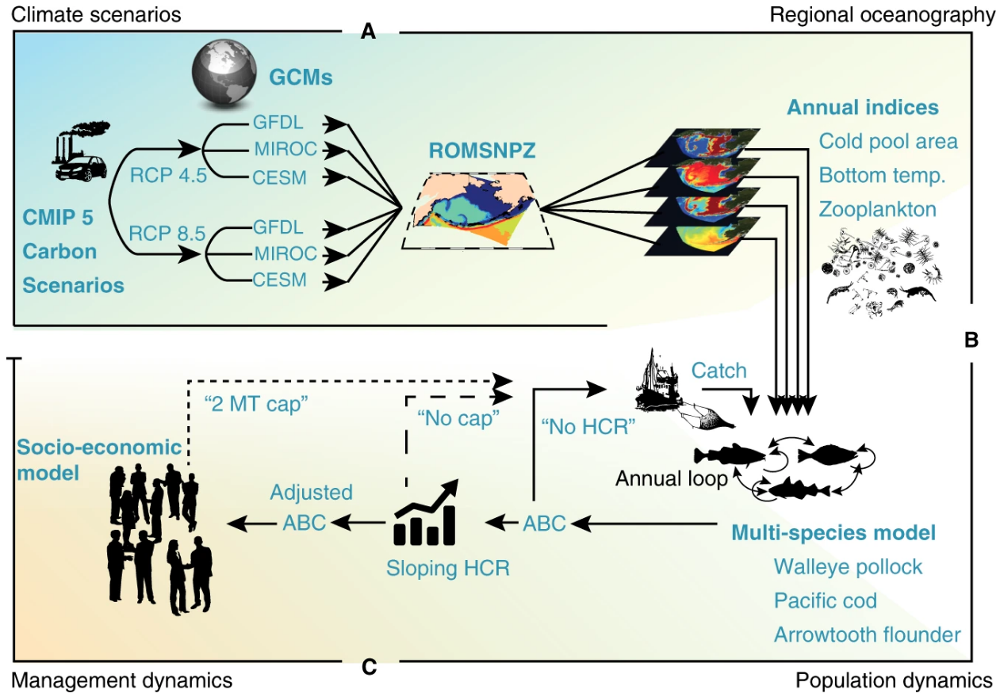
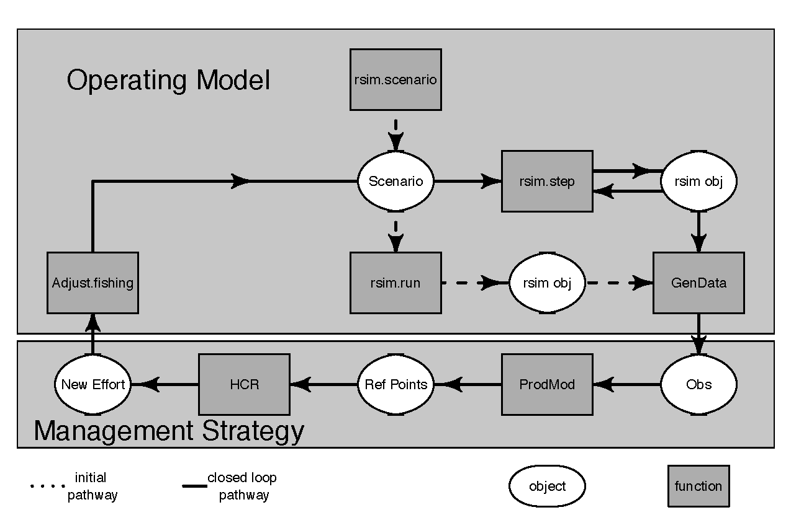
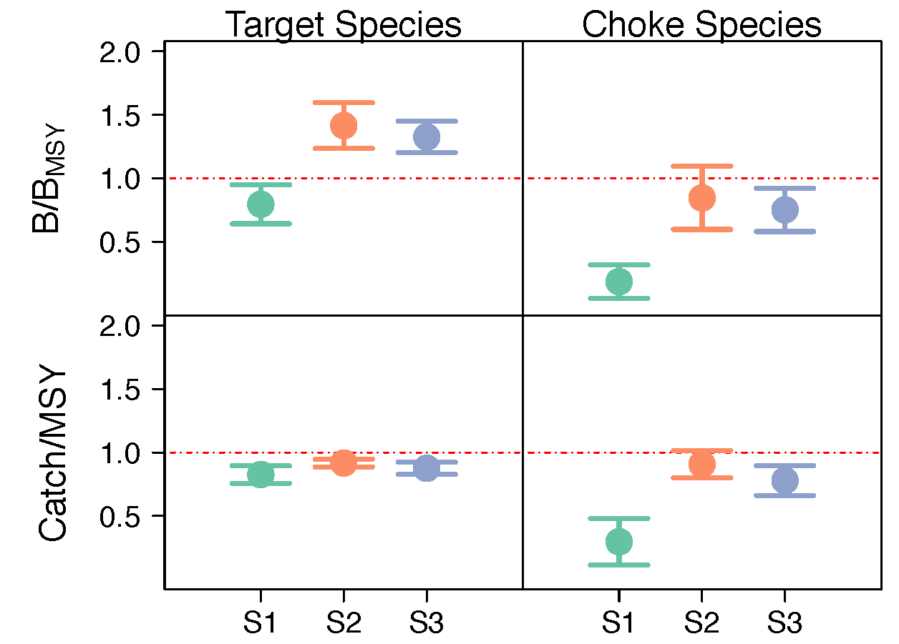
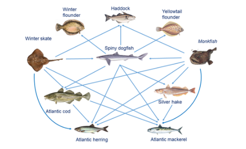
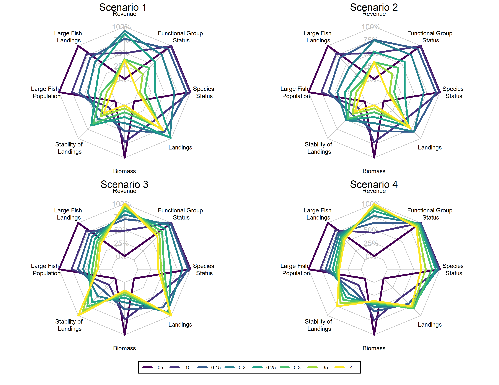

class: top, left

```{r setup, include=FALSE}

options(htmltools.dir.version = FALSE)
knitr::opts_chunk$set(echo = F,
                      fig.retina = 3,
                      warning = F,
                      message = F)
#Plotting and data libraries
library(tidyverse)
library(tidyr)
library(here)
```

```{r, load_refs, include=FALSE, cache=FALSE}
library(RefManageR)
BibOptions(check.entries = FALSE,
           bib.style = "authoryear",
           cite.style = "authoryear",
           style = "markdown")
myBib <- ReadBib("./DeepUncertaintyMSE.bib", check = FALSE)

#,
#           hyperlink = FALSE,
#           dashed = FALSE

```

## Climate projections with multispecies model `r Cite(myBib, "holsman_ecosystem-based_2020")`

.center[

]

???
a Regional downscaling where three global climate models driven by the IPCC AR5 CMIP5 emission scenarios determine boundary conditions of the coupled ROMSNPZ high resolution oceanographic model for the Bering Sea, AK. b Biological downscaling of annual indices from the ROMSNPZ were used to drive thermal parameters in the CEATTLE model (i.e., weight-at-age and predation) as well as climate-enhanced spawner-recruitment relationships. c Annual harvest recommendations (ABC) from the assessment model which were translated into annual catch using the ATTACH social-economic model of the effect of EBFM policies on harvest
---
## Ecosystem harvest control rules `r Cite(myBib, "kaplan_ecosystem-based_2020")`


---
## [Rpath](https://github.com/NOAA-EDAB/Rpath) `r Cite(myBib, "lucey_conducting_2020")` with MSE capability (Lucey et al. accepted)

.pull-left[

]

.pull-right[

]

Lucey, Sean M., Kerim Y. Aydin, Sarah K. Gaichas, Steven X. Cadrin, Gavin Fay, Michael J. Fogarty, and Andre Punt. Accepted. Evaluating fishery management strategies using an ecosystem model as an operating model. Fisheries Research. 
---
## Ongoing EBFM modeling for New England

.pull-left-40[


*Associated GitHub repositories*
* [hydra-sim Wiki](https://github.com/NOAA-EDAB/hydra_sim/wiki)
* [hydradata](https://github.com/NOAA-EDAB/hydradata)
* [LeMANS](https://github.com/NOAA-EDAB/LeMANS)
* [mscatch](https://github.com/NOAA-EDAB/mscatch) Multispecies fishery catch data

]
.pull-right-60[

]
???
Scenario 1: Fixed exploitation rate. Exploitation rates = 0.05-0.4 in increments of 0.05. Floor assessed at the complex level. If the floor*  of any complex is breached any further catch of this complex is considered a discard.

Scenario 2: The same as Scenario 1 with one addition. Floors assessed as the species level.  If the floor*  of any species is breached any further catch of this species is considered a discard.

Scenario 3: Variable exploitation rate. Starting exploitation rates = 0.05-0.4 in increments of 0.05. Each species complex is associated with a single fishing fleet. Species are still caught by multiple fleets, but when a species/complex becomes depleted, management actions only occur on the associated fleet. Each species complex is associated with the fleet that is considered the largest exploiter of the complex. The fishing fleets impact (exploitation) on the complex is adjusted through time5 (as depicted in HCR figure) when the complex biomass falls below 40% unfished biomass.

Scenario 4: The same as Scenario 3 with one addition. The fishing fleets impact on the complex is adjusted through time (as depicted in Figure 4) as the biomass of an individual species within the complex falls below 40% unfished biomass (50% for Elasmobranchs). This can be thought of as additional species protection
---
## References

```{r refs, echo=FALSE, results="asis"}
PrintBibliography(myBib)
```


## Additional resources
.pull-left[
[Alaska multispecies and ecosystem models](https://www.integratedecosystemassessment.noaa.gov/regions/alaska/ebs-integrated-modeling)

[California Current Future Seas MSEs](https://www.integratedecosystemassessment.noaa.gov/regions/california-current/cc-projects-future-seas)
]
.pull-right[
[Mid-Atlantic ecosystem approach](https://www.mafmc.org/eafm)

[New England example fishery ecosystem plan](https://s3.amazonaws.com/nefmc.org/3_Draft-example-Fishery-Ecosystem-Plan-eFEP_190830_113712.pdf)
]
.footnote[
Slides available at https://noaa-edab.github.io/presentations  
Contact: <Sarah.Gaichas@noaa.gov>
]
