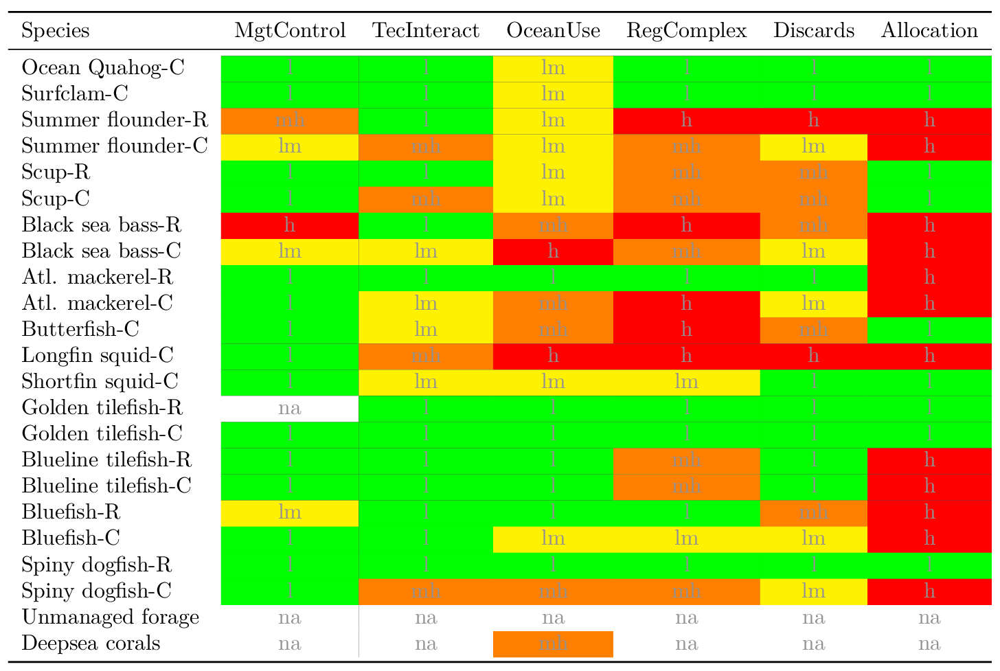
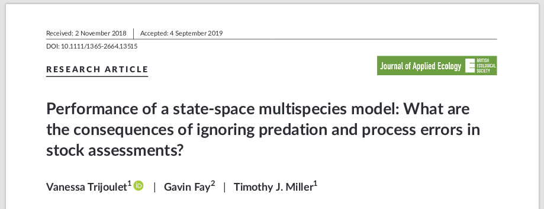
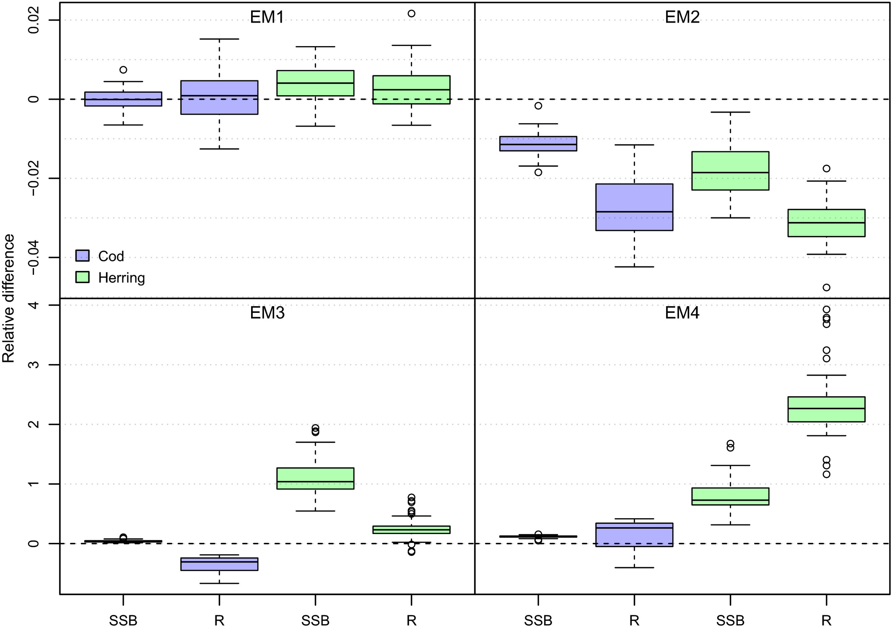
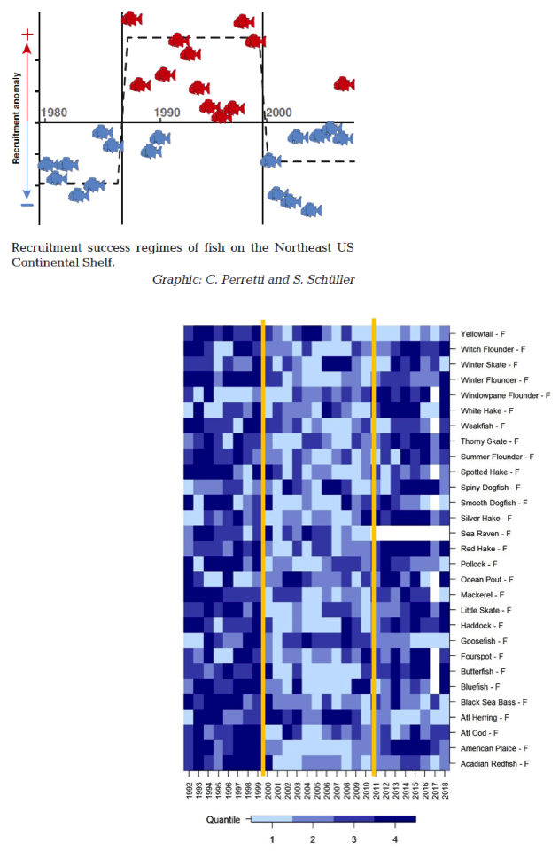
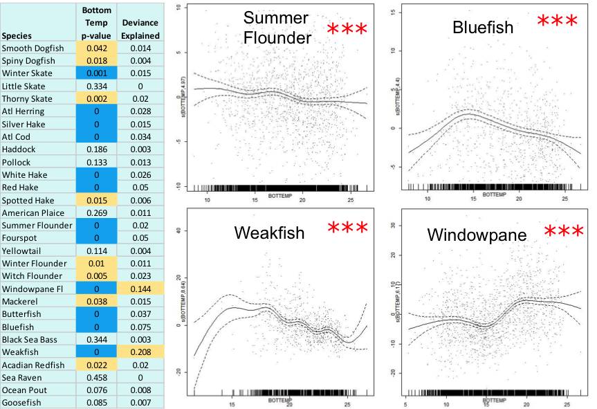
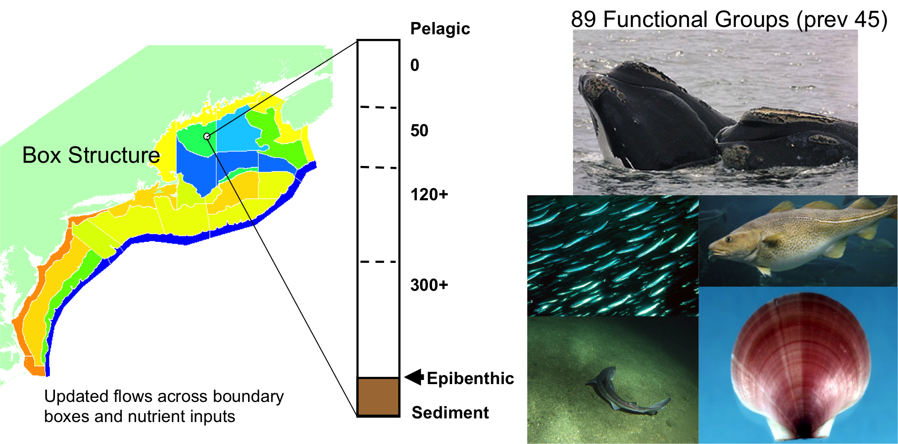
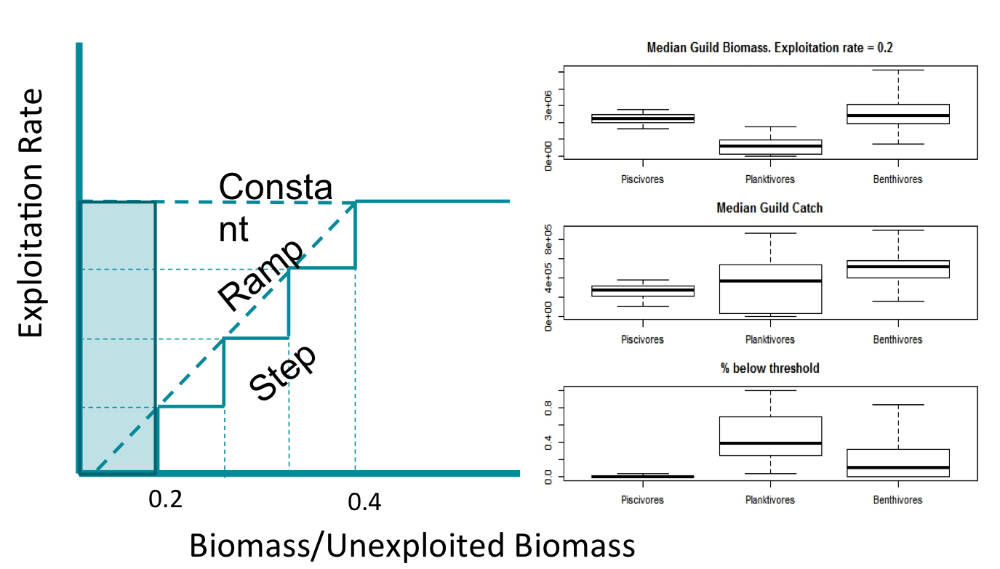
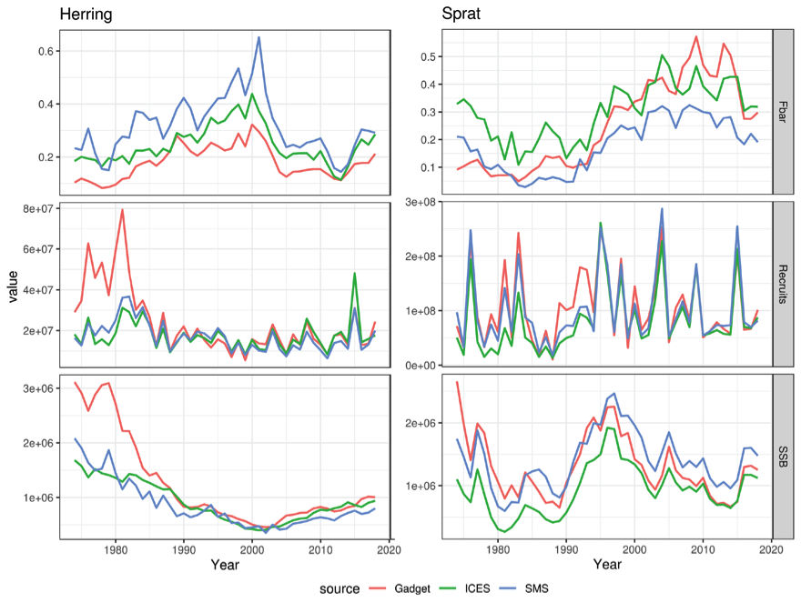
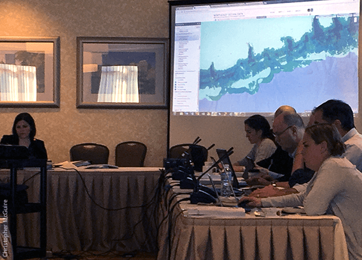
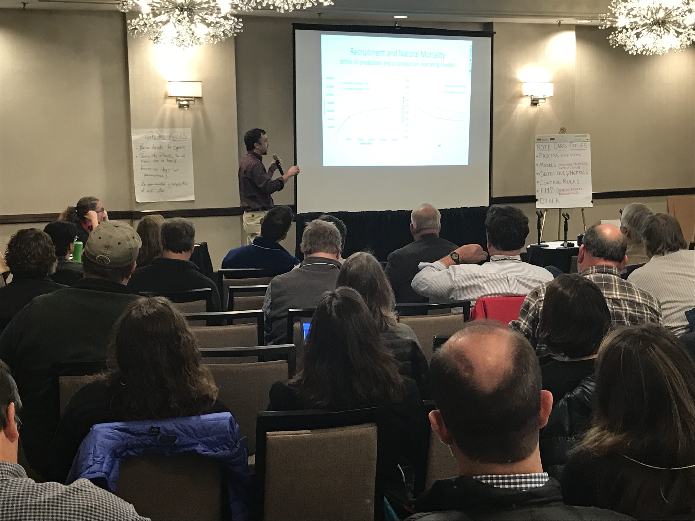

class: top, left

```{r setup, include=FALSE}

options(htmltools.dir.version = FALSE)
knitr::opts_chunk$set(echo = F,
                      warning = F,
                      message = F)
#Plotting and data libraries
library(ggplot2)
library(dplyr)
library(tidyr)
library(here)
library(kableExtra)
library(ggrepel)
library(stringr)
library(patchwork)
library(grid)
library(plotly)
library(vegan)
library(rpart)
library(colorRamps)
library(ecodata)

#GIS libraries
library(sf)
library(rgdal)
#library(raster)
library(rnaturalearth)

data.dir <- here::here("data")

#herring MSE outputs
allres <- readRDS(file.path(data.dir,"allres.rds"))

#herring MSE plotting
#a better plotting theme than ggplot default? from https://rpubs.com/Koundy/71792
theme_Publication <- function(base_size=14, base_family="") {
      library(grid)
      library(ggthemes)
      (theme_foundation(base_size=base_size, base_family=base_family)
       + theme(plot.title = element_text(face = "bold",
                                         size = rel(1.2), hjust = 0.5),
               text = element_text(),
               panel.background = element_rect(colour = NA),
               plot.background = element_rect(colour = NA),
               panel.border = element_rect(colour = NA),
               axis.title = element_text(face = "bold",size = rel(1)),
               axis.title.y = element_text(angle=90,vjust =2),
               axis.title.x = element_text(vjust = -0.2),
               axis.text = element_text(), 
               axis.line = element_line(colour="black"),
               axis.ticks = element_line(),
               panel.grid.major = element_line(colour="#f0f0f0"),
               panel.grid.minor = element_blank(),
               legend.key = element_rect(colour = NA),
               legend.position = "right",
               legend.direction = "vertical",
               legend.key.size= unit(0.4, "cm"),
               legend.margin = unit(0, "cm"),
               legend.title = element_text(face="italic"),
               plot.margin=unit(c(10,5,5,5),"mm"),
               strip.background=element_rect(colour="#f0f0f0",fill="#f0f0f0"),
               strip.text = element_text(face="bold")
          ))
      
}

scale_fill_Publication <- function(...){
      library(scales)
      discrete_scale("fill","Publication",manual_pal(values = c("#386cb0","#fdb462","#7fc97f","#ef3b2c","#662506","#a6cee3","#fb9a99","#984ea3","#ffff33")), ...)

}

scale_colour_Publication <- function(...){
      library(scales)
      discrete_scale("colour","Publication",manual_pal(values = c("#386cb0","#fdb462","#7fc97f","#ef3b2c","#662506","#a6cee3","#fb9a99","#984ea3","#ffff33")), ...)

}


#Time series constants
shade.alpha <- 0.3
shade.fill <- "lightgrey"
lwd <- 1
pcex <- 2
trend.alpha <- 0.5
trend.size <- 2
hline.size <- 1
hline.alpha <- 0.35
hline.lty <- "dashed"
label.size <- 5
hjust.label <- 1.5
letter_size <- 4
feeding.guilds <- c("Apex Predator","Piscivore","Planktivore","Benthivore","Benthos")
x.shade.min <- 2009
x.shade.max <- 2018
map.lwd <- 0.4
#Function for custom ggplot facet labels
label <- function(variable,value){
  return(facet_names[value])
}

#facet names for titles
facet_names <- list("Apex predators" = expression("Apex predators"),
                    "Piscivores" = expression("Piscivores"),
                    "Planktivores" = expression("Planktivores"),
                    "Benthivores" = expression("Benthivores"),
                    "Benthos" = expression("Benthos"))
#CRS
crs <- "+proj=longlat +lat_1=35 +lat_2=45 +lat_0=40 +lon_0=-77 +x_0=0 +y_0=0 +datum=NAD83 +no_defs +ellps=GRS80 +towgs84=0,0,0"

#Coastline shapefile
coast <- ne_countries(scale = 10,
                          continent = "North America",
                          returnclass = "sf") %>%
             sf::st_transform(crs = crs)

#State polygons
ne_states <- ne_states(country = "united states of america",
                                      returnclass = "sf") %>%
  sf::st_transform(crs = crs)

#high-res polygon of Maine
#new_england <- read_sf(gis.dir,"new_england")

#EPU shapefile
epu_sf <- ecodata::epu_sf %>% 
  filter(EPU %in% c("MAB","GB","GOM"))


```

## Northeast Fisheries Science Center

.pull-left[
*Review of Ecosystem Modeling Progress*
- Management Products

- Important Research Results

- Tools Available 

- Improving Management Capabilities

]
.pull-right[
*Best Practices Improving Model Utility for Management*
- Ecosystem Model Reviews

- Science-Management Collaborations

- Open Science Workflows


]


???
---
## Review: Management Products
*Atlantic herring harvest control rule selected based on multispecies MSE*
.pull-left[
Models quantitatively linked to stakeholder-selected performance metrics, management objectives

```{r OMdesign, echo = F, fig.align = "center", out.width="95%"}
knitr::include_graphics("EDAB_images/OMdesign.png")
```
]
.pull-right[
Multiple options to meet criteria
.contrib[
- Tern productivity at 1.0 or above > 90% of the time
- Herring biomass > 90% of SSBmsy
- Fishery yield > 90% of MSY
- AND fishery closures (F=0) < 1% of the time.
]
```{r}
Nrulesgoodterns <- allres %>%
  filter(CR %in% c("BB", "BB3yr")) %>%
  group_by(OM,CR)%>%
  filter(MedPropYrs_goodProd_Targplustern>0.9) %>%
  summarize(tern90 = n())

Nrulesgoodfishery <- allres %>%
  filter(CR %in% c("BB", "BB3yr")) %>%
  group_by(OM,CR)%>%
  filter(YieldrelMSY>0.9) %>%
  summarize(yield90 = n())

Nrulesgoodherring <- allres %>%
  filter(CR %in% c("BB", "BB3yr")) %>%
  group_by(OM,CR)%>%
  filter(MedSSBrelSSBmsy>0.9) %>%
  summarize(SSB90 = n())

Nrulesgoodternherrfish <- allres %>%
  filter(CR %in% c("BB", "BB3yr")) %>%
  filter(MedPropYrs_goodProd_Targplustern>0.9 & MedSSBrelSSBmsy>0.9 & YieldrelMSY>0.9 & PropClosure < 0.01) %>%
  group_by(OM,CR)%>%
  summarize(ternfishherr90 = n(), 
            minF = min(FracFtarg), 
            maxF = max(FracFtarg),
            minloB = min(FracBmsyThreshLo), 
            maxloB = max(FracBmsyThreshLo),
            minhiB = min(FracBmsyThreshHi),
            maxhiB = max(FracBmsyThreshHi)
  )

CRsgoodternherrfish <- allres %>%
  filter(CR %in% c("BB", "BB3yr")) %>%
  filter(MedPropYrs_goodProd_Targplustern > 0.9 & MedSSBrelSSBmsy > 0.9 & YieldrelMSY > 0.9 & PropClosure < 0.01) %>%
  group_by(OM,CR) %>%
  select(OM, CR, FracBmsyThreshLo, FracBmsyThreshHi,FracFtarg) %>%
  mutate(id = seq(1:n()),
         Xmin = 0,
         Xmax = 4) %>%
  gather(CRpart, x, Xmin,FracBmsyThreshLo, FracBmsyThreshHi,Xmax) %>%
  arrange(OM, CR, id) %>%
  mutate(y = case_when(CRpart == "Xmin" | CRpart == "FracBmsyThreshLo" ~ 0,
                       CRpart == "FracBmsyThreshHi" | CRpart == "Xmax" ~ FracFtarg)) %>%
  mutate(bigkey = paste0(OM, CR, id))
  
#with(CRsgoodternherrfish, 
#     plot(x=c(0,FracBmsyThreshLo, FracBmsyThreshHi, 4),
#          y=c(0,0,FracFtarg, FracFtarg), type="l"))  
  
p1 <- ggplot(CRsgoodternherrfish, aes(x=x, y=y, colour=CR)) + 
  geom_line(aes(group=bigkey), alpha=0.3) +
  labs(y="F/Fmsy", x="SSB/SSBmsy", colour="Control rule type") +
  guides(colour = guide_legend(override.aes = list(alpha = 1))) +
  theme_Publication() + scale_colour_Publication()

OMlabels <- c(HiM_LowSteep_AssBias_OldWt = 'LowFastBiased', 
              HiM_LowSteep_AssBias_RecWt = 'LowSlowBiased', 
              HiM_LowSteep_NoAssBias_OldWt = 'LowFastCorrect', 
              HiM_LowSteep_NoAssBias_RecWt = 'LowSlowCorrect',  
              LoM_HiSteep_AssBias_OldWt =  'HighFastBiased',  
              LoM_HiSteep_AssBias_RecWt = 'HighSlowBiased', 
              LoM_HiSteep_NoAssBias_OldWt = 'HighFastCorrect',
              LoM_HiSteep_NoAssBias_RecWt = 'HighSlowCorrect'
              )

p1 + facet_wrap("OM", labeller=labeller(OM = OMlabels), nrow=2) + theme(legend.position="bottom")

```
]
.footnote[
Deroba, J. J., Gaichas, S. K., Lee, M.-Y., Feeney, R. G., Boelke, D. V., and Irwin, B. J. (2018). The dream and the reality: meeting decision-making time frames while incorporating ecosystem and economic models into management strategy evaluation. Can. J. Fish. Aquat. Sci. doi:10.1139/cjfas-2018-0128.
]
???
Herring were linked to 3 sensitive predator types with adequate data to justify modeling; no exisitng model addressed all objectives and analytical time was limited to <1 year.
Three control rule types--Constant catch, conditional constant catch, and 15% restriction on change--were rejected at the second stakeholder meeting for poor fishery and predator performance.
Supplemental food web modeling showed tradeoffs between forage groups 
---
## Review: Management Products
*Mid-Atlantic EAFM Policy Guidance, risk assessment, conceptual modeling*
.pull-left[
.contrib[Mid-Atlantic EAFM framework:]

```{r framework, echo = F, out.width = "90%", fig.align = "center"}
knitr::include_graphics("EDAB_images/Framework.png")
```

Details on development, including workshop presentations and white papers:
http://www.mafmc.org/eafm
]

.pull-right[
.contrib[Species, Ecosystem, and Sector level risk elements:]
```{r sptable, fig.align="center",out.width="85%"}
knitr::include_graphics("EDAB_images/sptable2019.png")
```

```{r ecotable, fig.align="center",out.width="85%"}

```

```{r mgttable, fig.align="center",out.width="85%"}

```

]
.footnote[
Gaichas, S., Seagraves, R., Coakley, J., DePiper, G., Guida, V., Hare, J., et al. (2016). A Framework for Incorporating Species, Fleet, Habitat, and Climate Interactions into Fishery Management. Frontiers in Marine Science 3. doi:10.3389/fmars.2016.00105.  
Gaichas, S. K., DePiper, G. S., Seagraves, R. J., Muffley, B. W., Sabo, M., Colburn, L. L., et al. (2018). Implementing Ecosystem Approaches to Fishery Management: Risk Assessment in the US Mid-Atlantic. Front. Mar. Sci. 5. doi:10.3389/fmars.2018.00442.
]

???
* Working group of habitat, biology, stock assessment, management, economic and social scientists developed:

  * draft conceptual models of high risk elements, linkages
  * dataset identification and gap analysis for each element and link
  * draft questions that the Council could persue with additional work
]  
* Final conceptual model and supporting information at December 2019 Council meeting

* Council may then elect to proceed with management strategy evaluation (MSE) using the information from conceptual modeling as a basis

---
```{r sfconceptmod, echo = F, fig.align = "center"}
# setup for conceptual model
PKG <- c(#"foreign","foodweb","sna", "DiagrammeR","circlize", "kableExtra", "googledrive", "readxl"
         "RColorBrewer","QPress",
         "chorddiag")

for (p in PKG) {
  if(!require(p,character.only = TRUE)) {
    install.packages(p)
    require(p,character.only = TRUE)}
}


#assumes this is a project and .dia file is in data directory
edges <- model.dia(file.path(data.dir, "Summer_Flounder_July22_2019.dia"))

source("R/interactive_chord_sfconsmod.R")

interactive_chord_sfconsmod(edges, width=710, height=710, margin=130)

```

???
trying to ge the tooltip part working but may not by next week; xaringan doesnt handle htmlwidgets the same as pure html!
---
## Review: Important Research Results
*Ignore predation at your peril: results from multispecies state-space modeling*  
>Ignoring trophic interactions that occur in marine ecosystems induces bias in stock assessment outputs and results in low model predictive ability with subsequently biased reference points.  

.pull-left-40[

.contrib[
EM1: multispecies state space 

EM2: multispecies, no process error 

EM3: single species state space, constant M 

EM4: single species state space, age-varying M 

*note difference in scale of bias for single species!*
]

]
.pull-right-60[

]
.footnote[
Trijoulet, V., Fay, G., and Miller, T. J. (2019) Performance of a state-space multispecies model: What are the consequences of ignoring predation and process errors in stock assessments? Journal of Applied Ecology n/a. doi:10.1111/1365-2664.13515.

Trijoulet, V., Fay, G., Curti, K. L., Smith, B., and Miller, T. J. (2019) Performance of multispecies assessment models: insights on the influence of diet data. ICES J Mar Sci. doi:10.1093/icesjms/fsz053.

]

???
This is an important paper both because it demonstrates the importance of addressing strong species interactions, and it shows that measures of fit do not indicate good model predictive performance. Ignoring process error caused bias, but much smaller than ignoring species interactions.
See also Vanessa's earlier paper evaluating diet data interactions with multispecies models
---
## Review: Important Research Results
*Climate links to fish condition have implications for growth and reproduction*

>Trends in fish condition are related to temperature changes and copepod size structure, but are not likely related to density dependence for most species. 

.pull-left-30[

]
.pull-right-70[

]

.footnote[
Laurel Smith, Michael Fogarty, Charles Perretti, Mark Wuenschel and Andrew Beet, NEFSC. (in prep)  
Perretti, C., Fogarty, M., Friedland, K., Hare, J., Lucey, S., McBride, R., et al. (2017). Regime shifts in fish recruitment on the Northeast US Continental Shelf. Marine Ecology Progress Series 574, 1–11. doi:10.3354/meps12183.
]

???
-Climate change is causing regime shifts and distribution shifts for NE groundfish species
-Current research by Kentner and Johnson shows that if carbon emissions are left unchecked, these changes will accelerate in the coming years
	-to the point where some species such as cod may be absent from our waters by 2100
-Perretti et al. found regime shifts of increased fish recruitment (red fish in 1990s) corresponding to dominance of small bodied copepods in the system
-Smith et al. are working on fish condition factor analyses (fish fatness) which show similar patterns of high condition (dark blue) during the 90s, followed by low condition in the 2000s and improved condition for most species in the 2010s
	-GAM analyses are indicating that these trends in condition are related to temperature changes and copepod size structure, but are not likely related to density dependence for most species
	-implications for growth, reproduction, TACs etc.

---
## Review: Tools Available 

See tool demonstrations for more info on:
* [Rpath](https://github.com/NOAA-EDAB/Rpath) 
  - static and dynamic food web model framework in R, MSE capability
  - collaboration with Alaska Center
* [atlantisom](https://github.com/r4atlantis/atlantisom) 
  - generate datasets from Atlantis for model performance testing
  - collaboration with Northwest Center, S&T, UMass, and others
* [WHAM](https://github.com/timjmiller/wham) 
  - state space model incorporating environmental data


*Goal: model code and helper functions accessible on GitHub*
.pull-left[
length-based multispecies models:
* [hydra-sim](https://github.com/NOAA-EDAB/hydra_sim)
* [hydra-est](https://github.com/NOAA-EDAB/hydra_est)
* [LeMANS](https://github.com/NOAA-EDAB/LeMANS)
* [hydradata](https://github.com/NOAA-EDAB/hydradata)
]
.pull-right[
multispecies production model: [Kraken](https://github.com/NOAA-EDAB/Kraken) 

end-to-end model: [neus-atlantis](https://github.com/NOAA-EDAB/neus-atlantis) 

multispecies fisheries data: [mscatch](https://github.com/NOAA-EDAB/mscatch)
]

---
## Review: Improving Management Capabilities
*Atlantis update, climate integration for Northeast Regional Climate Action Plan*



Automated Atlantis model [diagnostics](https://noaa-edab.github.io/neus-atlantis/DiagnosticsDoc.html) in progress using Kaplan and Marshall 2016 and Pethybridge et al. 2019 

.footnote[
Pethybridge, H. R., Weijerman, M., Perrymann, H., Audzijonyte, A., Porobic, J., McGregor, V., et al. (2019). Calibrating process-based marine ecosystem models: An example case using Atlantis. Ecological Modelling 412, 108822. doi:10.1016/j.ecolmodel.2019.108822.  
Kaplan, I. C., and Marshall, K. N. (2016). A guinea pig’s tale: learning to review end-to-end marine ecosystem models for management applications. ICES J Mar Sci 73, 1715–1724. doi:10.1093/icesjms/fsw047.

]

???
A new version of Atlantis NEUS is being developed at the NEFSC to meet research needs and increase utility for management councils.  While the box structure stayed the same, the flows across the boxes were updated to better reflect the hydrography.  Additionally, every species managed by the NEFMC, MAFMC or ASFMC was placed into its own functional group rather than many of them being aggregated with similar species, basically doubling the number of functional groups.
Can also mention Joe's project to put in climate hindcast and forecast for climate scenario and MSE capability.

---
## Best Practices: Ecosystem Model Reviews
.pull-left[
*2018 CIE for Ecosystem Based Fishery Management Strategy* 
* [EBFM strategy review](https://www.nefsc.noaa.gov/program_review/)
* Based on several multispecies models, see NEMoW 4


]

.pull-right[
*2019 ICES multispecies assessment model review process*
* [Standardized review protocols](https://ices-eg.github.io/wg_WGSAM/ReviewCriteria.html)
* Applied to 3 models used in 2 management processes
.contrib[
  - Irish Sea EwE --> set F within range based on ecosystem state
- Baltic Sea multispecies models --> M for herring and sprat assessments
  ]

]

???
Model reviews are critical to getting models used in management. NEFSC has participated in several processes in the past 2 years, both being reviewed (2018 CIE) and setting up and conducting reviews for other processes (WGSAM)
---
## Best Practices: Science-Management collaborations
.pull-left[
*Active involvement in Fishery Management Council processes*
* New England EBFM     
* Mid-Atlantic EAFM    
* MSE steering committees, outreach and education 

*International science contributing to management*
* ICES Working Groups on 
  * Norwest Atlantic Regional Seas (WGNARS) 
  * Multispecies Assessment (WGSAM)
* Canada-US Ecosystem Sciences (CAUSES) working group   
]
.pull-right[

 

]

---
## Best Practices: Open Science Workflows
*Improvements to reproducibility and provenance*
.contrib[
* Most developed for indicator reporting; [mscatch](https://github.com/NOAA-EDAB/mscatch) standardizing data inputs across models
* Managers appreciate concise reports, but back-end critical for describing collection, analyses, and processing
* Streamlined workflow allowed scientists to meet management deadlines

]  
  


---
## If you want **all** the details

* New England herring [MSE stakeholder process paper](https://www.nrcresearchpress.com/doi/abs/10.1139/cjfas-2018-0125#.XTb_v5NKgWo), [MSE modeling paper](https://www.nrcresearchpress.com/doi/10.1139/cjfas-2018-0128#.XTb_c5NKgWo)

* Mid-Atlantic [EAFM paper](https://www.frontiersin.org/articles/10.3389/fmars.2016.00105/full), [Risk Assessment paper](https://www.frontiersin.org/articles/10.3389/fmars.2016.00105/full),  [Summer Flounder conceptual model and support tables](https://gdepiper.github.io/Summer_Flounder_Conceptual_Models/sfconsmod_riskfactors_subplots.html) 

* [2019 Mid-Atlantic State of the Ecosystem report](http://www.mafmc.org/s/SOE-MAFMC-2019.pdf)
* [State of the Ecosystem Technical Documentation](https://noaa-edab.github.io/tech-doc)
* [ecodata R package](https://github.com/noaa-edab/ecodata)
  * [Macrofauna indicators](http://noaa-edab.github.io/ecodata/macrofauna)
  * [Human Dimensions indicators](http://noaa-edab.github.io/ecodata/human_dimensions)
  * [Lower trophic level indicators](http://noaa-edab.github.io/ecodata/LTL)
  
* NEFSC Ecosystem Dynamics and Assessment Branch Github https://github.com/NOAA-EDAB

* Slides available at https://noaa-edab.github.io/presentations

---

background-image: url("EDAB_images/IMG_2809.jpg")
background-size: cover

## Questions?


# Thank you!