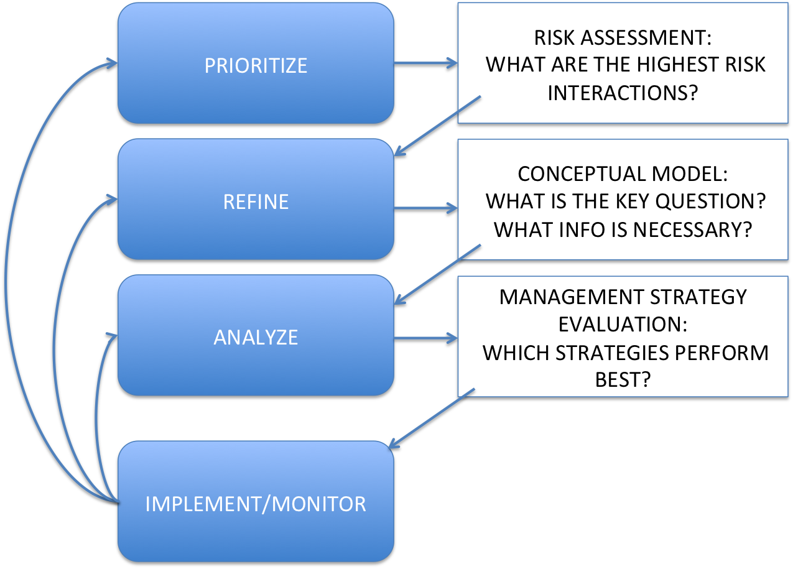

class: top, left

```{r setup, include=FALSE}

options(htmltools.dir.version = FALSE)
knitr::opts_chunk$set(echo = F,
                      warning = F,
                      message = F)
#Plotting and data libraries
library(ggplot2)
library(dplyr)
library(tidyr)
library(here)
library(kableExtra)
library(ggrepel)
library(stringr)
library(patchwork)
library(grid)
library(plotly)
library(vegan)
library(rpart)
library(colorRamps)
library(ecodata)

#GIS libraries
library(sf)
library(rgdal)
#library(raster)
library(rnaturalearth)

data.dir <- here::here("data")


#Time series constants
shade.alpha <- 0.3
shade.fill <- "lightgrey"
lwd <- 1
pcex <- 2
trend.alpha <- 0.5
trend.size <- 2
hline.size <- 1
hline.alpha <- 0.35
hline.lty <- "dashed"
label.size <- 5
hjust.label <- 1.5
letter_size <- 4
feeding.guilds <- c("Apex Predator","Piscivore","Planktivore","Benthivore","Benthos")
x.shade.min <- 2009
x.shade.max <- 2018
map.lwd <- 0.4
#Function for custom ggplot facet labels
label <- function(variable,value){
  return(facet_names[value])
}

#facet names for titles
facet_names <- list("Apex predators" = expression("Apex predators"),
                    "Piscivores" = expression("Piscivores"),
                    "Planktivores" = expression("Planktivores"),
                    "Benthivores" = expression("Benthivores"),
                    "Benthos" = expression("Benthos"))
#CRS
crs <- "+proj=longlat +lat_1=35 +lat_2=45 +lat_0=40 +lon_0=-77 +x_0=0 +y_0=0 +datum=NAD83 +no_defs +ellps=GRS80 +towgs84=0,0,0"

#Coastline shapefile
coast <- ne_countries(scale = 10,
                          continent = "North America",
                          returnclass = "sf") %>%
             sf::st_transform(crs = crs)

#State polygons
ne_states <- ne_states(country = "united states of america",
                                      returnclass = "sf") %>%
  sf::st_transform(crs = crs)

#high-res polygon of Maine
#new_england <- read_sf(gis.dir,"new_england")

#EPU shapefile
epu_sf <- ecodata::epu_sf %>% 
  filter(EPU %in% c("MAB","GB","GOM"))


```

## Outline--remove this boring slide later

.pull-left[
*Review of progress*
- Management Products

- Important Research Results

- Tools available 

- Stuff in develpment

]
.pull-right[
*Practices improving utility for mgt*
- Ecosystem model reviews

- Science-Management collaborations

- Open Science workflows


]


???


---
## Mid-Atlantic Council Ecosystem Approach

* 2016 Ecosystem Approach to Fishery Management (EAFM) Policy Guidance document:
http://www.mafmc.org/s/EAFM-Doc-Revised-2019-02-08.pdf

* Mid-Atlantic EAFM framework<sup>1</sup>:

```{r framework, echo = F, out.width = "60%", fig.align = "center"}

```

Details on development, including workshop presentations and white papers:
http://www.mafmc.org/eafm

.footnote[
[1] Gaichas, S., Seagraves, R., Coakley, J., DePiper, G., Guida, V., Hare, J., Rago, P., et al. 2016. A Framework for Incorporating Species, Fleet, Habitat, and Climate Interactions into Fishery Management. Frontiers in Marine Science, 3.
]


---
## How are they using the risk assessment? What's next?
.pull-left[
* Based on risk assessment, the Council selected summer flounder as high-risk fishery for conceptual modeling

```{r framework2, echo = F, out.width = "90%", fig.align = "center"}

```
]
.pull-right[
* Working group of habitat, biology, stock assessment, management, economic and social scientists developed:

  * draft conceptual models of high risk elements, linkages
  * dataset identification and gap analysis for each element and link
  * draft questions that the Council could persue with additional work
]  
* Final conceptual model and supporting information at December 2019 Council meeting

* Council may then elect to proceed with management strategy evaluation (MSE) using the information from conceptual modeling as a basis


---
```{r sfconceptmod, echo = F, fig.align = "center"}
# setup for conceptual model
PKG <- c(#"foreign","foodweb","sna", "DiagrammeR","circlize", "kableExtra", "googledrive", "readxl"
         "RColorBrewer","QPress",
         "chorddiag")

for (p in PKG) {
  if(!require(p,character.only = TRUE)) {
    install.packages(p)
    require(p,character.only = TRUE)}
}


#assumes this is a project and .dia file is in data directory
edges <- model.dia(file.path(data.dir, "Summer_Flounder_July22_2019.dia"))

source("R/interactive_chord_sfconsmod.R")

interactive_chord_sfconsmod(edges, width=710, height=710, margin=130)

```

---
## Conclusions


---
## Footnote: Improvements to reproducibility and provenance

* Reporting the information is not enough
* Managers appreciate the concise format, but back-end critical for describing collection, analyses, and processing
* Streamlined workflow allowed scientists to meet management deadlines
  
  

???
This workflows also ensures that there's no information lost between SOE cycles. We know exactly how a data set was analyzed and handled so that the data can be updated for next year's reports.

---
## If you want **all** the details

* [Mid-Atlantic Council EAFM paper](https://www.frontiersin.org/articles/10.3389/fmars.2016.00105/full)

* [Mid-Atlantic Council Risk Assessment paper](https://www.frontiersin.org/articles/10.3389/fmars.2016.00105/full)

* [Mid-Atlantic Council Summer Flounder conceptual model and support tables](https://gdepiper.github.io/Summer_Flounder_Conceptual_Models/sfconsmod_riskfactors_subplots.html)

* [2019 Mid-Atlantic State of the Ecosystem report](http://www.mafmc.org/s/SOE-MAFMC-2019.pdf)

* [State of the Ecosystem Technical Documentation](https://noaa-edab.github.io/tech-doc)

* [ecodata R package](https://github.com/noaa-edab/ecodata)

  * [Macrofauna indicators](http://noaa-edab.github.io/ecodata/macrofauna)
  * [Human Dimensions indicators](http://noaa-edab.github.io/ecodata/human_dimensions)
  * [Lower trophic level indicators](http://noaa-edab.github.io/ecodata/LTL)


* Slides available at https://noaa-edab.github.io/presentations


---
# Extra Slides

---
## Standardized indicator visualization in reports

Status (short-term) and trend (long-term) of components are measured as **indicators** and plotted in a standardized way

Indicators are selected to

1. Be broadly informative about a component in a management context<sup>1-3</sup>

1. Minimize redundancy of information

1. Be responsive to ecosystem change


```{r doc-orientation, echo = F, warning = F, message=F, fig.height = 3, fig.width=8, fig.align = "center"}
m <- 0.1
x <- 1989:2018
y <-  m*x + rnorm(30, sd = 0.35)

data <- data.frame(x = x,
                  y = y)

#Define constants for figure plot
x.shade.max <- max(x)
x.shade.min <- x.shade.max - 9 
hline = mean(y)

#Plot series with trend 
ggplot2::ggplot(data = data,aes(x = x, y = y)) +
  #Highlight last ten years
  annotate("rect", fill = shade.fill, alpha = shade.alpha,
      xmin = x.shade.min , xmax = x.shade.max,
      ymin = -Inf, ymax = Inf) +
  geom_point(size = pcex) +
  scale_color_manual(aesthetics = "color")+
  guides(color = FALSE) +
  geom_hline(aes(yintercept = hline),
              size = hline.size,
             alpha = hline.alpha,
             linetype = hline.lty)+
  geom_line() +
  geom_gls() +
  scale_y_continuous(labels = function(l){trans = l / 1000})+
  scale_x_continuous(breaks = seq(1985, 2015, by = 5), expand = c(0.01, 0.01)) +
  ylab(expression("Invented Index, 10"^3*"widgets")) +
  xlab("Year") +
  ggtitle("Indicator Z") +
  theme_ts() +
  theme(plot.title = element_text(size = 16),
        axis.title = element_text(size = 14))
```


.footnote[
[1] Rice J. C.Rochet M. J. "A framework for selecting a suite of indicators for fisheries management." ICES Journal of Marine Science 62 (2005): 516–527.

[2] Link J. 2010. Ecosystem-Based Fisheries Management: Confronting Tradeoffs . Cambridge University Press, New York.

[3] Zador, Stephani G., et al. "Ecosystem considerations in Alaska: the value of qualitative assessments." ICES Journal of Marine Science 74.1 (2017): 421-430.
]

---
## Risk assessent indicators and ranking criteria: System productivity

This element is applied at the ecosystem level, and ranks the risk of not achieving optimum yield due to changes in ecosystem productivity at the base of the food web.

Four indicators are used together to assess risk of changing ecosystem productivity: primary production, zooplankton abundance, fish condition and fish recruitment. 

.table[
```{r riskecop, echo=FALSE, message=FALSE, warnings=FALSE, results='asis'}
tabl <- "
| Risk Level         | Definition                                                          |  
|:-------------------|:--------------------------------------------------------------------|
| Low  | No trends in ecosystem productivity |
| Low-Moderate | Trend in ecosystem productivity (1-2 measures, increase or decrease) |
| Moderate-High | Trend in ecosystem productivity (3+ measures, increase or decrease) |
| High | Decreasing trend in ecosystem productivity, all measures |
"
cat(tabl) # output the table in a format good for HTML/PDF/docx conversion
```
]
???
We examine trends in total primary production, zooplankton abundance for a key Mid-Atlantic species, and two aggregate fish productivity measures: condition factor (weight divided by length of individual fish) and a survey based "recruitment" (small fish to large fish) index.

---
## Risk assessent indicators and ranking criteria: System productivity
.pull-left[
```{r pp-trends, fig.height=4}
out_pp <- ecodata::chl_pp %>% 
  filter(EPU %in% c("MAB", "GOM","GB"),
         str_detect(Var, "MONTHLY_PPD_MEDIAN")) %>% 
  separate(.,Time, into = c("Year","Month"), sep = 4) %>% 
    mutate(Month = plyr::mapvalues(Month, from = c("01","02","03","04","05","06",
                                                   "07","08","09","10","11","12"),
                                   to = c(month.abb))) %>% 
  group_by(EPU, Month) %>% 
  mutate(hline = mean(Value))
out_pp$Month <- factor(out_pp$Month, levels = month.abb)

 
 pp_cci_mab <-out_pp %>% 
  filter(EPU == "MAB") %>% 
 ggplot() +
   # geom_gls(aes(x = Year, y = Value, group = Month))+
    geom_point(aes(x = Year, y = Value, group = Month)) +
    geom_line(aes(x = Year, y = Value, group = Month)) +
    scale_x_discrete(name = "Time", breaks = seq(min(out_pp$Year),max(out_pp$Year),10)) +  
    facet_wrap(Month~., ncol = 6) +
    ggtitle("MAB Monthly median PPD") +
    ylab(expression("PP (gC m"^-2*" d"^-1*")")) +
        geom_hline(aes(yintercept = hline,
                     group = Month),
           size = hline.size,
           alpha = hline.alpha,
           linetype = hline.lty)+
    theme_facet() +
    theme(axis.text.x = element_text(angle=45, hjust = 1),
          panel.spacing = unit(1, "lines"),
          plot.margin = unit(c(0.1, 0, 0, 0), "cm"))
 
 pp_cci_mab 
 
```

```{r fish-con2, fig.align="center"}

```
]

.pull-right[
```{r seasonal-zoo, fig.height=4}
facet_names <- list(
  'centropages spring'=expression(paste(italic("Centropages "), "spring")),
  'centropages fall'=expression(paste(italic("Centropages "), "fall")),
  'temora spring'=expression(paste(italic("Temora "), "spring")),
  'temora fall' = expression(paste(italic("Temora "), "fall")),
  'pseudocalanus spring'=expression(paste(italic("Pseudocalanus "), "spring")),
  'pseudocalanus fall' = expression(paste(italic("Pseudocalanus "), "fall")))

zoo_oi_mab <- ecodata::zoo_oi %>% 
  filter(!str_detect(Var,"SD"),
         EPU == "MAB") %>% 
  
  mutate(Var = str_remove(Var, " zoo"),
         Val2 = exp(Value)) %>% 
      group_by(Var) %>% 
  mutate(hline = mean(Val2, na.rm = T)) %>% 
  separate(.,col = Var, into = c("Species","Season"), remove = F)


top <- zoo_oi_mab %>%  
  filter(Species == "centropages") %>% 

ggplot(aes(x = Time, y = Val2, group = Var)) +
  annotate("rect", fill = shade.fill, alpha = shade.alpha,
      xmin = x.shade.min , xmax = x.shade.max,
      ymin = 0, ymax = Inf) +
  geom_hline(aes(yintercept = hline),
     size = hline.size,
     alpha = hline.alpha,
     linetype = hline.lty)+
  geom_gls() +
  geom_line()+
  geom_point()+
  ylab("") +
  facet_wrap(Var ~ ., ncol = 2, scales='free_x',labeller = label) +
  ggtitle("Zooplankton abundance (OI)") +
  scale_x_continuous(expand = c(0.01, 0.01))+
  scale_y_continuous(trans = "log10")+
  theme_facet() +
    theme(strip.text=element_text(hjust=0,
                                face = "italic"),
          axis.title.x=element_blank(),
        axis.text.x=element_blank(),
        axis.ticks.x=element_blank())

middle <- zoo_oi_mab %>%  
  filter(Species == "pseudocalanus") %>% 
ggplot(aes(x = Time, y = Val2, group = Var)) +
  annotate("rect", fill = shade.fill, alpha = shade.alpha,
      xmin = x.shade.min , xmax = x.shade.max,
      ymin = 0, ymax = Inf) +
  geom_hline(aes(yintercept = hline),
     size = hline.size,
     alpha = hline.alpha,
     linetype = hline.lty)+
  geom_gls() +
  geom_line()+
  geom_point()+
  ylab(expression("Abundance num m"^-3*"")) +
  facet_wrap(Var ~ ., ncol = 2, scales='free_x',labeller = label) +
  scale_x_continuous(expand = c(0.01, 0.01))+
  scale_y_continuous(trans = "log10")+
  theme_facet() +
    theme(strip.text=element_text(hjust=0,
                                face = "italic"),
          axis.title.x=element_blank(),
        axis.text.x=element_blank(),
        axis.ticks.x=element_blank())

bottom <- zoo_oi_mab %>%  
  filter(Species == "temora") %>% 
ggplot(aes(x = Time, y = Val2, group = Var)) +
  annotate("rect", fill = shade.fill, alpha = shade.alpha,
      xmin = x.shade.min , xmax = x.shade.max,
      ymin = 0, ymax = Inf) +
  geom_hline(aes(yintercept = hline),
     size = hline.size,
     alpha = hline.alpha,
     linetype = hline.lty)+
    geom_gls() +
  geom_line()+
  geom_point()+
    ylab("") +
  facet_wrap(Var ~ ., ncol = 2,labeller = label) +
  scale_x_continuous(breaks = seq(1980,2010,10),
                     expand = c(0.01, 0.01))+

  theme_facet() +
    theme(strip.text=element_text(hjust=0,
                                face = "italic")) +
   scale_y_log10()

top + middle + bottom + plot_layout(ncol = 1) & theme(plot.margin = margin(0,0,0,0,"cm"))
```


```{r fish-prod , fig.height=4}
source("R/productivity_plots.R")
prod <- productivity_plots()
prod
```
]

Ranked low-moderate risk due to the significant long term trends in zooplankton abundance for major species (top right plot)


