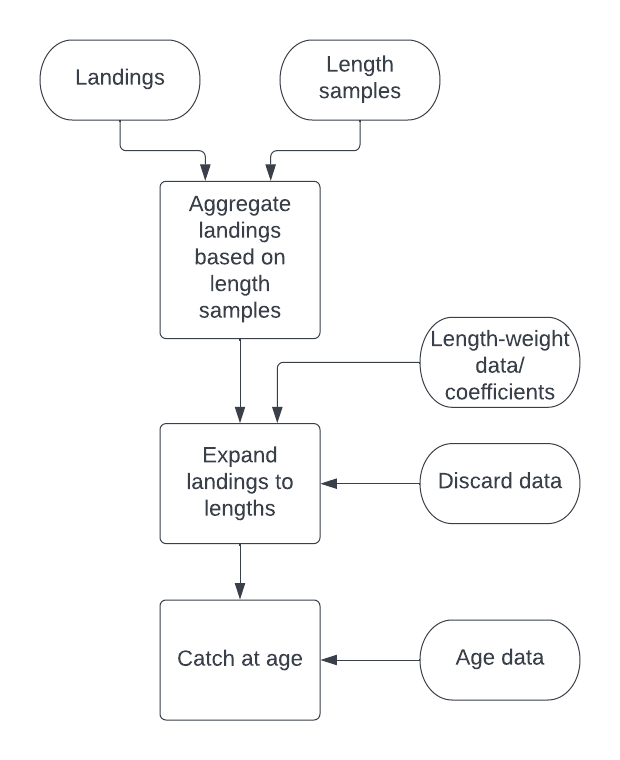

class: monkfish

```{r setup, include=FALSE}

knitr::opts_chunk$set(echo = F,
                      fig.retina = 3,
                      fig.asp = 0.45,
                      warning = F,
                      message = F)


```

```{css, echo = F}
.monkfish {
  position: relative;
  z-index: 1;
}
.monkfish::before {    
      content: "";
      background-image: url("EDAB_images/monkfish.png");
      background-size: cover;
      position: absolute;
      top: 0px;
      right: 0px;
      bottom: 0px;
      left: 0px;
      opacity: 0.5;
      z-index: -1;
}

.cod {
  position: relative;
  z-index: 1;
}
.cod::before {    
      content: "";
      background-image: url("EDAB_images/cod.png");
      background-size: cover;
      position: absolute;
      top: 0px;
      right: 0px;
      bottom: 0px;
      left: 0px;
      opacity: 0.3;
      z-index: -1;
}

.sh {
  position: relative;
  z-index: 1;
}
.sh::before {    
      content: "";
      background-image: url("EDAB_images/silverhake.png");
      background-size: cover;
      position: absolute;
      top: 0px;
      right: 0px;
      bottom: 0px;
      left: 0px;
      opacity: 0.3;
      z-index: -1;
}

.sd {
  position: relative;
  z-index: 1;
}
.sd::before {    
      content: "";
      background-image: url("EDAB_images/spinydogfish.png");
      background-size: cover;
      position: absolute;
      top: 0px;
      right: 0px;
      bottom: 0px;
      left: 0px;
      opacity: 0.3;
      z-index: -1;
}

.haddock {
  position: relative;
  z-index: 1;
}
.haddock::before {    
      content: "";
      background-image: url("EDAB_images/haddock.png");
      background-size: cover;
      position: absolute;
      top: 0px;
      right: 0px;
      bottom: 0px;
      left: 0px;
      opacity: 0.3;
      z-index: -1;
}

.herring {
  position: relative;
  z-index: 1;
}
.herring::before {    
      content: "";
      background-image: url("EDAB_images/herring.png");
      background-size: cover;
      position: absolute;
      top: 0px;
      right: 0px;
      bottom: 0px;
      left: 0px;
      opacity: 0.3;
      z-index: -1;
}

.wf {
  position: relative;
  z-index: 1;
}
.wf::before {    
      content: "";
      background-image: url("EDAB_images/winterflounder.png");
      background-size: cover;
      position: absolute;
      top: 0px;
      right: 0px;
      bottom: 0px;
      left: 0px;
      opacity: 0.5;
      z-index: -1;
}

.yf {
  position: relative;
  z-index: 1;
}
.yf::before {    
      content: "";
      background-image: url("EDAB_images/yellowtailflounder.png");
      background-size: cover;
      position: absolute;
      top: 0px;
      right: 0px;
      bottom: 0px;
      left: 0px;
      opacity: 0.5;
      z-index: -1;
}

.ws {
  position: relative;
  z-index: 1;
}
.ws::before {    
      content: "";
      background-image: url("EDAB_images/winterskate.png");
      background-size: cover;
      position: absolute;
      top: 0px;
      right: 0px;
      bottom: 0px;
      left: 0px;
      opacity: 0.3;
      z-index: -1;
}

.mackerel {
  position: relative;
  z-index: 1;
}
.mackerel::before {    
      content: "";
      background-image: url("EDAB_images/mackerel.png");
      background-size: cover;
      position: absolute;
      top: 0px;
      right: 0px;
      bottom: 0px;
      left: 0px;
      opacity: 0.3;
      z-index: -1;
}

.stockeff {
  position: relative;
  z-index: 1;
}
.stockeff::before {    
      content: "";
      background-image: url("EDAB_images/stockEff.png");
      background-size: cover;
      position: absolute;
      top: 0px;
      right: 0px;
      bottom: 0px;
      left: 0px;
      opacity: 0.2;
      z-index: -1;
}

```


## Background: catch at length/age

.pull-left[

* Determine how landings data are aggregated based on available length samples

* How are missing length samples handled

* Need to recognize species specific rules for calculating catch at length & age
  * life history traits
  * where in time to borrow length samples
  * length-weight relationships
  * Is species aged?

* Need to know data sources

* Initial meeting with Kiersten, Gary, Paul to formulate a set of rules/decision [tree](https://docs.google.com/document/d/1RDhGCKK1HjQ32ymDh9ayZCt6MsHydtu3GHnetGJetUE/edit)

]

.pull-right[
```{r,out.width = "450px"}

```
]

---

## Stock Efficiency 

.pull-left[

* StockEff already does some of this, why reinvent the wheel?
  * Excel template for species to be added to commercial module
  * Creates a record of how data was made

### Why not just use these templates?

* Interest centers on the decision making process prior to entering information into this template

* Multispecies models require data for many species on a different spatial footprint from assessments 

]

.pull-right[
```{r}

```

Template found on [StockEff Confluence](https://www.st.nmfs.noaa.gov/confluence/display/STOCKEFFDOC/Adding+and+Updating+Stocks+in+StockEff)
]

---

## mscatch as an R package

.pull-left[
* Address the decision making process

* Define species specific rules.

* Reproducible with documentation of decisions (Transparency)

* Multispecies length and age based models require data on a different spatial footprint from assessments
  *   Many challenges
  *   Alternate spatial footprints could result in the absence of species data (eg. Mackerel, herring on Georges Bank) 
  *   Encompass multiple species stocks (eg. Winter flounder on Georges Bank)

* Evaluate the performance of multispecies assessment models
]


.pull-right[
```{r, out.width = "300px"}
knitr::include_graphics("EDAB_images/logo.png")
```

[https://noaa-edab.github.io/mscatch/index.html](https://noaa-edab.github.io/mscatch/index.html)

]

---

## Sample output: 

.pull-left[
```{r, out.width = "500px"}

```
]
.pull-right[
```{r, out.width = "500px"}

```

]

---
## Sample output: 

.pull-left[
```{r, out.width = "500px"}

```
]
.pull-right[
```{r, out.width = "500px"}

```

]

---

## Sample output: 

.pull-left[
```{r, out.width = "500px"}
knitr::include_graphics("EDAB_images/3_length_samples.png")

```
]
.pull-right[
```{r, out.width = "500px"}
knitr::include_graphics("EDAB_images/10_market_category_SEMESTER_length_distribution_050.png")
```

]
---

## Sample output: 

.pull-left[
```{r, out.width = "500px"}


```
]
.pull-right[
```{r, out.width = "500px"}

```

]


---
## Walkthrough

.pull-left[

* Currently borrows length samples: 
      * from previous QTR/SEMESTER
      * use nearest neighbor in time
      * use nearest neighbor from another gear type
* uses survey length-weight data to fit relationship
  
* Process for handling missing length samples will be expanded to incorporate today's discussion.
    

]

.pull-right[
```{r, out.width = "620px"}
knitr::include_graphics("EDAB_images/AutomatedWorkflow.png")
```
]

---

class: ws

## Species specific considerations: Rules

* How are gear types aggregated?

* How are market codes aggregated?

* How are landing aggregated temporally? QTR, SEMESTER, ANNUAL?

* What are the rules implemented when length samples are missing?
  * What are the minimum number of samples required?
  * 200 mt landings for every 100 fish lengths measured?
  * borrow samples from nearest neighbor? previous year? within last 5 years?
  * combine temporally?
  * combine gears?
  
  
---
class: ws

## Species specific considerations: Data

* Sources for length-weight data/parameters?
  * From survey and/or commercial?
  * Fit own relationship or use parameters pulled from svdbs database (Wigley et al)
  * How many length-weight relationships are used? QTR, SEMESTER, sex, gear type?

* Sources for discard data?
  * Are length samples available?
  * Add to totals prior to length expansion?

* Sources for age data?
  * From survey and/or commercial?
  * Age-length same level of aggregation or futher aggregate?
  
* Sources for foreign data? 

* What is the first year of data used in assessment?

* Stock area definition? Statistical areas?


---

class: mackerel

## A case study: Mackerel

* All gears combined into a single gear type

* Temporal aggregation: semesters (Jan-Jun, Jul-Dec)

* Market codes: 
  * SQ, ES, SV combined to SMALL
  * MD 
  * XG, JB, LG combined into LARGE

* Missing samples: Borrow sample from previous semester within the same market category
  * 5 year average over both semesters
  * market category time series average

* 6 Length-weight relationships: (3 time intervals per semester)
  *   Fitted to bottom trawl data (after QA/QC for anomalous values)

* Age-length data: from Bottom trawl survey and Commercial data. Combine

* Age-length key: By Year
  
* Start date: 1992 

---

class: yf

## A case study: Yellowtail

* All gears combined into a single gear type

* Temporal aggregation: semesters (Jan-Jun, Jul-Dec)

* Market codes: SQ, MD, PW combined to SMALL, LG

* Missing samples: No Borrowing of samples.
  * Combine Semesters
  * Bump catch at age totals
  
* Length-weight relationships: (Half year)
  * Fitted to bottom trawl data 

* Age-length data: (pooled sexes)
  * US landings from Commercial data.
  * Canadian landings from survey and commercial

* Age-length key: By Half Year
  
* Start date: 1973

---

class: herring

## A case study: Herring

* Landings: from state of Maine

* Gears: Mobile (Trawl, Seines: 170,120,121,122,124,370 + ?), Fixed (all other gear types)

* Temporal aggregation: quarter year

* Market codes: All unclassified

* Missing samples: No Borrowing of samples.
  * Combine quarters to semesters for gear type
  * Combine quarters to Year for gear type

* Length-weight relationships: (same as aggregation)
  * Fitted to commercial length samples 

* Age-length data:
  * Separate database.
  
* Age-length key: Year, Semester, gear type

* Start date: 1965

---

class: wf

## Questions

* What are we missing?

* What diagnostics are useful?

* Helpful to post species specific diagnostics and length and age compositions for feedback


---

class: haddock

## A case study: Haddock

* Landings:

* Gears: combine all gears: otter (050,010,057)

* Temporal aggregation: semester

* Market codes: 
  * LG, XG combined to LG?
  * SR (snapper)
  * SK (scrod)
  
* Missing samples:

* Length-weight relationships: 2 (spring and fall) 
  * survey (2005 data)

* Age-length data:

* Age-length key: 

* Start date: 1964

---

class: cod

## A case study: Cod (GB)

* Landings: East 561-562, West 521-522,525,526,537-539

* Gears: 050, 010 (longline bottom), 100 (Gill net)

* Temporal aggregation: quartely

* Market codes: 

* Missing samples: 
  * pool semester
  * pool annual
  * borrow from adjacent area

* Length-weight relationships: 4 (by semester and region) 
  * survey data (1992-2007)
  * Canadian lw based on Canadian observer (by semester)

* Age-length data:

* Age-length key: 

* minimum number of samples: 2

* Start date: 1981

---

class: wf

## A case study: Winter Flounder (GB)

* Landings: 
  *   522-525, 542,551-552,561-562 

* Gears: 050 (otter)

* Temporal aggregation: quarterly

* Market codes: 
  * LS, XG combined to LS (Lemon sole)
  * LG, LM combined to LG
  * SQ,  MD, PW combinbed SMALL

* Missing samples:

* Length-weight relationships: 

* Age-length data:

* Age-length key: 

* Start date: 1964

---

class: wf

## A case study: Winter Flounder (SNEMA)

* Landings: 
  * 521,526,537,539,611-613 

* Gears: 050 (otter)

* Temporal aggregation: semester

* Market codes: same as GB?


* Missing samples:

* Length-weight relationships: 

* Age-length data:

* Age-length key: from survey

* Start date: 1981

---

class: sd

## A case study: Spiny dogfish

* Landings:

* Gears: 050 (otter), fixed (010,020,100,101)?

* Temporal aggregation: Annual

* Market codes: All unclassified

* Missing samples: 

* Length-weight relationships: 2 (males and females)

* Age-length data: None

* Age-length key: None

* Start date: 

---

class: ws

## A case study: Winter Skate

* Landings: survey proportions applied to skate population

* Gears:

* Temporal aggregation: 

* Market codes: 

* Missing samples:

* Length-weight relationships: 

* Age-length data: None

* Age-length key: None

* Start date: 


---

class: sh

## A case study: Silver hake

* Landings: 

* Gears: 050, + ?

* Temporal aggregation: semester

* Market codes: 
  *   SQ

* Missing samples:
  * combine to year(s)

* Length-weight relationships: 

* Age-length data: survey (1973-2009)

* Age-length key: Borrow ages from adjacent years

* Start date: 1955 

---

class: monkfish

## A case study: Monkfish

* Landings: No age structured assessment

* Gears: 050, 100, 132 

* Temporal aggregation: 

* Market codes: SQ, LG

* Missing samples:

* Length-weight relationships: 

* Age-length data: None

* Age-length key: None 

* Start date: 


