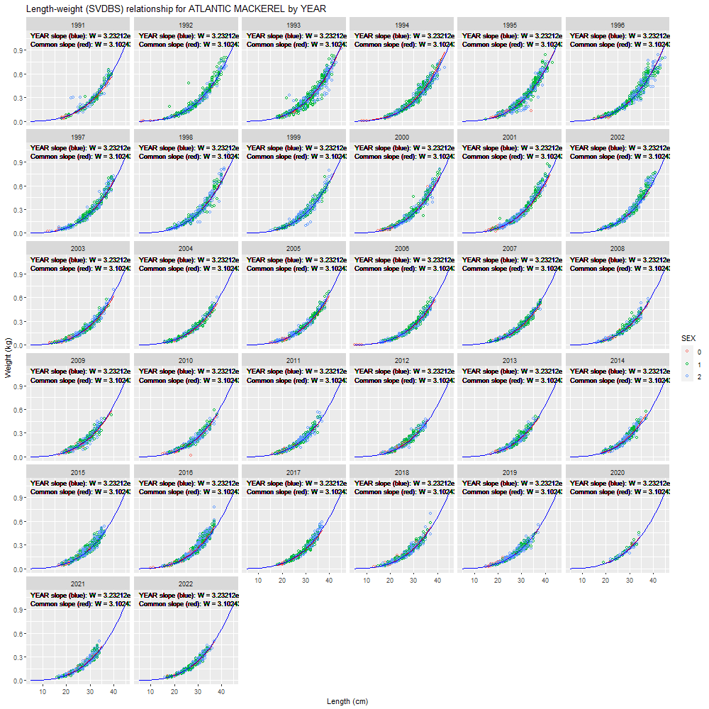

class: monkfish

```{r setup, include=FALSE}

knitr::opts_chunk$set(echo = F,
                      fig.retina = 3,
                      fig.asp = 0.45,
                      warning = F,
                      message = F)


```

```{css, echo = F}
.monkfish {
  position: relative;
  z-index: 1;
}
.monkfish::before {    
      content: "";
      background-image: url("EDAB_images/monkfish.png");
      background-size: cover;
      position: absolute;
      top: 0px;
      right: 0px;
      bottom: 0px;
      left: 0px;
      opacity: 0.5;
      z-index: -1;
}


.herring {
  position: relative;
  z-index: 1;
}
.herring::before {    
      content: "";
      background-image: url("EDAB_images/herring.png");
      background-size: cover;
      position: absolute;
      top: 0px;
      right: 0px;
      bottom: 0px;
      left: 0px;
      opacity: 0.3;
      z-index: -1;
}

.wf {
  position: relative;
  z-index: 1;
}
.wf::before {    
      content: "";
      background-image: url("EDAB_images/winterflounder.png");
      background-size: cover;
      position: absolute;
      top: 0px;
      right: 0px;
      bottom: 0px;
      left: 0px;
      opacity: 0.5;
      z-index: -1;
}

.yf {
  position: relative;
  z-index: 1;
}
.yf::before {    
      content: "";
      background-image: url("EDAB_images/yellowtailflounder.png");
      background-size: cover;
      position: absolute;
      top: 0px;
      right: 0px;
      bottom: 0px;
      left: 0px;
      opacity: 0.5;
      z-index: -1;
}

.ws {
  position: relative;
  z-index: 1;
}
.ws::before {    
      content: "";
      background-image: url("EDAB_images/winterskate.png");
      background-size: cover;
      position: absolute;
      top: 0px;
      right: 0px;
      bottom: 0px;
      left: 0px;
      opacity: 0.3;
      z-index: -1;
}

.mackerel {
  position: relative;
  z-index: 1;
}
.mackerel::before {    
      content: "";
      background-image: url("EDAB_images/mackerel.png");
      background-size: cover;
      position: absolute;
      top: 0px;
      right: 0px;
      bottom: 0px;
      left: 0px;
      opacity: 0.3;
      z-index: -1;
}


```

## Background: Data

* Single species catch at age models require a lot of data. In the Northeast region the assessment scientist is responsible for obtaining and wrangling the data for use in their model. 

  *   This is time consuming 
  *   Many decisions made in the data wrangling process are not uniform across species (data availability, life history)

* Multispecies models (age and length based models) require a similar effort but for many more species.

* Interest centers on the decision making process for wrangling catch data

Goal: Facilitate a reproducible and transparent approach for wrangling multiple species catch data while incorporating many species specific decisions

---

## Background: Data wrangling process

.pull-left[

* Pull landings data and sampled fish length data

* Aggregate landings, by time, gear type, market code (based on availability of sampled fish)

* Fit length-weight relationships

* Expand the catch to length compositions 

* Create age length key 

* Calculate numbers at age and length
]

.pull-right[
```{r,out.width = "450px"}
knitr::include_graphics("EDAB_images/catchExpansion.png")
```
]

---

class: ws

## Species specific considerations: Rules

Need to recognize differences among species.

* How are market codes aggregated?

* How are landing aggregated temporally? QTR, SEMESTER, ANNUAL?

* What are the rules implemented when length samples are missing?
  * Are there a minimum number of samples required?
  * 200 mt landings for every 100 fish lengths measured?
  * Borrow length sample from which time period? 
  * Nearest neighbor? previous year? previous year same semester? within last 5 years? (based on life history?)

* Is species transient, resident, or resident in portion of the area of interest?

* Time scales for length-weight relationships and age-length keys


  
---
class: ws

## Species specific considerations: Data

* Sources for length-weight data/parameters?
  * From survey and/or commercial?
  * Fit own relationship or use parameters pulled from internal database.
  * How many length-weight relationships are used? QTR, SEMESTER, sex, gear type?

* Sources for discard data?
  * Are length samples available?
  * Add to totals prior to length expansion?

* Sources for age data?
  * From survey and/or commercial?

* Sources of landings and length data?
  * From internal NMFS commercial fisheries database, state data, survey data

* Sources for foreign data? 

* Stock area definition? Statistical areas?

---

## mscatch as an R package

.pull-left[
* Address the decision making process

* Define species specific [rules](https://noaa-edab.github.io/ms-keyrun/articles/GBLandingsByLength.html#rules)
  * How to aggregate catch based on availability of length samples by time
  (Quarterly, Semi annually, Yearly)
  * Associated gear types with fleets
  * Market code relabeling
  * Data sources
  * Define length-weight relationship
  * Define age-length key

* Reproducible method

]


.pull-right[
```{r, out.width = "280px"}

```

[https://noaa-edab.github.io/mscatch/index.html](https://noaa-edab.github.io/mscatch/index.html)

]

---


class: mackerel

## A case study: Mackerel

* All gears combined into a single gear type

* Temporal aggregation: semesters (Jan-Jun, Jul-Dec)

* Market codes: 
  * SQ, ES, SV combined to SMALL
  * MD 
  * XG, JB, LG combined into LARGE

* Missing samples: Borrow sample from previous semester within the same market category
  * 5 year average over both semesters
  * market category time series average

* Length-weight relationships: 6 (3 time intervals per semester)
  *   Fitted to bottom trawl data (after QA/QC for anomalous values)

* Age-length data: from Bottom trawl survey and Commercial data. Combine

* Age-length key: By Year
  
* Start date: 1992 

---

## Species Rules

```{r, out.width = "1000px"}
knitr::include_graphics("EDAB_images/speciesTable.png")
```

[https://noaa-edab.github.io/ms-keyrun/articles/GBLandingsByLength.html](https://noaa-edab.github.io/ms-keyrun/articles/GBLandingsByLength.html)

---

## Sample output: Gear


```{r, out.width = "250px"}
knitr::include_graphics("EDAB_images/mackerel1.png")
```


--

.pull-left[
```{r, out.width = "450px"}

```
]

--

.pull-right[
```{r, out.width = "450px"}

```

]

---
## Sample output: Market codes


```{r, out.width = "230px"}
knitr::include_graphics("EDAB_images/mackerel2.png")
```


--

.pull-left[
```{r, out.width = "450px"}
knitr::include_graphics("EDAB_images/2a_landings_by_market_cat.png")
```
]

--
.pull-right[
```{r, out.width = "450px"}

```

]

---
## Sample output: Temporal

```{r, out.width = "230px"}
knitr::include_graphics("EDAB_images/mackerel3.png")
```

--

.pull-left[
```{r, out.width = "450px"}


```
]

--

.pull-right[
```{r, out.width = "450px"}

```
]

---

## Sample output: Length-Weight relationships

.pull-left[
```{r, out.width = "500px"}


```
]
.pull-right[
```{r, out.width = "500px"}

```

]

---
class: yf

## To Do

* Data pull from [`comlandr`](https://noaa-edab.github.io/comlandr/) for both landings (domestic + foreign), discards, lengths

* QA/QC code to detect and remove anomalous values

* More flexibility in species options

* Additional diagnostics and figures

---

---

## Walkthrough: Aggregating data


```{r, out.width = "640px", fig.align='center'}

```

---