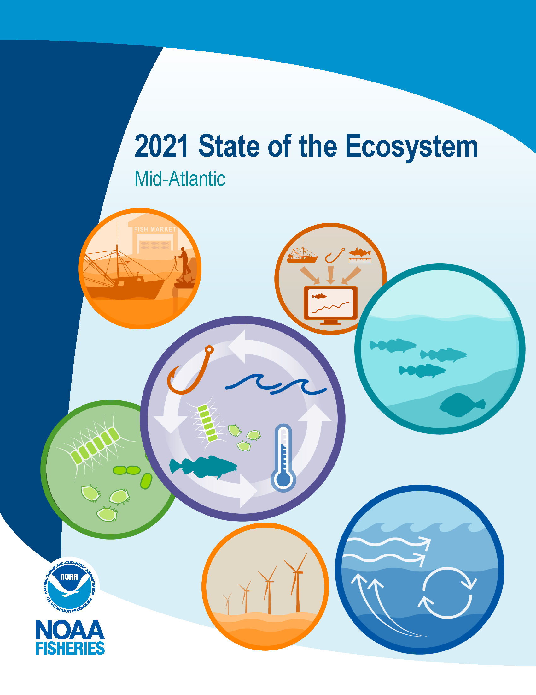
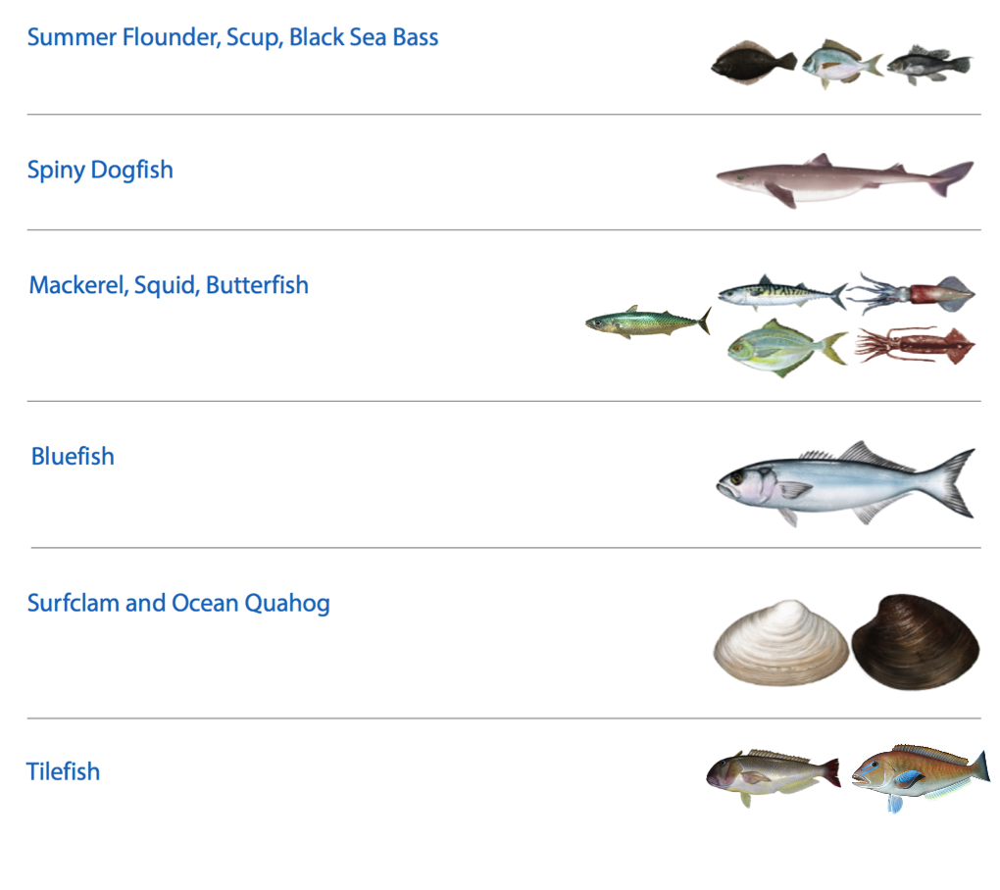
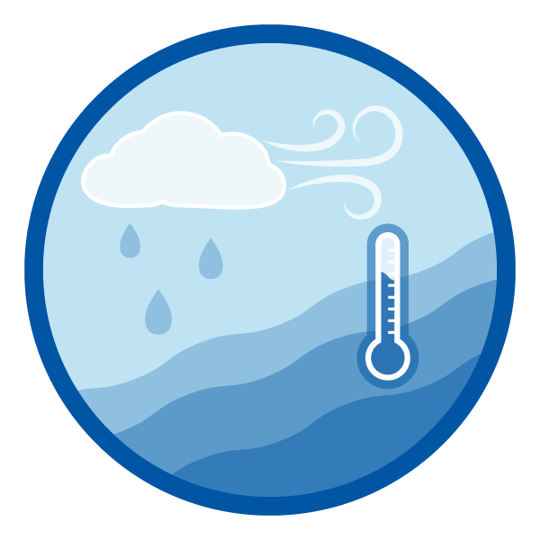

class: top, left

<style>
p.caption {
  font-size: 0.6em;
}
</style>

```{r setup, include=FALSE}

options(htmltools.dir.version = FALSE)
knitr::opts_chunk$set(echo = F,
                      fig.retina = 3,
                      #fig.width = 4,
                      #fig.height = 2,
                      fig.asp = 0.45,
                      warning = F,
                      message = F)
#Plotting and data libraries
library(tidyverse)
library(tidyr)
library(here)
library(kableExtra)
library(ecodata)
library(readxl); library(data.table)
library(DT)
library(widgetframe)


```

```{r, load_refs, include=FALSE, cache=FALSE}
library(RefManageR)
BibOptions(check.entries = FALSE,
           bib.style = "authoryear",
           cite.style = "authoryear",
           longnamesfirst = FALSE,
           max.names = 1,
           style = "markdown")
myBib <- ReadBib("./MidSOE.bib", check = FALSE)

#,
#           hyperlink = FALSE,
#           dashed = FALSE

```

```{r, code = readLines("https://raw.githubusercontent.com/NOAA-EDAB/ecodata/master/chunk-scripts/human_dimensions_MAB.Rmd-setup.R")}
```

```{r, code = readLines("https://raw.githubusercontent.com/NOAA-EDAB/ecodata/master/chunk-scripts/human_dimensions_MAB.Rmd-GIS-setup.R")}
```

```{r, code = readLines("https://raw.githubusercontent.com/NOAA-EDAB/ecodata/master/chunk-scripts/macrofauna_MAB.Rmd-setup.R")}
```

```{r, code = readLines("https://raw.githubusercontent.com/NOAA-EDAB/ecodata/master/chunk-scripts/LTL_MAB.Rmd-setup.R")}
```

## Talk outline:


* Background on the Mid-Atlantic Fishery Management Council (MAFMC) 
* MAFMC [strategic plan](https://www.mafmc.org/strategic-plan) prioritizes “development of ecosystem approaches that are responsive to the effects of climate change”
* MAFMC's [Ecosystem Approach to Fishery Management](https://www.mafmc.org/eafm) (EAFM) process integrates climate with other Council concerns and priorities
* [Ecosystem reporting](https://www.fisheries.noaa.gov/new-england-mid-atlantic/ecosystems/state-ecosystem-reports-northeast-us-shelf): one stop shopping for current conditions and recent research, presented annually and used to update risk assessment--evolving to better meet Council needs. 
* Current/future: [East coast climate scenario planning](https://www.mafmc.org/climate-change-scenario-planning), [NOAA Climate Fisheries Initiative](https://www.fisheries.noaa.gov/topic/climate-change#noaa-climate-and-fisheries-initiative) for forecasts
* Success hinges on collaboration, stakeholder engagement throughout, learning by doing

.center[

]

???
EAFM approach
   * Climate in risk assessment--uses NCVA, distribution shifts separate element
   * Climate in conceptual model--links across risk elements for individual species
   * Climate in MSE? Indirect, but not off the table (unlike “traditional” MSE)
Ecosystem reporting
   * Climate a central theme in 2021 in response to Council request
   * More effort to connect climate attributes with species outcomes to refine risk assessment
   * Habitat climate vulnerability introduced with links to species
   * All will be used to further refine the risk assessment
   * Currently working on how to use in SSC decisions like OFL CV → ABC


---
## The Mid-Atlantic Fishery Management Council (MAFMC)

.pull-left-30[

]
.pull-right-70[

]

---
## How did MAFMC develop their ecosystem approach?

Visioning Project &rarr; [Strategic Plan](https://www.mafmc.org/strategic-plan) that developed the 2016 Ecosystem Approach to Fishery Management (EAFM) Policy Guidance document:
http://www.mafmc.org/s/EAFM-Doc-Revised-2019-02-08.pdf
>"A non-regulatory umbrella document intended to guide Council policy with respect to ecosystem considerations across existing Fishery Management Plans"

.center[

]

Details, including workshop presentations and white papers: http://www.mafmc.org/eafm

???
The Mid-Atlantic Council identified several theme areas from the visioning project as noted in the left panel of the workflow graphic: forage fish, species interactions, social and economic issues, climate and habitat. The Council held full day workshops during Council meetings where experts on the topics provided overviews and Council members asked questions and discussed the issues. Workships on Forage fish, Climate, Climate and Governance, Interactions (species and fleet), and Habitat were held between 2013 and 2015, resulting in white papers on Forage fish, Climate (and habitat), Interactions (species, fleet, climate, and habitat). Social and economic considerations were integrated in each workshop rather than looked at separately.
---
## Integrated Ecosystem Assessment and the MAFMC Ecosystem Approach

.pull-left[

.footnote[
https://www.integratedecosystemassessment.noaa.gov/national/IEA-approach
]
]
.pull-right[

   * Direct link between ecosystem reporting and risk assessment
   * Climate in risk assessment from species and habitat perspective
   * Climate in conceptual model linking across risk elements for individual species
.footnote[
https://www.mafmc.org/eafm
]
]
???
The Council’s EAFM framework has similarities to the IEA loop. It uses risk assessment as a first step to prioritize combinations of managed species, fleets, and ecosystem interactions for consideration. Second, a conceptual model is developed identifying key environmental, ecological, social, economic, and management linkages for a high-priority fishery. Third, quantitative modeling addressing Council-specified questions and based on interactions identified in the conceptual model is applied to evaluate alternative management strategies that best balance management objectives. As strategies are implemented, outcomes are monitored and the process is adjusted, and/or another priority identified in risk assessment can be addressed. 

---

# State of the Ecosystem (SOE) reporting
## Improving ecosystem information and synthesis for fishery managers

.pull-left-70[

- Ecosystem indicators linked to management objectives `r Cite(myBib, "depiper_operationalizing_2017")`
    + Contextual information
    + Report evolving since 2016
    + Fishery-relevant subset of full Ecosystem Status Reports

- Open science emphasis `r Cite(myBib, "bastille_improving_2021")`

- Used within Mid-Atlantic Fishery Management Council's Ecosystem Process `r Cite(myBib, "muffley_there_2021")`
    + Risk assessment `r Cite(myBib,"gaichas_implementing_2018")`
    + Conceptual modeling `r Cite(myBib,"depiper_learning_2021")`
    + Management strategy evaluation (MSE)

 
]

.pull-right-30[


]
???

---
## State of the Ecosystem summary emphasizing climate risk

.pull-left[
.center[

]
]

.pull-right[
.center[

]
]


---
## State of the Ecosystem &rarr; Risk assessent example: Commercial revenue

This element is applied at the ecosystem level. Revenue serves as a proxy for commercial profits.

.pull-left[
.table[
```{r riskcomval, echo=FALSE, message=FALSE, warnings=FALSE, results='asis'}
# tabl <- "
# | Risk Level         | Definition                                                          |  
# |:-------------------|:--------------------------------------------------------------------|
# | Low  | No trend and low variability in revenue |
# | Low-Moderate | Increasing or high variability in revenue |
# | Moderate-High | Significant long term revenue decrease |
# | High | Significant recent decrease in revenue |
# "
# cat(tabl) # output the table in a format good for HTML/PDF/docx conversion

tabl <- data.frame("Risk Level" = c("Low", "Low-Moderate", "Moderate-High", "High"),
                   "Definition" = c("No trend and low variability in revenue",
                                    "Increasing or high variability in revenue",
                                    "Significant long term revenue decrease",
                                    "Significant recent decrease in revenue"))

knitr::kable(tabl, format="html",
             col.names = c("Risk Level", "Definition"),
                           booktabs = T) %>%
  #kable_styling(full_width = TRUE) %>%
  column_spec(1:2, width = "20em")%>%
  row_spec(3, bold = T, background = "orange")
```

Ranked moderate-high risk due to the significant long term revenue decrease for Mid-Atlantic managed species (red points)
]]  
.pull-right[
```{r , code = readLines("https://raw.githubusercontent.com/NOAA-EDAB/ecodata/master/chunk-scripts/human_dimensions_MAB.Rmd-comdat-comm-revenue.R"),fig.asp = 0.5}
#comm-revenue, fig.width = 4, fig.asp = 0.45, fig.cap = "Total revenue for the region (black) and revenue from MAFMC managed species (red)."
```
.table[
Key: Black = Revenue of all species combined; <p style="color:#FF6A6A;">Red = Revenue of MAFMC managed species</p>
]]  
  
--

## Risk element: <span style="background-color:orange;">CommRev</span>, unchanged  

**SOE Implications:** Recent change driven by benthos. Monitor changes in climate and landings drivers:  
-  Climate risk element: <span style="background-color:orange;">Surfclams</span> and <span style="background-color:red;">ocean quahogs</span> are sensitive to ocean warming and acidification.   
-  pH in surfclam summer habitat is approaching, but not yet at, pH affecting surfclam growth


---
# Risks to meeting fishery management objectives

.center[
 &nbsp; &nbsp; &nbsp; 
] 

.center[
 &nbsp; &nbsp; &nbsp;  &nbsp; &nbsp; &nbsp;  &nbsp; &nbsp; &nbsp;   &nbsp; &nbsp; &nbsp;  
]


---
background-image: url("EDAB_images/SST2020seasonalmaps.png")
background-size: 700px
background-position: right top

## Risks: Climate change, multiple elements
.pull-left[
Indicators: ocean currents, bottom and surface temperature, marine heatwaves
```{r, code = readLines("https://raw.githubusercontent.com/NOAA-EDAB/ecodata/master/chunk-scripts/LTL_MAB.Rmd-gsi.R"), fig.width=4}
```


```{r, code =readLines("https://raw.githubusercontent.com/NOAA-EDAB/ecodata/master/chunk-scripts/LTL_MAB.Rmd-bottom-temp.R"), fig.width=4}

```

```{r, code = readLines("https://raw.githubusercontent.com/NOAA-EDAB/ecodata/master/chunk-scripts/LTL_MAB.Rmd-heatwave.R")}
```
]

.pull-right[

&nbsp;  
&nbsp;  
&nbsp; 
&nbsp; 
&nbsp;  
&nbsp;  
&nbsp;  
&nbsp; 
&nbsp;  
&nbsp;  
&nbsp; 
&nbsp;  
&nbsp; 
&nbsp;  
&nbsp;  
&nbsp; 
&nbsp;  
&nbsp;  

```{r , code=readLines("https://raw.githubusercontent.com/NOAA-EDAB/ecodata/master/chunk-scripts/LTL_MAB.Rmd-heatwave-year.R"), fig.width=5, fig.asp=.6}
#heatwave-year, fig.cap="Marine heatwave events (red) in the Mid-Atlantic occuring in 2020."
```

]
???
A marine heatwave is a warming event that lasts for five or more days with sea surface temperatures above the 90th percentile of the  historical daily climatology (1982-2011). 

---
## Implications: Climate change and managed species &emsp; Risk elements unchanged, new info:
.pull-left[
Climate: 6 <span style="background-color:lightgreen;">low</span>, 3 <span style="background-color:yellow;">low-mod</span>, 4 <span style="background-color:orange;">mod-high</span>, 1 <span style="background-color:red;">high</span> risk

*Multiple drivers with different impacts by species*    
* Chesapeake Bay warm winter, low freshwater flow  
    - Striped bass poor recruitment observed  
        - plankton prey too early?  
        - poor plankton transport?  
    - Blue crab better survival over winter  
    
* Ocean acidification impact on shellfish growth  
    - Surfclams vulnerable to increased temperature and acidification  
    - Areas of low pH identified in surfclam and scallop habitat  
    - Lab work in progress identified pH thresholds for surfclam growth: *approaching threshold*   


]

.pull-right[
DistShift: 2 <span style="background-color:lightgreen;">low</span>, 9 <span style="background-color:orange;">mod-high</span>, 3 <span style="background-color:red;">high</span> risk species

Shifting species distributions alter both species interactions, fishery interactions, and expected management outcomes from spatial allocations and bycatch measures based on historical fish and protected species distributions.  
.center[

]
]

---
## Risks: Habitat climate vulnerability &emsp; New, opportunity to refine habitat risks

Indicators: climate sensitive species life stages mapped to climate vulnerable habitats  

*See EAFM risk assessment for example species narratives*  
```{r midHabTable, message=FALSE}
#Read in Mid-Atlantic table

src <- "https://github.com/NOAA-EDAB/ecodata/raw/master/data-raw/habitat_vulnerability.xlsx"
lcl <- basename(src)
download.file(url = src, destfile = lcl, quiet=TRUE)

mid <- as.data.table(readxl::read_xlsx(here('habitat_vulnerability.xlsx'),
                         sheet = 'Mid-Atlantic', skip = 1))

if (file.exists(lcl)) {
  #Delete file if it exists
  invisible(file.remove(lcl))
}

#Identify individual species climate vulnerability
vhigh.vul <- unique(mid[`Species Vulnerability Rank (FCVA)` == 'Very high', Species])
high.vul  <- unique(mid[`Species Vulnerability Rank (FCVA)` == 'High', Species])
mod.vul   <- unique(mid[`Species Vulnerability Rank (FCVA)` == 'Moderate', Species])
low.vul   <- unique(mid[`Species Vulnerability Rank (FCVA)` == 'Low', Species])

#Grab habitat vulnerability 
hab.vul <- unique(mid[, c('Habitat Name', 'Habitat Vulnerability Rank (HVCA)')])
habitats <- hab.vul[, 'Habitat Name']
hab.vul <- data.table('Habitat Vulnerability' = c(NA, NA, t(hab.vul[, 'Habitat Vulnerability Rank (HVCA)'])))

#Rearrange table
mid <- data.table::melt.data.table(mid, id.vars = c('Habitat Name', 'Species'),
                                   measure.vars = c('Eggs/Larva', 'Juvenile/YOY',
                                                    'Adult', 'Spawning Adult'),
                                   variable.name = 'Stage', value.name = 'Dependence')
mid[, Habitat := as.factor(mid$'Habitat Name')]
mid <- data.table::dcast.data.table(mid, Species + Stage ~ Habitat,
                                    value.var = 'Dependence')
setcolorder(mid, c('Species', 'Stage', habitats$'Habitat Name'))

#Add Habitat Vulnerability
#hab.table <- rbindlist(list(as.data.table(t(hab.vul)), mid), use.names = F)
hab.table <- mid
#Add names back in
names(hab.table) <- names(mid)
hab.table <- hab.table %>% mutate_if(is.character, str_trim)

#from examples here https://rstudio.github.io/DT/010-style.html

#color coding cells works
#need to add column with species vulnerability and color code species by it but not show it, like #hideV6 example at link
#if we show it we can sort by species vulnerability though... alphabetical doesnt work so use numbers to go lowest-highest
#still need to color code headers
hab.table <- hab.table %>%
  mutate(spVul = #Color code species based on climate vul
    # case_when(Species %in% low.vul ~ "low.vul",
    #           Species %in% mod.vul ~ "mod.vul",
    #           Species %in% high.vul ~ "high.vul",
    #           Species %in% vhigh.vul ~ "vhigh.vul")
    # )
    case_when(Species %in% low.vul ~ 1,
              Species %in% mod.vul ~ 2,
              Species %in% high.vul ~ 3,
              Species %in% vhigh.vul ~ 4)
    )

colnames(hab.table)[c(3:4)] <- paste0('<span style="box-shadow: -10px 0 0 red, 10px 0 0 red; background-color:red; color:white">',colnames(hab.table)[c(3:4)],'</span>')
colnames(hab.table)[c(5:10)] <- paste0('<span style="box-shadow: -10px 0 0 orange, 10px 0 0 orange; background-color:',c("orange"),'">',colnames(hab.table)[c(5:10)],'</span>')
colnames(hab.table)[c(11:15)] <- paste0('<span style="box-shadow: -10px 0 0 yellow, 10px 0 0 yellow; background-color:',c("yellow"),'">',colnames(hab.table)[c(11:15)],'</span>')

dt <- datatable(hab.table, rownames = FALSE, escape = FALSE,
          extensions = c('Scroller', 'FixedColumns'), #add scrolling and fixed column
          options = list(deferRender = TRUE,
          scrollY = 300, scroller = TRUE,
          dom = 't',scrollX = TRUE,fixedColumns = TRUE)
          #, options = list(columnDefs = list(list(targets = 16, visible = FALSE)))
  ) %>% 
  formatStyle(
    names(hab.table)[3:4],
    backgroundColor = '#FF000080'
  ) %>%
  formatStyle(
    names(hab.table)[5:10],
    backgroundColor = '#FFA50080'
  ) %>%
  formatStyle(
    names(hab.table)[11:15],
    backgroundColor = '#FFFF0080'
  ) %>%

  formatStyle(#Color code base on dependence
    'Species', "spVul",
    backgroundColor = styleEqual(#c("low.vul", "mod.vul", "high.vul", "vhigh.vul"),
                                 c(1,2,3,4),
                                 c('lightgreen', 'yellow', 'orange', 'red')), #Color code base on dependence)
    color = styleEqual(c(1,2,3,4),
                                 c('black', 'black', 'black', 'white'))
    ) %>%
    formatStyle(
    names(hab.table),
    backgroundColor = styleEqual(c("Low", "Moderate", "High", "Very high"), 
                                 c('lightgreen', 'yellow', 'orange', 'red')), 
    color = styleEqual(c("Low", "Moderate", "High", "Very high"), 
                                 c('black', 'black', 'black', 'white'))
  )

frameWidget(dt)
```


---
## EAFM Risk Assessment: 2021 Update

.pull-left[
*Species level risk elements*
```{r sptable}
#tab.cap="Species level risk analysis results; l=low risk (green), lm= low-moderate risk (yellow), mh=moderate to high risk (orange), h=high risk (red)\\label{sptable}",

# spplist     oc,  sc,  flk, scp, bsb, mack, but, lsq, ssq, gtile,  btile,  blu, dog, monk
risk.species<-data.frame(
  Species = c("Ocean Quahog", "Surfclam", "Summer flounder", "Scup", "Black sea bass", "Atl. mackerel", "Butterfish", "Longfin squid", "Shortfin squid", "Golden tilefish", "Blueline tilefish", "Bluefish", "Spiny dogfish", "Monkfish", "Unmanaged forage", "Deepsea corals"),
  Assess  = c("l", "l", "l",  "l", "l", "l",  "l", "lm", "lm", "l", "h", "l", "lm", "h", "na", "na"),
  Fstatus = c("l", "l", "l", "l", "l", "h", "l", "lm", "lm", "l", "h", "l", "l", "lm", "na", "na"),
  Bstatus = c("l", "l", "lm", "l", "l", "h", "lm", "lm", "lm", "lm", "mh", "h", "lm", "lm", "na", "na"),
  FW1Pred = c("l", "l", "l", "l", "l", "l", "l", "l", "l", "l", "l", "l", "l", "l", "l", "l"),
  FW1Prey = c("l", "l", "l", "l", "l", "l", "l", "l", "l", "l", "l", "l", "l", "l", "lm", "l"),
  FW2Prey = c("l", "l", "l", "l", "l", "l", "l", "lm", "lm", "l", "l", "l", "l", "l", "lm", "l"),
  Climate = c("h", "mh", "lm", "lm", "mh", "lm", "l", "l", "l", "mh", "mh","l", "l", "l", "na", "na"),
  DistShift = c("mh", "mh", "mh", "mh", "mh", "mh", "h", "mh", "h", "l", "l", "mh", "h", "mh", "na", "na"),
  EstHabitat = c("l", "l", "h", "h", "h", "l", "l", "l", "l", "l", "l", "h", "l", "l", "na", "na")#,
#  OffHabitat = c("na", "na", "l", "l", "l", "l", "l", "l", "h", "na", "na", "na", "l", "l", "na", "na")#,
)

# these elements were removed by the council
#  PopDiv = c("na", "na", "na", "na", "na", "na", "na", "na", "na", "na", "na", "na", "na", "na"),
#  FoodSafe = c(),

# one column test
# risk.species %>%
#   mutate(Fstatus = 
#     cell_spec(Fstatus, format="latex", color = "black", align = "c", background =factor(Fstatus, c("na", "l", "lm", "mh", "h"),c("white", "green", "yellow", "orange", "red")))) %>%
#   kable(risk.species, format="latex", escape = F, booktabs = T, linesep = "")

#convert to longer text for consistency and display in html table
risk.species <- risk.species %>%
     mutate_at(vars(-Species), function(x){
       recode(x,'l'="lowest",'lm'="lowmod",'mh'="modhigh",'h'="highest")}) %>%
     as.data.frame()

#generalize to all
risk.species %>%
  mutate_at(vars(-Species), function(x){ 
    cell_spec(x, format="html", color = factor(x, c("na", "lowest", "lowmod", "modhigh", "highest"),c("black", "black", "black", "black", "white")), align = "c", background =factor(x, c("na", "lowest", "lowmod", "modhigh", "highest"),c("white", "lightgreen", "yellow", "orange", "red")), background_as_tile=F)}) %>%
  kable(format = "html", escape = F, table.attr='class="risktable"') %>%
  kable_styling(font_size = 9) 
```
.contrib[
* Butterfish B status risk increased from lowest to low-mod (below Bmsy)
]  

*Ecosystem level risk elements*
```{r ecotable}
#tab.cap="Ecosystem level risk analysis results; l=low risk (green), lm= low-moderate risk (yellow), mh=moderate to high risk (orange), h=high risk (red)\\label{sptable}",

risk.eco<-data.frame(
  System = c("Mid-Atlantic"),
  EcoProd = c("lm"),
  #EcoDiv = c("lm"),
  CommRev = c("mh"),
  RecVal = c("h"),
  FishRes1 = c("l"),
  FishRes4 = c("mh"),
  #CommJobs = c("mh"),
  #RecJobs = c("l"),
  FleetDiv = c("l"),
  Social = c("lm"),
  ComFood = c("h"),
  RecFood = c("mh")
)

#convert to longer text for consistency and display in html table
risk.eco <- risk.eco %>%
     mutate_at(vars(-System), function(x){
       recode(x,'l'="lowest",'lm'="lowmod",'mh'="modhigh",'h'="highest")}) %>%
     as.data.frame()

#make table
risk.eco %>%
  mutate_at(vars(-System), function(x){ 
    cell_spec(x, format="html", color = factor(x, c("na", "lowest", "lowmod", "modhigh", "highest"),c("black", "black", "black", "black", "white")), align = "c", background =factor(x, c("na", "lowest", "lowmod", "modhigh", "highest"),c("white", "lightgreen", "yellow", "orange", "red")), background_as_tile=F)}) %>%
  kable(format = "html", escape = F, table.attr='class="risktable"') %>%
  kable_styling(font_size = 9) 

```
]  

.pull-right[ 
*Species and Sector level risk elements*
```{r mgttable,  echo=FALSE, message=FALSE, warnings=FALSE}
#tab.cap="Species and sector level risk analysis results; l=low risk (green), lm= low-moderate risk (yellow), mh=moderate to high risk (orange), h=high risk (red)\\label{sptable}",

risk.sppsector<-data.frame(
  Species = c("Ocean Quahog-C", "Surfclam-C", "Summer flounder-R", "Summer flounder-C","Scup-R", "Scup-C","Black sea bass-R", "Black sea bass-C","Atl. mackerel-R", "Atl. mackerel-C","Butterfish-C", "Longfin squid-C", "Shortfin squid-C", "Golden tilefish-R", "Golden tilefish-C","Blueline tilefish-R","Blueline tilefish-C", "Bluefish-R", "Bluefish-C","Spiny dogfish-R", "Spiny dogfish-C", "Chub mackerel-C", "Unmanaged forage", "Deepsea corals"),
  MgtControl = c(1,1,3,2,2,1,4,4,2,1,1,1,2,9,1,1,1,2,1,1,1,1,1,9),
  TecInteract = c(1,1,1,3,1,2,1,2,1,2,2,3,2,1,1,1,1,1,1,1,3,2,1,9),
  OceanUse = c(2,2,2,2,2,3,3,4,1,3,3,4,2,1,1,1,1,1,2,1,3,2,3,3),
  RegComplex = c(1,1,3,3,3,3,3,3,1,4,4,4,2,1,1,3,3,2,2,1,3,2,1,9),
  Discards = c(3,3,4,3,3,3,4,4,1,2,3,4,1,1,1,1,1,3,2,1,2,1,1,9),
  Allocation = c(1,1,4,4,4,4,4,4,1,4,1,1,1,1,1,4,4,4,4,1,1,1,1,9) 
)


#convert to text for consistency
risk.sppsector <- risk.sppsector %>%
     mutate_at(vars(-Species), function(x){
       recode(x,'1'="lowest",'2'="lowmod",'3'="modhigh",'4'="highest",'9'="na")}) %>%
     as.data.frame()

#make table
risk.sppsector %>%
  mutate_at(vars(-Species), function(x){ 
    cell_spec(x, format="html", color = factor(x, c("na", "lowest", "lowmod", "modhigh", "highest"),c("black", "black", "black", "black", "white")), align = "c", background =factor(x, c("na", "lowest", "lowmod", "modhigh", "highest"),c("white", "lightgreen", "yellow", "orange", "red")), background_as_tile=F)}) %>%
  kable(format = "html", escape = F, table.attr='class="risktable"') %>%
  kable_styling(font_size = 11) 

```
.contrib[
* Allocation risk decreased for 4 fisheries from high to low (intermediate rankings not applied) 
* Black sea bass regulatory complexity risk decreased from highest to mod-high  
]
]


???
Changes:
Butterfish B status risk increased from lowest to low-mod (below Bmsy)
Allocation risk decreased for 4 fisheries from high to low (intermediate rankings not applied)
Black sea bass regulatory complexity risk decreased from highest to moderate-high

Potential new indicators from new SOE sections on climate risk, habitat vulnerability, offshore wind

Habitat vulnerability analysis writeups--comments?

---
## How is MAFMC using the risk assessment? What's next?
.pull-left[
* Based on risk assessment, the Council selected summer flounder as high-risk fishery for conceptual modeling


]
.pull-right[
* Working group of habitat, biology, stock assessment, management, economic and social scientists developed:

  * draft conceptual models of high risk elements, linkages
  * dataset identification and gap analysis for each element and link
  * draft questions that the Council could persue with additional work
 
* Final conceptual model and supporting information at December 2019 Council meeting
] 

* Council proceeding with management strategy evaluation (MSE) using the information from conceptual modeling as a basis. Topic: addressing recreational fishery discards with EAFM


---
```{r sfconceptmod, echo = F, fig.align = "center"}
# setup for conceptual model
PKG <- c(#"foreign","foodweb","sna", "DiagrammeR","circlize", "kableExtra", "googledrive", "readxl"
         "RColorBrewer","QPress",
         "chorddiag",
         "widgetframe")

for (p in PKG) {
  if(!require(p,character.only = TRUE)) {
    install.packages(p)
    require(p,character.only = TRUE)}
}

data.dir <- here::here("data")

#assumes this is a project and .dia file is in data directory
edges <- model.dia(file.path(data.dir, "Summer_Flounder_July22_2019.dia"))

source("R/interactive_chord_sfconsmod.R")

conmod <- interactive_chord_sfconsmod(edges, width=710, height=710, margin=130)

frameWidget(conmod)

```
???
In this interactive circular graph visualization, model elements identified as important by the Council (through risk assessment) and by the working group (through a range of experience and expertise) are at the perimeter of the circle. Elements are defined in detail in the last section of [this page](https://gdepiper.github.io/Summer_Flounder_Conceptual_Models/sfconsmod_riskfactors_subplots.html). Relationships between elements are represented as links across the center of the circle to other elements on the perimeter. Links from a model element that affect another element start wide at the base and are color coded to match the category of the element they affect.Hover over a perimeter section (an element) to see all relationships for that element, including links from other elements. Hover over a link to see what it connects. Links by default show text for the two elements and the direction of the relationship (1 for relationship, 0 for no relationship--most links are one direction).For example, hovering over the element "Total Landings" in the full model shows that the working group identified the elements affected by landings as Seafood Production, Recreational Value, and Commercial Profits (three links leading out from landings), and the elements affecting landings as Fluke SSB, Fluke Distributional Shift, Risk Buffering, Management Control, Total Discards, and Shoreside Support (6 links leading into Total Landings).

---
## Current and Future: East Coast Climate Scenario Planning, NOAA Climate and Fisheries Initiative

.pull-left-40[

.footnote[
https://www.mafmc.org/climate-change-scenario-planning
]
]
.pull-right-60[


.footnote[
https://www.fisheries.noaa.gov/topic/climate-change#noaa-climate-and-fisheries-initiative
]
]

???
A Climate Fisheries Initiative within NOAA aims to improve regional ocean modeling capabilities and develop interdisciplinary communities of practice--including managers--that will be essential to operational ecological forecasts. Finally, the iterative, collaborative IEA process itself provides opportunities to prioritize which ecological forecasts to develop.

---
# Collaboration is key!

* Within the science community – diverse expertise is needed  
* Between science and management – understanding what information is needed and important to management, providing tools to management to understand ecosystem linkages and implications  
* Between science and stakeholders – need to build trust, open dialogue (everyone is heard), and sharing data and observations (on water and with information)  
* Between management and stakeholders – listening to/acting on stakeholder priorities and feedback, process not out to add more uncertainty but provide for more informed decisions 


---
background-image: url("EDAB_images/noaa-iea.png")
background-size: 350px
background-position: right bottom

## Contributors - THANK YOU!

The New England and Mid-Atlantic SOEs made possible by (at least) 52 contributors from 10 institutions 

.pull-left[
.contrib[
Andy Beet<br>
Kimberly Bastille<br>
Ruth Boettcher (Virginia Department of Game and Inland Fisheries)<br>
Mandy Bromilow (NOAA Chesapeake Bay Office)<br>
Zhuomin Chen (Woods Hole Oceanographic Institution)<br>
Joseph Caracappa<br>
Doug Christel (GARFO)<br>
Patricia Clay<br>
Lisa Colburn<br>
Jennifer Cudney (NMFS Atlantic HMS Management Division)<br>
Tobey Curtis (NMFS Atlantic HMS Management Division)<br>
Geret DePiper<br>
Emily Farr (NMFS Office of Habitat Conservation)<br>
Michael Fogarty<br>
Paula Fratantoni<br>
Kevin Friedland<br>
Sarah Gaichas<br>
Ben Galuardi (GARFO)<br>
Avijit Gangopadhyay (School for Marine Science and Technology, University of Massachusetts Dartmouth)<br>
James Gartland (Virginia Institute of Marine Science)<br>
Glen Gawarkiewicz (Woods Hole Oceanographic Institution)<br>
Sean Hardison<br>
Kimberly Hyde<br>
John Kosik<br>
Steve Kress (National Audubon Society’s Seabird Restoration Program)<br>
Young-Oh Kwon (Woods Hole Oceanographic Institution)<br>

]
]

.pull-right[
.contrib[
Scott Large<br>
Andrew Lipsky<br>
Sean Lucey
Don Lyons (National Audubon Society’s Seabird Restoration Program)<br>
Chris Melrose<br>
Shannon Meseck<br>
Ryan Morse<br>
Kimberly Murray<br>
Chris Orphanides<br>
Richard Pace<br>
Charles Perretti<br>
CJ Pellerin (NOAA Chesapeake Bay Office)<br>
Grace Roskar (NMFS Office of Habitat Conservation)<br>
Grace Saba (Rutgers)<br>
Vincent Saba<br>
Chris Schillaci (GARFO)<br>
Angela Silva<br>
Emily Slesinger (Rutgers University)<br>
Laurel Smith<br>
Talya tenBrink (GARFO)<br>
Bruce Vogt (NOAA Chesapeake Bay Office)<br>
Ron Vogel (UMD Cooperative Institute for Satellite Earth System Studies and NOAA/NESDIS Center for Satellite Applications and Research)<br>
John Walden<br>
Harvey Walsh<br>
Changhua Weng<br>
Mark Wuenschel  

]
]


---
## References

.contrib[
```{r refs, echo=FALSE, results="asis"}
PrintBibliography(myBib)
```
]


## Additional resources
.pull-left[
* [ecodata R package](https://github.com/noaa-edab/ecodata)

* Visualizations:
  * [Mid-Atlantic Human Dimensions indicators](http://noaa-edab.github.io/ecodata/human_dimensions_MAB)
  * [Mid-Atlantic Macrofauna indicators](http://noaa-edab.github.io/ecodata/macrofauna_MAB)
  * [Mid-Atlantic Lower trophic level indicators](https://noaa-edab.github.io/ecodata/LTL_MAB)
]
.pull-right[
* [SOE Reports on the web](https://www.fisheries.noaa.gov/new-england-mid-atlantic/ecosystems/state-ecosystem-reports-northeast-us-shelf)

* [SOE Technical Documentation](https://noaa-edab.github.io/tech-doc)

* [Draft indicator catalog](https://noaa-edab.github.io/catalog/)

.contrib[

* Slides available at https://noaa-edab.github.io/presentations
* Contact: <Sarah.Gaichas@noaa.gov>
]
]


