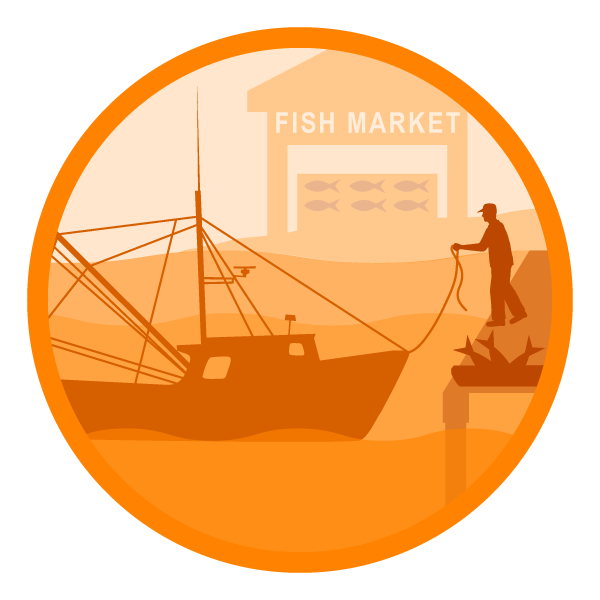

class: top, left

<style>
p.caption {
  font-size: 0.6em;
}
</style>

```{r setup, include=FALSE}

options(htmltools.dir.version = FALSE)
knitr::opts_chunk$set(echo = F,
                      fig.retina = 3,
                      #fig.width = 4,
                      #fig.height = 2,
                      fig.asp = 0.45,
                      warning = F,
                      message = F)
#Plotting and data libraries
library(tidyverse)
library(tidyr)
library(here)
library(kableExtra)
library(ecodata)
library(readxl); library(data.table)
library(DT)
library(widgetframe)


```

```{r, load_refs, include=FALSE, cache=FALSE}
library(RefManageR)
BibOptions(check.entries = FALSE,
           bib.style = "authoryear",
           cite.style = "authoryear",
           longnamesfirst = FALSE,
           max.names = 1,
           style = "markdown")
myBib <- ReadBib("./MidSOE.bib", check = FALSE)

#,
#           hyperlink = FALSE,
#           dashed = FALSE

```

```{r, code = readLines("https://raw.githubusercontent.com/NOAA-EDAB/ecodata/master/chunk-scripts/human_dimensions_MAB.Rmd-setup.R")}
```

```{r, code = readLines("https://raw.githubusercontent.com/NOAA-EDAB/ecodata/master/chunk-scripts/human_dimensions_MAB.Rmd-GIS-setup.R")}
```

```{r, code = readLines("https://raw.githubusercontent.com/NOAA-EDAB/ecodata/master/chunk-scripts/macrofauna_MAB.Rmd-setup.R")}
```

```{r, code = readLines("https://raw.githubusercontent.com/NOAA-EDAB/ecodata/master/chunk-scripts/LTL_MAB.Rmd-setup.R")}
```

# Talk outline:


* Much information on climate presented to the Council, always appreciated and well received, but how best to use it?
* MAFMC strategic plan specifically mentions “implement EAFM” and “development of ecosystem approaches that are responsive to the effects of climate change”
* EAFM process: integrates climate with other Council concerns and priorities
   * Climate in risk assessment--uses NCVA, distribution shifts separate element
   * Climate in conceptual model--links across risk elements for individual species
   * Climate in MSE? Indirect, but not off the table (unlike “traditional” MSE)
* Ecosystem reporting: one stop shopping for current conditions and recent research, presented annually and used to update risk assessment--evolving to better meet Council needs. 
   * Climate a central theme in 2021 in response to Council request
   * More effort to connect climate attributes with species outcomes to refine risk assessment
   * Habitat climate vulnerability introduced with links to species
   * All will be used to further refine the risk assessment
   * Currently working on how to use in SSC decisions like OFL CV → ABC
* Current/fiuture: climate scenario planning (add Kiley?), CFI for forecasts (see other talk)
* Success hinges on collaboration, stakeholder engagement throughout, learning by doing

---

# State of the Ecosystem (SOE) reporting
## Improving ecosystem information and synthesis for fishery managers

.pull-left[

- Ecosystem indicators linked to management objectives `r Cite(myBib, "depiper_operationalizing_2017")`
    + Contextual information
    + Report evolving since 2016
    + Fishery-relevant subset of full Ecosystem Status Reports

- Open science emphasis `r Cite(myBib, "bastille_improving_2021")`

- Used within Mid-Atlantic Fishery Management Council's Ecosystem Process `r Cite(myBib, "muffley_there_2021")`
    + Risk assessment `r Cite(myBib,"gaichas_implementing_2018")`
    + Conceptual modeling `r Cite(myBib,"depiper_learning_2021")`
    + Management strategy evaluation (MSE)

 
]

.pull-right[
*The IEA Loop<sup>1</sup>*


.footnote[
[1] https://www.integratedecosystemassessment.noaa.gov/national/IEA-approach
]
]
???

---
## Mid-Atlantic Council Ecosystem Approach

* 2016 Ecosystem Approach to Fishery Management (EAFM) Policy Guidance document:
http://www.mafmc.org/s/EAFM-Doc-Revised-2019-02-08.pdf

* Mid-Atlantic EAFM framework:
.center[

]


???
The Council’s EAFM framework has similarities to the IEA loop on slide 2. It uses risk assessment as a first step to prioritize combinations of managed species, fleets, and ecosystem interactions for consideration. Second, a conceptual model is developed identifying key environmental, ecological, social, economic, and management linkages for a high-priority fishery. Third, quantitative modeling addressing Council-specified questions and based on interactions identified in the conceptual model is applied to evaluate alternative management strategies that best balance management objectives. As strategies are implemented, outcomes are monitored and the process is adjusted, and/or another priority identified in risk assessment can be addressed. 

---
## State of the Ecosystem: Updated structure
.pull-left[

## 2020 Report
1. Summary 2 pager
1. Human dimensions
1. Protected species
1. Fish and invertebrates (managed and otherwise)
1. Habitat quality and ecosystem productivity

## 2021 Report
1. Graphical summary
    + Page 1 report card re: objectives &rarr;
    + Page 2 risk summary bullets
    + Page 3 synthesis themes
1. Performance relative to management objectives
1. Risks to meeting management objectives

]

.pull-right[

```{r management-objectives}
mng_obj <- data.frame("Objective Categories" = c("Seafood Production",
                                                 "Profits","Recreation",
                                                 "Stability","Social & Cultural",
                                                 "Protected Species",
                                                 "Biomass","Productivity",
                                                 "Trophic structure","Habitat"),
"Indicators reported here" = c("Landings; commercial total and by feeding guild; recreational harvest",
                               "Revenue decomposed to price and volume",
                               "Days fished; recreational fleet diversity",
                               "Diversity indices (fishery and ecosystem)",
                               "Community engagement/reliance status",
                               "Bycatch; population (adult and juvenile) numbers, mortalities",
                               "Biomass or abundance by feeding guild from surveys",
                               "Condition and recruitment of managed species, Primary productivity",
                               "Relative biomass of feeding guilds, Zooplankton",
                               "Estuarine and offshore habitat conditions"))

knitr::kable(mng_obj, linesep = "",
      col.names = c("Objective Categories","Indicators reported here"),
      caption = "Ecosystem-scale fishery management objectives",
      #align = 'c',
      booktabs = T) %>%
  kable_styling(font_size = 14) %>%
 # kable_styling(latex_options = "hold_position", "scale_down") %>%
 # column_spec(c(2), width = c("25em")) %>%
  row_spec(0, bold = TRUE) %>%
 # group_rows("Provisioning/Cultural", 1,4) %>%
 # group_rows("Supporting/Regulating", 5,9)
  pack_rows("Provisioning and Cultural Services", 1,6) %>%
  pack_rows("Supporting and Regulating Services", 7,10)


```
]


---
## State of the Ecosystem summary

.pull-left[
.center[

]
]

.pull-right[
.center[

]
]

---
## Ecosystem synthesis themes

Characterizing ecosystem change for fishery management

* Societal, biological, physical and chemical factors comprise the **multiple system drivers** that influence marine ecosystems through a variety of different pathways. 
* Changes in the multiple drivers can lead to **regime shifts** — large, abrupt and persistent changes in the structure and function of an ecosystem.  
* Regime shifts and changes in how the multiple system drivers interact can result in **ecosystem reorganization** as species and humans respond and adapt to the new environment.

.pull-left[


]

.pull-right[

]


---
## State of the Ecosystem &rarr; Risk assessent example: Commercial revenue

This element is applied at the ecosystem level. Revenue serves as a proxy for commercial profits.

.table[
.pull-left[

```{r riskcomval, echo=FALSE, message=FALSE, warnings=FALSE, results='asis'}
# tabl <- "
# | Risk Level         | Definition                                                          |  
# |:-------------------|:--------------------------------------------------------------------|
# | Low  | No trend and low variability in revenue |
# | Low-Moderate | Increasing or high variability in revenue |
# | Moderate-High | Significant long term revenue decrease |
# | High | Significant recent decrease in revenue |
# "
# cat(tabl) # output the table in a format good for HTML/PDF/docx conversion

tabl <- data.frame("Risk Level" = c("Low", "Low-Moderate", "Moderate-High", "High"),
                   "Definition" = c("No trend and low variability in revenue",
                                    "Increasing or high variability in revenue",
                                    "Significant long term revenue decrease",
                                    "Significant recent decrease in revenue"))

knitr::kable(tabl, format="html",
             col.names = c("Risk Level", "Definition"),
                           booktabs = T) %>%
  #kable_styling(full_width = TRUE) %>%
  column_spec(1:2, width = "20em")%>%
  row_spec(3, bold = T, background = "orange")
```

  
Ranked moderate-high risk due to the significant long term revenue decrease for Mid-Atlantic managed species (red points in top plot)

]
]
.pull-right[
```{r , code = readLines("https://raw.githubusercontent.com/NOAA-EDAB/ecodata/master/chunk-scripts/human_dimensions_MAB.Rmd-comdat-comm-revenue.R"),fig.asp = 0.5}
#comm-revenue, fig.width = 4, fig.asp = 0.45, fig.cap = "Total revenue for the region (black) and revenue from MAFMC managed species (red)."
```

Key: Black = Revenue of all species combined; <p style="color:#FF6A6A;">Red = Revenue of MAFMC managed species</p>

]

--

## Risk element: <span style="background-color:orange;">CommRev</span>, unchanged


---
# Performance relative to management objectives

.center[
 &nbsp; &nbsp; &nbsp;  &nbsp; &nbsp; &nbsp;  &nbsp; &nbsp; &nbsp;  &nbsp; &nbsp; &nbsp; 
]

---
## Objective: Seafood production   &emsp; Risk elements: <span style="background-color:red;">ComFood</span> and <span style="background-color:orange;">RecFood</span>, unchanged

.pull-left[
Indicators: Commercial and recreational landings 

```{r, code = readLines("https://raw.githubusercontent.com/NOAA-EDAB/ecodata/master/chunk-scripts/human_dimensions_MAB.Rmd-comdat-total-landings.R"), fig.asp=.4}
#total-landings, fig.cap = paste0("Total commercial seafood landings (black) and ",region," managed seafood landings (red).")
```
.contrib[
Key: Black = Landings of all species combined; <p style="color:#FF6A6A;">Red = Landings of MAFMC managed species</p>
]

```{r, code = readLines("https://raw.githubusercontent.com/NOAA-EDAB/ecodata/master/chunk-scripts/human_dimensions_MAB.Rmd-recdat-landings.R"), fig.asp=.4}
#, rec-landings, fig.cap = paste0("Total recreational seafood harvest (millions of fish) in the ",region," region.")

```

]

.pull-right[
Multiple drivers: ecosystem and stock production, management, market conditions, and environment

Is biomass driving?
```{r , code = readLines("https://raw.githubusercontent.com/NOAA-EDAB/ecodata/master/chunk-scripts/macrofauna_MAB.Rmd-aggregate-biomass.R"), fig.width=8, fig.asp = 0.75}

#nefsc-biomass-mab, fig.cap = "Spring (left) and fall (right) surveyed biomass in the Mid-Atlantic Bight. Data from the NEFSC Bottom Trawl Survey are shown in black, with NEAMAP shown in red. The shaded area around each annual mean represents 2 standard deviations from the mean."
```

.contrib[
Key: Black = NEFSC survey; <p style="color:#FF6A6A;">Red = NEAMAP survey</p>
]
]

---
## Landings drivers: Ecosystem or stock production? &emsp; Risk elements: Fstatus, Bstatus mostly unchanged
.pull-left[
```{r , code = readLines("https://raw.githubusercontent.com/NOAA-EDAB/ecodata/master/chunk-scripts/human_dimensions_MAB.Rmd-fogarty.R")}

#fogarty, fig.cap="Fogarty Index; the ratio of total landings to total primary production in the MAB. Link and Watson (2019) give an optimal range (green shading) of the Fogarty ratio of 0.22 to 0.92 parts per thousand (PPT). Previous work suggested that index values exceeding 1 to 2 PPT (orange shading) led to ecosystem tipping points."

```

```{r , code = readLines("https://raw.githubusercontent.com/NOAA-EDAB/ecodata/master/chunk-scripts/human_dimensions_MAB.Rmd-ryther.R")}

#ryther, fig.cap="Ryther index; total landings presented on a unit area basis for the MAB. Theoretical estimates (Link and Watson, 2019) imply the index should range from 0.3 - 1.1 mt per sq km annually (green shading) with a limit of 3 mt per sq km annually, above which tipping points could occur in fished ecosystems (orange shading). Expected system-wide MSYs can be in the range of 1 to 3 mt per sq km (unshaded)."
```

.contrib[
Key: 
<span style="background-color:#f4a460;">Orange background = Tipping point overfishing threshold, Link and Watson 2019</span> 
<span style="background-color:#a2cd5a;">Green background = Optimal range, Link and Watson 2019</span>
]

]

.pull-right[
```{r , code = readLines("https://raw.githubusercontent.com/NOAA-EDAB/ecodata/master/chunk-scripts/human_dimensions_MAB.Rmd-ppr.R")}

#ppr-mab, fig.cap="Primary production required to support MAB commercial landings. Included are the top species accounting for 80\\% of the landings in each year, with 15\\% transfer efficiency assumed between trophic levels. PPD is total primary production. The solid line is based on satellite-derived PPD and the dashed line is based on primary production reconstructed using the mean of satellite-derived PPD from 1998-2010."
```

One change: <span style="background-color:yellow;">Butterfish Bstatus</span>

```{r , code = readLines("https://raw.githubusercontent.com/NOAA-EDAB/ecodata/master/chunk-scripts/human_dimensions_MAB.Rmd-stock-status.R"), fig.width = 7.5, fig.asp = 0.5}

#stock-status, fig.cap = paste0("Summary of single species status for ",council_abbr," and jointly federally managed stocks (Goosefish and Spiny dogfish). Stocks in green are below the biomass threshold (overfished), stocks in orange are above the biomass threshold but below the biomass target, and stocks in purple are above the biomass target. Only one stock, Atlantic mackerel, has fishing mortality above the limit (subject to overfishing).")
```

]

---
## Implications: Seafood Production
.pull-left[
```{r, code = readLines("https://raw.githubusercontent.com/NOAA-EDAB/ecodata/master/chunk-scripts/human_dimensions_MAB.Rmd-setup.R")}
```

```{r, code = readLines("https://raw.githubusercontent.com/NOAA-EDAB/ecodata/master/chunk-scripts/human_dimensions_MAB.Rmd-GIS-setup.R")}
```

```{r, code = readLines("https://raw.githubusercontent.com/NOAA-EDAB/ecodata/master/chunk-scripts/human_dimensions_MAB.Rmd-comdat-commercial-landings.R"), fig.width=5, fig.asp=1.35}
# comm-landings, fig.cap = paste0("Total commercial landings (black) and ",council_abbr," managed species landings (red) by feeding guild."),
```

.contrib[
Key: Black = Landings of all species combined; <p style="color:#FF6A6A;">Red = Landings of MAFMC managed species</p>
]
]

.pull-right[
Drivers:
* market dynamics affecting commercial landings of surfclams and ocean quahogs  

* other drivers affecting recreational landings: shark fishery management, possibly survey methodology  

```{r , code = readLines("https://raw.githubusercontent.com/NOAA-EDAB/ecodata/master/chunk-scripts/human_dimensions_MAB.Rmd-rec_hms.R"), fig.width=5}
#rec_hms, fig.cap="Recreational shark landings from Large Pelagics Survey." , fig.width=5, fig.asp=.35

```
Monitor: 
* climate risks including warming, ocean acidification, and shifting distributions  
* ecosystem composition and production changes  
* fishing engagement  

]


???
Because ecosystem overfishing seems unlikely, stock status is mostly acceptable, and aggregate biomass trends appear stable, the decline in commercial landings is most likely driven by market dynamics affecting the landings of surfclams and ocean quahogs, as quotas are not binding for these species.

Climate change also seems to be shifting the distribution of surfclams and ocean quahogs, resulting in areas with overlapping distributions and increased mixed landings. Given the regulations governing mixed landings, this could become problematic in the future and is currently being evaluated by the Council. 


]
---
# Risks to meeting fishery management objectives

.center[
 &nbsp; &nbsp; &nbsp; 
] 

.center[
 &nbsp; &nbsp; &nbsp;  &nbsp; &nbsp; &nbsp;  &nbsp; &nbsp; &nbsp;   &nbsp; &nbsp; &nbsp;  
]


---
background-image: url("EDAB_images/SurveyMap202133.png")
background-size: 700px
background-position: right

## Risks: Offshore Wind Development &emsp; Element: OceanUse
.pull-left[
Indicators: development timeline, revenue in lease areas, survey overlap ([full map](https://noaa-edab.github.io/ecodata/human_dimensions_MAB#Shelfwide_Indicators))

```{r, code = readLines("https://raw.githubusercontent.com/NOAA-EDAB/ecodata/master/chunk-scripts/human_dimensions_MAB.Rmd-wind-revenue.R"), fig.height=3}
```

]

.pull-right[
]

---
background-image: url("EDAB_images/MidAtlantic_2021128-01.jpg")
background-size: 500px
background-position: right

## Risks: Offshore Wind Development &emsp; Element: OceanUse
.pull-left[
Implications: 
* Current plans for rapid buildout of offshore wind in a patchwork of areas spreads the impacts differentially throughout the region  

* 2-24% of total average revenue for major Mid-Atlantic commercial species in lease areas could be displaced if all sites are developed. Displaced fishing effort can alter fishing methods, which can in turn change habitat, species (managed and protected), and fleet interactions. 

* Right whales may be displaced, and altered local oceanography could affect distribution of their zooplankton prey.

* Scientific data collection surveys for ocean and ecosystem conditions, fish, and protected species will be altered, potentially increasing uncertainty for management decision making. 
]
.pull-right[]

---
## EAFM Risk Assessment: 2021 Update

.pull-left[
*Species level risk elements*
```{r sptable}
#tab.cap="Species level risk analysis results; l=low risk (green), lm= low-moderate risk (yellow), mh=moderate to high risk (orange), h=high risk (red)\\label{sptable}",

# spplist     oc,  sc,  flk, scp, bsb, mack, but, lsq, ssq, gtile,  btile,  blu, dog, monk
risk.species<-data.frame(
  Species = c("Ocean Quahog", "Surfclam", "Summer flounder", "Scup", "Black sea bass", "Atl. mackerel", "Butterfish", "Longfin squid", "Shortfin squid", "Golden tilefish", "Blueline tilefish", "Bluefish", "Spiny dogfish", "Monkfish", "Unmanaged forage", "Deepsea corals"),
  Assess  = c("l", "l", "l",  "l", "l", "l",  "l", "lm", "lm", "l", "h", "l", "lm", "h", "na", "na"),
  Fstatus = c("l", "l", "l", "l", "l", "h", "l", "lm", "lm", "l", "h", "l", "l", "lm", "na", "na"),
  Bstatus = c("l", "l", "lm", "l", "l", "h", "lm", "lm", "lm", "lm", "mh", "h", "lm", "lm", "na", "na"),
  FW1Pred = c("l", "l", "l", "l", "l", "l", "l", "l", "l", "l", "l", "l", "l", "l", "l", "l"),
  FW1Prey = c("l", "l", "l", "l", "l", "l", "l", "l", "l", "l", "l", "l", "l", "l", "lm", "l"),
  FW2Prey = c("l", "l", "l", "l", "l", "l", "l", "lm", "lm", "l", "l", "l", "l", "l", "lm", "l"),
  Climate = c("h", "mh", "lm", "lm", "mh", "lm", "l", "l", "l", "mh", "mh","l", "l", "l", "na", "na"),
  DistShift = c("mh", "mh", "mh", "mh", "mh", "mh", "h", "mh", "h", "l", "l", "mh", "h", "mh", "na", "na"),
  EstHabitat = c("l", "l", "h", "h", "h", "l", "l", "l", "l", "l", "l", "h", "l", "l", "na", "na")#,
#  OffHabitat = c("na", "na", "l", "l", "l", "l", "l", "l", "h", "na", "na", "na", "l", "l", "na", "na")#,
)

# these elements were removed by the council
#  PopDiv = c("na", "na", "na", "na", "na", "na", "na", "na", "na", "na", "na", "na", "na", "na"),
#  FoodSafe = c(),

# one column test
# risk.species %>%
#   mutate(Fstatus = 
#     cell_spec(Fstatus, format="latex", color = "black", align = "c", background =factor(Fstatus, c("na", "l", "lm", "mh", "h"),c("white", "green", "yellow", "orange", "red")))) %>%
#   kable(risk.species, format="latex", escape = F, booktabs = T, linesep = "")

#convert to longer text for consistency and display in html table
risk.species <- risk.species %>%
     mutate_at(vars(-Species), function(x){
       recode(x,'l'="lowest",'lm'="lowmod",'mh'="modhigh",'h'="highest")}) %>%
     as.data.frame()

#generalize to all
risk.species %>%
  mutate_at(vars(-Species), function(x){ 
    cell_spec(x, format="html", color = factor(x, c("na", "lowest", "lowmod", "modhigh", "highest"),c("black", "black", "black", "black", "white")), align = "c", background =factor(x, c("na", "lowest", "lowmod", "modhigh", "highest"),c("white", "lightgreen", "yellow", "orange", "red")), background_as_tile=F)}) %>%
  kable(format = "html", escape = F, table.attr='class="risktable"') %>%
  kable_styling(font_size = 9) 
```
.contrib[
* Butterfish B status risk increased from lowest to low-mod (below Bmsy)
]  

*Ecosystem level risk elements*
```{r ecotable}
#tab.cap="Ecosystem level risk analysis results; l=low risk (green), lm= low-moderate risk (yellow), mh=moderate to high risk (orange), h=high risk (red)\\label{sptable}",

risk.eco<-data.frame(
  System = c("Mid-Atlantic"),
  EcoProd = c("lm"),
  #EcoDiv = c("lm"),
  CommRev = c("mh"),
  RecVal = c("h"),
  FishRes1 = c("l"),
  FishRes4 = c("mh"),
  #CommJobs = c("mh"),
  #RecJobs = c("l"),
  FleetDiv = c("l"),
  Social = c("lm"),
  ComFood = c("h"),
  RecFood = c("mh")
)

#convert to longer text for consistency and display in html table
risk.eco <- risk.eco %>%
     mutate_at(vars(-System), function(x){
       recode(x,'l'="lowest",'lm'="lowmod",'mh'="modhigh",'h'="highest")}) %>%
     as.data.frame()

#make table
risk.eco %>%
  mutate_at(vars(-System), function(x){ 
    cell_spec(x, format="html", color = factor(x, c("na", "lowest", "lowmod", "modhigh", "highest"),c("black", "black", "black", "black", "white")), align = "c", background =factor(x, c("na", "lowest", "lowmod", "modhigh", "highest"),c("white", "lightgreen", "yellow", "orange", "red")), background_as_tile=F)}) %>%
  kable(format = "html", escape = F, table.attr='class="risktable"') %>%
  kable_styling(font_size = 9) 

```
]  

.pull-right[ 
*Species and Sector level risk elements*
```{r mgttable,  echo=FALSE, message=FALSE, warnings=FALSE}
#tab.cap="Species and sector level risk analysis results; l=low risk (green), lm= low-moderate risk (yellow), mh=moderate to high risk (orange), h=high risk (red)\\label{sptable}",

risk.sppsector<-data.frame(
  Species = c("Ocean Quahog-C", "Surfclam-C", "Summer flounder-R", "Summer flounder-C","Scup-R", "Scup-C","Black sea bass-R", "Black sea bass-C","Atl. mackerel-R", "Atl. mackerel-C","Butterfish-C", "Longfin squid-C", "Shortfin squid-C", "Golden tilefish-R", "Golden tilefish-C","Blueline tilefish-R","Blueline tilefish-C", "Bluefish-R", "Bluefish-C","Spiny dogfish-R", "Spiny dogfish-C", "Chub mackerel-C", "Unmanaged forage", "Deepsea corals"),
  MgtControl = c(1,1,3,2,2,1,4,4,2,1,1,1,2,9,1,1,1,2,1,1,1,1,1,9),
  TecInteract = c(1,1,1,3,1,2,1,2,1,2,2,3,2,1,1,1,1,1,1,1,3,2,1,9),
  OceanUse = c(2,2,2,2,2,3,3,4,1,3,3,4,2,1,1,1,1,1,2,1,3,2,3,3),
  RegComplex = c(1,1,3,3,3,3,3,3,1,4,4,4,2,1,1,3,3,2,2,1,3,2,1,9),
  Discards = c(3,3,4,3,3,3,4,4,1,2,3,4,1,1,1,1,1,3,2,1,2,1,1,9),
  Allocation = c(1,1,4,4,4,4,4,4,1,4,1,1,1,1,1,4,4,4,4,1,1,1,1,9) 
)


#convert to text for consistency
risk.sppsector <- risk.sppsector %>%
     mutate_at(vars(-Species), function(x){
       recode(x,'1'="lowest",'2'="lowmod",'3'="modhigh",'4'="highest",'9'="na")}) %>%
     as.data.frame()

#make table
risk.sppsector %>%
  mutate_at(vars(-Species), function(x){ 
    cell_spec(x, format="html", color = factor(x, c("na", "lowest", "lowmod", "modhigh", "highest"),c("black", "black", "black", "black", "white")), align = "c", background =factor(x, c("na", "lowest", "lowmod", "modhigh", "highest"),c("white", "lightgreen", "yellow", "orange", "red")), background_as_tile=F)}) %>%
  kable(format = "html", escape = F, table.attr='class="risktable"') %>%
  kable_styling(font_size = 11) 

```
.contrib[
* Allocation risk decreased for 4 fisheries from high to low (intermediate rankings not applied) 
* Black sea bass regulatory complexity risk decreased from highest to mod-high  
]
]


???
Changes:
Butterfish B status risk increased from lowest to low-mod (below Bmsy)
Allocation risk decreased for 4 fisheries from high to low (intermediate rankings not applied)
Black sea bass regulatory complexity risk decreased from highest to moderate-high

Potential new indicators from new SOE sections on climate risk, habitat vulnerability, offshore wind

Habitat vulnerability analysis writeups--comments?

---
background-image: url("EDAB_images/noaa-iea.png")
background-size: 350px
background-position: right bottom

## Contributors - THANK YOU!

The New England and Mid-Atlantic SOEs made possible by (at least) 52 contributors from 10 institutions 

.pull-left[
.contrib[
Andy Beet<br>
Kimberly Bastille<br>
Ruth Boettcher (Virginia Department of Game and Inland Fisheries)<br>
Mandy Bromilow (NOAA Chesapeake Bay Office)<br>
Zhuomin Chen (Woods Hole Oceanographic Institution)<br>
Joseph Caracappa<br>
Doug Christel (GARFO)<br>
Patricia Clay<br>
Lisa Colburn<br>
Jennifer Cudney (NMFS Atlantic HMS Management Division)<br>
Tobey Curtis (NMFS Atlantic HMS Management Division)<br>
Geret DePiper<br>
Emily Farr (NMFS Office of Habitat Conservation)<br>
Michael Fogarty<br>
Paula Fratantoni<br>
Kevin Friedland<br>
Sarah Gaichas<br>
Ben Galuardi (GARFO)<br>
Avijit Gangopadhyay (School for Marine Science and Technology, University of Massachusetts Dartmouth)<br>
James Gartland (Virginia Institute of Marine Science)<br>
Glen Gawarkiewicz (Woods Hole Oceanographic Institution)<br>
Sean Hardison<br>
Kimberly Hyde<br>
John Kosik<br>
Steve Kress (National Audubon Society’s Seabird Restoration Program)<br>
Young-Oh Kwon (Woods Hole Oceanographic Institution)<br>

]
]

.pull-right[
.contrib[
Scott Large<br>
Andrew Lipsky<br>
Sean Lucey
Don Lyons (National Audubon Society’s Seabird Restoration Program)<br>
Chris Melrose<br>
Shannon Meseck<br>
Ryan Morse<br>
Kimberly Murray<br>
Chris Orphanides<br>
Richard Pace<br>
Charles Perretti<br>
CJ Pellerin (NOAA Chesapeake Bay Office)<br>
Grace Roskar (NMFS Office of Habitat Conservation)<br>
Grace Saba (Rutgers)<br>
Vincent Saba<br>
Chris Schillaci (GARFO)<br>
Angela Silva<br>
Emily Slesinger (Rutgers University)<br>
Laurel Smith<br>
Talya tenBrink (GARFO)<br>
Bruce Vogt (NOAA Chesapeake Bay Office)<br>
Ron Vogel (UMD Cooperative Institute for Satellite Earth System Studies and NOAA/NESDIS Center for Satellite Applications and Research)<br>
John Walden<br>
Harvey Walsh<br>
Changhua Weng<br>
Mark Wuenschel  

]
]


---
## References

.contrib[
```{r refs, echo=FALSE, results="asis"}
PrintBibliography(myBib)
```
]


## Additional resources
.pull-left[
* [ecodata R package](https://github.com/noaa-edab/ecodata)

* Visualizations:
  * [Mid-Atlantic Human Dimensions indicators](http://noaa-edab.github.io/ecodata/human_dimensions_MAB)
  * [Mid-Atlantic Macrofauna indicators](http://noaa-edab.github.io/ecodata/macrofauna_MAB)
  * [Mid-Atlantic Lower trophic level indicators](https://noaa-edab.github.io/ecodata/LTL_MAB)
]
.pull-right[
* [SOE Reports on the web](https://www.fisheries.noaa.gov/new-england-mid-atlantic/ecosystems/state-ecosystem-reports-northeast-us-shelf)

* [SOE Technical Documentation](https://noaa-edab.github.io/tech-doc)

* [Draft indicator catalog](https://noaa-edab.github.io/catalog/)

.contrib[

* Slides available at https://noaa-edab.github.io/presentations
* Contact: <Sarah.Gaichas@noaa.gov>
]
]

---
## Document Orientation

.pull-left[
Spatial scale


A [glossary of terms](https://noaa-edab.github.io/tech-doc/glossary.html) (Memo 5), detailed [technical methods documentation](https://NOAA-EDAB.github.io/tech-doc) and [indicator data](https://github.com/NOAA-EDAB/ecodata) are available online.  
]

.pull-right[
Key to figures
```{r , code = readLines("https://raw.githubusercontent.com/NOAA-EDAB/ecodata/master/chunk-scripts/macrofauna_MAB.Rmd-species-dist.R"), fig.width=5.5, fig.asp=.9}
#species-dist, fig.cap = "Aggregate species distribution metrics for species in the Northeast Large Marine Ecosystem."
```  

.contrib[
Trends assessed only for 30+ years: [more information](https://noaa-edab.github.io/tech-doc/trend-analysis.html)

<p style="color:#FF8C00;">Orange line = significant increase</p>
<p style="color:#9932CC;">Purple line = significant decrease</p>
No color line = not significant or < 30 years
<p style="background-color:#D3D3D3;">Grey background = last 10 years</p>
]
]


---
## Revised structure to address Council requests and improve synthesis 

.pull-left[
* Performance relative to management objectives
    - *What* does the indicator say--up, down, stable?
    - *Why* do we think it is changing: integrates synthesis themes
        - Multiple drivers
        - Regime shifts
        - Ecosystem reorganization
* Objectives
    - Seafood production
    - Profits
    - Recreational opportunities
    - Stability
    - Social and cultural
    - Protected species
]

.pull-right[
* Risks to meeting fishery management objectives
    - *What* does the indicator say--up, down, stable?
    - *Why* this is important to managers: integrates synthesis themes
        - Multiple drivers
        - Regime shifts
        - Ecosystem reorganization
* Risk categories
    - Climate: warming, ocean currents, acidification
        - Habitat changes (incl. vulnerability analysis)
        - Productivity changes (system and fish)
        - Species interaction changes
        - Community structure changes
    - Other ocean uses
        - Offshore wind development
]

---
## Risks: Habitat climate vulnerability &emsp; New, opportunity to refine habitat risks

Indicators: climate sensitive species life stages mapped to climate vulnerable habitats  

*See EAFM risk assessment for example species narratives*  
```{r midHabTable, message=FALSE}
#Read in Mid-Atlantic table

src <- "https://github.com/NOAA-EDAB/ecodata/raw/master/data-raw/habitat_vulnerability.xlsx"
lcl <- basename(src)
download.file(url = src, destfile = lcl, quiet=TRUE)

mid <- as.data.table(readxl::read_xlsx(here('habitat_vulnerability.xlsx'),
                         sheet = 'Mid-Atlantic', skip = 1))

if (file.exists(lcl)) {
  #Delete file if it exists
  invisible(file.remove(lcl))
}

#Identify individual species climate vulnerability
vhigh.vul <- unique(mid[`Species Vulnerability Rank (FCVA)` == 'Very high', Species])
high.vul  <- unique(mid[`Species Vulnerability Rank (FCVA)` == 'High', Species])
mod.vul   <- unique(mid[`Species Vulnerability Rank (FCVA)` == 'Moderate', Species])
low.vul   <- unique(mid[`Species Vulnerability Rank (FCVA)` == 'Low', Species])

#Grab habitat vulnerability 
hab.vul <- unique(mid[, c('Habitat Name', 'Habitat Vulnerability Rank (HVCA)')])
habitats <- hab.vul[, 'Habitat Name']
hab.vul <- data.table('Habitat Vulnerability' = c(NA, NA, t(hab.vul[, 'Habitat Vulnerability Rank (HVCA)'])))

#Rearrange table
mid <- data.table::melt.data.table(mid, id.vars = c('Habitat Name', 'Species'),
                                   measure.vars = c('Eggs/Larva', 'Juvenile/YOY',
                                                    'Adult', 'Spawning Adult'),
                                   variable.name = 'Stage', value.name = 'Dependence')
mid[, Habitat := as.factor(mid$'Habitat Name')]
mid <- data.table::dcast.data.table(mid, Species + Stage ~ Habitat,
                                    value.var = 'Dependence')
setcolorder(mid, c('Species', 'Stage', habitats$'Habitat Name'))

#Add Habitat Vulnerability
#hab.table <- rbindlist(list(as.data.table(t(hab.vul)), mid), use.names = F)
hab.table <- mid
#Add names back in
names(hab.table) <- names(mid)
hab.table <- hab.table %>% mutate_if(is.character, str_trim)

#from examples here https://rstudio.github.io/DT/010-style.html

#color coding cells works
#need to add column with species vulnerability and color code species by it but not show it, like #hideV6 example at link
#if we show it we can sort by species vulnerability though... alphabetical doesnt work so use numbers to go lowest-highest
#still need to color code headers
hab.table <- hab.table %>%
  mutate(spVul = #Color code species based on climate vul
    # case_when(Species %in% low.vul ~ "low.vul",
    #           Species %in% mod.vul ~ "mod.vul",
    #           Species %in% high.vul ~ "high.vul",
    #           Species %in% vhigh.vul ~ "vhigh.vul")
    # )
    case_when(Species %in% low.vul ~ 1,
              Species %in% mod.vul ~ 2,
              Species %in% high.vul ~ 3,
              Species %in% vhigh.vul ~ 4)
    )

colnames(hab.table)[c(3:4)] <- paste0('<span style="box-shadow: -10px 0 0 red, 10px 0 0 red; background-color:red; color:white">',colnames(hab.table)[c(3:4)],'</span>')
colnames(hab.table)[c(5:10)] <- paste0('<span style="box-shadow: -10px 0 0 orange, 10px 0 0 orange; background-color:',c("orange"),'">',colnames(hab.table)[c(5:10)],'</span>')
colnames(hab.table)[c(11:15)] <- paste0('<span style="box-shadow: -10px 0 0 yellow, 10px 0 0 yellow; background-color:',c("yellow"),'">',colnames(hab.table)[c(11:15)],'</span>')

dt <- datatable(hab.table, rownames = FALSE, escape = FALSE,
          extensions = c('Scroller', 'FixedColumns'), #add scrolling and fixed column
          options = list(deferRender = TRUE,
          scrollY = 300, scroller = TRUE,
          dom = 't',scrollX = TRUE,fixedColumns = TRUE)
          #, options = list(columnDefs = list(list(targets = 16, visible = FALSE)))
  ) %>% 
  formatStyle(
    names(hab.table)[3:4],
    backgroundColor = '#FF000080'
  ) %>%
  formatStyle(
    names(hab.table)[5:10],
    backgroundColor = '#FFA50080'
  ) %>%
  formatStyle(
    names(hab.table)[11:15],
    backgroundColor = '#FFFF0080'
  ) %>%

  formatStyle(#Color code base on dependence
    'Species', "spVul",
    backgroundColor = styleEqual(#c("low.vul", "mod.vul", "high.vul", "vhigh.vul"),
                                 c(1,2,3,4),
                                 c('lightgreen', 'yellow', 'orange', 'red')), #Color code base on dependence)
    color = styleEqual(c(1,2,3,4),
                                 c('black', 'black', 'black', 'white'))
    ) %>%
    formatStyle(
    names(hab.table),
    backgroundColor = styleEqual(c("Low", "Moderate", "High", "Very high"), 
                                 c('lightgreen', 'yellow', 'orange', 'red')), 
    color = styleEqual(c("Low", "Moderate", "High", "Very high"), 
                                 c('black', 'black', 'black', 'white'))
  )

frameWidget(dt)
```

