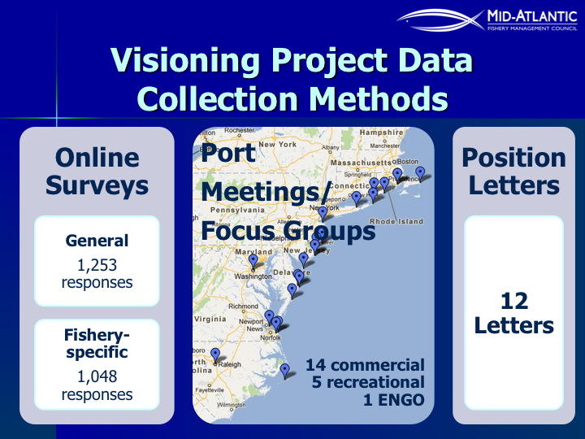

class: top, left

```{r setup, include=FALSE}

options(htmltools.dir.version = FALSE)
knitr::opts_chunk$set(echo = F,
                      fig.retina = 3,
                      warning = F,
                      message = F)
#Plotting and data libraries
library(tidyverse)
library(tidyr)
library(here)
library(kableExtra)
library(ecodata)
library(readxl); library(data.table)
library(DT)
library(widgetframe)

#Region identifiers
epu <- "Mid-Atlantic Bight"
epu_abbr <- "MAB"
region <- "Mid-Atlantic"
region_abbr <- "MA" #Some commercial data organized by "MA" or "NE" regions, not by EPU 

#General inline text input for report

#Council
council <- "Mid-Atlantic Fishery Management Council"
council_abbr <- "MAFMC"

#Define constants for commercial landings figure plot
series.col <- c("indianred","black")


#Time series constants
shade.alpha <- 0.3
shade.fill <- "lightgrey"
lwd <- 1
pcex <- 2
trend.alpha <- 0.5
trend.size <- 2
hline.size <- 1
hline.alpha <- 0.35
hline.lty <- "dashed"
label.size <- 5
hjust.label <- 1.5
letter_size <- 4
feeding.guilds1<- c("Piscivore","Planktivore","Benthivore","Benthos")
feeding.guilds <- c("Apex Predator","Piscivore","Planktivore","Benthivore","Benthos")
x.shade.min <- 2010
x.shade.max <- 2020
#Function for custom ggplot facet labels
label <- function(variable,value){
  return(facet_names[value])
}

```

```{r, load_refs, include=FALSE, cache=FALSE}
library(RefManageR)
BibOptions(check.entries = FALSE,
           bib.style = "authoryear",
           cite.style = "authoryear",
           longnamesfirst = FALSE,
           max.names = 1,
           style = "markdown")
myBib <- ReadBib("./MidSOE.bib", check = FALSE)

#,
#           hyperlink = FALSE,
#           dashed = FALSE

```

## An integrated ecosystem assessment (IEA) success story (in progress)

.pull-left-60[
- ICES WGNARS international science `r Cite(myBib, "depiper_operationalizing_2017")`
    + Indicator development
    + Worked examples of IEA components

- Ecosystem reporting linked to management objectives 
    + Open science emphasis `r Cite(myBib, "bastille_improving_2020")`
    + Report evolving since 2016
    + Fishery-relevant subset of full Ecosystem Status Reports

- Used within Mid-Atlantic Fishery Management Council's Ecosystem Process `r Cite(myBib, "muffley_there_2020")`
    + Risk assessment `r Cite(myBib,"gaichas_implementing_2018")`
    + Conceptual modeling `r Cite(myBib,"depiper_learning_inreview")`
    + Management strategy evaluation (MSE)
 
]

.pull-right-40[
*The IEA Loop<sup>1</sup>*


.footnote[
[1] https://www.integratedecosystemassessment.noaa.gov/national/IEA-approach
]
]
???
an iterative, collaborative process has evolved to formulate ecosystem advice and to apply it in decision making
---
## International scientific collaboration: [ICES WGNARS](https://www.ices.dk/community/groups/Pages/WGNARS.aspx)

.pull-left[
.center[

]
  
Deep dive into components of the IEA process from a scientific perspective
*  Outlining potential management objectives to start conversations with managers
*  Example ecosystem indicators, conceptual models, and risk assessments
*  Productive exchange between different national frameworks for EBFM/Ocean management and scientific databases

]
.pull-right[

]
---
## Collaborative process and worked examples `r Cite(myBib, "depiper_operationalizing_2017")`

.pull-left[

]
.pull-right[

]

---
background-image: url("EDAB_images/nes-components-abstracted.png")
background-size: 700px
background-position: right bottom

## State of the Ecosystem (SOE) Reporting: Context for busy people

*"So what?" --John Boreman, September 2016*

1. Clear linkage of ecosystem indicators with management objectives

1. Synthesis across indicators for big picture

1. Objectives related to human-well being placed first in report

1. Short (< 30 pages), non-technical (but rigorous) text

1. Emphasis on reproducibility 


???
In 2016, we began taking steps to address these common critiques of the ESR model
Many indicators presented at WGNARS, used in larger Ecosystem Status reports
Shorter, fishery specific State of the Ecosystem (SOE) report with conceptual models prototyped based on California Current reporting
Feedback from fishery managers redesigned reporting to align with objectives outlined by WGNARS

---
## State of the Ecosystem Report Structure
.pull-left[

## 2020 Report
1. Summary 2 pager
1. Human dimensions
1. Protected species
1. Fish and invertebrates (managed and otherwise)
1. Habitat quality and ecosystem productivity

## 2021 Report
1. Summary 2 pager
    + Page 1 summary table
    + Page 2 synthesis themes
1. Performance against management objectives
1. Risks

]

.pull-right[

*Established ecosystem-scale objectives*

```{r management-objectives}
mng_obj <- data.frame("Objective Categories" = c("Seafood Production",
                                                 "Profits","Recreation",
                                                 "Social & Cultural", "Stability",
                                                 "Biomass","Productivity",
                                                 "Trophic structure","Habitat"),
"Indicators reported here" = c("Landings by feeding guild","Revenue decomposed to price and volume",
                               "Days fished; recreational catch",
                               "Commercial engagement trends",
                               "Diversity indices (fishery and species)",
                               "Biomass or abundance by feeding guild from surveys",
                               "Condition and recruitment of managed species, Primary productivity",
                               "Relative biomass of feeding guilds, Zooplankton",
                               "Estuarine and offshore habitat conditions"))

#knitr::kable(mng_obj, linesep = "",
mng_obj %>%
      #col.names = c("Objective Categories","Indicators reported here") %>%
      #caption = "Established ecosystem-scale objectives in the Mid-Atlantic Bight",
      #align = 'c',
      #booktabs = T) %>%
  #kable_styling(latex_options = "hold_position", "scale_down") %>%
 # column_spec(c(2), width = c("25em")) %>%
  kable(format = "html", escape = F, #table.attr='class="risktable"',
        col.names = c("Objective Categories","Indicators reported here")) %>%
  kable_styling(font_size = 14) %>%
  row_spec(0, bold = TRUE) %>%
  group_rows("Provisioning/Cultural", 1,4) %>%
  group_rows("Supporting/Regulating", 5,9)


```
]

---
## [2020 Report](https://doi.org/10.25923/1f8j-d564): Summary 2 pager with visualizations, 28 pages of narrative/plots, 1 page orientation

.pull-left[
.center[

]
]

.pull-right[
.center[

]
]


---
## Ecosystem synthesis themes for 2021

Characterizing ecosystem change for fishery management: plain language summary for 2 pager

* Multiple drivers of abundance, defined by the competing factors that influence the amount of fish in the ocean; 
* Regime shifts, or ecosystem change can happen rapidly as multiple drivers change; and, 
* Reorganization of the ecosystem, multiple factors that interact that change the structure and organization of the ecosystem, e.g. Tropicalization

.pull-left[


]

.pull-right[

]

---
## 2021 outline: two sections, each with "what" and "why"

.pull-left[
* Performance against management objectives
    - *What* does the indicator say--up, down, stable?
    - *Why* do we think it is changing: integrates synthesis themes
        - Multiple drivers
        - Regime shifts
        - Ecosystem reorganization
* Objectives
    - Seafood production
    - Profits
    - Recreational opportunities
    - Stability
    - Social and cultural
    - Protected species
]

.pull-right[
* Risks
    - *What* does the indicator say--up, down, stable?
    - *Why* this is important to managers: integrates synthesis themes
        - Multiple drivers
        - Regime shifts
        - Ecosystem reorganization
* Risk categories
    - Climate: warming, ocean currents, acidification
        - Habitat changes (incl. vulnerability analysis)
        - Productivity changes (system and fish)
        - Species interaction changes
        - Community structure changes
    - Other ocean uses
        - Wind
]

---
## Example: Seafood production objective

.pull-left[
Indicator: Total landings Trend: Decreasing  
Mid-Atlantic  
```{r, code = readLines("https://raw.githubusercontent.com/NOAA-EDAB/ecodata/master/chunk-scripts/human_dimensions_MAB.Rmd-comdat-total-landings.R"), fig.height=3}
```
New England  
```{r, code = readLines("https://raw.githubusercontent.com/NOAA-EDAB/ecodata/master/chunk-scripts/human_dimensions_NE.Rmd-setup.R")}
```

```{r, code = readLines("https://raw.githubusercontent.com/NOAA-EDAB/ecodata/master/chunk-scripts/human_dimensions_NE.Rmd-comdat-total-landings.R"), fig.height=3}
```

]

.pull-right[
Why: multiple drivers: stock status/management, engagement, markets, fish population drivers
```{r, code = readLines("https://raw.githubusercontent.com/NOAA-EDAB/ecodata/master/chunk-scripts/human_dimensions_MAB.Rmd-setup.R")}
```

```{r, code = readLines("https://raw.githubusercontent.com/NOAA-EDAB/ecodata/master/chunk-scripts/human_dimensions_MAB.Rmd-stock-status.R"), fig.height=3 }
```

```{r, code = readLines("https://raw.githubusercontent.com/NOAA-EDAB/ecodata/master/chunk-scripts/human_dimensions_MAB.Rmd-fogarty.R"), fig.height=3}
```


]

---
## Multiple drivers of fish production analysis in progress: environment - fish condition - market price linkages

   

* Identify multiple and changing drivers of condition and market prices over time
* Recognize regime shifts and potential system reorganization

* Work in progress has identified the following potential drivers
    - *Temperature*
    - *Zooplankton*

---
## Example: Social and cultural objectives
.pull-left[
Indicator: Recreational engagement, reliance, vulnerability
```{r, code = readLines("https://raw.githubusercontent.com/NOAA-EDAB/ecodata/master/chunk-scripts/human_dimensions_MAB.Rmd-setup.R")}
```

```{r, code = readLines("https://raw.githubusercontent.com/NOAA-EDAB/ecodata/master/chunk-scripts/human_dimensions_MAB.Rmd-recreational-engagement.R"), fig.height=6}
```
Mid-Atlantic communities
]

.pull-right[
Indicator: Commercial Vulnerability engagement, reliance, vulnerability
<br />
```{r, code = readLines("https://raw.githubusercontent.com/NOAA-EDAB/ecodata/master/chunk-scripts/human_dimensions_MAB.Rmd-setup.R")}
```

```{r, code = readLines("https://raw.githubusercontent.com/NOAA-EDAB/ecodata/master/chunk-scripts/human_dimensions_MAB.Rmd-commercial-engagement.R"), fig.height=6}
```

]


---
## Example: Protected species objectives
.pull-left[
Indicators: Species By-catch
```{r, code = readLines("https://raw.githubusercontent.com/NOAA-EDAB/ecodata/master/chunk-scripts/macrofauna_MAB.Rmd-harborporpoise.R"), fig.height=3}
```

```{r, code = readLines("https://raw.githubusercontent.com/NOAA-EDAB/ecodata/master/chunk-scripts/macrofauna_MAB.Rmd-grayseal.R"), fig.height=3}
```
]

.pull-right[
Indicators: Endangered Species Populations
```{r, code = readLines("https://raw.githubusercontent.com/NOAA-EDAB/ecodata/master/chunk-scripts/macrofauna_MAB.Rmd-narw-abundance.R"), fig.height=3}
```

```{r, code = readLines("https://raw.githubusercontent.com/NOAA-EDAB/ecodata/master/chunk-scripts/macrofauna_MAB.Rmd-NARW-calf-abundance.R"), fig.height=3}
```
]

---
## Example: Climate risks: multiple potential impacts on management
.pull-left[
Indicators: Gulf Stream index, bottom and surface temperature, heat waves  
Trends:
```{r, code = readLines("https://raw.githubusercontent.com/NOAA-EDAB/ecodata/master/chunk-scripts/LTL_MAB.Rmd-setup.R")}
```


```{r, code = readLines("https://raw.githubusercontent.com/NOAA-EDAB/ecodata/master/chunk-scripts/LTL_MAB.Rmd-gsi.R"), fig.height=3, out.width='60%'}
```

```{r, code =readLines("https://raw.githubusercontent.com/NOAA-EDAB/ecodata/master/chunk-scripts/LTL_MAB.Rmd-bottom-temp.R"), fig.height=3, out.width='60%'}

```

```{r, code = readLines("https://raw.githubusercontent.com/NOAA-EDAB/ecodata/master/chunk-scripts/LTL_MAB.Rmd-heatwave.R"), fig.height=3, out.width='70%'}
```
]

.pull-right[

Why this matters: 
Habitat change from multiple drivers alters:
- species distributions--allocation
- system productivity--fishery resource productivity
```{r, code = readLines("https://raw.githubusercontent.com/NOAA-EDAB/ecodata/master/chunk-scripts/macrofauna_MAB.Rmd-nefsc-survey-disaggregated-mafmc-spp-in-ne.R"), fig.height=6}
```

]

---
## Example: Other ocean uses (Wind): area covered, fisheries impacted
.pull-left[

]

.pull-right[
```{r, code = readLines("https://raw.githubusercontent.com/NOAA-EDAB/ecodata/master/chunk-scripts/human_dimensions_MAB.Rmd-wind-dev-speed0.30.R"), fig.height=3}
```

```{r, code = readLines("https://raw.githubusercontent.com/NOAA-EDAB/ecodata/master/chunk-scripts/human_dimensions_MAB.Rmd-wind-revenue.R"), fig.height=3}
```

]
---
## Continuing dialogue with managers shapes report and indicators presented each year: 2021 Requests

```{r, results='hide'}
resultfile <- googledrive::drive_find(pattern = "SOE_Request_Checklist", type = "spreadsheet")

requests <- googledrive::drive_download(resultfile, type = "csv", overwrite = TRUE) %>%
  {read.csv(.$local_path)} 

```

```{r memo}

# resultfile <- googledrive::drive_find(pattern = "SOE_Request_Checklist", type = "spreadsheet")
# 
# requests <- googledrive::drive_download(resultfile, type = "csv", overwrite = TRUE) %>%
#   {read.csv(.$local_path)} 

requeststab <- requests %>%
  dplyr::select(Request, Year, Source, Progress) %>%
  dplyr::mutate("Memo Section" = rownames(.))

knitr::kable(requeststab, longtable = T, booktabs = TRUE, linesep = "") %>%
  kable_styling(font_size=9#, latex_options = c("hold_position", "striped", "repeat_header")
                ) %>%
  row_spec(0,bold=TRUE) %>%
  column_spec(1, width="8cm") %>%
  column_spec(2, width="1cm") %>%
  column_spec(3, width="2cm") %>%
  column_spec(4, width="10cm") %>%
  column_spec(5, width="2cm")

```


---
## Fishery management in the US

Eight regional Fishery Management Councils establish plans for sustainable management of stocks within their jurisdictions. All are governed by the same law, but tailor management to their regional stakeholder needs.

.center[

] 

More information: http://www.fisherycouncils.org/
https://www.fisheries.noaa.gov/topic/laws-policies#magnuson-stevens-act

---
## The Mid-Atlantic Fishery Management Council (MAFMC)

.pull-left-30[

]
.pull-right-70[

]

---
## Why an ecosystem approach?

*"We rebuilt all the stocks, so why is everyone still pissed off?" --Rich Seagraves*

in 2011, the Council asked:

.pull-left[

]
.pull-right[

]

And many people answered, from commercial fishery, recreational fishery, environmental organization, and interested public perspectives.

Visioning report: 

http://www.mafmc.org/s/MAFMC-stakeholder-input-report-p7b9.pdf

---
## Common themes among all stakeholder groups:

>• There is a lack of confidence in the data that drive fishery management decisions.
>
>• Stakeholders are not as involved in the Council process as they can and should be.
>
>• Different jurisdictions and regulations among the many fishery management organizations result in complexity and inconsistency.
>
>• There is a need for increased transparency and communications in fisheries management.
>
>• The dynamics of the ecosystem and food web should be considered to a greater extent in fisheries management decisions.
>
>• Stakeholders are not adequately represented on the Council.
>
>• Pollution is negatively affecting the health of fish stocks.

Visioning report, p. 3:

http://www.mafmc.org/s/MAFMC-stakeholder-input-report-p7b9.pdf

---
## How did MAFMC develop their ecosystem approach?

Visioning Project &rarr; Strategic Plan with one objective to develop 
>"A non-regulatory umbrella document intended to guide Council policy with respect to ecosystem considerations across existing Fishery Management Plans"

.center[

]

Details, including workshop presentations and white papers: http://www.mafmc.org/eafm

???
The Mid-Atlantic Council identified several theme areas from the visioning project as noted in the left panel of the workflow graphic: forage fish, species interactions, social and economic issues, climate and habitat. The Council held full day workshops during Council meetings where experts on the topics provided overviews and Council members asked questions and discussed the issues. Workships on Forage fish, Climate, Climate and Governance, Interactions (species and fleet), and Habitat were held between 2013 and 2015, resulting in white papers on Forage fish, Climate (and habitat), Interactions (species, fleet, climate, and habitat). Social and economic considerations were integrated in each workshop rather than looked at separately.
---
## Mid-Atlantic Council Ecosystem Approach

* 2016 Ecosystem Approach to Fishery Management (EAFM) Policy Guidance document:
http://www.mafmc.org/s/EAFM-Doc-Revised-2019-02-08.pdf

* Mid-Atlantic EAFM framework `r Cite(myBib,"gaichas_framework_2016")`:
.center[

]


???
The Council’s EAFM framework has similarities to the IEA loop on slide 2. It uses risk assessment as a first step to prioritize combinations of managed species, fleets, and ecosystem interactions for consideration. Second, a conceptual model is developed identifying key environmental, ecological, social, economic, and management linkages for a high-priority fishery. Third, quantitative modeling addressing Council-specified questions and based on interactions identified in the conceptual model is applied to evaluate alternative management strategies that best balance management objectives. As strategies are implemented, outcomes are monitored and the process is adjusted, and/or another priority identified in risk assessment can be addressed. 

---
background-image: url("EDAB_images/fmars-03-00105-g011.jpg")
background-size: 700px
background-position: right bottom

## Examples illustrating the use of the framework
.pull-left-40[


]

.pull-right-60[

Risk assessment highlights prority species/issues for more detailed evaluation

A conceptual model maps out key interactions for high risk fisheries, specifies quantitative management strategy evaluation

]


???
Quoted from [Gaichas et al 2016](https://www.frontiersin.org/articles/10.3389/fmars.2016.00105/full)
For this example, the [existing Mid Atlantic food web model](https://noaa-edab.github.io/tech-doc/conceptual-models.html) is used to define key species interactions for each managed species, habitat expertise is needed to link habitats to species, physical oceanographic and climate expertise is needed to link key climate drivers to habitats, and the expertise of fishermen, economists and other social scientists, and fishery managers is needed to link fish with fisheries and objectives for human well-being. The key link between fisheries and human well being objectives is identified as the system of regulatory allocations of total allowable catch between states along the Mid Atlantic coast. The interaction between this allocation system (based on historical catch) and climate-driven distribution shifts of the managed species has created considerable difficulty in this region. This conceptual model clearly connects climate considerations to management, as well as habitat considerations of concern to the Council but outside Council jurisdiction (water quality in coastal estuaries). 

---

## Iterative development of the risk assessment

.pull-left-40[


  * Council staff and scientists create examples based on Council input
  
  &uarr; &darr; &uarr; &darr; &uarr; &darr; &uarr; &darr; &uarr; &darr; &uarr; &darr; ...
                                                      
  * Council discusses, clarifies, revises with public input


]

.pull-right-60[
```{r riskel2}

elements<-data.frame(
  Category = c("Ecological","Ecological","Ecological","Ecological","Ecological","Ecological","Ecological","Ecological","Ecological","Ecological","Ecological","Economic","Economic","Economic","Economic","Social","Social","Food Production","Food Production","Management","Management","Management","Management","Management","Management","Put Aside","Put Aside","Put Aside","Put Aside","Put Aside","Put Aside","Put Aside","Put Aside"),
#  Category = c("Ecological","","","","","","","","","","","Economic","","","","Social","","Food Production","","Management","","","","","","Put Aside","","","","","","",""),
  Element = c("Assessment performance","F status","B status","Food web (MAFMC Predator)","Food web  (MAFMC Prey)","Food web  (Protected Species Prey)","Ecosystem productivity", "Climate","Distribution shifts", "Estuarine habitat","Offshore habitat", "Commercial Revenue", "Recreational Angler Days/Trips", "Commercial Fishery Resilience (Revenue Diversity)", "Commercial Fishery Resilience (Shoreside Support)", "Fleet Resilience", "Social-Cultural","Commercial","Recreational", "Control", "Interactions", "Other ocean uses", "Regulatory complexity", "Discards", "Allocation", "Population diversity", "Ecological diveristy", "Fishery Resilience (2)", "Fishery Resilience (3)", "Fishery Resilience (5)", "Commercial Employment", "Recreational Employment", "Seafood safety"), 
  Definition = c("Risk of not achieving OY due to analytical limitations", "Risk of not achieving OY due to overfishing", "Risk of not achieving OY due to depleted stock", "Risk of not achieving OY due to MAFMC managed species interactions", "Risk of not achieving OY due to MAFMC managed species interactions", "Risk of not achieving protected species objectives due to species interactions", "Risk of not achieving OY due to changing system productivity", "Risk of not achieving OY due to climate vulnerability", "Risk of not achieving OY due to climate-driven distribution shifts", "Risk of not achieving OY due to threats to estuarine/nursery habitat", "Risk of not achieving OY due to changing offshore habitat", "Risk of not maximizing fishery value", "Risk of not maximizing fishery value" , "Risk of reduced fishery business resilience", "Risk of reduced fishery business resilience due to shoreside support infrastructure", "Risk of reduced fishery resilience", "Risk of reduced community resilience ", "Risk of not optimizing seafood production" , "Risk of not maintaining personal food production" , "Risk of not achieving OY due to inadequate control", "Risk of not achieving OY due to interactions with species managed by other entities", "Risk of not achieving OY due to other human uses", "Risk of not achieving compliance due to complexity", "Risk of not minimizing bycatch to extent practicable", "Risk of not achieving OY due to spatial mismatch of stocks and management", "Risk of not achieving OY due to reduced diversity", "Risk of not achieving OY due to reduced diversity", "Risk of reduced fishery business resilience due to access to capital", "Risk of reduced fishery business resilience due to insurance availabilty", "Risk of reduced fishery business resilience due to access to emerging markets/opportunities", "Risk of not optimizing employment opportunities", "Risk of not optimizing employment opportunities","Risk of not maintaining market access, human health"),
  Indicators = c("Current assessment method/data quality", "Current F relative to reference F from assessment", "Current B relative to reference B from assessment","Diet composition, management measures","Diet composition, management measures","Diet composition, management measures","Four indicators, see text", "Northeast Climate Vulnerability Assessment", "Northeast Climate Vulnerability Assessment + 2 indicators", "Enumerated threats + estuarine dependence", "Integrated habitat model index", "Revenue in aggregate", "Numbers of anglers and trips in aggregate", "Species diversity of revenue", "Number of shoreside support businesses","Number of fleets, fleet diversity","Community vulnerability, fishery engagement and reliance", "Seafood landings in aggregate", "Recreational landings in aggregate", "Catch compared to allocation","Number and type of interactions with protected or non-MAFMC managed species, co-management", "Fishery overlap with energy/mining areas", "Number of regulations by species", "Standardized Bycatch Reporting", "Distribution shifts + number of interests","Size composition, sex ratio, genetic diversity", "Fishery independent species diversity",  "No current indicator available", "No current indicator available", "Needs clarification","EOP Committee unconfident in Fisheries of US employment inicator","EOP Committee unconfident in Fisheries of US employment indicator", "Number of public advisories by species") 
)

# elements1<-elements %>%
#   filter(Category == "Ecological") %>%
#   select(Element, Definition, Indicators)
# 
# kable(elements1, "html") %>%
#   kable_styling(bootstrap_options = c("striped", "condensed"), font_size = 12) %>%
#   group_rows("Ecological", 1,11) 

```

```{r elements2}

elements2<-elements %>%
  dplyr::filter(Category %in% c("Economic", "Social", "Food Production")) %>%
  dplyr::select(Element, Definition, Indicators)

kable(elements2, "html") %>%
  kable_styling(bootstrap_options = c("striped", "condensed"), font_size = 11) %>%
  group_rows("Economic", 1,4) %>%
  group_rows("Social", 5,6) %>%
  group_rows("Food Production", 7,8)

```
]
---
## Risk elements: Management
```{r elements3}

elements3<-elements %>%
  dplyr::filter(Category == "Management") %>%
  dplyr::select(Element, Definition, Indicators)

kable(elements3, "html") %>%
  kable_styling(bootstrap_options = c("striped", "condensed"), font_size = 14) %>%
  group_rows("Management", 1,6) #%>%
  #group_rows("Put Aside", 26,33) 

```

---
## Risk assessent indicators and ranking criteria: Commercial revenue

This element is applied at the ecosystem level. Revenue serves as a proxy for commercial profits.

.table[
.pull-left[

```{r riskcomval, echo=FALSE, message=FALSE, warnings=FALSE, results='asis'}
# tabl <- "
# | Risk Level         | Definition                                                          |  
# |:-------------------|:--------------------------------------------------------------------|
# | Low  | No trend and low variability in revenue |
# | Low-Moderate | Increasing or high variability in revenue |
# | Moderate-High | Significant long term revenue decrease |
# | High | Significant recent decrease in revenue |
# "
# cat(tabl) # output the table in a format good for HTML/PDF/docx conversion

tabl <- data.frame("Risk Level" = c("Low", "Low-Moderate", "Moderate-High", "High"),
                   "Definition" = c("No trend and low variability in revenue",
                                    "Increasing or high variability in revenue",
                                    "Significant long term revenue decrease",
                                    "Significant recent decrease in revenue"))

knitr::kable(tabl, format="html",
             col.names = c("Risk Level", "Definition"),
                           booktabs = T) %>%
  #kable_styling(full_width = TRUE) %>%
  column_spec(1:2, width = "20em")%>%
  row_spec(3, bold = T, background = "orange")
```

  
Ranked moderate-high risk due to the significant long term revenue decrease for Mid-Atlantic managed species (red points in top plot)

]
]
.pull-right[
```{r total-rev, code = readLines("https://raw.githubusercontent.com/NOAA-EDAB/ecodata/master/chunk-scripts/human_dimensions_MAB.Rmd-comdat-comm-revenue.R"), fig.width = 6, fig.asp = 0.45, fig.cap = "Total revenue for the region (black) and revenue from MAFMC managed species (red)."}

```


]

---
## EAFM Risk Assessment: 2020 update

Management elements updated from original 2017 risk assessment; added risk rankings for chub mackerel and unmanaged forage fish. 

### Decreased Risk (5)

  * Regulatory complexity risk for summer flounder decreased from high to med-high due to increased consistency in recent years
  * Technical interaction risk for commercial scup decreased from med-high to low-med because no accountability measures have been triggered
  * Allocation risks for recreational Atlantic mackerel, commercial longfin squid, and commercial spiny dogfish dropped from high to low due to changes in management approaches

### Increased Risk (15)

  * Bluefish status went from not overfished to overfished
  * Increased discards (5), reduced management control (4), allocation (3), other ocean uses (1), regulatory complexity (1)
  

---
## EAFM Risk Assessment: 2020 

.pull-left[
*Species level risk elements*
```{r sptable}
#tab.cap="Species level risk analysis results; l=low risk (green), lm= low-moderate risk (yellow), mh=moderate to high risk (orange), h=high risk (red)\\label{sptable}",

# spplist     oc,  sc,  flk, scp, bsb, mack, but, lsq, ssq, gtile,  btile,  blu, dog, monk
risk.species<-data.frame(
  Species = c("Ocean Quahog", "Surfclam", "Summer flounder", "Scup", "Black sea bass", "Atl. mackerel", "Butterfish", "Longfin squid", "Shortfin squid", "Golden tilefish", "Blueline tilefish", "Bluefish", "Spiny dogfish", "Monkfish", "Unmanaged forage", "Deepsea corals"),
  Assess  = c("l", "l", "l",  "l", "l", "l",  "l", "lm", "lm", "l", "h", "l", "lm", "h", "na", "na"),
  Fstatus = c("l", "l", "l", "l", "l", "h", "l", "lm", "lm", "l", "h", "l", "l", "lm", "na", "na"),
  Bstatus = c("l", "l", "lm", "l", "l", "h", "l", "lm", "lm", "lm", "mh", "h", "lm", "lm", "na", "na"),
  FW1Pred = c("l", "l", "l", "l", "l", "l", "l", "l", "l", "l", "l", "l", "l", "l", "l", "l"),
  FW1Prey = c("l", "l", "l", "l", "l", "l", "l", "l", "l", "l", "l", "l", "l", "l", "lm", "l"),
  FW2Prey = c("l", "l", "l", "l", "l", "l", "l", "lm", "lm", "l", "l", "l", "l", "l", "lm", "l"),
  Climate = c("h", "mh", "lm", "lm", "mh", "lm", "l", "l", "l", "mh", "mh","l", "l", "l", "na", "na"),
  DistShift = c("mh", "mh", "mh", "mh", "mh", "mh", "h", "mh", "h", "l", "l", "mh", "h", "mh", "na", "na"),
  EstHabitat = c("l", "l", "h", "h", "h", "l", "l", "l", "l", "l", "l", "h", "l", "l", "na", "na")#,
#  OffHabitat = c("na", "na", "l", "l", "l", "l", "l", "l", "h", "na", "na", "na", "l", "l", "na", "na")#,
)

# these elements were removed by the council
#  PopDiv = c("na", "na", "na", "na", "na", "na", "na", "na", "na", "na", "na", "na", "na", "na"),
#  FoodSafe = c(),

# one column test
# risk.species %>%
#   mutate(Fstatus = 
#     cell_spec(Fstatus, format="latex", color = "black", align = "c", background =factor(Fstatus, c("na", "l", "lm", "mh", "h"),c("white", "green", "yellow", "orange", "red")))) %>%
#   kable(risk.species, format="latex", escape = F, booktabs = T, linesep = "")

#convert to longer text for consistency and display in html table
risk.species <- risk.species %>%
     mutate_at(vars(-Species), function(x){
       recode(x,'l'="lowest",'lm'="lowmod",'mh'="modhigh",'h'="highest")}) %>%
     as.data.frame()

#generalize to all
risk.species %>%
  mutate_at(vars(-Species), function(x){ 
    cell_spec(x, format="html", color = factor(x, c("na", "lowest", "lowmod", "modhigh", "highest"),c("black", "black", "black", "black", "white")), align = "c", background =factor(x, c("na", "lowest", "lowmod", "modhigh", "highest"),c("white", "lightgreen", "yellow", "orange", "red")), background_as_tile=F)}) %>%
  kable(format = "html", escape = F, table.attr='class="risktable"') %>%
  kable_styling(font_size = 9) 
```

*Ecosystem level risk elements*
```{r ecotable}
#tab.cap="Ecosystem level risk analysis results; l=low risk (green), lm= low-moderate risk (yellow), mh=moderate to high risk (orange), h=high risk (red)\\label{sptable}",

risk.eco<-data.frame(
  System = c("Mid-Atlantic"),
  EcoProd = c("lm"),
  #EcoDiv = c("lm"),
  CommRev = c("mh"),
  RecVal = c("h"),
  FishRes1 = c("l"),
  FishRes4 = c("mh"),
  #CommJobs = c("mh"),
  #RecJobs = c("l"),
  FleetDiv = c("l"),
  Social = c("lm"),
  ComFood = c("h"),
  RecFood = c("mh")
)

#convert to longer text for consistency and display in html table
risk.eco <- risk.eco %>%
     mutate_at(vars(-System), function(x){
       recode(x,'l'="lowest",'lm'="lowmod",'mh'="modhigh",'h'="highest")}) %>%
     as.data.frame()

#make table
risk.eco %>%
  mutate_at(vars(-System), function(x){ 
    cell_spec(x, format="html", color = factor(x, c("na", "lowest", "lowmod", "modhigh", "highest"),c("black", "black", "black", "black", "white")), align = "c", background =factor(x, c("na", "lowest", "lowmod", "modhigh", "highest"),c("white", "lightgreen", "yellow", "orange", "red")), background_as_tile=F)}) %>%
  kable(format = "html", escape = F, table.attr='class="risktable"') %>%
  kable_styling(font_size = 9) 

```
]  

.pull-right[ 
*Species and Sector level risk elements*
```{r mgttable,  echo=FALSE, message=FALSE, warnings=FALSE}
#tab.cap="Species and sector level risk analysis results; l=low risk (green), lm= low-moderate risk (yellow), mh=moderate to high risk (orange), h=high risk (red)\\label{sptable}",

risk.sppsector<-data.frame(
  Species = c("Ocean Quahog-C", "Surfclam-C", "Summer flounder-R", "Summer flounder-C","Scup-R", "Scup-C","Black sea bass-R", "Black sea bass-C","Atl. mackerel-R", "Atl. mackerel-C","Butterfish-C", "Longfin squid-C", "Shortfin squid-C", "Golden tilefish-R", "Golden tilefish-C","Blueline tilefish-R","Blueline tilefish-C", "Bluefish-R", "Bluefish-C","Spiny dogfish-R", "Spiny dogfish-C", "Chub mackerel-C", "Unmanaged forage", "Deepsea corals"),
  MgtControl = c(1,1,3,2,2,1,4,4,2,1,1,1,2,9,1,1,1,2,1,1,1,1,1,9),
  TecInteract = c(1,1,1,3,1,2,1,2,1,2,2,3,2,1,1,1,1,1,1,1,3,2,1,9),
  OceanUse = c(2,2,2,2,2,3,3,4,1,3,3,4,2,1,1,1,1,1,2,1,3,2,3,3),
  RegComplex = c(1,1,3,3,3,3,4,3,1,4,4,4,2,1,1,3,3,2,2,1,3,2,1,9),
  Discards = c(3,3,4,3,3,3,4,4,1,2,3,4,1,1,1,1,1,3,2,1,2,1,1,9),
  Allocation = c(1,1,4,4,4,4,4,4,2,4,1,2,4,1,1,4,4,4,4,1,3,1,1,9) 
)


#convert to text for consistency
risk.sppsector <- risk.sppsector %>%
     mutate_at(vars(-Species), function(x){
       recode(x,'1'="lowest",'2'="lowmod",'3'="modhigh",'4'="highest",'9'="na")}) %>%
     as.data.frame()

#make table
risk.sppsector %>%
  mutate_at(vars(-Species), function(x){ 
    cell_spec(x, format="html", color = factor(x, c("na", "lowest", "lowmod", "modhigh", "highest"),c("black", "black", "black", "black", "white")), align = "c", background =factor(x, c("na", "lowest", "lowmod", "modhigh", "highest"),c("white", "lightgreen", "yellow", "orange", "red")), background_as_tile=F)}) %>%
  kable(format = "html", escape = F, table.attr='class="risktable"') %>%
  kable_styling(font_size = 11) 

```
]

---
## How is MAFMC using the risk assessment? What's next?
.pull-left[
* Based on risk assessment, the Council selected summer flounder as high-risk fishery for conceptual modeling


]
.pull-right[
* Working group of habitat, biology, stock assessment, management, economic and social scientists developed:

  * draft conceptual models of high risk elements, linkages
  * dataset identification and gap analysis for each element and link
  * draft questions that the Council could persue with additional work
 
* Final conceptual model and supporting information at December 2019 Council meeting
] 

* Council to proceed with management strategy evaluation (MSE) using the information from conceptual modeling as a basis. Topic: addressing recreational fishery discards with EAFM


---
```{r sfconceptmod, echo = F, fig.align = "center"}
# setup for conceptual model
PKG <- c(#"foreign","foodweb","sna", "DiagrammeR","circlize", "kableExtra", "googledrive", "readxl"
         "RColorBrewer","QPress",
         "chorddiag",
         "widgetframe")

for (p in PKG) {
  if(!require(p,character.only = TRUE)) {
    install.packages(p)
    require(p,character.only = TRUE)}
}

data.dir <- here::here("data")

#assumes this is a project and .dia file is in data directory
edges <- model.dia(file.path(data.dir, "Summer_Flounder_July22_2019.dia"))

source("R/interactive_chord_sfconsmod.R")

conmod <- interactive_chord_sfconsmod(edges, width=710, height=710, margin=130)

frameWidget(conmod)

```
???
In this interactive circular graph visualization, model elements identified as important by the Council (through risk assessment) and by the working group (through a range of experience and expertise) are at the perimeter of the circle. Elements are defined in detail in the last section of [this page](https://gdepiper.github.io/Summer_Flounder_Conceptual_Models/sfconsmod_riskfactors_subplots.html). Relationships between elements are represented as links across the center of the circle to other elements on the perimeter. Links from a model element that affect another element start wide at the base and are color coded to match the category of the element they affect.Hover over a perimeter section (an element) to see all relationships for that element, including links from other elements. Hover over a link to see what it connects. Links by default show text for the two elements and the direction of the relationship (1 for relationship, 0 for no relationship--most links are one direction).For example, hovering over the element "Total Landings" in the full model shows that the working group identified the elements affected by landings as Seafood Production, Recreational Value, and Commercial Profits (three links leading out from landings), and the elements affecting landings as Fluke SSB, Fluke Distributional Shift, Risk Buffering, Management Control, Total Discards, and Shoreside Support (6 links leading into Total Landings).

---
## Council-selected management question:

##Evaluate the biological and economic benefits of minimizing summer flounder discards and converting discards into landings in the recreational sector. Identify management strategies to effectively realize these benefits.
.pull-left[
* Opportunity to align EAFM work with traditional Council process
* Management challenges to address and reduce regulatory discards
    + 90% of rec summer flounder catch is released
* Raised by AP members and stakeholders seeking management to address
* EAFM issue and focus – seven linked categories: Management, Summer Flounder Stock, Science, Fishing Fleets, and Benefits 
]
.pull-right[


]

---
## Mid-Atlantic EAFM next steps: management strategy evaluation

.pull-left-40[
* Technical working group with similar approach and membership as used in conceptual model process
    + Diverse interdisciplinary and inter-agency membership – additional MSE expertise 
    + Independent facilitator from outside the region 
* Introductory MSE workshop September 2020  
    + Joint federal and state management advisory panels
    + Stakeholdrs likley to participate in MSE process
    + Introduced MSE process, concepts, expectations
    + Simulated stakeholder workshop to understand participant role

]

.pull-right-60[

]

---
## MSE approach and timeline

.pull-left-40[
Anticipating 3 stakeholder workshops (next 12 – 15 months)
* W1: Identify management objectives, performance metrics, and uncertainties
* W2: Input on initial model development and results
* W3: Review updated model and “final” results

Iterative process with Committees/Council/Board
]

.pull-right-60[

]

---
# Conclusions

* The process takes time – need to recognize that early and be willing to invest the resources to see it through  
    + Need the science to develop and support efforts  
    + Need management (and stakeholders) to understand process and concepts and support process  
    
* Collaboration is key  
    + Within the science community – diverse expertise is needed  
    + Between science and management – understanding what information is needed and important to management, providing tools to management to understand ecosystem linkages and implications  
    + Between science and stakeholders – need to build trust, open dialogue (everyone is heard), and sharing data and observations (on water and with information)  
    + Between management and stakeholders – listening to/acting on stakeholder priorities and feedback, process not out to add more uncertainty but provide for more informed decisions 
    
* Timely and understandable scientific information
    + Developing a process to create science products at timescales necessary for management
    + Information needs to be relevant and clearly presented
    + Flexibility to use different/alternative data sources when specific data in not available (proxies)
    
---
## References

.contrib[
```{r refs, echo=FALSE, results="asis"}
PrintBibliography(myBib)
```
]

---

## Additional resources
.pull-left[
* [2020 State of the Ecosystem Reports](https://www.fisheries.noaa.gov/new-england-mid-atlantic/ecosystems/state-ecosystem-reports-northeast-us-shelf)

* [ecodata R package](https://github.com/noaa-edab/ecodata)

* Visualizations:
  * [Mid-Atlantic Human Dimensions indicators](http://noaa-edab.github.io/ecodata/human_dimensions_MAB)
  * [Mid-Atlantic Macrofauna indicators](http://noaa-edab.github.io/ecodata/macrofauna_MAB)
  * [Mid-Atlantic Lower trophic level indicators](https://noaa-edab.github.io/ecodata/LTL_MAB)
  * [New England Human Dimensions indicators](http://noaa-edab.github.io/ecodata/human_dimensions_NE)
  * [New England Macrofauna indicators](http://noaa-edab.github.io/ecodata/macrofauna_NE)
  * [New England Lower trophic level indicators](https://noaa-edab.github.io/ecodata/LTL_NE)
  
* [SOE Technical Documentation](https://noaa-edab.github.io/tech-doc)

* [Draft indicator catalogue](https://noaa-edab.github.io/catalog/)

]
.pull-right[
* [Mid-Atlantic ecosystem approach](https://www.mafmc.org/eafm)

* [Mid-Atlantic Council Summer Flounder conceptual model, support tables](https://gdepiper.github.io/Summer_Flounder_Conceptual_Models/sfconsmod_riskfactors_subplots.html)

* [Management questions and conceptual model](https://gdepiper.github.io/Summer_Flounder_Conceptual_Models/sfconsmod_final_2col.html) 
  
* [Mid-Atantic April 2020 EAFM updates, including SOE](https://www.mafmc.org/s/Tab01_2020-SOE-Report_2020-04.pdf)

.contrib[

* Slides available at https://noaa-edab.github.io/presentations
* Contact: <Sarah.Gaichas@noaa.gov>
]
]

