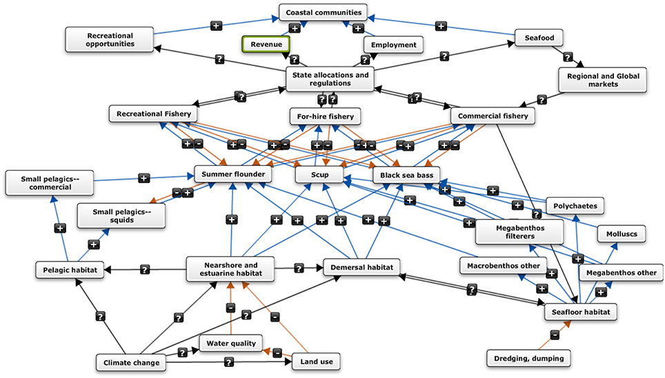
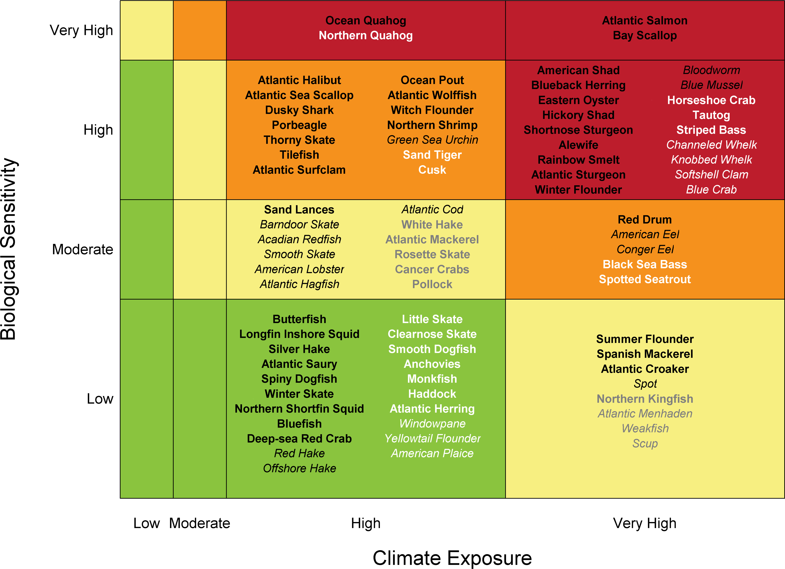
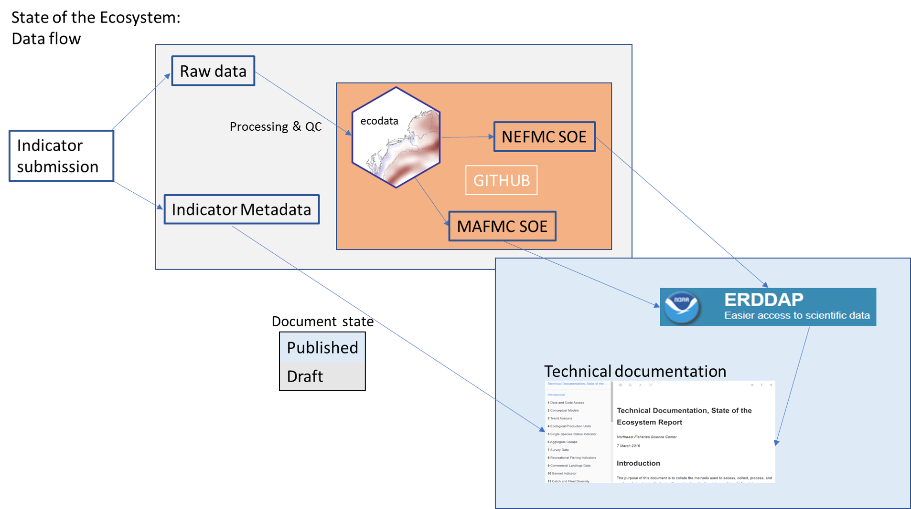

class: top, left

```{r setup, include=FALSE}

options(htmltools.dir.version = FALSE)
knitr::opts_chunk$set(echo = F,
                      warning = F,
                      message = F)
#Plotting and data libraries
library(ggplot2)
library(dplyr)
library(tidyr)
library(here)
library(kableExtra)
library(ggrepel)
library(stringr)
library(patchwork)
library(grid)
library(plotly)
library(vegan)
library(rpart)
library(colorRamps)
library(ecodata)

#GIS libraries
library(sf)
library(rgdal)
#library(raster)
library(rnaturalearth)

data.dir <- here::here("data")


#Time series constants
shade.alpha <- 0.3
shade.fill <- "lightgrey"
lwd <- 1
pcex <- 2
trend.alpha <- 0.5
trend.size <- 2
hline.size <- 1
hline.alpha <- 0.35
hline.lty <- "dashed"
label.size <- 5
hjust.label <- 1.5
letter_size <- 4
feeding.guilds <- c("Apex Predator","Piscivore","Planktivore","Benthivore","Benthos")
x.shade.min <- 2009
x.shade.max <- 2018
map.lwd <- 0.4
#Function for custom ggplot facet labels
label <- function(variable,value){
  return(facet_names[value])
}

#facet names for titles
facet_names <- list("Apex predators" = expression("Apex predators"),
                    "Piscivores" = expression("Piscivores"),
                    "Planktivores" = expression("Planktivores"),
                    "Benthivores" = expression("Benthivores"),
                    "Benthos" = expression("Benthos"))
#CRS
crs <- "+proj=longlat +lat_1=35 +lat_2=45 +lat_0=40 +lon_0=-77 +x_0=0 +y_0=0 +datum=NAD83 +no_defs +ellps=GRS80 +towgs84=0,0,0"

#Coastline shapefile
coast <- ne_countries(scale = 10,
                          continent = "North America",
                          returnclass = "sf") %>%
             sf::st_transform(crs = crs)

#State polygons
ne_states <- ne_states(country = "united states of america",
                                      returnclass = "sf") %>%
  sf::st_transform(crs = crs)

#high-res polygon of Maine
#new_england <- read_sf(gis.dir,"new_england")

#EPU shapefile
epu_sf <- ecodata::epu_sf %>% 
  filter(EPU %in% c("MAB","GB","GOM"))


```

## An integrated ecosystem assessment success story (in progress)

Diverse stakeholders agreed that an ecosystem approach was necessary. Developing and implementing an ecosystem approach to fishery management was done in collaboration between managers, stakeholders, and scientists. 
.pull-left[
*Outline*
- Mid-Atlantic Fishery Management Council Ecosystem Approach (EAFM)

- Tailoring ecosystem reporting for fishery managers

- Mid-Atlantic EAFM risk assessment 

- Mid-Atlantic EAFM conceptual modeling (towards MSE)

- Improvements: open-source data and technical documentation

]
.pull-right[
*Integrated Ecosystem Assessment*


.image-cap[
https://www.integratedecosystemassessment.noaa.gov/national/IEA-approach
]
]


???
---
## Fishery management in the US

Eight regional Fishery Management Councils establish plans for sustainable management of stocks within their jurisdictions. All are governed by the same law, but tailor management to their regional stakeholder needs.


More information: http://www.fisherycouncils.org/
https://www.fisheries.noaa.gov/topic/laws-policies#magnuson-stevens-act

---
## The Mid-Atlantic Fishery Management Council (MAFMC)

.pull-left-30[

]
.pull-right-70[

]
Source: http://www.mafmc.org/fishery-management-plans
---
## Why an ecosystem approach?

*"We rebuilt all the stocks, so why is everyone still pissed off?" --Rich Seagraves*

in 2011, the Council asked:

.pull-left[

]
.pull-right[

]

And many people answered, from commercial fishery, recreational fishery, environmental organization, and interested public perspectives.

Visioning report: 

http://www.mafmc.org/s/MAFMC-stakeholder-input-report-p7b9.pdf

---
## Common themes among all stakeholder groups:

>• There is a lack of confidence in the data that drive fishery management decisions.
>
>• Stakeholders are not as involved in the Council process as they can and should be.
>
>• Different jurisdictions and regulations among the many fishery management organizations result in complexity and inconsistency.
>
>• There is a need for increased transparency and communications in fisheries management.
>
>• The dynamics of the ecosystem and food web should be considered to a greater extent in fisheries management decisions.
>
>• Stakeholders are not adequately represented on the Council.
>
>• Pollution is negatively affecting the health of fish stocks.

Visioning report, p. 3:

http://www.mafmc.org/s/MAFMC-stakeholder-input-report-p7b9.pdf

---
## How did MAFMC develop their ecosystem approach?

Visioning Project &rarr; Strategic Plan with one objective to develop 
>"A non-regulatory umbrella document intended to guide Council policy with respect to ecosystem considerations across existing Fishery Management Plans"

.center[

]

Details, including workshop presentations and white papers:
http://www.mafmc.org/eafm

???
The Mid-Atlantic Council identified several theme areas from the visioning project as noted in the left panel of the workflow graphic: forage fish, species interactions, social and economic issues, climate and habitat. The Council held full day workshops during Council meetings where experts on the topics provided overviews and Council members asked questions and discussed the issues. Workships on Forage fish, Climate, Climate and Governance, Interactions (species and fleet), and Habitat were held between 2013 and 2015, resulting in white papers on Forage fish, Climate (and habitat), Interactions (species, fleet, climate, and habitat). Social and economic considerations were integrated in each workshop rather than looked at separately.
---
## Mid-Atlantic Council Ecosystem Approach

* 2016 Ecosystem Approach to Fishery Management (EAFM) Policy Guidance document:
http://www.mafmc.org/s/EAFM-Doc-Revised-2019-02-08.pdf

* Mid-Atlantic EAFM framework<sup>1</sup>:
.center[

]
https://www.frontiersin.org/articles/10.3389/fmars.2016.00105/full

.footnote[
[1] Gaichas, S., Seagraves, R., Coakley, J., DePiper, G., Guida, V., Hare, J., Rago, P., et al. 2016. A Framework for Incorporating Species, Fleet, Habitat, and Climate Interactions into Fishery Management. Frontiers in Marine Science, 3.
]

???
The Council’s EAFM framework has similarities to the IEA loop on slide 2. It uses risk assessment as a first step to prioritize combinations of managed species, fleets, and ecosystem interactions for consideration. Second, a conceptual model is developed identifying key environmental, ecological, social, economic, and management linkages for a high-priority fishery. Third, quantitative modeling addressing Council-specified questions and based on interactions identified in the conceptual model is applied to evaluate alternative management strategies that best balance management objectives. As strategies are implemented, outcomes are monitored and the process is adjusted, and/or another priority identified in risk assessment can be addressed. 
---
## Examples illustrating the use of the framework
.pull-left-40[


]

.pull-right-60[

Risk assessment highlights prority species/issues for more detailed evaluation

A conceptual model maps out key interactions for high risk fisheries, specifies quantitative management strategy evaluation

]

.right[

]

???
Quoted from [Gaichas et al 2016](https://www.frontiersin.org/articles/10.3389/fmars.2016.00105/full)
For this example, the [existing Mid Atlantic food web model](https://noaa-edab.github.io/tech-doc/conceptual-models.html) is used to define key species interactions for each managed species, habitat expertise is needed to link habitats to species, physical oceanographic and climate expertise is needed to link key climate drivers to habitats, and the expertise of fishermen, economists and other social scientists, and fishery managers is needed to link fish with fisheries and objectives for human well-being. The key link between fisheries and human well being objectives is identified as the system of regulatory allocations of total allowable catch between states along the Mid Atlantic coast. The interaction between this allocation system (based on historical catch) and climate-driven distribution shifts of the managed species has created considerable difficulty in this region. This conceptual model clearly connects climate considerations to management, as well as habitat considerations of concern to the Council but outside Council jurisdiction (water quality in coastal estuaries). 

---
## Why risk assessment?

Common framework across industry, science, business; but methods matter. Assessing the risks correctly is essential to good decision making.

.center[

]
https://xkcd.com/795/

---
## Mid-Atlantic Council risk assessment framework

Clarify exactly what we are assessing and why 

  * *What are we measuring?* &rarr; **Risk Element** 
  * *Why are we measuring it?* &rarr; **Risk Definition**
  * *How are we measuring it?* &rarr; **Indicator**
  * *What is the risk?* &rarr; **Risk Ranking Criteria**
  
Iterative process starting with the Council workshops

  * Council staff and scientists create examples based on Council input
  
  &uarr; &darr; &uarr; &darr; &uarr; &darr; &uarr; &darr; &uarr; &darr; &uarr; &darr; ...
                                                      
  * Council discusses, clarifies, revises with public input

Risk assessment paper<sup>1</sup>: https://www.frontiersin.org/articles/10.3389/fmars.2018.00442/full

.footnote[
[1] Gaichas, S. K., DePiper, G. S., Seagraves, R. J., Muffley, B. W., Sabo, M., Colburn, L. L., and Loftus, A. L. 2018. Implementing Ecosystem Approaches to Fishery Management: Risk Assessment in the US Mid-Atlantic. Frontiers in Marine Science, 5.
]

---
## Council-defined risk elements: Ecological

```{r riskel2}

elements<-data.frame(
  Category = c("Ecological","Ecological","Ecological","Ecological","Ecological","Ecological","Ecological","Ecological","Ecological","Ecological","Ecological","Economic","Economic","Economic","Economic","Social","Social","Food Production","Food Production","Management","Management","Management","Management","Management","Management","Put Aside","Put Aside","Put Aside","Put Aside","Put Aside","Put Aside","Put Aside","Put Aside"),
#  Category = c("Ecological","","","","","","","","","","","Economic","","","","Social","","Food Production","","Management","","","","","","Put Aside","","","","","","",""),
  Element = c("Assessment performance","F status","B status","Food web (MAFMC Predator)","Food web  (MAFMC Prey)","Food web  (Protected Species Prey)","Ecosystem productivity", "Climate","Distribution shifts", "Estuarine habitat","Offshore habitat", "Commercial Revenue", "Recreational Angler Days/Trips", "Commercial Fishery Resilience (Revenue Diversity)", "Commercial Fishery Resilience (Shoreside Support)", "Fleet Resilience", "Social-Cultural","Commercial","Recreational", "Control", "Interactions", "Other ocean uses", "Regulatory complexity", "Discards", "Allocation", "Population diversity", "Ecological diveristy", "Fishery Resilience (2)", "Fishery Resilience (3)", "Fishery Resilience (5)", "Commercial Employment", "Recreational Employment", "Seafood safety"), 
  Definition = c("Risk of not achieving OY due to analytical limitations", "Risk of not achieving OY due to overfishing", "Risk of not achieving OY due to depleted stock", "Risk of not achieving OY due to MAFMC managed species interactions", "Risk of not achieving OY due to MAFMC managed species interactions", "Risk of not achieving protected species objectives due to species interactions", "Risk of not achieving OY due to changing system productivity", "Risk of not achieving OY due to climate vulnerability", "Risk of not achieving OY due to climate-driven distribution shifts", "Risk of not achieving OY due to threats to estuarine/nursery habitat", "Risk of not achieving OY due to changing offshore habitat", "Risk of not maximizing fishery value", "Risk of not maximizing fishery value" , "Risk of reduced fishery business resilience", "Risk of reduced fishery business resilience due to shoreside support infrastructure", "Risk of reduced fishery resilience", "Risk of reduced community resilience ", "Risk of not optimizing seafood production" , "Risk of not maintaining personal food production" , "Risk of not achieving OY due to inadequate control", "Risk of not achieving OY due to interactions with species managed by other entities", "Risk of not achieving OY due to other human uses", "Risk of not achieving compliance due to complexity", "Risk of not minimizing bycatch to extent practicable", "Risk of not achieving OY due to spatial mismatch of stocks and management", "Risk of not achieving OY due to reduced diversity", "Risk of not achieving OY due to reduced diversity", "Risk of reduced fishery business resilience due to access to capital", "Risk of reduced fishery business resilience due to insurance availabilty", "Risk of reduced fishery business resilience due to access to emerging markets/opportunities", "Risk of not optimizing employment opportunities", "Risk of not optimizing employment opportunities","Risk of not maintaining market access, human health"),
  Indicators = c("Current assessment method/data quality", "Current F relative to reference F from assessment", "Current B relative to reference B from assessment","Diet composition, management measures","Diet composition, management measures","Diet composition, management measures","Four indicators, see text", "Northeast Climate Vulnerability Assessment", "Northeast Climate Vulnerability Assessment + 2 indicators", "Enumerated threats + estuarine dependence", "Integrated habitat model index", "Revenue in aggregate", "Numbers of anglers and trips in aggregate", "Species diversity of revenue", "Number of shoreside support businesses","Number of fleets, fleet diversity","Community vulnerability, fishery engagement and reliance", "Seafood landings in aggregate", "Recreational landings in aggregate", "Catch compared to allocation","Number and type of interactions with protected or non-MAFMC managed species, co-management", "Fishery overlap with energy/mining areas", "Number of regulations by species", "Standardized Bycatch Reporting", "Distribution shifts + number of interests","Size composition, sex ratio, genetic diversity", "Fishery independent species diversity",  "No current indicator available", "No current indicator available", "Needs clarification","EOP Committee unconfident in Fisheries of US employment inicator","EOP Committee unconfident in Fisheries of US employment indicator", "Number of public advisories by species") 
)

elements1<-elements %>%
  filter(Category == "Ecological") %>%
  select(Element, Definition, Indicators)

kable(elements1, "html") %>%
  kable_styling(bootstrap_options = c("striped", "condensed"), font_size = 12) %>%
  group_rows("Ecological", 1,11) 

```

---
## Risk elements: Economic, Social, and Food Production
```{r elements2}

elements2<-elements %>%
  filter(Category %in% c("Economic", "Social", "Food Production")) %>%
  select(Element, Definition, Indicators)

kable(elements2, "html") %>%
  kable_styling(bootstrap_options = c("striped", "condensed"), font_size = 14) %>%
  group_rows("Economic", 1,4) %>%
  group_rows("Social", 5,6) %>%
  group_rows("Food Production", 7,8)

```

---
## Risk elements: Management
```{r elements3}

elements3<-elements %>%
  filter(Category == "Management") %>%
  select(Element, Definition, Indicators)

kable(elements3, "html") %>%
  kable_styling(bootstrap_options = c("striped", "condensed"), font_size = 14) %>%
  group_rows("Management", 1,6) #%>%
  #group_rows("Put Aside", 26,33) 

```

---
background-image: url("EDAB_images/IMG_2246.jpg")
background-size: cover
## <center>But where will the risk assessment indicators come from?</center>

---

## Meanwhile, scientists were improving ecosystem reports:

*"So what?" --John Boreman, September 2016*

1. Clear linkage of ecosystem indicators with management objectives

1. Synthesis across indicators for big picture

1. Objectives related to human-well being placed first in report

1. Short (< 30 pages), non-technical (but rigorous) text

1. Emphasis on reproducibility 
.center[

]
???
State of the ecosystem reports were revised to emphasize linkages between management objectives, local social systems, human activities, marine habitat, the environment, and the marine ecological community.

---
## Revised ecosystem status reporting
.pull-left[

### Report structure
0. Synthetic overview

1. Human dimensions

2. Protected species

3. Fish and invertebrates (managed and otherwise)

4. Habitat quality and ecosystem productivity
]

.pull-right[
.table[
<table class="table" style="width: 50; margin-left: auto; margin-right: auto;">
<caption>Ecosystem-scale objectives and indicators on the Northeast US shelf</caption>
 <thead>
  <tr>
   <th style="text-align:left;font-weight: bold;"> Objective Categories </th>
   <th style="text-align:left;font-weight: bold;"> Indicators </th>
  </tr>
 </thead>
<tbody>
  <tr>
   <td style="text-align:left;"> Seafood Production </td>
   <td style="text-align:left;"> Landings by feeding guild </td>
  </tr>
  <tr>
   <td style="text-align:left;"> Profits </td>
   <td style="text-align:left;"> Revenue by feeding guild </td>
  </tr>
  <tr>
   <td style="text-align:left;"> Recreation </td>
   <td style="text-align:left;"> Number of anglers and trips; recreational catch </td>
  </tr>
  <tr>
   <td style="text-align:left;"> Stability </td>
   <td style="text-align:left;"> Diversity indices (fishery and species) </td>
  </tr>
  <tr>
   <td style="text-align:left;"> Social &amp; Cultural </td>
   <td style="text-align:left;"> Commercial and recreational reliance </td>
  </tr>
  <tr>
   <td style="text-align:left;"> Biomass </td>
   <td style="text-align:left;"> Biomass or abundance by feeding guild from surveys </td>
  </tr>
  <tr>
   <td style="text-align:left;"> Productivity </td>
   <td style="text-align:left;"> Condition and recruitment of managed species </td>
  </tr>
  <tr>
   <td style="text-align:left;"> Trophic structure </td>
   <td style="text-align:left;"> Relative biomass of feeding guilds, primary productivity </td>
  </tr>
  <tr>
   <td style="text-align:left;"> Habitat </td>
   <td style="text-align:left;"> Estuarine and offshore habitat conditions </td>
  </tr>
</tbody>
</table>
]
]
---
## Standardized indicator visualization in reports

Status (short-term) and trend (long-term) of components are measured as **indicators** and plotted in a standardized way

Indicators are selected to

1. Be broadly informative about a component in a management context<sup>1-3</sup>

1. Minimize redundancy of information

1. Be responsive to ecosystem change


```{r doc-orientation, echo = F, warning = F, message=F, fig.height = 3, fig.width=8, fig.align = "center", dev='png', fig.show='hide'}
m <- 0.1
x <- 1989:2018
y <-  m*x + rnorm(30, sd = 0.35)

data <- data.frame(x = x,
                  y = y)

#Define constants for figure plot
x.shade.max <- max(x)
x.shade.min <- x.shade.max - 9 
hline = mean(y)

#Plot series with trend 
ggplot2::ggplot(data = data,aes(x = x, y = y)) +
  #Highlight last ten years
  annotate("rect", fill = shade.fill, alpha = shade.alpha,
      xmin = x.shade.min , xmax = x.shade.max,
      ymin = -Inf, ymax = Inf) +
  geom_point(size = pcex) +
  scale_color_manual(aesthetics = "color")+
  guides(color = FALSE) +
  geom_hline(aes(yintercept = hline),
              size = hline.size,
             alpha = hline.alpha,
             linetype = hline.lty)+
  geom_line() +
  geom_gls() +
  scale_y_continuous(labels = function(l){trans = l / 1000})+
  scale_x_continuous(breaks = seq(1985, 2015, by = 5), expand = c(0.01, 0.01)) +
  ylab(expression("Invented Index, 10"^3*"widgets")) +
  xlab("Year") +
  ggtitle("Indicator Z") +
  theme_ts() +
  theme(plot.title = element_text(size = 16),
        axis.title = element_text(size = 14))
```

.center[
`)
]
.footnote[
[1] Rice J. C.Rochet M. J. "A framework for selecting a suite of indicators for fisheries management." ICES Journal of Marine Science 62 (2005): 516–527.  
[2] Link J. 2010. Ecosystem-Based Fisheries Management: Confronting Tradeoffs . Cambridge University Press, New York.  
[3] Zador, Stephani G., et al. "Ecosystem considerations in Alaska: the value of qualitative assessments." ICES Journal of Marine Science 74.1 (2017): 421-430.
]
???
The figure format is illustrated here. Trend lines are shown when slope is significantly different from 0 at the p < 0.05 level. An orange line signifies an overall positive trend, and purple signifies a negative trend. To minimize bias introduced by small sample size, no trend is fit for < 30 year time series. Dashed lines represent mean values of time series unless the indicator is an anomaly, in which case the dashed line is equal to 0. Shaded regions indicate the past ten years. If there are no new data for the most recent year, the shaded region will still cover this time period. 
---
## Indicator spatial scales--already Mid-Atlantic specific

.center[

]
.footnote[
https://noaa-edab.github.io/tech-doc/epu.html
]

???
Indicators 

---
## Risk assessent indicators and ranking criteria: Commercial revenue 

This element is applied at the ecosystem level. Revenue serves as a proxy for commercial profits.

.table[
.pull-left[
```{r riskcomval, echo=FALSE, message=FALSE, warnings=FALSE, results='asis'}
tabl <- "
| Risk Level         | Definition                                                          |  
|:-------------------|:--------------------------------------------------------------------|
| Low  | No trend and low variability in revenue |
| Low-Moderate | Increasing or high variability in revenue |
| Moderate-High | Significant long term revenue decrease |
| High | Significant recent decrease in revenue |
"
cat(tabl) # output the table in a format good for HTML/PDF/docx conversion
```
]
]
.pull-right[
```{r total-rev, fig.height = 3}
source("R/total_revenue_plot.R")
mab_totalrev <- plot_total_revenue(epu_abbr = "MAB", council = "MAFMC")

mab_totalrev
```

```{r bennet, fig.height = 3}
#Filter data into two dataframes for plotting
indicators <- ecodata::bennet %>% 
  filter(EPU == "MAB",
         Var %in% c("VI EPU aggregate",
                    "PI EPU aggregate")) %>% 
  mutate(Var, Var = plyr::mapvalues(Var, from = c("VI EPU aggregate","PI EPU aggregate"),
                                    to = c("Volume","Price")))

revchange <- ecodata::bennet %>% 
  filter(EPU == "MAB",
         Var %in% c("REVCHANGE EPU aggregate"))

#custom bar fill color (color-blind friendly)
ind_fill <- c("#a6cee3", "#b2df8a")

#limits
y.lim <- c(-450,450)

#plot
ggplot(data = indicators)+
  
  #Highlight last ten years
  annotate("rect", fill = shade.fill, alpha = shade.alpha,
      xmin = x.shade.min , xmax = x.shade.max,
      ymin = -Inf, ymax = Inf)+
  
  geom_bar(aes(x=Time, y= Value, fill = Var), stat="identity")+
  scale_fill_manual(name = "Indicators", values = ind_fill) +
  geom_line(data = revchange, aes(x = Time, y = Value, colour="$"))+
  scale_colour_grey(name ="Revenue Change") +
  ggtitle("Bennet Indicator")+
  labs(y="Value $1,000,000 ($2015)") +
  scale_x_continuous(breaks = seq(1985, 2015, by = 5), expand = c(0.01, 0.01)) +
  scale_y_continuous(breaks = seq(y.lim[1], y.lim[2], by = 100), limits = y.lim, expand = c(0.01, 0.01)) +
  theme_ts() +
  theme(title = element_text(size = 10))

```

]

Ranked moderate-high risk due to the significant long term revenue decrease for Mid-Atlantic managed species (red points in top plot)

---
## Risk assessent indicators and ranking criteria: System productivity

This element is applied at the ecosystem level, and ranks the risk of not achieving optimum yield due to changes in ecosystem productivity at the base of the food web.

Four indicators are used together to assess risk of changing ecosystem productivity: primary production, zooplankton abundance, fish condition and fish recruitment. 

.table[
```{r riskecop, echo=FALSE, message=FALSE, warnings=FALSE, results='asis'}
tabl <- "
| Risk Level         | Definition                                                          |  
|:-------------------|:--------------------------------------------------------------------|
| Low  | No trends in ecosystem productivity |
| Low-Moderate | Trend in ecosystem productivity (1-2 measures, increase or decrease) |
| Moderate-High | Trend in ecosystem productivity (3+ measures, increase or decrease) |
| High | Decreasing trend in ecosystem productivity, all measures |
"
cat(tabl) # output the table in a format good for HTML/PDF/docx conversion
```
]
???
We examine trends in total primary production, zooplankton abundance for a key Mid-Atlantic species, and two aggregate fish productivity measures: condition factor (weight divided by length of individual fish) and a survey based "recruitment" (small fish to large fish) index.

---
## Risk assessent indicators and ranking criteria: System productivity
.pull-left[
```{r pp-trends, fig.height=4}
out_pp <- ecodata::chl_pp %>% 
  filter(EPU %in% c("MAB", "GOM","GB"),
         str_detect(Var, "MONTHLY_PPD_MEDIAN")) %>% 
  separate(.,Time, into = c("Year","Month"), sep = 4) %>% 
    mutate(Month = plyr::mapvalues(Month, from = c("01","02","03","04","05","06",
                                                   "07","08","09","10","11","12"),
                                   to = c(month.abb))) %>% 
  group_by(EPU, Month) %>% 
  mutate(hline = mean(Value))
out_pp$Month <- factor(out_pp$Month, levels = month.abb)

 
 pp_cci_mab <-out_pp %>% 
  filter(EPU == "MAB") %>% 
 ggplot() +
   # geom_gls(aes(x = Year, y = Value, group = Month))+
    geom_point(aes(x = Year, y = Value, group = Month)) +
    geom_line(aes(x = Year, y = Value, group = Month)) +
    scale_x_discrete(name = "Time", breaks = seq(min(out_pp$Year),max(out_pp$Year),10)) +  
    facet_wrap(Month~., ncol = 6) +
    ggtitle("MAB Monthly median PPD") +
    ylab(expression("PP (gC m"^-2*" d"^-1*")")) +
        geom_hline(aes(yintercept = hline,
                     group = Month),
           size = hline.size,
           alpha = hline.alpha,
           linetype = hline.lty)+
    theme_facet() +
    theme(axis.text.x = element_text(angle=45, hjust = 1),
          panel.spacing = unit(1, "lines"),
          plot.margin = unit(c(0.1, 0, 0, 0), "cm"))
 
 pp_cci_mab 
 
```

.center[

]
]

.pull-right[
```{r seasonal-zoo, fig.height=4}
facet_names <- list(
  'centropages spring'=expression(paste(italic("Centropages "), "spring")),
  'centropages fall'=expression(paste(italic("Centropages "), "fall")),
  'temora spring'=expression(paste(italic("Temora "), "spring")),
  'temora fall' = expression(paste(italic("Temora "), "fall")),
  'pseudocalanus spring'=expression(paste(italic("Pseudocalanus "), "spring")),
  'pseudocalanus fall' = expression(paste(italic("Pseudocalanus "), "fall")))

zoo_oi_mab <- ecodata::zoo_oi %>% 
  filter(!str_detect(Var,"SD"),
         EPU == "MAB") %>% 
  
  mutate(Var = str_remove(Var, " zoo"),
         Val2 = exp(Value)) %>% 
      group_by(Var) %>% 
  mutate(hline = mean(Val2, na.rm = T)) %>% 
  separate(.,col = Var, into = c("Species","Season"), remove = F)


top <- zoo_oi_mab %>%  
  filter(Species == "centropages") %>% 

ggplot(aes(x = Time, y = Val2, group = Var)) +
  annotate("rect", fill = shade.fill, alpha = shade.alpha,
      xmin = x.shade.min , xmax = x.shade.max,
      ymin = 0, ymax = Inf) +
  geom_hline(aes(yintercept = hline),
     size = hline.size,
     alpha = hline.alpha,
     linetype = hline.lty)+
  geom_gls() +
  geom_line()+
  geom_point()+
  ylab("") +
  facet_wrap(Var ~ ., ncol = 2, scales='free_x',labeller = label) +
  ggtitle("Zooplankton abundance (OI)") +
  scale_x_continuous(expand = c(0.01, 0.01))+
  scale_y_continuous(trans = "log10")+
  theme_facet() +
    theme(strip.text=element_text(hjust=0,
                                face = "italic"),
          axis.title.x=element_blank(),
        axis.text.x=element_blank(),
        axis.ticks.x=element_blank())

middle <- zoo_oi_mab %>%  
  filter(Species == "pseudocalanus") %>% 
ggplot(aes(x = Time, y = Val2, group = Var)) +
  annotate("rect", fill = shade.fill, alpha = shade.alpha,
      xmin = x.shade.min , xmax = x.shade.max,
      ymin = 0, ymax = Inf) +
  geom_hline(aes(yintercept = hline),
     size = hline.size,
     alpha = hline.alpha,
     linetype = hline.lty)+
  geom_gls() +
  geom_line()+
  geom_point()+
  ylab(expression("Abundance num m"^-3*"")) +
  facet_wrap(Var ~ ., ncol = 2, scales='free_x',labeller = label) +
  scale_x_continuous(expand = c(0.01, 0.01))+
  scale_y_continuous(trans = "log10")+
  theme_facet() +
    theme(strip.text=element_text(hjust=0,
                                face = "italic"),
          axis.title.x=element_blank(),
        axis.text.x=element_blank(),
        axis.ticks.x=element_blank())

bottom <- zoo_oi_mab %>%  
  filter(Species == "temora") %>% 
ggplot(aes(x = Time, y = Val2, group = Var)) +
  annotate("rect", fill = shade.fill, alpha = shade.alpha,
      xmin = x.shade.min , xmax = x.shade.max,
      ymin = 0, ymax = Inf) +
  geom_hline(aes(yintercept = hline),
     size = hline.size,
     alpha = hline.alpha,
     linetype = hline.lty)+
    geom_gls() +
  geom_line()+
  geom_point()+
    ylab("") +
  facet_wrap(Var ~ ., ncol = 2,labeller = label) +
  scale_x_continuous(breaks = seq(1980,2010,10),
                     expand = c(0.01, 0.01))+

  theme_facet() +
    theme(strip.text=element_text(hjust=0,
                                face = "italic")) +
   scale_y_log10()

top + middle + bottom + plot_layout(ncol = 1) & theme(plot.margin = margin(0,0,0,0,"cm"))
```


```{r fish-prod , fig.height=4}
source("R/productivity_plots.R")
prod <- productivity_plots()
prod
```
]

Ranked low-moderate risk due to the significant long term trends in zooplankton abundance for major species (top right plot)

---
## Risk assessent indicators and ranking criteria: Climate 

This element is applied at the species level. Risks to species productivity (and therefore to achieving optimum yield) due to projected climate change in the Northeast US were evaluated in a comprehensive assessment<sup>1</sup>.

.table[
.pull-left[
```{r riskclim, echo=FALSE, message=FALSE, warnings=FALSE, results='asis'}
tabl <- "
| Risk Level         | Definition                                                          |  
|:-------------------|:--------------------------------------------------------------------|
| Low  | Low climate vulnerability ranking |
| Low-Moderate | Moderate climate vulnerability ranking |
| Moderate-High | High climate vulnerability ranking |
| High | Very high climate vulnerability ranking |
"
cat(tabl) # output the table in a format good for HTML/PDF/docx conversion

```
]
]
.pull-right[

]
.footnote[
[1] Hare, J. A., Morrison, W. E., Nelson, M. W., Stachura, M. M., Teeters, E. J., Griffis, R. B., Alexander, M. A., et al. 2016. A Vulnerability Assessment of Fish and Invertebrates to Climate Change on the Northeast U.S. Continental Shelf. PLOS ONE, 11: e0146756. https://journals.plos.org/plosone/article?id=10.1371/journal.pone.0146756.
]

Each species ranked according to position/color in the plot on the right

---
## Risk assessment results: *Species and sector level elements<sup>1</sup>*
```{r spsectable,  echo=FALSE, message=FALSE, warnings=FALSE}
#tab.cap="Species and sector level risk analysis results; l=low risk (green), lm= low-moderate risk (yellow), mh=moderate to high risk (orange), h=high risk (red)\\label{sptable}",

risk.sppsector<-data.frame(
  Species = c("Ocean Quahog-C", "Surfclam-C", "Summer flounder-R", "Summer flounder-C","Scup-R", "Scup-C","Black sea bass-R", "Black sea bass-C","Atl. mackerel-R", "Atl. mackerel-C","Butterfish-C", "Longfin squid-C", "Shortfin squid-C", "Golden tilefish-R", "Golden tilefish-C","Blueline tilefish-R","Blueline tilefish-C", "Bluefish-R", "Bluefish-C","Spiny dogfish-R", "Spiny dogfish-C", "Unmanaged forage", "Deepsea corals"),
  MgtControl = c(1,1,3,2,1,1,4,2,1,1,1,1,1,9,1,1,1,2,1,1,1,9,9),
  TecInteract = c(1,1,1,3,1,3,1,2,1,2,2,3,2,1,1,1,1,1,1,1,3,9,9),
  OceanUse = c(2,2,2,2,2,2,3,4,1,3,3,4,2,1,1,1,1,1,2,1,3,9,3),
  RegComplex = c(1,1,4,3,3,3,4,3,1,4,4,4,2,1,1,3,3,1,2,1,3,9,9),
  Discards = c(1,1,4,2,3,3,3,2,1,2,3,4,1,1,1,1,1,3,2,1,2,9,9),
  Allocation = c(1,1,4,4,1,1,4,4,4,4,1,4,1,1,1,4,4,4,4,1,4,9,9) 
)

#convert to text for consistency
risk.sppsector <- risk.sppsector %>%
     mutate_at(vars(-Species), function(x){
       recode(x,'1'="lowest",'2'="lowmod",'3'="modhigh",'4'="highest",'9'="na")}) %>%
     as.data.frame()

#make table
risk.sppsector %>%
  mutate_at(vars(-Species), function(x){ 
    cell_spec(x, format="html", color = factor(x, c("na", "lowest", "lowmod", "modhigh", "highest"),c("black", "black", "black", "black", "white")), align = "c", background =factor(x, c("na", "lowest", "lowmod", "modhigh", "highest"),c("white", "lightgreen", "yellow", "orange", "red")), background_as_tile=F)}) %>%
  kable(format = "html", escape = F, table.attr='class="risktable"') %>%
  kable_styling(font_size = 14) 

```

.footnote[
[1] Gaichas, S. K., DePiper, G. S., Seagraves, R. J., Muffley, B. W., Sabo, M., Colburn, L. L., and Loftus, A. L. 2018. Implementing Ecosystem Approaches to Fishery Management: Risk Assessment in the US Mid-Atlantic. Frontiers in Marine Science, 5.
]

???

---
## Risk assessment results updated with 2019 indicators
*Species level risk elements*
```{r sptable,  echo=FALSE, message=FALSE, warnings=FALSE}

#tab.cap="Species level risk analysis results; l=low risk (green), lm= low-moderate risk (yellow), mh=moderate to high risk (orange), h=high risk (red)\\label{sptable}",

# spplist     oc,  sc,  flk, scp, bsb, mack, but, lsq, ssq, gtile,  btile,  blu, dog, monk
risk.species<-data.frame(
  Species = c("Ocean Quahog", "Surfclam", "Summer flounder", "Scup", "Black sea bass", "Atl. mackerel", "Butterfish", "Longfin squid", "Shortfin squid", "Golden tilefish", "Blueline tilefish", "Bluefish", "Spiny dogfish", "Monkfish", "Unmanaged forage", "Deepsea corals"),
  Assess  = c("l", "l", "l",  "l", "l", "l",  "l", "lm", "lm", "l", "h", "l", "lm", "h", "na", "na"),
  Fstatus = c("l", "l", "l", "l", "l", "h", "l", "lm", "lm", "l", "h", "l", "l", "lm", "na", "na"),
  Bstatus = c("l", "l", "lm", "l", "l", "h", "l", "lm", "lm", "lm", "mh", "lm", "lm", "lm", "na", "na"),
  FW1Pred = c("l", "l", "l", "l", "l", "l", "l", "l", "l", "l", "l", "l", "l", "l", "l", "l"),
  FW1Prey = c("l", "l", "l", "l", "l", "l", "l", "l", "l", "l", "l", "l", "l", "l", "lm", "l"),
  FW2Prey = c("l", "l", "l", "l", "l", "l", "l", "lm", "lm", "l", "l", "l", "l", "l", "lm", "l"),
  Climate = c("h", "mh", "lm", "lm", "mh", "lm", "l", "l", "l", "mh", "mh","l", "l", "l", "na", "na"),
  DistShift = c("mh", "mh", "mh", "mh", "mh", "mh", "h", "mh", "h", "l", "l", "mh", "h", "mh", "na", "na"),
  EstHabitat = c("l", "l", "h", "h", "h", "l", "l", "l", "l", "l", "l", "h", "l", "l", "na", "na")#,
#  OffHabitat = c("na", "na", "l", "l", "l", "l", "l", "l", "h", "na", "na", "na", "l", "l", "na", "na")#,
)

# these elements were removed by the council
#  PopDiv = c("na", "na", "na", "na", "na", "na", "na", "na", "na", "na", "na", "na", "na", "na"),
#  FoodSafe = c(),

# one column test
# risk.species %>%
#   mutate(Fstatus = 
#     cell_spec(Fstatus, format="latex", color = "black", align = "c", background =factor(Fstatus, c("na", "l", "lm", "mh", "h"),c("white", "green", "yellow", "orange", "red")))) %>%
#   kable(risk.species, format="latex", escape = F, booktabs = T, linesep = "")

#convert to longer text for consistency and display in html table
risk.species <- risk.species %>%
     mutate_at(vars(-Species), function(x){
       recode(x,'l'="lowest",'lm'="lowmod",'mh'="modhigh",'h'="highest")}) %>%
     as.data.frame()

#generalize to all
risk.species %>%
  mutate_at(vars(-Species), function(x){ 
    cell_spec(x, format="html", color = factor(x, c("na", "lowest", "lowmod", "modhigh", "highest"),c("black", "black", "black", "black", "white")), align = "c", background =factor(x, c("na", "lowest", "lowmod", "modhigh", "highest"),c("white", "lightgreen", "yellow", "orange", "red")), background_as_tile=F)}) %>%
  kable(format = "html", escape = F, table.attr='class="risktable"') %>%
  kable_styling(font_size = 14) 

```

*Ecosystem level risk elements*
```{r ecotable,  echo=FALSE, message=FALSE, warnings=FALSE}
  
#tab.cap="Ecosystem level risk analysis results; l=low risk (green), lm= low-moderate risk (yellow), mh=moderate to high risk (orange), h=high risk (red)\\label{sptable}",

risk.eco<-data.frame(
  System = c("Mid-Atlantic"),
  EcoProd = c("lm"),
  #EcoDiv = c("lm"),
  CommRev = c("mh"),
  RecVal = c("h"),
  FishRes1 = c("l"),
  FishRes4 = c("mh"),
  #CommJobs = c("mh"),
  #RecJobs = c("l"),
  FleetDiv = c("l"),
  Social = c("lm"),
  ComFood = c("h"),
  RecFood = c("mh")
)

#convert to longer text for consistency and display in html table
risk.eco <- risk.eco %>%
     mutate_at(vars(-System), function(x){
       recode(x,'l'="lowest",'lm'="lowmod",'mh'="modhigh",'h'="highest")}) %>%
     as.data.frame()

#make table
risk.eco %>%
  mutate_at(vars(-System), function(x){ 
    cell_spec(x, format="html", color = factor(x, c("na", "lowest", "lowmod", "modhigh", "highest"),c("black", "black", "black", "black", "white")), align = "c", background =factor(x, c("na", "lowest", "lowmod", "modhigh", "highest"),c("white", "lightgreen", "yellow", "orange", "red")), background_as_tile=F)}) %>%
  kable(format = "html", escape = F, table.attr='class="risktable"') %>%
  kable_styling(font_size = 14) 

```


---
## How is MAFMC using the risk assessment? What's next?
.pull-left[
* Based on risk assessment, the Council selected summer flounder as high-risk fishery for conceptual modeling


]
.pull-right[
* Working group of habitat, biology, stock assessment, management, economic and social scientists developed:

  * draft conceptual models of high risk elements, linkages
  * dataset identification and gap analysis for each element and link
  * draft questions that the Council could persue with additional work
]  
* Final conceptual model and supporting information at December 2019 Council meeting

* Council to proceed with management strategy evaluation (MSE) using the information from conceptual modeling as a basis. Topic: addressing recreational fishery discards with EAFM


---
```{r sfconceptmod, echo = F, fig.align = "center"}
# setup for conceptual model
PKG <- c(#"foreign","foodweb","sna", "DiagrammeR","circlize", "kableExtra", "googledrive", "readxl"
         "RColorBrewer","QPress",
         "chorddiag")

for (p in PKG) {
  if(!require(p,character.only = TRUE)) {
    install.packages(p)
    require(p,character.only = TRUE)}
}


#assumes this is a project and .dia file is in data directory
edges <- model.dia(file.path(data.dir, "Summer_Flounder_July22_2019.dia"))

source("R/interactive_chord_sfconsmod.R")

interactive_chord_sfconsmod(edges, width=710, height=710, margin=130)

```
???
In this interactive circular graph visualization, model elements identified as important by the Council (through risk assessment) and by the working group (through a range of experience and expertise) are at the perimeter of the circle. Elements are defined in detail in the last section of [this page](https://gdepiper.github.io/Summer_Flounder_Conceptual_Models/sfconsmod_riskfactors_subplots.html). Relationships between elements are represented as links across the center of the circle to other elements on the perimeter. Links from a model element that affect another element start wide at the base and are color coded to match the category of the element they affect.Hover over a perimeter section (an element) to see all relationships for that element, including links from other elements. Hover over a link to see what it connects. Links by default show text for the two elements and the direction of the relationship (1 for relationship, 0 for no relationship--most links are one direction).For example, hovering over the element "Total Landings" in the full model shows that the working group identified the elements affected by landings as Seafood Production, Recreational Value, and Commercial Profits (three links leading out from landings), and the elements affecting landings as Fluke SSB, Fluke Distributional Shift, Risk Buffering, Management Control, Total Discards, and Shoreside Support (6 links leading into Total Landings).

---
## Conclusions

Integrated ecosystem assessment is a valuable framework for the general implementation of ecosystem approaches to natural resource management

* The Council’s rapid progress in implementing EAFM resulted from positive collaboration between managers, stakeholders, and scientists. Collaboration is essential to IEA and to the success of EAFM.

* Ecosystem indicators and reporting can be tailored to specific regional objectives.

* Risk assessment is a rapid, familiar, scaleable, and transparent method to move forward with EAFM within a real-world operational fishery management context.

* This EAFM process highlights certain species and certain management issues as posing higher cumulative risks to meeting Council-derived management objectives when considering a broad range of ecological, social, and economic factors.

* Conceptual modeling links the key factors for high risk fisheries and scopes more detailed integrated analysis and management strategy evaluation.

???
The Council foresees refining the process so that ecosystem indicators monitor risks to achieving ecological, social, and economic fishery objectives, which can then be mitigated through management action. 

---
## Footnote: Improvements to reproducibility and provenance

* Reporting the information is not enough
* Managers appreciate the concise format, but back-end critical for describing collection, analyses, and processing
* Streamlined workflow allowed scientists to meet management deadlines
  
  

???
This workflows also ensures that there's no information lost between SOE cycles. We know exactly how a data set was analyzed and handled so that the data can be updated for next year's reports.

---
## If you want **all** the details

* [Mid-Atlantic Council EAFM paper](https://www.frontiersin.org/articles/10.3389/fmars.2016.00105/full)

* [Mid-Atlantic Council Risk Assessment paper](https://www.frontiersin.org/articles/10.3389/fmars.2018.00442/full#h11)

* [Mid-Atlantic Council Summer Flounder conceptual model and support tables](https://gdepiper.github.io/Summer_Flounder_Conceptual_Models/sfconsmod_riskfactors_subplots.html)

* [2019 Mid-Atlantic State of the Ecosystem report](http://www.mafmc.org/s/SOE-MAFMC-2019.pdf)

* [State of the Ecosystem Technical Documentation](https://noaa-edab.github.io/tech-doc)

* [ecodata R package](https://github.com/noaa-edab/ecodata)

  * [Macrofauna indicators](http://noaa-edab.github.io/ecodata/macrofauna)
  * [Human Dimensions indicators](http://noaa-edab.github.io/ecodata/human_dimensions)
  * [Lower trophic level indicators](http://noaa-edab.github.io/ecodata/LTL)


* Slides available at https://noaa-edab.github.io/presentations

---
## Contributors - THANK YOU!

The New England and Mid-Atlantic Ecosystem reports made possible by (at least) 38 contributors from 8 institutions 

.pull-left[
.contrib[
Donald Anderson (Woods Hole Oceanographic Institute) <br>
Amani Bassyouni (Virginia Department of Health)<br>
Lisa Calvo (Rutgers)<br>
Matthew Camisa (MA Division of Marine Fisheries) <br>
Patricia Clay<br>
Lisa Colburn<br>
Geret DePiper<br>
Deb Duarte<br>
Michael Fogarty<br>
Paula Fratantoni <br>
Kevin Friedland<br>
Sarah Gaichas<br>
James Gartland (Virginia Institute of Marine Science)<br>
Heather Haas<br>
Sean Hardison <br>
Kimberly Hyde<br>
Terry Joyce (Woods Hole Oceanographic Institute)<br>
John Kosik<br>
Steve Kress (National Audubon Society)<br>
Scott Large
]
]

.pull-right[
.contrib[
Don Lyons (National Audubon Society)<br>
Loren Kellogg<br>
David Kulis (Woods Hole Oceanographic Institute)<br>
Sean Lucey<br>
Chris Melrose<br>
Ryan Morse<br>
Kimberly Murray<br>
Chris Orphanides<br>
Richard Pace<br>
Charles Perretti<br>
Karl Roscher (Maryland Department of Natural Resources)<br>
Vincent Saba<br>
Laurel Smith<br>
Mark Terceiro<br>
John Walden<br>
Harvey Walsh<br>
Mark Wuenschel<br>
Qian Zhang (Unversity of Maryland and US EPA Chesapeake Bay Program)
]
]

.center[

]
---
class: inverse
background-image: url("EDAB_images/IMG_2809.jpg")
background-size: cover

## Questions? Thank you!

&nbsp;

&nbsp;

&nbsp;

&nbsp;

&nbsp;

&nbsp;

&nbsp;

.pull-left[
Contacts:  
]
.pull-right[
sarah.gaichas@noaa.gov  
geret.depiper@noaa.gov  
bmuffley@mafmc.org  
sean.lucey@noaa.gov  
]
 