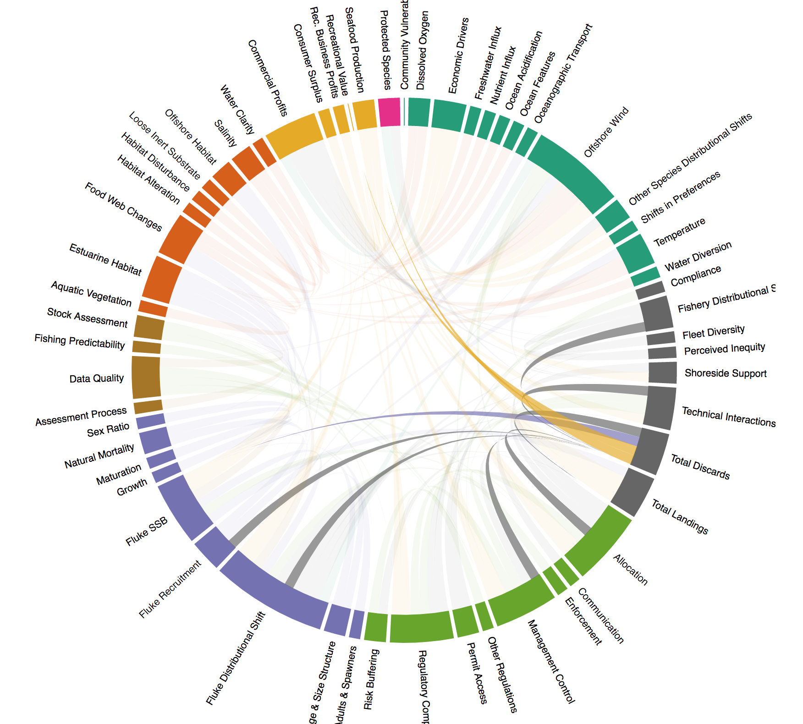

class: top, left

```{r setup, include=FALSE}

options(htmltools.dir.version = FALSE)
knitr::opts_chunk$set(echo = F,
                      warning = F,
                      message = F)
#Plotting and data libraries
library(ggplot2)
library(dplyr)
library(tidyr)
library(here)
library(kableExtra)
library(ggrepel)
library(stringr)
library(patchwork)
library(grid)
library(plotly)
library(vegan)
library(rpart)
library(colorRamps)
library(ecodata)

#GIS libraries
library(sf)
library(rgdal)
#library(raster)
library(rnaturalearth)

data.dir <- here::here("data")


#Time series constants
shade.alpha <- 0.3
shade.fill <- "lightgrey"
lwd <- 1
pcex <- 2
trend.alpha <- 0.5
trend.size <- 2
hline.size <- 1
hline.alpha <- 0.35
hline.lty <- "dashed"
label.size <- 5
hjust.label <- 1.5
letter_size <- 4
feeding.guilds <- c("Apex Predator","Piscivore","Planktivore","Benthivore","Benthos")
x.shade.min <- 2009
x.shade.max <- 2019
map.lwd <- 0.4
#Function for custom ggplot facet labels
label <- function(variable,value){
  return(facet_names[value])
}

#facet names for titles
facet_names <- list("Apex predators" = expression("Apex predators"),
                    "Piscivores" = expression("Piscivores"),
                    "Planktivores" = expression("Planktivores"),
                    "Benthivores" = expression("Benthivores"),
                    "Benthos" = expression("Benthos"))
#CRS
crs <- "+proj=longlat +lat_1=35 +lat_2=45 +lat_0=40 +lon_0=-77 +x_0=0 +y_0=0 +datum=NAD83 +no_defs +ellps=GRS80 +towgs84=0,0,0"

#Coastline shapefile
coast <- ne_countries(scale = 10,
                          continent = "North America",
                          returnclass = "sf") %>%
             sf::st_transform(crs = crs)

#State polygons
ne_states <- ne_states(country = "united states of america",
                                      returnclass = "sf") %>%
  sf::st_transform(crs = crs)

#high-res polygon of Maine
#new_england <- read_sf(gis.dir,"new_england")

#EPU shapefile
epu_sf <- ecodata::epu_sf %>% 
  filter(EPU %in% c("MAB","GB","GOM"))

#Region identifiers
epu <- "Mid-Atlantic Bight"
epu_abbr <- "MAB"
region <- "Mid-Atlantic"
region_abbr <- "MA" #Some commercial data organized by "MA" or "NE" regions, not by EPU 


```


## Mid-Atlantic Council Ecosysytem Approach (work in progress)

Diverse stakeholders agreed that an ecosystem approach was necessary. Developing and implementing an ecosystem approach to fishery management was done in collaboration between managers, stakeholders, and scientists. 
.pull-left[
*Outline*
- Mid-Atlantic Fishery Management Council Ecosystem Approach (EAFM)

- Mid-Atlantic EAFM indicator-based risk assessment 

- Mid-Atlantic EAFM conceptual modeling (towards MSE)

]
.pull-right[
*Integrated Ecosystem Assessment*


.image-cap[
https://www.integratedecosystemassessment.noaa.gov/national/IEA-approach
]
]


???
---
## Mid-Atlantic Council Ecosystem Approach Framework

* 2016 Ecosystem Approach to Fishery Management (EAFM) Policy Guidance document:
http://www.mafmc.org/s/EAFM-Doc-Revised-2019-02-08.pdf

* Mid-Atlantic EAFM framework<sup>1</sup>:
.center[

]
https://www.frontiersin.org/articles/10.3389/fmars.2016.00105/full

.footnote[
[1] Gaichas, S., Seagraves, R., Coakley, J., DePiper, G., Guida, V., Hare, J., Rago, P., et al. 2016. A Framework for Incorporating Species, Fleet, Habitat, and Climate Interactions into Fishery Management. Frontiers in Marine Science, 3.
]

???
The Council’s EAFM framework has similarities to the IEA loop on slide 2. It uses risk assessment as a first step to prioritize combinations of managed species, fleets, and ecosystem interactions for consideration. Second, a conceptual model is developed identifying key environmental, ecological, social, economic, and management linkages for a high-priority fishery. Third, quantitative modeling addressing Council-specified questions and based on interactions identified in the conceptual model is applied to evaluate alternative management strategies that best balance management objectives. As strategies are implemented, outcomes are monitored and the process is adjusted, and/or another priority identified in risk assessment can be addressed. 


---
background-image: url("EDAB_images/IMG_2246.jpg")
background-size: cover
## <center>But where will the risk assessment indicators come from?</center>

---

## State of the Ecosystem (SOE) Reports! 

See the [SOE 2020 presentation](https://noaa-edab.github.io/presentations/20200407_MAFMC_Gaichas.html)

* Originally based on the 2017 SOE, the risk assessment was updated and published in 2018<sup>1</sup>. 

* The Council received updates in 2019 and 2020.

.center[

]

.footnote[
[1] Gaichas, S. K., DePiper, G. S., Seagraves, R. J., Muffley, B. W., Sabo, M., Colburn, L. L., and Loftus, A. L. 2018. Implementing Ecosystem Approaches to Fishery Management: Risk Assessment in the US Mid-Atlantic. Frontiers in Marine Science, 5.
]

???
State of the ecosystem reports were revised to emphasize linkages between management objectives, local social systems, human activities, marine habitat, the environment, and the marine ecological community.


---
## Risk assessent indicators and ranking criteria: Commercial revenue 

This element is applied at the ecosystem level. Revenue serves as a proxy for commercial profits.

.table[
.pull-left[

```{r riskcomval, echo=FALSE, message=FALSE, warnings=FALSE, results='asis'}
tabl <- "
| Risk Level         | Definition                                                          |  
|:-------------------|:--------------------------------------------------------------------|
| Low  | No trend and low variability in revenue |
| Low-Moderate | Increasing or high variability in revenue |
| Moderate-High | Significant long term revenue decrease |
| High | Significant recent decrease in revenue |
"
cat(tabl) # output the table in a format good for HTML/PDF/docx conversion
```
]
]
.pull-right[
```{r total-rev, fig.width = 5, fig.asp = 0.45, fig.cap = "Total revenue for the region (black) and revenue from MAFMC managed species (red)."}
#Filtering and aggregation step
rev_agg <- ecodata::comdat %>% 
  filter(str_detect(Var, "Revenue"),
         !str_detect(Var, "prop|Other|NEFMC"), #Remove proportions, "Other" category species, NEFMC managed species in MAB
         EPU == epu_abbr,
         Time >= 1986) %>% 
  mutate(Status = ifelse(str_detect(Var, "Revenue weight"), 
                         "Managed","Total")) %>% #Create groups for aggregation
  group_by(Status, Time) %>% 
  dplyr::summarise(Total = sum(Value)) %>% 
  group_by(Status) %>% 
  mutate(hline = mean(Total))

series.col <- c("indianred","black")

#Plotting
ggplot(data = rev_agg) +
  
  #Highlight last ten years
  annotate("rect", fill = shade.fill, alpha = shade.alpha,
      xmin = x.shade.min , xmax = x.shade.max,
      ymin = -Inf, ymax = Inf)+  
  
  #lines
  geom_gls(aes(x = Time, y = Total,
               group = Status),
             alpha = trend.alpha, size = trend.size) +
  geom_line(aes(x = Time, y = Total, color = Status), size = lwd) +
  geom_point(aes(x = Time, y = Total, color = Status), size = pcex) +

  #axes
  scale_y_continuous(labels = function(l){trans = l / 1000000})+
  scale_x_continuous(breaks = seq(1985, 2015, by = 5), expand = c(0.01, 0.01)) +
      scale_color_manual(values = series.col, aesthetics = "color")+
  guides(color = FALSE) +
  ggtitle("Total Revenue") +
  ylab(expression("Revenue (10"^6*"USD)")) +
  geom_hline(aes(yintercept = hline,
               color = Status),
           size = hline.size,
           alpha = hline.alpha,
           linetype = hline.lty) +
  theme_ts()
```

```{r bennet, fig.cap = paste0("Revenue change from the 2015 base year in 2015 dollars (black), Price (PI), and Volume Indicators (VI) for commercial landings in the ",region,"."), fig.width = 5, fig.asp = 0.57}

#Filter data into two dataframes for plotting
indicators <- ecodata::bennet %>% 
  filter(EPU == epu_abbr) %>% 
  filter(stringr::str_detect(Var, pattern="Total"),
         !Var == "Total Revenue Change - Bennet", 
         !Time < 1985) %>% 
  mutate(Var, Var = plyr::mapvalues(Var, from = c("Total Volume Index - Bennet","Total Price Index - Bennet"),
                                    to = c("Volume","Price"))) %>% 
  group_by(Time) %>% 
  mutate(New = sum(Value))
revchange <- ecodata::bennet %>% 
  filter(EPU == "MAB",
         Var %in% c("Total Revenue Change - Bennet"),
         !Time<1985)
#custom bar fill color (color-blind friendly)
ind_fill <- c("#a6cee3", "#b2df8a")
#limits
y.lim <- c(-450,600)
#plot
ggplot(data = indicators)+
  
  #Highlight last ten years
  annotate("rect", fill = shade.fill, alpha = shade.alpha,
      xmin = x.shade.min , xmax = x.shade.max,
      ymin = -Inf, ymax = Inf)+
  geom_bar(data = indicators, aes(x=Time, y= Value, fill = Var), stat="identity")+
  scale_fill_manual(name = "Indicators", values = ind_fill) +
  geom_line(data = revchange, aes(x = Time, y = Value, colour="$"))+
  #geom_line(data = indicators, aes(x = Time, y = New, color = "blue"))+
  scale_colour_grey(name ="Revenue Change") +
  ggtitle("Revenue Components (Bennet Indicator)")+
  labs(y="Value $1,000,000 ($2015)") +
  scale_x_continuous(breaks = seq(1985, 2015, by = 5), expand = c(0.01, 0.01)) +
  scale_y_continuous(breaks = seq(y.lim[1], y.lim[2], by = 100), limits = y.lim, expand = c(0.01, 0.01)) +
  theme_ts() +
  theme(legend.position="bottom", legend.direction = "horizontal", title = element_text(size = 10))

```

]

Ranked moderate-high risk due to the significant long term revenue decrease for Mid-Atlantic managed species (red points in top plot)


---
## EAFM Risk Assessment: 2020 update

Management elements updated from original 2017 risk assessment; added risk rankings for chub mackerel and unmanaged forage fish. 

### Decreased Risk (5)

  * Regulatory complexity risk for summer flounder decreased from high to med-high due to increased consistency in recent years
  * Technical interaction risk for commercial scup decreased from med-high to low-med because no accountability measures have been triggered
  * Allocation risks for recreational Atlantic mackerel, commercial longfin squid, and commercial spiny dogfish dropped from high to low due to changes in management approaches

### Increased Risk (15)

  * Bluefish status went from not overfished to overfished
  * Increased discards (5), reduced management control (4), allocation (3), other ocean uses (1), regulatory complexity (1)
  

---
## EAFM Risk Assessment: 2020 update
*Species level risk elements*
```{r sptable}
#tab.cap="Species level risk analysis results; l=low risk (green), lm= low-moderate risk (yellow), mh=moderate to high risk (orange), h=high risk (red)\\label{sptable}",

# spplist     oc,  sc,  flk, scp, bsb, mack, but, lsq, ssq, gtile,  btile,  blu, dog, monk
risk.species<-data.frame(
  Species = c("Ocean Quahog", "Surfclam", "Summer flounder", "Scup", "Black sea bass", "Atl. mackerel", "Butterfish", "Longfin squid", "Shortfin squid", "Golden tilefish", "Blueline tilefish", "Bluefish", "Spiny dogfish", "Monkfish", "Unmanaged forage", "Deepsea corals"),
  Assess  = c("l", "l", "l",  "l", "l", "l",  "l", "lm", "lm", "l", "h", "l", "lm", "h", "na", "na"),
  Fstatus = c("l", "l", "l", "l", "l", "h", "l", "lm", "lm", "l", "h", "l", "l", "lm", "na", "na"),
  Bstatus = c("l", "l", "lm", "l", "l", "h", "l", "lm", "lm", "lm", "mh", "h", "lm", "lm", "na", "na"),
  FW1Pred = c("l", "l", "l", "l", "l", "l", "l", "l", "l", "l", "l", "l", "l", "l", "l", "l"),
  FW1Prey = c("l", "l", "l", "l", "l", "l", "l", "l", "l", "l", "l", "l", "l", "l", "lm", "l"),
  FW2Prey = c("l", "l", "l", "l", "l", "l", "l", "lm", "lm", "l", "l", "l", "l", "l", "lm", "l"),
  Climate = c("h", "mh", "lm", "lm", "mh", "lm", "l", "l", "l", "mh", "mh","l", "l", "l", "na", "na"),
  DistShift = c("mh", "mh", "mh", "mh", "mh", "mh", "h", "mh", "h", "l", "l", "mh", "h", "mh", "na", "na"),
  EstHabitat = c("l", "l", "h", "h", "h", "l", "l", "l", "l", "l", "l", "h", "l", "l", "na", "na")#,
#  OffHabitat = c("na", "na", "l", "l", "l", "l", "l", "l", "h", "na", "na", "na", "l", "l", "na", "na")#,
)

# these elements were removed by the council
#  PopDiv = c("na", "na", "na", "na", "na", "na", "na", "na", "na", "na", "na", "na", "na", "na"),
#  FoodSafe = c(),

# one column test
# risk.species %>%
#   mutate(Fstatus = 
#     cell_spec(Fstatus, format="latex", color = "black", align = "c", background =factor(Fstatus, c("na", "l", "lm", "mh", "h"),c("white", "green", "yellow", "orange", "red")))) %>%
#   kable(risk.species, format="latex", escape = F, booktabs = T, linesep = "")

#convert to longer text for consistency and display in html table
risk.species <- risk.species %>%
     mutate_at(vars(-Species), function(x){
       recode(x,'l'="lowest",'lm'="lowmod",'mh'="modhigh",'h'="highest")}) %>%
     as.data.frame()

#generalize to all
risk.species %>%
  mutate_at(vars(-Species), function(x){ 
    cell_spec(x, format="html", color = factor(x, c("na", "lowest", "lowmod", "modhigh", "highest"),c("black", "black", "black", "black", "white")), align = "c", background =factor(x, c("na", "lowest", "lowmod", "modhigh", "highest"),c("white", "lightgreen", "yellow", "orange", "red")), background_as_tile=F)}) %>%
  kable(format = "html", escape = F, table.attr='class="risktable"') %>%
  kable_styling(font_size = 14) 
```

*Ecosystem level risk elements*
```{r ecotable}
#tab.cap="Ecosystem level risk analysis results; l=low risk (green), lm= low-moderate risk (yellow), mh=moderate to high risk (orange), h=high risk (red)\\label{sptable}",

risk.eco<-data.frame(
  System = c("Mid-Atlantic"),
  EcoProd = c("lm"),
  #EcoDiv = c("lm"),
  CommRev = c("mh"),
  RecVal = c("h"),
  FishRes1 = c("l"),
  FishRes4 = c("mh"),
  #CommJobs = c("mh"),
  #RecJobs = c("l"),
  FleetDiv = c("l"),
  Social = c("lm"),
  ComFood = c("h"),
  RecFood = c("mh")
)

#convert to longer text for consistency and display in html table
risk.eco <- risk.eco %>%
     mutate_at(vars(-System), function(x){
       recode(x,'l'="lowest",'lm'="lowmod",'mh'="modhigh",'h'="highest")}) %>%
     as.data.frame()

#make table
risk.eco %>%
  mutate_at(vars(-System), function(x){ 
    cell_spec(x, format="html", color = factor(x, c("na", "lowest", "lowmod", "modhigh", "highest"),c("black", "black", "black", "black", "white")), align = "c", background =factor(x, c("na", "lowest", "lowmod", "modhigh", "highest"),c("white", "lightgreen", "yellow", "orange", "red")), background_as_tile=F)}) %>%
  kable(format = "html", escape = F, table.attr='class="risktable"') %>%
  kable_styling(font_size = 14) 

```

---
## EAFM Risk Assessment: 2020 update
*Species and Sector level risk elements*
```{r mgttable,  echo=FALSE, message=FALSE, warnings=FALSE}
#tab.cap="Species and sector level risk analysis results; l=low risk (green), lm= low-moderate risk (yellow), mh=moderate to high risk (orange), h=high risk (red)\\label{sptable}",

risk.sppsector<-data.frame(
  Species = c("Ocean Quahog-C", "Surfclam-C", "Summer flounder-R", "Summer flounder-C","Scup-R", "Scup-C","Black sea bass-R", "Black sea bass-C","Atl. mackerel-R", "Atl. mackerel-C","Butterfish-C", "Longfin squid-C", "Shortfin squid-C", "Golden tilefish-R", "Golden tilefish-C","Blueline tilefish-R","Blueline tilefish-C", "Bluefish-R", "Bluefish-C","Spiny dogfish-R", "Spiny dogfish-C", "Chub mackerel-C", "Unmanaged forage", "Deepsea corals"),
  MgtControl = c(1,1,3,2,2,1,4,4,2,1,1,1,2,9,1,1,1,2,1,1,1,1,1,9),
  TecInteract = c(1,1,1,3,1,2,1,2,1,2,2,3,2,1,1,1,1,1,1,1,3,2,1,9),
  OceanUse = c(2,2,2,2,2,3,3,4,1,3,3,4,2,1,1,1,1,1,2,1,3,2,3,3),
  RegComplex = c(1,1,3,3,3,3,4,3,1,4,4,4,2,1,1,3,3,2,2,1,3,2,1,9),
  Discards = c(3,3,4,3,3,3,4,4,1,2,3,4,1,1,1,1,1,3,2,1,2,1,1,9),
  Allocation = c(1,1,4,4,4,4,4,4,2,4,1,2,4,1,1,4,4,4,4,1,3,1,1,9) 
)


#convert to text for consistency
risk.sppsector <- risk.sppsector %>%
     mutate_at(vars(-Species), function(x){
       recode(x,'1'="lowest",'2'="lowmod",'3'="modhigh",'4'="highest",'9'="na")}) %>%
     as.data.frame()

#make table
risk.sppsector %>%
  mutate_at(vars(-Species), function(x){ 
    cell_spec(x, format="html", color = factor(x, c("na", "lowest", "lowmod", "modhigh", "highest"),c("black", "black", "black", "black", "white")), align = "c", background =factor(x, c("na", "lowest", "lowmod", "modhigh", "highest"),c("white", "lightgreen", "yellow", "orange", "red")), background_as_tile=F)}) %>%
  kable(format = "html", escape = F, table.attr='class="risktable"') %>%
  kable_styling(font_size = 13) 

```


---
## How is MAFMC using the risk assessment? What's next?
.pull-left[
* Based on risk assessment, the Council selected summer flounder as high-risk fishery for conceptual modeling


]
.pull-right[
* Working group of habitat, biology, stock assessment, management, economic and social scientists developed:

  * draft conceptual models of high risk elements, linkages
  * dataset identification and gap analysis for each element and link
  * draft questions that the Council could persue with additional work
]  
* Final conceptual model and supporting information at December 2019 Council meeting

* Council to proceed with management strategy evaluation (MSE) using the information from conceptual modeling as a basis. Topic: addressing recreational fishery discards with EAFM


---
```{r sfconceptmod, echo = F, fig.align = "center"}
# setup for conceptual model
PKG <- c(#"foreign","foodweb","sna", "DiagrammeR","circlize", "kableExtra", "googledrive", "readxl"
         "RColorBrewer","QPress",
         "chorddiag",
         "widgetframe")

for (p in PKG) {
  if(!require(p,character.only = TRUE)) {
    install.packages(p)
    require(p,character.only = TRUE)}
}


#assumes this is a project and .dia file is in data directory
edges <- model.dia(file.path(data.dir, "Summer_Flounder_July22_2019.dia"))

source("R/interactive_chord_sfconsmod.R")

conmod <- interactive_chord_sfconsmod(edges, width=710, height=710, margin=130)

frameWidget(conmod)

```
???
In this interactive circular graph visualization, model elements identified as important by the Council (through risk assessment) and by the working group (through a range of experience and expertise) are at the perimeter of the circle. Elements are defined in detail in the last section of [this page](https://gdepiper.github.io/Summer_Flounder_Conceptual_Models/sfconsmod_riskfactors_subplots.html). Relationships between elements are represented as links across the center of the circle to other elements on the perimeter. Links from a model element that affect another element start wide at the base and are color coded to match the category of the element they affect.Hover over a perimeter section (an element) to see all relationships for that element, including links from other elements. Hover over a link to see what it connects. Links by default show text for the two elements and the direction of the relationship (1 for relationship, 0 for no relationship--most links are one direction).For example, hovering over the element "Total Landings" in the full model shows that the working group identified the elements affected by landings as Seafood Production, Recreational Value, and Commercial Profits (three links leading out from landings), and the elements affecting landings as Fluke SSB, Fluke Distributional Shift, Risk Buffering, Management Control, Total Discards, and Shoreside Support (6 links leading into Total Landings).

---
## Council-selected management question:

##Evaluate the biological and economic benefits of minimizing summer flounder discards and converting discards into landings in the recreational sector. Identify management strategies to effectively realize these benefits.
.pull-left[
* Opportunity to align EAFM work with traditional Council process
* Management challenges to address and reduce regulatory discards
    + 90% of rec summer flounder catch is released
* Raised by AP members and stakeholders seeking management to address
* EAFM issue and focus – seven linked categories: Management, Summer Flounder Stock, Science, Fishing Fleets, and Benefits 
]
.pull-right[


]

---
# Mid-Atlantic EAFM next steps: management strategy evaluation

.pull-left-40[
* Spinning up in 2020-2021 
* Gathering technical committee/working group
* Intro to MSE next
]

.pull-right-60[

]


---
## Details

* [Mid-Atlantic Council EAFM paper](https://www.frontiersin.org/articles/10.3389/fmars.2016.00105/full)

* [Mid-Atlantic Council Risk Assessment paper](https://www.frontiersin.org/articles/10.3389/fmars.2018.00442/full#h11)

* [Mid-Atlantic Council Summer Flounder conceptual model, support tables](https://gdepiper.github.io/Summer_Flounder_Conceptual_Models/sfconsmod_riskfactors_subplots.html)

* [Management questions and conceptual model](https://gdepiper.github.io/Summer_Flounder_Conceptual_Models/sfconsmod_final_2col.html) 
  
* [Mid-Atantic April 2020 EAFM updates, including SOE](https://www.mafmc.org/s/Tab01_2020-SOE-Report_2020-04.pdf)

* Slides available at https://noaa-edab.github.io/presentations

  
---
class: inverse
background-image: url("EDAB_images/IMG_2809.jpg")
background-size: cover

## Questions? Thank you!

&nbsp;

&nbsp;

&nbsp;

&nbsp;

&nbsp;

&nbsp;

&nbsp;

.pull-left[
Contacts:  
]
.pull-right[
sarah.gaichas@noaa.gov  
geret.depiper@noaa.gov  
bmuffley@mafmc.org
]

