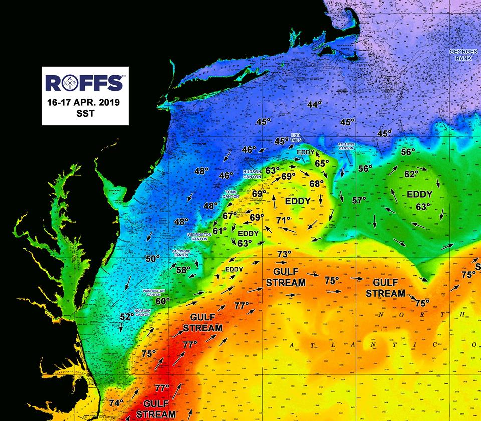
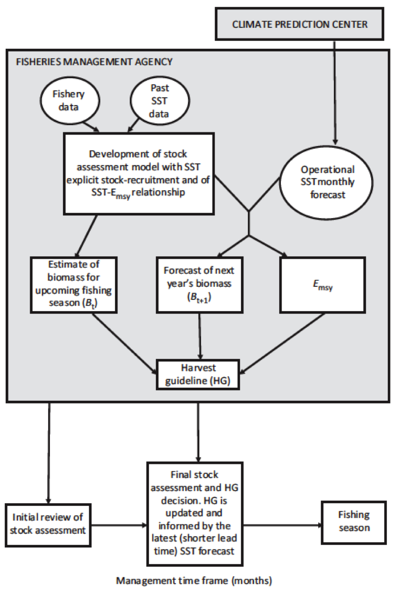
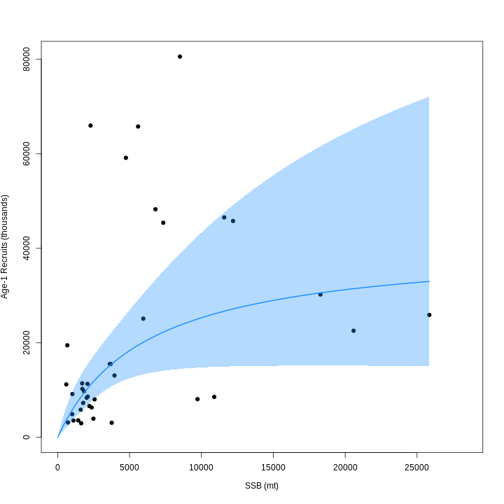
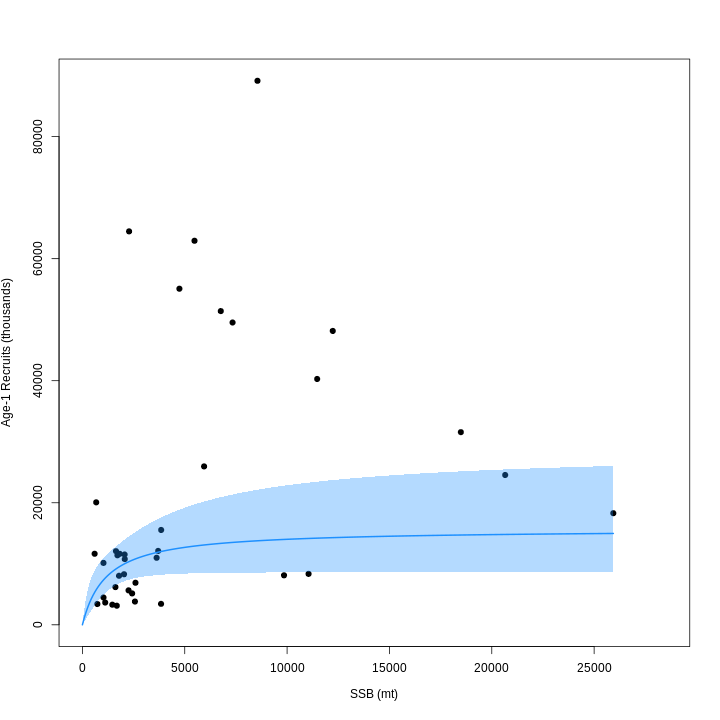
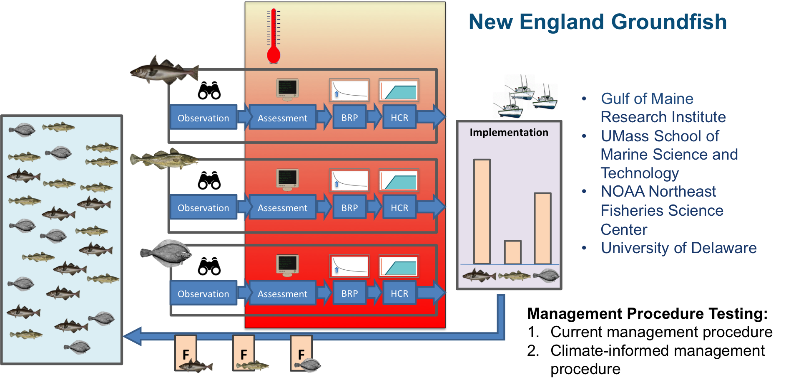
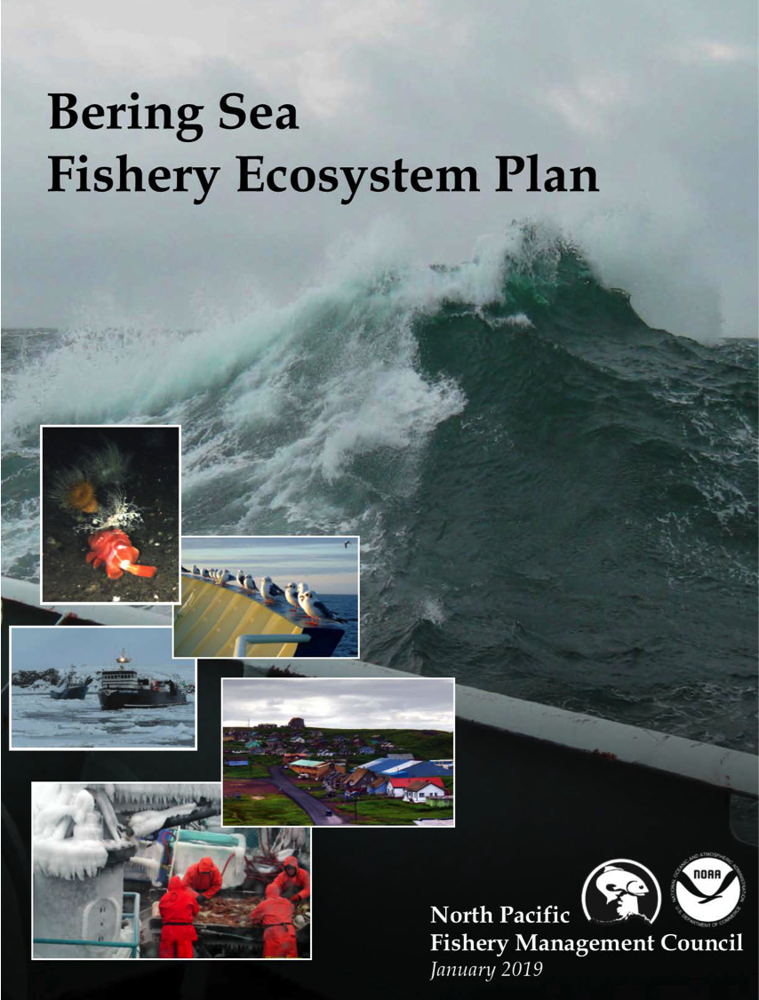

class: top, left

```{r setup, include=FALSE}

options(htmltools.dir.version = FALSE)
knitr::opts_chunk$set(echo = F,
                      fig.retina = 3,
                      warning = F,
                      message = F)
#Plotting and data libraries
library(tidyverse)
library(tidyr)
library(here)

data.dir <- here::here("data")

```

background-image: url("EDAB_images/ClimateFisheriesCover.png")
background-size: 550px
background-position: right

# Management needs 

- Real world examples

- Immediately useful

    + Inseason management
    
    + Quota specification
    
    + Management strategy evaluation
    
    + Ecosystem based management
    

???

---
## Inseason forecasts: *Illex* squid fishery

.pull-left[
.center[

]
]

.pull-right[
.center[

]
]

.footnote[

Manderson, J. 2020. Summary report Northern shortfin squid (*Illex illecebrosus*) population ecology and the fishery Summit, November 25-26, 2019 Wakefield, Rhode Island, available [here](https://www.dropbox.com/s/k3x0v53kyhaoj2a/DraftSummary_NorthernShortfinSquidPopulationEcologyAndTheFisherySummit_03242020.pdf?dl=0). 

Tommasi, D., Stock, C.A., Pegion, K., Vecchi, G.A., Methot, R.D., Alexander, M.A., and Checkley, D.M. 2017. Improved management of small pelagic fisheries through seasonal climate prediction. Ecological Applications 27(2): 378–388. doi:10.1002/eap.1458.
]


???
 

---
## 1-3 year forecasts: yellowtail flounder climate-informed assessment

.pull-left[
![:img Mean near‐bottom temperatures for July in the Middle Atlantic Bight and southern Gulf of Maine (the data set and processing are described in section 3). Temperature time series station locations (circles); boundaries between four subregions of the MAB (separated by dashed lines): the southern flank of Georges Bank, the New England Shelf, the New York Bight, and the Southern Middle Atlantic Bight; and the 50, 75, 100, and 1000 m isobaths (thin black lines) are shown. Inset shows entire region of compiled temperature profiles with the region encompassing the Cold Pool highlighted in red.](EDAB_images/jgrc22105-fig-0001-m.jpg)

]

.pull-right[


.contrib[
https://timjmiller.github.io/wham/articles/ex2_CPI_recruitment_SNEMA_yellowtail.html
]
]

.footnote[
Lentz, S.J. 2017. Seasonal warming of the Middle Atlantic Bight Cold Pool. Journal of Geophysical Research: Oceans 122(2): 941–954. doi:10.1002/2016JC012201.

Miller, T.J., Hare, J.A., and Alade, L.A. 2016. A state-space approach to incorporating environmental effects on recruitment in an age-structured assessment model with an application to southern New England yellowtail flounder. Can. J. Fish. Aquat. Sci. 73(8): 1261–1270. doi:10.1139/cjfas-2015-0339.

]

???
---
## 1-3 year forecasts: yellowtail flounder climate-informed assessment

.pull-left[

]

.pull-right[


]
.footnote[
Chen, Z., Curchitser, E., Chant, R., and Kang, D. 2018. Seasonal Variability of the Cold Pool Over the Mid-Atlantic Bight Continental Shelf. Journal of Geophysical Research: Oceans 123(11): 8203–8226. doi:10.1029/2018JC014148.
]

---
## Forecasts and projections: management strategy evaluation

.center[

]

.footnote[
Lisa A. Kerr, Sam Truesdell, Gavin Fay, Jonathan Cummings, Ashley Weston, Steven X. Cadrin, Sarah Gaichas, Min-Yang Lee, Anna Birkenbach, Andrew Pershing. Evaluating the Performance of Northeast Groundfish Fisheries Management in a Changing Climate (funded by NOAA COCA:NA17OAR4310272, 7/1/17-6/30/20)
]
---
## Forecasts and projections: ecosystem based fishery management

.pull-left[
.center[

]
Bering Sea FEP Action Module 1: Evaluate short- and long-term effects of climate change on fish and fisheries, and develop management considerations
]

.pull-right[
.center[

]
]

???
Objectives: (1) coordinate to synthesize results of various ongoing and completed climate change research projects; (2) evaluate the scope of impacts on priority species identified in initial studies; and (3) strategically revaluate management strategies every 5-7 years; (4) include synthesis to evaluate climate-resilient management tools. The climate change Action Module team will work with the Council to iteratively identify and assess the performance of potential short-term, medium and long-term management actions for climate adaptation (i.e., derive alternative strategies for MSEs).
---
## Ecosystem status--improve with forecasts

.pull-left[
.center[

]
]

.pull-right[
.center[

]
]


---
class: inverse, bottom
background-image: url("EDAB_images/IMG_2809.jpg")
background-size: cover


.pull-left[Slides: https://noaa-edab.github.io/presentations/]
.pull-right[Contact:  <sarah.gaichas@noaa.gov>]

