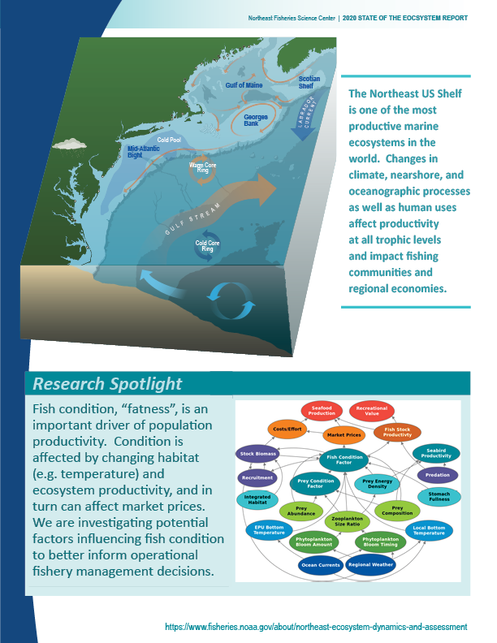

class: top, left

```{r setup, include=FALSE}

options(htmltools.dir.version = FALSE)
knitr::opts_chunk$set(echo = F,
                      fig.retina = 3,
                      warning = F,
                      message = F)
#Plotting and data libraries
library(tidyverse)
library(tidyr)
library(here)

data.dir <- here::here("data")

```

background-image: url("EDAB_images/ClimateFisheriesCover.png")
background-size: 550px
background-position: right

# Management needs 

- Regional climate impacts and timing

- How to use the science?

- Examples

    + Mid-Atlantic squid
    
    + Assessment projection
    
    + MSE


???

---
## Inseason forecasts: *Illex* squid fishery

.pull-left[

]

.pull-right[
.center[

]
]

???
 

---
## 1-3 year forecasts: climate-informed assessment projection


???
In 2016, we began taking steps to address these common critiques of the ESR model

---
## 1-3 year forecasts: MSE


---
## Immediate and future needs

.center[

]

---
## Ecosystem status--improve with forecasts

.pull-left[
.center[

]
]

.pull-right[
.center[

]
]

---
## Research: linking report indicators for management use

.pull-left[

]


.pull-right[

]

---
class: inverse, bottom
background-image: url("EDAB_images/IMG_2809.jpg")
background-size: cover


.pull-left[Slides: https://noaa-edab.github.io/presentations/]
.pull-right[Contact:  <sarah.gaichas@noaa.gov>]

