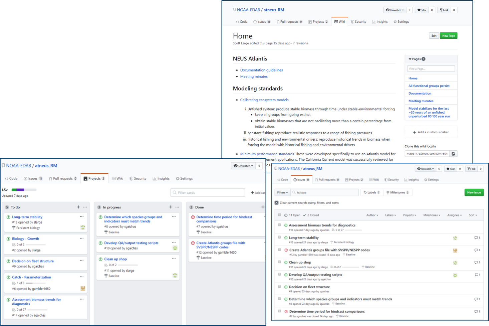
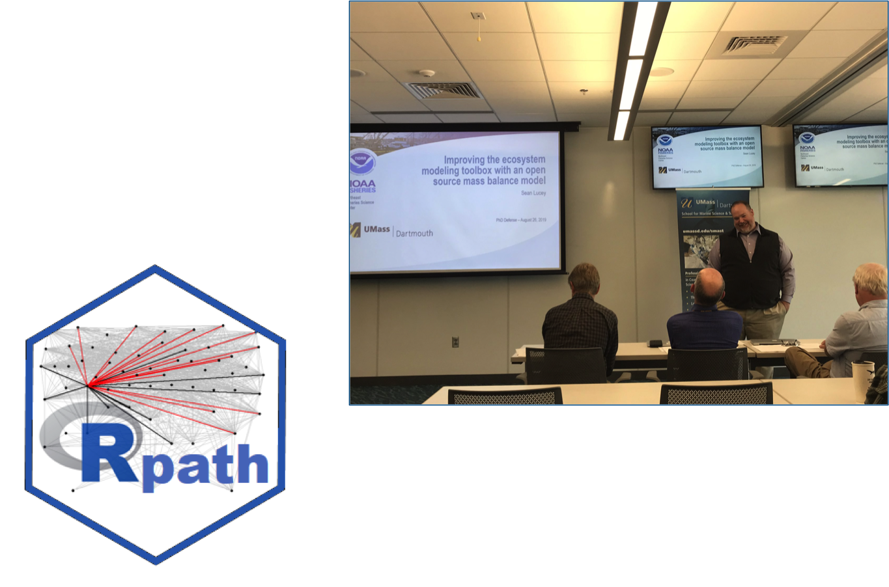
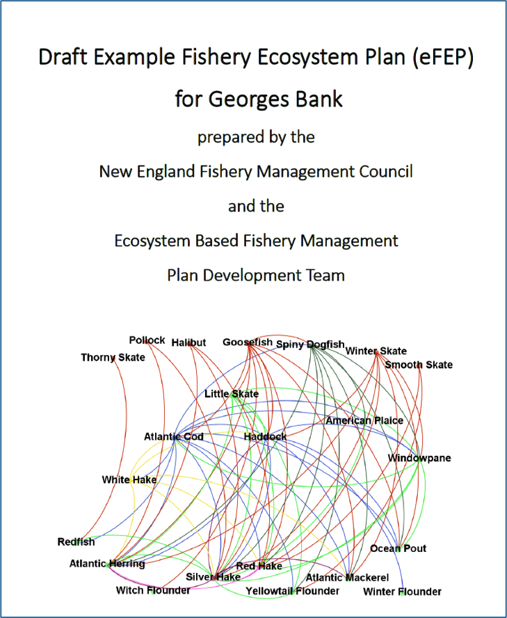
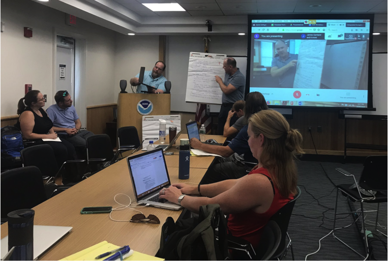
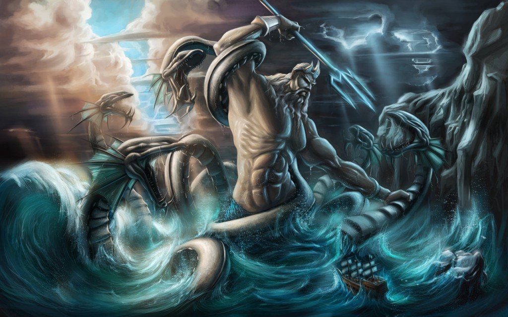

class: top, left

```{r setup, include=FALSE}

options(htmltools.dir.version = FALSE)
knitr::opts_chunk$set(echo = F,
                      warning = F,
                      message = F)
#Plotting and data libraries
library(ggplot2)
library(dplyr)
library(tidyr)
library(here)
library(kableExtra)
library(ggrepel)
library(stringr)
library(patchwork)
library(grid)
library(plotly)
library(vegan)
library(rpart)
library(colorRamps)
library(ecodata)

#GIS libraries
library(sf)
library(rgdal)
#library(raster)
library(rnaturalearth)

data.dir <- here::here("data")


```

## Outline


- Milestones

- Plans for FY20

- Questions


???
---
background-image: url("EDAB_images/AugustRetreat.png")
background-size: cover

## Milestones

*  August retreat
  * How we work


---
background-image: url("EDAB_images/MissionStatement.png")
background-size: contain

## Milestones

*  August retreat
  * Mission Statement


???
---
## Milestones

*  Models
  * Project Management tools to organize Atlantis development
  


---
## Milestones

*  Models
  * [Rpath](https://github.com/NOAA-EDAB/Rpath)



---
## Milestones
.pull-left-40[
*  Management
  * New England eFEP
  * Mid Atlantic EAFM
]
.pull-right-60[

]
---
```{r sfconceptmod, echo = F, fig.align = "center"}
# setup for conceptual model
PKG <- c(#"foreign","foodweb","sna", "DiagrammeR","circlize", "kableExtra", "googledrive", "readxl"
         "RColorBrewer","QPress",
         "chorddiag")

for (p in PKG) {
  if(!require(p,character.only = TRUE)) {
    install.packages(p)
    require(p,character.only = TRUE)}
}


#assumes this is a project and .dia file is in data directory
edges <- model.dia(file.path(data.dir, "Summer_Flounder_July22_2019.dia"))

source("R/interactive_chord_sfconsmod.R")

interactive_chord_sfconsmod(edges, width=710, height=710, margin=130)

```

???
trying to ge the tooltip part working but may not by next week; xaringan doesnt handle htmlwidgets the same as pure html!
---
## Milestones
.pull-left-30[
*  Management
  * State of the Ecosystem Workshop
]
.pull-right-70[

]
---
## Plans for FY20

*  Openscapes Workshop https://www.openscapes.org/ 
    *  “Better science in less time, together” (early 2020)
*  Website update
*  prepare for MSE(s)
*  Improve linkages within READ
    *  Seal modeling
    *  Habitat modeling
    *  IEAs
    *  ...


???

---
## Mission Statement



---
## Mission Statement

> The Ecosystem Dynamics and Assessment Branch consists of an interdisciplinary group of researchers with backgrounds in fisheries science, oceanography, and climate science. We use open-science principles to develop and apply ecosystem and statistical models to integrate information on biological, climate, oceanographic, and human-related activities to evaluate the effects on ecosystem structure and function. We work collaboratively across the Center and with a broad suite of partners to synthesize ecosystem information to inform living-marine resource management and support ecosystem-based fisheries management in the Northeast United States.


---

background-image: url("EDAB_images/IMG_2809.jpg")
background-size: cover

## Questions? Thank you!


* NEFSC Ecosystem Dynamics and Assessment Branch Github https://github.com/NOAA-EDAB

* Slides available at https://noaa-edab.github.io/presentations

