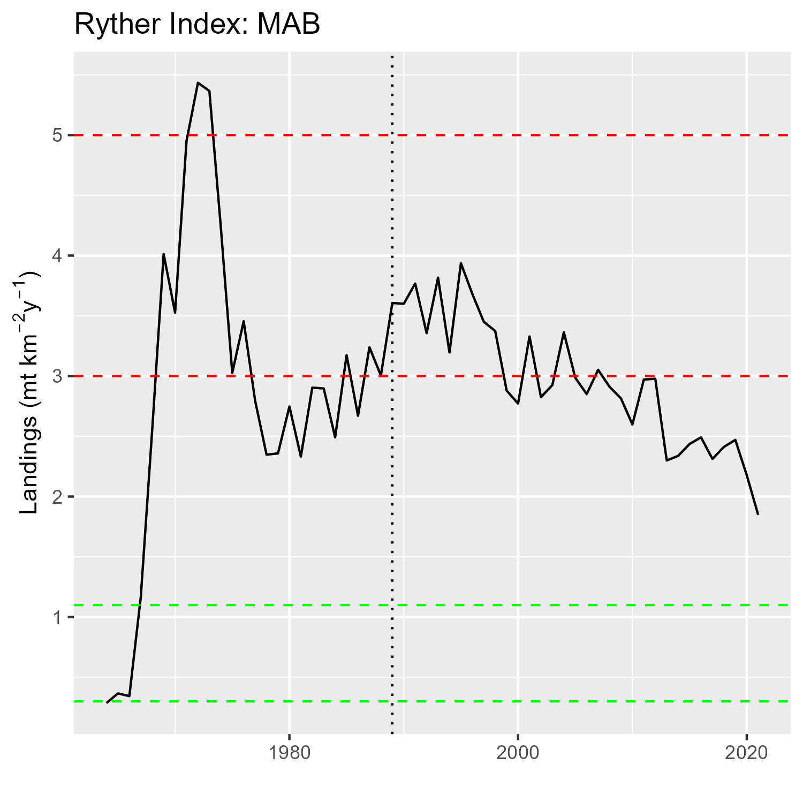
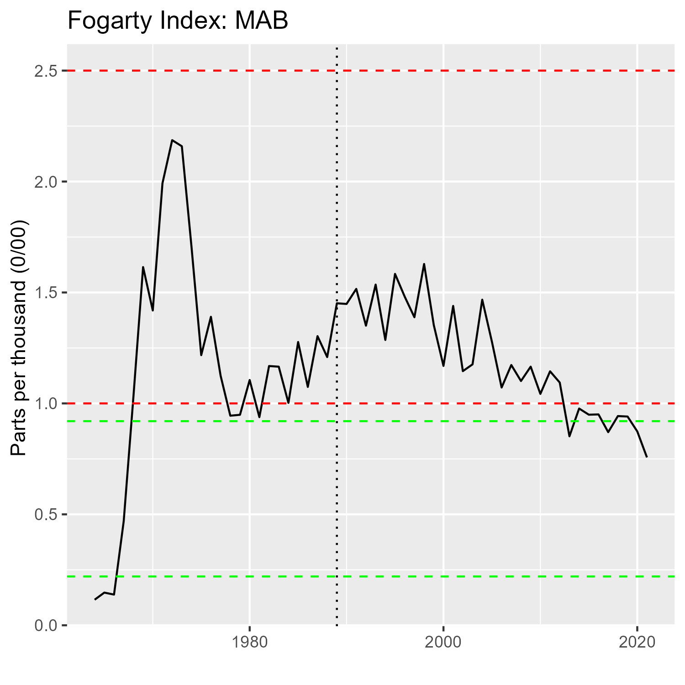
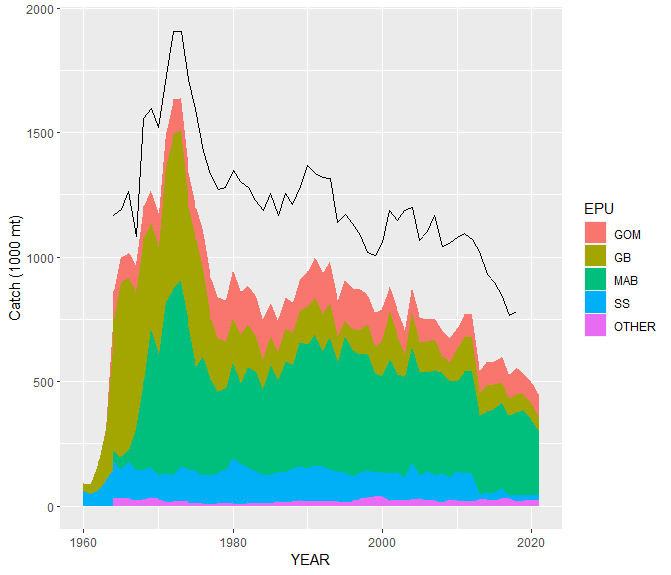
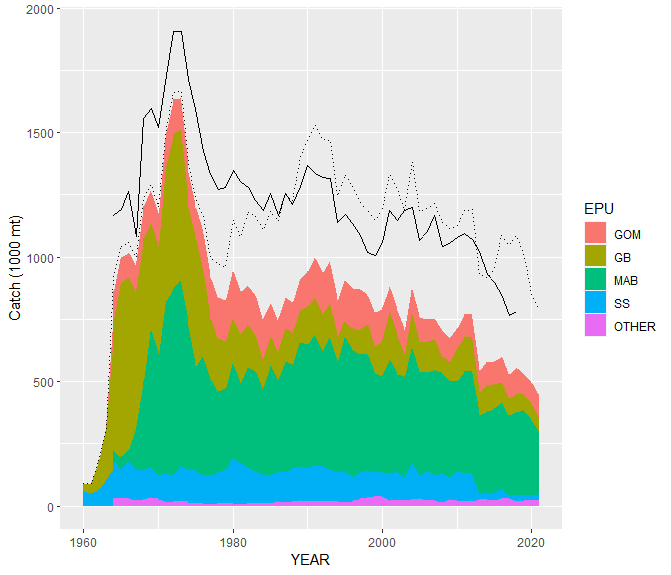

class: top, left

<style>
p.caption {
  font-size: 0.6em;
}
</style>

<style>
.reduced_opacity {
  opacity: 0.5;
}
</style>

```{r setup, include=FALSE}

options(htmltools.dir.version = FALSE)
knitr::opts_knit$set(unnamed.chunk.label = "20220316-MAFMCSSC")
knitr::opts_chunk$set(echo = F,
                      fig.retina = 3,
                      #fig.width = 4,
                      #fig.height = 2,
                      fig.asp = 0.45,
                      warning = F,
                      message = F,
                      fig.path = "20220316-MAFMCSSC/")


# if figure output defaults to docs/images/ replace with this before moving to 
# presentations/docs in both the html output (search and replace)
# and folder name
# 20220428_SSCEcoWG_Gaichas_files/figure-html/

```

```{r, load_refs, include=FALSE, cache=FALSE}
library(RefManageR)
BibOptions(check.entries = FALSE,
           bib.style = "authoryear",
           cite.style = "authoryear",
           longnamesfirst = FALSE,
           max.names = 1,
           style = "markdown")
myBib <- ReadBib("./operationalSOE.bib", check = FALSE)

#,
#           hyperlink = FALSE,
#           dashed = FALSE

```

```{r, code = readLines("https://raw.githubusercontent.com/NOAA-EDAB/ecodata/master/chunk-scripts/human_dimensions_MAB.Rmd-setup.R")}
```

```{r, code = readLines("https://raw.githubusercontent.com/NOAA-EDAB/ecodata/master/chunk-scripts/human_dimensions_MAB.Rmd-GIS-setup.R")}
```

```{r, code = readLines("https://raw.githubusercontent.com/NOAA-EDAB/ecodata/master/chunk-scripts/macrofauna_MAB.Rmd-setup.R")}
```

```{r, code = readLines("https://raw.githubusercontent.com/NOAA-EDAB/ecodata/master/chunk-scripts/LTL_MAB.Rmd-setup.R")}
```


# Ecosystem Overfishing Indicators

.pull-left[

Background:

*  Previous presentation
  * [Ecosystem overfishing indicators (2022)](https://noaa-edab.github.io/presentations/20220428_SSCEcoWG_Gaichas.html#1)
  *  [SOE ecosystem overfishing indicators (2021)](https://noaa-edab.github.io/presentations/20210407_MAFMC_Gaichas.html#13)
* Additional Resources
    +  EOF Indices - [Link and Watson 2019](https://www.science.org/doi/10.1126/sciadv.aav0474)  
    +  Application - [Link, 2021](https://academic.oup.com/icesjms/article/78/9/3176/6381244)
*  [Technical documentation](https://noaa-edab.github.io/tech-doc/ecosystem-overfishing.html) of SOE ecosystem overfishing indicators  
*  Previous [SOE request memo (p. 2-3)](https://www.mafmc.org/s/b_2021-State-of-the-Ecosystem-Request-Tracking-Memo.pdf) with ecosystem overfishing indicator discussion (2021)  
*  Previous [SOE request memo (p. 9-10)](https://www.mafmc.org/s/2_State-of-the-Ecosystem-response-memo.pdf) with primary production required discussion (2020) 


]

.pull-right[

```{r ryther2,  out.width = "400px", fig.cap="Ryther index; total landings presented on a unit area basis for the MAB. Theoretical estimates (Link and Watson, 2019) imply the index should range from 0.3 - 1.1 mt per sq km annually (green area) with a limit of 3 mt per sq km annually, above which tipping points could occur in fished ecosystems (orange area). Expected system-wide MSYs can be in the range of 1 to 3 mt per sq km (unshaded)."}


```

]

---
# Ecosystem Overfishing Indicators

* Indices based on *total catch*. Our indicators are based on *commercial landings*, leading to an underestimate relative to proposed thresholds.
* Commercial discard estimates currently being resolved
* Recreational catch currently being compiled.
* Previous calculations omitted Menhaden.


.pull-left[


```{r fogarty1, out.width = "350px"}

```

]
.pull-right[

```{r ryther1,  out.width = "350px"}


```
]

???


---
## Progress on estimating NEUS total catch for input into ecosystem overfishing indicators [(soenotes)](https://andybeet.github.io/soenotes/articles/landingsComparison.html)

.pull-left[
*Comparing all catch/landings data sources*

Note: Link data, SAU data, and NAFO data are estimates of Catch whereas `comlandr` data is landings only (no discards). SAU, NAFO use live weight (shellfish)


]

.pull-right[
*Resulting ecosystem overfishing indices*

The estimated percentage of unreported catch from the SAU dataset is applied to comland data estimate to represent total comland catch.


]

???

Ultimately, for the NEFSC State of the Ecosystem report these ecosystem overfishing indices will be calculated for multiple sub areas within the NEUS, namely Georges Bank, Gulf of Maine and the Mid Atlantic Bight. Knowing that the estimates of total NEUS catches are in line with other data sources is paramount to the acceptance of the report.


---
## Progress on estimating NEUS total catch for input into ecosystem overfishing indicators

.pull-left[
*Comparing landings SAU/comlandr*

SAU Reported data (No IUU) uses livewt (shellfish). `comlandr` uses meat wt 

```{r compare1,out.width="450px"}

```

]

.pull-right[
*Compare landings: live wt*

Use live wt in `comlandr` data.

```{r compare2,out.width="450px"}

```


]

???

Ultimately, for the NEFSC State of the Ecosystem report these ecosystem overfishing indices will be calculated for multiple sub areas within the NEUS, namely Georges Bank, Gulf of Maine and the Mid Atlantic Bight. Knowing that the estimates of total NEUS catches are in line with other data sources is paramount to the acceptance of the report.


---
# Ecosystem Overfishing Indicators

The amount of potential yield we can expect from a marine ecosystem depends on 
* The amount of production entering at the base of the food web, primarily in the form of phytoplankton
* The pathways this energy follows to reach harvested species
* The efficiency of transfer of energy at each step in the food web
* The fraction of this production that is removed by the fisheries

## Ryther, Fogarty, Friedland Indices

The *Ryther index* consists of total catch presented on a per unit-area basis for an ecosystem. 

The *Fogarty index* is the ratio of total catches to total primary productivity in an ecosystem.

The *Friedland index* is the ratio of total catches to mean annual chlorophyll in an ecosystem.

From `r Cite(myBib, "link_evidence_2021")` "One can develop and estimate thresholds for them based on first principles, trophic transfer theory, and empirical evidence." Thresholds were proposed `r Cite(myBib, "link_global_2019")`


---

## Link and Watson 2019 overview
<!--
 -->
.footnote[Link and Watson 2019, Fig 1. https://www.science.org/doi/10.1126/sciadv.aav0474]

All three indices are based on the principle of energy transfer up the foodweb from primary producers. There are limits to how much an ecosystem can produce and potentially be caught, C

$$C = \alpha \sum_i^n PP.TE_i^{TL_i-1}$$
where


$PP$ = primary production ( $tons C year^{-1}$ )

$TE_i$ = Transfer efficiency of species $i ,i = 1, ..., n$ 

$TL_i$ = Trophic level of species $i$


$\alpha$ is "a scalar for local conditions (set to 15% -20% for average availability of the TL in estimating total catch, a value that emerges when estimated from maintaining a global average catch that has been stable for the past 30 yrs)"

---

## Link and Watson 2019 overview
.footnote[Link and Watson 2019, Fig 1. https://www.science.org/doi/10.1126/sciadv.aav0474]
.pull-left[
Simplified to :


$$C = \alpha PP.TE^{TL}$$


* Range of values for $\alpha$, TE, and TL selected to bound the problem. The bounds help define the thresholds.

For example, a range of values are estimated for C,

* C= 0.1 to 0.42 Gt C $year^{-1}$ based on a global estimate of PP. 
* These help define the "optimal range" (green area) for both indices
]

.pull-right[

```{r ryther4,  out.width = "400px"}


```

]


???

Ecosystem overfishing (EOF) defined as:  
an instance where the sum of all catches is flat or declining, total catch per unit effort (CPUE) is declining, and total landings relative to ecosystem production exceeds suitable limits.

---
## Link and Watson 2019 overview:  Ryther Index
.footnote[Link and Watson 2019, Fig 1. https://www.science.org/doi/10.1126/sciadv.aav0474]

.pull-left[

Defined as total catch per unit area in the ecosystem `r Cite(myBib, "link_global_2019")`. The units are mt $km^{-2} year^{-1}$

The upper bound of the optimal range, (using C = .42 $Gt C year^{-1}$) is calculated as:

Ryther = $\frac{.42 Gt C year^{-1} 10^9}{361 km^{-2}10^6} = 1.14 t km^{-2}year^{-1}$

where the worlds oceans are approximately 361 million $km^2$ 

  * Assumes each $km^2$ of ocean is equally productive
  
  * We'd like to estimate thresholds in a similar fashion but at a smaller spatial scale using regional estimates of PP and using knowledge of the ecosystem.
  

]

.pull-right[

```{r ryther3,  out.width = "400px"}


```
  Link & Watson "recommend that the indices proposed here be used cognizant of other potential sources of productivity and that are relevant to the scale at which fisheries management mostly occurs."
]

???

Ecosystem overfishing (EOF) defined as:  
an instance where the sum of all catches is flat or declining, total catch per unit effort (CPUE) is declining, and total landings relative to ecosystem production exceeds suitable limits.

---
# Proposed Ideas ...
## Baseline

* Calculate regional estimates of C using similar approach (average TL, TE)
  * PP for MAB from satellite data ([data source](https://noaa-edab.github.io/tech-doc/chl-pp.html))

## Use species trophic level information

* Contrast with species specific trophic level information (from fishbase)
* Calculate a system wide "average" trophic level

---

# Proposed Ideas ...
## Simulation study (Atlantis ecosystem model)

* Calculate thresholds using model input/outputs
  * PP input data
  * Trophic level estimated from realized diets
  * Realized catch
  
* Create scenarios which include additional fishing pressure 
    * increase all species equally
    * target species with different pressures
    * others ?
* Compare realized catch under scenarios to the thresholds
* Examine health of the system (extinct species?), changes in realized diets.
* How reliable/robust are these threshold estimates? 
* Can they be used to reliably indicate ecosystem overfishing?


???
      * Defined prey inputs (pprey parameter values)
      * Realized diet output
      * System wide average trophic level


---
# Discussion

*   Using Link and Watson 2019 as a starting point, not an end point

*   Data issues being worked through
    *  Previous indicators based on landings, need total catch
    *  Resolving estimates of discards
    *  Compiling recreational catch estimates. 

* General thoughts/comments on the approach?

* How would we recommend the Council use ecosystem overfishing indicators?


