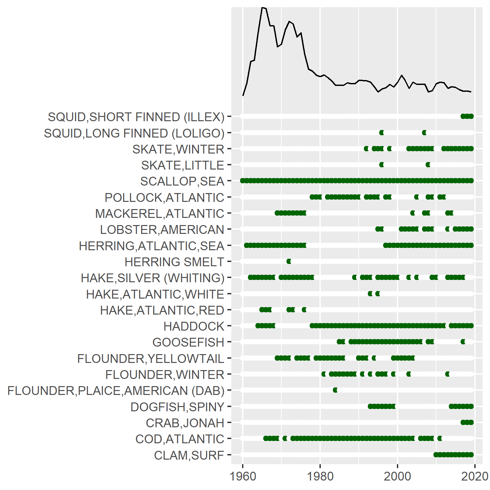
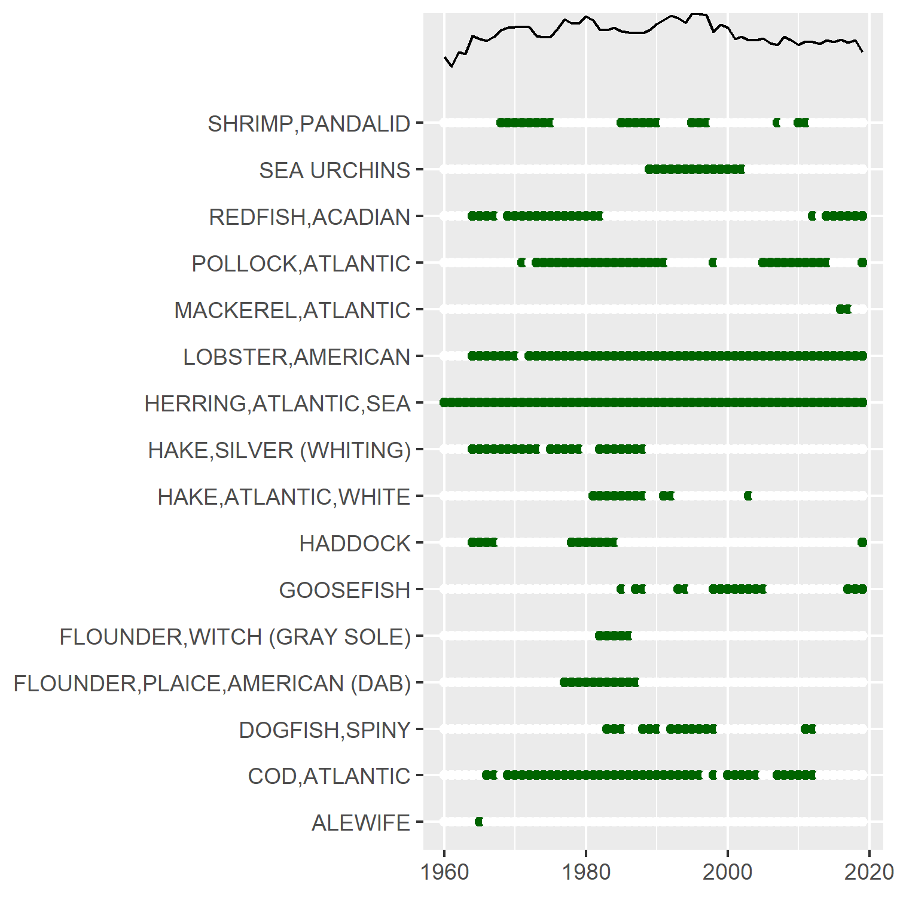

class: top, left

<style>
p.caption {
  font-size: 0.6em;
}
</style>

<style>
.reduced_opacity {
  opacity: 0.5;
}
</style>

```{r setup, include=FALSE}

options(htmltools.dir.version = FALSE)
knitr::opts_knit$set(unnamed.chunk.label = "20220316-MAFMCSSC")
knitr::opts_chunk$set(echo = F,
                      fig.retina = 3,
                      #fig.width = 4,
                      #fig.height = 2,
                      fig.asp = 0.45,
                      warning = F,
                      message = F,
                      fig.path = "20220316-MAFMCSSC/")
#Plotting and data libraries
library(tidyverse)
library(tidyr)
library(here)
library(kableExtra)
library(ecodata)
library(readxl); library(data.table)
library(DT)
library(widgetframe)

# if figure output defaults to docs/images/ replace with this before moving to 
# presentations/docs in both the html output (search and replace)
# and folder name
# 20220428_SSCEcoWG_Gaichas_files/figure-html/

```

```{r, load_refs, include=FALSE, cache=FALSE}
library(RefManageR)
BibOptions(check.entries = FALSE,
           bib.style = "authoryear",
           cite.style = "authoryear",
           longnamesfirst = FALSE,
           max.names = 1,
           style = "markdown")
myBib <- ReadBib("./operationalSOE.bib", check = FALSE)

#,
#           hyperlink = FALSE,
#           dashed = FALSE

```

```{r, code = readLines("https://raw.githubusercontent.com/NOAA-EDAB/ecodata/master/chunk-scripts/human_dimensions_MAB.Rmd-setup.R")}
```

```{r, code = readLines("https://raw.githubusercontent.com/NOAA-EDAB/ecodata/master/chunk-scripts/human_dimensions_MAB.Rmd-GIS-setup.R")}
```

```{r, code = readLines("https://raw.githubusercontent.com/NOAA-EDAB/ecodata/master/chunk-scripts/macrofauna_MAB.Rmd-setup.R")}
```

```{r, code = readLines("https://raw.githubusercontent.com/NOAA-EDAB/ecodata/master/chunk-scripts/LTL_MAB.Rmd-setup.R")}
```


# Ecosystem Overfishing Indicators

.pull-left[
## Operational thresholds for management?

Background:

*  Previous [presentation](https://noaa-edab.github.io/presentations/20210407_MAFMC_Gaichas.html#13) of SOE ecosystem overfishing indicators (2021)  
    +  [Link and Watson 2019](https://www.science.org/doi/10.1126/sciadv.aav0474)  
    +  [Pauly and Christensen 1995](https://www.nature.com/articles/374255a0)  
*  [Technical documentation](https://noaa-edab.github.io/tech-doc/ecosystem-overfishing.html) of SOE ecosystem overfishing indicators  
*  Previous [SOE request memo (p. 2-3)](https://www.mafmc.org/s/b_2021-State-of-the-Ecosystem-Request-Tracking-Memo.pdf) with ecosystem overfishing indicator discussion (2021)  
*  Previous [SOE request memo (p. 9-10)](https://www.mafmc.org/s/2_State-of-the-Ecosystem-response-memo.pdf) with primary production required discussion (2020) 

.contrib[
Figure key: 

<span style="background-color:#f4a460;">Orange background = Tipping point overfishing threshold, Link and Watson 2019</span> 

<span style="background-color:#a2cd5a;">Green background = Optimal range, Link and Watson 2019</span>
]
]

.pull-right[

```{r , code = readLines("https://raw.githubusercontent.com/NOAA-EDAB/ecodata/master/chunk-scripts/human_dimensions_MAB.Rmd-fogarty.R")}

#fogarty, fig.cap="Fogarty Index; the ratio of total landings to total primary production in the MAB. Link and Watson (2019) give an optimal range (green shading) of the Fogarty ratio of 0.22 to 0.92 parts per thousand (PPT). Previous work suggested that index values exceeding 1 to 2 PPT (orange shading) led to ecosystem tipping points."

```

```{r , code = readLines("https://raw.githubusercontent.com/NOAA-EDAB/ecodata/master/chunk-scripts/human_dimensions_MAB.Rmd-ryther.R")}

#ryther, fig.cap="Ryther index; total landings presented on a unit area basis for the MAB. Theoretical estimates (Link and Watson, 2019) imply the index should range from 0.3 - 1.1 mt per sq km annually (green shading) with a limit of 3 mt per sq km annually, above which tipping points could occur in fished ecosystems (orange shading). Expected system-wide MSYs can be in the range of 1 to 3 mt per sq km (unshaded)."
```

]
???
Declining commercial and recreational landings can be driven by many interacting factors, including combinations of ecosystem and stock production, management actions, market conditions, and environmental change. While we cannot evaluate all possible drivers at present, here we evaluate the extent to which ecosystem overfishing (total landings exceeding ecosystem productive capacity), stock status, and system biomass trends may play a role. 

---
## Ecosystem overfishing indices support the Seafood Production objective in the SOE (2021)

Thresholds for ecosystem-level overfishing based on system production characteristics have been proposed `r Cite(myBib, "link_global_2019")`, and are applied here for the MAB. The proposed ecosystem overfishing thresholds are calculated based on *total catch* while our preliminary indicators are based on *commercial landings*. Therefore, our current indicators are underestimated compared with the proposed thresholds. In future reports we may be able to include commercial discards and recreational removals to evaluate total catch. 

Based on either the ratio of total landings to total primary production (Fogarty Index), or total landings per unit area (Ryther Index), MAB landings are at or below the proposed thresholds, so ecosystem overfishing is unlikely to be a major factor driving decreased landings.


.pull-left[
```{r fogarty, fig.cap="Fogarty Index; the ratio of total landings to total primary production in the MAB. Link and Watson (2019) give an optimal range (green shading) of the Fogarty ratio of 0.22 to 0.92 parts per thousand (PPT). Previous work suggested that index values exceeding 1 to 2 PPT (orange shading) led to ecosystem tipping points.", code = readLines("https://raw.githubusercontent.com/NOAA-EDAB/ecodata/master/chunk-scripts/human_dimensions_MAB.Rmd-fogarty.R")}

```
]
.pull-right[
```{r ryther, fig.cap="Ryther index; total landings presented on a unit area basis for the MAB. Theoretical estimates (Link and Watson, 2019) imply the index should range from 0.3 - 1.1 mt per sq km annually (green shading) with a limit of 3 mt per sq km annually, above which tipping points could occur in fished ecosystems (orange shading). Expected system-wide MSYs can be in the range of 1 to 3 mt per sq km (unshaded).", code = readLines("https://raw.githubusercontent.com/NOAA-EDAB/ecodata/master/chunk-scripts/human_dimensions_MAB.Rmd-ryther.R")}
```
]
???
Are changes in landings driven by changes in ecosystem productivity or ecosystem overfishing?


---
background-image: url("https://www.science.org/cms/10.1126/sciadv.aav0474/asset/6b94e27e-71ae-431f-9e8b-7b6378122215/assets/graphic/aav0474-f1.jpeg")
background-size: 1000px
background-position: center

## Link and Watson 2019 overview
<!--
 -->
.footnote[Link and Watson 2019, Fig 1. https://www.science.org/doi/10.1126/sciadv.aav0474]

???
FIG. 1 Schematic of stock and EOF.
(A) Schematic of population overfishing. While a population is experiencing overfishing, the abundance and biomass (here as the number of fish icons) and fish size declines over time, along with many other facets related to population and fleet dynamics. (B) Schematic of EOF. Analogous to population overfishing, EOF is the result of continued fishing pressure on multiple populations, leading to sequential depletion across populations in an ecosystem over time.

---
## Link and Watson 2019 overview

*  Global analysis   
*  Catch and primary production (PP) based  
*  Three indices developed  
    + Ryther: total catch per unit area (global average PP assumed)  
    + Fogarty: ratio of total catch to total PP within an ecosystem   
    + Friedland: ratio of total catch to chlorophyll within an ecosystem 
*  Overfishing thresholds for each index proposed  

*  Ecosystem overfishing (EOF) defined as:  

> an instance where the sum of all catches is flat or declining, total catch per unit effort (CPUE) is declining, and total landings relative to ecosystem production exceeds suitable limits.

---
## How we implemented [(tech-doc)](https://noaa-edab.github.io/tech-doc/ecosystem-overfishing.html)

## Methods

We use the definition of ecosystem overfishing from `r Cite(myBib, "link_global_2019")`: 

1. The sum of catches is flat or declining
1. Total catch per unit effort is declining
1. Total landings relative to ecosystem  production exceeds suitable limits

All of the indices are based on the principle of energy transfer up the foodweb from primary producers.

### Fogarty & Ryther Indices

The Fogarty index is defined as ratio of total catches to total primary productivity in an ecosystem `r Cite(myBib, "link_global_2019")`. The units are parts per thousand.

The Ryther index is defined as total catch per unit area in the ecosystem `r Cite(myBib, "link_global_2019")`. The units are mt km^-2 year^-1

A modification of the indices is used. Total landings are used in lieu of total catch. This will have the effect of reducing the value of the index (compared to using total catch).

---
## How we implemented [(tech-doc)](https://noaa-edab.github.io/tech-doc/ecosystem-overfishing.html)

#### Data sources

Data for this index come from a variety of sources. The landings data come from the Commercial Fishery Database (CFDBS), species trophic level information come from [fishbase](http://fishbase.de) and [sealifebase](http://sealifebase.ca), and primary production estimates are derived from [satellites](https://noaa-edab.github.io/tech-doc/chl-pp.html). Some of these data are typically not available to the public.

#### Data extraction

Landings are extracted from the commercial fisheries database (CFDBS) using the methods described in the chapter [Commercial Landings Data.](https://noaa-edab.github.io/tech-doc/comdat.html)

Primary Production is estimated using the methods described in the chapter [Chlorophyll a and Primary Production.](https://noaa-edab.github.io/tech-doc/chl-pp.html)

#### Data analysis

##### Fogarty and Ryther Indices

Total annual (wet weight) landings are calculated for a given EPU (summed over all species). The units for both primary production and landings are in $mt km^{-2} year^1$. A factor of (1/9) is used to convert landings to weight in carbon. The area in $km^2$ of each EPU is obtained from the shapefile used to define the area.


---
## Known issues and questions

(2021 SOE Request Memo)

1. The proposed ecosystem overfishing thresholds are calculated based on *total catch* while our preliminary indicators are based on *commercial landings*. Therefore, our current indicators are underestimated compared with the proposed thresholds. It is possible to add commercial discards and recreational landings and dead discards in the future, or to calculate how much additional catch is required to exceed a threshold.

2. The proposed ecosystem overfishing thresholds are based on a global analysis. The indices define ecosystem productivity in different ways. The Ryther Index is effectively based on fishery removals relative to global primary productivity per unit area, while the Fogarty Index is based on fishery removals relative to regional primary productivity `r Cite(myBib, "link_global_2019")`. The study authors "recommend that the indices proposed here be used cognizant of other potential sources of productivity and that are relevant to the scale at which fisheries management mostly occurs."

A full set of plots to help interpret the primary production required and ecosystem overfishing indices (including mean trophic level, which species are included in the landings, and the primary production time series) are available [online](https://noaa-edab.github.io/eofindices/articles/currentIndices.html). We welcome suggestions to include additional plots or conduct analyses to improve interpretation of these indices for the Councils. 

---
## Progress on estimating NEUS total catch for input into ecosystem overfishing indicators [(soenotes)](https://andybeet.github.io/soenotes/articles/landingsComparison.html)

.pull-left[
*Comparing all catch/landings data sources*

Note: Link data, SAU data, and NAFO data are estimates of Catch whereas `comlandr` data is landings only (no discards)


]

.pull-right[
*Resulting ecosystem overfishing indices*

The estimated percentage of unreported catch from the SAU dataset is applied to comland data estimate to represent total comland catch.


]

???

Ultimately, for the NEFSC State of the Ecosystem report these ecosystem overfishing indices will be calculated for multiple sub areas within the NEUS, namely Georges Bank, Gulf of Maine and the Mid Atlantic Bight. Knowing that the estimates of total NEUS catches are in line with other data sources is paramount to the acceptance of the report.


---
# Discussion

Using Link and Watson 2019 as a starting point, not an end point

How would we recommend the Council use ecosystem overfishing indicators?

Data issues being worked through
*  Previous indicators based on landings, need total catch
*  Resolving different total catch estimates from different sources

What analyses can we do to tailor to our regional ecosystem and managers?

*  Simulation test suggested thresholds with regional ecosystem model
*  Establish thresholds for our region/managed species
    + Process: define unacceptable ecosystem state, dont go there
    + Easier than defining optimal state, too many

## References

.contrib[
```{r refs, echo=FALSE, results="asis"}
PrintBibliography(myBib)
```
]

???
    + Still trying to find all the landings data, recently got menhaden
    + Working towards discards, etc to get total catch

---

.center[
# Extra slides on PPR
]

---
## Primary production required index supports the Seafood Production objective in the SOE (2021)

.pull-left[
The amount of potential yield we can expect from a marine ecosystem depends on the amount of production entering at the base of the food web, primarily in the form of phytoplankton; the pathways this energy follows to reach harvested species; the efficiency of transfer of energy at each step in the food web; and the fraction of this production that is removed by the fisheries. The fraction of production removed by fisheries has declined since the late 1990s. The overall trend is largely driven by the decrease in landings with an increase in primary production over the same period. 

Current fisheries remove a lower proportion of the ecosystem's primary production now than in the 1970s, when the Fogarty and Ryther indices suggest that ecosystem overfishing may have occurred.
]

.pull-right[
```{r ppr-mab, fig.cap="Primary production required to support MAB commercial landings. Included are the top species accounting for 80\\% of the landings in each year, with 15\\% transfer efficiency assumed between trophic levels. PPD is total primary production. The solid line is based on satellite-derived PPD and the dashed line is based on primary production reconstructed using the mean of satellite-derived PPD from 1998-2010.", code = readLines("https://raw.githubusercontent.com/NOAA-EDAB/ecodata/master/chunk-scripts/human_dimensions_MAB.Rmd-ppr.R")}
```
]

---
## Issues/questions for PPR (2020 SOE Response memo)

This indicator is included in both SOEs (p. 3-4 MAFMC and NEFMC). It is defined as

$$PPR_t = \sum_{i=1}^{n_t}  \left(\frac{landings_{t,i}}{9}\right) \left(\frac{1}{TE}\right)^{TL_i-1}$$
where $n_t$ = number of species in time $t$, $landings_{t,i}$ = landings of species $i$ in time $t$, $TL_i$ is the trophic level of species $i$, $TE$ = Trophic efficiency. The PPR estimate assumes a 9:1 ratio for the conversion of wet weight to carbon and a constant transfer efficiency per trophic level.

---
## Issues/questions for PPR (2020 SOE Response memo)

We have explored the index in the following ways. Using: 

* *A global transfer efficiency of 15% for all species.*
    
    This gives comparable estimates to methods used in Figure 7.3 of the [2009 Ecosystem Status Report](https://www.nefsc.noaa.gov/publications/crd/crd0911/crd0911.pdf) that applied a combination of transfer efficiencies calculated from [EMAX food web models](https://www.nefsc.noaa.gov/publications/crd/crd0615/crd0615.pdf). While many studies use a 10% rule of thumb, that is an approximation as well. One adaptation would be to use a different transfer efficienct for the first level. eg. $\left( \frac{1}{TE_1}\right)  \left(\frac{1}{TE_2}\right)^{TL_i-2}$. Whatever choices are made, the sensitivity of the index to such changes should be examined.

* *Primary production not lagged with landings.*

    This is probably not realistic. You wouldn't expect to see changes in the landing the same year as changes in primary production. This needs to be explored, either using specific lags in time (which may prove problematic since species lower on the food chain will be effected by shorter lags in time versus species higher up the chain) or by adopting some weighted scheme.

---
## Issues/questions for PPR (2020 SOE Response memo)

* *A threshold of 80% for landings.*

    It would be a good idea to explore the sensitivity of the index for other threshold levels. Of course the higher the threshold used would imply that less common species will then contribute to the index.

* *Combined vertebrates and invertebrates.*

    The landings in some of the EPUs are dominated by invertebrates (Lobster, Clams) which may play a significant part in driving this index. Creating two additional indices, one for vertebrates and one for invertebrates may be an interesting avenue. This will of course imply the inclusion of many other lesser caught species into the index. It will also involve partitioning the landings into vertebrates and invertebrates.
    
---
## Issues/questions for PPR (2020 SOE Response memo)


*Other comments*

* Some classifications in the commercial fisheries database are not at the species level. Some are Genus, Family or even higher orders, some are just general unclassified. eg. (DOGFISH, UNC, FLATFISH, Argentinidae). Most of these cases are associated with lower landings. However if we increase the threshold and/or split landings into vertebrates and invertebrates we will encounter more of these classifications. They will need to be assigned a trophic level which may cause complications and/ or subjective decision making.

* It is possible for species to drop out of the top x% of the landings and be replaced by other species with a similar trophic level and the index will be somewhat insensitive to this (Fig. \ref{fig:ppr-species}). The mean trophic level would also be insensitive to such changes. This may or may not be of concern, but it may be worth looking into how often this occurs. 

---
## Issues/questions for PPR (2020 SOE Response memo)


```{r ppr-species, fig.cap="Species included in 80\\% of landings for each year in the Mid-Atlantic Bight (left), Georges Bank (center), and Gulf of Maine (right).", fig.show='hold', out.width='32%'}

knitr::include_graphics("EDAB_images/composition-MAB-0_80.png")


```

We welcome feedback for approaches to refine this indicator.


