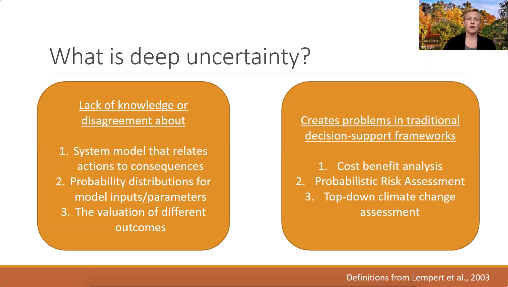
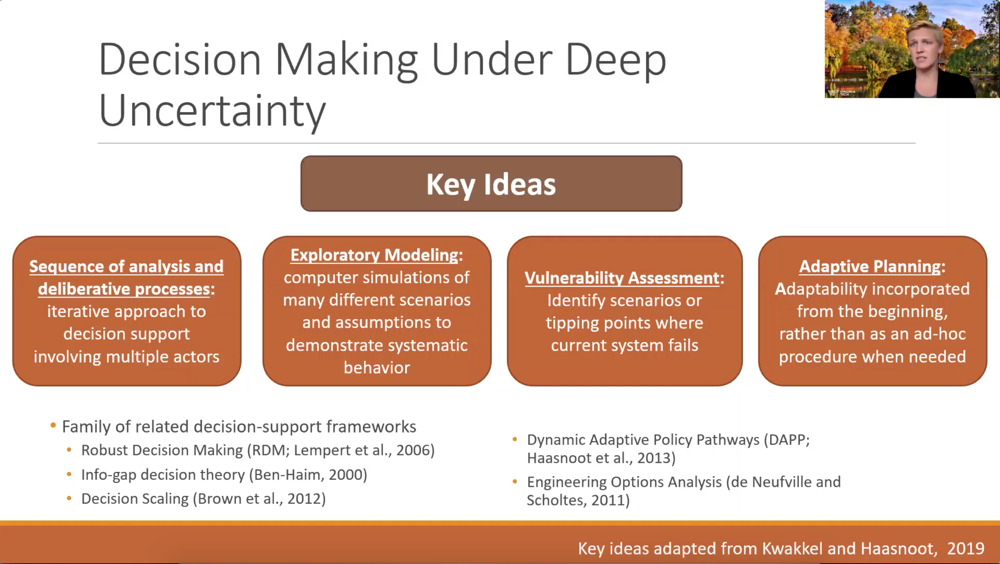
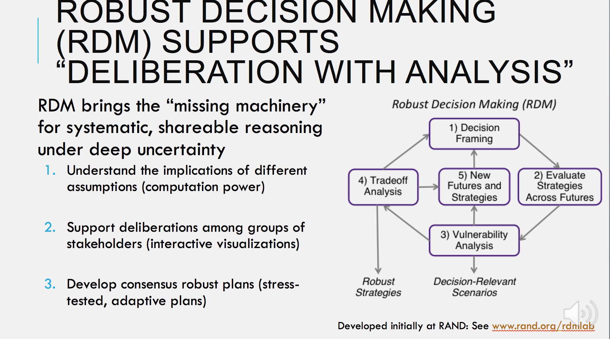
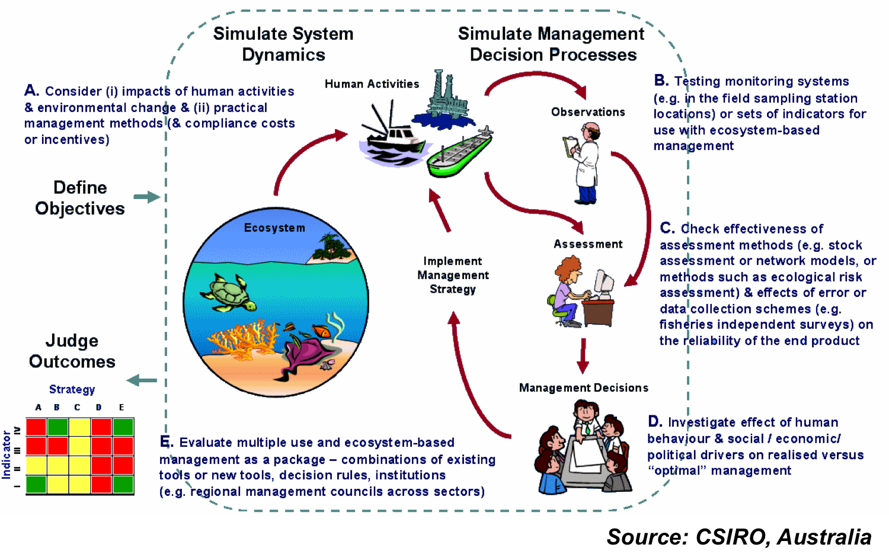
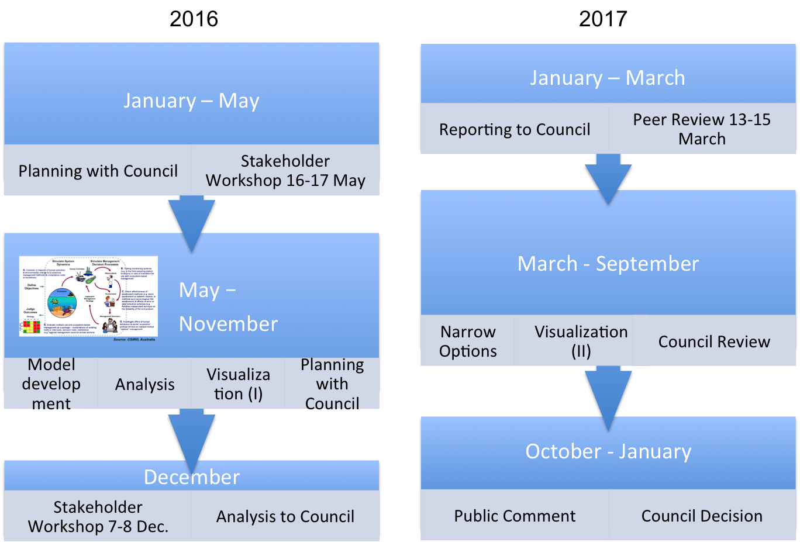
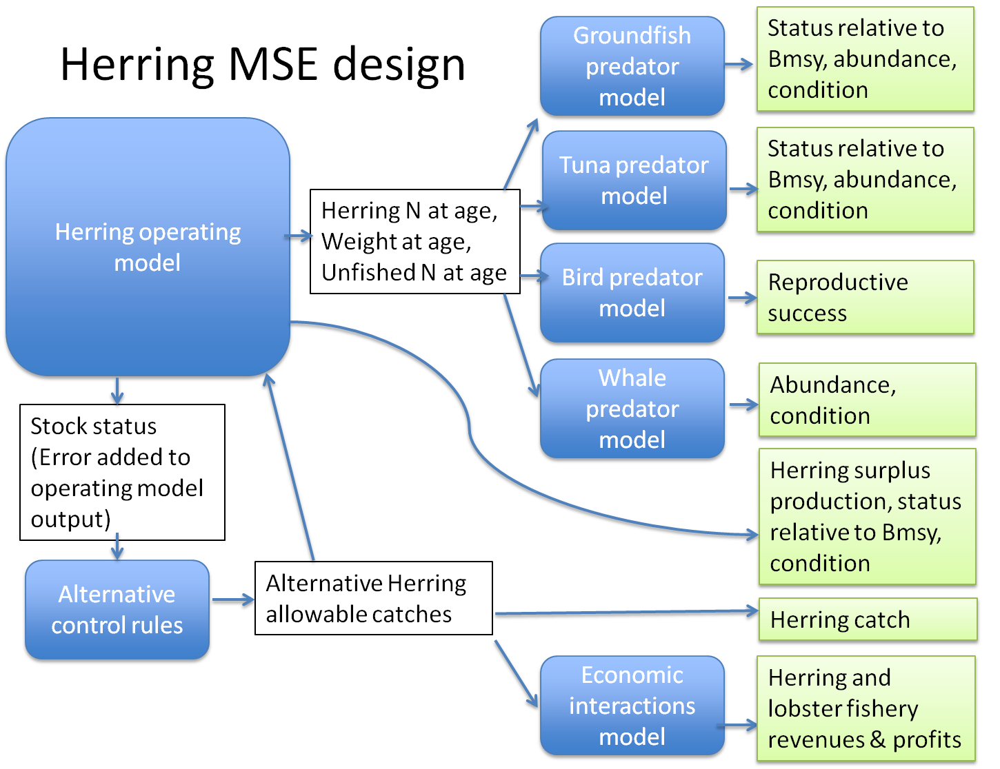
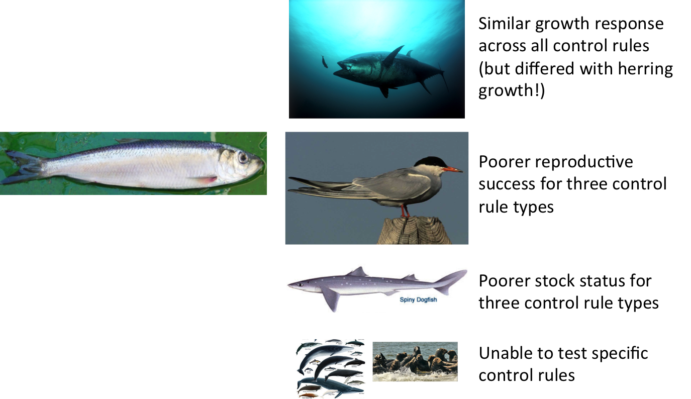

class: top, left

```{r setup, include=FALSE}

options(htmltools.dir.version = FALSE)
knitr::opts_chunk$set(echo = F,
                      fig.retina = 3,
                      warning = F,
                      message = F)
#Plotting and data libraries
library(tidyverse)
library(tidyr)
library(here)
```

```{r, load_refs, include=FALSE, cache=FALSE}
library(RefManageR)
BibOptions(check.entries = FALSE,
           bib.style = "authoryear",
           cite.style = "authoryear",
           style = "markdown")
myBib <- ReadBib("./DeepUncertaintyMSE.bib", check = FALSE)

#,
#           hyperlink = FALSE,
#           dashed = FALSE

```

# Deep Uncertainty and Robust Decision Making 

.pull-left[
- Decision making under deep uncertainty needed when disagreement on:

    - model of system relating action to consequences
    - probability distributions for model parameters
    - valuation of different outcomes
    
- Essential features of DMDU

    - iterate analysis and deliberation
    - many computer simulations of assumptions and scenarios
    - identify scenarios with really bad outcomes
    - plan to adapt as things change
]
.pull-right[



]
---
# RDM and Management Strategy Evaluation (MSE)

.pull-left[
- Robust Decision Making (RDM) used when
    - future uncertainty difficult to characterize
    - diverse stakeholders with different priorities
    
- RDM is "deliberation with analysis"
    - model implications of different assumptions
    - support stakeholder deliberations
    - develop robust, adaptive plans
    
.center[]
]
.pull-right[

- Management Strategy Evaluation (MSE)

>... involves assessing the consequences of a range of management strategies or options and presenting the results in a way which lays bare the tradeoffs in performance across a range of management objectives. `r Cite(myBib, "hancock_management_1994")`

>...is a flexible approach that allows for a balance between
multiple objectives and identifies harvest strategies robust to various types of uncertainty. Simulation can accommodate more realistic modeling of the fishery than dynamic optimization, as well as more practically implementable policies. `r Cite(myBib, "holland_uncertainty_2009")`
]

???

---
## Fishery management in the US: participatory, wicked problems

Eight regional Fishery Management Councils establish plans for sustainable management of stocks within their jurisdictions. All are governed by the same law, but tailor management to their regional stakeholder needs.


More information: http://www.fisherycouncils.org/
https://www.fisheries.noaa.gov/topic/laws-policies#magnuson-stevens-act

---
background-image: url("EDAB_images/allcomponents.png")
background-size: 800px
background-position: right

## Are any Atlantic herring harvest control rules good for both fisheries and predators?
.pull-left-30[
*"Which harvest control rules best consider herring's role as forage?"*  
- Balancing fishing benefits and ecological services
- Diverse stakeholder interests
- Needed timely answers!
]

---
## What is Management Strategy Evaluation?
```{r introMSE}

```

---
## The Dream and The Reality
```{r dreamreality}

```

---
## Design: link models matching stakeholder-identified objectives

```{r OMdesign, echo = F, fig.align = "center", out.width="85%"}

```

---
background-image: url("EDAB_images/herrtopreds.png")
background-size: 550px
background-position: right

## Predators

---
## Testing the tern model--does it work?


---
## Predator results summary
```{r predresultsum}

```

Three control rule types--Constant catch, conditional constant catch, and 15% restriction on change--were rejected at the second stakeholder meeting for poor fishery and predator performance.

---
## Managing tradeoffs: What control rules give us 90% of everything we want?

- Tern productivity at 1.0 or above more than 90% of the time
- Herring biomass more than 90% of SSBmsy
- Fishery yield more than 90% of MSY
&nbsp;  
&nbsp;  
- AND fishery closures (F=0) less than 1% of the time (second plot).

.pull-left[
```{r}
#herring MSE outputs
#allres <- readRDS(file.path(data.dir,"allres.rds"))

allres <- readRDS(url("https://github.com/sgaichas/herringMSE/blob/master/data/allres.rds?raw=True"))

#herring MSE plotting
#a better plotting theme than ggplot default? from https://rpubs.com/Koundy/71792
theme_Publication <- function(base_size=14, base_family="") {
      library(grid)
      library(ggthemes)
      (theme_foundation(base_size=base_size, base_family=base_family)
       + theme(plot.title = element_text(face = "bold",
                                         size = rel(1.2), hjust = 0.5),
               text = element_text(),
               panel.background = element_rect(colour = NA),
               plot.background = element_rect(colour = NA),
               panel.border = element_rect(colour = NA),
               axis.title = element_text(face = "bold",size = rel(1)),
               axis.title.y = element_text(angle=90,vjust =2),
               axis.title.x = element_text(vjust = -0.2),
               axis.text = element_text(), 
               axis.line = element_line(colour="black"),
               axis.ticks = element_line(),
               panel.grid.major = element_line(colour="#f0f0f0"),
               panel.grid.minor = element_blank(),
               legend.key = element_rect(colour = NA),
               legend.position = "right",
               legend.direction = "vertical",
               legend.key.size= unit(0.4, "cm"),
               legend.margin = unit(0, "cm"),
               legend.title = element_text(face="italic"),
               plot.margin=unit(c(10,5,5,5),"mm"),
               strip.background=element_rect(colour="#f0f0f0",fill="#f0f0f0"),
               strip.text = element_text(face="bold")
          ))
      
}

scale_fill_Publication <- function(...){
      library(scales)
      discrete_scale("fill","Publication",manual_pal(values = c("#386cb0","#fdb462","#7fc97f","#ef3b2c","#662506","#a6cee3","#fb9a99","#984ea3","#ffff33")), ...)

}

scale_colour_Publication <- function(...){
      library(scales)
      discrete_scale("colour","Publication",manual_pal(values = c("#386cb0","#fdb462","#7fc97f","#ef3b2c","#662506","#a6cee3","#fb9a99","#984ea3","#ffff33")), ...)
}

Nrulesgoodterns <- allres %>%
  filter(CR %in% c("BB", "BB3yr")) %>%
  group_by(OM,CR)%>%
  filter(MedPropYrs_goodProd_Targplustern>0.9) %>%
  summarize(tern90 = n())

Nrulesgoodfishery <- allres %>%
  filter(CR %in% c("BB", "BB3yr")) %>%
  group_by(OM,CR)%>%
  filter(YieldrelMSY>0.9) %>%
  summarize(yield90 = n())

Nrulesgoodherring <- allres %>%
  filter(CR %in% c("BB", "BB3yr")) %>%
  group_by(OM,CR)%>%
  filter(MedSSBrelSSBmsy>0.9) %>%
  summarize(SSB90 = n())

Nrulesgoodternherrfish <- allres %>%
  filter(CR %in% c("BB", "BB3yr")) %>%
  filter(MedPropYrs_goodProd_Targplustern>0.9 & MedSSBrelSSBmsy>0.9 & YieldrelMSY>0.9) %>%
  group_by(OM,CR)%>%
  summarize(ternfishherr90 = n(), 
            minF = min(FracFtarg), 
            maxF = max(FracFtarg),
            minloB = min(FracBmsyThreshLo), 
            maxloB = max(FracBmsyThreshLo),
            minhiB = min(FracBmsyThreshHi),
            maxhiB = max(FracBmsyThreshHi)
  )

CRsgoodternherrfish <- allres %>%
  filter(CR %in% c("BB", "BB3yr")) %>%
  filter(MedPropYrs_goodProd_Targplustern > 0.9 & MedSSBrelSSBmsy > 0.9 & YieldrelMSY > 0.9) %>%
  group_by(OM,CR) %>%
  select(OM, CR, FracBmsyThreshLo, FracBmsyThreshHi,FracFtarg) %>%
  mutate(id = seq(1:n()),
         Xmin = 0,
         Xmax = 4) %>%
  gather(CRpart, x, Xmin,FracBmsyThreshLo, FracBmsyThreshHi,Xmax) %>%
  arrange(OM, CR, id) %>%
  mutate(y = case_when(CRpart == "Xmin" | CRpart == "FracBmsyThreshLo" ~ 0,
                       CRpart == "FracBmsyThreshHi" | CRpart == "Xmax" ~ FracFtarg)) %>%
  mutate(bigkey = paste0(OM, CR, id))
  
#with(CRsgoodternherrfish, 
#     plot(x=c(0,FracBmsyThreshLo, FracBmsyThreshHi, 4),
#          y=c(0,0,FracFtarg, FracFtarg), type="l"))  
  
p1 <- ggplot(CRsgoodternherrfish, aes(x=x, y=y, colour=CR)) + 
  geom_line(aes(group=bigkey), alpha=0.3) +
  labs(y="F/Fmsy", x="SSB/SSBmsy", colour="Control rule type") +
  guides(colour = guide_legend(override.aes = list(alpha = 1))) +
  theme_Publication() + scale_colour_Publication()

OMlabels <- c(HiM_LowSteep_AssBias_OldWt = 'LowFastBiased', 
              HiM_LowSteep_AssBias_RecWt = 'LowSlowBiased', 
              HiM_LowSteep_NoAssBias_OldWt = 'LowFastCorrect', 
              HiM_LowSteep_NoAssBias_RecWt = 'LowSlowCorrect',  
              LoM_HiSteep_AssBias_OldWt =  'HighFastBiased',  
              LoM_HiSteep_AssBias_RecWt = 'HighSlowBiased', 
              LoM_HiSteep_NoAssBias_OldWt = 'HighFastCorrect',
              LoM_HiSteep_NoAssBias_RecWt = 'HighSlowCorrect'
              )

p1 + facet_wrap("OM", labeller=labeller(OM = OMlabels), nrow=2) + theme(legend.position="bottom")

```
]

.pull-right[
```{r}
Nrulesgoodterns <- allres %>%
  filter(CR %in% c("BB", "BB3yr")) %>%
  group_by(OM,CR)%>%
  filter(MedPropYrs_goodProd_Targplustern>0.9) %>%
  summarize(tern90 = n())

Nrulesgoodfishery <- allres %>%
  filter(CR %in% c("BB", "BB3yr")) %>%
  group_by(OM,CR)%>%
  filter(YieldrelMSY>0.9) %>%
  summarize(yield90 = n())

Nrulesgoodherring <- allres %>%
  filter(CR %in% c("BB", "BB3yr")) %>%
  group_by(OM,CR)%>%
  filter(MedSSBrelSSBmsy>0.9) %>%
  summarize(SSB90 = n())

Nrulesgoodternherrfish <- allres %>%
  filter(CR %in% c("BB", "BB3yr")) %>%
  filter(MedPropYrs_goodProd_Targplustern>0.9 & MedSSBrelSSBmsy>0.9 & YieldrelMSY>0.9 & PropClosure < 0.01) %>%
  group_by(OM,CR)%>%
  summarize(ternfishherr90 = n(), 
            minF = min(FracFtarg), 
            maxF = max(FracFtarg),
            minloB = min(FracBmsyThreshLo), 
            maxloB = max(FracBmsyThreshLo),
            minhiB = min(FracBmsyThreshHi),
            maxhiB = max(FracBmsyThreshHi)
  )

CRsgoodternherrfish <- allres %>%
  filter(CR %in% c("BB", "BB3yr")) %>%
  filter(MedPropYrs_goodProd_Targplustern > 0.9 & MedSSBrelSSBmsy > 0.9 & YieldrelMSY > 0.9 & PropClosure < 0.01) %>%
  group_by(OM,CR) %>%
  select(OM, CR, FracBmsyThreshLo, FracBmsyThreshHi,FracFtarg) %>%
  mutate(id = seq(1:n()),
         Xmin = 0,
         Xmax = 4) %>%
  gather(CRpart, x, Xmin,FracBmsyThreshLo, FracBmsyThreshHi,Xmax) %>%
  arrange(OM, CR, id) %>%
  mutate(y = case_when(CRpart == "Xmin" | CRpart == "FracBmsyThreshLo" ~ 0,
                       CRpart == "FracBmsyThreshHi" | CRpart == "Xmax" ~ FracFtarg)) %>%
  mutate(bigkey = paste0(OM, CR, id))
  
#with(CRsgoodternherrfish, 
#     plot(x=c(0,FracBmsyThreshLo, FracBmsyThreshHi, 4),
#          y=c(0,0,FracFtarg, FracFtarg), type="l"))  
  
p1 <- ggplot(CRsgoodternherrfish, aes(x=x, y=y, colour=CR)) + 
  geom_line(aes(group=bigkey), alpha=0.3) +
  labs(y="F/Fmsy", x="SSB/SSBmsy", colour="Control rule type") +
  guides(colour = guide_legend(override.aes = list(alpha = 1))) +
  theme_Publication() + scale_colour_Publication()

OMlabels <- c(HiM_LowSteep_AssBias_OldWt = 'LowFastBiased', 
              HiM_LowSteep_AssBias_RecWt = 'LowSlowBiased', 
              HiM_LowSteep_NoAssBias_OldWt = 'LowFastCorrect', 
              HiM_LowSteep_NoAssBias_RecWt = 'LowSlowCorrect',  
              LoM_HiSteep_AssBias_OldWt =  'HighFastBiased',  
              LoM_HiSteep_AssBias_RecWt = 'HighSlowBiased', 
              LoM_HiSteep_NoAssBias_OldWt = 'HighFastCorrect',
              LoM_HiSteep_NoAssBias_RecWt = 'HighSlowCorrect'
              )

p1 + facet_wrap("OM", labeller=labeller(OM = OMlabels), nrow=2) + theme(legend.position="bottom")

```
]

---
## EBFM example 2 conclusions: testing strategies is key
.pull-left-30[
Complex food web, generalist predators
- Herring is one of several important prey
- Assessing multiple prey together will likely show stronger effects on predator productivity
]
.pull-right-70[

]
- Tern/Tuna/Groundfish/Mammal productivity is also affected by predators, weather, and other factors not modeled here
- Even relatively weak relationships still showed which herring control rules were poor
- Managers did select a harvest control rule considering a wide range of factors!

---
## If you want **all** the details

* [New England Atlantic herring management](https://www.nefmc.org/management-plans/herring)

* [New England herring MSE stakeholder process paper](https://www.nrcresearchpress.com/doi/abs/10.1139/cjfas-2018-0125#.XTb_v5NKgWo)

* [New England herring MSE modeling paper](https://www.nrcresearchpress.com/doi/10.1139/cjfas-2018-0128#.XTb_c5NKgWo)

* Slides available at https://noaa-edab.github.io/presentations


# References

```{r refs, echo=FALSE, results="asis"}
PrintBibliography(myBib)
```
