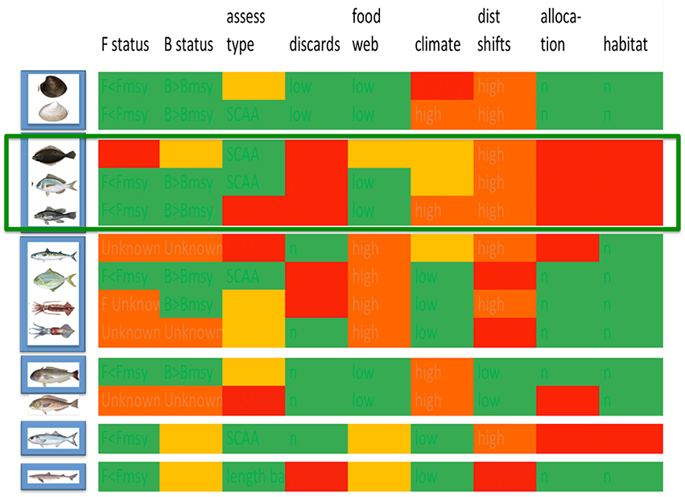
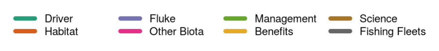
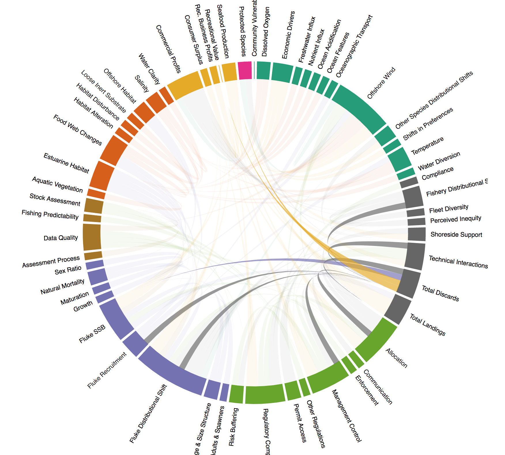

class: top, left

```{r setup, include=FALSE}

options(htmltools.dir.version = FALSE)
knitr::opts_chunk$set(echo = F,
                      warning = F,
                      message = F)
#Plotting and data libraries
library(ggplot2)
library(dplyr)
library(tidyr)
library(here)
library(kableExtra)
library(ggrepel)
library(stringr)
library(patchwork)
library(grid)
library(plotly)
library(vegan)
library(rpart)
library(colorRamps)
library(ecodata)

#GIS libraries
library(sf)
library(rgdal)
#library(raster)
#library(rnaturalearth)

data.dir <- here::here("data")


#Time series constants
shade.alpha <- 0.3
shade.fill <- "lightgrey"
lwd <- 1
pcex <- 2
trend.alpha <- 0.5
trend.size <- 2
hline.size <- 1
hline.alpha <- 0.35
hline.lty <- "dashed"
label.size <- 5
hjust.label <- 1.5
letter_size <- 4
feeding.guilds <- c("Apex Predator","Piscivore","Planktivore","Benthivore","Benthos")
x.shade.min <- 2009
x.shade.max <- 2019
map.lwd <- 0.4
#Function for custom ggplot facet labels
label <- function(variable,value){
  return(facet_names[value])
}

#facet names for titles
facet_names <- list("Apex predators" = expression("Apex predators"),
                    "Piscivores" = expression("Piscivores"),
                    "Planktivores" = expression("Planktivores"),
                    "Benthivores" = expression("Benthivores"),
                    "Benthos" = expression("Benthos"))
#CRS
crs <- "+proj=longlat +lat_1=35 +lat_2=45 +lat_0=40 +lon_0=-77 +x_0=0 +y_0=0 +datum=NAD83 +no_defs +ellps=GRS80 +towgs84=0,0,0"

#Coastline shapefile
# coast <- ne_countries(scale = 10,
#                           continent = "North America",
#                           returnclass = "sf") %>%
#              sf::st_transform(crs = crs)
# 
# #State polygons
# ne_states <- ne_states(country = "united states of america",
#                                       returnclass = "sf") %>%
#   sf::st_transform(crs = crs)

#high-res polygon of Maine
#new_england <- read_sf(gis.dir,"new_england")

#EPU shapefile
epu_sf <- ecodata::epu_sf %>% 
  filter(EPU %in% c("MAB","GB","GOM"))

#Region identifiers
epu <- "Mid-Atlantic Bight"
epu_abbr <- "MAB"
region <- "Mid-Atlantic"
region_abbr <- "MA" #Some commercial data organized by "MA" or "NE" regions, not by EPU 


```


## Mid-Atlantic Council Ecosysytem Approach (work in progress)

Diverse stakeholders agreed that an ecosystem approach was necessary. Developing and implementing an ecosystem approach to fishery management was done in collaboration between managers, stakeholders, and scientists. 
.pull-left[
*Outline*
- Mid-Atlantic Fishery Management Council Ecosystem Approach (EAFM)

- Mid-Atlantic EAFM indicator-based risk assessment 

- Mid-Atlantic EAFM conceptual modeling (towards MSE)

]
.pull-right[
*Integrated Ecosystem Assessment*


.image-cap[
https://www.integratedecosystemassessment.noaa.gov/national/IEA-approach
]
]


???
---
## Mid-Atlantic Council Ecosystem Approach

* 2016 Ecosystem Approach to Fishery Management (EAFM) Policy Guidance document:
http://www.mafmc.org/s/EAFM-Doc-Revised-2019-02-08.pdf

* Mid-Atlantic EAFM framework:
.center[

]


???
The Council’s EAFM framework has similarities to the IEA loop on slide 2. It uses risk assessment as a first step to prioritize combinations of managed species, fleets, and ecosystem interactions for consideration. Second, a conceptual model is developed identifying key environmental, ecological, social, economic, and management linkages for a high-priority fishery. Third, quantitative modeling addressing Council-specified questions and based on interactions identified in the conceptual model is applied to evaluate alternative management strategies that best balance management objectives. As strategies are implemented, outcomes are monitored and the process is adjusted, and/or another priority identified in risk assessment can be addressed. 

---

## Iterative development of the risk assessment

.pull-left-40[


  * Council staff and scientists create examples based on Council input
  
  &uarr; &darr; &uarr; &darr; &uarr; &darr; &uarr; &darr; &uarr; &darr; &uarr; &darr; ...
                                                      
  * Council discusses, clarifies, revises with public input


]

.pull-right-60[
```{r riskel2}

elements<-data.frame(
  Category = c("Ecological","Ecological","Ecological","Ecological","Ecological","Ecological","Ecological","Ecological","Ecological","Ecological","Ecological","Economic","Economic","Economic","Economic","Social","Social","Food Production","Food Production","Management","Management","Management","Management","Management","Management","Put Aside","Put Aside","Put Aside","Put Aside","Put Aside","Put Aside","Put Aside","Put Aside"),
#  Category = c("Ecological","","","","","","","","","","","Economic","","","","Social","","Food Production","","Management","","","","","","Put Aside","","","","","","",""),
  Element = c("Assessment performance","F status","B status","Food web (MAFMC Predator)","Food web  (MAFMC Prey)","Food web  (Protected Species Prey)","Ecosystem productivity", "Climate","Distribution shifts", "Estuarine habitat","Offshore habitat", "Commercial Revenue", "Recreational Angler Days/Trips", "Commercial Fishery Resilience (Revenue Diversity)", "Commercial Fishery Resilience (Shoreside Support)", "Fleet Resilience", "Social-Cultural","Commercial","Recreational", "Control", "Interactions", "Other ocean uses", "Regulatory complexity", "Discards", "Allocation", "Population diversity", "Ecological diveristy", "Fishery Resilience (2)", "Fishery Resilience (3)", "Fishery Resilience (5)", "Commercial Employment", "Recreational Employment", "Seafood safety"), 
  Definition = c("Risk of not achieving OY due to analytical limitations", "Risk of not achieving OY due to overfishing", "Risk of not achieving OY due to depleted stock", "Risk of not achieving OY due to MAFMC managed species interactions", "Risk of not achieving OY due to MAFMC managed species interactions", "Risk of not achieving protected species objectives due to species interactions", "Risk of not achieving OY due to changing system productivity", "Risk of not achieving OY due to climate vulnerability", "Risk of not achieving OY due to climate-driven distribution shifts", "Risk of not achieving OY due to threats to estuarine/nursery habitat", "Risk of not achieving OY due to changing offshore habitat", "Risk of not maximizing fishery value", "Risk of not maximizing fishery value" , "Risk of reduced fishery business resilience", "Risk of reduced fishery business resilience due to shoreside support infrastructure", "Risk of reduced fishery resilience", "Risk of reduced community resilience ", "Risk of not optimizing seafood production" , "Risk of not maintaining personal food production" , "Risk of not achieving OY due to inadequate control", "Risk of not achieving OY due to interactions with species managed by other entities", "Risk of not achieving OY due to other human uses", "Risk of not achieving compliance due to complexity", "Risk of not minimizing bycatch to extent practicable", "Risk of not achieving OY due to spatial mismatch of stocks and management", "Risk of not achieving OY due to reduced diversity", "Risk of not achieving OY due to reduced diversity", "Risk of reduced fishery business resilience due to access to capital", "Risk of reduced fishery business resilience due to insurance availabilty", "Risk of reduced fishery business resilience due to access to emerging markets/opportunities", "Risk of not optimizing employment opportunities", "Risk of not optimizing employment opportunities","Risk of not maintaining market access, human health"),
  Indicators = c("Current assessment method/data quality", "Current F relative to reference F from assessment", "Current B relative to reference B from assessment","Diet composition, management measures","Diet composition, management measures","Diet composition, management measures","Four indicators, see text", "Northeast Climate Vulnerability Assessment", "Northeast Climate Vulnerability Assessment + 2 indicators", "Enumerated threats + estuarine dependence", "Integrated habitat model index", "Revenue in aggregate", "Numbers of anglers and trips in aggregate", "Species diversity of revenue", "Number of shoreside support businesses","Number of fleets, fleet diversity","Community vulnerability, fishery engagement and reliance", "Seafood landings in aggregate", "Recreational landings in aggregate", "Catch compared to allocation","Number and type of interactions with protected or non-MAFMC managed species, co-management", "Fishery overlap with energy/mining areas", "Number of regulations by species", "Standardized Bycatch Reporting", "Distribution shifts + number of interests","Size composition, sex ratio, genetic diversity", "Fishery independent species diversity",  "No current indicator available", "No current indicator available", "Needs clarification","EOP Committee unconfident in Fisheries of US employment inicator","EOP Committee unconfident in Fisheries of US employment indicator", "Number of public advisories by species") 
)

# elements1<-elements %>%
#   filter(Category == "Ecological") %>%
#   select(Element, Definition, Indicators)
# 
# kable(elements1, "html") %>%
#   kable_styling(bootstrap_options = c("striped", "condensed"), font_size = 12) %>%
#   group_rows("Ecological", 1,11) 

```

```{r elements2}

elements2<-elements %>%
  filter(Category %in% c("Economic", "Social", "Food Production")) %>%
  select(Element, Definition, Indicators)

kable(elements2, "html") %>%
  kable_styling(bootstrap_options = c("striped", "condensed"), font_size = 13) %>%
  group_rows("Economic", 1,4) %>%
  group_rows("Social", 5,6) %>%
  group_rows("Food Production", 7,8)

```
]
---
## Risk elements: Management
```{r elements3}

elements3<-elements %>%
  filter(Category == "Management") %>%
  select(Element, Definition, Indicators)

kable(elements3, "html") %>%
  kable_styling(bootstrap_options = c("striped", "condensed"), font_size = 14) %>%
  group_rows("Management", 1,6) #%>%
  #group_rows("Put Aside", 26,33) 

```

---
## Risk assessent indicators and ranking criteria example: Commercial revenue

This element is applied at the ecosystem level. Revenue serves as a proxy for commercial profits.

.table[
.pull-left[

```{r riskcomval, echo=FALSE, message=FALSE, warnings=FALSE, results='asis'}
# tabl <- "
# | Risk Level         | Definition                                                          |  
# |:-------------------|:--------------------------------------------------------------------|
# | Low  | No trend and low variability in revenue |
# | Low-Moderate | Increasing or high variability in revenue |
# | Moderate-High | Significant long term revenue decrease |
# | High | Significant recent decrease in revenue |
# "
# cat(tabl) # output the table in a format good for HTML/PDF/docx conversion

tabl <- data.frame("Risk Level" = c("Low", "Low-Moderate", "Moderate-High", "High"),
                   "Definition" = c("No trend and low variability in revenue",
                                    "Increasing or high variability in revenue",
                                    "Significant long term revenue decrease",
                                    "Significant recent decrease in revenue"))

knitr::kable(tabl, format="html",
             col.names = c("Risk Level", "Definition"),
                           booktabs = T) %>%
  #kable_styling(full_width = TRUE) %>%
  column_spec(1:2, width = "20em")%>%
  row_spec(3, bold = T, background = "orange")
```

  
Ranked moderate-high risk due to the significant long term revenue decrease for Mid-Atlantic managed species (red points in top plot)

]
]
.pull-right[
```{r , code = readLines("https://raw.githubusercontent.com/NOAA-EDAB/ecodata/master/chunk-scripts/human_dimensions_MAB.Rmd-comdat-comm-revenue.R"),fig.asp = 0.5}
#comm-revenue, fig.width = 4, fig.asp = 0.45, fig.cap = "Total revenue for the region (black) and revenue from MAFMC managed species (red)."
```

Key: Black = Revenue of all species combined; <p style="color:#FF6A6A;">Red = Revenue of MAFMC managed species</p>


]


---
## EAFM Risk Assessment: 2021 Update

.pull-left[
*Species level risk elements*
```{r sptable}
#tab.cap="Species level risk analysis results; l=low risk (green), lm= low-moderate risk (yellow), mh=moderate to high risk (orange), h=high risk (red)\\label{sptable}",

# spplist     oc,  sc,  flk, scp, bsb, mack, but, lsq, ssq, gtile,  btile,  blu, dog, monk
risk.species<-data.frame(
  Species = c("Ocean Quahog", "Surfclam", "Summer flounder", "Scup", "Black sea bass", "Atl. mackerel", "Butterfish", "Longfin squid", "Shortfin squid", "Golden tilefish", "Blueline tilefish", "Bluefish", "Spiny dogfish", "Monkfish", "Unmanaged forage", "Deepsea corals"),
  Assess  = c("l", "l", "l",  "l", "l", "l",  "l", "lm", "lm", "l", "h", "l", "lm", "h", "na", "na"),
  Fstatus = c("l", "l", "l", "l", "l", "h", "l", "lm", "lm", "l", "h", "l", "l", "lm", "na", "na"),
  Bstatus = c("l", "l", "lm", "l", "l", "h", "lm", "lm", "lm", "lm", "mh", "h", "lm", "lm", "na", "na"),
  FW1Pred = c("l", "l", "l", "l", "l", "l", "l", "l", "l", "l", "l", "l", "l", "l", "l", "l"),
  FW1Prey = c("l", "l", "l", "l", "l", "l", "l", "l", "l", "l", "l", "l", "l", "l", "lm", "l"),
  FW2Prey = c("l", "l", "l", "l", "l", "l", "l", "lm", "lm", "l", "l", "l", "l", "l", "lm", "l"),
  Climate = c("h", "mh", "lm", "lm", "mh", "lm", "l", "l", "l", "mh", "mh","l", "l", "l", "na", "na"),
  DistShift = c("mh", "mh", "mh", "mh", "mh", "mh", "h", "mh", "h", "l", "l", "mh", "h", "mh", "na", "na"),
  EstHabitat = c("l", "l", "h", "h", "h", "l", "l", "l", "l", "l", "l", "h", "l", "l", "na", "na")#,
#  OffHabitat = c("na", "na", "l", "l", "l", "l", "l", "l", "h", "na", "na", "na", "l", "l", "na", "na")#,
)

# these elements were removed by the council
#  PopDiv = c("na", "na", "na", "na", "na", "na", "na", "na", "na", "na", "na", "na", "na", "na"),
#  FoodSafe = c(),

# one column test
# risk.species %>%
#   mutate(Fstatus = 
#     cell_spec(Fstatus, format="latex", color = "black", align = "c", background =factor(Fstatus, c("na", "l", "lm", "mh", "h"),c("white", "green", "yellow", "orange", "red")))) %>%
#   kable(risk.species, format="latex", escape = F, booktabs = T, linesep = "")

#convert to longer text for consistency and display in html table
risk.species <- risk.species %>%
     mutate_at(vars(-Species), function(x){
       recode(x,'l'="lowest",'lm'="lowmod",'mh'="modhigh",'h'="highest")}) %>%
     as.data.frame()

#generalize to all
risk.species %>%
  mutate_at(vars(-Species), function(x){ 
    cell_spec(x, format="html", color = factor(x, c("na", "lowest", "lowmod", "modhigh", "highest"),c("black", "black", "black", "black", "white")), align = "c", background =factor(x, c("na", "lowest", "lowmod", "modhigh", "highest"),c("white", "lightgreen", "yellow", "orange", "red")), background_as_tile=F)}) %>%
  kable(format = "html", escape = F, table.attr='class="risktable"') %>%
  kable_styling(font_size = 9) 
```

*Ecosystem level risk elements*
```{r ecotable}
#tab.cap="Ecosystem level risk analysis results; l=low risk (green), lm= low-moderate risk (yellow), mh=moderate to high risk (orange), h=high risk (red)\\label{sptable}",

risk.eco<-data.frame(
  System = c("Mid-Atlantic"),
  EcoProd = c("lm"),
  #EcoDiv = c("lm"),
  CommRev = c("mh"),
  RecVal = c("h"),
  FishRes1 = c("l"),
  FishRes4 = c("mh"),
  #CommJobs = c("mh"),
  #RecJobs = c("l"),
  FleetDiv = c("l"),
  Social = c("lm"),
  ComFood = c("h"),
  RecFood = c("mh")
)

#convert to longer text for consistency and display in html table
risk.eco <- risk.eco %>%
     mutate_at(vars(-System), function(x){
       recode(x,'l'="lowest",'lm'="lowmod",'mh'="modhigh",'h'="highest")}) %>%
     as.data.frame()

#make table
risk.eco %>%
  mutate_at(vars(-System), function(x){ 
    cell_spec(x, format="html", color = factor(x, c("na", "lowest", "lowmod", "modhigh", "highest"),c("black", "black", "black", "black", "white")), align = "c", background =factor(x, c("na", "lowest", "lowmod", "modhigh", "highest"),c("white", "lightgreen", "yellow", "orange", "red")), background_as_tile=F)}) %>%
  kable(format = "html", escape = F, table.attr='class="risktable"') %>%
  kable_styling(font_size = 9) 

```
]  

.pull-right[ 
*Species and Sector level risk elements*
```{r mgttable,  echo=FALSE, message=FALSE, warnings=FALSE}
#tab.cap="Species and sector level risk analysis results; l=low risk (green), lm= low-moderate risk (yellow), mh=moderate to high risk (orange), h=high risk (red)\\label{sptable}",

risk.sppsector<-data.frame(
  Species = c("Ocean Quahog-C", "Surfclam-C", "Summer flounder-R", "Summer flounder-C","Scup-R", "Scup-C","Black sea bass-R", "Black sea bass-C","Atl. mackerel-R", "Atl. mackerel-C","Butterfish-C", "Longfin squid-C", "Shortfin squid-C", "Golden tilefish-R", "Golden tilefish-C","Blueline tilefish-R","Blueline tilefish-C", "Bluefish-R", "Bluefish-C","Spiny dogfish-R", "Spiny dogfish-C", "Chub mackerel-C", "Unmanaged forage", "Deepsea corals"),
  MgtControl = c(1,1,3,2,2,1,4,4,2,1,1,1,2,9,1,1,1,2,1,1,1,1,1,9),
  TecInteract = c(1,1,1,3,1,2,1,2,1,2,2,3,2,1,1,1,1,1,1,1,3,2,1,9),
  OceanUse = c(2,2,2,2,2,3,3,4,1,3,3,4,2,1,1,1,1,1,2,1,3,2,3,3),
  RegComplex = c(1,1,3,3,3,3,3,3,1,4,4,4,2,1,1,3,3,2,2,1,3,2,1,9),
  Discards = c(3,3,4,3,3,3,4,4,1,2,3,4,1,1,1,1,1,3,2,1,2,1,1,9),
  Allocation = c(1,1,4,4,4,4,4,4,1,4,1,1,1,1,1,4,4,4,4,1,1,1,1,9) 
)


#convert to text for consistency
risk.sppsector <- risk.sppsector %>%
     mutate_at(vars(-Species), function(x){
       recode(x,'1'="lowest",'2'="lowmod",'3'="modhigh",'4'="highest",'9'="na")}) %>%
     as.data.frame()

#make table
risk.sppsector %>%
  mutate_at(vars(-Species), function(x){ 
    cell_spec(x, format="html", color = factor(x, c("na", "lowest", "lowmod", "modhigh", "highest"),c("black", "black", "black", "black", "white")), align = "c", background =factor(x, c("na", "lowest", "lowmod", "modhigh", "highest"),c("white", "lightgreen", "yellow", "orange", "red")), background_as_tile=F)}) %>%
  kable(format = "html", escape = F, table.attr='class="risktable"') %>%
  kable_styling(font_size = 11) 

```
]


???
Changes:
Butterfish B status risk increased from lowest to low-mod (below Bmsy)
Allocation risk decreased for 4 fisheries from high to low (intermediate rankings not applied)
Black sea bass regulatory complexity risk decreased from highest to moderate-high

Potential new indicators from new SOE sections on climate risk, habitat vulnerability, offshore wind
---
## How is MAFMC using the risk assessment? What's next?
.pull-left[
* Based on risk assessment, the Council selected summer flounder as high-risk fishery for conceptual modeling


]
.pull-right[
* Working group of habitat, biology, stock assessment, management, economic and social scientists developed:

  * draft conceptual models of high risk elements, linkages
  * dataset identification and gap analysis for each element and link
  * draft questions that the Council could persue with additional work
  
* Final conceptual model (next slide) and supporting information at December 2019 Council meeting
]  

*Council proceeding with management strategy evaluation (MSE) using the information from conceptual modeling as a basis. Topic: addressing recreational fishery discards with EAFM*


---
```{r sfconceptmod, echo = F, fig.align = "center"}
# setup for conceptual model
PKG <- c(#"foreign","foodweb","sna", "DiagrammeR","circlize", "kableExtra", "googledrive", "readxl"
         "RColorBrewer","QPress",
         "chorddiag",
         "widgetframe")

for (p in PKG) {
  if(!require(p,character.only = TRUE)) {
    install.packages(p)
    require(p,character.only = TRUE)}
}


#assumes this is a project and .dia file is in data directory
edges <- model.dia(file.path(data.dir, "Summer_Flounder_July22_2019.dia"))

source("R/interactive_chord_sfconsmod.R")

conmod <- interactive_chord_sfconsmod(edges, width=710, height=710, margin=130)

frameWidget(conmod)

```
???
In this interactive circular graph visualization, model elements identified as important by the Council (through risk assessment) and by the working group (through a range of experience and expertise) are at the perimeter of the circle. Elements are defined in detail in the last section of [this page](https://gdepiper.github.io/Summer_Flounder_Conceptual_Models/sfconsmod_riskfactors_subplots.html). Relationships between elements are represented as links across the center of the circle to other elements on the perimeter. Links from a model element that affect another element start wide at the base and are color coded to match the category of the element they affect.Hover over a perimeter section (an element) to see all relationships for that element, including links from other elements. Hover over a link to see what it connects. Links by default show text for the two elements and the direction of the relationship (1 for relationship, 0 for no relationship--most links are one direction).For example, hovering over the element "Total Landings" in the full model shows that the working group identified the elements affected by landings as Seafood Production, Recreational Value, and Commercial Profits (three links leading out from landings), and the elements affecting landings as Fluke SSB, Fluke Distributional Shift, Risk Buffering, Management Control, Total Discards, and Shoreside Support (6 links leading into Total Landings).

---
## Council-selected management question:

##Evaluate the biological and economic benefits of minimizing summer flounder discards and converting discards into landings in the recreational sector. Identify management strategies to effectively realize these benefits.

.pull-left[
* Opportunity to align EAFM work with traditional Council process
* Management challenges to address and reduce regulatory discards
    + 90% of rec summer flounder catch is released
* Raised by AP members and stakeholders seeking management to address
* EAFM issue and focus – seven linked categories: Management, Summer Flounder Stock, Science, Fishing Fleets, and Benefits 

]

.pull-right[

]

---
# Now: management strategy evaluation

.pull-left-40[
* You are here!

* Opportunity to participate and shape the analysis

* Iterative process with feedback

* Introduction to MSE process up next
]

.pull-right-60[

]


---
## Details
.pull-left[
* [Mid-Atlantic Council EAFM paper, 2016](https://www.frontiersin.org/articles/10.3389/fmars.2016.00105/full)

* [Mid-Atlantic Council Risk Assessment paper, 2018](https://www.frontiersin.org/articles/10.3389/fmars.2018.00442/full#h11)

* [Mid-Atlantic Council Summer Flounder conceptual model, support tables, 2019](https://gdepiper.github.io/Summer_Flounder_Conceptual_Models/sfconsmod_riskfactors_subplots.html)

* [Management questions and conceptual model, 2019](https://gdepiper.github.io/Summer_Flounder_Conceptual_Models/sfconsmod_final_2col.html) 
]

.pull-right[
* [Mid-Atlantic Council EAFM paper, 2021](https://www.tandfonline.com/doi/full/10.1080/08920753.2021.1846156)

* [Mid-Atantic April 2021 EAFM updates, including MSE](https://www.mafmc.org/s/Tab01_EAFM-Updates_2021-04.pdf)

* [Mid-Atlantic April 2021 State of the Ecosystem report](https://www.mafmc.org/s/Tab06_SOE-Mid-Atlantic-Risk-Assessment__2021-04.pdf)

]

.center[
# Questions? Thank you!
]

.footnote[

Slides available at https://noaa-edab.github.io/presentations

Contact <Sarah.Gaichas@noaa.gov>

]
