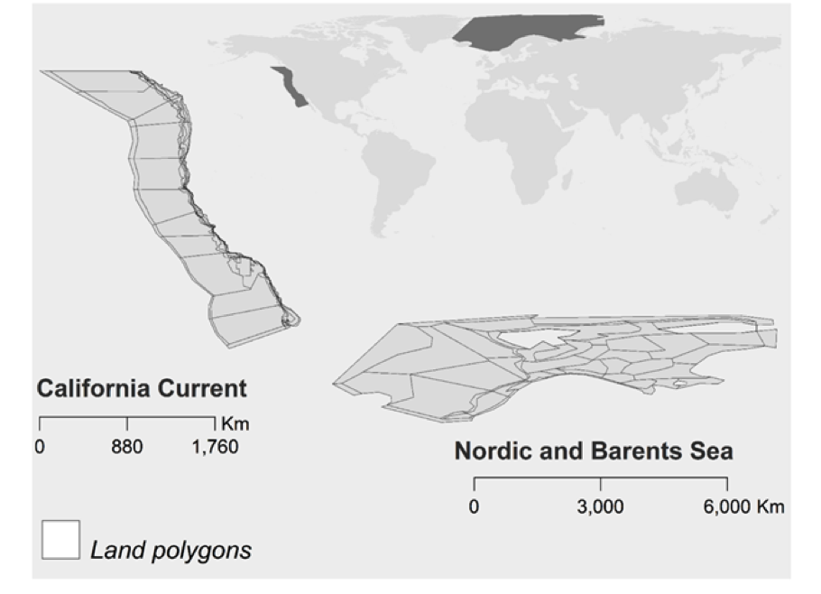
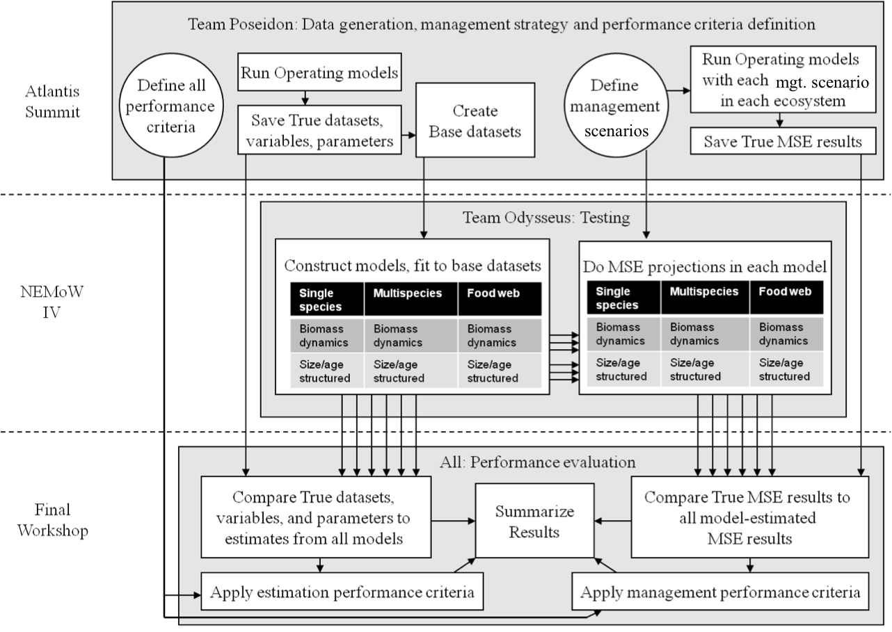
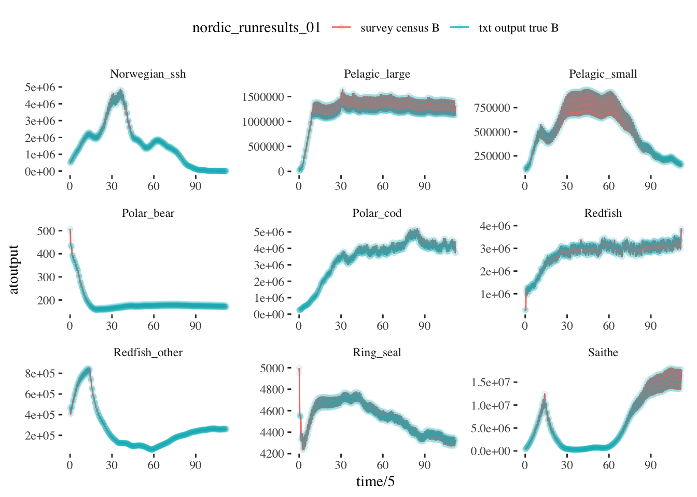

class: top, left

```{r setup, include=FALSE}

options(htmltools.dir.version = FALSE)
knitr::opts_chunk$set(echo = F,
                      warning = F,
                      message = F)
#Plotting and data libraries
library(ggplot2)
library(dplyr)
library(tidyr)
#library(ecodata)
library(here)
library(kableExtra)
library(ggrepel)
library(stringr)
library(patchwork)
library(grid)
library(plotly)
library(vegan)
library(rpart)
library(colorRamps)

#GIS libraries
library(sf)
library(rgdal)
library(raster)
library(rnaturalearth)

data.dir <- here::here("data")

# #Time series constants
# shade.alpha <- 0.3
# shade.fill <- "lightgrey"
# lwd <- 1
# pcex <- 2
# trend.alpha <- 0.5
# trend.size <- 2
# hline.size <- 1
# hline.alpha <- 0.35
# hline.lty <- "dashed"
# label.size <- 5
# hjust.label <- 1.5
# letter_size <- 4
# feeding.guilds <- c("Apex Predator","Piscivore","Planktivore","Benthivore","Benthos")
# x.shade.min <- 2009
# x.shade.max <- 2018
# map.lwd <- 0.4
# #Function for custom ggplot facet labels
# label <- function(variable,value){
#   return(facet_names[value])
# }
# 
# #facet names for titles
# facet_names <- list("Apex predators" = expression("Apex predators"),
#                     "Piscivores" = expression("Piscivores"),
#                     "Planktivores" = expression("Planktivores"),
#                     "Benthivores" = expression("Benthivores"),
#                     "Benthos" = expression("Benthos"))
# #CRS
# crs <- "+proj=longlat +lat_1=35 +lat_2=45 +lat_0=40 +lon_0=-77 +x_0=0 +y_0=0 +datum=NAD83 +no_defs +ellps=GRS80 +towgs84=0,0,0"
# 
# #Coastline shapefile
# coast <- ne_countries(scale = 10,
#                           continent = "North America",
#                           returnclass = "sf") %>%
#              sf::st_transform(crs = crs)
# 
# #State polygons
# ne_states <- ne_states(country = "united states of america",
#                                       returnclass = "sf") %>%
#   sf::st_transform(crs = crs)
# 
# #high-res polygon of Maine
# #new_england <- read_sf(gis.dir,"new_england")
# 
# #EPU shapefile
# epu_sf <- ecodata::epu_sf %>% 
#   filter(EPU %in% c("MAB","GB","GOM"))
```

# Scientist Exchange
.pull-left[
- High priority for all!
  - U.S.- Norway Bilateral Science Agreement 
  - IMR REDUS project
  
- 2017: Hansen (IMR) to NOAA NWFSC, Seattle

- Funding for 2019 exchange: 
  - NOAA internal "international fellowship" funding opportunity 
  - leveraged funds from REDUS
]
.pull-right[

*<sup>1</sup>*
]
.footnote[
[1] https://www.meganstarr.com/30-things-you-should-know-before-moving-to-norway/
]
---
## This project: Fragile ecosystems, robust assessments? Performance testing stock assessments for the California Current and Nordic and Barents Seas under climate change

- NOAA funds cover 45-50 days accommodation and per diem for 3 visiting scientists: 
    - Gaichas, April 15 - June 15
    - Lynch, April 18 - June 7
    - Kaplan, May 11 - June 21
      
- REDUS funds cover airfare for visiting scientists; IMR providing offices, network access, etc.
  
- additional NMFS and IMR collaborators to leverage diverse skills and experiences 
  - Christine Stawitz, visiting IMR May 19-25
  - Cecile Hansen, Daniel Howell, Erik Olsen, and many others on the REDUS team.
---

# Project motivation

.pull-left[

- Changing climate and ocean conditions --> Shifting distributions, changing productivity

- Needs:
  - Improve our ability to project global change impacts in the California Current and Nordic/Barents Seas (and elsewhere)
  - Test the performance of stock assessments to these impacts
]

.pull-right[
*Climate-Ready Management<sup>1</sup>*


]

.footnote[
[1] Karp, Melissa A. et al. 2019. Accounting for shifting distributionsand changing productivity in the development of scientific advice for fishery management. – ICES Journal of Marine Science, doi:10.1093/icesjms/fsz048.
]

???
---
## End-to-end ecosystem operating models

* Barents Sea<sup>1-2</sup>
* California Current<sup>3-4</sup> 

```{r Atlantismods, echo = F, out.width = "60%", fig.align = "center"}

```

* Building on previous global change projections <sup>5-6</sup>

.footnote[
[1] Hansen et al 2016
[2] Hansen et al 2018

[3] Marshall et al. 2017
[4] Kaplan et al. 2017

[5] Hodgson et al. 2018
[6] Olsen et al. 2018
]

???
---

## End-to-end ecosystem operating models
.pull-left[
1. Scenarios for effects of temperature on growth, recruitment (future: spatial distribution, changing interactions)

1. Focus on key assessed stocks (e.g. petrale sole, Pacific hake)

1. Pass output to dataset generator -> Stock Synthesis assessment 

1. Also dataset generator -> multispecies, other single species models

1. Compare performance of different model settings, multiple models, model ensembles 
]

.pull-right[
```{r nes-comp2, echo = F, fig.align = "center"}
knitr::include_graphics("EDAB_images/q_surverr_MEF.png")
```
]
???

---
## Could test both estimation and MSE capability

```{r poseidon, echo = F, fig.align = "center"}

```

---
## What can we do so far?

Example results: 
.pull-left[
Survey census test NOBA 
```{r ex-output1, echo = F, warning = F, message=F, fig.align = "center"}

```
]
.pull-right[
Standard survey test CCA
```{r ex-output2, echo = F, warning = F, message=F, fig.align = "center"}
knitr::include_graphics("EDAB_images/CCsurveyex.png")
```
]

---
## External Resources

* [Atlantis Model Documentation](https://github.com/Atlantis-Ecosystem-Model/Atlantis_example_and_instructions)

* [atlantisom R package](https://github.com/r4atlantis/atlantisom)

* [dataset generation](https://github.com/sgaichas/poseidon-dev)

  * [True Biomass Comparisons](https://sgaichas.github.io/poseidon-dev/TrueBioTest.html)
  * [Standard Surveys](https://sgaichas.github.io/poseidon-dev/StandardSurveyTest.html)
  * [Age Comps in progress](https://sgaichas.github.io/poseidon-dev/TrueLengthAgeCompTest.html)

* Slides available at https://noaa-edab.github.io/presentations

---
## Questions?


# Tusen Takk til Havforskningsinstituttet! Vi gleder oss til en produktiv tid her.
