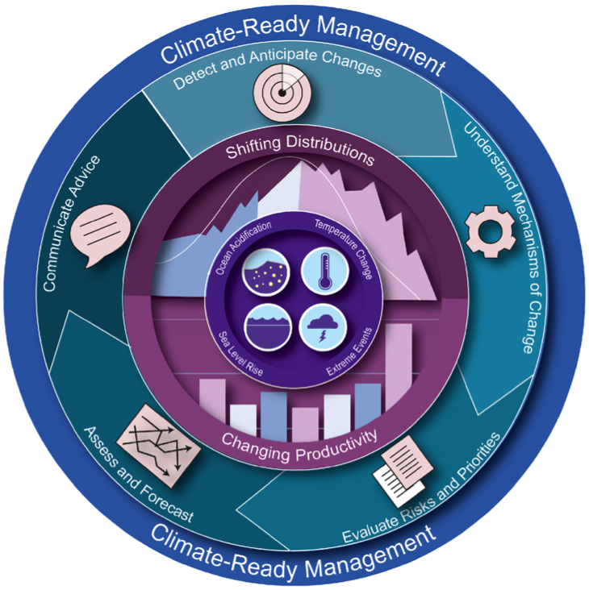
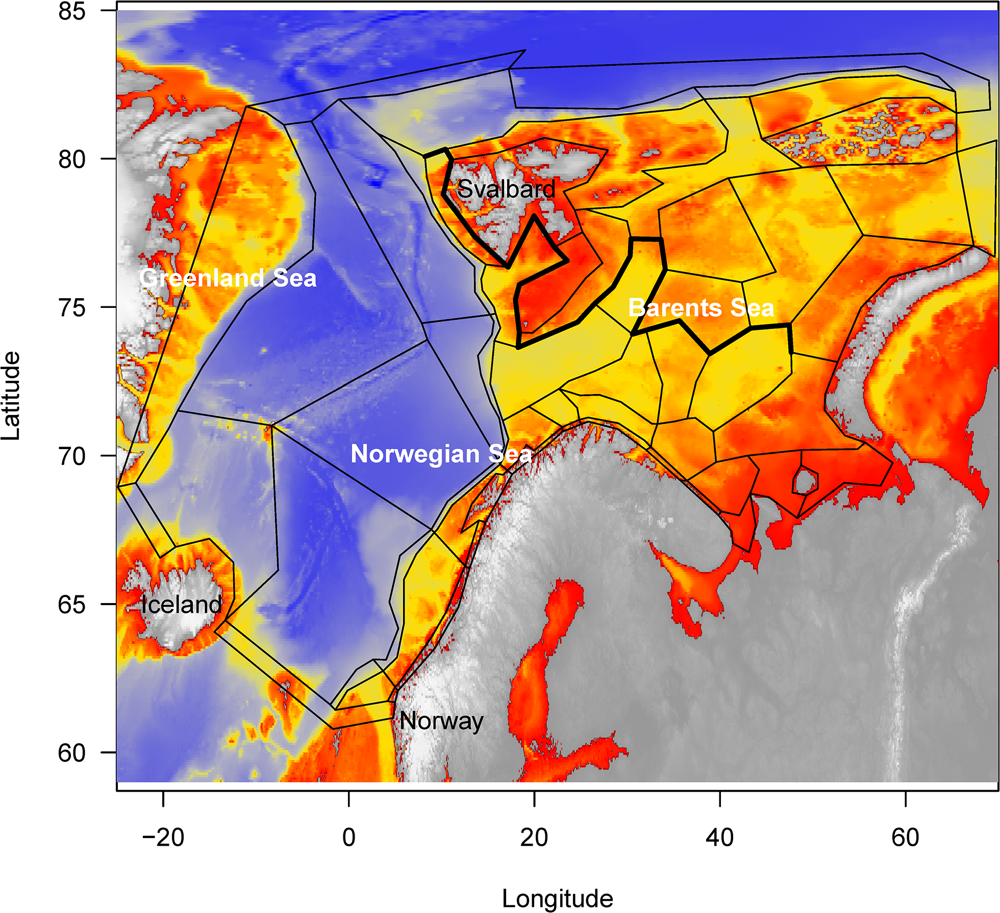

class: top, left

```{r setup, include=FALSE}

options(htmltools.dir.version = FALSE)
knitr::opts_chunk$set(echo = F,
                      warning = F,
                      message = F)
#Plotting and data libraries
library(ggplot2)
library(dplyr)
library(tidyr)
library(here)
library(kableExtra)
library(ggrepel)
library(stringr)

library(atlantisom)

data.dir <- here::here("data")

```

## Fragile ecosystems, robust assessments? Performance testing stock assessments for the California Current and Nordic and Barents Seas under climate change
.pull-left[
- Scientist exchange central to this project

- NOAA internal "international fellowship" and REDUS funding:  
  - Gaichas, April 15 - June 15
  - Lynch, April 18 - June 7
  - Kaplan, May 11 - June 21
  - Christine Stawitz, May 19-25
]
.pull-right[

*<sup>1</sup>*
]

- Additional NMFS and IMR collaborators with diverse skills and experiences 
  - Emma Hodgson, other stock assessment and modeling folks
  - Cecilie Hansen, Daniel Howell, Erik Olsen, and now **YOU**

.footnote[
[1] https://www.meganstarr.com/30-things-you-should-know-before-moving-to-norway/
]

---

# Project motivation

.pull-left[

- Changing climate and ocean conditions --> Shifting distributions, changing productivity

- Needs:
  - Improve our ability to project global change impacts in the California Current and Nordic/Barents Seas (and elsewhere)
  - Test the performance of stock assessments to these impacts
]

.pull-right[
*Climate-Ready Management<sup>1</sup>*



]

.footnote[
[1] Karp, Melissa A. et al. 2019. Accounting for shifting distributionsand changing productivity in the development of scientific advice for fishery management. – ICES Journal of Marine Science, doi:10.1093/icesjms/fsz048.
]

???
---
## End-to-end ecosystem operating models

Atlantis modeling framework: [Fulton et al. 2011](https://onlinelibrary.wiley.com/doi/full/10.1111/j.1467-2979.2011.00412.x), [Fulton and Smith 2004](https://www.ajol.info/index.php/ajms/article/view/33182)

.pull-left[
**Norwegian-Barents Sea**

[Hansen et al. 2016](https://www.imr.no/filarkiv/2016/04/fh-2-2016_noba_atlantis_model_til_web.pdf/nn-no), 
[2018](https://journals.plos.org/plosone/article?id=10.1371/journal.pone.0210419)


]
.pull-right[
**California Current**

[Marshall et al. 2017](https://onlinelibrary.wiley.com/doi/full/10.1111/gcb.13594), 
[Kaplan et al. 2017](https://www.sciencedirect.com/science/article/pii/S0304380016308262?via%3Dihub)


]


Building on global change projections:  [Hodgson et al. 2018](https://www.sciencedirect.com/science/article/pii/S0304380018301856?via%3Dihub), 
[Olsen et al. 2018](https://www.frontiersin.org/articles/10.3389/fmars.2018.00064/full)


???
---

## Project overview
.pull-left[
1. Scenarios for effects of temperature on growth, natural mortality

1. Focus on key stocks (Northeast Arctic cod, Norwegian spring spawning herring, California Current sardine, Pacific hake or a Pacific rockfish)

1. Atlantis output to dataset generator (`atlantisom`) -> Stock Synthesis assessment 

1. Compare performance of different model settings, multiple models, model ensembles 
]

.pull-right[
```{r nes-comp2, echo = F, fig.align = "center", fig.show = "hold"}

```
]
Bonus: `atlantisom` -> multispecies, other single species models for testing

???

---
## Test both estimation and (simple) MSE capability

```{r poseidon, echo = F, fig.align = "center"}
knitr::include_graphics("EDAB_images/PoseidonDesign.png")
```

---
## Design
* Operating model scenario (climate and fishing)


--

.pull-left[
* Recruitment variability in the operating model

* Specify uncertainty in assessment inputs using `atlantisom`
]
.pull-right[

]


---
## Stock Synthesis framework

stuff about the model itself and the variation we expect to look at

do this with other assessment models, generalize, use REDUS framework?

---
## Make atlantis output into assessment model input

Show example workflow

---
## What can we do so far?

Example results: 
.pull-left[
Survey census test NOBA 
```{r ex-output1, echo = F, warning = F, message=F, fig.align = "center"}
knitr::include_graphics("EDAB_images/NOBAcensus.png")
```
]
.pull-right[
Standard survey test CCA
```{r ex-output2, echo = F, warning = F, message=F, fig.align = "center"}
knitr::include_graphics("EDAB_images/CCsurveyex.png")
```
]

---
## Specify uncertainty in assessment "data": REDUS to the rescue!

What level of uncertainty is appropriate to carry through these analyses?
.pull-left[
1. Biological:

    1. appropriate sigma-R?

1. Survey specification:

    1. timing and spatial coverage?

    1. which species are captured?

    1. species-specific survey efficiency ("q")?

    1. selectivity at age for each species?

] 
.pull-right[
1. Survey uncertainty:

    1. additional observation error (survey cv for index)?
    
    1. effective sample size for biological samples?
    
1. Fishery uncertainty:
    
    1. additional observation error (catch cv for total)?
    
    1. catch sampled for length/age in all areas?
    
    1. effective sample size for biological samples?
]

---
## External Resources

* [Atlantis Model Documentation](https://github.com/Atlantis-Ecosystem-Model/Atlantis_example_and_instructions)

* [atlantisom R package](https://github.com/r4atlantis/atlantisom)

* [dataset generation](https://github.com/sgaichas/poseidon-dev)

  * [True Biomass Comparisons](https://sgaichas.github.io/poseidon-dev/TrueBioTest.html)
  * [Standard Surveys](https://sgaichas.github.io/poseidon-dev/StandardSurveyTest.html)
  * [Age Comps in progress](https://sgaichas.github.io/poseidon-dev/TrueLengthAgeCompTest.html)

* Slides available at https://noaa-edab.github.io/presentations

---
## Questions?


# Tusen Takk til Havforskningsinstituttet! Vi gleder oss til en produktiv tid her.