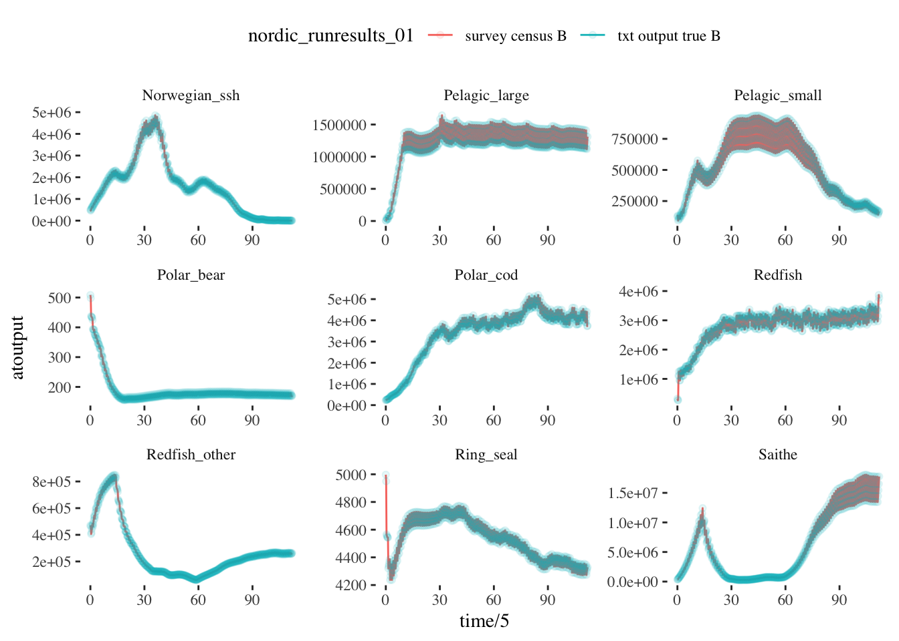

class: top, left

```{r setup, include=FALSE}

options(htmltools.dir.version = FALSE)
knitr::opts_chunk$set(echo = F,
                      warning = F,
                      message = F)
#Plotting and data libraries
library(ggplot2)
library(dplyr)
library(tidyr)
library(here)
library(kableExtra)
library(ggrepel)
library(stringr)

library(atlantisom)

data.dir <- here::here("data")

```

## Fragile ecosystems, robust assessments? Performance testing stock assessments for the California Current and Nordic and Barents Seas under climate change
.pull-left[
- Scientist exchange central to this project
- NOAA internal "international fellowship" and REDUS funding:  
  - Gaichas, April 15 - June 15
  - Lynch, April 18 - June 7
  - Kaplan, May 11 - June 21
  - Christine Stawitz, May 19-25
]
.pull-right[

*<sup>1</sup>*
]

- Additional NMFS and IMR collaborators with diverse skills and experiences 
  - Emma Hodgson, other stock assessment and modeling folks
  - Cecile Hansen, Daniel Howell, Erik Olsen, and now **YOU**

.footnote[
[1] https://www.meganstarr.com/30-things-you-should-know-before-moving-to-norway/
]

---

# Project motivation

.pull-left[

- Changing climate and ocean conditions --> Shifting distributions, changing productivity

- Needs:
  - Improve our ability to project global change impacts in the California Current and Nordic/Barents Seas (and elsewhere)
  - Test the performance of stock assessments to these impacts
]

.pull-right[
*Climate-Ready Management<sup>1</sup>*


]

.footnote[
[1] Karp, Melissa A. et al. 2019. Accounting for shifting distributionsand changing productivity in the development of scientific advice for fishery management. – ICES Journal of Marine Science, doi:10.1093/icesjms/fsz048.
]

???
---
## End-to-end ecosystem operating models

* Barents Sea<sup>1-2</sup>
* California Current<sup>3-4</sup> 

```{r Atlantismods, echo = F, out.width = "60%", fig.align = "center"}
knitr::include_graphics("EDAB_images/atlantismods.png")
```

* Building on previous global change projections <sup>5-6</sup>

.footnote[
[1] Hansen et al 2016
[2] Hansen et al 2018

[3] Marshall et al. 2017
[4] Kaplan et al. 2017

[5] Hodgson et al. 2018
[6] Olsen et al. 2018
]

???
---

## End-to-end ecosystem operating models
.pull-left[
1. Scenarios for effects of temperature on growth, natural mortality

1. Focus on key stocks (Northeast Arctic cod, Norwegian spring spawning herring, California Current sardine, Pacific hake or a Pacific rockfish)

1. Atlantis output to dataset generator (`atlantisom`) -> Stock Synthesis assessment 

1. Also `atlantisom` -> multispecies, other single species models for testing

1. Compare performance of different model settings, multiple models, model ensembles 
]

.pull-right[
```{r nes-comp2, echo = F, fig.align = "center"}

```
]
???

---
## Test both estimation and (simple) MSE capability

```{r poseidon, echo = F, fig.align = "center"}
knitr::include_graphics("EDAB_images/PoseidonDesign.png")
```

---
## What can we do so far?

Example results: 
.pull-left[
Survey census test NOBA 
```{r ex-output1, echo = F, warning = F, message=F, fig.align = "center"}

```
]
.pull-right[
Standard survey test CCA
```{r ex-output2, echo = F, warning = F, message=F, fig.align = "center"}
knitr::include_graphics("EDAB_images/CCsurveyex.png")
```
]

---
## Process

Show example workflow?

---
## REDUS to the rescue!

What level of uncertainty is appropriate to carry through these analyses?
.pull-left[
1. Survey specification:

    1. timing and spatial coverage?

    1. which species are captured?

    1. species-specific survey efficiency ("q")?

    1. selectivity at age for each species?

1. Survey uncertainty:

    1. additional observation error (survey cv for index)?
    
    1. effective sample size for biological samples?
] 
.pull-right[
1. Fishery uncertainty:
    
    1. additional observation error (catch cv for total)?
    
    1. catch sampled for length/age in all areas?
    
    1. effective sample size for biological samples?
]

---
## External Resources

* [Atlantis Model Documentation](https://github.com/Atlantis-Ecosystem-Model/Atlantis_example_and_instructions)

* [atlantisom R package](https://github.com/r4atlantis/atlantisom)

* [dataset generation](https://github.com/sgaichas/poseidon-dev)

  * [True Biomass Comparisons](https://sgaichas.github.io/poseidon-dev/TrueBioTest.html)
  * [Standard Surveys](https://sgaichas.github.io/poseidon-dev/StandardSurveyTest.html)
  * [Age Comps in progress](https://sgaichas.github.io/poseidon-dev/TrueLengthAgeCompTest.html)

* Slides available at https://noaa-edab.github.io/presentations

---
## Questions?


# Tusen Takk til Havforskningsinstituttet! Vi gleder oss til en produktiv tid her.