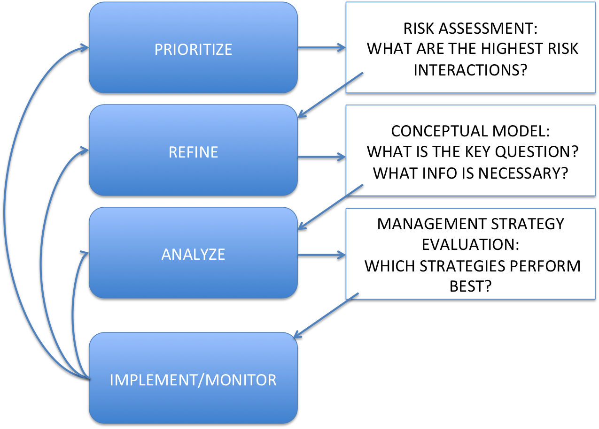
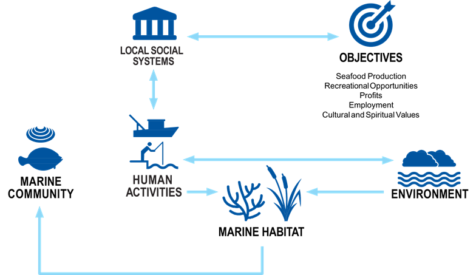
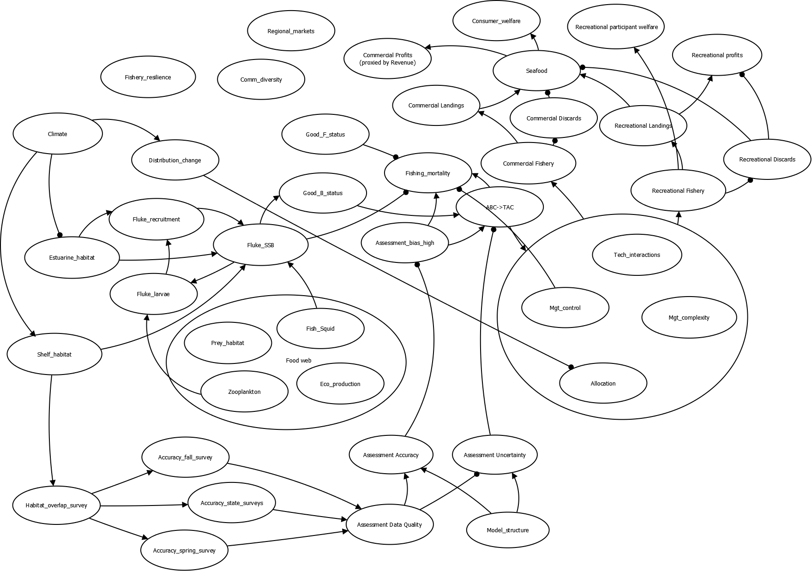
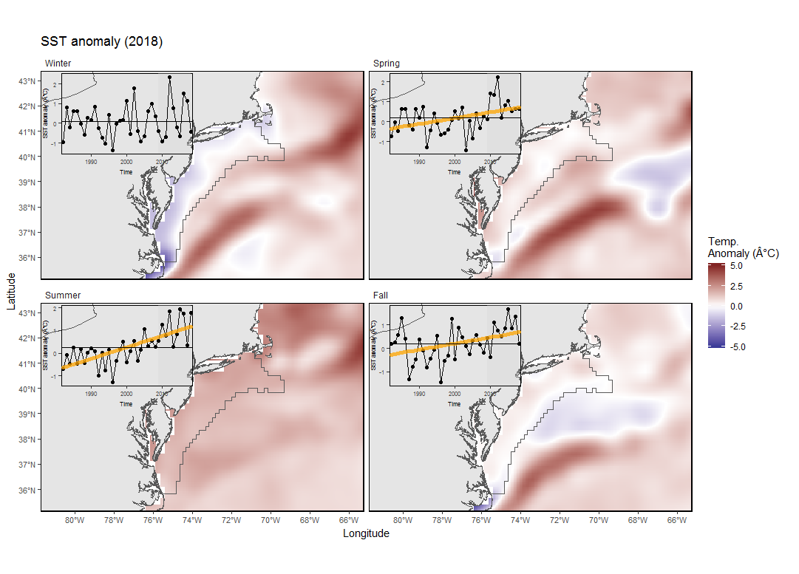
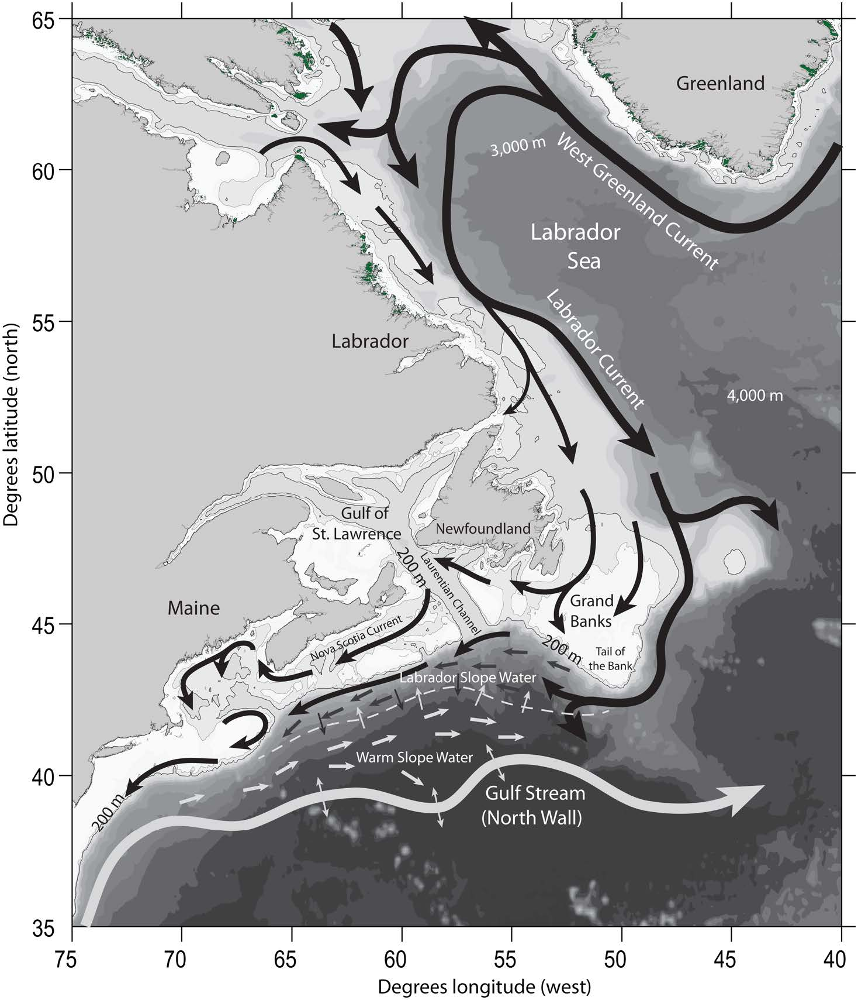

class: top, left

```{r setup, include=FALSE}

options(htmltools.dir.version = FALSE)
knitr::opts_chunk$set(echo = F,
                      warning = F,
                      message = F)
#Plotting and data libraries
library(ggplot2)
library(dplyr)
library(tidyr)
library(ecodata)
library(here)
library(kableExtra)
library(ggrepel)
library(stringr)
library(patchwork)
library(grid)
library(plotly)
library(vegan)
library(rpart)
library(colorRamps)

#GIS libraries
library(sf)
library(rgdal)
library(raster)
library(rnaturalearth)

data.dir <- here::here("data")


#Time series constants
shade.alpha <- 0.3
shade.fill <- "lightgrey"
lwd <- 1
pcex <- 2
trend.alpha <- 0.5
trend.size <- 2
hline.size <- 1
hline.alpha <- 0.35
hline.lty <- "dashed"
label.size <- 5
hjust.label <- 1.5
letter_size <- 4
feeding.guilds <- c("Apex Predator","Piscivore","Planktivore","Benthivore","Benthos")
x.shade.min <- 2009
x.shade.max <- 2018
map.lwd <- 0.4
#Function for custom ggplot facet labels
label <- function(variable,value){
  return(facet_names[value])
}

#facet names for titles
facet_names <- list("Apex predators" = expression("Apex predators"),
                    "Piscivores" = expression("Piscivores"),
                    "Planktivores" = expression("Planktivores"),
                    "Benthivores" = expression("Benthivores"),
                    "Benthos" = expression("Benthos"))
#CRS
crs <- "+proj=longlat +lat_1=35 +lat_2=45 +lat_0=40 +lon_0=-77 +x_0=0 +y_0=0 +datum=NAD83 +no_defs +ellps=GRS80 +towgs84=0,0,0"

#Coastline shapefile
coast <- ne_countries(scale = 10,
                          continent = "North America",
                          returnclass = "sf") %>%
             sf::st_transform(crs = crs)

#State polygons
ne_states <- ne_states(country = "united states of america",
                                      returnclass = "sf") %>%
  sf::st_transform(crs = crs)

#high-res polygon of Maine
#new_england <- read_sf(gis.dir,"new_england")

#EPU shapefile
epu_sf <- ecodata::epu_sf %>% 
  filter(EPU %in% c("MAB","GB","GOM"))
```

## Conclusion

Rapid progress in implementing an ecosystem approach to fishery management resulted from positive collaboration between managers, stakeholders, and scientists. Collaboration is essential to integrated ecosystem assessment and to the success of ecosystem approaches. 

.pull-left[
*Outline*
- Why did managers decide to invest in an ecosystem approach?

- How did they develop their approach?

- Why risk assessment?

- How did they develop the risk assessment?

- How are they using the risk assessment?

- What are their next steps?

]

.pull-right[
*The IEA Loop*


.small[
https://www.integratedecosystemassessment.noaa.gov/national/IEA-approach
]
]


???
---
## Fisheries management in the US

Council map

Highlight the Mid

---
## Why an ecosystem approach?

Visioning/strategic planning process: 2011-2012

"We rebuilt all the stocks, so why is everyone still pissed off?"

Common themes across stakeholder groups

Summarize visioning report, reference it

---
## How was the approach developed?

Public workshops aligned with the common themes over 2-3 years

  * Forage 
  * Climate
  * Interactions
  * Habitat
  
  Social and economic considerations in each discussion

Scientific presentations followed by Council questions and discussion

Developed policy guidance white papers for Council discussion

NOT regulatory, but policy statements

Led to work on regulations, e.g. unmanaged forage amendment

---
## Mid-Atlantic Council Ecosystem Approach

* 2016 EAFM Policy Guidance document; revised 2019<sup>1</sup> 

* MAFMC EAFM framework<sup>2</sup>
```{r framework, echo = F, out.width = "60%", fig.align = "center"}

```

.footnote[
[1] http://www.mafmc.org/s/EAFM-Doc-Revised-2019-02-08.pdf

[2] https://www.frontiersin.org/articles/10.3389/fmars.2016.00105/full
]

---
## Foreshadowing

* 2017 Inital EAFM risk assessment completed; revised and published 2018<sup>1</sup>

* State of the Ecosystem indicators to be used for annual risk assessment updates


.footnote[
[1] https://www.frontiersin.org/articles/10.3389/fmars.2018.00442/full
]

???


---

## Meanwhile, State of the Ecosystem (SOE) Reporting: Context for busy people

---

## State of the Ecosystem (SOE) Reporting: Context for busy people

*"So what?" --John Boreman, September 2016*

1. Clear linkage of ecosystem indicators with management objectives

1. Synthesis across indicators for big picture

1. Objectives related to human-well being placed first in report

1. Short (< 30 pages), non-technical (but rigorous) text

1. Emphasis on reproducibility 

```{r nes-comp2, echo = F, out.width = "60%", fig.align = "center"}

```

???
In 2016, we began taking steps to address these common critiques of the ESR model

---
## State of the Ecosystem 2019: Structure
.pull-left[

### Report Structure
0. Synthetic overview

1. Human dimensions

2. Protected species

3. Fish and invertebrates (managed and otherwise)

4. Habitat quality and ecosystem productivity
]

.pull-right[
.table[
<table class="table" style="width: 50; margin-left: auto; margin-right: auto;">
<caption>Ecosystem-scale objectives and indicators on the Northeast US shelf</caption>
 <thead>
  <tr>
   <th style="text-align:left;font-weight: bold;"> Objective Categories </th>
   <th style="text-align:left;font-weight: bold;"> Indicators </th>
  </tr>
 </thead>
<tbody>
  <tr>
   <td style="text-align:left;"> Seafood Production </td>
   <td style="text-align:left;"> Landings by feeding guild </td>
  </tr>
  <tr>
   <td style="text-align:left;"> Profits </td>
   <td style="text-align:left;"> Revenue by feeding guild </td>
  </tr>
  <tr>
   <td style="text-align:left;"> Recreation </td>
   <td style="text-align:left;"> Number of anglers and trips; recreational catch </td>
  </tr>
  <tr>
   <td style="text-align:left;"> Stability </td>
   <td style="text-align:left;"> Diversity indices (fishery and species) </td>
  </tr>
  <tr>
   <td style="text-align:left;"> Social &amp; Cultural </td>
   <td style="text-align:left;"> Commercial and recreational reliance </td>
  </tr>
  <tr>
   <td style="text-align:left;"> Biomass </td>
   <td style="text-align:left;"> Biomass or abundance by feeding guild from surveys </td>
  </tr>
  <tr>
   <td style="text-align:left;"> Productivity </td>
   <td style="text-align:left;"> Condition and recruitment of managed species </td>
  </tr>
  <tr>
   <td style="text-align:left;"> Trophic structure </td>
   <td style="text-align:left;"> Relative biomass of feeding guilds, primary productivity </td>
  </tr>
  <tr>
   <td style="text-align:left;"> Habitat </td>
   <td style="text-align:left;"> Estuarine and offshore habitat conditions </td>
  </tr>
</tbody>
</table>
]
]
---
## SOE Orientation: Indicator visualization

Status (short-term) and trend (long-term) of components are measured as **indicators** and plotted in a standardized way

Indicators are selected to

1. Be broadly informative about a component in a management context<sup>1-3</sup>

1. Minimize redundancy of information

1. Be responsive to ecosystem change


```{r doc-orientation, echo = F, warning = F, message=F, fig.height = 3, fig.width=8, fig.align = "center"}
m <- 0.1
x <- 1989:2018
y <-  m*x + rnorm(30, sd = 0.35)

data <- data.frame(x = x,
                  y = y)

#Define constants for figure plot
x.shade.max <- max(x)
x.shade.min <- x.shade.max - 9 
hline = mean(y)

#Plot series with trend 
ggplot2::ggplot(data = data,aes(x = x, y = y)) +
  #Highlight last ten years
  annotate("rect", fill = shade.fill, alpha = shade.alpha,
      xmin = x.shade.min , xmax = x.shade.max,
      ymin = -Inf, ymax = Inf) +
  geom_point(size = pcex) +
  scale_color_manual(aesthetics = "color")+
  guides(color = FALSE) +
  geom_hline(aes(yintercept = hline),
              size = hline.size,
             alpha = hline.alpha,
             linetype = hline.lty)+
  geom_line() +
  geom_gls() +
  scale_y_continuous(labels = function(l){trans = l / 1000})+
  scale_x_continuous(breaks = seq(1985, 2015, by = 5), expand = c(0.01, 0.01)) +
  ylab(expression("Invented Index, 10"^3*"widgets")) +
  xlab("Year") +
  ggtitle("Indicator Z") +
  theme_ts() +
  theme(plot.title = element_text(size = 16),
        axis.title = element_text(size = 14))
```


.footnote[
[1] Rice J. C.Rochet M. J. "A framework for selecting a suite of indicators for fisheries management." ICES Journal of Marine Science 62 (2005): 516–527.

[2] Link J. 2010. Ecosystem-Based Fisheries Management: Confronting Tradeoffs . Cambridge University Press, New York.

[3] Zador, Stephani G., et al. "Ecosystem considerations in Alaska: the value of qualitative assessments." ICES Journal of Marine Science 74.1 (2017): 421-430.
]


---
## SOE Orientation: Indicator spatial scales

```{r epus, echo = F, out.width = "70%", fig.align = "center"}
knitr::include_graphics("EDAB_images/SOE_Map.jpg")
```

.footnote[
https://noaa-edab.github.io/tech-doc/epu.html
]

???
Indicators 
---
## SOE Orientation: Feeding guilds
.table[
```{r feeding-guilds}
# new table with all species listed by management entity
df <- ecodata::species_groupings %>%
  dplyr::select(SOE_18, COMNAME, Fed_Managed) %>%
  filter(SOE_18 != "Other") %>%
  distinct() %>%
  group_by(SOE_18, Fed_Managed) %>%
  summarize_all(funs(paste(na.omit(.), collapse = ", "))) %>%
  spread(Fed_Managed, COMNAME) %>%
  arrange(factor(SOE_18, levels = c("Apex Predator", "Piscivore", "Planktivore", "Benthivore", "Benthos")))
df<-df[-6,c(1,4,3,5,6)] %>%
  mutate_all(tolower)


knitr::kable(df, caption = 'Feeding guilds and management bodies.', 
             col.names = c("Guild", "MAFMC", "Joint", "NEFMC", "State or Other")) %>%
  kable_styling(bootstrap_options = c("striped", "hover")) %>%
  column_spec(1, width="2cm") %>%
  column_spec(2, width="4cm") %>%
  column_spec(3, width="2cm") %>%
  column_spec(4, width="5cm") %>%
  column_spec(5, width="6cm")

```
]
???
* Feeding guilds assigned based on NEFSC food habits data base
  * Food habits change with age and size, so guilds assigned based on most common size class

* Simplified from existing guild structures<sup>1,2</sup>

.footnote[
[1] Garrison, Lance P, and Jason S Link. 2000. “Dietary guild structure of the fish community in the Northeast United States continental shelf ecosystem.” Marine Ecology Progress Series 202:231–40.

[2] Link, Jason S, Carolyn A Griswold, Elizabeth T Methratta, and Jessie Gunnard. 2006. Documentation for the energy modeling and analysis exercise (EMAX). US Department of Commerce, National Oceanic; Atmospheric Administration.
]


Because we focus on ecosystem context, we've aggregated species in most of our indicators up to the level of feeding guild, shown here.

These feeding guilds were derived from NEFSC food habits data and existing guilds identified in the literature

---
## EAFM Risk Assessment update

The Mid-Atlantic Council requested that the State of the Ecosystem report indicators be used to annually update their EAFM risk assessment. Therefore, the ecosystem reporting now has a direct strategic use.

### Decreased Risk
* Summer flounder fishing mortality (F) status has improved from high risk (F>Fmsy) to low risk (F<Fmsy) based on the new benchmark assessment

* Updated commercial fleet diversity (fleet count and fleet diversity) have no long term trends, thus improving from moderate-high risk to low risk according to risk criteria for this element

### Increased Risk
* No indicators for individual elements have changed enough to warrant increased risk rankings according to the Council risk critiera (but see caveats regarding analyses that were not updated)

---
## EAFM Risk Assessment: Updated Risk Rankings
*Species level risk elements*
```{r sptable, fig.align="center",out.width="95%"}
knitr::include_graphics("EDAB_images/sptable2019.png")
```
*Ecosystem level risk elements*
```{r ecotable, fig.align="center",out.width="95%"}
knitr::include_graphics("EDAB_images/ecotable2019.png")
```

---
## EAFM Risk Assessment: Risk Rankings without updates
*Species and Sector level risk elements*
```{r mgttable, fig.align="center",out.width="75%"}
knitr::include_graphics("EDAB_images/mgttable2019.png")
```

---
## Mid-Atlantic Council Ecosystem Approach

* Based on risk assessment, the Council selected summer flounder as high-risk fishery for conceptual modeling

```{r framework2, echo = F, out.width = "60%", fig.align = "center"}

```

* Working group of habitat, biology, stock assessment, management, economic and social scientists are now developing:

  * draft conceptual models of high risk elements, linkages
  * dataset identification and gap analysis for each element and link
  * draft questions that the Council could persue with additional work

---
## Mid-Atlantic Council Ecosystem Approach

* The late 2018 summer flounder conceptual model, now under construction:

```{r sfconceptmod, echo = F, out.width = "60%", fig.align = "center"}

```

* Final conceptual modeling to be done by late 2019

* Council may then elect to proceed with management strategy evaluation (MSE) using the information from conceptual modeling as a basis

---
## IEA footnote: Improvements to reproducibility and provenance

* Reporting the information is not enough

* Managers appreciate the concise format, but back-end critical for describing collection, analyses, and processing
  
  

???
This workflows also ensures that there's no information lost between SOE cycles. We know exactly how a data set was analyzed and handled so that the data can be updated for next year's reports.

---
## External Resources

* [SOE Technical Documentation](https://noaa-edab.github.io/tech-doc)

* [ecodata R package](https://github.com/noaa-edab/ecodata)

  * [Macrofauna indicators](http://noaa-edab.github.io/ecodata/macrofauna)
  * [Human Dimensions indicators](http://noaa-edab.github.io/ecodata/human_dimensions)
  * [Lower trophic level indicators](http://noaa-edab.github.io/ecodata/LTL)
  
* [ERDDAP server](https://comet.nefsc.noaa.gov/erddap/index.html)

* Slides available at https://noaa-edab.github.io/presentations

---
## Contributors - THANK YOU!

The New England and Mid-Atlantic SOEs made possible by (at least) 38 contributors from 8 institutions 

.pull-left[
.contrib[
Donald Anderson (Woods Hole Oceanographic Institute) <br>
Amani Bassyouni (Virginia Department of Health)<br>
Lisa Calvo (Rutgers)<br>
Matthew Camisa (MA Division of Marine Fisheries) <br>
Patricia Clay<br>
Lisa Colburn<br>
Geret DePiper<br>
Deb Duarte<br>
Michael Fogarty<br>
Paula Fratantoni <br>
Kevin Friedland<br>
Sarah Gaichas<br>
James Gartland (Virginia Institute of Marine Science)<br>
Heather Haas<br>
Sean Hardison <br>
Kimberly Hyde<br>
Terry Joyce (Woods Hole Oceanographic Institute)<br>
John Kosik<br>
Steve Kress (National Audubon Society)<br>
Scott Large
]
]

.pull-right[
.contrib[
Don Lyons (National Audubon Society)<br>
Loren Kellogg<br>
David Kulis (Woods Hole Oceanographic Institute)<br>
Sean Lucey<br>
Chris Melrose<br>
Ryan Morse<br>
Kimberly Murray<br>
Chris Orphanides<br>
Richard Pace<br>
Charles Perretti<br>
Karl Roscher (Maryland Department of Natural Resources)<br>
Vincent Saba<br>
Laurel Smith<br>
Mark Terceiro<br>
John Walden<br>
Harvey Walsh<br>
Mark Wuenschel<br>
Qian Zhang (Unversity of Maryland and US EPA Chesapeake Bay Program)
]
]

```{r iea-logo, fig.align="center", out.width = "50%"}

```

---

background-image: url("EDAB_images/IMG_2733.jpg")
background-size: cover

## Questions?


# Tusen Takk til Havforskningsinstituttet!


---

## SOE 2019 Overview Results

```{r nes-comp1, echo = F}
knitr::include_graphics("EDAB_images/nes-components.png")
```

???
The purpose of this report is to synthesize available information relevant to fishery management in the Mid-Atlantic portion of the US Northeast Shelf. This 2019 report highlights where management interventions have proven successful to achieve ecological objectives, but also characterizes the considerable challenges for management posed by climate change and increasing trade-offs across conservation, fishing, and other human activities in this region. Finally, we describe combinations of ecological signals that present opportunities for further integrated research and possibly creative management solutions.


---
## Harvested species (mostly) meeting B and F objectives

  * Atlantic mackerel stock above F/Fmsy and below 0.5 B/Bmsy
  * Summer flounder status improved in recent benchmark

```{r stock-status, fig.width = 8, fig.asp = 0.75, fig.align="center"}

#Get data, spread for plotting, and filter
stock_status <- ecodata::stock_status %>%
  spread(.,Var,Value) %>% 
  filter(Council %in% c("MAFMC","Both"))

#Plot constants
y.max <- 2.0 #1.75 mackerel cut off F/Fmsy is 1.8
x.max <- 2.6

#A dataframe that defines custom legend for stocks with unknown status

unknown <- data.frame(text = c("Unknown Status", "Longfin",
                              "Illex", "N. Goosefish", "S. Goosefish"),
                    x = rep(0.9*x.max,5),
                    y = seq(0.93*y.max,1.4,-.1))


#Plotting code
ggplot(data = stock_status) +
  geom_vline(xintercept = 1, linetype = "dotted")+
  geom_vline(xintercept = 0.5, linetype = "dashed")+
  geom_hline(yintercept = 1, linetype = "dashed") +
  geom_point(aes(x = B.Bmsy,
                 y = F.Fmsy,
                 color = Council)) +
  geom_text_repel(aes(x = B.Bmsy, #geom_text_repel auto-jitters text around points
                      y = F.Fmsy,
                      label = Code,
                      color = Council), show.legend = FALSE,nudge_y = 0.05, nudge_x = 0.05) +
  scale_color_manual(values = c("purple","blue"), #Change legend labels for clarity
                     name = "Managed by",
                     breaks = c("Both","MAFMC"),
                     labels = c("MAFMC/NEFMC","MAFMC"))+
  ylim(0,y.max) +
  xlim(0,x.max) +
  geom_text(data = unknown, aes(x = x, y = y, label = text), #Custom legend for unknown stock status
            size = c(4.75,rep(4,4)),
            color = c("black",rep("blue",2), rep("purple",2))) +
  xlab(expression(~B/B[msy])) +
  ylab(expression(~F/F[msy])) +
  ggtitle("Mid-Atlantic Stock Status") +
  theme_ts()
```

???
Plot shows the ratio of stock mortality (F) to stock mortality at maximum sustainable yield, where a number larger than one indicates the stock is experiencing unsustainable fishing pressure. On the x axis we have the ratio of estimated stock biomass to biomass at maximum sustainable yield. 


---
## Challenges: Long term decline in seafood production
**Commercial fisheries landings: total and by guild**

.pull-left[
MAB:
* Total managed and non-managed landings in MAB are declining, playing out as declines in most feeding guild landings

* Increase in benthivore landings (scup, black sea bass, tilefish)

```{r total-landings2, fig.height = 3}
source("R/total_landings_plot.R")
mab_total <- plot_total_landings(epu = "MAB", council = "MAFMC")

mab_total
```

]

.pull-right[
```{r total-landings3, fig.height = 9}
source("R/feeding_guild_landings_plot.R")
mab_feeding_guild <- feeding_guild_landings(epu = "MAB", "MAFMC")

mab_feeding_guild 
```

]

---
## Challenges: Long term decline in commercial revenue
**Commercial fisheries: Total revenue, with price and volume components**

.pull-left[
MAB:

* Total revenue of managed species shows negative trend

```{r total-revenue, fig.height = 3}
source("R/total_revenue_plot.R")
mab_totalrev <- plot_total_revenue(epu_abbr = "MAB", council = "MAFMC")

mab_totalrev
```

]

.pull-right[

* Driven by decreased landings volume outweighing increased prices for benthos, planktivores, and other species groups

```{r bennet, fig.height = 3}
#Filter data into two dataframes for plotting
indicators <- ecodata::bennet %>% 
  filter(EPU == "MAB",
         Var %in% c("VI EPU aggregate",
                    "PI EPU aggregate")) %>% 
  mutate(Var, Var = plyr::mapvalues(Var, from = c("VI EPU aggregate","PI EPU aggregate"),
                                    to = c("Volume","Price")))

revchange <- ecodata::bennet %>% 
  filter(EPU == "MAB",
         Var %in% c("REVCHANGE EPU aggregate"))

#custom bar fill color (color-blind friendly)
ind_fill <- c("#a6cee3", "#b2df8a")

#limits
y.lim <- c(-450,450)

#plot
ggplot(data = indicators)+
  
  #Highlight last ten years
  annotate("rect", fill = shade.fill, alpha = shade.alpha,
      xmin = x.shade.min , xmax = x.shade.max,
      ymin = -Inf, ymax = Inf)+
  
  geom_bar(aes(x=Time, y= Value, fill = Var), stat="identity")+
  scale_fill_manual(name = "Indicators", values = ind_fill) +
  geom_line(data = revchange, aes(x = Time, y = Value, colour="$"))+
  scale_colour_grey(name ="Revenue Change") +
  ggtitle("Bennet Indicator")+
  labs(y="Value $1,000,000 ($2015)") +
  scale_x_continuous(breaks = seq(1985, 2015, by = 5), expand = c(0.01, 0.01)) +
  scale_y_continuous(breaks = seq(y.lim[1], y.lim[2], by = 100), limits = y.lim, expand = c(0.01, 0.01)) +
  theme_ts() +
  theme(title = element_text(size = 10))

```

]

---
## Challenges: Decreased diversity in the recreational sector

.pull-left[
MAB: 
* Overall decline in rec seafood harvest since 1980s
  * Trending upwards since mid-90s

* Increase in recreational effort (n anglers) since the mid 90s

* Decreasing diversity indicators
  * Fleet effort diversity driven by fewer party boats (24% of all trips down to 6%)
  * Species diversity does not break out the SAFMC-managed species--should it?

]
.pull-right[
```{r rec-div2, fig.height=9}
source("R/rec_div_plots.R")
source("R/rec_harvest_plots.R")
source("R/rec_effort_plots.R")
ma_rec_div <- rec_div_plots("MA")
ma_rec_harvest <- rec_harvest_plots("MA")
ma_rec_effort <- rec_effort_plots("MA")
(ma_rec_harvest | ma_rec_effort[[2]]) /
  ma_rec_div[[1]] /
  ma_rec_div[[2]]
```
]

???
Similar to NE, there's been a slight increase in recreational catch since the 90s in the Mid-Atlantic, along with a general increase in effort.

However, different from NE, there are significant downward trends in fleet effort diversity and diversity of catch. While a decline in fleet effort diversity is due to fewer party boats, we can't be sure why there's been a decline in diversity of catch, as South Atlantic FMC species are not tracked seperately.

---
## Risk of high reliance on climate-vulnerable species
**Community engagement and reliance on commercial fisheries**
.pull-left[
MAB: 

* High social-ecological reliance on scallop commercial fisheries

* Species considered moderately to highly at risk due to climate change (OA, temp)

* Aquaculture in the MAB is also dominated by shellfish (oysters)

]
.pull-right[
```{r oyster-aqua, fig.height = 9}

aqua <- ecodata::aquaculture %>% 
  group_by(Var) %>% 
  mutate(hline = mean(Value)) %>%
  ungroup() %>% 
  mutate(Var = plyr::mapvalues(Var, from = c("md oyster harvest","nj oyster harvest","va oyster harvest"),
                                                    to  = c("MD","NJ","VA"))) %>%
  dplyr::rename(State = Var)

aqua$State <- factor(aqua$State, levels = c("VA","MD","NJ"))


aqua_plot <- ggplot() + 
  geom_segment(aes(x=2005,xend=2017,y=mean(aquaculture[aquaculture$Var == "va oyster harvest",]$Value),
                   yend=mean(aquaculture[aquaculture$Var == "va oyster harvest",]$Value)),
               size = hline.size,
           alpha = hline.alpha,
           linetype = hline.lty,
           color = "#1b9e77",
           inherit.aes = F) +
  geom_segment(aes(x=2012,xend=2016,y=mean(aquaculture[aquaculture$Var == "nj oyster harvest",]$Value),
                   yend=mean(aquaculture[aquaculture$Var == "nj oyster harvest",]$Value)),
               size = hline.size,
           alpha = hline.alpha,
           linetype = hline.lty,
           color = "#d95f02",
           inherit.aes = F) +
  geom_segment(aes(x=2012,xend=2017,y=mean(aquaculture[aquaculture$Var == "md oyster harvest",]$Value),
                   yend=mean(aquaculture[aquaculture$Var == "md oyster harvest",]$Value)),
               size = hline.size,
           alpha = hline.alpha,
           linetype = hline.lty,
           color = "#7570b3",
           inherit.aes = F) +
 #Highlight last ten years
  geom_line(data = aqua, aes(x = Time, y = Value, color = State), size = lwd) +
  geom_point(data = aqua,aes(x = Time, y = Value, color = State), size = pcex) +
  scale_color_manual(values = c(VA = "#1b9e77", MD = "#7570b3",NJ = "#d95f02")) +
  scale_x_continuous(breaks = seq(2005,2018,3),expand = c(0.01, 0.01)) +
  scale_y_continuous(labels = function(l){trans = l / 1000000})+
  ggtitle("MAB oyster harvest")+
  ylab(expression("Oysters sold (10"^6*" n)")) +
  xlab("")+
  theme_ts()+
    theme(axis.title = element_text(size = 14),
    plot.title = element_text(size = 16, face = "bold"))

source("R/engagement_plots.R")

comm_plot <- engagement_plots(type = "comm",epu = "MAB")

aqua_plot + comm_plot + plot_layout(ncol = 1, heights = c(1, 3))
```
]

???
Virginia continues to lead the country in oyster production, with aquaculture in the region growing quickly. The time series looks flat compared to Virginia, but oyster aquaculture in New Jersey is also growing.


---
## Risk of changing species diversity for recreational fishing?
**Recreational engagement and reliance**

.pull-left[
* Downward trend in recreational catch diversity may threaten fishing community stability in Mid-Atlantic (caveat: should SAFMC species be separated?)

* Engaged and reliant communities in New England could benefit from higher diversity of catch observed (see New England report)
]

.pull-right[
```{r rec-engagement, fig.height = 9}
source("R/engagement_plots.R")
shelf_rel <- engagement_plots(type = "rec",epu = "shelf", make_sparse = T)

shelf_rel
```
]

---
## Challenges: Protected species interactions

* 2018: 4 unusual mortality events for three large whale species and two seal species

**North Atlantic right whales (NARW)**
  * Strong consensus of population decline
  * Diverging abundance trends between sexes, with higher female mortality rates

* Evidence suggests that the level of interaction between NARWs, fixed gear (US and CAN) is contributing to the decline of the species

  * 20 NARW deaths in 2017 and 2018, >50% due to human interactions (5 vessel strike, 6 entanglement)

```{r NARW-abundance, fig.width = 7.25, fig.height = 3, fig.align = "center"}
hline <- mean(narw[narw$Var == "right whale abundance median",]$Value)
series.col <- "black"
ecodata::narw %>% 
  spread(.,Var,Value) %>% 
  ggplot() +
#Highlight last ten years
  annotate("rect", fill = shade.fill, alpha = shade.alpha,
      xmin = x.shade.min , xmax = x.shade.max,
      ymin = -Inf, ymax = Inf) +
  geom_line(aes(x = Time, y = `right whale abundance median`), size = lwd-0.75) +
  geom_point(aes(x = Time, y = `right whale abundance median`), size = pcex-0.75) +
  geom_errorbar(aes(x = Time,
                    ymin = `right whale abundance lcl`,
                  ymax = `right whale abundance ucl`), 
                width = 0.25) +
  scale_x_continuous(expand = c(0.01, 0.01)) +
  scale_color_manual(values = series.col, aesthetics = "color")+
  guides(color = FALSE) +
  ggtitle("NARW abundance") +
  ylab(expression("Abundance (n)")) +
  xlab("Time")+
  geom_hline(aes(yintercept = hline),
           color = "black",
           size = hline.size,
           alpha = hline.alpha,
           linetype = hline.lty) +
  theme_ts() + 
  theme(axis.title = element_text(size = 14),
        plot.title = element_text(size = 16, face = "bold"))
```

???
The North Atlantic right whale is among the most endangered whales in the world, with less than 450 individuals remaining and declining abundance trends. Evidence suggests that interactions with fisheries are contributing to the decline of the fisheries. Between 2017 and 2018, there were 20 known right whale mortality events, and more than half of these were the direct result of entanglement or vessel strike. Right whale distributions may also be changing with climate related distribution shifts of their main food source, Calanus finmarchicus. 

---

## Challenge: Unprecedented ecosystem observations

* Northeast US shelf is still among the fastest warming waters globally
  * 7/10 warmest years observed in the past decade
  
* Most northerly Gulf Stream north wall positions ever recorded 2014-2017 
  * associated with warmer ocean temperature in the Northeast US shelf

Advice for managing in the face of rapid, unprecedented ecosystem changes?

.pull-left[

```{r long-term sst, echo = F, fig.height=4}

lt_sst <- ecodata::long_term_sst %>% 
  mutate(hline = mean(Value))

lt_sst %>% 
  ggplot(aes(x = Time, y = Value, group = Var)) +
         annotate("rect", fill = shade.fill, alpha = shade.alpha,
      xmin = x.shade.min , xmax = x.shade.max,
      ymin = -Inf, ymax = Inf) +
  geom_gls() +
  geom_line() +
  geom_point() +
  ylab("Temperature (°C)") +
  # ggtitle("") +
    scale_x_continuous(expand = c(0.01, 0.01), breaks = seq(1840,2010,20))+
      geom_hline(aes(yintercept = hline),
           size = hline.size,
           alpha = hline.alpha,
           linetype = hline.lty)+
  theme_facet() +
  theme(strip.text=element_text(hjust=0,
                                face = "italic"),
        axis.title = element_text(size = 14))

```
*NE Shelf Long-term SST*
]

.pull-right[
```{r GSI, fig.height = 4, echo = F}
gsi %>% 
  mutate(Year = floor(Time)) %>% 
  group_by(Year) %>% 
  dplyr::summarise(Value = mean(Value)) %>% 
  mutate(hline = mean(Value)) %>% 
  dplyr::rename(Time = Year) %>% 
  ggplot(aes(x = Time, y = Value)) +
         annotate("rect", fill = shade.fill, alpha = shade.alpha,
      xmin = x.shade.min , xmax = x.shade.max,
      ymin = -Inf, ymax = Inf) +
  geom_gls() +
  geom_line() +
  geom_point() +
  ylab("Gulf Stream position anomaly") +
  # ggtitle("") +
    scale_x_continuous(expand = c(0.01, 0.01))+
      geom_hline(aes(yintercept = hline),
           size = hline.size,
           alpha = hline.alpha,
           linetype = hline.lty)+
  theme_ts() +
  theme(strip.text=element_text(hjust=0,
                                face = "italic"),
        axis.title = element_text(size = 14))
```
*Gulf Stream Index*
]

???
SST
Figure on left shows estimated time series of SST extending back to to 1850s. 
*7 out of 10 of the hottest years have been in the past decade

GSI
The figure on the right shows that deviation from the mean latitude of the north wall of the gulf stream, showing anomalously high value for the past 5 years

These things are important for managers to know about because they directly influence stock distribution dynamics

---
## Challenge: Mid-Atlantic is warming
* Mid-Atlantic summer 2018 SSTs were 3rd highest on record 
* Bottom temperature increasing as well, past 6 years all above average
```{r mab-sst, fig.align = "center", fig.width=9, fig.height=7}

```

???
The same is true for the Mid-Atlantic Bight


As I noted earlier, some species in the Mid-Atlantic could actually see range expansions due to warming ocean temperatures, including croaker and striped bass. 

---
## Management implications: species shifts

```{r spec_prop, fig.width = 8, fig.height = 8, fig.align="center"}
source("R/get_spec_prop.R")
nefmc_benth_in_mid <- get_species_prop_plots(guild = "Benthivore", epu = "MAB",managed_by = "NEFMC",region = "the Mid-Atlantic")

mafmc_plank_in_gom <- get_species_prop_plots(guild = "Planktivore", epu = "GOM",managed_by = "MAFMC",region = "Gulf of Maine")

mafmc_plank_in_gb <- get_species_prop_plots(guild = "Planktivore", epu = "GB",managed_by = "MAFMC",region = "Georges Bank")

nefmc_benth_in_mid +
mafmc_plank_in_gom +
mafmc_plank_in_gb + plot_layout(ncol = 1)
```


???
Traditional fisheries management is based around stable species distributions, but those distributions aren't static, and especially not in the context of changing ecosystem conditions

The NEFSC has run a bottom trawl survey since the early 1960s, and these figures highlight how distributions of managed species within feeding guilds have changed. 

The decline in NEFMC species in the mid survey is driven mostly by ocean pout, which has seen proportional declines in the gulf of maine and georges bank survey

.footnote[
https://seanhardison.shinyapps.io/surv_app/ 


---
## Comparing inshore and offshore surveys
**Bottom trawl surveys: Mid-Atlantic**

.pull-left[

* NEFSC bottom trawl survey data paired with NEAMAP inshore bottom trawl data from the region

* Opposing trends in piscivore biomass during the spring and fall seasons for the offshore survey 

* As temperature and ocean circulation indicators trend toward extremes, fishery management based on static stock areas will likely face continued changes in species distribution

]

.pull-right[
```{r ma-survey, out.width="100%", fig.height = 9}
#facet names for titles
  facet_names <- list("Piscivores" = expression("Piscivores"),
                      "Planktivores" = expression("Planktivores"),
                      "Benthivores" = expression("Benthivores"),
                      "Benthos" = expression("Benthos"))
source("R/get_survey_plots.R")

(ma_surv <- get_survey_plots(region = "MAB"))
```
]


.footnote[
[1] [View all survey data](https://noaa-edab.github.io/ecodata/macrofauna)

[2] [Explore survey proportions](https://seanhardison.shinyapps.io/surv_app/)
]

???
For the Mid, we show offshore bottom trawl survey data paired with inshore bottom trawl data collected in the region by Northeast Area Monitoring and Assessment Program.

There appear to be opposing trends in spring piscivore biomass between the two surveys, which could reflect higher prevalence of spiny dogfish offshore

We didn't include the data in this presentation, but we also recieved inshore survey data from the Maine/New Hampshire survey and Mass state survey, and we hope to take a deeper look over the next SOE cycle

---

## Changing base of the food web: primary production
* Summer PP is increasing in the Mid-Atlantic (and in New England)
  * Driven by warmer temperatures and increased bacterial remineralization and nutrient recycling
  * Increasing primary production likely due to higher productivity of smaller phytoplankton

```{r pp-trends, fig.width=10, fig.height = 5}
out_pp <- ecodata::chl_pp %>% 
  filter(EPU %in% c("MAB", "GOM","GB"),
         str_detect(Var, "MONTHLY_PPD_MEDIAN")) %>% 
  separate(.,Time, into = c("Year","Month"), sep = 4) %>% 
    mutate(Month = plyr::mapvalues(Month, from = c("01","02","03","04","05","06",
                                                   "07","08","09","10","11","12"),
                                   to = c(month.abb))) %>% 
  group_by(EPU, Month) %>% 
  mutate(hline = mean(Value))
out_pp$Month <- factor(out_pp$Month, levels = month.abb)

 
 pp_cci_mab <-out_pp %>% 
  filter(EPU == "MAB") %>% 
 ggplot() +
   # geom_gls(aes(x = Year, y = Value, group = Month))+
    geom_point(aes(x = Year, y = Value, group = Month)) +
    geom_line(aes(x = Year, y = Value, group = Month)) +
    scale_x_discrete(name = "Time", breaks = seq(min(out_pp$Year),max(out_pp$Year),10)) +  
    facet_wrap(Month~., ncol = 6) +
    ggtitle("MAB Monthly median PPD") +
    ylab(expression("PP (gC m"^-2*" d"^-1*")")) +
        geom_hline(aes(yintercept = hline,
                     group = Month),
           size = hline.size,
           alpha = hline.alpha,
           linetype = hline.lty)+
    theme_facet() +
    theme(axis.text.x = element_text(angle=45, hjust = 1),
          panel.spacing = unit(1, "lines"),
          plot.margin = unit(c(0.1, 0, 0, 0), "cm"))
 
 pp_cci_mab 
 
```


???
* Driven by warmer temperatures and increased bacterial remineralization and nutrient recycling
* Increasing primary production likely due to higher productivity of smaller phytoplankton


---
## Changing base of the food web: zooplankton

* Seasonal abundances of key zooplankton species
  * Opposing trends in <i>Centropages</i> in spring and fall, which corresponds to a shift in timing of their peak concentration from late fall to early spring<sup>1</sup>
  
```{r seasonal-zoo, fig.width = 8, fig.asp = .6, fig.align = "center"}
facet_names <- list(
  'centropages spring'=expression(paste(italic("Centropages "), "spring")),
  'centropages fall'=expression(paste(italic("Centropages "), "fall")),
  'temora spring'=expression(paste(italic("Temora "), "spring")),
  'temora fall' = expression(paste(italic("Temora "), "fall")),
  'pseudocalanus spring'=expression(paste(italic("Pseudocalanus "), "spring")),
  'pseudocalanus fall' = expression(paste(italic("Pseudocalanus "), "fall")))

zoo_oi_mab <- ecodata::zoo_oi %>% 
  filter(!str_detect(Var,"SD"),
         EPU == "MAB") %>% 
  
  mutate(Var = str_remove(Var, " zoo"),
         Val2 = exp(Value)) %>% 
      group_by(Var) %>% 
  mutate(hline = mean(Val2, na.rm = T)) %>% 
  separate(.,col = Var, into = c("Species","Season"), remove = F)


top <- zoo_oi_mab %>%  
  filter(Species == "centropages") %>% 

ggplot(aes(x = Time, y = Val2, group = Var)) +
  annotate("rect", fill = shade.fill, alpha = shade.alpha,
      xmin = x.shade.min , xmax = x.shade.max,
      ymin = 0, ymax = Inf) +
  geom_hline(aes(yintercept = hline),
     size = hline.size,
     alpha = hline.alpha,
     linetype = hline.lty)+
  geom_gls() +
  geom_line()+
  geom_point()+
  ylab("") +
  facet_wrap(Var ~ ., ncol = 2, scales='free_x',labeller = label) +
  ggtitle("Zooplankton abundance (OI)") +
  scale_x_continuous(expand = c(0.01, 0.01))+
  scale_y_continuous(trans = "log10")+
  theme_facet() +
    theme(strip.text=element_text(hjust=0,
                                face = "italic"),
          axis.title.x=element_blank(),
        axis.text.x=element_blank(),
        axis.ticks.x=element_blank())

middle <- zoo_oi_mab %>%  
  filter(Species == "pseudocalanus") %>% 
ggplot(aes(x = Time, y = Val2, group = Var)) +
  annotate("rect", fill = shade.fill, alpha = shade.alpha,
      xmin = x.shade.min , xmax = x.shade.max,
      ymin = 0, ymax = Inf) +
  geom_hline(aes(yintercept = hline),
     size = hline.size,
     alpha = hline.alpha,
     linetype = hline.lty)+
  geom_gls() +
  geom_line()+
  geom_point()+
  ylab(expression("Abundance num m"^-3*"")) +
  facet_wrap(Var ~ ., ncol = 2, scales='free_x',labeller = label) +
  scale_x_continuous(expand = c(0.01, 0.01))+
  scale_y_continuous(trans = "log10")+
  theme_facet() +
    theme(strip.text=element_text(hjust=0,
                                face = "italic"),
          axis.title.x=element_blank(),
        axis.text.x=element_blank(),
        axis.ticks.x=element_blank())

bottom <- zoo_oi_mab %>%  
  filter(Species == "temora") %>% 
ggplot(aes(x = Time, y = Val2, group = Var)) +
  annotate("rect", fill = shade.fill, alpha = shade.alpha,
      xmin = x.shade.min , xmax = x.shade.max,
      ymin = 0, ymax = Inf) +
  geom_hline(aes(yintercept = hline),
     size = hline.size,
     alpha = hline.alpha,
     linetype = hline.lty)+
    geom_gls() +
  geom_line()+
  geom_point()+
    ylab("") +
  facet_wrap(Var ~ ., ncol = 2,labeller = label) +
  scale_x_continuous(breaks = seq(1980,2010,10),
                     expand = c(0.01, 0.01))+

  theme_facet() +
    theme(strip.text=element_text(hjust=0,
                                face = "italic")) +
   scale_y_log10()

top + middle + bottom + plot_layout(ncol = 1) & theme(plot.margin = margin(0,0,0,0,"cm"))
```

  
.footnote[
[1] Bi H, Ji R, Liu H, Jo Y-H, Hare JA. Decadal Changes in Zooplankton of the Northeast U.S. Continental Shelf. PLOS ONE. 2014;9: e87720. doi:10.1371/journal.pone.0087720
]

---
## Changing base of the food web
**Primary production and copepod size structure**

* Lower copepod size index means higher abundance of large copepods (<i>Calanus</i>)
* Primary production may play a role in zooplankton size dynamics on the shelf


```{r MAB-sli, fig.height = 5, fig.align = "center", fig.width = 8}
source("R/sli_plots.R")
mab_out <- sli_plots("MAB")

mab_out[[1]] + mab_out[[2]] + plot_layout(ncol=1)
```

???
To assess the size structure of copepods in the region, we use the small-large index.
* A measure of relative size composition of the dominant copepod taxa
* A lower value means higher abundance of large copepods (<i>Calanus</i>)
* Primary production may play a role in copepod size dynamics***


---
## Changing base of the food web and fish conditions

* Fish condition is measured at the weight at a given length relative to the average
  * drop-off in condition around 2000 aligns with the shift in zooplankton size-structure on the shelf

*MAFMC Condition Factor*
```{r fish-con2, fig.align="center",out.width="95%"}
knitr::include_graphics("EDAB_images/MAFMC_Fish_Condition_2019.jpg")
```


???
Looking at condition in aggregate across all managed stocks, we can see a clear decline in condition between 2000-2010

Recent improvement within past decade

Interestingly, the drop-off in condition around 2000 resembles a shift in zooplankton size-structure on the shelf, and this is a topic for future research


---
## Changing base of the food web and fish productivity

* During the 1990s and early 2000s, high relative abundance of smaller bodied copepods and a lower relative abundance of *Calanus finmarchicus* coincided with regime shifts to lower fish recruitment<sup>1</sup>


```{r fish-prod, fig.align = "center", fig.height = 5, fig.width=9}
source("R/productivity_plots.R")
prod <- productivity_plots()
prod
```

.footnote[
[1] Perretti, C., Fogarty, M., Friedland, K., Hare, J., Lucey, S., McBride, R., Miller, T., et al. 2017. Regime shifts in fish recruitment on the Northeast US Continental Shelf. Marine Ecology Progress Series, 574: 1–11.
]

???
In the Mid, there seems to be a decline in productivity in recent years, due to changes in recruitment and survival. 

In the past 5 years, strong productivity years for witch flounder, silver hake, and winter flounder have driven increases

---
## Appendix: Ocean circulation

```{r atl-circ, out.width="50%", fig.align="center"}

```


.footnote[
Townsend, D. W., Pettigrew, N. R., Thomas, M. A., Neary, M. G., McGillidcuddy, D. J., O'Donnell, J (2015), Water masses and nutrient sources to the Gulf of Maine, Journal of Marine Research, 73: 93-122.
]

???
Regional currents are major influencers of ocean temperatures in the NW Atlantic 

The Gulf Stream is a reliable indicator of bottom water temps

An offshoot of the gulf stream is the warm slope water, which makes its way into gulf of maine through the northeast channel
---
## Appendix: Ocean circulation changes

Which brings us back to...

```{r gsi_sw, fig.width = 12, fig.height = 4, fig.align="center"}
gsi_plt <- gsi %>% 
  mutate(Year = floor(Time)) %>% 
  group_by(Year) %>% 
  dplyr::summarise(Value = mean(Value)) %>% 
  mutate(hline = mean(Value)) %>% 
  dplyr::rename(Time = Year) %>% 
  ggplot(aes(x = Time, y = Value)) +
         annotate("rect", fill = shade.fill, alpha = shade.alpha,
      xmin = x.shade.min , xmax = x.shade.max,
      ymin = -Inf, ymax = Inf) +
  geom_gls() +
  geom_line() +
  geom_point() +
  ylab("Position anomaly") +
  ggtitle("Gulf Stream Index") +
    scale_x_continuous(expand = c(0.01, 0.01))+
      geom_hline(aes(yintercept = hline),
           size = hline.size,
           alpha = hline.alpha,
           linetype = hline.lty)+
  theme_ts() +
  theme(strip.text=element_text(hjust=0,
                                face = "italic"),
        axis.title = element_text(size = 14),
        plot.title = element_text(size = 16, face = "bold"))

sw.df <- slopewater %>% 
  mutate(Var, Var = plyr::mapvalues(Var, from = c("WSW proportion ne channel",
                                                  "LSLW proportion ne channel"),
                                    to = c("WSW","LSLW"))) %>% 
  dplyr::rename(Flavor  = Var) %>% 
  group_by(Flavor) %>% 
  mutate(hline = mean(Value)) 

sw.df$Flavor <- factor(sw.df$Flavor, levels = c("WSW","LSLW"))

sw_plt <- ggplot(data = sw.df) +
  geom_line(aes(x = Time, y = Value, color = Flavor))+
  geom_point(aes(x = Time, y = Value, color = Flavor)) +
  ylab("Percent of Total Slopewater") +
  ggtitle("Slopewater Proportions in NE Channel")+
    scale_x_continuous(expand = c(0.01, 0.01))+
      geom_hline(aes(yintercept = hline,
                     color = Flavor),
           size = hline.size,
           alpha = hline.alpha,
           linetype = hline.lty)+
  theme_ts() +
  theme(strip.text=element_text(hjust=0,
                                face = "italic"),
        axis.title = element_text(size = 14),
        plot.title = element_text(size = 16, face = "bold"))

gsi_plt + sw_plt 
```


???
Over the past few years, we've seen a strong departure of the gulf stream north wall from it's mean latitude

With that comes a larger percentage of warm slope water entering into gulf of maine through the NE channel
