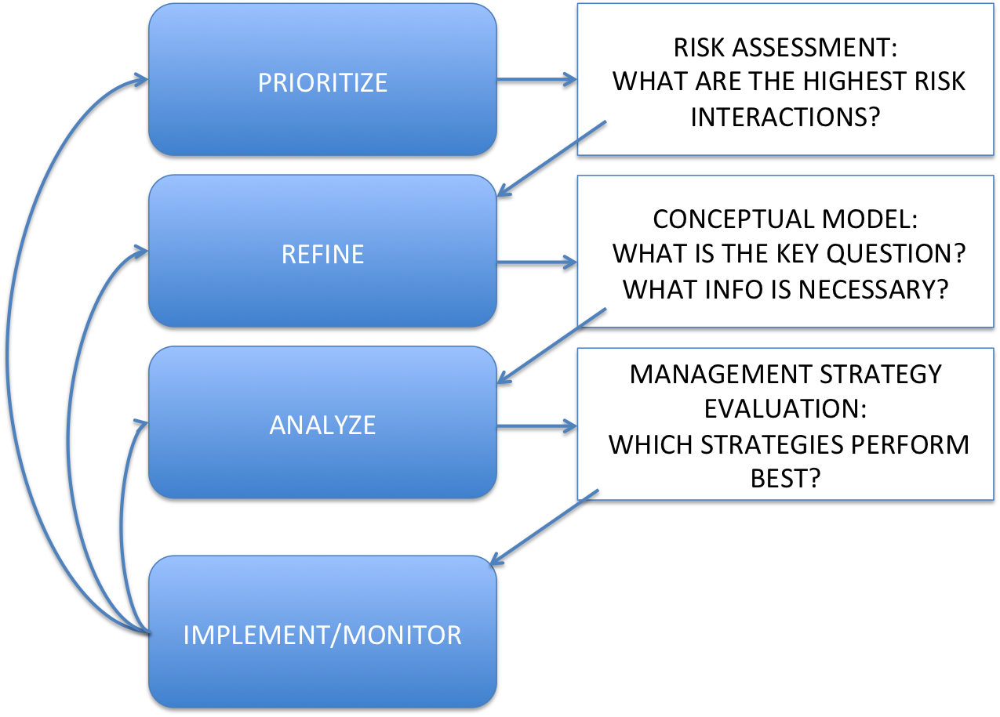
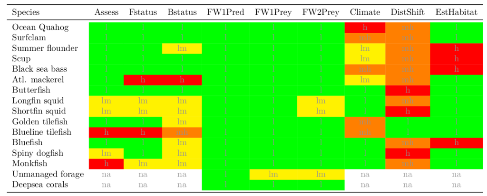
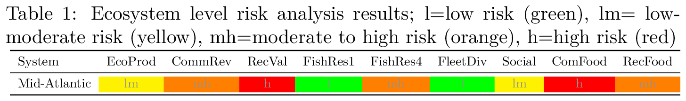
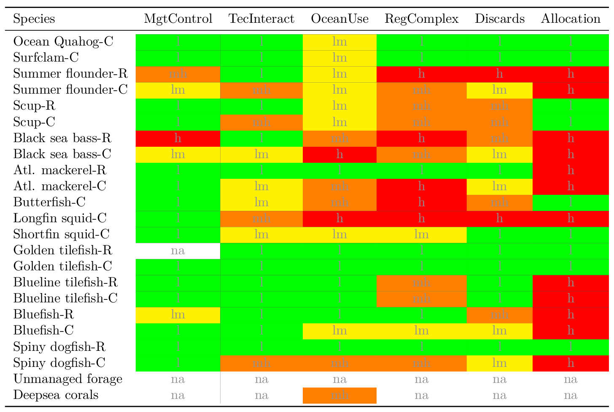

class: top, left

```{r setup, include=FALSE}

options(htmltools.dir.version = FALSE)
knitr::opts_chunk$set(echo = F,
                      warning = F,
                      message = F)
#Plotting and data libraries
library(ggplot2)
library(dplyr)
library(tidyr)
library(ecodata)
library(here)
library(kableExtra)
library(ggrepel)
library(stringr)
library(patchwork)
library(grid)
library(plotly)
library(vegan)
library(rpart)
library(colorRamps)
library(magick)

#GIS libraries
library(sf)
library(rgdal)
library(raster)
library(rnaturalearth)

data.dir <- here::here("data")


#Time series constants
shade.alpha <- 0.3
shade.fill <- "lightgrey"
lwd <- 1
pcex <- 2
trend.alpha <- 0.5
trend.size <- 2
hline.size <- 1
hline.alpha <- 0.35
hline.lty <- "dashed"
label.size <- 5
hjust.label <- 1.5
letter_size <- 4
feeding.guilds <- c("Apex Predator","Piscivore","Planktivore","Benthivore","Benthos")
x.shade.min <- 2009
x.shade.max <- 2018
map.lwd <- 0.4
#Function for custom ggplot facet labels
label <- function(variable,value){
  return(facet_names[value])
}

#facet names for titles
facet_names <- list("Apex predators" = expression("Apex predators"),
                    "Piscivores" = expression("Piscivores"),
                    "Planktivores" = expression("Planktivores"),
                    "Benthivores" = expression("Benthivores"),
                    "Benthos" = expression("Benthos"))
#CRS
crs <- "+proj=longlat +lat_1=35 +lat_2=45 +lat_0=40 +lon_0=-77 +x_0=0 +y_0=0 +datum=NAD83 +no_defs +ellps=GRS80 +towgs84=0,0,0"

#Coastline shapefile
coast <- ne_countries(scale = 10,
                          continent = "North America",
                          returnclass = "sf") %>%
             sf::st_transform(crs = crs)

#State polygons
ne_states <- ne_states(country = "united states of america",
                                      returnclass = "sf") %>%
  sf::st_transform(crs = crs)

#high-res polygon of Maine
#new_england <- read_sf(gis.dir,"new_england")

#EPU shapefile
epu_sf <- ecodata::epu_sf %>% 
  filter(EPU %in% c("MAB","GB","GOM"))
```

## Mid-Atlantic Council Ecosystem Approach

* MAFMC EAFM framework<sup>1,2</sup>
```{r framework, echo = F, out.width = "60%", fig.align = "center"}

```

* 2017 Inital EAFM risk assessment completed; revised and published 2018<sup>3</sup>

* SOE indicators to be used for annual risk assessment updates

  * 2019: reporting only changed risks. *Is this what the Council prefers?*


.footnote[
[1] http://www.mafmc.org/s/EAFM-Doc-Revised-2019-02-08.pdf

[2] https://www.frontiersin.org/articles/10.3389/fmars.2016.00105/full

[3] https://www.frontiersin.org/articles/10.3389/fmars.2018.00442/full
]

???

---
## Decreased risk: summer flounder meeting F objective

  * Summer flounder status improved in recent benchmark
  * Atlantic mackerel stock above F/Fmsy and below 0.5 B/Bmsy (2018 update)

```{r stock-status, fig.width = 8, fig.asp = 0.75, fig.align="center"}

#Get data, spread for plotting, and filter
stock_status <- ecodata::stock_status %>%
  spread(.,Var,Value) %>% 
  filter(Council %in% c("MAFMC","Both"))

#Plot constants
y.max <- 2.0 #1.75 mackerel cut off F/Fmsy is 1.8
x.max <- 2.6

#A dataframe that defines custom legend for stocks with unknown status

unknown <- data.frame(text = c("Unknown Status", "Longfin",
                              "Illex", "N. Goosefish", "S. Goosefish"),
                    x = rep(0.9*x.max,5),
                    y = seq(0.93*y.max,1.4,-.1))


#Plotting code
ggplot(data = stock_status) +
  geom_vline(xintercept = 1, linetype = "dotted")+
  geom_vline(xintercept = 0.5, linetype = "dashed")+
  geom_hline(yintercept = 1, linetype = "dashed") +
  geom_point(aes(x = B.Bmsy,
                 y = F.Fmsy,
                 color = Council)) +
  geom_text_repel(aes(x = B.Bmsy, #geom_text_repel auto-jitters text around points
                      y = F.Fmsy,
                      label = Code,
                      color = Council), show.legend = FALSE,nudge_y = 0.05, nudge_x = 0.05) +
  scale_color_manual(values = c("purple","blue"), #Change legend labels for clarity
                     name = "Managed by",
                     breaks = c("Both","MAFMC"),
                     labels = c("MAFMC/NEFMC","MAFMC"))+
  ylim(0,y.max) +
  xlim(0,x.max) +
  geom_text(data = unknown, aes(x = x, y = y, label = text), #Custom legend for unknown stock status
            size = c(4.75,rep(4,4)),
            color = c("black",rep("blue",2), rep("purple",2))) +
  xlab(expression(~B/B[msy])) +
  ylab(expression(~F/F[msy])) +
  ggtitle("Mid-Atlantic Stock Status") +
  theme_ts()
```

???
Plot shows the ratio of stock mortality (F) to stock mortality at maximum sustainable yield, where a number larger than one indicates the stock is experiencing unsustainable fishing pressure. On the x axis we have the ratio of estimated stock biomass to biomass at maximum sustainable yield. 

---
## Decreased risk: no trend in commercial fleet diversity

  * Past trend was a long term decrease, indicating moderate-high risk according to Council criteria
  * Trends are no longer significant with updated data, indicating low risk

```{r comm-div, fig.width = 8, fig.asp = 0.75, fig.align="center"}

#Get data, spread for plotting, and filter
comm_div <- ecodata::commercial_div %>% 
  filter(EPU == "MA") %>% 
  group_by(Var) %>% 
  mutate(hline = mean(Value))

ylim_fc <- c(min(comm_div[comm_div$Var == "Fleet count",]$Value) - 10, max(comm_div[comm_div$Var == "Fleet count",]$Value) + 10 )
ylim_fd <- c(0, max(comm_div[comm_div$Var == "Fleet diversity in revenue",]$Value) + 3 )
# 
# #Create dataframe for label locations
# label_loc <- data.frame(xloc = min(comm_div$Time)+0.25,
#                         yloc = c(ylim_fc[2]*0.95, ylim_fd[2]*0.95),
#                         labels = LETTERS[1:2],
#                         Var = c("Fleet count","Fleet diversity in revenue"))
# 
 series.col = c("black")


fleet_count <- comm_div %>% 
  filter(Var == "Fleet count") %>% 
  ggplot() + 
 #Highlight last ten years
  annotate("rect", fill = shade.fill, alpha = shade.alpha,
      xmin = x.shade.min , xmax = x.shade.max,
      ymin = -Inf, ymax = Inf) +
  #label
  # annotate("text", x = label_loc[label_loc$Var == "Fleet count",]$xloc,
  #          y = label_loc[label_loc$Var == "Fleet count",]$yloc,
  #          label = label_loc[label_loc$Var == "Fleet count",]$label,
  #          size = letter_size) +

  geom_line(aes(x = Time, y = Value, color = Var), size = lwd) +
  geom_point(aes(x = Time, y = Value, color = Var), size = pcex) +
  ylim(ylim_fc)+
scale_color_manual(values = series.col, aesthetics = "color")+
  scale_x_continuous(expand = c(0.01, 0.01)) +
  guides(color = FALSE) +
  ggtitle("Fleet count") +
  ylab(expression("Count (n)")) +
  xlab("")+
  geom_hline(aes(yintercept = hline,
               color = Var),
           size = hline.size,
           alpha = hline.alpha,
           linetype = hline.lty) +
  theme_ts()

fleet_div <- comm_div %>% 
  filter(Var == "Fleet diversity in revenue") %>% 
  ggplot() + 
 #Highlight last ten years
  annotate("rect", fill = shade.fill, alpha = shade.alpha,
      xmin = x.shade.min , xmax = x.shade.max,
      ymin = -Inf, ymax = Inf) +
    #label
  # annotate("text", x = label_loc[label_loc$Var == "Fleet diversity in revenue",]$xloc,
  #          y = label_loc[label_loc$Var == "Fleet diversity in revenue",]$yloc,
  #          label = label_loc[label_loc$Var == "Fleet diversity in revenue",]$label,
  #          size = letter_size) +

  geom_line(aes(x = Time, y = Value, color = Var), size = lwd) +
  geom_point(aes(x = Time, y = Value, color = Var), size = pcex) +
  ylim(ylim_fd)+
  
  scale_x_continuous(expand = c(0.01, 0.01)) +
  scale_color_manual(values = series.col, aesthetics = "color")+
  guides(color = FALSE) +
  ggtitle("Fleet diversity") +
  ylab(expression("Effective Shannon")) +
  xlab("Time") +

  geom_hline(aes(yintercept = hline,
               color = Var),
           size = hline.size,
           alpha = hline.alpha,
           linetype = hline.lty) +
 theme_ts()

cowplot::plot_grid(fleet_count, fleet_div, ncol = 1, align = "hv") + 
  theme(plot.margin = unit(c(0.1, 0, 0, 0), "cm"))

```

???


---
## Increased risk: Nothing, but...

* No risk elements moved to higher risk categories for updated indicators

* Several analyses could not be completed or updated in 2019

  * Most management elements were not re-evaluated for 2019 
  
  * Quantitative evaluation of the risks posed by other ocean uses was delayed due to the government shutdown
  
  * Poorer condition of north Atlantic right whales relative to the 2018 report along with the continued increase in ocean temperature indicate that both protected species interactions and climate conditions continue to pose risks to Council-managed fisheries. 

---
## Re-evaluate and consider new indicators? Recreational fishing

.pull-left[
Mid-Atlantic: 
* Overall decline in rec seafood harvest since 1980s
  * Trending upwards since mid-90s

* Increase in recreational effort (n anglers) since the mid 90s

* Decreasing diversity indicators
  * Fleet effort diversity driven by fewer party boats (24% of all trips down to 6%)
  * Species diversity does not break out the SAFMC-managed species--should it?

]
.pull-right[
```{r rec-div2, fig.height=9}
source("R/rec_div_plots.R")
source("R/rec_harvest_plots.R")
source("R/rec_effort_plots.R")
ma_rec_div <- rec_div_plots("MA")
ma_rec_harvest <- rec_harvest_plots("MA")
ma_rec_effort <- rec_effort_plots("MA")
(ma_rec_harvest | ma_rec_effort[[2]]) /
  ma_rec_div[[1]] /
  ma_rec_div[[2]]
```
]

???
Similar to NE, there's been a slight increase in recreational catch since the 90s in the Mid-Atlantic, along with a general increase in effort.

However, different from NE, there are significant downward trends in fleet effort diversity and diversity of catch. While a decline in fleet effort diversity is due to fewer party boats, we can't be sure why there's been a decline in diversity of catch, as South Atlantic FMC species are not tracked seperately.

---
## Consider new indicators? Estuarine habitat

Evidence suggests that management limiting nutrient inputs has significantly improved water quality in Chesapeake Bay

**Chesapeake Bay Water Quality**

```{r cb-water-qual, fig.height = 3.5, fig.align = "center"}
minlab <- seq(1985,2015,5)
maxlab <- seq(1987,2017,5)

ecodata::ches_bay_wq %>% 
  mutate(hline = mean(Value)) %>% 
  ggplot(aes(x = Time, y = Value)) +
       annotate("rect", fill = shade.fill, alpha = shade.alpha,
      xmin = x.shade.min , xmax = x.shade.max,
      ymin = -Inf, ymax = Inf) +
  geom_line() +
  geom_point() +
  geom_gls() +
    ylab(expression("Estimated attainment, percent")) +
  ggtitle("Chesapeake Bay Estimated Water Quality Standards Attainment") +
  scale_x_continuous(breaks = minlab,labels = paste0(minlab,"-",maxlab),expand = c(0.01, 0.01)) +
    geom_hline(aes(yintercept = hline),
           size = hline.size,
           alpha = hline.alpha,
           linetype = hline.lty) +
  theme_ts() +
  theme(axis.title = element_text(size = 14))
```


???
First indicator I'd like to talk about is a new water quality for Chesapeake Bay, which many resource species use as nursery habitat or are dependent upon (e.g. bluefish, striped bass, menhaden, black sea bass)

These data, which were provided by collaborators at the Chesapeake Bay Program, represent the percent of tidal waters in Chesapeake Bay meeting water quality standards for chlorophyll a, submerged aquatic vegetation, and dissolved oxygen. The increase in water quality for the Bay has been tied to management action limiting nutrient influx into the watershed, and improvments in dissolved oxygen and water clarity. 

---
## EAFM Risk Assessment update summary (I)

### Decreased Risk
* Summer flounder fishing mortality (F) status has improved from high risk (F>Fmsy) to low risk (F<Fmsy) based on the new benchmark assessment

* Updated commercial fleet diversity (fleet count and fleet diversity) have no long term trends, thus improving from moderate-high risk to low risk according to risk criteria for this element

### Increased Risk
* No indicators for individual elements have changed enough to warrant increased risk rankings according to the Council risk critiera

* But see caveats regarding analyses that were not updated

---
## EAFM Risk Assessment update summary (II)

### Re-evaluate Risk
* Indicators for recreational opportunities based on updated Marine Recreational Information Program (MRIP) data show generally similar patterns of decreased angler days and trips over the past 10 years, but the declines are less pronounced than measured previously. A reduction from the highest risk ranking to a lower risk category may be warranted. 

### New Risk Indicators
* Council-requested recreational diversity indicators (fleet and species): what criteria to apply?

* Chesapeake Bay water quality could be added to estuarine habitat element: how to integrate with EPA reporting?

---
## EAFM Risk Assessment: Updated Risk Rankings

*Species level risk elements*
```{r sptable, fig.align="center",out.width="95%"}

```


*Ecosystem level risk elements*
```{r ecotable, fig.align="center",out.width="95%"}

```

---
## EAFM Risk Assessment: Risk Rankings without updates

*Species and Sector level risk elements*
```{r mgttable, fig.align="center",out.width="95%"}

```


---
## External Resources

* [SOE Technical Documentation](https://noaa-edab.github.io/tech-doc)

* [ecodata R package](https://github.com/noaa-edab/ecodata)

  * [Macrofauna indicators](http://noaa-edab.github.io/ecodata/macrofauna)
  * [Human Dimensions indicators](http://noaa-edab.github.io/ecodata/human_dimensions)
  * [Lower trophic level indicators](http://noaa-edab.github.io/ecodata/LTL)
  
* [ERDDAP server](https://comet.nefsc.noaa.gov/erddap/index.html)

* Slides available at https://noaa-edab.github.io/presentations

