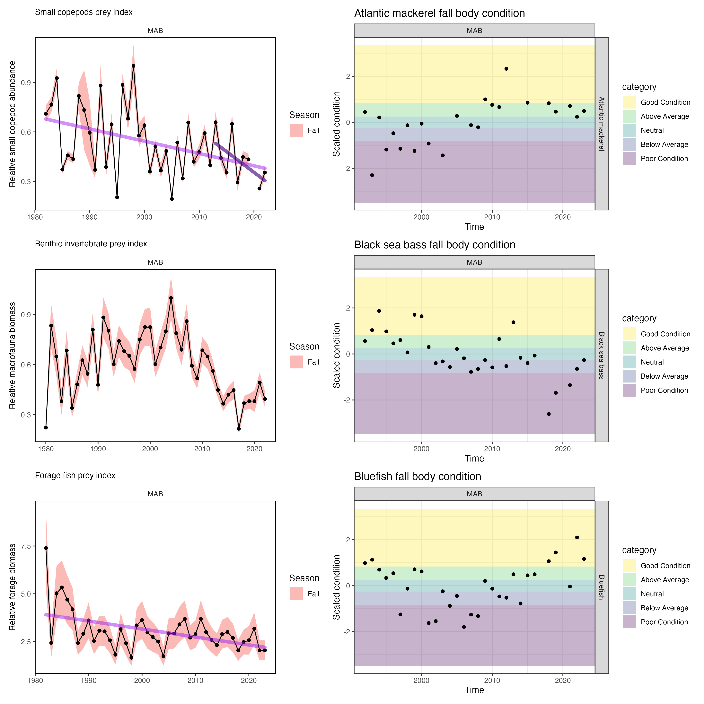

class: top, left

<style>
p.caption {
  font-size: 0.6em;
}
</style>

<style>
.reduced_opacity {
  opacity: 0.5;
}
</style>

```{r setup, include=FALSE}

options(htmltools.dir.version = FALSE)
knitr::opts_chunk$set(echo = F,
                      fig.retina = 3,
                      #fig.width = 4,
                      #fig.height = 2,
                      fig.asp = 0.45,
                      warning = F,
                      message = F)
#Plotting and data libraries
library(tidyverse)
library(tidyr)
library(here)
library(kableExtra)
library(ecodata)
library(readxl); library(data.table)
library(DT)
library(widgetframe)
library(patchwork)

# if figure output defaults to docs/imaages/ replace with this before moving to 
# presentations/docs in both the html output (search and replace)
# and folder name
# 20220316_MAFMCSSC_Gaichas_files/figure-html/

```

```{r, load_refs, include=FALSE, cache=FALSE}
library(RefManageR)
BibOptions(check.entries = FALSE,
           bib.style = "authoryear",
           cite.style = "authoryear",
           longnamesfirst = FALSE,
           max.names = 1,
           style = "markdown")
myBib <- ReadBib("./MidSOE.bib", check = FALSE)

#,
#           hyperlink = FALSE,
#           dashed = FALSE

```

## Risk Element Example - Commercial revenue

This element is applied at the ecosystem level. Revenue serves as a proxy for commercial profits.

.pull-left[

```{r riskcomrev, echo=FALSE, message=FALSE, warnings=FALSE, results='asis'}
# tabl <- "
# | Risk Level         | Definition                                                          |  
# |:-------------------|:--------------------------------------------------------------------|
# | Low  | No trend and low variability in revenue |
# | Low-Moderate | Increasing or high variability in revenue |
# | Moderate-High | Significant long term revenue decrease |
# | High | Significant recent decrease in revenue |
# "
# cat(tabl) # output the table in a format good for HTML/PDF/docx conversion

tabl <- data.frame("Risk Level" = c("Low", "Low-Moderate", "Moderate-High", "High"),
                   "Definition" = c("No trend and low variability in revenue",
                                    "Increasing or high variability in revenue",
                                    "Significant long term revenue decrease",
                                    "Significant recent decrease in revenue"))

knitr::kable(tabl, format="html",
             col.names = c("Risk Level", "Definition"),
                           booktabs = T) %>%
  #kable_styling(full_width = TRUE) %>%
  column_spec(1, width = "10em")|>
  column_spec(2, width = "30em")%>%
  row_spec(3, bold = T, background = "orange")
```

Ranked moderate-high risk due to the significant long term revenue decrease

]
.pull-right[
```{r, fig.asp = 0.7, results='hide'}
#comm-revenue, fig.width = 4, fig.asp = 0.45, fig.cap = "Total revenue for the region (black) and revenue from MAFMC managed species (red)."
ecodata::plot_comdat(report="MidAtlantic", varName="revenue") + 
  ggplot2::theme(legend.position = "bottom",
                      legend.title = ggplot2::element_blank())
```

]

## Risk element: <span style="background-color:orange;">CommRev</span> 

---
class: center, center

# Ecological Risk Elements


---
class: top, left
## Stock Assessment Performance

This risk element is applied at the species
level, and addresses risk to achieving OY due to scientific uncertainty
based on analytical and data limitations.

.pull-left-70[
.table[
```{r, results='asis'}
  # -----------------------------------------------------------------------
  # *Risk Level*    *Definition*
  # --------------- -------------------------------------------------------
  # Low             Assessment model(s) passed peer review, high data
  #                 quality, small retrospective pattern
  # 
  # Low-Moderate    Assessment passed peer review but some data and/or
  #                 reference points may be lacking
  # 
  # Moderate-High   Assessment passed peer review but with major data
  #                 quality issue or large retrospective pattern
  # 
  # High            Assessment failed peer review or no assessment,
  #                 data-limited tools applied
  # -----------------------------------------------------------------------
tabl <- data.frame("Risk Level" = c("Low", "Low-Moderate", "Moderate-High", "High"),
                   "Definition" = c("Assessment model(s) passed peer review, high data quality, small retrospective pattern",
                                    "Assessment passed peer review but some data and/or reference points may be lacking",
                                    "Assessment passed peer review but with major data quality issue or large retrospective pattern",
                                    "Assessment failed peer review or no assessment, data-limited tools applied"))
knitr::kable(tabl, format="html",
             col.names = c("Risk Level", "Definition"),
                           booktabs = T) %>%
  #kable_styling(full_width = TRUE) %>%
  column_spec(1, width = "10em")|>
  column_spec(2, width = "30em")
```
]
]

.pull-right-30[
```{r}
risk.species<-data.frame(
  Species = c("Ocean Quahog", "Surfclam", "Summer flounder", "Scup", "Black sea bass", "Atl. mackerel", "Chub mackerel", "Butterfish", "Longfin squid", "Shortfin squid", "Golden tilefish", "Blueline tilefish", "Bluefish", "Spiny dogfish", "Monkfish", "Unmanaged forage", "Deepsea corals"),
  Assess  = c("l", "l", "l",  "l", "l", "l", "h", "l", "lm", "h", "l", "h", "l", "l", "h", "na", "na")#,
  # Fstatus = c("l", "l", "h", "l", "l", "l", "lm", "l", "lm", "lm", "l", "h", "l", "h", "lm", "na", "na"),
  # Bstatus = c("l", "l", "lm", "l", "l", "h", "lm", "lm", "lm", "lm", "lm", "mh", "lm", "l", "lm", "na", "na"),
  # #FW1Pred = c("l", "l", "l", "l", "l", "l", "l", "l", "l", "l", "l", "l", "l", "l", "l", "l", "l"),
  # #FW1Prey = c("l", "l", "l", "l", "l", "l", "l", "l", "l", "l", "l", "l", "l", "l", "l", "lm", "l"),
  # PreyA = c("tbd", "tbd", "tbd", "tbd", "tbd", "tbd", "tbd", "tbd", "tbd", "tbd", "tbd", "tbd", "tbd", "tbd", "tbd", "tbd", "tbd"),
  # PredP = c("tbd", "tbd", "tbd", "tbd", "tbd", "tbd", "tbd", "tbd", "tbd", "tbd", "tbd", "tbd", "tbd", "tbd", "tbd", "tbd", "tbd"),
  # FW2Prey = c("l", "l", "l", "l", "l", "l", "l", "l", "lm", "lm", "l", "l", "l", "l", "l", "lm", "l"),
  # Climate = c("h", "mh", "lm", "lm", "mh", "lm", "na", "l", "l", "l", "mh", "mh","l", "l", "l", "na", "na"),
  # DistShift = c("mh", "mh", "mh", "mh", "mh", "mh", "na", "h", "mh", "h", "l", "l", "mh", "h", "mh", "na", "na"),
  # EstHabitat = c("l", "l", "h", "h", "h", "l", "l", "l", "l", "l", "l", "l", "h", "l", "l", "na", "na"),
  # OffHab = c("tbd", "tbd", "tbd", "tbd", "tbd", "tbd", "tbd", "tbd", "tbd", "tbd", "tbd", "tbd", "tbd", "tbd", "tbd", "tbd", "tbd")#,
)


# these elements were removed by the council
#  PopDiv = c("na", "na", "na", "na", "na", "na", "na", "na", "na", "na", "na", "na", "na", "na"),
#  FoodSafe = c(),

# one column test
# risk.species %>%
#   mutate(Fstatus = 
#     cell_spec(Fstatus, format="latex", color = "black", align = "c", background =factor(Fstatus, c("na", "l", "lm", "mh", "h"),c("white", "green", "yellow", "orange", "red")))) %>%
#   kable(risk.species, format="latex", escape = F, booktabs = T, linesep = "")

#convert to longer text for consistency and display in html table
risk.species <- risk.species %>%
     mutate_at(vars(-Species), function(x){
       recode(x,'tbd' = "tbd", 'l'="lowest",'lm'="lowmod",'mh'="modhigh",'h'="highest")}) %>%
     as.data.frame()

#generalize to all
risk.species %>%
  mutate_at(vars(-Species), function(x){ 
    cell_spec(x, format="html", 
              color = factor(x, c("tbd", "na", "lowest", "lowmod", "modhigh", "highest"),c("grey","black", "black", "black", "black", "white")), align = "c", 
              background =factor(x, c("tbd","na", "lowest", "lowmod", "modhigh", "highest"),c("grey","white", "lightgreen", "yellow", "orange", "red")), 
              background_as_tile=F)}) %>%
  kable(format = "html", escape = F, table.attr='class="risktable"') %>%
  kable_styling(font_size = 14) 
#   flextable::flextable()
# 
# # Define colors and ranges
# bg_picker <- scales::col_bin(
#     palette = c("white", "light blue"),
#     domain = c(0, 100), # min and max range can be also set dynamically 
#     bins = c(0, 10, 20)) # as well as the bins
# 
# 
# ftab <- regulartable(SalesData) %>% 
#     bg(j = columns, bg = bg_picker)

```

]
---
.pull-left[
## Fishing Mortality and Stock Biomass Status

These elements are applied at the species level. They indicate the level of risk to achieving OY from either overfishing or stock depletion, respectively.

Indicator: Stock status

```{r ,  fig.asp=0.8}
#code = readLines("https://raw.githubusercontent.com/NOAA-EDAB/ecodata/master/chunk-scripts/human_dimensions_MAB.Rmd-stock-status.R"),
#, fig.width = 7.5, fig.asp = 0.5
#stock-status, fig.cap = paste0("Summary of single species status for ",council_abbr," and jointly federally managed stocks (Goosefish and Spiny dogfish). Stocks in green are below the biomass threshold (overfished), stocks in orange are above the biomass threshold but below the biomass target, and stocks in purple are above the biomass target. Only one stock, Atlantic mackerel, has fishing mortality above the limit (subject to overfishing).")

a <- ecodata::plot_stock_status(report = "MidAtlantic")

a$p + ggplot2::coord_cartesian(xlim=c(0,2), ylim=c(0,2)) +
  ggplot2::annotation_custom(gridExtra::tableGrob(a$unknown,
                             theme = gridExtra::ttheme_default(base_size = 7), 
                             rows=NULL), 
                             xmin=0.8, xmax=1.8, ymin=1.5, ymax=2)

```

]

.pull-right[
.table[
```{r}
tabl <- data.frame("Risk Level" = c("Low", "Low-Moderate", "Moderate-High", "High"),
                   "Definition" = c("F < Fmsy; B > Bmsy",
                                    "Unknown, but weight of evidence indicates low overfishing risk; Bmsy > B > 0.5 Bmsy or weight of evidence indicates low risk",
                                    "Unknown status",
                                    "F > Fmsy; B < 0.5 Bmsy"))
knitr::kable(tabl, format="html",
             col.names = c("Risk Level", "Definitions"),
                           booktabs = T) %>%
  #kable_styling(full_width = TRUE) %>%
  column_spec(1, width = "10em")|>
  column_spec(2, width = "30em")
```
]
<br>
```{r}
risk.species<-data.frame(
  Species = c("Ocean Quahog", "Surfclam", "Summer flounder", "Scup", "Black sea bass", "Atl. mackerel", "Chub mackerel", "Butterfish", "Longfin squid", "Shortfin squid", "Golden tilefish", "Blueline tilefish", "Bluefish", "Spiny dogfish", "Monkfish", "Unmanaged forage", "Deepsea corals"),
  # Assess  = c("l", "l", "l",  "l", "l", "l", "h", "l", "lm", "h", "l", "h", "l", "l", "h", "na", "na"),
  Fstatus = c("l", "l", "h", "l", "l", "l", "lm", "l", "lm", "lm", "l", "h", "l", "h", "lm", "na", "na"),
  Bstatus = c("l", "l", "lm", "l", "l", "h", "lm", "lm", "lm", "lm", "lm", "mh", "lm", "l", "lm", "na", "na")#,
  # #FW1Pred = c("l", "l", "l", "l", "l", "l", "l", "l", "l", "l", "l", "l", "l", "l", "l", "l", "l"),
  # #FW1Prey = c("l", "l", "l", "l", "l", "l", "l", "l", "l", "l", "l", "l", "l", "l", "l", "lm", "l"),
  # PreyA = c("tbd", "tbd", "tbd", "tbd", "tbd", "tbd", "tbd", "tbd", "tbd", "tbd", "tbd", "tbd", "tbd", "tbd", "tbd", "tbd", "tbd"),
  # PredP = c("tbd", "tbd", "tbd", "tbd", "tbd", "tbd", "tbd", "tbd", "tbd", "tbd", "tbd", "tbd", "tbd", "tbd", "tbd", "tbd", "tbd"),
  # FW2Prey = c("l", "l", "l", "l", "l", "l", "l", "l", "lm", "lm", "l", "l", "l", "l", "l", "lm", "l"),
  # Climate = c("h", "mh", "lm", "lm", "mh", "lm", "na", "l", "l", "l", "mh", "mh","l", "l", "l", "na", "na"),
  # DistShift = c("mh", "mh", "mh", "mh", "mh", "mh", "na", "h", "mh", "h", "l", "l", "mh", "h", "mh", "na", "na"),
  # EstHabitat = c("l", "l", "h", "h", "h", "l", "l", "l", "l", "l", "l", "l", "h", "l", "l", "na", "na"),
  # OffHab = c("tbd", "tbd", "tbd", "tbd", "tbd", "tbd", "tbd", "tbd", "tbd", "tbd", "tbd", "tbd", "tbd", "tbd", "tbd", "tbd", "tbd")#,
)


# these elements were removed by the council
#  PopDiv = c("na", "na", "na", "na", "na", "na", "na", "na", "na", "na", "na", "na", "na", "na"),
#  FoodSafe = c(),

# one column test
# risk.species %>%
#   mutate(Fstatus = 
#     cell_spec(Fstatus, format="latex", color = "black", align = "c", background =factor(Fstatus, c("na", "l", "lm", "mh", "h"),c("white", "green", "yellow", "orange", "red")))) %>%
#   kable(risk.species, format="latex", escape = F, booktabs = T, linesep = "")

#convert to longer text for consistency and display in html table
risk.species <- risk.species %>%
     mutate_at(vars(-Species), function(x){
       recode(x,'tbd' = "tbd", 'l'="lowest",'lm'="lowmod",'mh'="modhigh",'h'="highest")}) %>%
     as.data.frame()

#generalize to all
risk.species %>%
  mutate_at(vars(-Species), function(x){ 
    cell_spec(x, format="html", 
              color = factor(x, c("tbd", "na", "lowest", "lowmod", "modhigh", "highest"),c("grey","black", "black", "black", "black", "white")), align = "c", 
              background =factor(x, c("tbd","na", "lowest", "lowmod", "modhigh", "highest"),c("grey","white", "lightgreen", "yellow", "orange", "red")), 
              background_as_tile=F)}) %>%
  kable(format = "html", escape = F, table.attr='class="risktable"') %>%
  kable_styling(font_size = 14) 
#   flextable::flextable()
# 
# # Define colors and ranges
# bg_picker <- scales::col_bin(
#     palette = c("white", "light blue"),
#     domain = c(0, 100), # min and max range can be also set dynamically 
#     bins = c(0, 10, 20)) # as well as the bins
# 
# 
# ftab <- regulartable(SalesData) %>% 
#     bg(j = columns, bg = bg_picker)

```

]

---
## Food Web (1) - Prey Availability

.pull-left[
Fish stocks and protected species stocks are managed using single species approaches, but fish and protected species stocks exist within a food web of predator and prey interactions. This element is one of two separating food web risks to achieving OY for Council managed species from two sources. This first element assesses prey availability for each species, and the second food web risk element assesses predation pressure on each species (see Food Web (2)- Predation Pressure).

Risks from all prey (1) and all predators (2) are considered.

Indicators of prey availability combine aggregate prey abundance and species body condition (relative weight at length).
]

.pull-right[
*Indicators*
```{r, fig.asp=.4} 
fallsmcope <- readRDS(url("https://github.com/NOAA-EDAB/foodweb-risk/raw/main/preyindices/fallsmcopepodALLindex.rds"))

fixsmcope<- fallsmcope |>
      dplyr::filter(Var %in% c("Fall Small copepods ALL Abundance Index Estimate"),
                    EPU %in% c("MAB")) |>
      dplyr::group_by(EPU) |>
      dplyr::summarise(max = max(Value, na.rm=T))

    pfallsmcope <- fallsmcope |>
      dplyr::filter(Var %in% c("Fall Small copepods ALL Abundance Index Estimate",
                               "Fall Small copepods ALL Abundance Index Estimate SE"),
                    EPU %in% c("MAB")) |>
      dplyr::mutate(Value = ifelse(Value == 0, NA, Value)) |>
      dplyr::group_by(EPU) |>
      tidyr::separate(Var, into = c("Season", "A", "B", "C", "D", "E", "F", "Var")) |>
      dplyr::mutate(Var = tidyr::replace_na(Var, "Mean")) |> #,
      #max = as.numeric(Value)) |>
      tidyr::pivot_wider(names_from = Var, values_from = Value) |>
      dplyr::left_join(fixsmcope) |>
      dplyr::mutate(#Value = Value/resca,
        Mean = as.numeric(Mean),
        #max = as.numeric(Value),
        Mean = Mean/max,
        SE = SE/max,
        Upper = Mean + SE,
        Lower = Mean - SE) |>
      ggplot2::ggplot(ggplot2::aes(x = Time, y = Mean, group = Season))+
      #ggplot2::annotate("rect", fill = setup$shade.fill, alpha = setup$shade.alpha,
      #                  xmin = setup$x.shade.min , xmax = setup$x.shade.max,
      #                  ymin = -Inf, ymax = Inf) +
      ggplot2::geom_ribbon(ggplot2::aes(ymin = Lower, ymax = Upper, fill = Season), alpha = 0.5)+
      ggplot2::geom_point()+
      ggplot2::geom_line()+
      ggplot2::ggtitle("Small copepods prey index")+
      ggplot2::ylab(expression("Relative small copepod abundance"))+
      ggplot2::xlab(ggplot2::element_blank())+
      ggplot2::facet_wrap(.~EPU)+
      ecodata::geom_gls()+
      ecodata::geom_lm(n=10) +
      ecodata::theme_ts()+
      ecodata::theme_facet()+
      ecodata::theme_title()
    
  #p 


fallmacro <- readRDS(url("https://github.com/NOAA-EDAB/foodweb-risk/raw/main/preyindices/fallmacrobenthosindex.rds"))

fixmacro<- fallmacro |>
      dplyr::filter(Var %in% c("Fall Macrobenthos Biomass Index Estimate"),
                    EPU %in% c("MAB")) |>
      dplyr::group_by(EPU) |>
      dplyr::summarise(max = max(Value))

    pfallmac <- fallmacro |>
      dplyr::filter(Var %in% c("Fall Macrobenthos Biomass Index Estimate",
                               "Fall Macrobenthos Biomass Index Estimate SE"),
                    EPU %in% c("MAB")) |>
      dplyr::group_by(EPU) |>
      tidyr::separate(Var, into = c("Season", "A", "B", "C", "D", "Var")) |>
      dplyr::mutate(Var = tidyr::replace_na(Var, "Mean")) |> #,
      #max = as.numeric(Value)) |>
      tidyr::pivot_wider(names_from = Var, values_from = Value) |>
      dplyr::left_join(fixmacro) |>
      dplyr::mutate(#Value = Value/resca,
        Mean = as.numeric(Mean),
        #max = as.numeric(Value),
        Mean = Mean/max,
        SE = SE/max,
        Upper = Mean + SE,
        Lower = Mean - SE) |>
      ggplot2::ggplot(ggplot2::aes(x = Time, y = Mean, group = Season))+
      #ggplot2::annotate("rect", fill = setup$shade.fill, alpha = setup$shade.alpha,
      #                  xmin = setup$x.shade.min , xmax = setup$x.shade.max,
      #                  ymin = -Inf, ymax = Inf) +
      ggplot2::geom_ribbon(ggplot2::aes(ymin = Lower, ymax = Upper, fill = Season), alpha = 0.5)+
      ggplot2::geom_point()+
      ggplot2::geom_line()+
      ggplot2::ggtitle("Benthic invertebrate prey index")+
      ggplot2::ylab(expression("Relative macrofauna biomass"))+
      ggplot2::xlab(ggplot2::element_blank())+
      ggplot2::facet_wrap(.~EPU)+
      ecodata::geom_gls()+
      ecodata::geom_lm(n=10) +
      ecodata::theme_ts()+
      ecodata::theme_facet()+
      ecodata::theme_title()
    
  #p 
  


pforage  <-  ecodata::forage_index |>
      dplyr::filter(Var %in% c("Fall Forage Fish Biomass Estimate",
                               "Fall Forage Fish Biomass Estimate SE"),
                    EPU %in% c("MAB")) |>
      dplyr::group_by(EPU) |>
      tidyr::separate(Var, into = c("Season", "A", "B", "C", "D", "Var")) |>
      dplyr::mutate(Var = tidyr::replace_na(Var, "Mean")) |> #,
      #max = as.numeric(Value)) |>
      tidyr::pivot_wider(names_from = Var, values_from = Value) |>
      dplyr::left_join(fixmacro) |>
      dplyr::mutate(#Value = Value/resca,
        Mean = as.numeric(Mean),
        #max = as.numeric(Value),
        Mean = Mean/max,
        SE = SE/max,
        Upper = Mean + SE,
        Lower = Mean - SE) |>
      ggplot2::ggplot(ggplot2::aes(x = Time, y = Mean, group = Season))+
      #ggplot2::annotate("rect", fill = setup$shade.fill, alpha = setup$shade.alpha,
      #                  xmin = setup$x.shade.min , xmax = setup$x.shade.max,
      #                  ymin = -Inf, ymax = Inf) +
      ggplot2::geom_ribbon(ggplot2::aes(ymin = Lower, ymax = Upper, fill = Season), alpha = 0.5)+
      ggplot2::geom_point()+
      ggplot2::geom_line()+
      ggplot2::ggtitle("Forage fish prey index")+
      ggplot2::ylab(expression("Relative forage biomass"))+
      ggplot2::xlab(ggplot2::element_blank())+
      ggplot2::facet_wrap(.~EPU)+
      ecodata::geom_gls()+
      ecodata::geom_lm(n=10) +
      ecodata::theme_ts()+
      ecodata::theme_facet()+
      ecodata::theme_title()

#p

mafmc_cond <- c("Atlantic mackerel",
           "Black sea bass",
           "Bluefish",
           "Butterfish",
           "Goosefish",
           "Illex", #not in condition
           "Loligo",  #not in condition
           "Scup",
           "Spiny dogfish",
           "Summer flounder",
           "Surf clam",  #not in condition
           "Ocean quahog")  #not in condition
           #"Clams", # Atlantic surfclam and ocean quahog not separate groups
           #"Tilefish") # Blueline and golden tilefish not separate groups

AnnualRelCond2023_Fall <- readr::read_csv("https://raw.githubusercontent.com/NOAA-EDAB/foodweb-risk/main/condition/AnnualRelCond2023_Fall.csv")


survEPUcond <- AnnualRelCond2023_Fall |>
  dplyr::select(Time = YEAR,
                Var = Species,
                EPU,
                Value = MeanCond,
                nCond) |>
  dplyr::group_by(EPU, Var) |>
  dplyr::mutate(scaleCond = scale(Value,scale =T,center=T)) 

xs <- quantile(survEPUcond$scaleCond, seq(0,1, length.out = 6), na.rm = TRUE)

survEPUcond <- survEPUcond |>
  dplyr::mutate(category = cut(scaleCond,
                                  breaks = xs,
                                  labels = c( "Poor Condition",
                                              "Below Average",
                                              "Neutral",
                                              "Above Average",
                                              "Good Condition"),
                                  include.lowest = TRUE))

condquants <- data.frame(ymin = xs[1:5],
                         ymax = xs[2:6],
                         category = sort(unique(survEPUcond$category))
)

vir <- viridis::viridis_pal()(5)

mafmcsurvEPUcond <- survEPUcond |>
  dplyr::filter(Var %in% mafmc_cond[1], #At mackerel
                EPU %in% c("MAB"))

pmackcond <-   ggplot2::ggplot() +
  ggplot2::theme_bw() +
  ggplot2::geom_rect(data = condquants,
                     aes(ymin = ymin, ymax = ymax, fill = category, xmin = -Inf, xmax = Inf),
                     alpha = .3) +
  ggplot2::scale_fill_manual(values=vir) +
  ggplot2::geom_point(data= mafmcsurvEPUcond, ggplot2::aes(x=Time, y=scaleCond[,1])) +
  #ggplot2::geom_hline(yintercept = xs[2:5]) +
  #ggplot2::geom_line() +
  ggplot2::facet_grid(Var~factor(EPU, levels = c("MAB", "GB", "GOM", "SS", "NA")), ) +
  ggplot2::ylab("Scaled condition") +
  ggplot2::ggtitle(paste(unique(mafmcsurvEPUcond$Var), "fall body condition")) +
  ggplot2::guides(fill = ggplot2::guide_legend(reverse = TRUE))


mafmcsurvEPUcond <- survEPUcond |>
  dplyr::filter(Var %in% mafmc_cond[2], #BSB
                EPU %in% c("MAB"))

pbsbcond <-   ggplot2::ggplot() +
  ggplot2::theme_bw() +
  ggplot2::geom_rect(data = condquants,
                     aes(ymin = ymin, ymax = ymax, fill = category, xmin = -Inf, xmax = Inf),
                     alpha = .3) +
  ggplot2::scale_fill_manual(values=vir) +
  ggplot2::geom_point(data= mafmcsurvEPUcond, ggplot2::aes(x=Time, y=scaleCond[,1])) +
  #ggplot2::geom_hline(yintercept = xs[2:5]) +
  #ggplot2::geom_line() +
  ggplot2::facet_grid(Var~factor(EPU, levels = c("MAB", "GB", "GOM", "SS", "NA")), ) +
  ggplot2::ylab("Scaled condition") +
  ggplot2::ggtitle(paste(unique(mafmcsurvEPUcond$Var), "fall body condition")) +
  ggplot2::guides(fill = ggplot2::guide_legend(reverse = TRUE))

#p

mafmcsurvEPUcond <- survEPUcond |>
  dplyr::filter(Var %in% mafmc_cond[3], #Bluefish
                EPU %in% c("MAB"))

pbfcond <-   ggplot2::ggplot() +
  ggplot2::theme_bw() +
  ggplot2::geom_rect(data = condquants,
                     aes(ymin = ymin, ymax = ymax, fill = category, xmin = -Inf, xmax = Inf),
                     alpha = .3) +
  ggplot2::scale_fill_manual(values=vir) +
  ggplot2::geom_point(data= mafmcsurvEPUcond, ggplot2::aes(x=Time, y=scaleCond[,1])) +
  #ggplot2::geom_hline(yintercept = xs[2:5]) +
  #ggplot2::geom_line() +
  ggplot2::facet_grid(Var~factor(EPU, levels = c("MAB", "GB", "GOM", "SS", "NA")), ) +
  ggplot2::ylab("Scaled condition") +
  ggplot2::ggtitle(paste(unique(mafmcsurvEPUcond$Var), "fall body condition")) +
  ggplot2::guides(fill = ggplot2::guide_legend(reverse = TRUE))

#p

fig4 <- pfallsmcope + pmackcond + pfallmac + pbsbcond + pforage + pbfcond + plot_layout(nrow = 3)

ggsave("preyavriskex.png", fig4, device="png", width = 12, height = 12, units = "in")



```
]

---
## Food Web (1) - Prey Availability

This element is applied at the species level. This element assesses prey availability risk for each species.


.pull-left-60[

.table[
```{r}
tabl <- data.frame("Risk Level" = c("Low", "Low-Moderate", "Moderate-High", "High"),
                   "Definition" = c("Fish condition good, no correlation with major prey trends",
                                    "Fish condition above average or neutral, aggregate prey for this species has stable or increasing trend",
                                    "Fish condition below average or neutral, aggregate prey for this species has significant decreasing trend",
                                    "Fish condition poor, species highly dependent on prey with  limited and declining availability, or prey and condition trends significantly correlated"))
knitr::kable(tabl, format="html",
             col.names = c("Risk Level", "Definition"),
                           booktabs = T) %>%
  #kable_styling(full_width = TRUE) %>%
  column_spec(1, width = "10em")|>
  column_spec(2, width = "30em")
```
]
]

.pull-right-40[
```{r preyA}
#tab.cap="Species level risk analysis results; l=low risk (green), lm= low-moderate risk (yellow), mh=moderate to high risk (orange), h=high risk (red)\\label{sptable}",

# spplist     oc,  sc,  flk, scp, bsb, mack, but, lsq, ssq, gtile,  btile,  blu, dog, monk
risk.species<-data.frame(
  Species = c("Ocean Quahog", "Surfclam", "Summer flounder", "Scup", "Black sea bass", "Atl. mackerel", "Chub mackerel", "Butterfish", "Longfin squid", "Shortfin squid", "Golden tilefish", "Blueline tilefish", "Bluefish", "Spiny dogfish", "Monkfish", "Unmanaged forage", "Deepsea corals"),
  #Assess  = c("l", "l", "l",  "l", "l", "l", "h", "l", "lm", "h", "l", "h", "l", "l", "h", "na", "na"),
  #Fstatus = c("l", "l", "h", "l", "l", "l", "lm", "l", "lm", "lm", "l", "h", "l", "h", "lm", "na", "na"),
  #Bstatus = c("l", "l", "lm", "l", "l", "h", "lm", "lm", "lm", "lm", "lm", "mh", "lm", "l", "lm", "na", "na"),
  #FW1Pred = c("l", "l", "l", "l", "l", "l", "l", "l", "l", "l", "l", "l", "l", "l", "l", "l", "l"),
  #FW1Prey = c("l", "l", "l", "l", "l", "l", "l", "l", "l", "l", "l", "l", "l", "l", "l", "lm", "l"),
  PreyA = c("tbd", "tbd", "tbd", "tbd", "h", "lm", "tbd", "tbd", "tbd", "tbd", "tbd", "tbd", "lm", "tbd", "tbd", "tbd", "tbd")#,
  #PredP = c("l", "l", "tbd", "tbd", "tbd", "mh", "tbd", "mh", "lm", "tbd", "tbd", "tbd", "tbd", "tbd", "tbd", "tbd", "tbd"),
  #FW2Prey = c("l", "l", "l", "l", "l", "l", "l", "l", "lm", "lm", "l", "l", "l", "l", "l", "lm", "l"),
  #Climate = c("h", "mh", "lm", "lm", "mh", "lm", "na", "l", "l", "l", "mh", "mh","l", "l", "l", "na", "na"),
  #DistShift = c("mh", "mh", "mh", "mh", "mh", "mh", "na", "h", "mh", "h", "l", "l", "mh", "h", "mh", "na", "na"),
  #EstHabitat = c("l", "l", "h", "h", "h", "l", "l", "l", "l", "l", "l", "l", "h", "l", "l", "na", "na"),
  #OffHab = c("tbd", "tbd", "tbd", "tbd", "tbd", "tbd", "tbd", "tbd", "tbd", "tbd", "tbd", "tbd", "tbd", "tbd", "tbd", "tbd", "tbd")#,
)


# these elements were removed by the council
#  PopDiv = c("na", "na", "na", "na", "na", "na", "na", "na", "na", "na", "na", "na", "na", "na"),
#  FoodSafe = c(),

# one column test
# risk.species %>%
#   mutate(Fstatus = 
#     cell_spec(Fstatus, format="latex", color = "black", align = "c", background =factor(Fstatus, c("na", "l", "lm", "mh", "h"),c("white", "green", "yellow", "orange", "red")))) %>%
#   kable(risk.species, format="latex", escape = F, booktabs = T, linesep = "")

#convert to longer text for consistency and display in html table
risk.species <- risk.species %>%
     mutate_at(vars(-Species), function(x){
       recode(x,'tbd' = "tbd", 'l'="lowest",'lm'="lowmod",'mh'="modhigh",'h'="highest")}) %>%
     as.data.frame()

#generalize to all
risk.species %>%
  mutate_at(vars(-Species), function(x){ 
    cell_spec(x, format="html", color = factor(x, c("tbd", "na", "lowest", "lowmod", "modhigh", "highest"),c("grey","black", "black", "black", "black", "white")), align = "c", background =factor(x, c("tbd","na", "lowest", "lowmod", "modhigh", "highest"),c("grey","white", "lightgreen", "yellow", "orange", "red")), background_as_tile=F)}) %>%
  kable(format = "html", escape = F, table.attr='class="risktable"') %>%
  kable_styling(font_size = 14) 
```
]


---
## Food Web (2) - Predation Pressure

A range of potential predation pressure indicators were discussed. The EOP Committee and AP agreed to use available data at present while total predation mortality indicators from full food web models are developed and tested.

The EOP and AP agreed to a threshold value for low predation of 10%. In addition, at least 50% of predation mortality should be accounted for in selected indicators by combining the most important predators.

.pull-left-60[
*Indicators*
*  Predator prey overlap

*  Predator consumption index

```{r}
mackcons <- read.csv("https://raw.githubusercontent.com/NOAA-EDAB/riskassess-MAFMC/refs/heads/master/consumption/C.CB.All%20predators.Atlantic%20mackerel%20(Scomber%20scombrus).2024-11-19.csv")
buttcons <- read.csv("https://raw.githubusercontent.com/NOAA-EDAB/riskassess-MAFMC/refs/heads/master/consumption/C.CB.All%20predators.Butterfish%20(Peprilus%20triacanthus).2024-11-19.csv")
lolcons <- read.csv("https://raw.githubusercontent.com/NOAA-EDAB/riskassess-MAFMC/refs/heads/master/consumption/C.CB.All%20predators.Loligo%20squid%20(Loligo%20sp.).2024-11-19.csv")

mackbuttlolcons <- dplyr::bind_rows(mackcons, buttcons, lolcons) |>
  dplyr::select(Var = Prey, Time = Year, Value = Mean.consump, UCI, LCI) |>
  dplyr::mutate(Value = ifelse(Value == 0, NA, Value)) 

  setup <- ecodata::plot_setup(shadedRegion = NULL,
                               report="MidAtlantic")
  
  cons_agg <- mackbuttlolcons |>
      dplyr::group_by(Var) |>
      dplyr::mutate(hline = mean(Value))
  
  cons_agg |>
      ggplot2::ggplot()+

      #Highlight last ten years
      ggplot2::annotate("rect", fill = setup$shade.fill, alpha = setup$shade.alpha,
                        xmin = setup$x.shade.min , xmax = setup$x.shade.max,
                        ymin = -Inf, ymax = Inf) +
      ecodata::geom_gls(ggplot2::aes(x = Time, y = Value,
                                     group = Var),
                        alpha = setup$trend.alpha, size = setup$trend.size) +
      ecodata::geom_lm(n=10, ggplot2::aes(x = Time, y = Value,
                                        group = Var),
                       alpha = setup$trend.alpha, size = setup$trend.size) +
      #ecodata::geom_lm(aes(x = Time, y = Value))+
      ggplot2::geom_line(ggplot2::aes(x = Time, y = Value,), linewidth = setup$lwd) +
      ggplot2::geom_point(ggplot2::aes(x = Time, y = Value), size = setup$pcex) +
      ggplot2::scale_x_continuous(breaks = seq(1980, 2020, by = 10), expand = c(0.01, 0.01)) +
      #ggplot2::scale_color_manual(values = series.col2, aesthetics = "color")+
      ggplot2::facet_wrap(~Var, scales = "free", ncol = 3)+
      #ggplot2::guides(color = "none") +
      #ggplot2::ylab(ylabdat) +
      ggplot2::xlab(ggplot2::element_blank())+
      ggplot2::theme(legend.position = "none",
                     legend.title = ggplot2::element_blank())+
      ggplot2::geom_hline(ggplot2::aes(yintercept = hline,
                                       color = Var),
                          linewidth = setup$hline.size,
                          alpha = setup$hline.alpha,
                          linetype = setup$hline.lty) +
      ecodata::theme_ts() +
      ggplot2::ggtitle(setup$region)+
      ecodata::theme_title() +
      ecodata::theme_facet()

```
]

.pull-right-40[

*  Predation pressure index


*  Model-derived predation mortality

]

---
## Food Web (2) - Predation Pressure

This element is applied at the species level. This food web risk element assesses predation pressure risk on each species.

.pull-left-60[

.table[
```{r}
tabl <- data.frame("Risk Level" = c("Low", "Low-Moderate", "Moderate-High", "High"),
                   "Definition" = c("Predation pressure represents low proportion of overall mortality",
                                    "Decreasing or no overlap/consumption/PPI/mortality trend,  predation represents a moderate proportion of overall mortality",
                                    "Increasing overlap/consumption/PPI/mortality trend, predation represents a moderate proportion of overall mortality",
                                    "Increasing overlap/consumption/PPI/mortality trend, predation represents a high proportion of overall mortality"))
knitr::kable(tabl, format="html",
             col.names = c("Risk Level", "Definition"),
                           booktabs = T) %>%
  #kable_styling(full_width = TRUE) %>%
  column_spec(1, width = "10em")|>
  column_spec(2, width = "30em")
```
]
]

.pull-right-40[
```{r predP}
#tab.cap="Species level risk analysis results; l=low risk (green), lm= low-moderate risk (yellow), mh=moderate to high risk (orange), h=high risk (red)\\label{sptable}",

# spplist     oc,  sc,  flk, scp, bsb, mack, but, lsq, ssq, gtile,  btile,  blu, dog, monk
risk.species<-data.frame(
  Species = c("Ocean Quahog", "Surfclam", "Summer flounder", "Scup", "Black sea bass", "Atl. mackerel", "Chub mackerel", "Butterfish", "Longfin squid", "Shortfin squid", "Golden tilefish", "Blueline tilefish", "Bluefish", "Spiny dogfish", "Monkfish", "Unmanaged forage", "Deepsea corals"),
  #Assess  = c("l", "l", "l",  "l", "l", "l", "h", "l", "lm", "h", "l", "h", "l", "l", "h", "na", "na"),
  #Fstatus = c("l", "l", "h", "l", "l", "l", "lm", "l", "lm", "lm", "l", "h", "l", "h", "lm", "na", "na"),
  #Bstatus = c("l", "l", "lm", "l", "l", "h", "lm", "lm", "lm", "lm", "lm", "mh", "lm", "l", "lm", "na", "na"),
  #FW1Pred = c("l", "l", "l", "l", "l", "l", "l", "l", "l", "l", "l", "l", "l", "l", "l", "l", "l"),
  #FW1Prey = c("l", "l", "l", "l", "l", "l", "l", "l", "l", "l", "l", "l", "l", "l", "l", "lm", "l"),
  #PreyA = c("tbd", "tbd", "tbd", "tbd", "h", "lm", "tbd", "tbd", "tbd", "tbd", "tbd", "tbd", "lm", "tbd", "tbd", "tbd", "tbd"),
  PredP = c("l", "l", "tbd", "tbd", "tbd", "mh", "tbd", "mh", "lm", "tbd", "tbd", "tbd", "tbd", "tbd", "tbd", "tbd", "tbd")#,
  #FW2Prey = c("l", "l", "l", "l", "l", "l", "l", "l", "lm", "lm", "l", "l", "l", "l", "l", "lm", "l"),
  #Climate = c("h", "mh", "lm", "lm", "mh", "lm", "na", "l", "l", "l", "mh", "mh","l", "l", "l", "na", "na"),
  #DistShift = c("mh", "mh", "mh", "mh", "mh", "mh", "na", "h", "mh", "h", "l", "l", "mh", "h", "mh", "na", "na"),
  #EstHabitat = c("l", "l", "h", "h", "h", "l", "l", "l", "l", "l", "l", "l", "h", "l", "l", "na", "na"),
  #OffHab = c("tbd", "tbd", "tbd", "tbd", "tbd", "tbd", "tbd", "tbd", "tbd", "tbd", "tbd", "tbd", "tbd", "tbd", "tbd", "tbd", "tbd")#,
)


# these elements were removed by the council
#  PopDiv = c("na", "na", "na", "na", "na", "na", "na", "na", "na", "na", "na", "na", "na", "na"),
#  FoodSafe = c(),

# one column test
# risk.species %>%
#   mutate(Fstatus = 
#     cell_spec(Fstatus, format="latex", color = "black", align = "c", background =factor(Fstatus, c("na", "l", "lm", "mh", "h"),c("white", "green", "yellow", "orange", "red")))) %>%
#   kable(risk.species, format="latex", escape = F, booktabs = T, linesep = "")

#convert to longer text for consistency and display in html table
risk.species <- risk.species %>%
     mutate_at(vars(-Species), function(x){
       recode(x,'tbd' = "tbd", 'l'="lowest",'lm'="lowmod",'mh'="modhigh",'h'="highest")}) %>%
     as.data.frame()

#generalize to all
risk.species %>%
  mutate_at(vars(-Species), function(x){ 
    cell_spec(x, format="html", color = factor(x, c("tbd", "na", "lowest", "lowmod", "modhigh", "highest"),c("grey","black", "black", "black", "black", "white")), align = "c", background =factor(x, c("tbd","na", "lowest", "lowmod", "modhigh", "highest"),c("grey","white", "lightgreen", "yellow", "orange", "red")), background_as_tile=F)}) %>%
  kable(format = "html", escape = F, table.attr='class="risktable"') %>%
  kable_styling(font_size = 14) 
```
]


---
## Food Web (3) - Protected Species Prey

This element is applied at the species level.  This element ranks the risks of not achieving protected species
objectives due to species interactions with Council managed species.

.pull-left-60[

.table[
```{r}
tabl <- data.frame("Risk Level" = c("Low", "Low-Moderate", "Moderate-High", "High"),
                   "Definition" = c("Few interactions with any protected species",
                                    "Important prey of 1-2 protected species, or important
                  prey of 3 or more protected species with management
                  consideration of interaction",
                                    "Important prey of 3 or more protected species",
                                    "Managed species is sole prey for a protected species"))
knitr::kable(tabl, format="html",
             col.names = c("Risk Level", "Definition"),
                           booktabs = T) %>%
  #kable_styling(full_width = TRUE) %>%
  column_spec(1, width = "10em")|>
  column_spec(2, width = "30em")
```
]
]

.pull-right-40[
```{r}
risk.species<-data.frame(
  Species = c("Ocean Quahog", "Surfclam", "Summer flounder", "Scup", "Black sea bass", "Atl. mackerel", "Chub mackerel", "Butterfish", "Longfin squid", "Shortfin squid", "Golden tilefish", "Blueline tilefish", "Bluefish", "Spiny dogfish", "Monkfish", "Unmanaged forage", "Deepsea corals"),
  # Assess  = c("l", "l", "l",  "l", "l", "l", "h", "l", "lm", "h", "l", "h", "l", "l", "h", "na", "na"),
  # Fstatus = c("l", "l", "h", "l", "l", "l", "lm", "l", "lm", "lm", "l", "h", "l", "h", "lm", "na", "na"),
  # Bstatus = c("l", "l", "lm", "l", "l", "h", "lm", "lm", "lm", "lm", "lm", "mh", "lm", "l", "lm", "na", "na"),
  # #FW1Pred = c("l", "l", "l", "l", "l", "l", "l", "l", "l", "l", "l", "l", "l", "l", "l", "l", "l"),
  # #FW1Prey = c("l", "l", "l", "l", "l", "l", "l", "l", "l", "l", "l", "l", "l", "l", "l", "lm", "l"),
  # PreyA = c("tbd", "tbd", "tbd", "tbd", "tbd", "tbd", "tbd", "tbd", "tbd", "tbd", "tbd", "tbd", "tbd", "tbd", "tbd", "tbd", "tbd"),
  # PredP = c("tbd", "tbd", "tbd", "tbd", "tbd", "tbd", "tbd", "tbd", "tbd", "tbd", "tbd", "tbd", "tbd", "tbd", "tbd", "tbd", "tbd"),
   FW3Prey = c("l", "l", "l", "l", "l", "l", "l", "l", "lm", "lm", "l", "l", "l", "l", "l", "lm", "l")#,
  # Climate = c("h", "mh", "lm", "lm", "mh", "lm", "na", "l", "l", "l", "mh", "mh","l", "l", "l", "na", "na"),
  # DistShift = c("mh", "mh", "mh", "mh", "mh", "mh", "na", "h", "mh", "h", "l", "l", "mh", "h", "mh", "na", "na"),
  # EstHabitat = c("l", "l", "h", "h", "h", "l", "l", "l", "l", "l", "l", "l", "h", "l", "l", "na", "na"),
  # OffHab = c("tbd", "tbd", "tbd", "tbd", "tbd", "tbd", "tbd", "tbd", "tbd", "tbd", "tbd", "tbd", "tbd", "tbd", "tbd", "tbd", "tbd")#,
)


# these elements were removed by the council
#  PopDiv = c("na", "na", "na", "na", "na", "na", "na", "na", "na", "na", "na", "na", "na", "na"),
#  FoodSafe = c(),

# one column test
# risk.species %>%
#   mutate(Fstatus = 
#     cell_spec(Fstatus, format="latex", color = "black", align = "c", background =factor(Fstatus, c("na", "l", "lm", "mh", "h"),c("white", "green", "yellow", "orange", "red")))) %>%
#   kable(risk.species, format="latex", escape = F, booktabs = T, linesep = "")

#convert to longer text for consistency and display in html table
risk.species <- risk.species %>%
     mutate_at(vars(-Species), function(x){
       recode(x,'tbd' = "tbd", 'l'="lowest",'lm'="lowmod",'mh'="modhigh",'h'="highest")}) %>%
     as.data.frame()

#generalize to all
risk.species %>%
  mutate_at(vars(-Species), function(x){ 
    cell_spec(x, format="html", 
              color = factor(x, c("tbd", "na", "lowest", "lowmod", "modhigh", "highest"),c("grey","black", "black", "black", "black", "white")), align = "c", 
              background =factor(x, c("tbd","na", "lowest", "lowmod", "modhigh", "highest"),c("grey","white", "lightgreen", "yellow", "orange", "red")), 
              background_as_tile=F)}) %>%
  kable(format = "html", escape = F, table.attr='class="risktable"') %>%
  kable_styling(font_size = 14) 
#   flextable::flextable()
# 
# # Define colors and ranges
# bg_picker <- scales::col_bin(
#     palette = c("white", "light blue"),
#     domain = c(0, 100), # min and max range can be also set dynamically 
#     bins = c(0, 10, 20)) # as well as the bins
# 
# 
# ftab <- regulartable(SalesData) %>% 
#     bg(j = columns, bg = bg_picker)

```
]

---
## Ecosystem Productivity

This element is applied at the ecosystem level (the Mid-Atlantic
Ecosystem Production Unit).  Productivity at the base of the food web supports and ultimately limits
the amount of managed species production in an ecosystem.

.pull-left[
.table[
```{r , echo=FALSE, message=FALSE, warnings=FALSE, results='asis'}

tabl <- data.frame("Risk Level" = c("Low", "Low-Moderate", "Moderate-High", "High"),
                   "Definition" = c("No trends in ecosystem productivity",
                                    "Trend in ecosystem productivity (1-2 measures, increase or decrease)",
                                    "Trend in ecosystem productivity (3+ measures, increase or decrease)",
                                    "Decreasing trend in ecosystem productivity, 4+ measures"))

knitr::kable(tabl, format="html",
             col.names = c("Risk Level", "Definition"),
                           booktabs = T) %>%
  #kable_styling(full_width = TRUE) %>%
  column_spec(1, width = "10em")|>
  column_spec(2, width = "30em")%>%
  row_spec(2, bold = T, background = "yellow")
```
]

Ranked Low-moderate due to increasing zooplankton and decreasing forage trends. Patterns in fish condition and productivity also observed. No trend in primary production.

## Risk Element: <span style="background-color:yellow;">EcoProd</span> 

]

.pull-right[
```{r zoopanom, fig.alt="Changes in zooplankton abundance in the MAB for large (top left) and small (top right) copepods, Cnidarians (bottom left), and Euphausiids (bottom right), with significant increases (orange) in small copeods and Cnidarians.", fig.width=5, fig.asp=1.2}
a <- ecodata::plot_zoo_abundance_anom(report = "MidAtlantic", varName = "copepod") + 
  ggplot2::facet_wrap(~EPU~Var, labeller = labeller(EPU = function(x) {rep("", length(x))}))
b <- ecodata::plot_zoo_abundance_anom(report = "MidAtlantic", varName = "euphausid") + 
  ggplot2::facet_wrap(~EPU~Var, labeller = labeller(EPU = function(x) {rep("", length(x))}))

a/b

```
]

---
## Climate

This element is applied at the species level,
and evaluates risks to species productivity (and therefore to achieving
OY) due to projected climate change factors in the region. 

.pull-left-60[
```{r mab-oa, out.width = '100%', fig.alt = "Locations where bottom aragonite saturation state ($\\Omega_{Arag}$; summer only: June-August) were at or below the laboratory-derived sensitivity level for Atlantic sea scallop (left panel) and longfin squid (right panel) for the time periods 2007-2022 (dark cyan) and 2023 only (magenta). Gray circles indicate locations where bottom $\\Omega_{Arag}$ values were above the species specific sensitivity values."}


#knitr::include_graphics("https://github.com/NOAA-EDAB/ecodata/raw/master/docs/images/Saba_Fig_SOE_MAFMC-GraceSaba.jpg")

magick::image_read("https://github.com/NOAA-EDAB/ecodata/raw/master/workshop/images/Figure6_GraceSaba_2024.png")

#magick::image_read("https://github.com/NOAA-EDAB/ecodata/raw/master/docs/images/Saba_Fig_SOE_MAFMC - Grace Saba.jpg")

```

.table[
```{r , echo=FALSE, message=FALSE, warnings=FALSE, results='asis'}

tabl <- data.frame("Risk Level" = c("Low", "Low-Moderate", "Moderate-High", "High"),
                   "Definition" = c("Low climate vulnerability ranking",
                                    "Moderate climate vulnerability ranking",
                                    "High climate vulnerability ranking, climate indicators  impacting the stock increasing (worsening)",
                                    "Very high climate vulnerability ranking, climate indicators impacting the stock increasing (worsening)"))

knitr::kable(tabl, format="html",
             col.names = c("Risk Level", "Definition"),
                           booktabs = T) %>%
  #kable_styling(full_width = TRUE) %>%
  column_spec(1, width = "10em")|>
  column_spec(2, width = "30em")

```
]
]

.pull-right-40[
```{r}
risk.species<-data.frame(
  Species = c("Ocean Quahog", "Surfclam", "Summer flounder", "Scup", "Black sea bass", "Atl. mackerel", "Chub mackerel", "Butterfish", "Longfin squid", "Shortfin squid", "Golden tilefish", "Blueline tilefish", "Bluefish", "Spiny dogfish", "Monkfish", "Unmanaged forage", "Deepsea corals"),
  # Assess  = c("l", "l", "l",  "l", "l", "l", "h", "l", "lm", "h", "l", "h", "l", "l", "h", "na", "na"),
  # Fstatus = c("l", "l", "h", "l", "l", "l", "lm", "l", "lm", "lm", "l", "h", "l", "h", "lm", "na", "na"),
  # Bstatus = c("l", "l", "lm", "l", "l", "h", "lm", "lm", "lm", "lm", "lm", "mh", "lm", "l", "lm", "na", "na"),
  # #FW1Pred = c("l", "l", "l", "l", "l", "l", "l", "l", "l", "l", "l", "l", "l", "l", "l", "l", "l"),
  # #FW1Prey = c("l", "l", "l", "l", "l", "l", "l", "l", "l", "l", "l", "l", "l", "l", "l", "lm", "l"),
  # PreyA = c("tbd", "tbd", "tbd", "tbd", "tbd", "tbd", "tbd", "tbd", "tbd", "tbd", "tbd", "tbd", "tbd", "tbd", "tbd", "tbd", "tbd"),
  # PredP = c("tbd", "tbd", "tbd", "tbd", "tbd", "tbd", "tbd", "tbd", "tbd", "tbd", "tbd", "tbd", "tbd", "tbd", "tbd", "tbd", "tbd"),
  #  FW3Prey = c("l", "l", "l", "l", "l", "l", "l", "l", "lm", "lm", "l", "l", "l", "l", "l", "lm", "l"),
  Climate = c("h", "mh", "lm", "lm", "mh", "lm", "na", "l", "l", "l", "mh", "mh","l", "l", "l", "na", "na")#,
  # DistShift = c("mh", "mh", "mh", "mh", "mh", "mh", "na", "h", "mh", "h", "l", "l", "mh", "h", "mh", "na", "na"),
  # EstHabitat = c("l", "l", "h", "h", "h", "l", "l", "l", "l", "l", "l", "l", "h", "l", "l", "na", "na"),
  # OffHab = c("tbd", "tbd", "tbd", "tbd", "tbd", "tbd", "tbd", "tbd", "tbd", "tbd", "tbd", "tbd", "tbd", "tbd", "tbd", "tbd", "tbd")#,
)


# these elements were removed by the council
#  PopDiv = c("na", "na", "na", "na", "na", "na", "na", "na", "na", "na", "na", "na", "na", "na"),
#  FoodSafe = c(),

# one column test
# risk.species %>%
#   mutate(Fstatus = 
#     cell_spec(Fstatus, format="latex", color = "black", align = "c", background =factor(Fstatus, c("na", "l", "lm", "mh", "h"),c("white", "green", "yellow", "orange", "red")))) %>%
#   kable(risk.species, format="latex", escape = F, booktabs = T, linesep = "")

#convert to longer text for consistency and display in html table
risk.species <- risk.species %>%
     mutate_at(vars(-Species), function(x){
       recode(x,'tbd' = "tbd", 'l'="lowest",'lm'="lowmod",'mh'="modhigh",'h'="highest")}) %>%
     as.data.frame()

#generalize to all
risk.species %>%
  mutate_at(vars(-Species), function(x){ 
    cell_spec(x, format="html", 
              color = factor(x, c("tbd", "na", "lowest", "lowmod", "modhigh", "highest"),c("grey","black", "black", "black", "black", "white")), align = "c", 
              background =factor(x, c("tbd","na", "lowest", "lowmod", "modhigh", "highest"),c("grey","white", "lightgreen", "yellow", "orange", "red")), 
              background_as_tile=F)}) %>%
  kable(format = "html", escape = F, table.attr='class="risktable"') %>%
  kable_styling(font_size = 14) 
#   flextable::flextable()
# 
# # Define colors and ranges
# bg_picker <- scales::col_bin(
#     palette = c("white", "light blue"),
#     domain = c(0, 100), # min and max range can be also set dynamically 
#     bins = c(0, 10, 20)) # as well as the bins
# 
# 
# ftab <- regulartable(SalesData) %>% 
#     bg(j = columns, bg = bg_picker)

```
]

---
## Distribution Shifts
This element is applied at the
species level, and evaluates risks of species distribution shifts due to
projected climate change in the Northeast US.

.pull-left-60[
```{r species-dist, fig.alt = "Aggregate species distribution metrics for species in the Northeast Large Marine Ecosystem: along shelf distance with increasing trend (orange), and depth with decreasing trend indicating deeper water (purple).", fig.width = 8, fig.asp=0.3}

#, code = readLines("https://raw.githubusercontent.com/NOAA-EDAB/ecodata/master/chunk-scripts/macrofauna_MAB.Rmd-species-dist.R")

a <- ecodata::plot_species_dist(varName = "along") + ggplot2::coord_cartesian(xlim = c(1969,2021))
b <- ecodata::plot_species_dist(varName = "depth") + ggplot2::coord_cartesian(xlim = c(1969,2021)) 

a+b
``` 

.table[
```{r , echo=FALSE, message=FALSE, warnings=FALSE, results='asis'}

tabl <- data.frame("Risk Level" = c("Low", "Low-Moderate", "Moderate-High", "High"),
                   "Definition" = c("Low potential for distribution shifts",
                                    "Moderate potential for distribution shifts",
                                    "High potential for distribution shifts, observed distribution shifts",
                                    "Very high potential for distribution shifts, observed  distribution shifts"))

knitr::kable(tabl, format="html",
             col.names = c("Risk Level", "Definition"),
                           booktabs = T) %>%
  #kable_styling(full_width = TRUE) %>%
  column_spec(1, width = "10em")|>
  column_spec(2, width = "30em")

```
]
]

.pull-right-40[
```{r}
risk.species<-data.frame(
  Species = c("Ocean Quahog", "Surfclam", "Summer flounder", "Scup", "Black sea bass", "Atl. mackerel", "Chub mackerel", "Butterfish", "Longfin squid", "Shortfin squid", "Golden tilefish", "Blueline tilefish", "Bluefish", "Spiny dogfish", "Monkfish", "Unmanaged forage", "Deepsea corals"),
  # Assess  = c("l", "l", "l",  "l", "l", "l", "h", "l", "lm", "h", "l", "h", "l", "l", "h", "na", "na"),
  # Fstatus = c("l", "l", "h", "l", "l", "l", "lm", "l", "lm", "lm", "l", "h", "l", "h", "lm", "na", "na"),
  # Bstatus = c("l", "l", "lm", "l", "l", "h", "lm", "lm", "lm", "lm", "lm", "mh", "lm", "l", "lm", "na", "na"),
  # #FW1Pred = c("l", "l", "l", "l", "l", "l", "l", "l", "l", "l", "l", "l", "l", "l", "l", "l", "l"),
  # #FW1Prey = c("l", "l", "l", "l", "l", "l", "l", "l", "l", "l", "l", "l", "l", "l", "l", "lm", "l"),
  # PreyA = c("tbd", "tbd", "tbd", "tbd", "tbd", "tbd", "tbd", "tbd", "tbd", "tbd", "tbd", "tbd", "tbd", "tbd", "tbd", "tbd", "tbd"),
  # PredP = c("tbd", "tbd", "tbd", "tbd", "tbd", "tbd", "tbd", "tbd", "tbd", "tbd", "tbd", "tbd", "tbd", "tbd", "tbd", "tbd", "tbd"),
  #  FW3Prey = c("l", "l", "l", "l", "l", "l", "l", "l", "lm", "lm", "l", "l", "l", "l", "l", "lm", "l"),
  # Climate = c("h", "mh", "lm", "lm", "mh", "lm", "na", "l", "l", "l", "mh", "mh","l", "l", "l", "na", "na"),
  DistShift = c("mh", "mh", "mh", "mh", "mh", "mh", "na", "h", "mh", "h", "l", "l", "mh", "h", "mh", "na", "na")#,
  # EstHabitat = c("l", "l", "h", "h", "h", "l", "l", "l", "l", "l", "l", "l", "h", "l", "l", "na", "na"),
  # OffHab = c("tbd", "tbd", "tbd", "tbd", "tbd", "tbd", "tbd", "tbd", "tbd", "tbd", "tbd", "tbd", "tbd", "tbd", "tbd", "tbd", "tbd")#,
)


# these elements were removed by the council
#  PopDiv = c("na", "na", "na", "na", "na", "na", "na", "na", "na", "na", "na", "na", "na", "na"),
#  FoodSafe = c(),

# one column test
# risk.species %>%
#   mutate(Fstatus = 
#     cell_spec(Fstatus, format="latex", color = "black", align = "c", background =factor(Fstatus, c("na", "l", "lm", "mh", "h"),c("white", "green", "yellow", "orange", "red")))) %>%
#   kable(risk.species, format="latex", escape = F, booktabs = T, linesep = "")

#convert to longer text for consistency and display in html table
risk.species <- risk.species %>%
     mutate_at(vars(-Species), function(x){
       recode(x,'tbd' = "tbd", 'l'="lowest",'lm'="lowmod",'mh'="modhigh",'h'="highest")}) %>%
     as.data.frame()

#generalize to all
risk.species %>%
  mutate_at(vars(-Species), function(x){ 
    cell_spec(x, format="html", 
              color = factor(x, c("tbd", "na", "lowest", "lowmod", "modhigh", "highest"),c("grey","black", "black", "black", "black", "white")), align = "c", 
              background =factor(x, c("tbd","na", "lowest", "lowmod", "modhigh", "highest"),c("grey","white", "lightgreen", "yellow", "orange", "red")), 
              background_as_tile=F)}) %>%
  kable(format = "html", escape = F, table.attr='class="risktable"') %>%
  kable_styling(font_size = 14) 
#   flextable::flextable()
# 
# # Define colors and ranges
# bg_picker <- scales::col_bin(
#     palette = c("white", "light blue"),
#     domain = c(0, 100), # min and max range can be also set dynamically 
#     bins = c(0, 10, 20)) # as well as the bins
# 
# 
# ftab <- regulartable(SalesData) %>% 
#     bg(j = columns, bg = bg_picker)

```
]

---

## Estuarine and Coastal Habitat

This element is applied at the species level, and evaluates risk of not
achieving OY due to threats to estuarine and nearshore coastal
habitat/nursery grounds.

.pull-left-60[
```{r cheswq, fig.alt="Chesapeake Bay water quality trend, 3 year running mean proportion of areas meeting or exceeding quality thresholds based on dissolved oxygen, chlorophyll, water clarity, and submerged aquatic vegetation."}
ecodata::plot_ches_bay_wq()
```

.table[
```{r , echo=FALSE, message=FALSE, warnings=FALSE, results='asis'}

tabl <- data.frame("Risk Level" = c("Low", "Low-Moderate", "Moderate-High", "High"),
                   "Definition" = c("Not dependent on nearshore coastal or estuarine habitat",
                                    "Estuarine dependent, estuarine condition stable",
                                    "Estuarine dependent, estuarine condition fair",
                                    "Estuarine dependent, estuarine condition poor"))

knitr::kable(tabl, format="html",
             col.names = c("Risk Level", "Definition"),
                           booktabs = T) %>%
  #kable_styling(full_width = TRUE) %>%
  column_spec(1, width = "10em")|>
  column_spec(2, width = "30em")

```
]

]

.pull-right-40[

```{r}
risk.species<-data.frame(
  Species = c("Ocean Quahog", "Surfclam", "Summer flounder", "Scup", "Black sea bass", "Atl. mackerel", "Chub mackerel", "Butterfish", "Longfin squid", "Shortfin squid", "Golden tilefish", "Blueline tilefish", "Bluefish", "Spiny dogfish", "Monkfish", "Unmanaged forage", "Deepsea corals"),
  # Assess  = c("l", "l", "l",  "l", "l", "l", "h", "l", "lm", "h", "l", "h", "l", "l", "h", "na", "na"),
  # Fstatus = c("l", "l", "h", "l", "l", "l", "lm", "l", "lm", "lm", "l", "h", "l", "h", "lm", "na", "na"),
  # Bstatus = c("l", "l", "lm", "l", "l", "h", "lm", "lm", "lm", "lm", "lm", "mh", "lm", "l", "lm", "na", "na"),
  # #FW1Pred = c("l", "l", "l", "l", "l", "l", "l", "l", "l", "l", "l", "l", "l", "l", "l", "l", "l"),
  # #FW1Prey = c("l", "l", "l", "l", "l", "l", "l", "l", "l", "l", "l", "l", "l", "l", "l", "lm", "l"),
  # PreyA = c("tbd", "tbd", "tbd", "tbd", "tbd", "tbd", "tbd", "tbd", "tbd", "tbd", "tbd", "tbd", "tbd", "tbd", "tbd", "tbd", "tbd"),
  # PredP = c("tbd", "tbd", "tbd", "tbd", "tbd", "tbd", "tbd", "tbd", "tbd", "tbd", "tbd", "tbd", "tbd", "tbd", "tbd", "tbd", "tbd"),
  #  FW3Prey = c("l", "l", "l", "l", "l", "l", "l", "l", "lm", "lm", "l", "l", "l", "l", "l", "lm", "l"),
  # Climate = c("h", "mh", "lm", "lm", "mh", "lm", "na", "l", "l", "l", "mh", "mh","l", "l", "l", "na", "na"),
  # DistShift = c("mh", "mh", "mh", "mh", "mh", "mh", "na", "h", "mh", "h", "l", "l", "mh", "h", "mh", "na", "na"),
  EstHabitat = c("l", "l", "h", "h", "h", "l", "l", "l", "l", "l", "l", "l", "h", "l", "l", "na", "na")#,
  # OffHab = c("tbd", "tbd", "tbd", "tbd", "tbd", "tbd", "tbd", "tbd", "tbd", "tbd", "tbd", "tbd", "tbd", "tbd", "tbd", "tbd", "tbd")#,
)


# these elements were removed by the council
#  PopDiv = c("na", "na", "na", "na", "na", "na", "na", "na", "na", "na", "na", "na", "na", "na"),
#  FoodSafe = c(),

# one column test
# risk.species %>%
#   mutate(Fstatus = 
#     cell_spec(Fstatus, format="latex", color = "black", align = "c", background =factor(Fstatus, c("na", "l", "lm", "mh", "h"),c("white", "green", "yellow", "orange", "red")))) %>%
#   kable(risk.species, format="latex", escape = F, booktabs = T, linesep = "")

#convert to longer text for consistency and display in html table
risk.species <- risk.species %>%
     mutate_at(vars(-Species), function(x){
       recode(x,'tbd' = "tbd", 'l'="lowest",'lm'="lowmod",'mh'="modhigh",'h'="highest")}) %>%
     as.data.frame()

#generalize to all
risk.species %>%
  mutate_at(vars(-Species), function(x){ 
    cell_spec(x, format="html", 
              color = factor(x, c("tbd", "na", "lowest", "lowmod", "modhigh", "highest"),c("grey","black", "black", "black", "black", "white")), align = "c", 
              background =factor(x, c("tbd","na", "lowest", "lowmod", "modhigh", "highest"),c("grey","white", "lightgreen", "yellow", "orange", "red")), 
              background_as_tile=F)}) %>%
  kable(format = "html", escape = F, table.attr='class="risktable"') %>%
  kable_styling(font_size = 14) 
#   flextable::flextable()
# 
# # Define colors and ranges
# bg_picker <- scales::col_bin(
#     palette = c("white", "light blue"),
#     domain = c(0, 100), # min and max range can be also set dynamically 
#     bins = c(0, 10, 20)) # as well as the bins
# 
# 
# ftab <- regulartable(SalesData) %>% 
#     bg(j = columns, bg = bg_picker)

```
]

---
## Offshore Habitat (new)

This element will be applied at the species level, and evaluates risk of not achieving
OY due to changes in offshore habitat quality and quantity.

.pull-left[
*Potential indicators*

*  Amount of habitat  

*  Quality of habitat  

*  Other aspects of habitat important to support fish productivity (e.g. cold pool extent, duration, temperature) 

]

.pull-right[

*Potential criteria*
.table[
```{r}
tabl <- data.frame("Risk Level" = c("Low", "Low-Moderate", "Moderate-High", "High"),
                   "Definition" = c("No trends in offshore habitat",
                                    "Trend in offshore habitat (1-2 measures, increase or  decrease)",
                                    "Trend in offshore habitat (3+ measures, increase or  decrease)",
                                    "Decreasing trend in offshore habitat, 4+ measures"))
knitr::kable(tabl, format="html",
             col.names = c("Risk Level", "Definition"),
                           booktabs = T) %>%
  #kable_styling(full_width = TRUE) %>%
  column_spec(1, width = "10em")|>
  column_spec(2, width = "30em")
```
]
]


---
class: center, center

# Social and Economic Risk Elements

---
class: top, left
## Commercial Value

This element is applied at the ecosystem level, and addresses the risk
of not maximizing fishery value. Revenue serves as a proxy for
commercial profits.

.pull-left[
.table[
```{r riskcomval, echo=FALSE, message=FALSE, warnings=FALSE, results='asis'}

tabl <- data.frame("Risk Level" = c("Low", "Low-Moderate", "Moderate-High", "High"),
                   "Definition" = c("No trend and low variability in revenue",
                                    "Increasing or high variability in revenue",
                                    "Significant long term revenue decrease",
                                    "Significant recent decrease in revenue"))

knitr::kable(tabl, format="html",
             col.names = c("Risk Level", "Definition"),
                           booktabs = T) %>%
  #kable_styling(full_width = TRUE) %>%
  column_spec(1, width = "10em")|>
  column_spec(2, width = "30em")%>%
  row_spec(3, bold = T, background = "orange")
```
]

]
.pull-right[
```{r, fig.asp = 0.5, results='hide'}
#comm-revenue, fig.width = 4, fig.asp = 0.45, fig.cap = "Total revenue for the region (black) and revenue from MAFMC managed species (red)."
ecodata::plot_comdat(report="MidAtlantic", varName="revenue") + 
  ggplot2::theme(legend.position = "bottom",
                      legend.title = ggplot2::element_blank())
```

]

Ranked moderate-high risk due to the significant long term revenue decrease

## Risk element: <span style="background-color:orange;">CommVal</span> 

---
## Marine Recreational Angler Trips

This element is assessed at the ecosystem level where it applies equally
to all recreationally fished species. It addresses the risk of not maximizing recreational fishery value and opportunities.

.pull-left[
.table[
```{r riskrecval, echo=FALSE, message=FALSE, warnings=FALSE, results='asis'}

tabl <- data.frame("Risk Level" = c("Low", "Low-Moderate", "Moderate-High", "High"),
                   "Definition" = c("No trends in angler trips",
                                    "Increasing or high variability in angler trips",
                                    "Significant long term decreases in angler trips",
                                    "Significant recent decreases in angler trips"))

knitr::kable(tabl, format="html",
             col.names = c("Risk Level", "Definition"),
                           booktabs = T) %>%
  #kable_styling(full_width = TRUE) %>%
  column_spec(1, width = "10em")|>
  column_spec(2, width = "30em")%>%
  row_spec(2, bold = T, background = "yellow")
```
]

]

.pull-right[
```{r rec-op, fig.alt = "Recreational effort (number of trips, black) in the Mid-Atlantic, with significant increase (orange line)."}
# code = readLines("https://raw.githubusercontent.com/NOAA-EDAB/ecodata/master/chunk-scripts/human_dimensions_MAB.Rmd-recdat-effort.R")

ecodata::plot_recdat(report = "MidAtlantic", varName = "effort")
```
]


Ranked low-moderate risk due to the significant long term increase with high recent variability.

## Risk element: <span style="background-color:yellow;">RecVal</span> 

---
## Commercial Fishery Resilience (1) - Revenue Diversity

This element is applied at the ecosystem level, and addresses the
potential risk of reduced commercial fishery business resilience by
evaluating species diversity of revenue at the permit level.

.pull-left[
.table[
```{r , echo=FALSE, message=FALSE, warnings=FALSE, results='asis'}

tabl <- data.frame("Risk Level" = c("Low", "Low-Moderate", "Moderate-High", "High"),
                   "Definition" = c("No trend in diversity measures",
                                    "Increasing trend or high variance in diversity measure",
                                    "Significant long term downward trend in diversity measure",
                                    "Significant recent downward trend in diversity measure"))

knitr::kable(tabl, format="html",
             col.names = c("Risk Level", "Definition"),
                           booktabs = T) %>%
  #kable_styling(full_width = TRUE) %>%
  column_spec(1, width = "10em")|>
  column_spec(2, width = "30em")%>%
  row_spec(1, bold = T, background = "lightgreen")
```
]

]

.pull-right[
```{r commercial-div-species-div,  fig.cap = paste0("Species revenue diversity in the Mid Atlantic.")}
#, code = readLines("https://raw.githubusercontent.com/NOAA-EDAB/ecodata/master/chunk-scripts/human_dimensions_MAB.Rmd-commercial-div-species-div.R")

ecodata::plot_commercial_div(report = "MidAtlantic", varName = "Permit revenue species diversity")


```
]

With less than 30 years in the time series, trend was not assessed. With no trend, this element ranks low risk. However, a decline prior to 2000 is visually apparent and could be assessed with updated methods for the 2025 risk assessment.


## Risk element: <span style="background-color:lightgreen;">FishRes1</span> 

---
## Commercial Fishery Resilience (2) - Shoreside Support

This element is applied at the ecosystem level, and ranks the risk of
reduced commercial fishery business resilience due to shoreside support
infrastructure.

.pull-left[
.table[
```{r , echo=FALSE, message=FALSE, warnings=FALSE, results='asis'}

tabl <- data.frame("Risk Level" = c("Low", "Low-Moderate", "Moderate-High", "High"),
                   "Definition" = c("No trend in shoreside support businesses",
                                    "Increasing or high variability in shoreside support businesses",
                                    "Significant recent decrease in one measure of shoreside support businesses",
                                    "Significant recent decrease in multiple measures of shoreside support businesses"))

knitr::kable(tabl, format="html",
             col.names = c("Risk Level", "Definition"),
                           booktabs = T) %>%
  #kable_styling(full_width = TRUE) %>%
  column_spec(1, width = "10em")|>
  column_spec(2, width = "30em")%>%
  row_spec(3, bold = T, background = "orange")
```
]

One indicator showed a decrease, which represents
moderate-high risk to fishery resilience. Data access has changed but updates should be possible.

## Risk element: <span style="background-color:orange;">FishRes2</span> 
]

.pull-right[
```{r Shoresupp1, fig.alt="Shoreside support businesses: Number of Companies", echo = F, fig.height=2.5, message = FALSE, warning = FALSE}
#opar <- par(mfrow = c(1, 1), mar = c(0, 0, 0, 0), oma = c(4, 6, 2, 6))

load(here::here("data-raw/SOE_data.RData")) #Risk_Assessment/Council_Meetings/MAFMC_2024-04-09/

aggcomp <- SOE.data[Units %like% "Number of Companies"]
setkey(aggcomp, Time, EPU)
allcomp <- aggcomp[, sum(Value, na.rm = T), by = key(aggcomp)]
setnames(allcomp, 'V1', 'Value')
allcomp[, Var := paste('Mid-Atlantic Companies')]
allcomp[, Units := 'Number']

allcomp <- as.data.frame(allcomp)

#source(here::here("Risk_Assessment/Council_Meetings/MAFMC_2024-04-09/data-raw/new_SOE_plot.R"))

#soe.plot(allcomp, 'Time', 'Mid-Atlantic Companies', rel.y.num = 0.8, x.label = 'Year', y.label = 'Number of Businesses', rel.y.text = 1)
report <- "MidAtlantic"
shadedRegion <- NULL

setup <- ecodata::plot_setup(shadedRegion = shadedRegion,
                               report=report)

ggplot2::ggplot(allcomp, aes(x=Time, y=Value)) +
  ggplot2::annotate("rect", fill = setup$shade.fill, alpha = setup$shade.alpha,
        xmin = setup$x.shade.min , xmax = setup$x.shade.max,
        ymin = -Inf, ymax = Inf) +
    ggplot2::geom_point()+
    ggplot2::geom_line()+
    #ggplot2::ggtitle(stringr::str_to_title(var))+
    ggplot2::ylab("Mid-Atlantic Companies")+
    ggplot2::xlab(ggplot2::element_blank())+
    ecodata::geom_gls()+
    ecodata::theme_ts()#+
    # ggplot2::geom_hline(ggplot2::aes(yintercept = hline),
    #                     linewidth = setup$hline.size,
    #                     alpha = setup$hline.alpha,
    #                     linetype = setup$hline.lty)#+
     #ecodata::theme_title()
  

```

```{r Shoresupp2, fig.alt="Shoreside support businesses: Number of Nonemployer entities", echo = F, fig.height=2.5, message = FALSE, warning = FALSE}
#opar <- par(mfrow = c(1, 1), mar = c(0, 0, 0, 0), oma = c(4, 6, 2, 6))

aggent <- SOE.data[Units %like% "Number of Nonemployer establishments"]
setkey(aggent, Time, EPU)
allent <- aggent[, sum(Value, na.rm = T), by = key(aggent)]
setnames(allent, 'V1', 'Value')
allent[, Var := paste('Mid-Atlantic Nonemployer Entities')]
allent[, Units := 'Number']

allent <- as.data.frame(allent)

#soe.plot(allent, 'Time', 'Mid-Atlantic Nonemployer Entities', rel.y.num = 0.8, x.label = 'Year', y.label = 'Number of Businesses', rel.y.text = 1)

ggplot2::ggplot(allent, aes(x=Time, y=Value)) +
  ggplot2::annotate("rect", fill = setup$shade.fill, alpha = setup$shade.alpha,
        xmin = setup$x.shade.min , xmax = setup$x.shade.max,
        ymin = -Inf, ymax = Inf) +
    ggplot2::geom_point()+
    ggplot2::geom_line()+
    #ggplot2::ggtitle(stringr::str_to_title(var))+
    ggplot2::ylab("Mid-Atlantic Nonemployer Entities")+
    ggplot2::xlab(ggplot2::element_blank())+
    #ecodata::geom_gls()+
    ecodata::theme_ts()

```
]


---
## Commercial Fishery Resilience (3) -- Fleet Diversity

This element is applied at the ecosystem level, and ranks the risk to
maintaining equity in access to fishery resources.

.pull-left[
.table[
```{r , echo=FALSE, message=FALSE, warnings=FALSE, results='asis'}

tabl <- data.frame("Risk Level" = c("Low", "Low-Moderate", "Moderate-High", "High"),
                   "Definition" = c("No trend in diversity measures",
                                    "Increasing trend or high variance in diversity measure",
                                    "Significant long term downward trend in diversity measure",
                                    "Significant recent downward trend in diversity measure"))

knitr::kable(tabl, format="html",
             col.names = c("Risk Level", "Definition"),
                           booktabs = T) %>%
  #kable_styling(full_width = TRUE) %>%
  column_spec(1, width = "10em")|>
  column_spec(2, width = "30em")%>%
  row_spec(1, bold = T, background = "lightgreen")
```
]

With less than 30 years in the time series, trend was not assessed. For fleet count a visual trend may be apparent, while for revenue diversity no apparent visual trend exists. With no trend, this element ranks low risk. 
]

.pull-right[
```{r commercial-div, fig.width = 8, fig.asp = 0.8, fig.alt = "Commercial fleet count and revenue diversity in the Mid Atlantic."}
#, code = readLines("https://raw.githubusercontent.com/NOAA-EDAB/ecodata/master/chunk-scripts/human_dimensions_MAB.Rmd-commercial-div-species-div.R")

a <- ecodata::plot_commercial_div(report = "MidAtlantic", varName = "Fleet count")

b <- ecodata::plot_commercial_div(report = "MidAtlantic", varName = "Fleet diversity in revenue")

a / b
```

]


## Risk element: <span style="background-color:lightgreen;">ComDiv</span> 


---
## Recreational Fleet Diversity (new)

This element is applied at the ecosystem level, and ranks the risk to
maintaining equity in recreational access to fishery resources.

.pull-left[
*Potential Indicator*
```{r rec-div, fig.alt = "Recreational fleet effort diversity (black) in the Mid-Atlantic, with significant decrease (purple line)."}
#, code = readLines("https://raw.githubusercontent.com/NOAA-EDAB/ecodata/master/chunk-scripts/human_dimensions_MAB.Rmd-recdat-diversity.R")

ecodata::plot_recdat(report = "MidAtlantic", varName = "effortdiversity")
```

]

.pull-right[

*Potential criteria*
.table[
```{r , echo=FALSE, message=FALSE, warnings=FALSE, results='asis'}

tabl <- data.frame("Risk Level" = c("Low", "Low-Moderate", "Moderate-High", "High"),
                   "Definition" = c("No trend in diversity measure",
                                    "Increasing trend or high variance in diversity measure",
                                    "Significant long term downward trend in diversity measure",
                                    "Significant recent downward trend in diversity measure"))

knitr::kable(tabl, format="html",
             col.names = c("Risk Level", "Definition"),
                           booktabs = T) %>%
  #kable_styling(full_width = TRUE) %>%
  column_spec(1, width = "10em")|>
  column_spec(2, width = "30em")
```
]

]

---
.pull-left[
## Fishing Community Vulnerability

This element is applied at the ecosystem level, and evaluates the risk of reduced community resilience (vulnerability, reliance,
engagement).

.table[
```{r , echo=FALSE, message=FALSE, warnings=FALSE, results='asis'}

tabl <- data.frame("Risk Level" = c("Low", "Low-Moderate", "Moderate-High", "High"),
                   "Definition" = c("Few (<10%) vulnerable fishery dependent communities",
                                    "10-25% of fishery dependent communities with >3 high vulnerability ratings",
                                    "25-50% of fishery dependent communities with >3 high  vulnerability ratings",
                                    "Majority (>50%) of fishery dependent communities with >3 high vulnerability ratings"))

knitr::kable(tabl, format="html",
             col.names = c("Risk Level", "Definition"),
                           booktabs = T) %>%
  #kable_styling(full_width = TRUE) %>%
  column_spec(1, width = "10em")|>
  column_spec(2, width = "30em")%>%
  row_spec(2, bold = T, background = "yellow")
```

In past risk assessments, four of the top communities (20%) had three or more of these high risk rankings, so we ranked overall social-cultural risk as low-moderate for these Mid-Atlantic communities. However, newer analyses evaluating EJ vulnerability could be incorporated into this analysis.
]
## Risk element: <span style="background-color:yellow;">Social</span> 
]

.pull-right[
```{r commercial-engagement, fig.alt= "Commercial engagement, reliance, and environmental justice vulnerability for the top commercially engaged and reliant fishing communities in the Mid-Atlantic.", fig.width = 7, fig.asp = 0.65, results='hide'}
#Communities ranked medium-high or above for one or more of the environmental justice indicators are highlighted in bright orange. *Community scored high (1.00 and above) for both commercial engagement and reliance indicators.
#, code = readLines("https://raw.githubusercontent.com/NOAA-EDAB/ecodata/master/chunk-scripts/human_dimensions_MAB.Rmd-commercial-engagement.R")
#fig.width = 6.5, fig.asp = 0.75
#(* Scored high (1.00 and above)) for both commercial engagement and reliance indicators)

ecodata::plot_engagement(report = "MidAtlantic", varName = "Commercial") 
```

```{r recreational-engagement, fig.alt= "Recreational engagement and reliance, and environmental justice vulnerability, for the top recreationally engaged and reliant fishing communities in the Mid-Atlantic.", fig.width = 7, fig.asp = 0.65, results='hide'}
#Communities ranked medium-high or above for one or more of the environmental justice indicators are highlighted in bright orange. *Community scored high (1.00 and above) for both recreational engagement and reliance indicators.
#, code = readLines("https://raw.githubusercontent.com/NOAA-EDAB/ecodata/master/chunk-scripts/human_dimensions_MAB.Rmd-recreational-engagement.R")
#fig.width = 6.5, fig.asp = 0.75

#(* Scored high (1.00 and above) for both recreational engagement and reliance indicators;

ecodata::plot_engagement(report = "MidAtlantic", varName = "Recreational")
```

]

---
## Commercial Fishing Production
This element is applied at the ecosystem level, and describes the risk
of not optimizing domestic commercial fishing production from
Council-managed species and total commercial fishing production in the
Mid-Atlantic.

.pull-left[
.table[
```{r , echo=FALSE, message=FALSE, warnings=FALSE, results='asis'}

tabl <- data.frame("Risk Level" = c("Low", "Low-Moderate", "Moderate-High", "High"),
                   "Definition" = c("No trend or increase in seafood landings",
                                    "Increasing or high variability in seafood landings",
                                    "Significant long term decrease in seafood landings",
                                    "Significant recent decrease in seafood landings"))

knitr::kable(tabl, format="html",
             col.names = c("Risk Level", "Definition"),
                           booktabs = T) %>%
  #kable_styling(full_width = TRUE) %>%
  column_spec(1, width = "10em")|>
  column_spec(2, width = "30em")%>%
  row_spec(3, bold = T, background = "orange")
```
]

There is a significant long term decrease in total commercial landings and U.S. seafood landings in the Mid-Atlantic, indicating moderate-high risk using previous criteria.

]

.pull-right[

```{r,  fig.asp=0.7}
#code = readLines("https://raw.githubusercontent.com/NOAA-EDAB/ecodata/master/chunk-scripts/human_dimensions_MAB.Rmd-comdat-total-landings.R"),
#total-landings, fig.cap = paste0("Total commercial seafood landings (black) and ",region," managed seafood landings (red).")

ecodata::plot_comdat(report = "MidAtlantic", varName = "landings")
```

]

## Risk element: <span style="background-color:orange;">ComFood</span> 

---
## Recreational/Subsistence Food Production

This element is applied at the ecosystem level, and describes the risk
of not maintaining personal food production.

.pull-left[
.table[
```{r , echo=FALSE, message=FALSE, warnings=FALSE, results='asis'}

tabl <- data.frame("Risk Level" = c("Low", "Low-Moderate", "Moderate-High", "High"),
                   "Definition" = c("No trend or increase in recreational landings",
                                    "Increasing or high variability in recreational landings",
                                    "Significant long term decrease in recreational landings",
                                    "Significant recent decrease in recreational landings"))

knitr::kable(tabl, format="html",
             col.names = c("Risk Level", "Definition"),
                           booktabs = T) %>%
  #kable_styling(full_width = TRUE) %>%
  column_spec(1, width = "10em")|>
  column_spec(2, width = "30em")%>%
  row_spec(3, bold = T, background = "orange")
```
]

]

.pull-right[
Indicators: Recreational harvest
```{r,  fig.asp=.4}
#code = readLines("https://raw.githubusercontent.com/NOAA-EDAB/ecodata/master/chunk-scripts/human_dimensions_MAB.Rmd-recdat-landings.R"),
#, rec-landings, fig.cap = paste0("Total recreational seafood harvest (millions of fish) in the ",region," region.")

ecodata::plot_recdat(report = "MidAtlantic", varName ="landings")

```
]

This significant long term decrease in both recreational landings represents a moderate-high risk to food production.

## Risk element: <span style="background-color:orange;">RecFood</span> 

---
## EAFM Risk Assessment: 2024 Update with new elements

.pull-left[
*Species level risk elements*
```{r sptable}
#tab.cap="Species level risk analysis results; l=low risk (green), lm= low-moderate risk (yellow), mh=moderate to high risk (orange), h=high risk (red)\\label{sptable}",

# spplist     oc,  sc,  flk, scp, bsb, mack, but, lsq, ssq, gtile,  btile,  blu, dog, monk
risk.species<-data.frame(
  Species = c("Ocean Quahog", "Surfclam", "Summer flounder", "Scup", "Black sea bass", "Atl. mackerel", "Chub mackerel", "Butterfish", "Longfin squid", "Shortfin squid", "Golden tilefish", "Blueline tilefish", "Bluefish", "Spiny dogfish", "Monkfish", "Unmanaged forage", "Deepsea corals"),
  Assess  = c("l", "l", "l",  "l", "l", "l", "h", "l", "lm", "h", "l", "h", "l", "l", "h", "na", "na"),
  Fstatus = c("l", "l", "h", "l", "l", "l", "lm", "l", "lm", "lm", "l", "h", "l", "h", "lm", "na", "na"),
  Bstatus = c("l", "l", "lm", "l", "l", "h", "lm", "lm", "lm", "lm", "lm", "mh", "lm", "l", "lm", "na", "na"),
  #FW1Pred = c("l", "l", "l", "l", "l", "l", "l", "l", "l", "l", "l", "l", "l", "l", "l", "l", "l"),
  #FW1Prey = c("l", "l", "l", "l", "l", "l", "l", "l", "l", "l", "l", "l", "l", "l", "l", "lm", "l"),
  PreyA = c("tbd", "tbd", "tbd", "tbd", "h", "lm", "tbd", "tbd", "tbd", "tbd", "tbd", "tbd", "lm", "tbd", "tbd", "tbd", "tbd"),
  PredP = c("l", "l", "tbd", "tbd", "tbd", "mh", "tbd", "mh", "lm", "tbd", "tbd", "tbd", "tbd", "tbd", "tbd", "tbd", "tbd"),
  FW2Prey = c("l", "l", "l", "l", "l", "l", "l", "l", "lm", "lm", "l", "l", "l", "l", "l", "lm", "l"),
  Climate = c("h", "mh", "lm", "lm", "mh", "lm", "na", "l", "l", "l", "mh", "mh","l", "l", "l", "na", "na"),
  DistShift = c("mh", "mh", "mh", "mh", "mh", "mh", "na", "h", "mh", "h", "l", "l", "mh", "h", "mh", "na", "na"),
  EstHabitat = c("l", "l", "h", "h", "h", "l", "l", "l", "l", "l", "l", "l", "h", "l", "l", "na", "na"),
  OffHab = c("tbd", "tbd", "tbd", "tbd", "tbd", "tbd", "tbd", "tbd", "tbd", "tbd", "tbd", "tbd", "tbd", "tbd", "tbd", "tbd", "tbd")#,
)


# these elements were removed by the council
#  PopDiv = c("na", "na", "na", "na", "na", "na", "na", "na", "na", "na", "na", "na", "na", "na"),
#  FoodSafe = c(),

# one column test
# risk.species %>%
#   mutate(Fstatus = 
#     cell_spec(Fstatus, format="latex", color = "black", align = "c", background =factor(Fstatus, c("na", "l", "lm", "mh", "h"),c("white", "green", "yellow", "orange", "red")))) %>%
#   kable(risk.species, format="latex", escape = F, booktabs = T, linesep = "")

#convert to longer text for consistency and display in html table
risk.species <- risk.species %>%
     mutate_at(vars(-Species), function(x){
       recode(x,'tbd' = "tbd", 'l'="lowest",'lm'="lowmod",'mh'="modhigh",'h'="highest")}) %>%
     as.data.frame()

#generalize to all
risk.species %>%
  mutate_at(vars(-Species), function(x){ 
    cell_spec(x, format="html", color = factor(x, c("tbd", "na", "lowest", "lowmod", "modhigh", "highest"),c("grey","black", "black", "black", "black", "white")), align = "c", background =factor(x, c("tbd","na", "lowest", "lowmod", "modhigh", "highest"),c("grey","white", "lightgreen", "yellow", "orange", "red")), background_as_tile=F)}) %>%
  kable(format = "html", escape = F, table.attr='class="risktable"') %>%
  kable_styling(font_size = 8) 
```
.contrib[
]  

*Ecosystem level risk elements*
```{r ecotable}
#tab.cap="Ecosystem level risk analysis results; l=low risk (green), lm= low-moderate risk (yellow), mh=moderate to high risk (orange), h=high risk (red)\\label{sptable}",

risk.eco<-data.frame(
  System = c("Mid-Atlantic"),
  EcoProd = c("lm"),
  #EcoDiv = c("lm"),
  CommVal = c("mh"),
  RecVal = c("lm"),
  FishRes1 = c("h"),
  FishRes4 = c("lm"),
  #CommJobs = c("mh"),
  #RecJobs = c("l"),
  ComDiv = c("l"),
  RecDiv = c("h"),
  Social = c("mh"),
  ComFood = c("mh"),
  RecFood = c("mh")
)

#convert to longer text for consistency and display in html table
risk.eco <- risk.eco %>%
     mutate_at(vars(-System), function(x){
       recode(x,'tbd' = "tbd", 'l'="lowest",'lm'="lowmod",'mh'="modhigh",'h'="highest")}) %>%
     as.data.frame()

#make table
risk.eco %>%
  mutate_at(vars(-System), function(x){ 
    cell_spec(x, format="html", color = factor(x, c("tbd", "na", "lowest", "lowmod", "modhigh", "highest"),c("grey","black", "black", "black", "black", "white")), align = "c", background =factor(x, c("tbd","na", "lowest", "lowmod", "modhigh", "highest"),c("grey","white", "lightgreen", "yellow", "orange", "red")), background_as_tile=F)}) %>%
  kable(format = "html", escape = F, table.attr='class="risktable"') %>%
  kable_styling(font_size = 9) 

```
.contrib[
]  
]  

.pull-right[ 
*Species and Sector level risk elements*
```{r mgttable,  echo=FALSE, message=FALSE, warnings=FALSE}
#tab.cap="Species and sector level risk analysis results; l=low risk (green), lm= low-moderate risk (yellow), mh=moderate to high risk (orange), h=high risk (red)\\label{sptable}",

risk.sppsector<-data.frame(
  Species = c("Ocean Quahog-C", "Surfclam-C", "Summer flounder-R", "Summer flounder-C","Scup-R", "Scup-C","Black sea bass-R", "Black sea bass-C","Atl. mackerel-R", "Atl. mackerel-C","Butterfish-C", "Longfin squid-C", "Shortfin squid-C", "Golden tilefish-R", "Golden tilefish-C","Blueline tilefish-R","Blueline tilefish-C", "Bluefish-R", "Bluefish-C","Spiny dogfish-R", "Spiny dogfish-C", "Chub mackerel-C", "Unmanaged forage", "Deepsea corals"),
  FControl =  c(1,1,2,2,4,1,4,2,2,1,1,1,2,9,1,1,2,2,1,1,1,1,1,9),
  Interact = c(1,1,1,2,1,2,1,2,1,2,2,3,2,1,1,1,1,1,1,1,3,2,1,9),
  #OceanUse =    c(2,2,2,2,2,3,3,4,1,3,3,4,2,1,1,1,1,1,2,1,3,2,3,3),
  OSW1 =    c(6,6,2,2,2,2,2,2,2,2,2,2,1,1,1,1,1,2,2,2,2,1,6,9),
  OSW2 =    c(6,6,6,2,6,2,6,3,6,2,2,2,6,6,6,6,6,6,2,6,6,2,6,6),
  OtherUse =    c(6,6,2,2,6,6,6,6,6,6,2,6,2,6,6,6,6,2,2,6,6,6,6,9),
  RegComplex =  c(1,1,4,2,4,2,4,2,2,4,3,3,3,1,1,2,1,3,2,1,4,1,1,9),
  Discards =    c(3,3,3,3,3,3,3,3,2,2,3,3,1,1,1,1,1,2,2,2,2,1,1,9),
  Allocation =  c(1,1,4,1,4,1,4,1,1,1,1,1,1,1,1,1,1,4,1,1,1,1,1,9) 
)


#convert to text for consistency
risk.sppsector <- risk.sppsector %>%
     mutate_at(vars(-Species), function(x){
       recode(x,'1'="lowest",'2'="lowmod",'3'="modhigh",'4'="highest",'9'="na",
              '6' = 'tbd')}) %>%
     as.data.frame()

#make table
risk.sppsector %>%
  mutate_at(vars(-Species), function(x){ 
    cell_spec(x, format="html", color = factor(x, c("tbd", "na", "lowest", "lowmod", "modhigh", "highest"),c("grey", "black", "black", "black", "black", "white")), align = "c", background =factor(x, c("tbd","na", "lowest", "lowmod", "modhigh", "highest"),c("grey","white", "lightgreen", "yellow", "orange", "red")), background_as_tile=F)}) %>%
  kable(format = "html", escape = F, table.attr='class="risktable"') %>%
  kable_styling(font_size = 9) 

```
.contrib[
]
]


???

