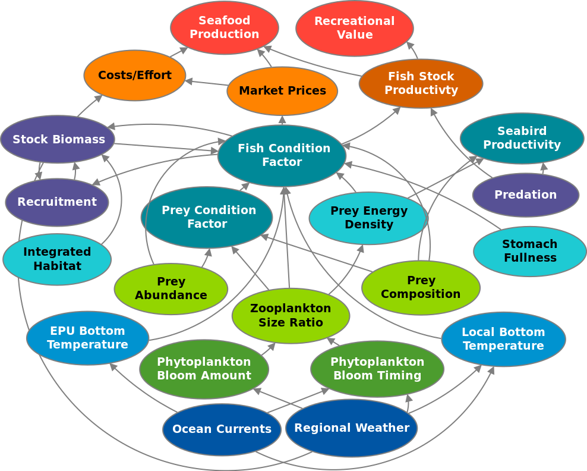
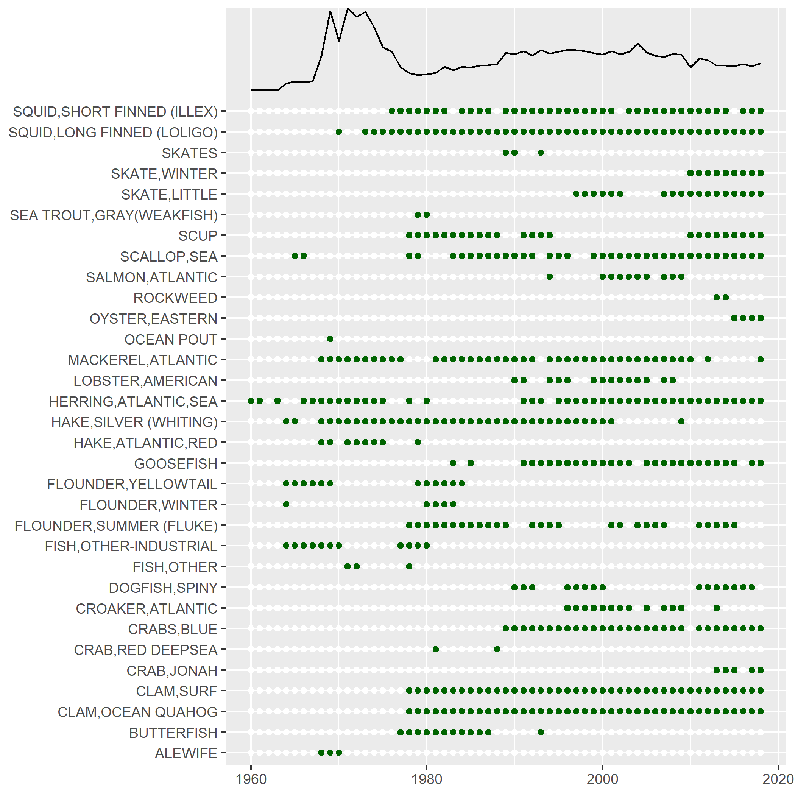

class: top, left

```{r setup, include=FALSE}

options(htmltools.dir.version = FALSE)
knitr::opts_chunk$set(echo = F,
                      warning = F,
                      message = F)
#Plotting and data libraries
library(tidyverse)
library(tidyr)
library(ecodata)
library(here)
library(kableExtra)
library(ggrepel)
library(patchwork)
library(grid)
library(ggiraph)
library(vegan)
library(rpart)
library(ks)
library(cowplot)

#GIS libraries
library(sf)
library(rgdal)
library(raster)
library(rnaturalearth)

data.dir <- here::here("data")
gis.dir <- here::here("data")

#General inline text input for report
#Council
council <- "Mid-Atlantic Fishery Management Council"
council_abbr <- "MAFMC"

#Region identifiers
epu <- "Mid-Atlantic Bight"
epu_abbr <- "MAB"
region <- "Mid-Atlantic"
region_abbr <- "MA" #Some commercial data organized by "MA" or "NE" regions, not by EPU 

#Time series constants
shade.alpha <- 0.3
shade.fill <- "lightgrey"
lwd <- 1
pcex <- 2
trend.alpha <- 0.5
trend.size <- 2
hline.size <- 1
hline.alpha <- 0.35
hline.lty <- "dashed"
label.size <- 5
hjust.label <- 1.5
letter_size <- 4
feeding.guilds1<- c("Piscivore","Planktivore","Benthivore","Benthos")
feeding.guilds <- c("Apex Predator","Piscivore","Planktivore","Benthivore","Benthos")
x.shade.min <- 2009
x.shade.max <- 2019
#Function for custom ggplot facet labels
label <- function(variable,value){
  return(facet_names[value])
}

#CRS
crs <- "+proj=longlat +lat_1=35 +lat_2=45 +lat_0=40 +lon_0=-77 +x_0=0 +y_0=0 +datum=NAD83 +no_defs +ellps=GRS80 +towgs84=0,0,0"

#Coastline shapefile
coast <- ne_countries(scale = 10,
                          continent = "North America",
                          returnclass = "sf") %>%
             sf::st_transform(crs = crs)

#State polygons
ne_states <- ne_states(country = "united states of america",
                                      returnclass = "sf") %>%
  sf::st_transform(crs = crs)

#high-res polygon of Maine
#new_england <- read_sf(gis.dir,"new_england")

#EPU shapefile
epu_sf <- ecodata::epu_sf %>% 
  filter(EPU %in% c("MAB","GB","GOM"))

#Map line parameters
map.lwd <- 0.4

# Set lat/lon window for maps
xmin = -77
xmax = -65
ymin = 36
ymax = 45
xlims <- c(xmin, xmax)
ylims <- c(ymin, ymax)

```

# Today's Talk

.pull-left[

- Role of Ecosystem reporting in MAFMC EAFM

- New! Response memo

- 2020 Mid-Atlantic Report

- EAFM risk assessment update
]

.pull-right[
*The IEA Loop<sup>1</sup>*

]

.footnote[
[1] https://www.integratedecosystemassessment.noaa.gov/national/IEA-approach
]

???

---
## Mid-Atlantic Council Ecosystem Approach

* 2016 EAFM Policy Guidance document; revised 2019<sup>1</sup> 

* MAFMC EAFM framework<sup>2</sup>
.center[

]
* 2017 Inital EAFM risk assessment completed; revised and published 2018<sup>3</sup>

* SOE indicators to be used for annual risk assessment updates


.footnote[
[1] http://www.mafmc.org/s/EAFM-Doc-Revised-2019-02-08.pdf
[2] https://www.frontiersin.org/articles/10.3389/fmars.2016.00105/full
[3] https://www.frontiersin.org/articles/10.3389/fmars.2018.00442/full
]

???
The Council’s EAFM framework has similarities to the IEA loop on slide 2. It uses risk assessment as a first step to prioritize combinations of managed species, fleets, and ecosystem interactions for consideration. Second, a conceptual model is developed identifying key environmental, ecological, social, economic, and management linkages for a high-priority fishery. Third, quantitative modeling addressing Council-specified questions and based on interactions identified in the conceptual model is applied to evaluate alternative management strategies that best balance management objectives. As strategies are implemented, outcomes are monitored and the process is adjusted, and/or another priority identified in risk assessment can be addressed. 

---
## State of the Ecosystem (SOE) Reporting: Context for busy people

*"So what?" --John Boreman, September 2016*

1. Clear linkage of ecosystem indicators with management objectives

1. Synthesis across indicators for big picture

1. Objectives related to human-well being placed first in report

1. Short (< 30 pages), non-technical (but rigorous) text

1. Emphasis on reproducibility 

.center[

]

???
In 2016, we began taking steps to address these common critiques of the ESR model

---
## State of the Ecosystem 2020: Response Memo

Our response to the need for more formal response to comments!

  * 30 comments or requests from 2019
  * One addressed by having the response memo
  * 21 addressed within the SOE at SSC/Council request
    * New summary section with synthetic overview addresses 3 requests
    * 5 new indicators added 
    * 3 existing indicators modified
    * 5 editorial updates 
    * 5 partially addressed requests
  * 8 not currently addressed within SOE
    * 2 have information summaries in the response memo
    * 2 may be addressed by student projects 
    * 1 needs feedback on how to deal with known data issue
    * 1 seeking data
    * 1 relevant to 2019 visualization that was replaced in 2020
    * 1 beyond capacity to address at present
    
SSC/Council feedback requested on the approach and all details, memo has specific questions

---
## State of the Ecosystem 2020: Structure
.pull-left[

### Report Structure
1. Summary 2 pager

1. Human dimensions

1. Protected species

1. Fish and invertebrates (managed and otherwise)

1. Habitat quality and ecosystem productivity
]

.pull-right[

*Established ecosystem-scale objectives in the Mid-Atlantic*

```{r management-objectives}
mng_obj <- data.frame("Objective Categories" = c("Seafood Production",
                                                 "Profits","Recreation",
                                                 "Stability","Social & Cultural",
                                                 "Biomass","Productivity",
                                                 "Trophic structure","Habitat"),
"Indicators reported here" = c("Landings by feeding group","Revenue decomposed to price and volume",
                               "Days fished; recreational catch",
                               "Diversity indices (fishery and species)",
                               "Commercial engagement trends",
                               "Biomass or abundance by feeding group from surveys",
                               "Condition and recruitment of managed species, Primary productivity",
                               "Relative biomass of feeding groups, Zooplankton",
                               "Estuarine and offshore habitat conditions"))

#knitr::kable(mng_obj, linesep = "",
mng_obj %>%
      #col.names = c("Objective Categories","Indicators reported here") %>%
      #caption = "Established ecosystem-scale objectives in the Mid-Atlantic Bight",
      #align = 'c',
      #booktabs = T) %>%
  #kable_styling(latex_options = "hold_position", "scale_down") %>%
 # column_spec(c(2), width = c("25em")) %>%
  kable(format = "html", escape = F, table.attr='class="risktable"',
        col.names = c("Objective Categories","Indicators reported here")) %>%
  kable_styling(font_size = 14) %>%
  row_spec(0, bold = TRUE)


```
]

---
## New 2 page summary with visualizations

.pull-left[

]

.pull-right[

]

---
## Research: linking report indicators for management use

.pull-left[

]

.pull-right[

]

Conceptual model links indicators in the report with management objectives.

A subset of objectives are currently under investigation. We plan to extend this work in 2020. 

---
## Document orientation
.pull-left[
Spatial scale


.contrib[
This year, we mapped trawl survey strata to Ecological Production Units (EPUs)  

[More information on EPUs](https://noaa-edab.github.io/tech-doc/epu.html)  
[More information on survey data](https://noaa-edab.github.io/tech-doc/survdat.html)  
]
]
.pull-right[
Key to figures
```{r spec-dist, fig.cap = "Aggregate species distribution metrics for species in the Northeast Large Marine Ecosystem.", fig.width=5, fig.asp=.9}

spec_dist <- ecodata::species_dist %>% 
  dplyr::group_by(Var) %>% 
  dplyr::mutate(hline = mean(Value))

asd <- spec_dist %>% 
  dplyr::filter(Var == "along-shelf distance") %>% 
  ggplot2::ggplot(aes(x = Time, y = Value,
               group = Var)) + 
 #Highlight last ten years
  ggplot2::annotate("rect", fill = shade.fill, alpha = shade.alpha,
      xmin = x.shade.min , xmax = x.shade.max,
      ymin = -Inf, ymax = Inf) +
  ecodata::geom_gls() +
  ggplot2::geom_line() +
  ggplot2::geom_point() +
  ggplot2::scale_x_continuous(expand = c(0.01, 0.01)) +
  ggplot2::ggtitle("Along-shelf distance")+
  ggplot2::ylab(expression("Distance (km)")) +
  ggplot2::xlab("")+
  ggplot2::geom_hline(aes(yintercept = hline),
           size = hline.size,
           alpha = hline.alpha,
           linetype = hline.lty) +
  ecodata::theme_ts() 

depth <- spec_dist %>% 
  dplyr::filter(Var == "depth") %>% 
  dplyr::mutate(Value = Value* -1, 
         hline = mean(Value)) %>% 
  ggplot2::ggplot(aes(x = Time, y = Value,
               group = Var)) + 
 #Highlight last ten years
  ggplot2::annotate("rect", fill = shade.fill, alpha = shade.alpha,
      xmin = x.shade.min , xmax = x.shade.max,
      ymin = -Inf, ymax = Inf) +
  ecodata::geom_gls() +
  ggplot2::geom_line() +
  ggplot2::geom_point() +
  ggplot2::scale_x_continuous(expand = c(0.01, 0.01)) +
  ggplot2::ggtitle("Depth") +
  ggplot2::ylab(expression("Depth (m)")) +
  ggplot2::xlab("")+
  ggplot2::geom_hline(aes(yintercept = hline),
           size = hline.size,
           alpha = hline.alpha,
           linetype = hline.lty) +
  ecodata::theme_ts() 

dtc <- spec_dist %>% 
  dplyr::filter(Var == "distance to coast") %>% 
  ggplot2::ggplot(aes(x = Time, y = Value,
               group = Var)) + 
 #Highlight last ten years
  ggplot2::annotate("rect", fill = shade.fill, alpha = shade.alpha,
      xmin = x.shade.min , xmax = x.shade.max,
      ymin = -Inf, ymax = Inf) +
  ecodata::geom_gls() +
  ggplot2::geom_line() +
  ggplot2::geom_point() +
  ggplot2::scale_x_continuous(expand = c(0.01, 0.01)) +
  ggplot2::ggtitle("Distance to coast")+
  ggplot2::ylab(expression("Distance (km)")) +
  ggplot2::xlab("Time")+
  ggplot2::geom_hline(aes(yintercept = hline),
           size = hline.size,
           alpha = hline.alpha,
           linetype = hline.lty) +
  ecodata::theme_ts() 

asd + depth + patchwork::plot_layout(ncol = 1) 

```
.contrib[
Trends assessed only for 30+ years: [more information](https://noaa-edab.github.io/tech-doc/trend-analysis.html)

<p style="color:#FF8C00;">Orange line = significant increase</p>
<p style="color:#9932CC;">Purple line = significant decrease</p>
No color line = not significant or too short
<p style="background-color:#D3D3D3;">Grey background = last 10 years</p>

]
]

---
## Commercial fisheries and ecosystem productivity

*Primary Production Required to support landings*
.pull-left[
```{r ppr-mab, fig.cap="Primary production required to support MAB commercial landings. Included are the top species accounting for 80\\% of the landings in each year, with 15\\% transfer efficiency assumed between trophic levels.", fig.width = 5, fig.asp = 0.45}
ecodata::ppr %>% 
  group_by(EPU) %>% 
  mutate(hline = mean(Value)) %>% 
  filter(EPU == "MAB") %>% 
  ggplot() +
  annotate("rect", fill = shade.fill, alpha = shade.alpha,
      xmin = x.shade.min , xmax = x.shade.max,
      ymin = -Inf, ymax = Inf) +
  geom_point(aes(x = Time, y = Value))+
  geom_line(aes(x = Time, y = Value))+
  geom_hline(aes(yintercept = hline),
           size = hline.size,
           alpha = hline.alpha,
           linetype = hline.lty)+
  scale_x_continuous(expand = c(0.01, 0.01)) +
  expand_limits(y=0) +
  ggtitle("Primary Production Required")+
  ylab("Proportion of Total PPD")+
  theme(axis.title.y = element_text(size = 8))+
  theme_ts()
```


## Fraction of primary production used by fisheries

## Declining since 2000

Combined decrease in landings and stable primary production

Many assumptions to explore

]

.pull-right[

]

---
## Commercial fisheries engagement, landings, revenue

.center[
```{r MAB-comm-engagement-trend, fig.width = 10, fig.asp = 0.4, fig.cap = "Commercial engagement scores (total pounds landed, value landed, commercial permits, and commercial dealers in a community) for Mid-Atlantic fishing communities, 2004-2018."}

eng<-ecodata::engagement %>% 
  filter(!Var == "med.high.scores")
eng$Var <- factor(eng$Var, levels = c("%High","%Medium High","%Moderate", "%Low"))

engbar <- eng %>% filter(EPU == "MA") %>% 
  ggplot()+
   #ylim(0.8, NA)+
  geom_bar(aes(x = Time, y = Value, 
               fill = Var), 
           stat = "identity")+
  #scale_y_continuous(labels = Value(suffix = "%", prefix = "")) +
  #geom_text(aes(x = Time, y = Value,
  #             label = paste0(Value,"%")), size=4) +
  theme(#legend.position="bottom", legend.direction="horizontal",
        legend.title = element_blank())+
  coord_cartesian(ylim=c(0.85,1))+
  xlab("Time") +
  ylab("% Communities in each category (Low to High)")+
  ggtitle("Commercial Engagement")+
  theme_ts()


mhtrend <- ecodata::engagement %>% 
  filter(Var == "med.high.scores", 
         EPU == "MA") %>% 
  mutate(hline = mean(Value)) %>% 
  ggplot()+
  annotate("rect", fill = shade.fill, alpha = shade.alpha,
      xmin = x.shade.min , xmax = x.shade.max,
      ymin = -Inf, ymax = Inf) +
  geom_line(aes(x = Time, y = Value), size = lwd) +
  geom_point(aes(x = Time, y = Value), size = pcex) +
  scale_x_continuous(expand = c(0.01, 0.01)) +
  expand_limits(y=0) +
  ggtitle("Medium-High communities ") +
  ylab(expression("Average score for Med High communities")) +
  geom_hline(aes(yintercept = hline),
           size = hline.size,
           alpha = hline.alpha,
           linetype = hline.lty) +
 theme_ts()
  
cowplot::plot_grid(engbar, 
                   mhtrend,
                   ncol = 2, 
                   align = "h", 
                   rel_widths = c(1, 0.7)) +
    theme(plot.margin = unit(c(0.1, 0, 0, 0), "cm"))

```
]

Fewer highly engaged Mid-Atlantic communities; engagement scores for medium-highly engaged communities decreasing, linked to landings/revenue? 

.pull-left[
```{r total-landings, fig.cap = paste0("Total commercial seafood landings (black) and ",region," managed seafood landings (red)."), fig.width = 5, fig.asp = 0.45}
#Get data for plotting

#Define constants for figure plot
series.col <- c("indianred","black")

#Managed landings
managed_landings <- ecodata::comdat  %>%
  filter(str_detect(Var, paste0(council_abbr," managed species - Landings weight|JOINT managed species - Landings weight")),
         !str_detect(Var, "Other"),
         Time >= 1986,
         EPU == epu_abbr)

#Total landings
total_landings <- ecodata::comdat  %>%
  filter(!str_detect(Var, "managed species"),
         !str_detect(Var, "Other"),
         str_detect(Var, "Landings"),
         Time >= 1986,
         EPU == epu_abbr)

total_landings_agg <- total_landings %>%
  group_by(Time) %>%
  dplyr::summarise(Value = sum(Value)) %>% 
  mutate(Var = "Total",hline = mean(Value))
managed_landings_agg <- managed_landings %>%
  group_by(Time) %>%
  dplyr::summarise(Value = sum(Value)) %>% 
  mutate(Var = "Managed",hline = mean(Value))

landings_agg <- rbind(total_landings_agg, managed_landings_agg)


ggplot(data = landings_agg)+
  
  #Highlight last ten years
  annotate("rect", fill = shade.fill, alpha = shade.alpha,
      xmin = x.shade.min , xmax = x.shade.max,
      ymin = -Inf, ymax = Inf) +
  geom_gls(aes(x = Time, y = Value,
               group = Var),
             alpha = trend.alpha, size = trend.size) +
  geom_line(aes(x = Time, y = Value, color = Var), size = lwd) +
  geom_point(aes(x = Time, y = Value, color = Var), size = pcex) +

  scale_y_continuous(labels = function(l){trans = l / 1000})+
  scale_x_continuous(breaks = seq(1985, 2015, by = 5), expand = c(0.01, 0.01)) +
  scale_color_manual(values = series.col, aesthetics = "color")+
  guides(color = FALSE) +
  ggtitle("Total Landings") +
  ylab(expression("Landings (10"^3*"metric tons)")) +

  geom_hline(aes(yintercept = hline,
               
               color = Var),
           size = hline.size,
           alpha = hline.alpha,
           linetype = hline.lty) +
  
  theme(axis.title.y = element_text(size = 9))+
    theme_ts()


```
]

.pull-right[
```{r comm-revenue, fig.width = 5, fig.asp = 0.45, fig.cap = "Total revenue for the region (black) and revenue from MAFMC managed species (red)."}

#Filtering and aggregation step
rev_agg <- ecodata::comdat %>% 
  filter(str_detect(Var, "Revenue"),
         !str_detect(Var, "prop|Other|NEFMC"), #Remove proportions, "Other" category species, NEFMC managed species in MAB
         EPU == epu_abbr,
         Time >= 1986) %>% 
  mutate(Status = ifelse(str_detect(Var, "Revenue weight"), 
                         "Managed","Total")) %>% #Create groups for aggregation
  group_by(Status, Time) %>% 
  dplyr::summarise(Total = sum(Value)) %>% 
  group_by(Status) %>% 
  mutate(hline = mean(Total))

series.col <- c("indianred","black")

#Plotting
ggplot(data = rev_agg) +
  
  #Highlight last ten years
  annotate("rect", fill = shade.fill, alpha = shade.alpha,
      xmin = x.shade.min , xmax = x.shade.max,
      ymin = -Inf, ymax = Inf)+  
  
  #lines
  geom_gls(aes(x = Time, y = Total,
               group = Status),
             alpha = trend.alpha, size = trend.size) +
  geom_line(aes(x = Time, y = Total, color = Status), size = lwd) +
  geom_point(aes(x = Time, y = Total, color = Status), size = pcex) +

  #axes
  scale_y_continuous(labels = function(l){trans = l / 1000000})+
  scale_x_continuous(breaks = seq(1985, 2015, by = 5), expand = c(0.01, 0.01)) +
      scale_color_manual(values = series.col, aesthetics = "color")+
  guides(color = FALSE) +
  ggtitle("Total Revenue") +
  ylab(expression("Revenue (10"^6*"USD)")) +
  geom_hline(aes(yintercept = hline,
               color = Status),
           size = hline.size,
           alpha = hline.alpha,
           linetype = hline.lty) +
  theme_ts()
```
]

---
## Recreational fishing
.pull-left[
Lowest recreational landings recorded in 2018--why?

```{r rec-landings, fig.cap = paste0("Total recreational seafood harvest in the ",region," region."), fig.width = 5, fig.asp = 0.45}

landings_rec <- ecodata::recdat %>% 
  filter(EPU == region_abbr,
         Var == "Recreational Seafood") %>% 
  mutate(hline = mean(Value))

series.col <- "black"

ggplot(data = landings_rec)+
  
  #Highlight last ten years
  annotate("rect", fill = shade.fill, alpha = shade.alpha,
      xmin = x.shade.min , xmax = x.shade.max,
      ymin = -Inf, ymax = Inf) +
  geom_gls(aes(x = Time, y = Value,
               group = Var),
             alpha = trend.alpha, size = trend.size) +
  geom_line(aes(x = Time, y = Value, color = Var), size = lwd) +
  geom_point(aes(x = Time, y = Value, color = Var), size = pcex) +

  scale_y_continuous(labels = function(l){trans = l / 1000000})+
  scale_x_continuous(breaks = seq(1985, 2015, by = 5), expand = c(0.01, 0.01)) +
  scale_color_manual(values = series.col, aesthetics = "color")+
  guides(color = FALSE) +
  ggtitle("Recreational seafood harvest") +
  ylab(expression("Fish caught (10"^6*"n)")) +

  geom_hline(aes(yintercept = hline,
               
               color = Var),
           size = hline.size,
           alpha = hline.alpha,
           linetype = hline.lty) +
  theme_ts()

```

Effort trend similar to previous reports

```{r rec-op, fig.width = 5, fig.asp = 0.45, fig.cap = paste0("Recreational effort in the ",region,".")}
recdat <- ecodata::recdat %>% 
  filter(EPU == region_abbr) %>% 
  group_by(Var) %>% 
  mutate(hline = mean(Value))

ylim_re <- c(2e7, 7e7)
ylim_rd <- c(1.75,2.75)
ylim_ra  <- c(1e6, 3.5e6)

# #Create dataframe for label locations
# label_loc <- data.frame(xloc = min(recdat$Time)+0.3,
#                         yloc = c(ylim_re[2]*0.975,
#                                  ylim_rd[2]*0.975,
#                                  ylim_ra[2]*0.975),
#                         labels = LETTERS[1:3],
#                         Var = c("Recreational Effort",
#                                 "Recreational fleet effort diversity across modes",
#                                 "Recreational anglers"))

series.col <- "black"
# x.shade.min <- max(recdat$Time, na.rm = T) - 9
# x.shade.max <- max(recdat$Time, na.rm = T)

rec_effort <- recdat %>% 
  filter(Var == "Recreational Effort") %>% 
  ggplot() + 
 #Highlight last ten years
  annotate("rect", fill = shade.fill, alpha = shade.alpha,
      xmin = x.shade.min , xmax = x.shade.max,
      ymin = -Inf, ymax = Inf) +
  #label
  # annotate("text", 
  #          x = label_loc[label_loc$Var == "Recreational Effort",]$xloc,
  #          y = label_loc[label_loc$Var == "Recreational Effort",]$yloc,
  #          label = label_loc[label_loc$Var == "Recreational Effort",]$labels,
  #          size = letter_size)+
  geom_gls(aes(x = Time, y = Value,
               group = Var),
             alpha = trend.alpha, size = trend.size) +
  geom_line(aes(x = Time, y = Value, color = Var), size = lwd) +
  geom_point(aes(x = Time, y = Value, color = Var), size = pcex) +
  
  scale_x_continuous(expand = c(0.01, 0.01)) +
  scale_y_continuous(labels = function(l){trans = l / 1000000}, limits = ylim_re)+
  scale_color_manual(values = series.col, aesthetics = "color")+
  guides(color = FALSE) +
  ggtitle("Recreational effort")+
  ylab(expression("Days fished (10"^6*" N)")) +
  xlab("")+
  geom_hline(aes(yintercept = hline,
               color = Var),
           size = hline.size,
           alpha = hline.alpha,
           linetype = hline.lty) +
  theme_ts() 

#no rec angler data with MRIP From Geret:
#Short answer: No. They are not currently calculating number of anglers. 
#Seems the MRIP update caused some methodological issues that they haven't fully worked through for this indicator. 
#Not sure when it will be available again.

cowplot::plot_grid(rec_effort, 
                   #rec_div, 
                   #rec_anglers, 
                   #rec_div_catch,
                   ncol = 1, 
                   align = "hv") +
    theme(plot.margin = unit(c(0.1, 0, 0, 0), "cm"))

```

]
.pull-right[
Significant decrease in recreational fleet diversity

```{r rec-div, fig.width = 5, fig.asp = 0.45, fig.cap = paste0("Recreational effort diversity in the ",region,".")}

rec_div <- recdat %>% 
  filter(Var == "Recreational fleet effort diversity across modes") %>% 
  ggplot() + 
 #Highlight last ten years
  annotate("rect", fill = shade.fill, alpha = shade.alpha,
      xmin = x.shade.min , xmax = x.shade.max,
      ymin = -Inf, ymax = Inf) +
  # annotate("text", 
  #          x = label_loc[label_loc$Var == "Recreational fleet effort diversity across modes",]$xloc,
  #          y = label_loc[label_loc$Var == "Recreational fleet effort diversity across modes",]$yloc,
  #          label = label_loc[label_loc$Var == "Recreational fleet effort diversity across modes",]$labels,
  #          size = letter_size)+
  geom_gls(aes(x = Time, y = Value,
               group = Var),
             alpha = trend.alpha, size = trend.size) +
  geom_line(aes(x = Time, y = Value, color = Var), size = lwd) +
  geom_point(aes(x = Time, y = Value, color = Var), size = pcex) +
  ylim(ylim_rd)+
  scale_x_continuous(expand = c(0.01, 0.01)) +
  scale_color_manual(values = series.col, aesthetics = "color")+
  guides(color = FALSE) +
  ggtitle("Rec. fleet effort diversity")+
  ylab(expression("Effective Shannon")) +
  xlab("")+
  geom_hline(aes(yintercept = hline,
               color = Var),
           size = hline.size,
           alpha = hline.alpha,
           linetype = hline.lty) +
  theme_ts()
  rec_div
```

Splitting out SAFMC, ASMFC removed downward catch diversity trend

```{r rec-div2, fig.width = 5, fig.asp = 0.45, fig.cap = paste0("Diversity of recreational catch in the ",region,".")}

recdat <- ecodata::recdat %>% 
  filter(EPU == region_abbr) %>% 
  group_by(Var) %>% 
  mutate(hline = mean(Value))

series.col <- "black"

ylim_re <- c(2e7, 7e7)
ylim_rd <- c(1.75,2.75)
ylim_ra  <- c(1e6, 3.5e6)

rec_div_catch <- recdat %>% 
  filter(Var == "Recreational Diversity of Catch") %>% 
  ggplot() + 
 #Highlight last ten years
  annotate("rect", fill = shade.fill, alpha = shade.alpha,
      xmin = x.shade.min , xmax = x.shade.max,
      ymin = -Inf, ymax = Inf) +
    # annotate("text", 
    #        x = label_loc[label_loc$Var == "Recreational anglers",]$xloc,
    #        y = label_loc[label_loc$Var == "Recreational anglers",]$yloc,
    #        label = label_loc[label_loc$Var == "Recreational anglers",]$labels,
    #        size = letter_size)+
  geom_gls(aes(x = Time, y = Value,
               group = Var),
             alpha = trend.alpha, size = trend.size) +
  geom_line(aes(x = Time, y = Value, color = Var), size = lwd) +
  geom_point(aes(x = Time, y = Value, color = Var), size = pcex) +

  scale_x_continuous(expand = c(0.01, 0.01)) +
  scale_color_manual(values = series.col, aesthetics = "color")+
  guides(color = FALSE) +
  ggtitle("Rec. diversity of catch")+
  ylab(expression("Effective Shannon")) +
  xlab("Time")+
  geom_hline(aes(yintercept = hline,
               color = Var),
           size = hline.size,
           alpha = hline.alpha,
           linetype = hline.lty) +
  theme_ts()

rec_div_catch

```
]


---
## Other ocean uses: wind energy fish habitat overlap

```{r wind-habitat-table, eval = T, echo = F, fig.cap='', out.width='80%'}
wind1 <- ecodata::wind_occupancy

wind1$trend<- ifelse(wind1$Trend == "pos", 
                    "$\\nearrow$",
                    ifelse(wind1$Trend == "neg",
                    "$\\searrow$", 
                    " ")) 


wind2<-wind1 %>% dplyr::select(Area, Season, Species, trend)
names<-c("Area", "Season", "Species", "trend")
bnew<-c("Area.1", "Season.1", "Species.1", "trend.1")
cnew<-c("Area.2", "Season.2", "Species.2", "trend.2")
dnew<-c("Area.3", "Season.3", "Species.3", "trend.3")
enew<-c("Area.4", "Season.4", "Species.4", "trend.4")

a<-wind2 %>% filter(Area == "Existing-North") 
b<-wind2 %>% filter(Area == "Proposed-North") %>% 
  dplyr::rename_at(vars(names), ~ bnew)
c<-wind2 %>% filter(Area == "Existing-Mid")%>% 
  dplyr::rename_at(vars(names), ~ cnew)
d<-wind2 %>% filter(Area == "Proposed-Mid")%>% 
  dplyr::rename_at(vars(names), ~ dnew)
e<-wind2 %>% filter(Area == "Existing-South")%>% 
  dplyr::rename_at(vars(names), ~ enew)

all<- a %>% cbind(b,c,d,e) %>% 
  dplyr::select(2:4,7:8,11:12,15:16,19:20) #%>% 
  # rename(Trend = trend, 
  #        Species = Species.1, 
  #        Trend = trend.1, 
  #        Species = Species.2, 
  #        Trend = trend.2, 
  #        Species = Species.3, 
  #        Trend = trend.3, 
  #        Species = Species.4, 
  #        Trend = trend.4 )
  
kable(all, format = "html", escape = F, table.attr='class="risktable"',
      col.names = c("Season", "Species", "Trend", "Species", "Trend", "Species","Trend", "Species","Trend", "Species", "Trend")) %>%
      #caption = "Species with highest probability of occupancy species each season and area, with observed trends",
      #align = 'c',
      #booktabs = T) %>%
    add_header_above(c(" " = 1, "Existing - North" = 2, "Proposed - North" = 2, 
                     "Existing - Mid" = 2, "Proposed - Mid" = 2, 
                     "Existing - South" = 2)) %>%
  #kable_styling(latex_options = c("hold_position", "scale_down")) 
  kable_styling(font_size = 11) %>%
  row_spec(0, bold = TRUE)
```

.pull-left[
```{r wind-hab, eval = T, echo = F, fig.height = 6, fig.cap="Map of BOEM existing (black) and proposed (red) lease areas in North (N), Mid (M) and South (S) portions of the coast as of February 2019.", message=FALSE, results=FALSE}
library(rnaturalearthhires)
library(sf)
library(raster)
library(ggspatial)
library(marmap)

crs <- "+proj=longlat +lat_1=35 +lat_2=45 +lat_0=40 +lon_0=-77 +x_0=0 +y_0=0 +datum=NAD83 +no_defs +ellps=GRS80 +towgs84=0,0,0"
#gis.dir <- here::here("data-raw/gis")
nesbath <- fortify.bathy(getNOAA.bathy(lon1 = -77, lon2 = -65, lat1 = 35, lat2 = 45,
              resolution = 5))

lease_s<-st_read(file.path(gis.dir, 'BOEM lease areas/ne_existing_leasesSPoly.shp'))
lease_n<-st_read(file.path(gis.dir, 'BOEM lease areas/ne_existing_leasesNPoly.shp'))
lease_m<-st_read(file.path(gis.dir, 'BOEM lease areas/ne_existing_leasesMPoly.shp'))
prop_n<-st_read(file.path(gis.dir, 'BOEM lease areas/ne_proposed_leases_NPoly.shp'))
prop_m<-st_read(file.path(gis.dir, 'BOEM lease areas/ne_proposed_leases_MPoly.shp'))

invisible(st_crs(lease_s)<-crs)
invisible(st_crs(lease_n)<-crs)
invisible(st_crs(lease_m)<-crs)
invisible(st_crs(prop_n)<-crs)
invisible(st_crs(prop_m)<-crs)

ggplot() +
  geom_raster(data = nesbath, aes(x=x,y=y, fill = z)) +
  scale_fill_gradientn(colors =c("lightcyan","lightblue4"))+
  geom_sf(data = coast, size = map.lwd) +
  geom_sf(data = epu_sf, fill = "transparent", size = map.lwd) +
  geom_sf(data = lease_s, size = map.lwd, color = "black")+
  geom_sf(data = lease_n, size = map.lwd, color = "black")+
  geom_sf(data = lease_m, size = map.lwd, color = "black")+
  geom_sf(data = prop_n, size = map.lwd, color = "red3")+
  geom_sf(data = prop_m, size = map.lwd, color = "red3")+
  coord_sf(crs = crs, xlim = c(-77, -69), ylim = c(36,42))+
  geom_segment(aes(x = -74.6, y = 37.4, xend =-75.4, yend =38), colour = "blue4")+
  geom_segment(aes(x = -71.1, y = 40.2, xend =-71.6, yend =41.1), colour = "blue4")+
  annotate("text", x = -74.9, y = 37, label = "S")+
  annotate("text", x = -73.5, y = 38.7, label = "M")+
  annotate("text", x = -70.5, y = 40.2, label = "N")+
  annotation_scale(location = "br", width_hint = 0.4) +
  theme_bw( ) +
  ylab("")+
  xlab("")+
  theme(legend.position = "none") +
  ggtitle("BOEM lease areas, early 2019")

``` 
]

.pull-right[
## Fishery overlap to be added

## What habitat model outputs most useful?
]
---
## Protected species

.pull-left[
North Atlantic right whale abundance

```{r NARW-abundance, fig.width = 5, fig.asp = 0.45,fig.cap = "1990-2018 right whale abundance estimates with 95\\% credible intervals. These values represent the estimated number of animals alive sometime during the year referenced and NOT at the end of the year referenced. Three known deaths were recorded in 2018, but these deaths were not reflected in the 2018 estimate because those animals were alive sometime during the year. An additional 10 known deaths occurred in 2019."}
#hline <- mean(narw[narw$Var == "right whale abundance median",]$Value)

ecodata::narw %>% 
  dplyr::filter(Var != "Calves") %>% 
  tidyr::spread(Var, Value) %>% 
  dplyr::rename(Value = Median) %>% 
  dplyr::mutate(hline = mean(Value, na.rm = T)) %>% 
  ggplot() +
#Highlight last ten years
  annotate("rect", fill = shade.fill, alpha = shade.alpha,
      xmin = x.shade.min , xmax = x.shade.max,
      ymin = -Inf, ymax = Inf) +
  geom_line(aes(x = Time, y = Value), size = lwd-0.75) +
  geom_point(aes(x = Time, y = Value), size = pcex-0.75) +
  geom_ribbon(aes(ymin = Lower95, ymax = Upper95, x = Time), alpha = 0.3)+
  scale_x_continuous(expand = c(0.01, 0.01)) +
  guides(color = FALSE) +
  ggtitle("NARW abundance") +
  ylab(expression("Abundance (n)")) +
  xlab("Time")+
  geom_hline(aes(yintercept = hline),
          color = "black",
          size = hline.size,
          alpha = hline.alpha,
          linetype = hline.lty) +
  theme_ts()
```

**New indicator** 

North Atlantic right whale calf births

```{r NARW-calf-abundance, fig.width = 5, fig.asp = 0.45, fig.cap = "Number of North Atlantic right whale calf births, 1990 - 2019."}

ecodata::narw %>% 
  dplyr::filter(Var == "Calves") %>%
  dplyr::mutate(hline = mean(Value, na.rm = T)) %>% 
  ggplot() +
#Highlight last ten years
  annotate("rect", fill = shade.fill, alpha = shade.alpha,
      xmin = x.shade.min , xmax = x.shade.max,
      ymin = -Inf, ymax = Inf) +
  geom_line(aes(x = Time, y = Value), size = lwd-0.75) +
  geom_point(aes(x = Time, y = Value), size = pcex-0.75) +
  scale_x_continuous(expand = c(0.01, 0.01)) +
  guides(color = FALSE) +
  ggtitle("NARW calf abundance") +
  ylab(expression("Abundance (n)")) +
  xlab("Time")+
  geom_hline(aes(yintercept = hline),
           color = "black",
           size = hline.size,
           alpha = hline.alpha,
           linetype = hline.lty) +
  theme_ts()
```

]

.pull-right[
Seal population snapshots 

  + ~75,000 harbor seals, trend analysis in progress
  
  + 30,000 - 40,000 grey seals in US; 425,000 in Canada and &nearr;

Seal diet studies in progress

Unusual Mortality Events

  + [North Atlantic right whales](https://www.fisheries.noaa.gov/national/marine-life-distress/2017-2020-north-atlantic-right-whale-unusual-mortality-event)  
  
  + [Humpback whales](https://www.fisheries.noaa.gov/national/marine-life-distress/2016-2020-humpback-whale-unusual-mortality-event-along-atlantic-coast)  
  
  + [Minke whales](https://www.fisheries.noaa.gov/national/marine-life-distress/2017-2020-minke-whale-unusual-mortality-event-along-atlantic-coast)  
  
  + [Grey, harbor, hooded, and harp seals](https://www.fisheries.noaa.gov/new-england-mid-atlantic/marine-life-distress/2018-2019-pinniped-unusual-mortality-event-along)
  
]

---
## Fish stock status

Change from 2019: bluefish biomass below threshold

```{r stock-status, warning=F, fig.cap = paste0("Summary of single species status for ",council_abbr," and jointly managed stocks (Goosefish and Spiny dogfish)."), fig.width = 10, fig.asp = 0.6}

stock_status <- ecodata::stock_status %>%
  mutate(Code = recode(Code, "Dogfish" = "Sp. Dogfish" )) %>% 
  spread(.,Var,Value) %>% 
  filter(Council %in% c("MAFMC","Both")) %>% 
  group_by(Stock) %>% 
  mutate(score = case_when(
    (B.Bmsy <0.5) ~"a",
    (F.Fmsy >1) ~ "a", 
    (F.Fmsy < 1 & B.Bmsy > 0.5 & B.Bmsy < 1) ~ "b",
    (F.Fmsy < 1 & B.Bmsy > 1) ~ "c"))
#Plot constants
y.max <- 2.0 #1.75 mackerel cut off F/Fmsy is 1.8
x.max <- 2.6
#A dataframe that defines custom legend for stocks with unknown status
unknown <- data.frame(text = c("Unknown Status", "Longfin Squid",
                              "Shortfin Squid", "N. Goosefish", "S. Goosefish"),
                    x = rep(0.9*x.max,5), y = seq(0.93*y.max,1.4,-.1))

# Custom Color
custom_color<- c("#56B4E9", "#009E73", "#0072B2")
#Plotting code
ggplot(data = stock_status) +
  geom_vline(xintercept = 1, linetype = "dotted")+
  geom_vline(xintercept = 0.5, linetype = "dashed")+
  geom_hline(yintercept = 1, linetype = "dashed") +
  geom_point(aes(x = B.Bmsy,
                 y = F.Fmsy,
                 shape = Council,
                 color = score)) +
  geom_text_repel(aes(x = B.Bmsy, #geom_text_repel auto-jitters text around points
                      y = F.Fmsy,
                      label = Code, 
                      color = score,
                      size = 20), 
                  show.legend = FALSE, nudge_y = -0.01, nudge_x = 0.05) +
  scale_color_brewer(palette = "Dark2",
                     breaks = stock_status$score) +
  ylim(0,y.max) +
  xlim(0,x.max) +
  geom_text(data = unknown, aes(x = x, y = y, label = text), #Custom legend for unknown stock status
            size = c(4.75,rep(4,4))) +
  annotate("rect", xmin = 0.8*x.max,
           xmax = x.max,
           ymin = 0.65*y.max,
           ymax = 0.90*y.max,
           alpha = 0.1) +
  xlab(expression(~B/B[msy])) +
  ylab(expression(~F/F[msy])) +
  guides(color = FALSE) +
  theme_ts()
```

---
## Updated fish feeding groups to look at aggregate biomass

```{r guilds}
# new table with all species listed by management entity
df <- ecodata::species_groupings %>%
  dplyr::select(SOE.20, COMNAME, Fed.Managed) %>%
  filter(SOE.20 != "Other") %>%
  distinct() %>%
  group_by(SOE.20, Fed.Managed) %>%
  summarize_all(funs(paste(na.omit(.), collapse = ", "))) %>%
  spread(Fed.Managed, COMNAME) %>%
  arrange(factor(SOE.20, levels = c("Apex Predator", "Piscivore", "Planktivore", "Benthivore", "Benthos")))
df<-df[c(1,3,2,4,5)] %>%
  mutate_all(tolower)


knitr::kable(df, booktabs = TRUE, caption = 'Feeding groups and management bodies.', 
             col.names = c("Feeding Group", "MAFMC", "Joint", "NEFMC", "State or Other")) %>%
  #kable_styling(font_size=10, latex_options=c("repeat_header", "scale_down", "hold_position")) %>%
  kable_styling(font_size = 12) %>%
  row_spec(0,bold=TRUE) %>%
  column_spec(1, width="2cm") %>%
  column_spec(2, width="4cm") %>%
  column_spec(3, width="2cm") %>%
  column_spec(4, width="5cm") %>%
  column_spec(5, width="6cm") %>%
  #column_spec(3, width="7.5cm") #%>%
  collapse_rows(columns = 1, latex_hline = "major", valign = "middle")
```

---
## Aggregate fish biomass generally stable

```{r nefsc-biomass-mab, fig.cap = "Spring (left) and fall (right) surveyed biomass in the Mid-Atlantic Bight. Data from the NEFSC Bottom Trawl Survey are shown in black, with NEAMAP shown in red. The shaded area around each annual mean represents 2 standard deviations from the mean. ", fig.width=10, fig.asp = 0.75}
agg<-ecodata::aggregate_biomass %>% 
  dplyr::filter(!stringr::str_detect(Var, "Apex|inshore|offshore|managed|NEFMC|MAFMC|JOINT|NA")) %>% #remove unused datasets
  tidyr::separate(Var, c("feeding.guild", "season", "Biomass", "Var1"), sep = " ") %>% 
  tidyr::unite("Var", feeding.guild:season, sep = " ") %>% 
  dplyr::mutate(stat = recode(Var1, Index = "Mean", 
                      Standard = "SD")) %>% 
  dplyr::select(-Biomass, -Var1) %>% 
  dplyr::group_by(Var, Time, EPU) %>% 
  tidyr::spread(stat, Value) %>% 
  dplyr::mutate(upper = Mean + (2*SD), 
         lower = Mean - (2*SD))


agg_bio<-agg %>% dplyr::filter(EPU %in% c(epu_abbr),
         Time >= 1968) %>% 
  dplyr::group_by(Var, EPU) %>% 
  dplyr::mutate(hline = mean(Mean, na.rm = T)) %>% 
  dplyr::ungroup() 

agg_bio$Var <- factor(agg_bio$Var,levels = c("Piscivore Spring",
                                                   "Piscivore Fall",
                                                    "Benthivore Spring",
                                                   "Benthivore Fall",
                                                    "Planktivore Spring",
                                                    "Planktivore Fall",
                                                    "Benthos Spring",
                                                   "Benthos Fall"))
series.col <- rep("black",length(unique(agg_bio$Var)))
facet_names <- list("Piscivores" = expression("Piscivores"),
                    "Planktivores" = expression("Planktivores"),
                    "Benthivores" = expression("Benthivores"),
                    "Benthos" = expression("Benthos"))
#Get NEAMAP
neamap <- ecodata::mab_inshore_survey %>% 
  group_by(Var) %>% 
  mutate(hline = mean(Value),
         SD = Value * CV, #calculate SD from CV
         upper = Value + (2*SD), 
         lower = Value - (2*SD))

neamap$Var <- factor(neamap$Var,levels = c("Piscivore Spring","Piscivore Fall",
                                           "Benthivore Spring", "Benthivore Fall",
                                           "Planktivore Spring", "Planktivore Fall",  
                                           "Benthos Spring", "Benthos Fall"))
## Piscivore 
neamap.1<-neamap %>% 
  filter(str_detect(Var,"Piscivore"))
p1<-agg_bio %>% 
  filter(str_detect(Var,"Piscivore")) %>% 
  ggplot() +
  
  #Highlight last ten years
  annotate("rect", fill = shade.fill, alpha = shade.alpha,
      xmin = x.shade.min , xmax = x.shade.max ,
      ymin = -Inf, ymax = Inf) +
  #Test for trend and add lines
  geom_gls(aes(x = Time, y = Mean,
               color = Var),
             alpha = trend.alpha, size = trend.size) +

  #Add time series
  geom_ribbon(aes(x = Time, ymin = pmax(lower,0), ymax = upper), 
              alpha = 0.5,
              fill = "grey") +
  geom_line(aes(x = Time, y = Mean),size = lwd-0.5) +
  geom_point(aes(x = Time, y = Mean),size = pcex-0.5) +
  scale_color_manual(values = series.col, aesthetics = "color")+
  guides(color = FALSE) +
  geom_hline(aes(yintercept = hline,
                 group = Var),
             size = hline.size,
             alpha = hline.alpha,
             linetype = hline.lty)+
  facet_wrap(Var~.,ncol = 2) +
     #Add NEAMAP
    geom_ribbon(data = neamap.1, aes(x = Time, ymin = pmax(lower,0), ymax = upper), 
              alpha = 0.5,
              fill = "pink")+
  geom_line(data = neamap.1, aes(x = Time, y = Value),
            color = "#ca0020")+
  geom_point(data = neamap.1, aes(x = Time, y = Value),
             size = pcex-0.5,
             color = "#ca0020")+

  #Axis and theme
  scale_x_continuous(breaks = seq(1965, 2015, by = 10), expand = c(0.01, 0.01)) +
  #ylim(0, 1200)+
  ylab(expression("Biomass (kg tow"^-1*")")) +
  theme_facet()+
  theme(strip.text=element_text(hjust=0), 
        axis.title.x=element_blank())

## Benthivore
neamap.2<-neamap %>% 
  filter(str_detect(Var,"Benthivore"))
p2<-agg_bio %>% 
  filter(str_detect(Var,"Benthivore")) %>% 
  ggplot() +
  
  #Highlight last ten years
  annotate("rect", fill = shade.fill, alpha = shade.alpha,
      xmin = x.shade.min , xmax = x.shade.max ,
      ymin = -Inf, ymax = Inf) +
  #Test for trend and add lines
  geom_gls(aes(x = Time, y = Mean,
               color = Var),
             alpha = trend.alpha, size = trend.size) +
  
  #Add time series
  geom_ribbon( aes(x = Time, ymin = pmax(lower,0), ymax = upper), 
              alpha = 0.5,
              fill = "grey") +
  geom_line(aes(x = Time, y = Mean),size = lwd-0.5) +
  geom_point(aes(x = Time, y = Mean),size = pcex-0.5) +
  scale_color_manual(values = series.col, aesthetics = "color")+
  guides(color = FALSE) +
  geom_hline(aes(yintercept = hline,
                 group = Var),
             size = hline.size,
             alpha = hline.alpha,
             linetype = hline.lty)+
  facet_wrap(Var~.,ncol = 2) +
       #Add NEAMAP
  geom_ribbon(data = neamap.2, aes(x = Time, ymin = pmax(lower,0), ymax = upper), 
              alpha = 0.5, fill = "pink")+
  geom_line(data = neamap.2, aes(x = Time, y = Value),
            color = "#ca0020")+
  geom_point(data = neamap.2, aes(x = Time, y = Value),
             size = pcex-0.5,
             color = "#ca0020")+

  #Axis and theme
  scale_x_continuous(breaks = seq(1965, 2015, by = 10), expand = c(0.01, 0.01)) +
  ylab(expression("Biomass (kg tow"^-1*")")) +
  theme_facet()+
  theme(strip.text=element_text(hjust=0), 
        axis.title.x=element_blank())


### Planktivore
neamap.3<-neamap %>% 
  filter(str_detect(Var,"Planktivore"))
p3<-agg_bio %>% 
  filter(str_detect(Var,"Planktivore")) %>% 
  ggplot() +
  
  #Highlight last ten years
  annotate("rect", fill = shade.fill, alpha = shade.alpha,
      xmin = x.shade.min , xmax = x.shade.max ,
      ymin = -Inf, ymax = Inf) +
  #Test for trend and add lines
  geom_gls(aes(x = Time, y = Mean,
               color = Var),
             alpha = trend.alpha, size = trend.size) +
  
  #Add time series
  geom_ribbon(aes(x = Time, ymin = pmax(lower,0), ymax = upper), 
              alpha = 0.5,
              fill = "grey") +
  geom_line(aes(x = Time, y = Mean),size = lwd-0.5) +
  geom_point(aes(x = Time, y = Mean),size = pcex-0.5) +
  scale_color_manual(values = series.col, aesthetics = "color")+
  guides(color = FALSE) +
  geom_hline(aes(yintercept = hline,
                 group = Var),
             size = hline.size,
             alpha = hline.alpha,
             linetype = hline.lty)+
  facet_wrap(Var~.,ncol = 2) +
       #Add NEAMAP
    geom_ribbon(data = neamap.3, aes(ymax = pmax(upper, 0), ymin = lower, x = Time), 
                fill = "pink", alpha = 0.5) +
  geom_line(data = neamap.3, aes(x = Time, y = Value),
            color = "#ca0020")+
  geom_point(data = neamap.3, aes(x = Time, y = Value),
             size = pcex-0.5,
             color = "#ca0020")+

  #Axis and theme
  scale_x_continuous(breaks = seq(1965, 2015, by = 10), expand = c(0.01, 0.01)) +
  #ylim(0, 600)+
  ylab(expression("Biomass (kg tow"^-1*")")) +
  theme_facet()+
  theme(strip.text=element_text(hjust=0), 
        axis.title.x=element_blank())

### Benthos
neamap.4<-neamap %>% 
  filter(str_detect(Var,"Benthos"))
p4<-agg_bio %>% 
  filter(str_detect(Var,"Benthos")) %>% 
  #ggplot(aes(x = Time, y = Mean)) +
  ggplot() +
  #Highlight last ten years
  annotate("rect", fill = shade.fill, alpha = shade.alpha,
      xmin = x.shade.min , xmax = x.shade.max ,
      ymin = -Inf, ymax = Inf) +
  #Test for trend and add lines
  geom_gls(aes(x = Time, y = Mean,
               color = Var),
             alpha = trend.alpha, size = trend.size) +
  #Add time series
  geom_ribbon( aes(x = Time, ymin = pmax(lower,0), ymax = upper), 
              alpha = 0.5,
              fill = "grey") + 
  geom_line(aes(x = Time, y = Mean),size = lwd-0.5) +
  geom_point(aes(x = Time, y = Mean), size = pcex-0.5) +
  scale_color_manual(values = series.col, aesthetics = "color")+
  guides(color = FALSE) +
  geom_hline(aes(yintercept = hline,
                 group = Var),
             size = hline.size,
             alpha = hline.alpha,
             linetype = hline.lty)+
  facet_wrap(Var~.,ncol = 2) +
       #Add NEAMAP
  geom_ribbon(data = neamap.4, aes(ymax = pmax(upper, 0), ymin = lower, x = Time),
              fill = "pink", alpha = 0.5) +
  geom_line(data = neamap.4, aes(x = Time, y = Value),
            color = "#ca0020")+
  geom_point(data = neamap.4, aes(x = Time, y = Value),
             size = pcex-0.5,
             color = "#ca0020")+

  scale_x_continuous(breaks = seq(1965, 2015, by = 10), expand = c(0.01, 0.01)) +

  ylab(expression("Biomass (kg tow"^-1*")")) +
  theme_facet()+
  theme(strip.text=element_text(hjust=0), 
        axis.title.x=element_blank())
plot_grid(p1, p2, p3, p4, nrow=4)
```

---
## Aggregate fish distribution and southern species
.pull-left[
Overall fish biomass tracking northeast and deeper

```{r spec-dist1, fig.cap = "Aggregate species distribution metrics for species in the Northeast Large Marine Ecosystem.", fig.width=5, fig.asp=.9}

spec_dist <- ecodata::species_dist %>% 
  dplyr::group_by(Var) %>% 
  dplyr::mutate(hline = mean(Value))

asd <- spec_dist %>% 
  dplyr::filter(Var == "along-shelf distance") %>% 
  ggplot2::ggplot(aes(x = Time, y = Value,
               group = Var)) + 
 #Highlight last ten years
  ggplot2::annotate("rect", fill = shade.fill, alpha = shade.alpha,
      xmin = x.shade.min , xmax = x.shade.max,
      ymin = -Inf, ymax = Inf) +
  ecodata::geom_gls() +
  ggplot2::geom_line() +
  ggplot2::geom_point() +
  ggplot2::scale_x_continuous(expand = c(0.01, 0.01)) +
  ggplot2::ggtitle("Along-shelf distance")+
  ggplot2::ylab(expression("Distance (km)")) +
  ggplot2::xlab("")+
  ggplot2::geom_hline(aes(yintercept = hline),
           size = hline.size,
           alpha = hline.alpha,
           linetype = hline.lty) +
  ecodata::theme_ts() 

depth <- spec_dist %>% 
  dplyr::filter(Var == "depth") %>% 
  dplyr::mutate(Value = Value* -1, 
         hline = mean(Value)) %>% 
  ggplot2::ggplot(aes(x = Time, y = Value,
               group = Var)) + 
 #Highlight last ten years
  ggplot2::annotate("rect", fill = shade.fill, alpha = shade.alpha,
      xmin = x.shade.min , xmax = x.shade.max,
      ymin = -Inf, ymax = Inf) +
  ecodata::geom_gls() +
  ggplot2::geom_line() +
  ggplot2::geom_point() +
  ggplot2::scale_x_continuous(expand = c(0.01, 0.01)) +
  ggplot2::ggtitle("Depth") +
  ggplot2::ylab(expression("Depth (m)")) +
  ggplot2::xlab("")+
  ggplot2::geom_hline(aes(yintercept = hline),
           size = hline.size,
           alpha = hline.alpha,
           linetype = hline.lty) +
  ecodata::theme_ts() 

dtc <- spec_dist %>% 
  dplyr::filter(Var == "distance to coast") %>% 
  ggplot2::ggplot(aes(x = Time, y = Value,
               group = Var)) + 
 #Highlight last ten years
  ggplot2::annotate("rect", fill = shade.fill, alpha = shade.alpha,
      xmin = x.shade.min , xmax = x.shade.max,
      ymin = -Inf, ymax = Inf) +
  ecodata::geom_gls() +
  ggplot2::geom_line() +
  ggplot2::geom_point() +
  ggplot2::scale_x_continuous(expand = c(0.01, 0.01)) +
  ggplot2::ggtitle("Distance to coast")+
  ggplot2::ylab(expression("Distance (km)")) +
  ggplot2::xlab("Time")+
  ggplot2::geom_hline(aes(yintercept = hline),
           size = hline.size,
           alpha = hline.alpha,
           linetype = hline.lty) +
  ecodata::theme_ts() 

asd + depth + patchwork::plot_layout(ncol = 1) 

```

]  
.pull-right[
Southern species not increasing in surveys, but further north?

```{r blue-runner, fig.height = 7, fig.cap = "Blue runner presence on Northeast Shelf"}
blue<-ecodata::blue_runner %>% 
  separate(Var, c("Var", "Pos"), "L") %>% 
  spread(., Pos, Value) %>% 
  rename(Lat = at, 
         Lon = on) %>% 
  mutate(Var = recode(Var,
                      "Positive Blue Runner Tows before 2001 - " = "Prior to 2000",
                      "Positive Blue Runner Tows 2001 - 2010 - " = "2001-2010", 
                      "Positive Blue Runner Tows since 2010 - " = "Since 2010"))
blue$Var <- factor(blue$Var, levels = c("Prior to 2000", "2001-2010", "Since 2010"))
  
#EPU shapefile
epu_sf <- ecodata::epu_sf %>% 
  filter(EPU %in% c("GOM","GB", "MAB"))

#Map line parameters
map.lwd <- 0.4

# Set lat/lon window for maps
xmin = -77
xmax = -65
ymin = 35
ymax = 45
xlims <- c(xmin, xmax)
ylims <- c(ymin, ymax)

## Map plotting blue runner
blue_map <- 
  ggplot() +
  geom_sf(data = coast, size = map.lwd) +
  geom_sf(data = epu_sf, fill = "transparent", size = map.lwd) +
  geom_point(data = blue, aes(x = Lon, y = Lat, color = Var, shape = Var))+
  scale_shape_manual(values=c(16, 3, 17))+
  scale_color_manual(values = c("blue", "black", "red"))+
  coord_sf(crs = crs, xlim = xlims, ylim = ylims) +
  theme_map() +
  ggtitle("Blue Runner Presence") +
  xlab("") +
  ylab("") +
  theme(panel.border = element_rect(colour = "black", fill=NA, size=0.75),
        legend.key = element_blank(),
        axis.title = element_text(size = 11),
        strip.background = element_blank(),
        strip.text=element_text(hjust=0),
        axis.text = element_text(size = 8), 
        legend.title = element_blank(), 
        legend.position = c(0.6, 0.15))

blue_map
```
]
---
## Fish condition and productivity

.pull-left-30[
Female fish "fatness" from fall surveys in the MAB

&nbsp;

&nbsp;

&nbsp;

&nbsp;

Small fish per large fish biomass anomaly, MAB
]
.pull-right-70[


```{r MAB-recruitment, fig.cap = "Small fish per large fish biomass anomaly in the Mid-Atlantic Bight. The summed anomaly across species is shown by the black line.", fig.width = 8, fig.asp = .55}

#### Adjust plot properties -------------------------------
adjustAxes <- 
  ggplot2::theme(axis.title   = element_text(size = 18),
                 axis.text    = element_text(size = 15),
                 plot.title   = element_text(size = 20))


#### Plot stacked bar with cpts for single var ------------
plot_stackbarcpts_single <- function(YEAR, var2bar,
                                     x, xlab, ylab,
                                     titl,
                                     file_suffix,
                                     leg_font_size = 10,
                                     remove_leg = FALSE,
                                     leg_ncol = 1,
                                     wcpts = TRUE,
                                     wdashed = TRUE,
                                     height = 5.5,
                                     width = 8,
                                     filt = TRUE,
                                     label = label,
                                     y.text = y.text,
                                     aggregate = FALSE) {
  
  dat2bar <- data.frame(YEAR, var2bar,
                        x)
  if (filt == TRUE){mab_species <-  list("SUMMER FLOUNDER","SCUP","BLACK SEA BASS","BLUEFISH",
                                         "NORTHERN SHORTFIN SQUID", "LONGFIN SQUID", "ATLANTIC MACKEREL",
                                         "BUTTERFISH","ATLANTIC SURFCLAM", "OCEAN QUAHOG", "TILEFISH",
                                         "BLUELINE TILEFISH","SPINY DOGFISH", "GOOSEFISH")
  dat2plot <-
    dat2bar %>%
    tidyr::gather(variable, value, -YEAR, -var2bar) %>%
    dplyr::mutate(var2bar = gsub(pattern      = "_", 
                                 replacement  = " ", 
                                 x            = var2bar),
                  var2bar = gsub(pattern      = "Atl.", 
                                 replacement  = "ATLANTIC", 
                                 x            = var2bar),
                  var2bar = gsub(pattern      = "Atl", 
                                 replacement  = "ATLANTIC", 
                                 x            = var2bar),
                  var2bar = gsub(pattern      = "NS and combined", 
                                 replacement  = "", 
                                 x            = var2bar),
                  var2bar = gsub(pattern      = "YT", 
                                 replacement  = "Yellowtail", 
                                 x            = var2bar),
                  var2bar = gsub(pattern      = " GoM", 
                                 replacement  = " GOM", 
                                 x            = var2bar),
                  var2bar = gsub(pattern      = " by EPU", 
                                 replacement  = "", 
                                 x            = var2bar)) %>%
    filter(var2bar %in% mab_species)
} else if (filt == FALSE){
    dat2plot <-
    dat2bar %>%
    tidyr::gather(variable, value, -YEAR, -var2bar) %>%
    dplyr::mutate(var2bar = gsub(pattern      = "_", 
                                 replacement  = " ", 
                                 x            = var2bar),
                  var2bar = gsub(pattern      = "Atl.", 
                                 replacement  = "ATLANTIC", 
                                 x            = var2bar),
                  var2bar = gsub(pattern      = "Atl", 
                                 replacement  = "ATLANTIC", 
                                 x            = var2bar),
                  var2bar = gsub(pattern      = "NS and combined", 
                                 replacement  = "", 
                                 x            = var2bar),
                  var2bar = gsub(pattern      = "YT", 
                                 replacement  = "Yellowtail", 
                                 x            = var2bar),
                  var2bar = gsub(pattern      = " GoM", 
                                 replacement  = " GOM", 
                                 x            = var2bar),
                  var2bar = gsub(pattern      = " by EPU", 
                                 replacement  = "", 
                                 x            = var2bar))
}
  if (aggregate){
   agg <- dat2plot %>%
     group_by(YEAR) %>%
     dplyr::summarise(Total = sum(value, na.rm = T)) %>% 
     mutate(Total = ifelse(Total == 0, NA, Total))
  }
  
  p <-   
    ggplot(dat2plot,
           aes(x = YEAR)) +
    geom_bar(data = dat2plot %>% filter(value > 0),
             aes(y = value, fill = var2bar),
             stat = "identity") +
    geom_bar(data = dat2plot %>% filter(value < 0),
             aes(y = value, fill = var2bar),
             stat = "identity") +
    {if(aggregate) geom_line(data = agg,aes(x = YEAR, y = Total),
                             size = 1)} +
    geom_hline(size = 0.3, aes(yintercept = 0)) +
    xlab(xlab) +
    ylab(ylab) +
    ggtitle(titl) +
    guides(fill = guide_legend(ncol = leg_ncol)) +
    theme_ts()+
    theme(axis.title   = element_text(size = 16),
          axis.text    = element_text(size = 15),
          plot.title   = element_text(size = 20),
          legend.text  = element_text(size = leg_font_size),
          legend.title = element_blank()) +
    annotate("text", label = label, x = 1980, y = y.text,size = 8, colour = "black")
  

  
  if(remove_leg) p <- p + theme(legend.position = "none")
  
  return(p)
}

bar_dat <- ecodata::productivity_anomaly %>% 
  filter(EPU == "MAB")

# mafmc <-plot_stackbarcpts_single(YEAR = bar_dat$Time,
#                          var2bar = bar_dat$Var,
#                          x = bar_dat$Value,
#                          titl = "",
#                          xlab = "",
#                          ylab = "Small fish per large fish biomass (anomaly)",
#                          height = 5.5,
#                          width = 9,
#                          filt = TRUE,
#                          label = "A",
#                          y.text = 4.5)

# 
mid <- plot_stackbarcpts_single(YEAR = bar_dat$Time,
                         var2bar = bar_dat$Var,
                         x = bar_dat$Value,
                         titl = "",
                         xlab = "",
                         ylab = "Small fish per large fish biomass (anomaly)",
                         height = 5.5,
                         width = 9,
                         filt = FALSE,
                         label = "",
                         y.text = 10,
                         aggregate = TRUE)

mid

```
]

---
## New information on forage fish energy density

Forage fish energy content varies seasonally and annually 

Atlantic herring energy content may be half what it was in the 1980s-90s

```{r forage, eval=T, echo=F}

d<-ecodata::energy_density #%>% 
    # rename("Mean ED (SD)" = "Mean.ED..SD.", 
    #        "N" = "n",
    #        "Mean ED (SD)" = "Mean.ED..SD..1", 
    #        "N" = "n.1", 
    #        "Mean ED (SD)" = "Mean.ED..SD..2", 
    #        "N" = "n.2", 
    #        "Mean ED (SD)" = "Mean.ED..SD..3", 
    #        "N" = "n.3",
    #        "Mean ED (SD)" = "Mean.ED..SD..4", 
    #        "N" = "X",
    #        "Mean ED (SD)" = "Mean.ED..SD..5", 
    #        "Mean ED" = "Mean.ED" )
kable(d, format = "html", escape = F, #table.attr='class="risktable"', 
      col.names = c("Species", "ED (SD)", "N", "ED (SD)", "N",
                    "ED (SD)", "N","ED (SD)", "N",
                    "ED (SD)", "N","ED", "ED (SD)")) %>%
      #caption = "Forage fish mean energy density (ED) mean and standard deviation (SD) by season and year, compared with 1980s (Steimle and Terranove 1985) and 1990s (Lawson et al. 1998) values. N = number sampled.") %>% 
  #kable_styling(latex_options = c("hold_position", "scale_down")) %>% 
  #add_header_above(c(" " = 1, "Spring" = 2, "Fall" = 2, "Spring" = 2, "Fall" = 2, " " = 4)) %>% 
  add_header_above(c(" " = 1, "Spring 2017" = 2, "Fall 2017" = 2, "Spring 2018" = 2,  "Fall 2018"= 2,"Total" = 2, "1980s" = 1, "1990s" = 1)) %>%
  kable_styling(font_size = 11, full_width = T) %>%
  row_spec(0, bold = TRUE)

```

---
## Habitat condition: nearshore environments

.pull-left[
Chesapeake Bay water quality update

```{r cb-salinity,fig.width = 5, fig.asp = 0.45, fig.cap = "Salinity in Chesapeake Bay throughout 2018 (blue) and 2019 (red)  as well as the daily average 2008-2019 (black) and the full observed range 2008-2019 (gray shading)."}

ches_sal<-ecodata::ch_bay_sal %>% 
  filter(!Var == "UTCTime") %>% 
  drop_na() %>%
  mutate(Time =  as.numeric(str_sub(Time, 2, -1)),
         Time1 = as.Date(Time, origin = "2018-12-31")) %>% 
  pivot_wider(names_from = Var, values_from = Value)

ches_sal %>% 
  ggplot() +
  geom_ribbon(aes(x = Time1, ymin = AvgMinLim, ymax = AvgMaxLim))+
  geom_ribbon(aes(x = Time1, ymin = MinDataLim, ymax = MaxDataLim), alpha = 0.3)+
  geom_line(aes(x = Time1, y = Daily18), color = "blue") +
  geom_line(aes(x = Time1, y = Daily19), color = "red") +
  ylab(expression("PSU")) +
  ggtitle("Chesapeake Bay Salinity") +
  theme_ts()
```

Record high precipitation led to extreme low salinity event in spring 2019

High flows and nutrient loads led to 3rd lowest summer dissolved-oxygen levels recorded in Maryland Bay waters


]

.pull-right[
Virginia nesting waterbird populations declining

```{r VA-cote, fig.width = 5, fig.asp = 0.5, fig.cap = "Functional group population estimates derived from Table 4 of Watts, B. D., B. J. Paxton, R. Boettcher, and A. L. Wilke. 2019. Status and distribution of colonial waterbirds in coastal Virginia: 2018 breeding season. Center for Conservation Biology Technical Report Series, CCBTR-19-06. College of William and Mary and Virginia Commonwealth University, Williamsburg, VA. 28 pp."}

bird<- ecodata::seabird_mab %>% 
  mutate(hline = mean(Value))

bird %>% 
  ggplot() +
#Highlight last ten years
  annotate("rect", fill = shade.fill, alpha = shade.alpha,
      xmin = x.shade.min , xmax = x.shade.max,
      ymin = -Inf, ymax = Inf) +
  geom_line(aes(x = Time, y = Value, color = Group), size = lwd-0.75) +
  geom_point(aes(x = Time, y = Value, color = Group), size = pcex-0.75) +
  #geom_gls(aes(x = Time, y = Value)) +
  scale_x_continuous(expand = c(0.01, 0.01),limits = c(1991,2018)) +
  ggtitle("Colonial Waterbird Abundance") +
  ylab(expression("Number of Breeding Pairs")) +
  xlab("")+
  geom_hline(aes(yintercept = hline),
           color = "black",
          size = hline.size,
           alpha = hline.alpha,
           linetype = hline.lty) +
  theme(legend.position="bottom", legend.direction = "horizontal", 
        legend.title = element_blank(), legend.margin=margin(t = -20)) +
  theme_ts()
```

Declines attributed to habitat loss linked to sea level rise
]


---
## Habitat condition: large ocean current changes

.pull-left[
More northerly Gulf Stream

```{r GSI, fig.width = 5, fig.asp = 0.45, fig.cap = "Index representing changes in the location of the Gulf Stream north wall. Positive values represent a more northerly Gulf Stream position."}
gsi %>% 
  mutate(Year = floor(Time)) %>% 
  group_by(Year) %>% 
  dplyr::summarise(Value = mean(Value)) %>% 
  mutate(hline = mean(Value)) %>% 
  dplyr::rename(Time = Year) %>% 
  ggplot(aes(x = Time, y = Value)) +
         annotate("rect", fill = shade.fill, alpha = shade.alpha,
      xmin = x.shade.min , xmax = x.shade.max,
      ymin = -Inf, ymax = Inf) +
  geom_gls() +
  geom_line() +
  geom_point() +
  ylab("Gulf Stream position anomaly") +
  xlab(element_blank())+
  ggtitle("Gulf Stream Index") +
    scale_x_continuous(expand = c(0.01, 0.01))+
      geom_hline(aes(yintercept = hline),
           size = hline.size,
           alpha = hline.alpha,
           linetype = hline.lty)+
  theme_ts() +
  theme(axis.title.y = element_text(size = 8),
        strip.text=element_text(hjust=0,
                                face = "italic"))
```
]
.pull-right[
More Gulf Stream warm core rings

```{r warm-core-rings, fig.width = 6, fig.asp = 0.45, fig.cap= "Interannual Variability of the WCR formation between 1980 and 2019. The regime shift (denoted by the split in the red solid line) is significant at the turn of the century.  Figure reproduced with permission from Gangopadhyay, et al. (2019).  2018 and 2019 data points based on personal communication with A. Gangopadhyay (2020)."}
upper.line<-ecodata::wcr %>%
  filter(Time>2000) %>% 
  mutate(hline = c(mean(Value)))
lower.line<-ecodata::wcr%>%
  filter(Time<2000) %>% 
  mutate(hline = c(mean(Value)))
wcr<- upper.line %>% 
  rbind(lower.line)

wcr %>% 
  ggplot(aes(x = Time, y = Value))+
  geom_point()+
  geom_line()+
  annotate("rect", fill = shade.fill, alpha = shade.alpha,
      xmin = x.shade.min , xmax = x.shade.max,
      ymin = -Inf, ymax = Inf) +
  ylab("Warm Core Ring Births")+
  xlab(element_blank())+
  ggtitle("Warm Core Rings")+
  theme_ts()+
  geom_segment(data = upper.line, aes(x = min(Time), y = hline, 
                                      xend = max(Time), yend = hline, color = "segment") )+
  geom_segment(data = lower.line, aes(x = min(Time), y = hline, 
                                      xend = max(Time), yend = hline, color = "segment") )+
  theme(legend.position = "none")
```
]

.center[

Almost no Labrador slope water entering the Gulf of Maine 2017-2019

```{r wsw-prop, fig.width=7, fig.asp = 0.45, fig.cap = "Proportion of Warm Slope Water (WSW) and Labrador slope water (LSLW) entering the GOM through the Northeast Channel."}

sw.df <- slopewater %>% 
  mutate(Var, Var = plyr::mapvalues(Var, from = c("WSW proportion ne channel",
                                                  "LSLW proportion ne channel"),
                                    to = c("WSW","LSLW"))) %>% 
  dplyr::rename(Flavor  = Var) %>% 
  group_by(Flavor) %>% 
  mutate(hline = mean(Value)) 

sw.df$Origin <- factor(sw.df$Flavor, levels = c("WSW","LSLW"))

ggplot(data = sw.df) +
  geom_line(aes(x = Time, y = Value, color = Origin))+
  geom_point(aes(x = Time, y = Value, color = Origin)) +
  ylab("Percent of Total Slopewater") +
  xlab(element_blank())+
  ggtitle("Slopewater Proportions in NE Channel")+
  scale_x_continuous(expand = c(0.01, 0.01))+
  geom_hline(aes(yintercept = hline, color = Origin),
           size = hline.size, alpha = hline.alpha,
           linetype = hline.lty)+
  theme_ts() 

```
]

???
MAFMC requested that this indicator be included (in past years it was in the New England report only).

---
## Mid-Atlantic regional habitat conditions 

.pull-left[
Mid-Atlatic cold pool is warming

```{r cold-pool, fig.width = 6, fig.asp = 0.45, eval = T, echo = F, fig.cap="Temperature anomaly in cold pool region, defined as the area with a mean September-October bottom temperature <12°C from 1963 to 2013." }

ecodata::cold_pool %>% 
    mutate(hline = mean(Value, na.rm = T)) %>% 
  ggplot() + 
 #Highlight last ten years
  annotate("rect", fill = shade.fill, alpha = shade.alpha,
      xmin = x.shade.min , xmax = x.shade.max,
      ymin = -3, ymax = 3) +
  geom_gls(aes(x = Time, y = Value),
             alpha = trend.alpha, size = trend.size) +
  geom_line(aes(x = Time, y = Value), size = lwd) +
  geom_point(aes(x = Time, y = Value), size = pcex) +
    geom_hline(aes(yintercept = hline),
     size = hline.size,
     alpha = hline.alpha,
     linetype = hline.lty)+
  ggtitle("Cold Pool Index")+
  ylab(expression("Cold Pool Temp Anomaly (C) ")) +
  xlab("")+
  theme(axis.title.y = element_text(size = 8))+
  theme_ts()
```

Bottom temperature is increasing

```{r MAB-bot-temp, fig.width = 6, fig.asp = .45, fig.cap="Annual bottom temperature in the Mid-Atlantic Bight."}
temp_anom <- ecodata::bottom_temp %>% 
  dplyr::filter(EPU == epu_abbr) %>% 
  tidyr::complete(Time = tidyr::full_seq(min(bottom_temp$Time):max(bottom_temp$Time),1),
           tidyr::nesting(Var)) %>% 
  dplyr::mutate(hline = 0)

temp_anom %>%
 dplyr::filter(Var == "bottom temp anomaly in situ") %>%
ggplot2::ggplot() +
  annotate("rect", fill = shade.fill, alpha = shade.alpha,
      xmin = x.shade.min , xmax = x.shade.max,
      ymin = -Inf, ymax = Inf) +
  geom_line(aes(x = Time, y = Value)) +
  geom_gls(aes(x = Time, y = Value)) +
  geom_point(aes(x = Time, y = Value), size = 1) +
  ylab("Temperature (°C)") +
  xlab(element_blank())+
  ggtitle("Bottom temp. anomaly MAB") +
  scale_x_continuous(expand = c(0.01, 0.01)) +
  theme_ts() +
  theme(strip.text=element_text(hjust=0),
        plot.title = element_text(size = 12))+
  geom_hline(aes(yintercept = hline),
           size = hline.size,
           alpha = hline.alpha,
           linetype = hline.lty) +
 theme_ts()


```

]

.pull-right[

]

---
## Seasonal temperature and phytoplankton in 2019
.pull-left-60[
Sea surface temperature anomaly and trends
```{r MAB-SST-insitu, fig.height = 7, fig.cap = "MAB seasonal sea surface time series overlaid onto 2019 seasonal spatial anomalies."}
annotation_custom2 <- function (grob, xmin = -Inf, xmax = Inf, ymin = -Inf, ymax = Inf, data) 
{
  layer(data = data, stat = StatIdentity, position = PositionIdentity, 
        geom = ggplot2:::GeomCustomAnn,
        inherit.aes = TRUE, params = list(grob = grob, 
                                          xmin = xmin, xmax = xmax, 
                                          ymin = ymin, ymax = ymax))
}

#EPU shapefile
mab_epu_sf <- ecodata::epu_sf %>% 
  filter(EPU %in% c("MAB"))

#Map line parameters
map.lwd <- 0.4

# Set lat/lon window for maps
xmin = -81
xmax = -66
ymin = 35.5
ymax = 43
xlims <- c(xmin, xmax)
ylims <- c(ymin, ymax)
sst <- seasonal_sst_anomaly_gridded 

sst$Season <- factor(sst$Season, levels = c("Winter",
                                            "Spring",
                                            "Summer",
                                            "Fall"))
sst<- sst %>% mutate(Value = replace(Value, Value > 4, 4))
sst_map <- 
  ggplot() +
  geom_tile(data = sst, aes(x = Longitude, y = Latitude,fill = Value)) +
  geom_sf(data = coast, size = map.lwd) +
  geom_sf(data = mab_epu_sf, fill = "transparent", size = map.lwd) +
  scale_fill_gradient2(name = "Temp.\nAnomaly (°C)",
                       low = scales::muted("blue"),
                       mid = "white",
                       high = scales::muted("red"),
                       limits = c(-4,4),
                       labels = c("<-4", "-2", "0", "2", ">4")) +
  coord_sf(crs = crs, xlim = xlims, ylim = ylims) +
  facet_wrap(Season~.) +
  theme_map() +
  ggtitle("SST anomaly (2019)") +
  xlab("Longitude") +
  ylab("Latitude") +
  theme(panel.border = element_rect(colour = "black", fill=NA, size=0.75),
        legend.key = element_blank(),
        legend.position="bottom",
        axis.title = element_text(size = 11),
        strip.background = element_blank(),
        strip.text=element_text(hjust=0),
        axis.text = element_text(size = 8), 
        axis.title.y = element_text(angle = 90))

winter_anom <-  ggplotGrob( seasonal_oisst_anom %>% 
                              filter(EPU == "MAB",
                                     str_detect(Var, "winter")) %>% 
                              mutate(hline = mean(Value)) %>% 
                              ggplot(aes(x = Time, y = Value)) +
                              annotate("rect", fill = shade.fill, alpha = shade.alpha,
                                       xmin = x.shade.min , xmax = x.shade.max,
                                       ymin = -Inf, ymax = Inf) +
                              geom_line() +
                              geom_point() +
                              geom_gls(alpha = trend.alpha + 0.25) +
                              ylab("SST anomaly (°C)")+
                              xlab(element_blank())+
                              scale_x_continuous(expand = c(0.01, 0.01)) +
                              geom_hline(aes(yintercept = hline)) +
                              theme_ts()+
                              theme(axis.title = element_text(size = 6),
                                    axis.text = element_text(size = 6),
                                    panel.background = element_rect(fill = "transparent"), 
                                    plot.background = element_rect(fill = "transparent", color = NA), 
                                    panel.grid.major = element_blank(),
                                    panel.grid.minor = element_blank(), 
                                    legend.background = element_rect(fill = "transparent"), 
                                    legend.box.background = element_rect(fill = "transparent"), 
                                    legend.key = element_rect(fill = "transparent", colour = NA), 
                                    axis.line = element_blank(),
                                    panel.border = element_blank())
)

spring_anom <-  ggplotGrob( seasonal_oisst_anom %>% 
                              filter(EPU == "MAB",
                                     str_detect(Var, "spring")) %>% 
                              mutate(hline = mean(Value)) %>% 
                              ggplot(aes(x = Time, y = Value)) +
                              annotate("rect", fill = shade.fill, alpha = shade.alpha,
                                       xmin = x.shade.min , xmax = x.shade.max,
                                       ymin = -Inf, ymax = Inf) +
                              geom_line() +
                              geom_point() +
                              geom_gls(alpha = trend.alpha + 0.25) +
                              ylab("SST anomaly (°C)")+
                              xlab(element_blank())+
                              scale_x_continuous(expand = c(0.01, 0.01)) +
                              geom_hline(aes(yintercept = hline)) +
                              theme_ts()+
                              theme(axis.title = element_text(size = 6),
                                    axis.text = element_text(size = 6),
                                    panel.background = element_rect(fill = "transparent"), 
                                    plot.background = element_rect(fill = "transparent", color = NA),
                                    panel.grid.major = element_blank(),
                                    panel.grid.minor = element_blank(), 
                                    legend.background = element_rect(fill = "transparent"), 
                                    legend.box.background = element_rect(fill = "transparent"), 
                                    legend.key = element_rect(fill = "transparent", colour = NA), 
                                    axis.line = element_blank(),
                                    panel.border = element_blank())
)

summer_anom <-  ggplotGrob( seasonal_oisst_anom %>% 
                              filter(EPU == "MAB",
                                     str_detect(Var, "summer")) %>% 
                              mutate(hline = mean(Value)) %>% 
                              ggplot(aes(x = Time, y = Value)) +
                              annotate("rect", fill = shade.fill, alpha = shade.alpha,
                                       xmin = x.shade.min , xmax = x.shade.max,
                                       ymin = -Inf, ymax = Inf) +
                              geom_line() +
                              geom_point() +
                              geom_gls(alpha = trend.alpha + 0.25) +
                              ylab("SST anomaly (°C)")+
                              xlab(element_blank())+
                              scale_x_continuous(expand = c(0.01, 0.01)) +
                              geom_hline(aes(yintercept = hline)) +
                              theme_ts()+
                              theme(axis.title = element_text(size = 6),
                                    axis.text = element_text(size = 6),
                                    panel.background = element_rect(fill = "transparent"),
                                    plot.background = element_rect(fill = "transparent", color = NA),
                                    panel.grid.major = element_blank(), 
                                    panel.grid.minor = element_blank(), 
                                    legend.background = element_rect(fill = "transparent"),
                                    legend.box.background = element_rect(fill = "transparent"), 
                                    legend.key = element_rect(fill = "transparent", colour = NA), 
                                    axis.line = element_blank(),
                                    panel.border = element_blank())
)

fall_anom <-  ggplotGrob( seasonal_oisst_anom %>% 
                            filter(EPU == "MAB",
                                   str_detect(Var, "fall")) %>% 
                            mutate(hline = mean(Value)) %>% 
                            ggplot(aes(x = Time, y = Value)) +
                            annotate("rect", fill = shade.fill, alpha = shade.alpha,
                                     xmin = x.shade.min , xmax = x.shade.max,
                                     ymin = -Inf, ymax = Inf) +
                            geom_line() +
                            geom_point() +
                            geom_gls(alpha = trend.alpha + 0.25) +
                            ylab("SST anomaly (°C)")+
                            xlab(element_blank())+
                            scale_x_continuous(expand = c(0.01, 0.01)) +
                            geom_hline(aes(yintercept = hline)) +
                            theme_ts()+
                            theme(axis.title = element_text(size = 6),
                                  axis.text = element_text(size = 6),
                                  panel.background = element_rect(fill = "transparent"), 
                                  plot.background = element_rect(fill = "transparent", color = NA), 
                                  panel.grid.major = element_blank(), 
                                  panel.grid.minor = element_blank(), 
                                  legend.background = element_rect(fill = "transparent"), 
                                  legend.box.background = element_rect(fill = "transparent"),
                                  legend.key = element_rect(fill = "transparent", colour = NA),
                                  axis.line = element_blank(),
                                  panel.border = element_blank())
)

sst_map + 
  annotation_custom2(grob = winter_anom,  xmin=-82, xmax=-73.75,
                     ymin=39, ymax=43.5, data = data.frame(Season = "Winter")) +
  annotation_custom2(grob = spring_anom,  xmin=-82, xmax=-73.75,
                     ymin=39, ymax=43.5, data = data.frame(Season = "Spring")) +
  annotation_custom2(grob = summer_anom,  xmin=-82, xmax=-73.75,
                     ymin=39, ymax=43.5, data = data.frame(Season = "Summer")) +
  annotation_custom2(grob = fall_anom,  xmin=-82, xmax=-73.75,
                     ymin=39, ymax=43.5, data = data.frame(Season = "Fall"))

```

]

.pull-right-40[
Satellite chlorophyll a anomaly


]


---
## Marine heatwaves in the Mid-Atlantic

**New Indicator**

.center[
```{r heatwave-mab, fig.width = 8, fig.asp = 0.35, fig.cap="Marine heatwave cumulative intensity (left) and maximum intensity (right) in the Mid-Atlantic Bight."}

cumu <- ecodata::heatwave %>% 
  filter(Var == "cumulative intensity") %>% 
  mutate(Var = dplyr::recode(Var, "cumulative intensity" = "Cumulative Intensity (°C x days)"))

maxin <- ecodata::heatwave %>% 
  dplyr::filter(Var == "maximum intensity") %>% 
  dplyr::group_by(Time, EPU, Var, Units) %>% 
  dplyr::summarise(Value = max(Value)) %>% 
  dplyr::ungroup() %>% 
  dplyr::mutate(Var = dplyr::recode(Var, "maximum intensity" = "Maximum Intensity (°C)"))

hw<- cumu %>%
  rbind(maxin) %>% 
  dplyr::group_by(Var, EPU) %>% 
  dplyr::mutate(hline = mean(Value))

mab.hw<- hw %>% filter(EPU == epu_abbr)
mab.hw %>% 
  ggplot() +
  geom_line(aes(x = Time, y = Value)) +
  geom_point(aes(x = Time, y = Value)) +
  geom_gls(aes(x = Time, y = Value, group = Var)) +
  ylab("") +
  xlab(element_blank())+
  ggtitle("Mid-Atlantic Marine Heatwave Intesity") +
  scale_x_continuous(expand = c(0.01, 0.01))+
  geom_hline(aes(yintercept = hline),
           size = hline.size,
           alpha = hline.alpha,
           linetype = hline.lty)+
  annotate("rect", fill = shade.fill, alpha = shade.alpha,
      xmin = x.shade.min , xmax = x.shade.max,
      ymin = -Inf, ymax = Inf) +
  facet_wrap(~Var, scales = "free")+
  theme_ts()+
  theme(strip.text=element_text(hjust=0,
                                face = "italic"))

```
]

.pull-left[

]

.pull-right[
```{r mab-heatwave-max, fig.cap="Maximum intensity heatwave anomaly in the Mid-Atlantic Bight occurring on July 22, 2019.",fig.height=5 }
#EPU shapefile
mab_epu_sf <- ecodata::epu_sf %>% 
  filter(EPU %in% c("MAB"))

#Map line parameters
map.lwd <- 0.4

# Set lat/lon window for maps
xmin = -81
xmax = -66
ymin = 35.5
ymax = 43
xlims <- c(xmin, xmax)
ylims <- c(ymin, ymax)
hw <- ecodata::heatwave_anom_gridded %>% 
  filter(EPU == "MAB")

mab_map <- 
  ggplot() +
  geom_tile(data =hw, aes(x = Longitude, y = Latitude,fill = Value)) +
  geom_sf(data = coast, size = map.lwd) +
  geom_sf(data = mab_epu_sf, fill = "transparent", size = map.lwd) +
  scale_fill_gradient2(name = "Temp.\nAnomaly (°C)",
                       low = scales::muted("blue"),
                       mid = "white",
                       high = scales::muted("red"),
                       limits = c(-5,7)) +
  coord_sf(crs = crs, xlim = xlims, ylim = ylims) +
  #facet_wrap(Season~.) +
  theme_map() +
  ggtitle("MAB heatwave anomaly (July 22, 2019)") +
  xlab("Longitude") +
  ylab("Latitude") +
  theme(panel.border = element_rect(colour = "black", fill=NA, size=0.75),
        legend.key = element_blank(),
        axis.title = element_text(size = 11),
        strip.background = element_blank(),
        strip.text=element_text(hjust=0),
        axis.text = element_text(size = 8), 
        axis.title.y = element_text(angle = 90),
        plot.margin=grid::unit(c(0,0,0,0), "mm"))

mab_map 

```
]

---
## Changing patterns in primary production

```{r PP-OCCI, fig.width=10, fig.asp=.7, fig.cap = "Monthly primary production trends show the annual cycle (i.e. the peak during the summer months) and the changes over time for each month."}
out_pp <- ecodata::chl_pp %>% 
  filter(EPU == epu_abbr,
         str_detect(Var, "MONTHLY_PPD_MEDIAN")) %>% 
  separate(.,Time, into = c("Year","Month"), sep = 4) %>% 
    mutate(Month = plyr::mapvalues(Month, from = c("01","02","03","04","05","06",
                                                   "07","08","09","10","11","12"),
                                   to = c(month.abb))) %>% 
  group_by(Month) %>% 
  mutate(hline = mean(Value))

out_pp$Month <- factor(out_pp$Month, levels = month.abb)


pp_cci <- ggplot(out_pp) +
   # geom_gls(aes(x = Year, y = Value, group = Month))+
    geom_point(aes(x = Year, y = Value, group = Month)) +
    geom_line(aes(x = Year, y = Value, group = Month)) +
    scale_x_discrete(name = "", breaks = seq(min(out_pp$Year),max(out_pp$Year),10)) +  
        geom_hline(aes(yintercept = hline),
           size = hline.size,
           alpha = hline.alpha,
           linetype = hline.lty) +
    facet_wrap(Month~., ncol = 12) +
    ggtitle("Monthly median PPD") +
    ylab(expression("PP (gC m"^-2*" d"^-1*")")) +
    theme_facet() +
    theme(axis.text.x = element_text(angle=45, hjust = 1),
          panel.spacing = unit(0.5, "lines"),
          plot.margin = unit(c(0.1, 0, 0, 0), "cm"))
pp_cci
```

More summer production (warmer, nutrient recycling), but likely smaller-celled species that contribute less to fish production 

---
## SOE Take Home Messages  

  * The fraction of ecosystem energy removed by fisheries is declining (commercial landings declined while primary production remained steady) 
--

  * Commercial fishing engagement has declined for medium-highly engaged communities, possibly linked to continued declines in revenue 
--

  * Recreational retained catch was lowest observed in 2018, and effort has been declining along with fleet effort diversity 
--
  
  * Recreational catch diversity has been maintained by SAFMC/ASMFC species 
--
  
  * Habitat models identified species most likely to occur in wind lease areas; habitat has improved in wind lease areas for these MAFMC species 
--
  
  * While aggregate fish biomass is stable over time, shifts to the northeast and into deeper water continue 
--
  
  * Forage fish energy content varies by season and year; herring energy content may be half what it was in the 1980s-90s 
--
  
  * Heavy rains put unprecedented fresh water and nutrients into Chesapeake Bay in 2018-2019
--
  
  * Gulf stream instability produces more warm core rings with higher likelihood of warm salty water and associated species on the shelf
--
  
  * Marine surface water heatwaves are increasing in duration and intensity, bottom temperatures and the cold pool are warming
--
  
  * Warmer waters increase nutrient recycling and summer primary production

---
## EAFM Risk Assessment update (I)

Management elements updated from original 2017 risk assessment; added risk rankings for chub mackerel and unmanaged forage fish. 

### Decreased Risk (5)

  * Regulatory complexity risk for summer flounder decreased from high to med-high due to increased consistency in recent years
  * Technical interaction risk for commercial scup decreased from med-high to low-med because no accountability measures have been triggered
  * Allocation risks for recreational Atlantic mackerel, commercial longfin squid, and commercial spiny dogfish dropped from high to low due to changes in management approaches

### Increased Risk (15)

  * Bluefish status went from not overfished to overfished
  * Increased discards (5), reduced management control (4), allocation (3), other ocean uses (1), regulatory complexity (1)
  
---
## EAFM Risk Assessment update (II)

### Re-evaluate Risk (2)

  * Chesapeake Bay water quality
  
  * Recreational retained catch/seafood production

### Potential New Risk Indicators (3)

  * Commercial fishery engagement time series
  
  * Recreational diversity indices (fleet and catch)
  
  * Other ocean uses: fish habitat overlap with wind energy lease areas

---
## EAFM Risk Assessment: 2020 update
*Species level risk elements*
```{r sptable}
#tab.cap="Species level risk analysis results; l=low risk (green), lm= low-moderate risk (yellow), mh=moderate to high risk (orange), h=high risk (red)\\label{sptable}",

# spplist     oc,  sc,  flk, scp, bsb, mack, but, lsq, ssq, gtile,  btile,  blu, dog, monk
risk.species<-data.frame(
  Species = c("Ocean Quahog", "Surfclam", "Summer flounder", "Scup", "Black sea bass", "Atl. mackerel", "Butterfish", "Longfin squid", "Shortfin squid", "Golden tilefish", "Blueline tilefish", "Bluefish", "Spiny dogfish", "Monkfish", "Unmanaged forage", "Deepsea corals"),
  Assess  = c("l", "l", "l",  "l", "l", "l",  "l", "lm", "lm", "l", "h", "l", "lm", "h", "na", "na"),
  Fstatus = c("l", "l", "l", "l", "l", "h", "l", "lm", "lm", "l", "h", "l", "l", "lm", "na", "na"),
  Bstatus = c("l", "l", "lm", "l", "l", "h", "l", "lm", "lm", "lm", "mh", "h", "lm", "lm", "na", "na"),
  FW1Pred = c("l", "l", "l", "l", "l", "l", "l", "l", "l", "l", "l", "l", "l", "l", "l", "l"),
  FW1Prey = c("l", "l", "l", "l", "l", "l", "l", "l", "l", "l", "l", "l", "l", "l", "lm", "l"),
  FW2Prey = c("l", "l", "l", "l", "l", "l", "l", "lm", "lm", "l", "l", "l", "l", "l", "lm", "l"),
  Climate = c("h", "mh", "lm", "lm", "mh", "lm", "l", "l", "l", "mh", "mh","l", "l", "l", "na", "na"),
  DistShift = c("mh", "mh", "mh", "mh", "mh", "mh", "h", "mh", "h", "l", "l", "mh", "h", "mh", "na", "na"),
  EstHabitat = c("l", "l", "h", "h", "h", "l", "l", "l", "l", "l", "l", "h", "l", "l", "na", "na")#,
#  OffHabitat = c("na", "na", "l", "l", "l", "l", "l", "l", "h", "na", "na", "na", "l", "l", "na", "na")#,
)

# these elements were removed by the council
#  PopDiv = c("na", "na", "na", "na", "na", "na", "na", "na", "na", "na", "na", "na", "na", "na"),
#  FoodSafe = c(),

# one column test
# risk.species %>%
#   mutate(Fstatus = 
#     cell_spec(Fstatus, format="latex", color = "black", align = "c", background =factor(Fstatus, c("na", "l", "lm", "mh", "h"),c("white", "green", "yellow", "orange", "red")))) %>%
#   kable(risk.species, format="latex", escape = F, booktabs = T, linesep = "")

#convert to longer text for consistency and display in html table
risk.species <- risk.species %>%
     mutate_at(vars(-Species), function(x){
       recode(x,'l'="lowest",'lm'="lowmod",'mh'="modhigh",'h'="highest")}) %>%
     as.data.frame()

#generalize to all
risk.species %>%
  mutate_at(vars(-Species), function(x){ 
    cell_spec(x, format="html", color = factor(x, c("na", "lowest", "lowmod", "modhigh", "highest"),c("black", "black", "black", "black", "white")), align = "c", background =factor(x, c("na", "lowest", "lowmod", "modhigh", "highest"),c("white", "lightgreen", "yellow", "orange", "red")), background_as_tile=F)}) %>%
  kable(format = "html", escape = F, table.attr='class="risktable"') %>%
  kable_styling(font_size = 14) 
```

*Ecosystem level risk elements*
```{r ecotable}
#tab.cap="Ecosystem level risk analysis results; l=low risk (green), lm= low-moderate risk (yellow), mh=moderate to high risk (orange), h=high risk (red)\\label{sptable}",

risk.eco<-data.frame(
  System = c("Mid-Atlantic"),
  EcoProd = c("lm"),
  #EcoDiv = c("lm"),
  CommRev = c("mh"),
  RecVal = c("h"),
  FishRes1 = c("l"),
  FishRes4 = c("mh"),
  #CommJobs = c("mh"),
  #RecJobs = c("l"),
  FleetDiv = c("l"),
  Social = c("lm"),
  ComFood = c("h"),
  RecFood = c("mh")
)

#convert to longer text for consistency and display in html table
risk.eco <- risk.eco %>%
     mutate_at(vars(-System), function(x){
       recode(x,'l'="lowest",'lm'="lowmod",'mh'="modhigh",'h'="highest")}) %>%
     as.data.frame()

#make table
risk.eco %>%
  mutate_at(vars(-System), function(x){ 
    cell_spec(x, format="html", color = factor(x, c("na", "lowest", "lowmod", "modhigh", "highest"),c("black", "black", "black", "black", "white")), align = "c", background =factor(x, c("na", "lowest", "lowmod", "modhigh", "highest"),c("white", "lightgreen", "yellow", "orange", "red")), background_as_tile=F)}) %>%
  kable(format = "html", escape = F, table.attr='class="risktable"') %>%
  kable_styling(font_size = 14) 

```

---
## EAFM Risk Assessment: 2020 update
*Species and Sector level risk elements*
```{r mgttable,  echo=FALSE, message=FALSE, warnings=FALSE}
#tab.cap="Species and sector level risk analysis results; l=low risk (green), lm= low-moderate risk (yellow), mh=moderate to high risk (orange), h=high risk (red)\\label{sptable}",

risk.sppsector<-data.frame(
  Species = c("Ocean Quahog-C", "Surfclam-C", "Summer flounder-R", "Summer flounder-C","Scup-R", "Scup-C","Black sea bass-R", "Black sea bass-C","Atl. mackerel-R", "Atl. mackerel-C","Butterfish-C", "Longfin squid-C", "Shortfin squid-C", "Golden tilefish-R", "Golden tilefish-C","Blueline tilefish-R","Blueline tilefish-C", "Bluefish-R", "Bluefish-C","Spiny dogfish-R", "Spiny dogfish-C", "Chub mackerel-C", "Unmanaged forage", "Deepsea corals"),
  MgtControl = c(1,1,3,2,2,1,4,4,2,1,1,1,2,9,1,1,1,2,1,1,1,1,1,9),
  TecInteract = c(1,1,1,3,1,2,1,2,1,2,2,3,2,1,1,1,1,1,1,1,3,2,1,9),
  OceanUse = c(2,2,2,2,2,3,3,4,1,3,3,4,2,1,1,1,1,1,2,1,3,2,3,3),
  RegComplex = c(1,1,3,3,3,3,4,3,1,4,4,4,2,1,1,3,3,2,2,1,3,2,1,9),
  Discards = c(3,3,4,3,3,3,4,4,1,2,3,4,1,1,1,1,1,3,2,1,2,1,1,9),
  Allocation = c(1,1,4,4,4,4,4,4,2,4,1,2,4,1,1,4,4,4,4,1,3,1,1,9) 
)


#convert to text for consistency
risk.sppsector <- risk.sppsector %>%
     mutate_at(vars(-Species), function(x){
       recode(x,'1'="lowest",'2'="lowmod",'3'="modhigh",'4'="highest",'9'="na")}) %>%
     as.data.frame()

#make table
risk.sppsector %>%
  mutate_at(vars(-Species), function(x){ 
    cell_spec(x, format="html", color = factor(x, c("na", "lowest", "lowmod", "modhigh", "highest"),c("black", "black", "black", "black", "white")), align = "c", background =factor(x, c("na", "lowest", "lowmod", "modhigh", "highest"),c("white", "lightgreen", "yellow", "orange", "red")), background_as_tile=F)}) %>%
  kable(format = "html", escape = F, table.attr='class="risktable"') %>%
  kable_styling(font_size = 13) 

```

---
## External Resources

* [SOE Technical Documentation](https://noaa-edab.github.io/tech-doc)

* [ecodata R package](https://github.com/noaa-edab/ecodata)

  * [Macrofauna indicators](http://noaa-edab.github.io/ecodata/macrofauna)
  * [Human Dimensions indicators](http://noaa-edab.github.io/ecodata/human_dimensions)
  * [Lower trophic level indicators](http://noaa-edab.github.io/ecodata/LTL)
  
* [ERDDAP server](https://comet.nefsc.noaa.gov/erddap/index.html)

* [NOAA SOE summary webpage](https://www.fisheries.noaa.gov/new-england-mid-atlantic/ecosystems/state-ecosystem-reports-northeast-us-shelf)

* Slides available at https://noaa-edab.github.io/presentations/


Contacts:  <sarah.gaichas@noaa.gov>, <sean.lucey@noaa.gov>, <scott.large@noaa.gov>  


---
## Contributors - THANK YOU!

The New England and Mid-Atlantic SOEs made possible by (at least) 38 contributors from 8 intstitutions 

.pull-left[
.contrib[
Donald Anderson (Woods Hole Oceanographic Institute) <br>
Andy Beet<br>
Patricia Clay<br>
Lisa Colburn<br>
Geret DePiper<br>
Michael Fogarty<br>
Paula Fratantoni <br>
Kevin Friedland<br>
Sarah Gaichas<br>
Avijit Gangopadhyay (School for Marine Science and Technology, University of Massachusetts Dartmouth)<br>
James Gartland (Virginia Institute of Marine Science)<br>
Glen Gawarkiewicz (Woods Hole Oceanographic Institution)<br> 
Sean Hardison<br>
Kimberly Hyde<br>
Terry Joyce (Woods Hole Oceanographic Institute)<br>
John Kocik<br>
Steve Kress (National Audubon Society)<br>
Scott Large
]
]

.pull-right[
.contrib[
Don Lyons (National Audubon Society)<br>
Ruth Boettcher (Virginia Department of Game and Inland Fisheries)<br>
Young-Oh Kwon (Woods Hole Oceanographic Institution)<br> 
Zhuomin Chen (Woods Hole Oceanographic Institution)<br>
Sean Lucey<br>
Chris Melrose<br>
Ryan Morse<br>
Kimberly Murray<br>
Chris Orphanides<br>
Richard Pace<br>
Charles Perretti<br>
Vincent Saba<br>
Laurel Smith<br>
Mark Terceiro<br>
John Walden<br>
Harvey Walsh<br>
Mark Wuenschel
]
]

.center[

]

---
background-image: url("EDAB_images/SOE_feature_image.png")
background-size: contain

.footnote[Questions? Thank you!]
