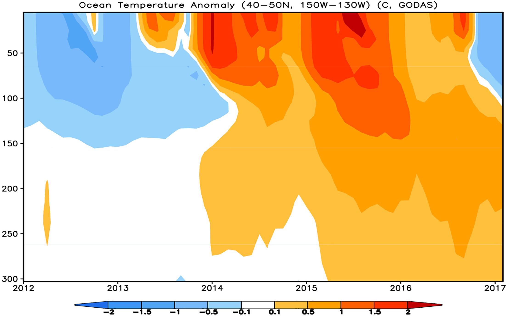
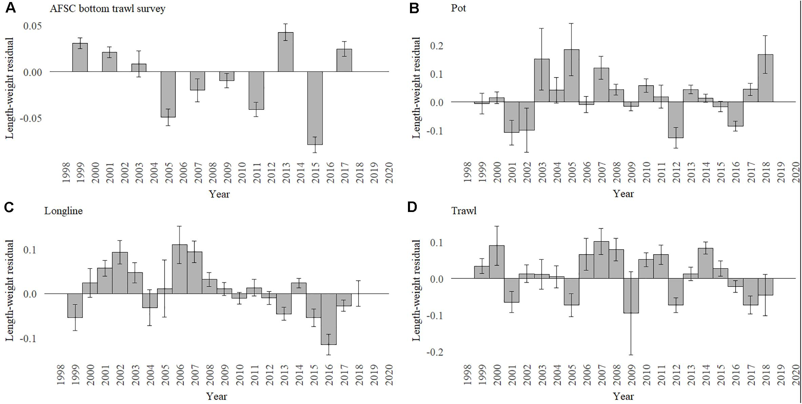

class: top, left

```{r setup, include=FALSE}

options(htmltools.dir.version = FALSE)
knitr::opts_chunk$set(echo = F,
                      fig.retina = 3,
                      #fig.width = 4,
                      #fig.height = 2,
                      fig.asp = 0.45,
                      warning = F,
                      message = F)
#Plotting and data libraries
library(tidyverse)
library(tidyr)
library(here)


```

background-image: url("EDAB_images/SOE-MAFMC-2021-plusgraphicsummary_Page_02.png")
background-size: 500px
background-position: right

## SSC State of the Ecosystem Working Group
.pull-left-60[
Objective: make better use of existing ecosystem information presented each year, and develop more tailored products and processes to use this information in management

Possible tasks for this WG include:  
*  Review and prioritize current ecosystem indicator work (analyses of indicators/groups, thresholds, etc) for the 2022 SOE report or prototype stock specific reports 
*  Develop and test decision frameworks that use ecosystem information in setting Acceptable Biological Catch (ABC) for individual stocks
*  Provide scientific support for MAFMC's comprehensive review and update of EAFM risk assessment, and for the Council's use of SOE and risk assessment in strategic planning.

]

---

## Seeking Council Feedback 

What types of ecosystem data/information, tools, or approaches may be missing or would be informative to help support Council decision making, strategic planning, and priority setting (management and research)?

## Examples

1. The North Pacific Fishery Management Council has used Ecosystem Status Reports to inform OFL and ABC setting for coming years (Bering Sea pollock 2006, Gulf of Alaska cod 2018-2019)
1. California Department of Fish and Wildlife utilizes habitat compression and forage indices to inform their [Risk Assessment and Mitigation Program](https://wildlife.ca.gov/Conservation/Marine/Whale-Safe-Fisheries#559972749-2020-21-season) for humpback whales, blue whales, and Pacific leatherback turtles


.pull-left[

]
.pull-right[

]

