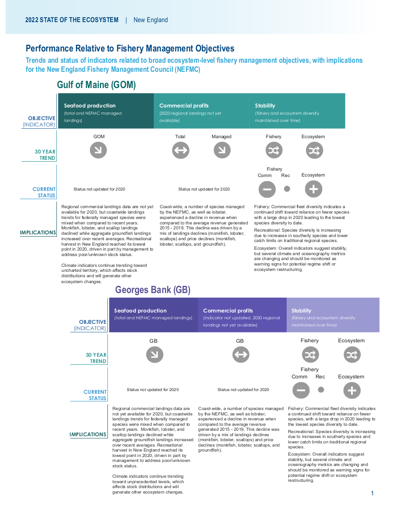
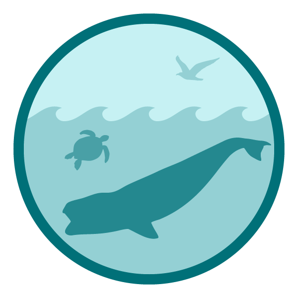

class: top, left

<style>
p.caption {
  font-size: 0.6em;
}
</style>

<style>
.reduced_opacity {
  opacity: 0.5;
}
</style>

```{r setup, include=FALSE}

options(htmltools.dir.version = FALSE)
knitr::opts_chunk$set(echo = F,
                      fig.retina = 3,
                      #fig.width = 4,
                      #fig.height = 2,
                      fig.asp = 0.45,
                      warning = F,
                      message = F)
#Plotting and data libraries
library(tidyverse)
library(tidyr)
library(here)
library(kableExtra)
library(ecodata)
library(readxl); library(data.table)
library(DT)
library(widgetframe)


```

```{r, load_refs, include=FALSE, cache=FALSE}
library(RefManageR)
BibOptions(check.entries = FALSE,
           bib.style = "authoryear",
           cite.style = "authoryear",
           longnamesfirst = FALSE,
           max.names = 1,
           style = "markdown")
myBib <- ReadBib("./MidSOE.bib", check = FALSE)

#,
#           hyperlink = FALSE,
#           dashed = FALSE

```

```{r, code = readLines("https://raw.githubusercontent.com/NOAA-EDAB/ecodata/master/chunk-scripts/human_dimensions_NE.Rmd-setup.R")}
```

```{r, code = readLines("https://raw.githubusercontent.com/NOAA-EDAB/ecodata/master/chunk-scripts/human_dimensions_NE.Rmd-GIS-setup.R")}
```

```{r, code = readLines("https://raw.githubusercontent.com/NOAA-EDAB/ecodata/master/chunk-scripts/macrofauna_NE.Rmd-setup.R")}
```

```{r, code = readLines("https://raw.githubusercontent.com/NOAA-EDAB/ecodata/master/chunk-scripts/LTL_NE.Rmd-setup.R")}
```


# State of the Ecosystem (SOE) reporting
## Improving ecosystem information and synthesis for fishery managers

.pull-left[

- Ecosystem indicators linked to management objectives `r Cite(myBib, "depiper_operationalizing_2017")`
    + Contextual information
    + Report evolving since 2016
    + Fishery-relevant subset of full Ecosystem Status Reports

- Open science emphasis `r Cite(myBib, "bastille_improving_2020")`

]

.pull-right[
*The IEA Loop<sup>1</sup>*


.footnote[
[1] https://www.integratedecosystemassessment.noaa.gov/national/IEA-approach
]
]


---
## State of the Ecosystem: Maintain 2021 structure for 2022
.pull-left[

## 2021 Report
1. Graphical summary
    + Page 1-2 report card re: objectives &rarr;
    + Page 3 risk summary bullets
    + Page 4 synthesis themes
1. Performance relative to management objectives
1. Risks to meeting management objectives

]

.pull-right[

```{r management-objectives}
mng_obj <- data.frame("Objective Categories" = c("Seafood Production",
                                                 "Profits","Recreation",
                                                 "Stability","Social & Cultural",
                                                 "Protected Species",
                                                 "Biomass","Productivity",
                                                 "Trophic structure","Habitat"),
"Indicators reported here" = c("Landings; commercial total and by feeding guild; recreational harvest",
                               "Revenue decomposed to price and volume",
                               "Days fished; recreational fleet diversity",
                               "Diversity indices (fishery and ecosystem)",
                               "Community engagement/reliance status",
                               "Bycatch; population (adult and juvenile) numbers, mortalities",
                               "Biomass or abundance by feeding guild from surveys",
                               "Condition and recruitment of managed species, Primary productivity",
                               "Relative biomass of feeding guilds, Zooplankton",
                               "Estuarine and offshore habitat conditions"))

knitr::kable(mng_obj, linesep = "",
      col.names = c("Objective Categories","Indicators reported here"),
      caption = "Example ecosystem-scale fishery management objectives",
      #align = 'c',
      booktabs = T) %>%
  kable_styling(font_size = 14) %>%
 # kable_styling(latex_options = "hold_position", "scale_down") %>%
 # column_spec(c(2), width = c("25em")) %>%
  row_spec(0, bold = TRUE) %>%
 # group_rows("Provisioning/Cultural", 1,4) %>%
 # group_rows("Supporting/Regulating", 5,9)
  pack_rows("Provisioning and Cultural Services", 1,6) %>%
  pack_rows("Supporting and Regulating Services", 7,10)


```
]

---
## State of the Ecosystem summary 2022

.pull-left[
.center[


]
]

.pull-right[
.center[


]
]

---
## State of the Ecosystem: Risks to Meeting Fishery Management Objectives

.center[

]

---
## Ecosystem synthesis themes

Characterizing ecosystem change for fishery management

* Societal, biological, physical and chemical factors comprise the **multiple system drivers** that influence marine ecosystems through a variety of different pathways. 
* Changes in the multiple drivers can lead to **regime shifts** — large, abrupt and persistent changes in the structure and function of an ecosystem.  
* Regime shifts and changes in how the multiple system drivers interact can result in **ecosystem reorganization** as species and humans respond and adapt to the new environment.

.pull-left[


]

.pull-right[

]

---
## Document Orientation

.pull-left[
Spatial scale

A [glossary of terms](https://noaa-edab.github.io/tech-doc/glossary.html), detailed [technical methods documentation](https://NOAA-EDAB.github.io/tech-doc) and [indicator data](https://github.com/NOAA-EDAB/ecodata) are available online.  
]

.pull-right[
Key to figures
```{r , code = readLines("https://raw.githubusercontent.com/NOAA-EDAB/ecodata/master/chunk-scripts/macrofauna_MAB.Rmd-species-dist.R"), fig.width=5.5, fig.asp=.9}
#species-dist, fig.cap = "Aggregate species distribution metrics for species in the Northeast Large Marine Ecosystem."
```  

.contrib[
Trends assessed only for 30+ years: [more information](https://noaa-edab.github.io/tech-doc/trend-analysis.html)

<p style="color:#FF8C00;">Orange line = significant increase</p>
<p style="color:#9932CC;">Purple line = significant decrease</p>
No color line = not significant or < 30 years
<p style="background-color:#D3D3D3;">Grey background = last 10 years</p>
]
]

---
## Main sections 

.pull-left[
* Performance relative to management objectives
    - *What* does the indicator say--up, down, stable?
    - *Why* do we think it is changing: integrates synthesis themes
        - Multiple drivers
        - Regime shifts
        - Ecosystem reorganization
* Objectives
    - Seafood production
    - Profits
    - Recreational opportunities
    - Stability
    - Social and cultural
    - Protected species
]

.pull-right[
* Risks to meeting fishery management objectives
    - *What* does the indicator say--up, down, stable?
    - *Why* this is important to managers: integrates synthesis themes
        - Multiple drivers
        - Regime shifts
        - Ecosystem reorganization
* Risk categories
    - Climate: warming, ocean currents, acidification
        - Habitat changes (incl. vulnerability analysis)
        - Productivity changes (system and fish)
        - Species interaction changes
        - Community structure changes
    - Other ocean uses
        - Offshore wind development
]


---
# Performance relative to management objectives

.center[
 &nbsp; &nbsp; &nbsp;  &nbsp; &nbsp; &nbsp;  &nbsp; &nbsp; &nbsp;  &nbsp; &nbsp; &nbsp; 
]

---
## Objective: Seafood production  

.pull-left[
Indicators: Commercial landings 

.reduced_opacity[
```{r, code = readLines("https://raw.githubusercontent.com/NOAA-EDAB/ecodata/master/chunk-scripts/human_dimensions_NE.Rmd-comdat-total-landings.R"), fig.asp=.4}
#total-landings, fig.cap = paste0("Total commercial seafood landings (black) and ",region," managed seafood landings (red).")
```
.contrib[
Key: Black = Landings of all species combined; <p style="color:#FF6A6A;">Red = Landings of NEFMC managed species</p>
]
]

Coastwide landings at the Federal fishery management plan (FMP) level were mixed in 2020 when compared to recent years. Landings of groundfish were up, while monkfish and scallop were down.  Lobster landings also decreased in 2020.*
]

.pull-right[
Indicators: Recreational harvest
<br />

```{r, code = readLines("https://raw.githubusercontent.com/NOAA-EDAB/ecodata/master/chunk-scripts/human_dimensions_NE.Rmd-recdat-landings.R"), fig.asp=.4}
#, rec-landings, fig.cap = paste0("Total recreational seafood harvest (millions of fish) in the ",region," region.")

```

```{r , code = readLines("https://raw.githubusercontent.com/NOAA-EDAB/ecodata/master/chunk-scripts/human_dimensions_NE.Rmd-rec_hms.R")}
#, fig.width=5
#rec_hms, fig.cap="Recreational shark landings from Large Pelagics Survey." , fig.width=5, fig.asp=.35

```

*[US Seafood Industry and For-Hire
Sector Impacts from COVID-19: 2020 in Perspective](https://spo.nmfs.noaa.gov/sites/default/files/TM221.pdf) 

]

Multiple drivers: ecosystem and stock production, management, market conditions (including COVID-19 disruptions), and environmental change

???
Although scallop decreases are partially explained by a decreased TAC, analyses suggest that the drop in landings is at least partially due to market disruptions due to the COVID-19 pandemic.
However, we do not anticipate the long-term declining trend in landings to change.

---
## Landings drivers: Stock status? Survey biomass?

.pull-left[
Indicator: Stock status

```{r , code = readLines("https://raw.githubusercontent.com/NOAA-EDAB/ecodata/master/chunk-scripts/human_dimensions_NE.Rmd-stock-status.R"), fig.width = 7.5, fig.asp = 0.5}

#stock-status, fig.cap = paste0("Summary of single species status for ",council_abbr," and jointly federally managed stocks (Goosefish and Spiny dogfish). Stocks in green are below the biomass threshold (overfished), stocks in orange are above the biomass threshold but below the biomass target, and stocks in purple are above the biomass target. Only one stock, Atlantic mackerel, has fishing mortality above the limit (subject to overfishing).")
```
]

.pull-right[
Indicator: Survey biomass
```{r , code = readLines("https://raw.githubusercontent.com/NOAA-EDAB/ecodata/master/chunk-scripts/macrofauna_NE.Rmd-aggregate-biomass-gb.R"), fig.width=8, fig.asp = 0.85}

#nefsc-biomass-mab, fig.cap = "Spring (left) and fall (right) surveyed biomass in the Mid-Atlantic Bight. Data from the NEFSC Bottom Trawl Survey are shown in black, with NEAMAP shown in red. The shaded area around each annual mean represents 2 standard deviations from the mean."
```

]

---
## Implications: Seafood Production
.pull-left[
Drivers:
* decline in commercial landings is most likely driven by the requirement
to rebuild individual stocks as well as market dynamics

* other drivers affecting recreational landings: shark fishery management, possibly survey methodology  

Monitor: 
* climate risks including warming, ocean acidification, and shifting distributions  
* ecosystem composition and production changes  
* fishing engagement  

]

.pull-right[
```{r , code = readLines("https://raw.githubusercontent.com/NOAA-EDAB/ecodata/master/chunk-scripts/macrofauna_MAB.Rmd-species-dist.R"), fig.width=8, fig.asp=.9}
```
]

---
## Objective: Commercial Profits 


Indicator: Commercial Revenue
.reduced_opacity[
```{r , code = readLines("https://raw.githubusercontent.com/NOAA-EDAB/ecodata/master/chunk-scripts/human_dimensions_NE.Rmd-comdat-comm-revenue.R"), fig.width = 7.5, fig.asp = 0.35}

```

.contrib[
Key: Black = Revenue of all species combined; <p style="color:#FF6A6A;">Red = Revenue of NEFMC managed species</p>
]
.pull-left[
Both regions driven by single species
* GOM high revenue despite low volume
* Fluctuations in GB due to rotational management
]
]

.pull-right[
Monitor changes in climate and landings drivers:
* Sea scallops and lobsters are sensitive to ocean warming and acidification

]


---
## Objective: Recreational opportunities  

.pull-left[
Indicators: Recreational effort and fleet diversity   
```{r , code = readLines("https://raw.githubusercontent.com/NOAA-EDAB/ecodata/master/chunk-scripts/human_dimensions_NE.Rmd-recdat-effort.R")}
#rec-op, fig.cap = paste0("Recreational effort in the ",region,".")
```

```{r , code = readLines("https://raw.githubusercontent.com/NOAA-EDAB/ecodata/master/chunk-scripts/human_dimensions_NE.Rmd-recdat-diversity.R")}
#rec-div, fig.cap = paste0("Recreational fleet effort diversity in the ",region,".")
```
]

.pull-right[
Implications

* Absence of a long-term trend in recreational effort suggests relative stability in the overall number of recreational opportunities in New England

]

---
## Objective: Stability  Com ; Rec 

.pull-left[
*Fishery*  Indicators: Commercial fleet count, fleet diversity   

```{r, code = readLines("https://raw.githubusercontent.com/NOAA-EDAB/ecodata/master/chunk-scripts/human_dimensions_NE.Rmd-commercial-div.R"), fig.asp=.9}
```

]

.pull-right[
*Fishery*  Indicators: commerical species revenue diversity, recreational species catch diversity
```{r, code = readLines("https://raw.githubusercontent.com/NOAA-EDAB/ecodata/master/chunk-scripts/human_dimensions_NE.Rmd-commercial-div-species-div.R")}
```

```{r , code = readLines("https://raw.githubusercontent.com/NOAA-EDAB/ecodata/master/chunk-scripts/human_dimensions_NE.Rmd-recdat-div-catch.R")}
#recdat-div-catch, fig.cap = paste0("Diversity of recreational catch in the ",region,".")
```

] 

---
## Objective: Stability  

.pull-left[
*Ecological* Indicators: zooplankton and larval fish diversity
.reduced_opacity[
```{r, code = readLines("https://raw.githubusercontent.com/NOAA-EDAB/ecodata/master/chunk-scripts/LTL_NE.Rmd-zoo-diversity-gb.R")}
```

```{r, code = readLines("https://raw.githubusercontent.com/NOAA-EDAB/ecodata/master/chunk-scripts/macrofauna_NE.Rmd-ichthyo-diversity.R")}
```
]
]

.pull-right[
*Ecological* Indicator: expected number of species, NEFSC bottom trawl survey
```{r , code = readLines("https://raw.githubusercontent.com/NOAA-EDAB/ecodata/master/chunk-scripts/macrofauna_NE.Rmd-exp-n.R")}
#exp-n, fig.cap = "Adult fish diversity the Mid-Atlantic Bight, based on expected number of species."
```

Implications:  
* Commercial fishery diversity driven by small number of species
* Diminished capacity to respond to future fishing opportunities
* Recreational diversity due to species distributions and regulations
* Adult diversity in GOM suggests increase in warm-water species
]

???
* Overall stability in the fisheries and ecosystem components
* Increasing diversity in several indicators warrants continued monitoring

---
## Objective: Environmental Justice and Social Vulnerability

Indicators: Environmental justice vulnerability, commercial fishery engagement and reliance  

.pull-left[
```{r , code = readLines("https://raw.githubusercontent.com/NOAA-EDAB/ecodata/master/chunk-scripts/human_dimensions_NE.Rmd-commercial-engagement.R"), fig.width = 6.5, fig.asp = 0.75}
#commercial-engagement, fig.cap= "Commercial engagement, reliance, and social vulnerability for the top commercial fishing communities in New England."
```
New England commercial fishing communities
]

.pull-right[

```{r, out.width="100%"}
#get rid of the gray excel outline using R package magick
ComEJ <- magick::image_read("EDAB_images/EJ_Commercial_NE.png") 

# from https://stackoverflow.com/questions/64597525/r-magick-square-crop-and-circular-mask
# get height, width and crop longer side to match shorter side
ii <- magick::image_info(ComEJ)

cropComEJ <- ComEJ %>%
  #magick::image_crop(cropComEJ, "820x580+5+5")
  magick::image_crop(paste0(ii$width-10,"x",ii$height-10, "+5+5"))

cropComEJ
```

<!---->
]

Implications: Highlighted communities may be vulnerable to changes in fishing patterns due to regulations and/or climate change. When also experiencing environmental justice issues, they may have lower ability to successfully respond to change.

???
These plots provide a snapshot of the presence of environmental justice issues in the most highly engaged and most highly reliant commercial and recreational fishing communities in the Mid-Atlantic. These communities may be vulnerable to changes in fishing patterns due to regulations and/or climate change. When any of these communities are also experiencing social vulnerability including environmental justice issues, they may have lower ability to successfully respond to change. 

---
## Objective: Environmental Justice and Social Vulnerability

Indicators: Environmental justice vulnerability, recreational fishery engagement and reliance

.pull-left[
```{r , code = readLines("https://raw.githubusercontent.com/NOAA-EDAB/ecodata/master/chunk-scripts/human_dimensions_NE.Rmd-recreational-engagement.R"), fig.width = 6.5, fig.asp = 0.75}
#recreational-engagement, fig.cap= "Recreational engagement, reliance, and social vulnerability for the top recreational fishing communities in New England."
```
New England recreational fishing communities
]

.pull-right[
```{r, out.width="100%"}
#get rid of the gray excel outline using R package magick
RecEJ <- magick::image_read("EDAB_images/EJ_Recreational_NE.png") 

# from https://stackoverflow.com/questions/64597525/r-magick-square-crop-and-circular-mask
# get height, width and crop longer side to match shorter side
ii <- magick::image_info(RecEJ)

cropRecEJ <- RecEJ %>%
  #magick::image_crop(cropComEJ, "820x580+5+5")
  magick::image_crop(paste0(ii$width-10,"x",ii$height-10, "+5+5"))

cropRecEJ
```

<!----> 
]

Implications: Highlighted communities may be vulnerable to changes in fishing patterns due to regulations and/or climate change. When also experiencing environmental justice issues, they may have lower ability to successfully respond to change.

---
## Objectives: Protected species *Maintain bycatch below thresholds*  

.pull-left[
Indicators: Harbor porpoise and gray seal bycatch
.reduced_opacity[
```{r, code = readLines("https://raw.githubusercontent.com/NOAA-EDAB/ecodata/master/chunk-scripts/macrofauna_MAB.Rmd-harborporpoise.R"), fig.height=3}
```

```{r, code = readLines("https://raw.githubusercontent.com/NOAA-EDAB/ecodata/master/chunk-scripts/macrofauna_MAB.Rmd-grayseal.R"), fig.height=3}
```
]
]

.pull-right[
Implications: 

* Currently meeting objectives

* The downward trend in harbor porpoise bycatch can also be due to a decrease in harbor porpoise abundance in US waters, reducing their overlap with fisheries, and a decrease in gillnet effort. 

* The increasing trend in gray seal bycatch may be related to an increase in the gray seal population (U.S. pup counts).
]

---
## Objectives: Protected species *Recover endangered populations*  

.pull-left[
Indicators: North Atlantic right whale population, calf counts
```{r, code = readLines("https://raw.githubusercontent.com/NOAA-EDAB/ecodata/master/chunk-scripts/macrofauna_MAB.Rmd-narw-abundance.R"), fig.height=3}
```

```{r, code = readLines("https://raw.githubusercontent.com/NOAA-EDAB/ecodata/master/chunk-scripts/macrofauna_MAB.Rmd-NARW-calf-abundance.R"), fig.height=3}
```
]

.pull-right[
Implications:  

* Population drivers for North Atlantic Right Whales (NARW) include combined fishery interactions/ship strikes, distribution shifts, and copepod availability.

* Additional potential stressors include offshore wind development, which overlaps with important habitat areas used year-round by right whales, including mother and calf migration corridors and foraging habitat.

* Unusual mortality events continue for 3 large whale species.
]


---
# Risks to meeting fishery management objectives

.center[
 &nbsp; &nbsp; &nbsp; 
] 

.center[
 &nbsp; &nbsp; &nbsp;  &nbsp; &nbsp; &nbsp;  &nbsp; &nbsp; &nbsp;   &nbsp; &nbsp; &nbsp;  
]

---
background-image: url("EDAB_images/seasonal-sst-anom-gridded-1.png")
background-size: 600px
background-position: right

## Risks: Climate change
.pull-left[
Indicators: ocean currents, bottom and surface temperature
```{r, code = readLines("https://raw.githubusercontent.com/NOAA-EDAB/ecodata/master/chunk-scripts/LTL_MAB.Rmd-gsi.R"), fig.width=4}
```

```{r , code=readLines("https://raw.githubusercontent.com/NOAA-EDAB/ecodata/master/chunk-scripts/LTL_NE.Rmd-slopewater.R"), fig.width=4}
```

```{r , code=readLines("https://raw.githubusercontent.com/NOAA-EDAB/ecodata/master/chunk-scripts/LTL_NE.Rmd-bottom-temp.R"), fig.width=6}
```
]


---
## Risks: Climate change
.pull-left[
Indicators: marine heatwaves
```{r , code=readLines("https://raw.githubusercontent.com/NOAA-EDAB/ecodata/master/chunk-scripts/LTL_NE.Rmd-heatwave-year-gb.R"), fig.width=5, fig.asp=.6}

```

```{r , code=readLines("https://raw.githubusercontent.com/NOAA-EDAB/ecodata/master/chunk-scripts/LTL_NE.Rmd-heatwave-year-gom.R"), fig.width=5, fig.asp=.6}

```
]

.pull-right[
<br />
```{r, code = readLines("https://raw.githubusercontent.com/NOAA-EDAB/ecodata/master/chunk-scripts/LTL_NE.Rmd-heatwave-gb.R")}
```

```{r, code = readLines("https://raw.githubusercontent.com/NOAA-EDAB/ecodata/master/chunk-scripts/LTL_NE.Rmd-heatwave-gom.R")}
```

]

---
## Risks: Climate change and offshore habitat

.pull-left[
Indicator: cold pool indices
```{r , code=readLines("https://raw.githubusercontent.com/NOAA-EDAB/ecodata/master/chunk-scripts/LTL_MAB.Rmd-cold_pool.R")}
```

Indicator: Ocean acidification


]

.pull-right[

Indicator: warm core rings
```{r , code=readLines("https://raw.githubusercontent.com/NOAA-EDAB/ecodata/master/chunk-scripts/LTL_MAB.Rmd-wcr.R")}
```

.center[
 
]
]


---
## Risks: Ecosystem productivity

Indicators: chlorophyll, primary production

.pull-left[
```{r , code=readLines("https://raw.githubusercontent.com/NOAA-EDAB/ecodata/master/chunk-scripts/LTL_NE.Rmd-chl-weekly.R"), fig.asp = 0.5}
#chl-weekly, fig.cap = "Weekly chlorophyll concentrations and primary productivity in New England are shown by the colored line for 2021 (dashed portion indicates preliminary data from a near real-time satellite source). The long-term mean is shown in black and shading indicates +/- 1 standard deviation.", fig.width = 5
```

]

.pull-right[

```{r , code=readLines("https://raw.githubusercontent.com/NOAA-EDAB/ecodata/master/chunk-scripts/LTL_NE.Rmd-weekly-phyto-size.R"), fig.asp=.55}
#weekly-phyto-size, fig.cap="The annual climatology (1998-2019) percent composition of the phytoplankton size classes in New England bight based on satellite observations."
```

]

Implications: increased production by smaller phytoplankton implies less efficient transfer of primary production to higher trophic levels. Monitor implications of increasing gelatinous zooplankton and krill.
  
???
Below average phytoplankton biomass could be due to reduced nutrient flow to the surface and/or increased grazing pressure. A short fall bloom was detected in November. Primary productivity (the rate of photosynthesis) was average to below average throughout 2021

---
## Risks: Ecosystem productivity

```{r , code=readLines("https://raw.githubusercontent.com/NOAA-EDAB/ecodata/master/chunk-scripts/macrofauna_MAB.Rmd-energy-density.R"), out.width = "90%", fig.asp = 0.5}
#energy-density, fig.cap="Forage fish mean energy density mean and standard deviation by season and year, compared with 1980s (Steimle and Terranove 1985) and 1990s (Lawson et al. 1998) values.", 
```

Implications: fluctuating environmental conditions and prey for forage species affect both abundance and energy content. Energy content varies by season, and has changed over time most dramatically for Atlantic herring

---
## Risks: Ecosystem productivity

Indicator: fish condition

.pull-left[
Georges Bank
```{r, out.width="120%"}
#knitr::include_graphics("EDAB_images/MAB_Condition_allsex_2022_viridis.jpg")
fishcond <- magick::image_read("EDAB_images/GB_Condition_allsex_2022_viridis.jpg") 
magick::image_trim(fishcond)
```
]

.pull-right[
Gulf of Maine
```{r, out.width="120%"}
#knitr::include_graphics("EDAB_images/MAB_Condition_allsex_2022_viridis.jpg")
fishcond <- magick::image_read("EDAB_images/GOM_Condition_allsex_2022_viridis.jpg") 
magick::image_trim(fishcond)
```

]

Implications: Many species in New England showed improved condition in 2021. Preliminary results of synthetic analyses show that changes in temperature, zooplankton, fishing pressure, and population size influence the condition of different fish species.

---
## Risks: Ecosystem productivity

Indicator: fish productivity anomaly

.pull-left[
```{r productivity-anomaly-gb, fig.cap = "Small fish per large fish biomass anomaly on Georges Bank. The summed anomaly across species is shown by the black line.", code=readLines("https://raw.githubusercontent.com/NOAA-EDAB/ecodata/master/chunk-scripts/macrofauna_NE.Rmd-productivity-anomaly-gb.R"), fig.width=7, fig.asp=.6}
```
]

.pull-right[
```{r productivity-anomaly-gom, fig.cap = "Small fish per large fish biomass anomaly in the Gulf of Maine. The summed anomaly across species is shown by the black line.", code=readLines("https://raw.githubusercontent.com/NOAA-EDAB/ecodata/master/chunk-scripts/macrofauna_NE.Rmd-productivity-anomaly-gom.R"), fig.width=7, fig.asp=.6}
```
]

---
## Risks: Ecosystem structure

Indicators: distribution shifts, diversity, predator status and trends
.pull-left[
*No trend in aggregate sharks*
```{r , code=readLines("https://raw.githubusercontent.com/NOAA-EDAB/ecodata/master/chunk-scripts/macrofauna_MAB.Rmd-hms-cpue-sharks.R")}
#hms-cpue-sharks, fig.cap="Estimated number of sharks per unit effort from Highly Migratory Species Pelagic Observer Program data."
```
]

.pull-right[
*HMS populations mainly at or above target*
```{r , code=readLines("https://raw.githubusercontent.com/NOAA-EDAB/ecodata/master/chunk-scripts/human_dimensions_MAB.Rmd-hms-stock-status.R")}
```

]

---
## Risks: Ecosystem structure

Indicators: predators

.pull-left[
```{r , code = readLines("https://raw.githubusercontent.com/NOAA-EDAB/ecodata/master/chunk-scripts/macrofauna_NE.Rmd-seal-pups.R"), fig.width=7, fig.asp = .7}
```

]

.pull-right[
*Gray seals increasing*
* Breeding season ~ 27,000 US gray seals, Canada's population ~ 425,000 (2016) 
* Canada's population increasing at ~ 4% per year
* U.S. pupping sites increased from 1 (1988) to 9 (2019)
* Harbor and gray seals are generalist predators that consume more than 30 different prey species: red, white and silver hake, sand lance, yellowtail flounder, four-spotted flounder, Gulf-stream flounder, haddock, herring, redfish, and squids.

Implications: stable predator populations suggest stable predation pressure on managed species, but increasing predator populations may reflect increasing predation pressure.
]

---
## Risks: Habitat climate vulnerability

Indicators: climate sensitive species life stages mapped to climate vulnerable habitats  

```{r , message=FALSE}
#Read in habitat table

ne <- as.data.table(readxl::read_xlsx('habitat_vulnerability.xlsx',
                         sheet = 'New England', skip = 1))

#Identify individual species climate vulnerability
vhigh.vul <- unique(ne[`Species Vulnerability Rank (FCVA)` == 'Very high', Species])
high.vul  <- unique(ne[`Species Vulnerability Rank (FCVA)` == 'High', Species])
mod.vul   <- unique(ne[`Species Vulnerability Rank (FCVA)` == 'Moderate', Species])
low.vul   <- unique(ne[`Species Vulnerability Rank (FCVA)` == 'Low', Species])

#Grab habitat vulnerability 
hab.vul <- unique(ne[, c('Habitat Name', 'Habitat Vulnerability Rank (HVCA)')])
habitats <- hab.vul[, 'Habitat Name']
hab.vul <- data.table('Habitat Vulnerability' = c(NA, NA, t(hab.vul[, 'Habitat Vulnerability Rank (HVCA)'])))

#Rearrange table
ne <- data.table::melt.data.table(ne, id.vars = c('Habitat Name', 'Species'),
                                   measure.vars = c('Eggs/Larva', 'Juvenile/YOY',
                                                    'Adult', 'Spawning Adult'),
                                   variable.name = 'Stage', value.name = 'Dependence')
ne[, Habitat := as.factor(ne$'Habitat Name')]
ne <- data.table::dcast.data.table(ne, Species + Stage ~ Habitat,
                                    value.var = 'Dependence')
setcolorder(ne, c('Species', 'Stage', habitats$'Habitat Name'))

#Add Habitat Vulnerbaility
#hab.table <- rbindlist(list(as.data.table(t(hab.vul)), ne), use.names = F)
hab.table <- ne
#Add names back in
names(hab.table) <- names(ne)
hab.table <- hab.table %>% mutate_if(is.character, str_trim)

#from examples here https://rstudio.github.io/DT/010-style.html

#color coding cells works
#need to add column with species vulnerability and color code species by it but not show it, like #hideV6 example at link
#if we show it we can sort by species vulnerability though... alphabetical doesnt work so use numbers to go lowest-highest
#still need to color code headers
hab.table <- hab.table %>%
  mutate(spVul = #Color code species based on climate vul
    # case_when(Species %in% low.vul ~ "low.vul",
    #           Species %in% mod.vul ~ "mod.vul",
    #           Species %in% high.vul ~ "high.vul",
    #           Species %in% vhigh.vul ~ "vhigh.vul")
    # )
    case_when(Species %in% low.vul ~ 1,
              Species %in% mod.vul ~ 2,
              Species %in% high.vul ~ 3,
              Species %in% vhigh.vul ~ 4)
    )

colnames(hab.table)[c(3:4)] <- paste0('<span style="box-shadow: -10px 0 0 red, 10px 0 0 red; background-color:red; color:white">',colnames(hab.table)[c(3:4)],'</span>')
colnames(hab.table)[c(5:9)] <- paste0('<span style="box-shadow: -10px 0 0 orange, 10px 0 0 orange; background-color:',c("orange"),'">',colnames(hab.table)[c(5:10)],'</span>')
colnames(hab.table)[c(10:14)] <- paste0('<span style="box-shadow: -10px 0 0 yellow, 10px 0 0 yellow; background-color:',c("yellow"),'">',colnames(hab.table)[c(11:15)],'</span>')

dt <- datatable(hab.table, rownames = FALSE, escape = FALSE,
          extensions = c('Scroller', 'FixedColumns'), #add scrolling and fixed column
          options = list(deferRender = TRUE,
          scrollY = 300, scroller = TRUE,
          dom = 't',scrollX = TRUE,fixedColumns = TRUE)
          #, options = list(columnDefs = list(list(targets = 16, visible = FALSE)))
  ) %>% 
  formatStyle(
    names(hab.table)[3:4],
    backgroundColor = '#FF000080'
  ) %>%
  formatStyle(
    names(hab.table)[5:9],
    backgroundColor = '#FFA50080'
  ) %>%
  formatStyle(
    names(hab.table)[10:14],
    backgroundColor = '#FFFF0080'
  ) %>%

  formatStyle(#Color code base on dependence
    'Species', "spVul",
    backgroundColor = styleEqual(#c("low.vul", "mod.vul", "high.vul", "vhigh.vul"),
                                 c(1,2,3,4),
                                 c('lightgreen', 'yellow', 'orange', 'red')), #Color code base on dependence)
    color = styleEqual(c(1,2,3,4),
                                 c('black', 'black', 'black', 'white'))
    ) %>%
    formatStyle(
    names(hab.table),
    backgroundColor = styleEqual(c("Low", "Moderate", "High", "Very high"), 
                                 c('lightgreen', 'yellow', 'orange', 'red')), 
    color = styleEqual(c("Low", "Moderate", "High", "Very high"), 
                                 c('black', 'black', 'black', 'white'))
  )

frameWidget(dt)
```

---
background-image: url("EDAB_images/offshore_wind_timeline.png")
background-size: 500px
background-position: right

## Risks: Offshore Wind Development

.pull-left[
Indicators: development timeline

```{r, code = readLines("https://raw.githubusercontent.com/NOAA-EDAB/ecodata/master/chunk-scripts/human_dimensions_MAB.Rmd-wind-proposed-dev.R"), fig.height=3}
```
]

---
## Risks: Offshore Wind Development
Indicators: fishery and community specific revenue in lease areas

.pull-left[
```{r, code=readLines("https://raw.githubusercontent.com/NOAA-EDAB/ecodata/master/chunk-scripts/human_dimensions_NE.Rmd-wea-spp-rev.R")}
#, fig.width=5, fig.asp=.4
#wea-spp-rev, fig.cap="Wind energy revenue in New England."
```
]

.pull-right[
```{r, code = readLines("https://raw.githubusercontent.com/NOAA-EDAB/ecodata/master/chunk-scripts/human_dimensions_NE.Rmd-wind-port.R"), fig.asp=1.1}
```
]

---
background-image: url("EDAB_images/NARW_hotpsot_persistence_2_1_2022_TPW.png")
background-size: 500px
background-position: right

## Risks: Offshore Wind Development

.pull-left[
Implications: 
*  2-69% of port revenue from fisheries currently comes from areas proposed for offshore wind development. Some communities have environmental justice concerns and gentrification vulnerability.
*  Up to 12% of annual commercial landings and revenue for major New England species occur in lease areas.
*  Development will affect species differently, negatively affecting species that prefer soft bottom habitat while potentially benefiting species that prefer hard structured habitat.
*  Planned wind areas overlap with one of the only known right whale foraging habitats, and altered local oceanography could affect right whale prey availability. Development also brings increased vessel strike risk and the potential impacts of pile driving noise.
]
.pull-right[]

???
Current plans for rapid buildout of offshore wind in a patchwork of areas spreads the impacts differentially throughout the region 
Evaluating the impacts to scientific surveys has begun.

---
background-image: url("EDAB_images/noaa-iea.png")
background-size: 350px
background-position: right bottom

## Contributors - THANK YOU!

The New England and Mid-Atlantic SOEs made possible by (at least) 61 contributors from 14 institutions 

.pull-left[
.contrib[
Kimberly Bastille<br>
Aaron Beaver (Anchor QEA)<br>
Andy Beet<br>
Ruth Boettcher (Virginia Department of Game and Inland Fisheries)<br>
Mandy Bromilow (NOAA Chesapeake Bay Office)<br>
Zhuomin Chen (Woods Hole Oceanographic Institute)<br>
Joseph Caracappa<br>
Doug Christel (GARFO)<br>
Patricia Clay<br>
Lisa Colburn<br>
Jennifer Cudney (NMFS Atlantic HMS Management Division)<br>
Tobey Curtis (NMFS Atlantic HMS Management Division)<br>
Geret DePiper<br>
Dan Dorfman (NOAA-NOS-NCCOS)<br>
Emily Farr (NMFS Office of Habitat Conservation)<br>
Michael Fogarty<br>
Paula Fratantoni<br>
Kevin Friedland<br>
Marjy Friedrichs (VIMS)<br>
Sarah Gaichas<br>
Ben Galuardi (GARFO)<br>
Avijit Gangopadhyay (School for Marine Science and Technology, University of Massachusetts Dartmouth)<br>
James Gartland (Virginia Institute of Marine Science)<br>
Glen Gawarkiewicz (Woods Hole Oceanographic Institution)<br>
Sean Hardison<br>
Kimberly Hyde<br>
John Kosik<br>
Steve Kress (National Audubon Society’s Seabird Restoration Program)<br>
Young-Oh Kwon (Woods Hole Oceanographic Institute)<br>

]
]

.pull-right[
.contrib[
Scott Large<br>
Andrew Lipsky<br>
Sean Lucey<br>
Don Lyons (National Audubon Society’s Seabird Restoration Program)<br>
Chris Melrose<br>
Shannon Meseck<br>
Ryan Morse<br>
Brandon Muffley (MAFMC)<br>
Kimberly Murray<br>
Chris Orphanides<br>
Richard Pace<br>
Tom Parham (Maryland DNR)
Charles Perretti<br>
CJ Pellerin (NOAA Chesapeake Bay Office)<br>
Grace Roskar (NMFS Office of Habitat Conservation)<br>
Grace Saba (Rutgers)<br>
Vincent Saba<br>
Chris Schillaci (GARFO)<br>
Dave Secor (CBL)<br>
Angela Silva<br>
Adrienne Silver (UMass/SMAST)<br>
Emily Slesinger (Rutgers University)<br>
Laurel Smith<br>
Talya tenBrink (GARFO)<br>
Bruce Vogt (NOAA Chesapeake Bay Office)<br>
Ron Vogel (UMD Cooperative Institute for Satellite Earth System Studies and NOAA/NESDIS Center for Satellite Applications and Research)<br>
John Walden<br>
Harvey Walsh<br>
Changhua Weng<br>
Mark Wuenschel  

]
]


---
## References

.contrib[
```{r refs, echo=FALSE, results="asis"}
PrintBibliography(myBib)
```
]


## Additional resources
.pull-left[
* [ecodata R package](https://github.com/noaa-edab/ecodata)

* Visualizations:
  * [New England Human Dimensions indicators](http://noaa-edab.github.io/ecodata/human_dimensions_NE)
  * [New England Macrofauna indicators](http://noaa-edab.github.io/ecodata/macrofauna_NE)
  * [New England Lower trophic level indicators](https://noaa-edab.github.io/ecodata/LTL_NE)
]
.pull-right[
* [SOE Technical Documentation](https://noaa-edab.github.io/tech-doc)

* [Draft indicator catalog](https://noaa-edab.github.io/catalog/)

.contrib[

* Slides available at https://noaa-edab.github.io/presentations
* Contact: <Sean.Lucey@noaa.gov>
]
]

---
background-image: url("EDAB_images/NEFMC-2022cover.png")
background-size: 600px
background-position: right

# Discussion
<br />
<br />
<br />
<br />
# Thank you!
]


