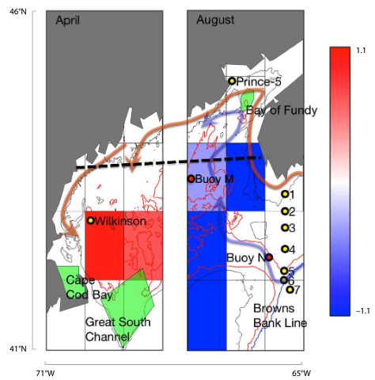

class: top, left

```{r setup, include=FALSE}

options(htmltools.dir.version = FALSE)
knitr::opts_chunk$set(echo = F,
                      warning = F,
                      message = F)
#Plotting and data libraries
library(ggplot2)
library(dplyr)
library(tidyr)
library(ecodata)
library(here)
library(kableExtra)
library(ggrepel)
library(stringr)
library(patchwork)
library(grid)
library(plotly)
library(vegan)
library(rpart)
library(colorRamps)

#GIS libraries
library(sf)
library(rgdal)
library(raster)
library(rnaturalearth)

data.dir <- here::here("data")
r.dir <- here::here("R")

#Time series constants
shade.alpha <- 0.3
shade.fill <- "lightgrey"
lwd <- 1
pcex <- 2
trend.alpha <- 0.5
trend.size <- 2
hline.size <- 1
hline.alpha <- 0.35
hline.lty <- "dashed"
label.size <- 5
hjust.label <- 1.5
letter_size <- 4
feeding.guilds <- c("Apex Predator","Piscivore","Planktivore","Benthivore","Benthos")
x.shade.min <- 2009
x.shade.max <- 2018
map.lwd <- 0.4
#Function for custom ggplot facet labels
label <- function(variable,value){
  return(facet_names[value])
}

#facet names for titles
facet_names <- list("Apex predators" = expression("Apex predators"),
                    "Piscivores" = expression("Piscivores"),
                    "Planktivores" = expression("Planktivores"),
                    "Benthivores" = expression("Benthivores"),
                    "Benthos" = expression("Benthos"))
#CRS
crs <- "+proj=longlat +lat_1=35 +lat_2=45 +lat_0=40 +lon_0=-77 +x_0=0 +y_0=0 +datum=NAD83 +no_defs +ellps=GRS80 +towgs84=0,0,0"

#Coastline shapefile
coast <- ne_countries(scale = 10,
                          continent = "North America",
                          returnclass = "sf") %>%
             sf::st_transform(crs = crs)

#State polygons
ne_states <- ne_states(country = "united states of america",
                                      returnclass = "sf") %>%
  sf::st_transform(crs = crs)

#high-res polygon of Maine
#new_england <- read_sf(gis.dir,"new_england")

#EPU shapefile
epu_sf <- ecodata::epu_sf %>% 
  filter(EPU %in% c("MAB","GB","GOM"))
```

## Zooplankton abundance and North Atlantic Right Whale range shifts

```{r, out.width = "100%", fig.align="center"}
knitr::include_graphics("20190522_Audubon_Hardison_images/record-et-al.png")
```

*Record et al. 2019* examines the role of warming deepwater in western Gulf of Maine on *Calanus finmarchicus* and North Atlantic right whale

**North Atlantic right whale distributions affected by climate driven changes in *C. finmarchicus* abundance in western Gulf of Maine**

---
## Zooplankton abundance and North Atlantic Right Whale range shifts

.pull-left[
**Western GOM**
* Recent *C. finmarchicus* abundance in W. GOM has been highest ever in recent years
  * Why? *C. finmarchicus* supplied by highly productive Maine Coastal Current can reproduce rapidly and mediate effects of warming.
  * NARW + *C. finmarchicus* conditions remain favorable in W. GOM
]

.pull-right[
```{r, out.width = "100%", fig.align="center"}

```
.image-cap[
Significant abundance changes in *Calanus* shown in blue (negative) and red (positive). ([Record et al. 2019](https://cloudup.com/iFB8decQWOs))
  ]
]


---
## Zooplankton abundance and North Atlantic Right Whale range shifts

.pull-left[
**Eastern GOM**
* Deepwater warming contributes to high mortality of dormant copepods
* More Gulf Stream influence in Gulf means less supply of copepods into GOM

**The result? NARWs favor western GOM and Canadian waters for foraging.**
]

.pull-right[
```{r, out.width = "100%", fig.align="center"}

```
.image-cap[
Significant abundance changes in *Calanus* shown in blue (negative) and red (positive). ([Record et al. 2019](https://cloudup.com/iFB8decQWOs))
  ]
]
