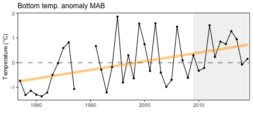

class: top, left

```{r setup, include=FALSE}

options(htmltools.dir.version = FALSE)
knitr::opts_chunk$set(echo = F,
                      fig.retina = 3,
                      warning = F,
                      message = F)
#Plotting and data libraries
library(tidyverse)
library(tidyr)
library(here)
library(kableExtra)
library(ecodata)
```

```{r, load_refs, include=FALSE, cache=FALSE}
library(RefManageR)
BibOptions(check.entries = FALSE,
           bib.style = "authoryear",
           cite.style = "authoryear",
           style = "markdown")
myBib <- ReadBib("./DeepUncertaintyMSE.bib", check = FALSE)

#,
#           hyperlink = FALSE,
#           dashed = FALSE

```

# State of the Ecosystem (SOE) reporting
## Improving ecosystem information and synthesis for fishery managers

.pull-left[

- Ecosystem synthesis approaches
    + General themes
    + Concrete worked example analysis

- Response memo review

- SSC discussion and feedback
    + Decisions where SOE report could help
    + Synthesis themes and management connections
    + Suggestions for 2021+
]

.pull-right[
*The IEA Loop<sup>1</sup>*

]

.footnote[
[1] https://www.integratedecosystemassessment.noaa.gov/national/IEA-approach
]

???
Meeting Purpose:
● Deliver emerging science and improve cross-jurisdictional collaboration to improve
fishery management decisions
● Lead forums that bring the management and science communities together to learn
about the latest fisheries and habitat science, discuss management implications, identify
new science priorities, and identify funding opportunities
Presentation Content:
● Keep in mind - we want to ensure presentations are palatable and engaging for a broad
membership audience.
● Points of focus:
○ Importance of research
○ Key findings or updates
○ Connections to management implications
○ New arising questions and next steps
● Points to generally avoid:
○ Technical slides focusing on project methodology
■ Feel free to still include method slides (at the end of your presentation) to
have as an available resource during group discussion
---
## 2020 Summary 2 pager with visualizations, ~28 pages of narrative

.pull-left[
.center[

]
]

.pull-right[
.center[

]
]


---
background-image: url("EDAB_images/Framework.png")
background-size: 540px
background-position: right

## Mid-Atlantic Council Ecosystem Approach
.pull-left-60[
2016 EAFM Policy Guidance document; revised 2019<sup>1</sup> 

2016 MAFMC EAFM framework<sup>2</sup>

2017 Inital EAFM risk assessment completed; revised and published 2018<sup>3</sup>

2018 Council selected summer flounder as high risk fishery

2019 EAFM conceptual model linking summer flounder drivers and risks

2020 Council starting EAFM MSE for summer flounder recreational discards

SOE indicators to be used for annual risk assessment updates

But can the SSC get more from the SOE and risk assessment?
]
.pull-right-40[
.footnote[
[1] http://www.mafmc.org/s/EAFM-Doc-Revised-2019-02-08.pdf  
[2] https://www.frontiersin.org/articles/10.3389/fmars.2016.00105/full  
[3] https://www.frontiersin.org/articles/10.3389/fmars.2018.00442/full
]
]

???
The Council’s EAFM framework has similarities to the IEA loop on slide 2. It uses risk assessment as a first step to prioritize combinations of managed species, fleets, and ecosystem interactions for consideration. Second, a conceptual model is developed identifying key environmental, ecological, social, economic, and management linkages for a high-priority fishery. Third, quantitative modeling addressing Council-specified questions and based on interactions identified in the conceptual model is applied to evaluate alternative management strategies that best balance management objectives. As strategies are implemented, outcomes are monitored and the process is adjusted, and/or another priority identified in risk assessment can be addressed. 

---
background-image: url("EDAB_images/nes-components-abstracted.png")
background-size: 700px
background-position: right bottom

## State of the Ecosystem (SOE) Reporting: Context for busy people

*"So what?" --John Boreman, September 2016*

1. Clear linkage of ecosystem indicators with management objectives

1. Synthesis across indicators for big picture

1. Objectives related to human-well being placed first in report

1. Short (< 30 pages), non-technical (but rigorous) text

1. Emphasis on reproducibility 


???
In 2016, we began taking steps to address these common critiques of the ESR model


---
## State of the Ecosystem: Structure
.pull-left[

### 2020 Report
1. Summary 2 pager
1. Human dimensions
1. Protected species
1. Fish and invertebrates (managed and otherwise)
1. Habitat quality and ecosystem productivity

### 2021 Possibilities
1. Summary 2 pager
    + Page 1 summary bullets
    + Page 2 synthesis themes
1. Provisioning and cultural services indicators
1. Supporting and regulating services indicators

]

.pull-right[

*Established ecosystem-scale objectives*

```{r management-objectives}
mng_obj <- data.frame("Objective Categories" = c("Seafood Production",
                                                 "Profits","Recreation",
                                                 "Social & Cultural", "Stability",
                                                 "Biomass","Productivity",
                                                 "Trophic structure","Habitat"),
"Indicators reported here" = c("Landings by feeding guild","Revenue decomposed to price and volume",
                               "Days fished; recreational catch",
                               "Commercial engagement trends",
                               "Diversity indices (fishery and species)",
                               "Biomass or abundance by feeding guild from surveys",
                               "Condition and recruitment of managed species, Primary productivity",
                               "Relative biomass of feeding guilds, Zooplankton",
                               "Estuarine and offshore habitat conditions"))

#knitr::kable(mng_obj, linesep = "",
mng_obj %>%
      #col.names = c("Objective Categories","Indicators reported here") %>%
      #caption = "Established ecosystem-scale objectives in the Mid-Atlantic Bight",
      #align = 'c',
      #booktabs = T) %>%
  #kable_styling(latex_options = "hold_position", "scale_down") %>%
 # column_spec(c(2), width = c("25em")) %>%
  kable(format = "html", escape = F, #table.attr='class="risktable"',
        col.names = c("Objective Categories","Indicators reported here")) %>%
  kable_styling(font_size = 14) %>%
  row_spec(0, bold = TRUE) %>%
  group_rows("Provisioning/Cultural", 1,4) %>%
  group_rows("Supporting/Regulating", 5,9)


```
]

---
## Proposed ecosystem synthesis themes for 2021

Characterizing ecosystem change for fishery management: plain language summary for 2 pager

* Multiple drivers of abundance, defined by the competing factors that influence the amount of fish in the ocean; 
* Regime shifts, or ecosystem change can happen rapidly as multiple drivers change; and, 
* Reorganization of the ecosystem, multiple factors that interact that change the structure and organization of the ecosystem, e.g. Tropicalization

## Synthetic analysis in progress: environment - fish condition - market price linkages

   

* Identify multiple and changing drivers of condition and market prices over time
* Recognize regime shifts and potential system reorganization

---
## Sustained Interest in Estuarine Water Quality and Resource Impacts

.pull-left[
*Chesapeake Bay water quality update--2020* 
```{r cb-salinity,fig.width = 5, fig.asp = 0.45, fig.cap = "Salinity in Chesapeake Bay throughout 2018 (blue) and 2019 (red)  as well as the daily average 2008-2019 (black) and the full observed range 2008-2019 (gray shading)."}

ches_sal<-ecodata::ch_bay_sal %>% 
  filter(!Var == "UTCTime") %>% 
  drop_na() %>%
  mutate(Time =  as.numeric(str_sub(Time, 2, -1)),
         Time1 = as.Date(Time, origin = "2018-12-31")) %>% 
  pivot_wider(names_from = Var, values_from = Value)

ches_sal %>% 
  ggplot() +
  geom_ribbon(aes(x = Time1, ymin = AvgMinLim, ymax = AvgMaxLim))+
  geom_ribbon(aes(x = Time1, ymin = MinDataLim, ymax = MaxDataLim), alpha = 0.3)+
  geom_line(aes(x = Time1, y = Daily18), color = "blue") +
  geom_line(aes(x = Time1, y = Daily19), color = "red") +
  ylab(expression("PSU")) +
  ggtitle("Chesapeake Bay Salinity") +
  theme_ts()
```

High precipitation let to extreme low salinity event in spring 2019

<br />
 
## What spatial scale to combine NERR data?

## What indicators of most interest?

## Use existing thresholds?

]

.pull-right[
*How best to incorporate NERR data?*


]

---
## Synthesis analysis refinements for SSC and Council decisions?

.pull-left[

]

.pull-right[

]

Conceptual model links indicators in the report with management objectives.

A subset of objectives are currently under investigation using GAMs and hedonic price functions. We plan to extend this work with structural equation modeling and or other methods in 2020. 

---
## 2021 Chesapeake update: extend to other Mid-Atlantic estuaries?

---
## References

```{r refs, echo=FALSE, results="asis"}
PrintBibliography(myBib)
```


## Additional resources
.pull-left[
[Alaska multispecies and ecosystem models](https://www.integratedecosystemassessment.noaa.gov/regions/alaska/ebs-integrated-modeling)

[California Current Future Seas MSEs](https://www.integratedecosystemassessment.noaa.gov/regions/california-current/cc-projects-future-seas)
]
.pull-right[
[Mid-Atlantic ecosystem approach](https://www.mafmc.org/eafm)

[New England example fishery ecosystem plan](https://s3.amazonaws.com/nefmc.org/3_Draft-example-Fishery-Ecosystem-Plan-eFEP_190830_113712.pdf)
]
.footnote[
Slides available at https://noaa-edab.github.io/presentations  
Contact: <Sarah.Gaichas@noaa.gov>
]
