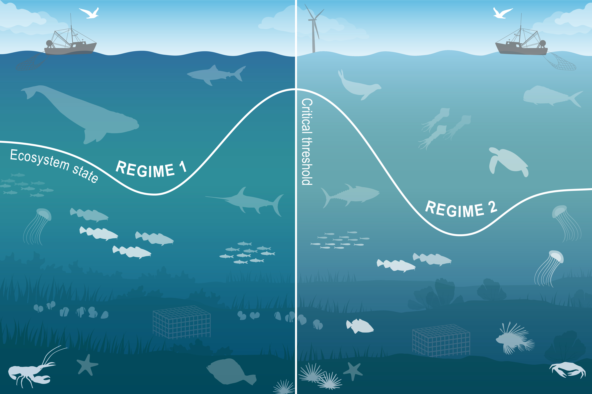

class: top, left

<style>
p.caption {
  font-size: 0.6em;
}
</style>

```{r setup, include=FALSE}

options(htmltools.dir.version = FALSE)
knitr::opts_chunk$set(echo = F,
                      fig.retina = 3,
                      #fig.width = 4,
                      #fig.height = 2,
                      fig.asp = 0.45,
                      warning = F,
                      message = F)
#Plotting and data libraries
library(tidyverse)
library(tidyr)
library(here)
library(kableExtra)
library(ecodata)
library(readxl); library(data.table)
library(DT)
library(widgetframe)


```

```{r, load_refs, include=FALSE, cache=FALSE}
library(RefManageR)
BibOptions(check.entries = FALSE,
           bib.style = "authoryear",
           cite.style = "authoryear",
           longnamesfirst = FALSE,
           max.names = 1,
           style = "markdown")
myBib <- ReadBib("./MidSOE.bib", check = FALSE)

#,
#           hyperlink = FALSE,
#           dashed = FALSE

```

```{r, code = readLines("https://raw.githubusercontent.com/NOAA-EDAB/ecodata/master/chunk-scripts/human_dimensions_NE.Rmd-setup.R")}
```

```{r, code = readLines("https://raw.githubusercontent.com/NOAA-EDAB/ecodata/master/chunk-scripts/human_dimensions_NE.Rmd-GIS-setup.R")}
```

```{r, code = readLines("https://raw.githubusercontent.com/NOAA-EDAB/ecodata/master/chunk-scripts/macrofauna_NE.Rmd-setup.R")}
```

```{r, code = readLines("https://raw.githubusercontent.com/NOAA-EDAB/ecodata/master/chunk-scripts/LTL_NE.Rmd-setup.R")}
```

# State of the Ecosystem (SOE) reporting
## Improving ecosystem information and synthesis for fishery managers using Integrated Ecosystem Assessment Approach (IEA)

.pull-left[
<br />
- Ecosystem indicators linked to management objectives `r Cite(myBib, "depiper_operationalizing_2017")`
    + Report evolving since 2016
    + Contextual information
    + Fishery-relevant subset of full Ecosystem Status Reprorts

- Open science emphasis `r Cite(myBib, "bastille_improving_2020")`

]

.pull-right[
*The IEA Loop<sup>1</sup>*


.footnote[
[1] https://www.integratedecosystemassessment.noaa.gov/national/IEA-approach
]
]


---
## State of the Ecosystem: Updated structure
.pull-left[

## 2020 Report
1. Summary 2 pager
1. Human dimensions
1. Protected species
1. Fish and invertebrates (managed and otherwise)
1. Habitat quality and ecosystem productivity

## 2021 Report
1. Graphical summary
    + Page 1 report card re: objectives &rarr;
    + Page 2 risk summary bullets
    + Page 3 synthesis themes
1. Performance relative to management objectives
1. Risks to meeting management objectives

]

.pull-right[

```{r management-objectives}
mng_obj <- data.frame("Objective Categories" = c("Seafood Production",
                                                 "Profits","Recreation",
                                                 "Stability","Social & Cultural",
                                                 "Protected Species",
                                                 "Biomass","Productivity",
                                                 "Trophic structure","Habitat"),
"Indicators reported here" = c("Landings; commercial total and by feeding guild; recreational harvest",
                               "Revenue decomposed to price and volume",
                               "Days fished; recreational fleet diversity",
                               "Diversity indices (fishery and ecosystem)",
                               "Community engagement/reliance status",
                               "Bycatch; population (adult and juvenile) numbers, mortalities",
                               "Biomass or abundance by feeding guild from surveys",
                               "Condition and recruitment of managed species, Primary productivity",
                               "Relative biomass of feeding guilds, Zooplankton",
                               "Estuarine and offshore habitat conditions"))

knitr::kable(mng_obj, linesep = "",
      col.names = c("Objective Categories","Indicators reported here"),
      caption = "Example ecosystem-scale fishery management objectives",
      #align = 'c',
      booktabs = T) %>%
  kable_styling(font_size = 14) %>%
 # kable_styling(latex_options = "hold_position", "scale_down") %>%
 # column_spec(c(2), width = c("25em")) %>%
  row_spec(0, bold = TRUE) %>%
 # group_rows("Provisioning/Cultural", 1,4) %>%
 # group_rows("Supporting/Regulating", 5,9)
  pack_rows("Provisioning and Cultural Services", 1,6) %>%
  pack_rows("Supporting and Regulating Services", 7,10)


```
]

---
## Report card page 1 and 2

.pull-left[
.center[


]
]

.pull-right[
.center[


]
]

---
## Risk summary bullets page 3

.center[

]

---
## Graphical summary of ecosystem synthesis themes, page 4

Characterizing ecosystem change for fishery management

* Societal, biological, physical and chemical factors comprise the **multiple system drivers** that influence marine ecosystems through a variety of different pathways. 
* Changes in the multiple drivers can lead to **regime shifts** — large, abrupt and persistent changes in the structure and function of an ecosystem.  
* Regime shifts and changes in how the multiple system drivers interact can result in **ecosystem reorganization** as species and humans respond and adapt to the new environment.

.pull-left[


]

.pull-right[

]

---
## Document Orientation

.pull-left[
Spatial scale


A [glossary of terms](https://noaa-edab.github.io/tech-doc/glossary.html), detailed [technical methods documentation](https://NOAA-EDAB.github.io/tech-doc) and [indicator data](https://github.com/NOAA-EDAB/ecodata) are available online.  
]

.pull-right[
Key to figures
```{r , code = readLines("https://raw.githubusercontent.com/NOAA-EDAB/ecodata/master/chunk-scripts/macrofauna_MAB.Rmd-species-dist.R"), fig.width=5.5, fig.asp=.9}
#species-dist, fig.cap = "Aggregate species distribution metrics for species in the Northeast Large Marine Ecosystem."
```  

.contrib[
Trends assessed only for 30+ years: [more information](https://noaa-edab.github.io/tech-doc/trend-analysis.html)

<p style="color:#FF8C00;">Orange line = significant increase</p>
<p style="color:#9932CC;">Purple line = significant decrease</p>
No color line = not significant or < 30 years
<p style="background-color:#D3D3D3;">Grey background = last 10 years</p>
]
]


---
# Performance relative to management objectives

.center[
 &nbsp; &nbsp; &nbsp;  &nbsp; &nbsp; &nbsp;  &nbsp; &nbsp; &nbsp;  &nbsp; &nbsp; &nbsp; 
]

---
## Objective: Seafood production   *Mid-Atlantic*


.pull-left[
### Indicators: Commercial and Recreational Landings
* Surfclams/Ocean quahogs driving decline
* Likely market driven
```{r, code = readLines("https://raw.githubusercontent.com/NOAA-EDAB/ecodata/master/chunk-scripts/human_dimensions_MAB.Rmd-setup.R"), fig.height=2}
```

```{r, code = readLines("https://raw.githubusercontent.com/NOAA-EDAB/ecodata/master/chunk-scripts/human_dimensions_MAB.Rmd-comdat-total-landings.R"), fig.height=5}
```
.contrib[
Key: Black = Total Landings; <p style="color:#FF6A6A;">Red = Landings of MAFMC managed species</p>
]

]

.pull-right[


<br />
<br />
* Multiple Drivers of recreational decline - Shark management and possibly survey methodology change

```{r, code = readLines("https://raw.githubusercontent.com/NOAA-EDAB/ecodata/master/chunk-scripts/human_dimensions_MAB.Rmd-recdat-landings.R"), fig.height=4}
```

]

---

## Objective: Commercial Profits  *New England*
### Indicators: Revenue and Bennet Index of Price and Volume

.pull-left[
```{r, code = readLines("https://raw.githubusercontent.com/NOAA-EDAB/ecodata/master/chunk-scripts/human_dimensions_NE.Rmd-setup.R")}
```

```{r, code = readLines("https://raw.githubusercontent.com/NOAA-EDAB/ecodata/master/chunk-scripts/human_dimensions_NE.Rmd-comdat-comm-revenue.R"), fig.width=8, fig.height=0.25}
```
.contrib[
Key: Black = Revenue of all species combined; <p style="color:#FF6A6A;">Red = Revenue of NEFMC managed species</p>
]
* Driven by single species.
* GB: Fluctuations associated with rotational management areas.
* GB: High revenue caused by high volume/price from scallops.
]

.pull-right[

```{r, code = readLines("https://raw.githubusercontent.com/NOAA-EDAB/ecodata/master/chunk-scripts/human_dimensions_NE.Rmd-bennet-all.R"), fig.asp=0.65, fig.width=8 }
```

* GOM: Total regional revenue high due to high lobster prices, despite lower volume.
]

---

## Objective: Recreation  ;    *Mid-Atlantic*
#### Indicators: Recreational effort and diversity
.pull-left[


```{r, code = readLines("https://raw.githubusercontent.com/NOAA-EDAB/ecodata/master/chunk-scripts/human_dimensions_MAB.Rmd-setup.R")}
```

```{r, code = readLines("https://raw.githubusercontent.com/NOAA-EDAB/ecodata/master/chunk-scripts/human_dimensions_MAB.Rmd-recdat-effort.R"), fig.height=3 }
```

```{r, code = readLines("https://raw.githubusercontent.com/NOAA-EDAB/ecodata/master/chunk-scripts/human_dimensions_MAB.Rmd-recdat-diversity.R"), fig.height=3 }
```

]

.pull-right[
<br />
<br />
* Decline in recreational fleet diversity suggests a potentially reduced range of opportunities. 

* Driven by party/charter contraction (from a high of 24% of angler trips to 7% currently), and a shift toward shore based angling.

* Absence of a long-term trend in recreational effort suggests relative stability in the overall number of recreational opportunities in the MAB.
]


---

## Objective: Stability  Com ; Rec  *New England*

.pull-left[
### *Fishery*  Indicators: Commercial fleet count, fleet diversity   

```{r, code = readLines("https://raw.githubusercontent.com/NOAA-EDAB/ecodata/master/chunk-scripts/human_dimensions_NE.Rmd-setup.R")}
```

```{r, code = readLines("https://raw.githubusercontent.com/NOAA-EDAB/ecodata/master/chunk-scripts/human_dimensions_NE.Rmd-commercial-div.R"), fig.asp=.9}
```

]

.pull-right[
### *Fishery*  Indicators: commerical species revenue diversity, recreational species catch diversity
```{r, code = readLines("https://raw.githubusercontent.com/NOAA-EDAB/ecodata/master/chunk-scripts/human_dimensions_NE.Rmd-commercial-div-species-div.R"), fig.asp=0.40}
```

```{r , code = readLines("https://raw.githubusercontent.com/NOAA-EDAB/ecodata/master/chunk-scripts/human_dimensions_NE.Rmd-recdat-div-catch.R"), fig.asp=0.40}
#recdat-div-catch, fig.cap = paste0("Diversity of recreational catch in the ",region,".")
```

] 

---
## Objective: Stability   *New England*

.pull-left[
#### *Ecological* Indicators: zooplankton and larval fish diversity

```{r, code = readLines("https://raw.githubusercontent.com/NOAA-EDAB/ecodata/master/chunk-scripts/human_dimensions_NE.Rmd-setup.R")}
```

```{r, code = readLines("https://raw.githubusercontent.com/NOAA-EDAB/ecodata/master/chunk-scripts/LTL_NE.Rmd-zoo-diversity-gb.R")}
```

```{r, code = readLines("https://raw.githubusercontent.com/NOAA-EDAB/ecodata/master/chunk-scripts/macrofauna_NE.Rmd-ichthyo-diversity.R")}
```

]
.pull-right[
### *Ecological* Indicator: expected number of species, NEFSC bottom trawl survey
```{r , code = readLines("https://raw.githubusercontent.com/NOAA-EDAB/ecodata/master/chunk-scripts/macrofauna_NE.Rmd-exp-n.R")}
#exp-n, fig.cap = "Adult fish diversity the Mid-Atlantic Bight, based on expected number of species."
```

* commercial fishery diversity driven by small number of species
* diminished capacity to respond to future fishing opportunities
* recreational diversity due to species distributions and regulations
* mixed trends need further monitoring
<br />
<br />
<br />
]
---
## Objective: Social & Cultural *Mid-Atlantic*
#### Indicators: Social vulnerability, fishery engagement and reliance  
.pull-left[

```{r, code = readLines("https://raw.githubusercontent.com/NOAA-EDAB/ecodata/master/chunk-scripts/human_dimensions_MAB.Rmd-setup.R")}
```

```{r , code = readLines("https://raw.githubusercontent.com/NOAA-EDAB/ecodata/master/chunk-scripts/human_dimensions_MAB.Rmd-recreational-engagement.R"), fig.width = 7, fig.asp = 0.65}
```
]

.pull-right[
```{r , code = readLines("https://raw.githubusercontent.com/NOAA-EDAB/ecodata/master/chunk-scripts/human_dimensions_MAB.Rmd-commercial-engagement.R"), fig.width = 7, fig.asp = 0.65}
```
]

* Highlighted communities may be vulnerable to changes in fishing patterns due to regulations and/or climate change.
* Social vulnerability communities may have lower ability to successfully respond to change. 
* May also be vulnerable to environmental justice issues.

---
## Objective: Protected species *Maintain bycatch below thresholds*   *Northeast Shelf*
### Indicators: Harbor porpoise and gray seal bycatch
.pull-left[

```{r, code = readLines("https://raw.githubusercontent.com/NOAA-EDAB/ecodata/master/chunk-scripts/macrofauna_MAB.Rmd-harborporpoise.R"), fig.height=3}
```

```{r, code = readLines("https://raw.githubusercontent.com/NOAA-EDAB/ecodata/master/chunk-scripts/macrofauna_MAB.Rmd-grayseal.R"), fig.height=3}
```
]

.pull-right[
<br />
<br />


* Currently meeting objectives

* The downward trend in harbor porpoise bycatch can also be due to a decrease in harbor porpoise abundance in US waters, reducing their overlap with fisheries, and a decrease in gillnet effort. 

* The increasing trend in gray seal bycatch may be related to an increase in the gray seal population (U.S. pup counts).
]

---
## Objectives: Protected species *Recover endangered populations*   *Northeast Shelf*
### Indicators: North Atlantic right whale population, calf counts
.pull-left[

```{r, code = readLines("https://raw.githubusercontent.com/NOAA-EDAB/ecodata/master/chunk-scripts/macrofauna_MAB.Rmd-narw-abundance.R"), fig.height=3}
```

```{r, code = readLines("https://raw.githubusercontent.com/NOAA-EDAB/ecodata/master/chunk-scripts/macrofauna_MAB.Rmd-NARW-calf-abundance.R"), fig.height=3}
```
]

.pull-right[
<br />
<br />

* Population drivers for North Atlantic Right Whales (NARW) include combined fishery interactions/ship strikes, distribution shifts, and copepod availability.

* Unusual mortality events continue for 3 large whale species, harbor and gray seals.
]


---
# Risks to meeting fishery management objectives

.center[
 &nbsp; &nbsp; &nbsp; 
] 

.center[
 &nbsp; &nbsp; &nbsp;  &nbsp; &nbsp; &nbsp;  &nbsp; &nbsp; &nbsp;   &nbsp; &nbsp; &nbsp;  
]

---
## Risks: Climate change
### Indicators: sea surface temperature and marine heatwaves
.pull-left[

```{r, code = readLines("https://raw.githubusercontent.com/NOAA-EDAB/ecodata/master/chunk-scripts/human_dimensions_NE.Rmd-setup.R")}
```

```{r , code=readLines("https://raw.githubusercontent.com/NOAA-EDAB/ecodata/master/chunk-scripts/LTL_NE.Rmd-seasonal-sst-anomaly-gridded.R"), fig.asp=0.75}
```
* Georges Bank experienced the warmest event on
record at 4.3 degrees above average
]

.pull-right[

```{r, code = readLines("https://raw.githubusercontent.com/NOAA-EDAB/ecodata/master/chunk-scripts/LTL_NE.Rmd-heatwave-gb.R")}
```

```{r , code=readLines("https://raw.githubusercontent.com/NOAA-EDAB/ecodata/master/chunk-scripts/LTL_NE.Rmd-heatwave-year-gb.R"), fig.width=5, fig.asp=.6}

```

]

---
## Risks: Climate change
### Indicators: ocean currents and bottom temperatures
.pull-left[

```{r, code = readLines("https://raw.githubusercontent.com/NOAA-EDAB/ecodata/master/chunk-scripts/human_dimensions_MAB.Rmd-setup.R")}
```

```{r, code = readLines("https://raw.githubusercontent.com/NOAA-EDAB/ecodata/master/chunk-scripts/LTL_MAB.Rmd-gsi.R"), fig.width=5}
```

```{r, code = readLines("https://raw.githubusercontent.com/NOAA-EDAB/ecodata/master/chunk-scripts/LTL_MAB.Rmd-wcr.R"), fig.width=5}
```
* Gulf stream moving further north

]

.pull-right[

```{r, code = readLines("https://raw.githubusercontent.com/NOAA-EDAB/ecodata/master/chunk-scripts/human_dimensions_NE.Rmd-setup.R")}
```

```{r , code=readLines("https://raw.githubusercontent.com/NOAA-EDAB/ecodata/master/chunk-scripts/LTL_NE.Rmd-bottom-temp-gom.R"), fig.width=5}
```

```{r , code=readLines("https://raw.githubusercontent.com/NOAA-EDAB/ecodata/master/chunk-scripts/LTL_NE.Rmd-slopewater.R"), fig.width=5}
```
* Almost no cold Labrador slopewater entering the GOM
]
---
## Risks: Climate change
### Indicators: cool pool area and ocean acidification
.pull-left[


]

.pull-right[


]
---

## Risks: Ecosystem productivity
### Indicators: primary production and zooplankton

.pull-left[
```{r, code = readLines("https://raw.githubusercontent.com/NOAA-EDAB/ecodata/master/chunk-scripts/human_dimensions_MAB.Rmd-setup.R")}
```

```{r , code=readLines("https://raw.githubusercontent.com/NOAA-EDAB/ecodata/master/chunk-scripts/LTL_MAB.Rmd-pp-monthly.R"), fig.width=8}
#pp-monthly,  fig.cap="Monthly primary production trends show the annual cycle (i.e. the peak during the summer months) and the changes over time for each month."
```

```{r , code=readLines("https://raw.githubusercontent.com/NOAA-EDAB/ecodata/master/chunk-scripts/LTL_MAB.Rmd-weekly-phyto-size.R"), fig.asp=.45}
#weekly-phyto-size, fig.cap="The annual climatology (1998-2019) percent composition of the phytoplankton size classes in the Mid-Atlantic bight based on satellite observations."
```

]

.pull-right[
```{r , code=readLines("https://raw.githubusercontent.com/NOAA-EDAB/ecodata/master/chunk-scripts/LTL_MAB.Rmd-zoo-strat-abun.R"), fig.width=8, fig.asp=.25}
#zoo-strat-abun, fig.cap="Stratified abundance of cnidarians and euphausiids in Mid-Atlantic Bight."
```

```{r , code=readLines("https://raw.githubusercontent.com/NOAA-EDAB/ecodata/master/chunk-scripts/LTL_MAB.Rmd-zoo-abund.R"),fig.width=8, fig.asp=.25}
#zoo-abund,  fig.cap= "Large (red) and small-bodied (blue) copepod abundance in the Mid-Atlantic Bight."
```
* Increased production by smaller phytoplankton implies less efficient transfer of primary production to higher trophic levels. 
* Monitor implications of increasing gelatinous zooplankton and krill.
]
---
## Risks: Ecosystem productivity
### Indicators: plankton-based forage anomaly and forage fish energy content

.pull-left[
```{r, code = readLines("https://raw.githubusercontent.com/NOAA-EDAB/ecodata/master/chunk-scripts/human_dimensions_NE.Rmd-setup.R")}
```

```{r  code=readLines("https://raw.githubusercontent.com/NOAA-EDAB/ecodata/master/chunk-scripts/macrofauna_NE.Rmd-forage-anomaly.R"), fig.width=7}
#forage-anomaly, fig.cap="Changes from 2000-2019 average abundance for an aggregate of 13 zooplankton and 16 ichthyoplankton groups sampled on NEFSC ECOMON surveys.",
```
]
.pull-right[
```{r , code=readLines("https://raw.githubusercontent.com/NOAA-EDAB/ecodata/master/chunk-scripts/macrofauna_MAB.Rmd-energy-density.R"), fig.width = 8, fig.asp = 0.5}
#energy-density, fig.cap="Forage fish mean energy density mean and standard deviation by season and year, compared with 1980s (Steimle and Terranove 1985) and 1990s (Lawson et al. 1998) values."
```
]

* fluctuating environmental conditions and prey for forage species affect both abundance and energy content.
* Energy content varies by season, and has changed over time most dramatically for Atlantic herring

---
## Risks: Ecosystem productivity
### Indicators: fish condition
.pull-left[
.center[

]
<br />
Preliminary results:  
* Multiple, different condition drivers by species 
]
.pull-right[

Mid-Atlantic Bight

 
* Acadian redfish, butterfish and winter flounder more affected by fishing pressure and stock size  
* Weakfish, windowpane flounder, and American plaice more affected by local bottom temperatures and zooplankton 
]

---
## Risks: Habitat climate vulnerability
### Indicators: climate sensitive species life stages mapped to climate vulnerable habitats  

```{r , message=FALSE}
#Read in habitat table

ne <- as.data.table(readxl::read_xlsx('habitat_vulnerability.xlsx',
                         sheet = 'New England', skip = 1))

#Identify individual species climate vulnerability
vhigh.vul <- unique(ne[`Species Vulnerability Rank (FCVA)` == 'Very high', Species])
high.vul  <- unique(ne[`Species Vulnerability Rank (FCVA)` == 'High', Species])
mod.vul   <- unique(ne[`Species Vulnerability Rank (FCVA)` == 'Moderate', Species])
low.vul   <- unique(ne[`Species Vulnerability Rank (FCVA)` == 'Low', Species])

#Grab habitat vulnerability
hab.vul <- unique(ne[, c('Habitat Name', 'Habitat Vulnerability Rank (HVCA)')])
habitats <- hab.vul[, 'Habitat Name']
hab.vul <- data.table('Habitat Vulnerability' = c(NA, NA, t(hab.vul[, 'Habitat Vulnerability Rank (HVCA)'])))

#Rearrange table
ne <- data.table::melt.data.table(ne, id.vars = c('Habitat Name', 'Species'),
                                   measure.vars = c('Eggs/Larva', 'Juvenile/YOY',
                                                    'Adult', 'Spawning Adult'),
                                   variable.name = 'Stage', value.name = 'Dependence')
ne[, Habitat := as.factor(ne$'Habitat Name')]
ne <- data.table::dcast.data.table(ne, Species + Stage ~ Habitat,
                                    value.var = 'Dependence')
setcolorder(ne, c('Species', 'Stage', habitats$'Habitat Name'))

#Add Habitat Vulnerbaility
#hab.table <- rbindlist(list(as.data.table(t(hab.vul)), ne), use.names = F)
hab.table <- ne
#Add names back in
names(hab.table) <- names(ne)
hab.table <- hab.table %>% mutate_if(is.character, str_trim)

#from examples here https://rstudio.github.io/DT/010-style.html

#color coding cells works
#need to add column with species vulnerability and color code species by it but not show it, like #hideV6 example at link
#if we show it we can sort by species vulnerability though... alphabetical doesnt work so use numbers to go lowest-highest
#still need to color code headers
hab.table <- hab.table %>%
  mutate(spVul = #Color code species based on climate vul
    # case_when(Species %in% low.vul ~ "low.vul",
    #           Species %in% mod.vul ~ "mod.vul",
    #           Species %in% high.vul ~ "high.vul",
    #           Species %in% vhigh.vul ~ "vhigh.vul")
    # )
    case_when(Species %in% low.vul ~ 1,
              Species %in% mod.vul ~ 2,
              Species %in% high.vul ~ 3,
              Species %in% vhigh.vul ~ 4)
    )

colnames(hab.table)[c(3:4)] <- paste0('<span style="box-shadow: -10px 0 0 red, 10px 0 0 red; background-color:red; color:white">',colnames(hab.table)[c(3:4)],'</span>')
colnames(hab.table)[c(5:9)] <- paste0('<span style="box-shadow: -10px 0 0 orange, 10px 0 0 orange; background-color:',c("orange"),'">',colnames(hab.table)[c(5:10)],'</span>')
colnames(hab.table)[c(10:14)] <- paste0('<span style="box-shadow: -10px 0 0 yellow, 10px 0 0 yellow; background-color:',c("yellow"),'">',colnames(hab.table)[c(11:15)],'</span>')

dt <- datatable(hab.table, rownames = FALSE, escape = FALSE,
          extensions = c('Scroller', 'FixedColumns'), #add scrolling and fixed column
          options = list(deferRender = TRUE,
          scrollY = 300, scroller = TRUE,
          dom = 't',scrollX = TRUE,fixedColumns = TRUE)
          #, options = list(columnDefs = list(list(targets = 16, visible = FALSE)))
  ) %>%
  formatStyle(
    names(hab.table)[3:4],
    backgroundColor = '#FF000080'
  ) %>%
  formatStyle(
    names(hab.table)[5:9],
    backgroundColor = '#FFA50080'
  ) %>%
  formatStyle(
    names(hab.table)[10:14],
    backgroundColor = '#FFFF0080'
  ) %>%

  formatStyle(#Color code base on dependence
    'Species', "spVul",
    backgroundColor = styleEqual(#c("low.vul", "mod.vul", "high.vul", "vhigh.vul"),
                                 c(1,2,3,4),
                                 c('lightgreen', 'yellow', 'orange', 'red')), #Color code base on dependence)
    color = styleEqual(c(1,2,3,4),
                                 c('black', 'black', 'black', 'white'))
    ) %>%
    formatStyle(
    names(hab.table),
    backgroundColor = styleEqual(c("Low", "Moderate", "High", "Very high"),
                                 c('lightgreen', 'yellow', 'orange', 'red')),
    color = styleEqual(c("Low", "Moderate", "High", "Very high"),
                                 c('black', 'black', 'black', 'white'))
  )

frameWidget(dt)
```

---
background-image: url("EDAB_images/SurveyMap202133.png")
background-size: 700px
background-position: right

## Risks: Offshore Wind Development
### Indicators: development timeline, revenue in lease <br />areas, survey overlap ([full map](https://noaa-edab.github.io/ecodata/human_dimensions_MAB#Shelfwide_Indicators))
.pull-left[


```{r , code=readLines("https://raw.githubusercontent.com/NOAA-EDAB/ecodata/master/chunk-scripts/human_dimensions_MAB.Rmd-wind-dev-speed0.R"), fig.width=7, fig.asp=.4}
```

```{r, code = readLines("https://raw.githubusercontent.com/NOAA-EDAB/ecodata/master/chunk-scripts/human_dimensions_NE.Rmd-wind-revenue.R"), fig.width = 7}
```

]

.pull-right[
]

---
## Risks: Offshore Wind Development
.pull-left[
Implications: 
* Current plans for rapid buildout of offshore wind in a patchwork of areas spreads the impacts differentially throughout the region  

* 1-12% of total average revenue for major New England commerical species in lease areas could be displaced if all sites are developed. Displaced fishing effort can alter fishing methods, which can in turn change habitat, species (managed and protected), and fleet interactions. 

* Right whales may be displaced, and altered local oceanography could affect distribution of their zooplankton prey.

* Scientific data collection surveys for ocean and ecosystem conditions, fish, and protected species will be altered, potentially increasing uncertainty for management decision making. 
]
.pull-right[
.center[

]
]
---
## SOE in action
.pull-left[

### How is this being used to inform management? 
<br />
<br />
* Feedback from FMCs

* Improvements for next year
 + Push to operationalize SOE
 + Standing up a subgroup

* MAFMC risk assessment


]

.pull-right[


<br />
*The IEA Loop<sup>1</sup>*
.footnote[
[1] https://www.integratedecosystemassessment.noaa.gov/national/IEA-approach
]
]
---
## Risk assessent indicators and ranking criteria: Commercial revenue 

This element is applied at the ecosystem level. Revenue serves as a proxy for commercial profits.

.table[
.pull-left[
<br />
```{r riskcomval, echo=FALSE, message=FALSE, warnings=FALSE, results='asis'}
tabl <- "
| Risk Level         | Definition                                                          |  
|:-------------------|:--------------------------------------------------------------------|
| Low  | No trend and low variability in revenue |
| Low-Moderate | Increasing or high variability in revenue |
| Moderate-High | Significant long term revenue decrease |
| High | Significant recent decrease in revenue |
"
cat(tabl) # output the table in a format good for HTML/PDF/docx conversion
```

Ranked moderate-high risk due to the significant long term revenue decrease for Mid-Atlantic managed species
]
]
.pull-right[
```{r, code = readLines("https://raw.githubusercontent.com/NOAA-EDAB/ecodata/master/chunk-scripts/human_dimensions_MAB.Rmd-setup.R")}
```

```{r, code = readLines("https://raw.githubusercontent.com/NOAA-EDAB/ecodata/master/chunk-scripts/human_dimensions_MAB.Rmd-comdat-comm-revenue.R"), fig.width = 6, fig.asp = 0.45}
```
.contrib[
Key: Black = Total Landings; <p style="color:#FF6A6A;">Red = Landings of MAFMC managed species</p>
]
```{r , code = readLines("https://raw.githubusercontent.com/NOAA-EDAB/ecodata/master/chunk-scripts/human_dimensions_MAB.Rmd-bennet.R"), fig.width = 6, fig.asp = 0.45}
#bennet, fig.cap = paste0("Revenue change from the 2015 values in dollars (black), Price (PI), and Volume Indicators (VI) for commercial landings in the Mid-Atlantic Bight."), fig.width=6,
```
]


---
background-image: url("EDAB_images/noaa-iea.png")
background-size: 350px
background-position: right bottom

## Contributors - THANK YOU!

The New England and Mid-Atlantic SOEs made possible by (at least) 52 contributors from 10 institutions 

.pull-left[
.contrib[
Andy Beet<br>
Kimberly Bastille<br>
Ruth Boettcher (Virginia Department of Game and Inland Fisheries)<br>
Mandy Bromilow (NOAA Chesapeake Bay Office)<br>
Zhuomin Chen (Woods Hole Oceanographic Institute)<br>
Joseph Caracappa<br>
Doug Christel (GARFO)<br>
Patricia Clay<br>
Lisa Colburn<br>
Jennifer Cudney (NMFS Atlantic HMS Management Division)<br>
Tobey Curtis (NMFS Atlantic HMS Management Division)<br>
Geret DePiper<br>
Emily Farr (NMFS Office of Habitat Conservation)<br>
Michael Fogarty<br>
Paula Fratantoni<br>
Kevin Friedland<br>
Sarah Gaichas<br>
Ben Galuardi (GARFO)<br>
Avijit Gangopadhyay (School for Marine Science and Technology, University of Massachusetts Dartmouth)<br>
James Gartland (Virginia Institute of Marine Science)<br>
Glen Gawarkiewicz (Woods Hole Oceanographic Institution)<br>
Sean Hardison<br>
Kimberly Hyde<br>
John Kocik<br>
Steve Kress (National Audubon Society’s Seabird Restoration Program)<br>
Young-Oh Kwon (Woods Hole Oceanographic Institute)<br>

]
]

.pull-right[
.contrib[
Scott Large<br>
Andrew Lipsky<br>
Sean Lucey<br>
Don Lyons (National Audubon Society’s Seabird Restoration Program)<br>
Chris Melrose<br>
Shannon Meseck<br>
Ryan Morse<br>
Kimberly Murray<br>
Chris Orphanides<br>
Richard Pace<br>
Charles Perretti<br>
CJ Pellerin (NOAA Chesapeake Bay Office)<br>
Grace Roskar (NMFS Office of Habitat Conservation)<br>
Grace Saba (Rutgers)<br>
Vincent Saba<br>
Chris Schillaci (GARFO)<br>
Angela Silva<br>
Emily Slesinger (Rutgers University)<br>
Laurel Smith<br>
Talya tenBrink (GARFO)<br>
Bruce Vogt (NOAA Chesapeake Bay Office)<br>
Ron Vogel (UMD Cooperative Institute for Satellite Earth System Studies and NOAA/NESDIS Center for Satellite Applications and Research)<br>
John Walden<br>
Harvey Walsh<br>
Changhua Weng<br>
Mark Wuenschel  

]
]


---
## References

.contrib[
```{r refs, echo=FALSE, results="asis"}
PrintBibliography(myBib)
```
]


## Additional resources
.pull-left[
* [ecodata R package](https://github.com/noaa-edab/ecodata)

* Visualizations:
  * [New England Human Dimensions indicators](http://noaa-edab.github.io/ecodata/human_dimensions_NE)
  * [New England Macrofauna indicators](http://noaa-edab.github.io/ecodata/macrofauna_NE)
  * [New England Lower trophic level indicators](https://noaa-edab.github.io/ecodata/LTL_NE)
]
.pull-right[
* [SOE Technical Documentation](https://noaa-edab.github.io/tech-doc)

* [Draft indicator catalog](https://noaa-edab.github.io/catalog/)

.contrib[

* Slides available at https://noaa-edab.github.io/presentations
* Contact: <kimberly.bastille@noaa.gov>
]
]

---
background-image: url("EDAB_images/SOE_feature_image.png")
background-size: 1200px
background-position: center

.right[
<br />
<br />
<br />
<br />
<br />
<br />
<br />
<br />
<br />
<br />
# Thank you!

# Questions?
]