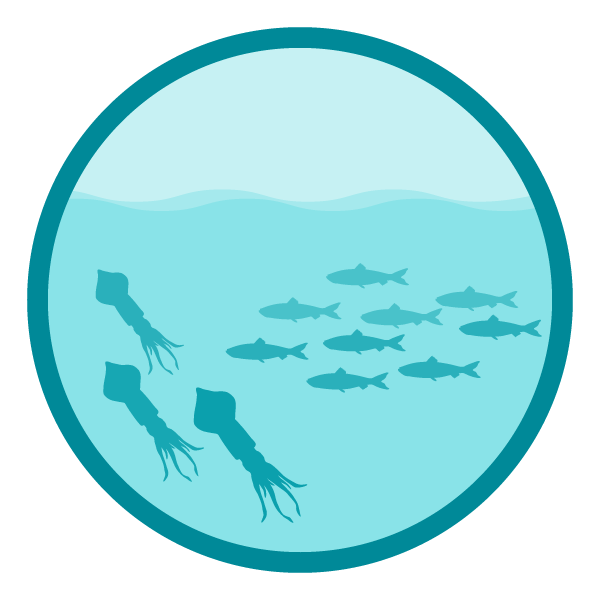

class: top, left

```{r setup, include=FALSE}

options(htmltools.dir.version = FALSE)
knitr::opts_chunk$set(echo = F,
                      warning = F,
                      message = F)
#Plotting and data libraries
library(tidyverse)
library(tidyr)
library(ecodata)
library(here)
library(kableExtra)
library(ggrepel)
library(patchwork)
library(grid)
library(ggiraph)
library(vegan)
library(rpart)
library(ks)
library(cowplot)

#GIS libraries
library(sf)
library(rgdal)
library(raster)
library(rnaturalearth)

data.dir <- here::here("data")
gis.dir <- here::here("data")

#General inline text input for report
#Council
council <- "Mid-Atlantic Fishery Management Council"
council_abbr <- "MAFMC"

#Region identifiers
epu <- "Mid-Atlantic Bight"
epu_abbr <- "MAB"
region <- "Mid-Atlantic"
region_abbr <- "MA" #Some commercial data organized by "MA" or "NE" regions, not by EPU 

#Time series constants
shade.alpha <- 0.3
shade.fill <- "lightgrey"
lwd <- 1
pcex <- 2
trend.alpha <- 0.5
trend.size <- 2
hline.size <- 1
hline.alpha <- 0.35
hline.lty <- "dashed"
label.size <- 5
hjust.label <- 1.5
letter_size <- 4
feeding.guilds1<- c("Piscivore","Planktivore","Benthivore","Benthos")
feeding.guilds <- c("Apex Predator","Piscivore","Planktivore","Benthivore","Benthos")
x.shade.min <- 2009
x.shade.max <- 2019
#Function for custom ggplot facet labels
label <- function(variable,value){
  return(facet_names[value])
}

#CRS
crs <- "+proj=longlat +lat_1=35 +lat_2=45 +lat_0=40 +lon_0=-77 +x_0=0 +y_0=0 +datum=NAD83 +no_defs +ellps=GRS80 +towgs84=0,0,0"

#Coastline shapefile
coast <- ne_countries(scale = 10,
                          continent = "North America",
                          returnclass = "sf") %>%
             sf::st_transform(crs = crs)

#State polygons
ne_states <- ne_states(country = "united states of america",
                                      returnclass = "sf") %>%
  sf::st_transform(crs = crs)

#high-res polygon of Maine
#new_england <- read_sf(gis.dir,"new_england")

#EPU shapefile
epu_sf <- ecodata::epu_sf %>% 
  filter(EPU %in% c("MAB","GB","GOM"))

#Map line parameters
map.lwd <- 0.4

# Set lat/lon window for maps
xmin = -77
xmax = -65
ymin = 36
ymax = 45
xlims <- c(xmin, xmax)
ylims <- c(ymin, ymax)

```

# Integrated Ecosystem Assessment

.pull-left[

IEA Approach

- Supports shift to EBM

- Iterative

- Collaborative


]

.pull-right[
*The IEA Loop<sup>1</sup>*

]

.footnote[
[1] https://www.integratedecosystemassessment.noaa.gov/national/IEA-approach
]

???

---

## State of the Ecosystem (SOE) Reporting: Context for busy people


1. Clear linkage of ecosystem indicators with management objectives

1. Synthesis across indicators for big picture

1. Objectives related to human-well being placed first in report

1. Short (< 30 pages), non-technical (but rigorous) text

1. Emphasis on reproducibility 

.center[

]

???

---
## New 2 page summary with visualizations

.pull-left[

]

.pull-right[

]
---
## Document orientation
.center[

]

.contrib[
This year, we mapped trawl survey strata to Ecological Production Units (EPUs)  

[More information on EPUs](https://noaa-edab.github.io/tech-doc/epu.html)  
[More information on survey data](https://noaa-edab.github.io/tech-doc/survdat.html)  
]

---
## Commercial fisheries and ecosystem productivity
*Primary Production Required to support landings - Fraction of primary production used by fisheries*
.pull-left[
- Both MA and NE declining since 2000

```{r ppr-mab, fig.cap="Primary production required to support MAB commercial landings. Included are the top species accounting for 80\\% of the landings in each year, with 15\\% transfer efficiency assumed between trophic levels.", fig.width = 5, fig.asp = 0.45}
ecodata::ppr %>% 
  group_by(EPU) %>% 
  mutate(hline = mean(Value)) %>% 
  filter(EPU == "MAB") %>% 
  ggplot() +
  annotate("rect", fill = shade.fill, alpha = shade.alpha,
      xmin = x.shade.min , xmax = x.shade.max,
      ymin = -Inf, ymax = Inf) +
  geom_point(aes(x = Time, y = Value))+
  geom_line(aes(x = Time, y = Value))+
  geom_hline(aes(yintercept = hline),
           size = hline.size,
           alpha = hline.alpha,
           linetype = hline.lty)+
  scale_x_continuous(expand = c(0.01, 0.01)) +
  expand_limits(y=0) +
  ggtitle("MAB rimary Production Required")+
  ylab("Proportion of Total PPD")+
  theme(axis.title.y = element_text(size = 8))+
  theme_ts()
```

```{r ppr-gb, fig.cap="Primary production required to support MAB commercial landings. Included are the top species accounting for 80\\% of the landings in each year, with 15\\% transfer efficiency assumed between trophic levels.", fig.width = 5, fig.asp = 0.45}
ecodata::ppr %>% 
  group_by(EPU) %>% 
  mutate(hline = mean(Value)) %>% 
  filter(EPU == "GB") %>% 
  ggplot() +
  annotate("rect", fill = shade.fill, alpha = shade.alpha,
      xmin = x.shade.min , xmax = x.shade.max,
      ymin = -Inf, ymax = Inf) +
  geom_point(aes(x = Time, y = Value))+
  geom_line(aes(x = Time, y = Value))+
  geom_hline(aes(yintercept = hline),
           size = hline.size,
           alpha = hline.alpha,
           linetype = hline.lty)+
  scale_x_continuous(expand = c(0.01, 0.01)) +
  expand_limits(y=0) +
  ggtitle("GB Primary Production Required")+
  ylab("Proportion of Total PPD")+
  theme(axis.title.y = element_text(size = 8))+
  theme_ts()
```

*Many assumptions to explore*

]

.pull-right[
MAB Species Compositon

]

---

## Commercial fisheries engagement, landings, revenue

.center[
```{r MAB-comm-engagement-trend, fig.width = 10, fig.asp = 0.4, fig.cap = "Commercial engagement scores (total pounds landed, value landed, commercial permits, and commercial dealers in a community) for Mid-Atlantic fishing communities, 2004-2018."}

eng<-ecodata::engagement %>% 
  filter(!Var == "med.high.scores")
eng$Var <- factor(eng$Var, levels = c("%High","%Medium High","%Moderate", "%Low"))

engbar <- eng %>% filter(EPU == "MA") %>% 
  ggplot()+
   #ylim(0.8, NA)+
  geom_bar(aes(x = Time, y = Value, 
               fill = Var), 
           stat = "identity")+
  #scale_y_continuous(labels = Value(suffix = "%", prefix = "")) +
  #geom_text(aes(x = Time, y = Value,
  #             label = paste0(Value,"%")), size=4) +
  theme(#legend.position="bottom", legend.direction="horizontal",
        legend.title = element_blank())+
  coord_cartesian(ylim=c(0.85,1))+
  xlab("Time") +
  ylab("% Communities in each category (Low to High)")+
  ggtitle("Mid-Atlantic Commercial Engagement")+
  theme_ts()


mhtrend <- ecodata::engagement %>% 
  filter(Var == "med.high.scores", 
         EPU == "MA") %>% 
  mutate(hline = mean(Value)) %>% 
  ggplot()+
  annotate("rect", fill = shade.fill, alpha = shade.alpha,
      xmin = x.shade.min , xmax = x.shade.max,
      ymin = -Inf, ymax = Inf) +
  geom_line(aes(x = Time, y = Value), size = lwd) +
  geom_point(aes(x = Time, y = Value), size = pcex) +
  scale_x_continuous(expand = c(0.01, 0.01)) +
  expand_limits(y=0) +
  ggtitle("Mid-Atlantic Medium-High communities ") +
  ylab(expression("Average score for Med High communities")) +
  geom_hline(aes(yintercept = hline),
           size = hline.size,
           alpha = hline.alpha,
           linetype = hline.lty) +
 theme_ts()
  
cowplot::plot_grid(engbar, 
                   mhtrend,
                   ncol = 2, 
                   align = "h", 
                   rel_widths = c(1, 0.7)) +
    theme(plot.margin = unit(c(0.1, 0, 0, 0), "cm"))

```
]

Fewer highly engaged Mid-Atlantic communities; engagement scores for medium-highly engaged communities decreasing 

.pull-left[
```{r total-landings, fig.cap = paste0("Total commercial seafood landings (black) and ",region," managed seafood landings (red)."), fig.width = 5, fig.asp = 0.45}
#Get data for plotting

#Define constants for figure plot
series.col <- c("indianred","black")

#Managed landings
managed_landings <- ecodata::comdat  %>%
  filter(str_detect(Var, paste0(council_abbr," managed species - Landings weight|JOINT managed species - Landings weight")),
         !str_detect(Var, "Other"),
         Time >= 1986,
         EPU == epu_abbr)

#Total landings
total_landings <- ecodata::comdat  %>%
  filter(!str_detect(Var, "managed species"),
         !str_detect(Var, "Other"),
         str_detect(Var, "Landings"),
         Time >= 1986,
         EPU == epu_abbr)

total_landings_agg <- total_landings %>%
  group_by(Time) %>%
  dplyr::summarise(Value = sum(Value)) %>% 
  mutate(Var = "Total",hline = mean(Value))
managed_landings_agg <- managed_landings %>%
  group_by(Time) %>%
  dplyr::summarise(Value = sum(Value)) %>% 
  mutate(Var = "Managed",hline = mean(Value))

landings_agg <- rbind(total_landings_agg, managed_landings_agg)


ggplot(data = landings_agg)+
  
  #Highlight last ten years
  annotate("rect", fill = shade.fill, alpha = shade.alpha,
      xmin = x.shade.min , xmax = x.shade.max,
      ymin = -Inf, ymax = Inf) +
  geom_gls(aes(x = Time, y = Value,
               group = Var),
             alpha = trend.alpha, size = trend.size) +
  geom_line(aes(x = Time, y = Value, color = Var), size = lwd) +
  geom_point(aes(x = Time, y = Value, color = Var), size = pcex) +

  scale_y_continuous(labels = function(l){trans = l / 1000})+
  scale_x_continuous(breaks = seq(1985, 2015, by = 5), expand = c(0.01, 0.01)) +
  scale_color_manual(values = series.col, aesthetics = "color")+
  guides(color = FALSE) +
  ggtitle("Mid-Atlantic Total Landings") +
  ylab(expression("Landings (10"^3*"metric tons)")) +

  geom_hline(aes(yintercept = hline,
               
               color = Var),
           size = hline.size,
           alpha = hline.alpha,
           linetype = hline.lty) +
  
  theme(axis.title.y = element_text(size = 9))+
    theme_ts()


```
]

.pull-right[
```{r comm-revenue, fig.width = 5, fig.asp = 0.45, fig.cap = "Total revenue for the region (black) and revenue from MAFMC managed species (red)."}

#Filtering and aggregation step
rev_agg <- ecodata::comdat %>% 
  filter(str_detect(Var, "Revenue"),
         !str_detect(Var, "prop|Other|NEFMC"), #Remove proportions, "Other" category species, NEFMC managed species in MAB
         EPU == epu_abbr,
         Time >= 1986) %>% 
  mutate(Status = ifelse(str_detect(Var, "Revenue weight"), 
                         "Managed","Total")) %>% #Create groups for aggregation
  group_by(Status, Time) %>% 
  dplyr::summarise(Total = sum(Value)) %>% 
  group_by(Status) %>% 
  mutate(hline = mean(Total))

series.col <- c("indianred","black")

#Plotting
ggplot(data = rev_agg) +
  
  #Highlight last ten years
  annotate("rect", fill = shade.fill, alpha = shade.alpha,
      xmin = x.shade.min , xmax = x.shade.max,
      ymin = -Inf, ymax = Inf)+  
  
  #lines
  geom_gls(aes(x = Time, y = Total,
               group = Status),
             alpha = trend.alpha, size = trend.size) +
  geom_line(aes(x = Time, y = Total, color = Status), size = lwd) +
  geom_point(aes(x = Time, y = Total, color = Status), size = pcex) +

  #axes
  scale_y_continuous(labels = function(l){trans = l / 1000000})+
  scale_x_continuous(breaks = seq(1985, 2015, by = 5), expand = c(0.01, 0.01)) +
      scale_color_manual(values = series.col, aesthetics = "color")+
  guides(color = FALSE) +
  ggtitle("Mid-Atlantic Total Revenue") +
  ylab(expression("Revenue (10"^6*"USD)")) +
  geom_hline(aes(yintercept = hline,
               color = Status),
           size = hline.size,
           alpha = hline.alpha,
           linetype = hline.lty) +
  theme_ts()
```
]

---
## Recreational fishing
.pull-left[
Lowest recreational landings recorded in 2018--why?

```{r rec-landings, fig.cap = paste0("Total recreational seafood harvest in the ",region," region."), fig.width = 5, fig.asp = 0.45}

landings_rec <- ecodata::recdat %>% 
  filter(EPU == region_abbr,
         Var == "Recreational Seafood") %>% 
  mutate(hline = mean(Value))

series.col <- "black"

ggplot(data = landings_rec)+
  
  #Highlight last ten years
  annotate("rect", fill = shade.fill, alpha = shade.alpha,
      xmin = x.shade.min , xmax = x.shade.max,
      ymin = -Inf, ymax = Inf) +
  geom_gls(aes(x = Time, y = Value,
               group = Var),
             alpha = trend.alpha, size = trend.size) +
  geom_line(aes(x = Time, y = Value, color = Var), size = lwd) +
  geom_point(aes(x = Time, y = Value, color = Var), size = pcex) +

  scale_y_continuous(labels = function(l){trans = l / 1000000})+
  scale_x_continuous(breaks = seq(1985, 2015, by = 5), expand = c(0.01, 0.01)) +
  scale_color_manual(values = series.col, aesthetics = "color")+
  guides(color = FALSE) +
  ggtitle("Recreational seafood harvest") +
  ylab(expression("Fish caught (10"^6*"n)")) +

  geom_hline(aes(yintercept = hline,
               
               color = Var),
           size = hline.size,
           alpha = hline.alpha,
           linetype = hline.lty) +
  theme_ts()

```

Effort trend similar to previous reports

```{r rec-op, fig.width = 5, fig.asp = 0.45, fig.cap = paste0("Recreational effort in the ",region,".")}
recdat <- ecodata::recdat %>% 
  filter(EPU == region_abbr) %>% 
  group_by(Var) %>% 
  mutate(hline = mean(Value))

ylim_re <- c(2e7, 7e7)
ylim_rd <- c(1.75,2.75)
ylim_ra  <- c(1e6, 3.5e6)

# #Create dataframe for label locations
# label_loc <- data.frame(xloc = min(recdat$Time)+0.3,
#                         yloc = c(ylim_re[2]*0.975,
#                                  ylim_rd[2]*0.975,
#                                  ylim_ra[2]*0.975),
#                         labels = LETTERS[1:3],
#                         Var = c("Recreational Effort",
#                                 "Recreational fleet effort diversity across modes",
#                                 "Recreational anglers"))

series.col <- "black"
# x.shade.min <- max(recdat$Time, na.rm = T) - 9
# x.shade.max <- max(recdat$Time, na.rm = T)

rec_effort <- recdat %>% 
  filter(Var == "Recreational Effort") %>% 
  ggplot() + 
 #Highlight last ten years
  annotate("rect", fill = shade.fill, alpha = shade.alpha,
      xmin = x.shade.min , xmax = x.shade.max,
      ymin = -Inf, ymax = Inf) +
  #label
  # annotate("text", 
  #          x = label_loc[label_loc$Var == "Recreational Effort",]$xloc,
  #          y = label_loc[label_loc$Var == "Recreational Effort",]$yloc,
  #          label = label_loc[label_loc$Var == "Recreational Effort",]$labels,
  #          size = letter_size)+
  geom_gls(aes(x = Time, y = Value,
               group = Var),
             alpha = trend.alpha, size = trend.size) +
  geom_line(aes(x = Time, y = Value, color = Var), size = lwd) +
  geom_point(aes(x = Time, y = Value, color = Var), size = pcex) +
  
  scale_x_continuous(expand = c(0.01, 0.01)) +
  scale_y_continuous(labels = function(l){trans = l / 1000000}, limits = ylim_re)+
  scale_color_manual(values = series.col, aesthetics = "color")+
  guides(color = FALSE) +
  ggtitle("Recreational effort")+
  ylab(expression("Days fished (10"^6*" N)")) +
  xlab("")+
  geom_hline(aes(yintercept = hline,
               color = Var),
           size = hline.size,
           alpha = hline.alpha,
           linetype = hline.lty) +
  theme_ts() 

#no rec angler data with MRIP From Geret:
#Short answer: No. They are not currently calculating number of anglers. 
#Seems the MRIP update caused some methodological issues that they haven't fully worked through for this indicator. 
#Not sure when it will be available again.

cowplot::plot_grid(rec_effort, 
                   #rec_div, 
                   #rec_anglers, 
                   #rec_div_catch,
                   ncol = 1, 
                   align = "hv") +
    theme(plot.margin = unit(c(0.1, 0, 0, 0), "cm"))

```

]
.pull-right[
Significant decrease in recreational fleet diversity

```{r rec-div, fig.width = 5, fig.asp = 0.45, fig.cap = paste0("Recreational effort diversity in the ",region,".")}

rec_div <- recdat %>% 
  filter(Var == "Recreational fleet effort diversity across modes") %>% 
  ggplot() + 
 #Highlight last ten years
  annotate("rect", fill = shade.fill, alpha = shade.alpha,
      xmin = x.shade.min , xmax = x.shade.max,
      ymin = -Inf, ymax = Inf) +
  # annotate("text", 
  #          x = label_loc[label_loc$Var == "Recreational fleet effort diversity across modes",]$xloc,
  #          y = label_loc[label_loc$Var == "Recreational fleet effort diversity across modes",]$yloc,
  #          label = label_loc[label_loc$Var == "Recreational fleet effort diversity across modes",]$labels,
  #          size = letter_size)+
  geom_gls(aes(x = Time, y = Value,
               group = Var),
             alpha = trend.alpha, size = trend.size) +
  geom_line(aes(x = Time, y = Value, color = Var), size = lwd) +
  geom_point(aes(x = Time, y = Value, color = Var), size = pcex) +
  ylim(ylim_rd)+
  scale_x_continuous(expand = c(0.01, 0.01)) +
  scale_color_manual(values = series.col, aesthetics = "color")+
  guides(color = FALSE) +
  ggtitle("Rec. fleet effort diversity")+
  ylab(expression("Effective Shannon")) +
  xlab("")+
  geom_hline(aes(yintercept = hline,
               color = Var),
           size = hline.size,
           alpha = hline.alpha,
           linetype = hline.lty) +
  theme_ts()
  rec_div
```

Splitting out SAFMC, ASMFC removed downward catch diversity trend

```{r rec-div2, fig.width = 5, fig.asp = 0.45, fig.cap = paste0("Diversity of recreational catch in the ",region,".")}

recdat <- ecodata::recdat %>% 
  filter(EPU == region_abbr) %>% 
  group_by(Var) %>% 
  mutate(hline = mean(Value))

series.col <- "black"

ylim_re <- c(2e7, 7e7)
ylim_rd <- c(1.75,2.75)
ylim_ra  <- c(1e6, 3.5e6)

rec_div_catch <- recdat %>% 
  filter(Var == "Recreational Diversity of Catch") %>% 
  ggplot() + 
 #Highlight last ten years
  annotate("rect", fill = shade.fill, alpha = shade.alpha,
      xmin = x.shade.min , xmax = x.shade.max,
      ymin = -Inf, ymax = Inf) +
    # annotate("text", 
    #        x = label_loc[label_loc$Var == "Recreational anglers",]$xloc,
    #        y = label_loc[label_loc$Var == "Recreational anglers",]$yloc,
    #        label = label_loc[label_loc$Var == "Recreational anglers",]$labels,
    #        size = letter_size)+
  geom_gls(aes(x = Time, y = Value,
               group = Var),
             alpha = trend.alpha, size = trend.size) +
  geom_line(aes(x = Time, y = Value, color = Var), size = lwd) +
  geom_point(aes(x = Time, y = Value, color = Var), size = pcex) +

  scale_x_continuous(expand = c(0.01, 0.01)) +
  scale_color_manual(values = series.col, aesthetics = "color")+
  guides(color = FALSE) +
  ggtitle("Rec. diversity of catch")+
  ylab(expression("Effective Shannon")) +
  xlab("Time")+
  geom_hline(aes(yintercept = hline,
               color = Var),
           size = hline.size,
           alpha = hline.alpha,
           linetype = hline.lty) +
  theme_ts()

rec_div_catch

```
]


---

## Commercial fisheries: Revenue

* Total Revenue in both NE regions is up
* Largely dependent on single species
* Fluctuations on Georges Bank associated with rotational management (Scallops)

.pull-left[
**Georges Bank**
```{r comm-revenue-gb, fig.width = 5, fig.asp = 0.45, fig.cap = "Total revenue for the region (black) and revenue from NEFMC managed species (red)."}

#Filtering and aggregation step
rev_agg <- ecodata::comdat %>% 
  filter(str_detect(Var, "Revenue"),
         !str_detect(Var, "prop|Other|MAFMC"), #Remove proportions, "Other" category species, MAFMC managed species in GB
         EPU == 'GB',
         Time >= 1986) %>% 
  mutate(Status = ifelse(str_detect(Var, "Revenue weight"), 
                         "Managed","Total")) %>% #Create groups for aggregation
  group_by(Status, Time) %>% 
  dplyr::summarise(Total = sum(Value)) %>% 
  group_by(Status) %>% 
  mutate(hline = mean(Total))

series.col <- c("indianred","black")

#Plotting
ggplot(data = rev_agg) +
  
  #Highlight last ten years
  annotate("rect", fill = shade.fill, alpha = shade.alpha,
      xmin = x.shade.min , xmax = x.shade.max,
      ymin = -Inf, ymax = Inf)+  
  
  #lines
  geom_gls(aes(x = Time, y = Total,
               group = Status),
             alpha = trend.alpha, size = trend.size) +
  geom_line(aes(x = Time, y = Total, color = Status), size = lwd) +
  geom_point(aes(x = Time, y = Total, color = Status), size = pcex) +

  #axes
  scale_y_continuous(labels = function(l){trans = l / 1000000})+
  scale_x_continuous(breaks = seq(1985, 2015, by = 5), expand = c(0.01, 0.01)) +
      scale_color_manual(values = series.col, aesthetics = "color")+
  guides(color = FALSE) +
  ggtitle("Total Revenue") +
  ylab(expression("Revenue (10"^6*"USD)")) +
  geom_hline(aes(yintercept = hline,
               color = Status),
           size = hline.size,
           alpha = hline.alpha,
           linetype = hline.lty) +
  theme_ts()
```

```{r bennet-gb, fig.cap = paste0("Revenue change from the 2015 base year in 2015 dollars (black), Price (PI), and Volume Indicators (VI) for commercial benthos landings on Georges Bank"), fig.width = 5, fig.asp = 0.6}
#Filter data into two dataframes for plotting

indicators <- ecodata::bennet %>% 
  filter(!EPU == "MAB") %>% 
  filter(stringr::str_detect(Var, pattern="Benth"),
         #!Var == "Total Revenue Change - Bennet", 
         !Time < 1985) %>% 
  mutate(Var, Var = plyr::mapvalues(Var, from = c("Benthos Value Index - Bennet","Benthos Price Index - Bennet","Benthivore Value Index - Bennet","Benthivore Price Index - Bennet"),
                                    to = c("Benthos Volume","Benthos Price","Benthivore Volume","Benthivore Price"))) 
revchange1<-indicators %>% 
  group_by(Time, EPU) %>% 
  summarise(revchange.line = sum(Value))


revchange <- ecodata::bennet %>% 
  filter(!EPU == "MAB",
         Var %in% c("Total Revenue Change - Bennet"),
         !Time<1985)
revchange.gom<-revchange1 %>% 
  filter(EPU == "GOM") 
revchange.gb<-revchange1 %>% 
  filter(EPU == "GB")
#custom bar fill color (color-blind friendly)
ind_fill <- c("#a6cee3", "#b2df8a")

#limits
y.lim <- c(-350,350)

gb_bennet <- indicators %>% 
  filter(EPU == "GB", 
         stringr::str_detect(Var, pattern="Benthos")) %>% 
ggplot()+
  
  #Highlight last ten years
  annotate("rect", fill = shade.fill, alpha = shade.alpha,
      xmin = x.shade.min , xmax = x.shade.max,
      ymin = -Inf, ymax = Inf)+
  
  geom_bar(aes(x=Time, y= Value, fill = Var), stat="identity")+
  scale_fill_manual(name = "Indicators:", values = ind_fill, labels = c("Price", "Volume")) +
  geom_line(data = revchange.gb, 
            aes(x = Time, y = revchange.line, colour = "$"))+
  scale_colour_grey(name ="Revenue Change:") +
  ggtitle("Georges Bank Benthos Component")+
  labs(y="Value $1 M ($2015)") +
  scale_x_continuous(breaks = seq(1965, 2015, by = 10), expand = c(0.01, 0.01)) +
  scale_y_continuous(breaks = seq(y.lim[1], y.lim[2], by = 100), limits = y.lim, expand = c(0.01, 0.01)) +
  theme_ts() +
  theme(title = element_text(size = 10)) +
  theme(legend.position="bottom", legend.direction = "horizontal",
        legend.background = element_rect(fill = "transparent"), 
        legend.title = element_text(size = 8), 
        legend.text = element_text(size = 8)) +
  guides(color = guide_legend(order = 1),
         fill = guide_legend(order = 0))

#cowplot::plot_grid(gom_bennet, gb_bennet, ncol = 2, rel_widths = c(0.7,1))

g_legend<-function(a.gplot){
  tmp <- ggplot_gtable(ggplot_build(a.gplot))
  leg <- which(sapply(tmp$grobs, function(x) x$name) == "guide-box")
  legend <- tmp$grobs[[leg]]
  return(legend)}
mylegend<-g_legend(gb_bennet)
# p3 <- gridExtra::grid.arrange(gridExtra::arrangeGrob(gb_bennet + theme(legend.position="none"),
#                          gom_bennet + theme(legend.position="none"),
#                          nrow=1),
#              mylegend, nrow=2,heights=c(6, 1))

plot(gb_bennet)
```

]

.pull-right[
**Gulf of Maine**
```{r comm-revenue-gom, fig.width = 5, fig.asp = 0.45, fig.cap = "Total revenue for the region (black) and revenue from NEFMC managed species (red)."}

#Filtering and aggregation step
rev_agg <- ecodata::comdat %>% 
  filter(str_detect(Var, "Revenue"),
         !str_detect(Var, "prop|Other|MAFMC"), #Remove proportions, "Other" category species, MAFMC managed species in GOM
         EPU == 'GOM',
         Time >= 1986) %>% 
  mutate(Status = ifelse(str_detect(Var, "Revenue weight"), 
                         "Managed","Total")) %>% #Create groups for aggregation
  group_by(Status, Time) %>% 
  dplyr::summarise(Total = sum(Value)) %>% 
  group_by(Status) %>% 
  mutate(hline = mean(Total))

series.col <- c("indianred","black")

#Plotting
ggplot(data = rev_agg) +
  
  #Highlight last ten years
  annotate("rect", fill = shade.fill, alpha = shade.alpha,
      xmin = x.shade.min , xmax = x.shade.max,
      ymin = -Inf, ymax = Inf)+  
  
  #lines
  geom_gls(aes(x = Time, y = Total,
               group = Status),
             alpha = trend.alpha, size = trend.size) +
  geom_line(aes(x = Time, y = Total, color = Status), size = lwd) +
  geom_point(aes(x = Time, y = Total, color = Status), size = pcex) +

  #axes
  scale_y_continuous(labels = function(l){trans = l / 1000000})+
  scale_x_continuous(breaks = seq(1985, 2015, by = 5), expand = c(0.01, 0.01)) +
      scale_color_manual(values = series.col, aesthetics = "color")+
  guides(color = FALSE) +
  ggtitle("Total Revenue") +
  ylab(expression("Revenue (10"^6*"USD)")) +
  geom_hline(aes(yintercept = hline,
               color = Status),
           size = hline.size,
           alpha = hline.alpha,
           linetype = hline.lty) +
  theme_ts()
```

```{r bennet-gom, fig.cap = paste0("Revenue change from the 2015 base year in 2015 dollars (black), Price (PI), and Volume Indicators (VI) for commercial benthivore landings in the Gulf of Maine"), fig.width = 5, fig.asp = 0.6}
#plot

gom_bennet <- indicators %>% 
  filter(EPU == "GOM", stringr::str_detect(Var, pattern="Benthivore")) %>% 
  ggplot()+
  #Highlight last ten years
  annotate("rect", fill = shade.fill, alpha = shade.alpha,
           xmin = x.shade.min , xmax = x.shade.max,
           ymin = -Inf, ymax = Inf)+
  #guides(color = F, fill = F)+
  geom_bar(aes(x=Time, y= Value, fill = Var), stat="identity")+
  scale_fill_manual(name = "Indicators", values = ind_fill, guide = FALSE) +
  geom_line(data = revchange.gom, 
            aes(x = Time, y = revchange.line, colour = "$"))+
  scale_colour_grey(name ="Revenue Change") +
  ggtitle("Gulf of Maine Benthivore Component")+
  labs(y="Value $1 M ($2015)") +
  scale_x_continuous(breaks = seq(1965, 2015, by = 10), expand = c(0.01, 0.01)) +
  scale_y_continuous(breaks = seq(y.lim[1], y.lim[2], by = 100), limits = y.lim,
                     expand = c(0.01, 0.01)) +
  theme_ts() +
  theme(title = element_text(size = 10))+
  theme(legend.position="bottom", legend.direction = "horizontal",
        legend.background = element_rect(fill = "transparent"), 
        legend.title = element_text(size = 8), 
        legend.text = element_text(size = 8)) +
  guides(color = guide_legend(order = 1),
         fill = guide_legend(order = 0))

plot(gom_bennet)
```


]
---

## Fish stock status - Mid-Atlantic

Change from 2019: bluefish biomass below threshold

```{r stock-status, warning=F, fig.cap = paste0("Summary of single species status for ",council_abbr," and jointly managed stocks (Goosefish and Spiny dogfish)."), fig.width = 10, fig.asp = 0.6}

stock_status <- ecodata::stock_status %>%
  mutate(Code = recode(Code, "Dogfish" = "Sp. Dogfish" )) %>% 
  spread(.,Var,Value) %>% 
  filter(Council %in% c("MAFMC","Both")) %>% 
  group_by(Stock) %>% 
  mutate(score = case_when(
    (B.Bmsy <0.5) ~"a",
    (F.Fmsy >1) ~ "a", 
    (F.Fmsy < 1 & B.Bmsy > 0.5 & B.Bmsy < 1) ~ "b",
    (F.Fmsy < 1 & B.Bmsy > 1) ~ "c"))
#Plot constants
y.max <- 2.0 #1.75 mackerel cut off F/Fmsy is 1.8
x.max <- 2.6
#A dataframe that defines custom legend for stocks with unknown status
unknown <- data.frame(text = c("Unknown Status", "Longfin Squid",
                              "Shortfin Squid", "N. Goosefish", "S. Goosefish"),
                    x = rep(0.9*x.max,5), y = seq(0.93*y.max,1.4,-.1))

# Custom Color
custom_color<- c("#56B4E9", "#009E73", "#0072B2")
#Plotting code
ggplot(data = stock_status) +
  geom_vline(xintercept = 1, linetype = "dotted")+
  geom_vline(xintercept = 0.5, linetype = "dashed")+
  geom_hline(yintercept = 1, linetype = "dashed") +
  geom_point(aes(x = B.Bmsy,
                 y = F.Fmsy,
                 shape = Council,
                 color = score)) +
  geom_text_repel(aes(x = B.Bmsy, #geom_text_repel auto-jitters text around points
                      y = F.Fmsy,
                      label = Code, 
                      color = score,
                      size = 20), 
                  show.legend = FALSE, nudge_y = -0.01, nudge_x = 0.05) +
  scale_color_brewer(palette = "Dark2",
                     breaks = stock_status$score) +
  ylim(0,y.max) +
  xlim(0,x.max) +
  geom_text(data = unknown, aes(x = x, y = y, label = text), #Custom legend for unknown stock status
            size = c(4.75,rep(4,4))) +
  annotate("rect", xmin = 0.8*x.max,
           xmax = x.max,
           ymin = 0.65*y.max,
           ymax = 0.90*y.max,
           alpha = 0.1) +
  xlab(expression(~B/B[msy])) +
  ylab(expression(~F/F[msy])) +
  guides(color = FALSE) +
  theme_ts()
```


---
## Fish stock status - New England

```{r stock-status-ne, warning=F, fig.cap = paste0("Summary of single species status for ",council_abbr," and jointly managed stocks (Goosefish and Spiny dogfish)."), fig.width = 10, fig.asp = 0.6}

#Get data, spread for plotting, and filter
stock_status <- ecodata::stock_status %>%
  mutate(Code = recode(Code, "Dogfish" = "Sp. Dogfish" )) %>% 
  spread(.,Var,Value) %>% 
  filter(Council %in% c("NEFMC","Both")) %>% 
  group_by(Stock) %>% 
  mutate(score = case_when(
    (B.Bmsy <0.5) ~"a",
    (F.Fmsy >1) ~ "a", 
    (F.Fmsy < 1 & B.Bmsy > 0.5 & B.Bmsy < 1) ~ "b",
    (F.Fmsy < 1 & B.Bmsy > 1) ~ "c"))
#Plot constants
y.max <- 1.5
x.max <- 10
all_missing <- stock_status %>%
  filter(is.na(B.Bmsy),is.na(F.Fmsy)) %>% 
  dplyr::select(Code, Council)
b_missing <- stock_status %>%
  filter(is.na(B.Bmsy), !is.na(F.Fmsy)) %>% 
  dplyr::select(Code, Council)
f_missing <- stock_status %>%
  filter(is.na(F.Fmsy), !is.na(B.Bmsy)) %>% 
  dplyr::select(Code, Council)
#A dataframe that defines custom legend for stocks with unknown status
all.df <- data.frame(text = all_missing$Code,
                    x = rep(x.max*0.9,length(all_missing$Code)),
                    y = seq(1.45,1.05, length.out = 7))
b.df <- data.frame(text = b_missing$Code,
                    x = rep(x.max*0.7,length(b_missing$Code)),
                    y = c(1.45,2.15))
f.df <- data.frame(text = f_missing$Code,
                    x = rep(x.max*0.5,length(f_missing$Code)),
                    y = seq(1.45,1.0, length.out = 8))

#Plotting code
ggplot(data = stock_status) +
  geom_vline(xintercept = 1, linetype = "dotted", color = "grey60")+
  geom_vline(xintercept = 0.5, linetype = "dashed", color = "grey60")+
  geom_hline(yintercept = 1, linetype = "dashed", color = "grey60") +
  geom_point(aes(x = B.Bmsy,
                 y = F.Fmsy,
                 color = stock_status$score)) +
  geom_text_repel(aes(x = B.Bmsy, #geom_text_repel auto-jitters text around points
                      y = F.Fmsy,
                      label = Code,
                      color = stock_status$score), show.legend = FALSE,nudge_y = -0.01, nudge_x = 0.05) +
  ylim(0,y.max) +
  xlim(0,x.max*1.1) +
  geom_text(data = all.df, aes(x = x, y = y, label = text),show.legend = FALSE, size = 3)+
  geom_text(data = b.df, aes(x = x, y = y, label = text),show.legend = FALSE, size = 3)+
  geom_text(data = f.df, aes(x = x, y = y, label = text),show.legend = FALSE, size = 3)+
  scale_color_brewer(palette = "Dark2", #Change legend labels for clarity
                     breaks = stock_status$score) +
  annotate("rect", xmin = 0.924*x.max,
           xmax = 1.08*x.max,
           ymin = 0.645*y.max,
           ymax = 0.98*y.max,
           alpha = 0.01) +
  annotate("text", x = 9, y = 1.5, label = "F and B missing", fontface =2, size = 3)+
  annotate("rect",  
             xmin = 0.70*x.max,
             xmax = 0.85*x.max,
             ymin = 0.90*y.max,
             ymax = 1.8,
             alpha = 0.01) +
  annotate("text", x = 7, y = 1.5, label = "B missing", fontface =2, size = 3)+
  annotate("rect", xmin = 0.509*x.max,
           xmax = 0.681*x.max,
           ymin = 0.65*y.max,
           ymax = 0.98*y.max,
           alpha = 0.01) +
  annotate("text", x = 5, y = 1.5, label = "F missing", fontface =2, size = 3)+
  xlab(expression(~B/B[msy])) +
  ylab(expression(~F/F[msy])) +
  guides(color = FALSE) +
  theme_ts()
```
---

## Other ocean uses: wind energy fish habitat overlap

```{r wind-habitat-table, eval = T, echo = F, fig.cap='', out.width='80%'}
wind1 <- ecodata::wind_occupancy

wind1$trend<- ifelse(wind1$Trend == "pos",
                    "$\\nearrow$",
                    ifelse(wind1$Trend == "neg",
                    "$\\searrow$",
                    " "))


wind2<-wind1 %>% dplyr::select(Area, Season, Species, trend)
names<-c("Area", "Season", "Species", "trend")
bnew<-c("Area.1", "Season.1", "Species.1", "trend.1")
cnew<-c("Area.2", "Season.2", "Species.2", "trend.2")
dnew<-c("Area.3", "Season.3", "Species.3", "trend.3")
enew<-c("Area.4", "Season.4", "Species.4", "trend.4")

a<-wind2 %>% filter(Area == "Existing-North")
b<-wind2 %>% filter(Area == "Proposed-North") %>%
  dplyr::rename_at(vars(names), ~ bnew)
c<-wind2 %>% filter(Area == "Existing-Mid")%>%
  dplyr::rename_at(vars(names), ~ cnew)
d<-wind2 %>% filter(Area == "Proposed-Mid")%>%
  dplyr::rename_at(vars(names), ~ dnew)
e<-wind2 %>% filter(Area == "Existing-South")%>%
  dplyr::rename_at(vars(names), ~ enew)

all<- a %>% cbind(b,c,d,e) %>%
  dplyr::select(2:4,7:8,11:12,15:16,19:20) #%>%
  # rename(Trend = trend,
  #        Species = Species.1,
  #        Trend = trend.1,
  #        Species = Species.2,
  #        Trend = trend.2,
  #        Species = Species.3,
  #        Trend = trend.3,
  #        Species = Species.4,
  #        Trend = trend.4 )

kable(all, format = "html", escape = F, table.attr='class="risktable"',
      col.names = c("Season", "Species", "Trend", "Species", "Trend", "Species","Trend", "Species","Trend", "Species", "Trend")) %>%
      #caption = "Species with highest probability of occupancy species each season and area, with observed trends",
      #align = 'c',
      #booktabs = T) %>%
    add_header_above(c(" " = 1, "Existing - North" = 2, "Proposed - North" = 2,
                     "Existing - Mid" = 2, "Proposed - Mid" = 2,
                     "Existing - South" = 2)) %>%
  #kable_styling(latex_options = c("hold_position", "scale_down"))
  kable_styling(font_size = 11) %>%
  row_spec(0, bold = TRUE)
```

.pull-left[
```{r wind-hab, eval = T, echo = F, fig.height = 6, fig.cap="Map of BOEM existing (black) and proposed (red) lease areas in North (N), Mid (M) and South (S) portions of the coast as of February 2019.", message=FALSE, results=FALSE}
library(rnaturalearthhires)
library(sf)
library(raster)
library(ggspatial)
library(marmap)

crs <- "+proj=longlat +lat_1=35 +lat_2=45 +lat_0=40 +lon_0=-77 +x_0=0 +y_0=0 +datum=NAD83 +no_defs +ellps=GRS80 +towgs84=0,0,0"
#gis.dir <- here::here("data-raw/gis")
nesbath <- fortify.bathy(getNOAA.bathy(lon1 = -77, lon2 = -65, lat1 = 35, lat2 = 45,
              resolution = 5))

lease_s<-st_read(file.path(gis.dir, 'BOEM lease areas/ne_existing_leasesSPoly.shp'))
lease_n<-st_read(file.path(gis.dir, 'BOEM lease areas/ne_existing_leasesNPoly.shp'))
lease_m<-st_read(file.path(gis.dir, 'BOEM lease areas/ne_existing_leasesMPoly.shp'))
prop_n<-st_read(file.path(gis.dir, 'BOEM lease areas/ne_proposed_leases_NPoly.shp'))
prop_m<-st_read(file.path(gis.dir, 'BOEM lease areas/ne_proposed_leases_MPoly.shp'))

invisible(st_crs(lease_s)<-crs)
invisible(st_crs(lease_n)<-crs)
invisible(st_crs(lease_m)<-crs)
invisible(st_crs(prop_n)<-crs)
invisible(st_crs(prop_m)<-crs)

ggplot() +
  geom_raster(data = nesbath, aes(x=x,y=y, fill = z)) +
  scale_fill_gradientn(colors =c("lightcyan","lightblue4"))+
  geom_sf(data = coast, size = map.lwd) +
  geom_sf(data = epu_sf, fill = "transparent", size = map.lwd) +
  geom_sf(data = lease_s, size = map.lwd, color = "black")+
  geom_sf(data = lease_n, size = map.lwd, color = "black")+
  geom_sf(data = lease_m, size = map.lwd, color = "black")+
  geom_sf(data = prop_n, size = map.lwd, color = "red3")+
  geom_sf(data = prop_m, size = map.lwd, color = "red3")+
  coord_sf(crs = crs, xlim = c(-77, -69), ylim = c(36,42))+
  geom_segment(aes(x = -74.6, y = 37.4, xend =-75.4, yend =38), colour = "blue4")+
  geom_segment(aes(x = -71.1, y = 40.2, xend =-71.6, yend =41.1), colour = "blue4")+
  annotate("text", x = -74.9, y = 37, label = "S")+
  annotate("text", x = -73.5, y = 38.7, label = "M")+
  annotate("text", x = -70.5, y = 40.2, label = "N")+
  annotation_scale(location = "br", width_hint = 0.4) +
  theme_bw( ) +
  ylab("")+
  xlab("")+
  theme(legend.position = "none") +
  ggtitle("BOEM lease areas, early 2019")

```
]

.pull-right[


## Fishery overlap to be added

]

---
## New information on forage fish energy density

Forage fish energy content varies seasonally and annually 

Atlantic herring energy content may be half what it was in the 1980s-90s

```{r forage, eval=T, echo=F}

d<-ecodata::energy_density #%>% 
    # rename("Mean ED (SD)" = "Mean.ED..SD.", 
    #        "N" = "n",
    #        "Mean ED (SD)" = "Mean.ED..SD..1", 
    #        "N" = "n.1", 
    #        "Mean ED (SD)" = "Mean.ED..SD..2", 
    #        "N" = "n.2", 
    #        "Mean ED (SD)" = "Mean.ED..SD..3", 
    #        "N" = "n.3",
    #        "Mean ED (SD)" = "Mean.ED..SD..4", 
    #        "N" = "X",
    #        "Mean ED (SD)" = "Mean.ED..SD..5", 
    #        "Mean ED" = "Mean.ED" )
kable(d, format = "html", escape = F, #table.attr='class="risktable"', 
      col.names = c("Species", "ED (SD)", "N", "ED (SD)", "N",
                    "ED (SD)", "N","ED (SD)", "N",
                    "ED (SD)", "N","ED", "ED (SD)")) %>%
      #caption = "Forage fish mean energy density (ED) mean and standard deviation (SD) by season and year, compared with 1980s (Steimle and Terranove 1985) and 1990s (Lawson et al. 1998) values. N = number sampled.") %>% 
  #kable_styling(latex_options = c("hold_position", "scale_down")) %>% 
  #add_header_above(c(" " = 1, "Spring" = 2, "Fall" = 2, "Spring" = 2, "Fall" = 2, " " = 4)) %>% 
  add_header_above(c(" " = 1, "Spring 2017" = 2, "Fall 2017" = 2, "Spring 2018" = 2,  "Fall 2018"= 2,"Total" = 2, "1980s" = 1, "1990s" = 1)) %>%
  kable_styling(font_size = 11, full_width = T) %>%
  row_spec(0, bold = TRUE)

```
---
## Protected species

.pull-left[
North Atlantic right whale abundance

```{r NARW-abundance, fig.width = 5, fig.asp = 0.45,fig.cap = "1990-2018 right whale abundance estimates with 95\\% credible intervals. These values represent the estimated number of animals alive sometime during the year referenced and NOT at the end of the year referenced. Three known deaths were recorded in 2018, but these deaths were not reflected in the 2018 estimate because those animals were alive sometime during the year. An additional 10 known deaths occurred in 2019."}
#hline <- mean(narw[narw$Var == "right whale abundance median",]$Value)

ecodata::narw %>%
  dplyr::filter(Var != "Calves") %>%
  tidyr::spread(Var, Value) %>%
  dplyr::rename(Value = Median) %>%
  dplyr::mutate(hline = mean(Value, na.rm = T)) %>%
  ggplot() +
#Highlight last ten years
  annotate("rect", fill = shade.fill, alpha = shade.alpha,
      xmin = x.shade.min , xmax = x.shade.max,
      ymin = -Inf, ymax = Inf) +
  geom_line(aes(x = Time, y = Value), size = lwd-0.75) +
  geom_point(aes(x = Time, y = Value), size = pcex-0.75) +
  geom_ribbon(aes(ymin = Lower95, ymax = Upper95, x = Time), alpha = 0.3)+
  scale_x_continuous(expand = c(0.01, 0.01)) +
  guides(color = FALSE) +
  ggtitle("NARW abundance") +
  ylab(expression("Abundance (n)")) +
  xlab("Time")+
  geom_hline(aes(yintercept = hline),
          color = "black",
          size = hline.size,
          alpha = hline.alpha,
          linetype = hline.lty) +
  theme_ts()
```

**New indicator**

North Atlantic right whale calf births

```{r NARW-calf-abundance, fig.width = 5, fig.asp = 0.45, fig.cap = "Number of North Atlantic right whale calf births, 1990 - 2019."}

ecodata::narw %>%
  dplyr::filter(Var == "Calves") %>%
  dplyr::mutate(hline = mean(Value, na.rm = T)) %>%
  ggplot() +
#Highlight last ten years
  annotate("rect", fill = shade.fill, alpha = shade.alpha,
      xmin = x.shade.min , xmax = x.shade.max,
      ymin = -Inf, ymax = Inf) +
  geom_line(aes(x = Time, y = Value), size = lwd-0.75) +
  geom_point(aes(x = Time, y = Value), size = pcex-0.75) +
  scale_x_continuous(expand = c(0.01, 0.01)) +
  guides(color = FALSE) +
  ggtitle("NARW calf abundance") +
  ylab(expression("Abundance (n)")) +
  xlab("Time")+
  geom_hline(aes(yintercept = hline),
           color = "black",
           size = hline.size,
           alpha = hline.alpha,
           linetype = hline.lty) +
  theme_ts()
```

]

.pull-right[
Seal population snapshots

  + ~75,000 harbor seals, trend analysis in progress

  + 30,000 - 40,000 grey seals in US; 425,000 in Canada and &nearr;

Seal diet studies in progress

Unusual Mortality Events

  + [North Atlantic right whales](https://www.fisheries.noaa.gov/national/marine-life-distress/2017-2020-north-atlantic-right-whale-unusual-mortality-event)

  + [Humpback whales](https://www.fisheries.noaa.gov/national/marine-life-distress/2016-2020-humpback-whale-unusual-mortality-event-along-atlantic-coast)

  + [Minke whales](https://www.fisheries.noaa.gov/national/marine-life-distress/2017-2020-minke-whale-unusual-mortality-event-along-atlantic-coast)

  + [Grey, harbor, hooded, and harp seals](https://www.fisheries.noaa.gov/new-england-mid-atlantic/marine-life-distress/2018-2019-pinniped-unusual-mortality-event-along)

]
---
## Aggregate fish distribution and southern species
.pull-left[
Overall fish biomass tracking northeast and deeper

```{r spec-dist1, fig.cap = "Aggregate species distribution metrics for species in the Northeast Large Marine Ecosystem.", fig.width=5, fig.asp=.9}

spec_dist <- ecodata::species_dist %>% 
  dplyr::group_by(Var) %>% 
  dplyr::mutate(hline = mean(Value))

asd <- spec_dist %>% 
  dplyr::filter(Var == "along-shelf distance") %>% 
  ggplot2::ggplot(aes(x = Time, y = Value,
               group = Var)) + 
 #Highlight last ten years
  ggplot2::annotate("rect", fill = shade.fill, alpha = shade.alpha,
      xmin = x.shade.min , xmax = x.shade.max,
      ymin = -Inf, ymax = Inf) +
  ecodata::geom_gls() +
  ggplot2::geom_line() +
  ggplot2::geom_point() +
  ggplot2::scale_x_continuous(expand = c(0.01, 0.01)) +
  ggplot2::ggtitle("Along-shelf distance")+
  ggplot2::ylab(expression("Distance (km)")) +
  ggplot2::xlab("")+
  ggplot2::geom_hline(aes(yintercept = hline),
           size = hline.size,
           alpha = hline.alpha,
           linetype = hline.lty) +
  ecodata::theme_ts() 

depth <- spec_dist %>% 
  dplyr::filter(Var == "depth") %>% 
  dplyr::mutate(Value = Value* -1, 
         hline = mean(Value)) %>% 
  ggplot2::ggplot(aes(x = Time, y = Value,
               group = Var)) + 
 #Highlight last ten years
  ggplot2::annotate("rect", fill = shade.fill, alpha = shade.alpha,
      xmin = x.shade.min , xmax = x.shade.max,
      ymin = -Inf, ymax = Inf) +
  ecodata::geom_gls() +
  ggplot2::geom_line() +
  ggplot2::geom_point() +
  ggplot2::scale_x_continuous(expand = c(0.01, 0.01)) +
  ggplot2::ggtitle("Depth") +
  ggplot2::ylab(expression("Depth (m)")) +
  ggplot2::xlab("")+
  ggplot2::geom_hline(aes(yintercept = hline),
           size = hline.size,
           alpha = hline.alpha,
           linetype = hline.lty) +
  ecodata::theme_ts() 

dtc <- spec_dist %>% 
  dplyr::filter(Var == "distance to coast") %>% 
  ggplot2::ggplot(aes(x = Time, y = Value,
               group = Var)) + 
 #Highlight last ten years
  ggplot2::annotate("rect", fill = shade.fill, alpha = shade.alpha,
      xmin = x.shade.min , xmax = x.shade.max,
      ymin = -Inf, ymax = Inf) +
  ecodata::geom_gls() +
  ggplot2::geom_line() +
  ggplot2::geom_point() +
  ggplot2::scale_x_continuous(expand = c(0.01, 0.01)) +
  ggplot2::ggtitle("Distance to coast")+
  ggplot2::ylab(expression("Distance (km)")) +
  ggplot2::xlab("Time")+
  ggplot2::geom_hline(aes(yintercept = hline),
           size = hline.size,
           alpha = hline.alpha,
           linetype = hline.lty) +
  ecodata::theme_ts() 

asd + depth + patchwork::plot_layout(ncol = 1) 

```

]  
.pull-right[
Southern species not increasing in surveys, but further north?

```{r blue-runner, fig.height = 7, fig.cap = "Blue runner presence on Northeast Shelf"}
blue<-ecodata::blue_runner %>% 
  separate(Var, c("Var", "Pos"), "L") %>% 
  spread(., Pos, Value) %>% 
  rename(Lat = at, 
         Lon = on) %>% 
  mutate(Var = recode(Var,
                      "Positive Blue Runner Tows before 2001 - " = "Prior to 2000",
                      "Positive Blue Runner Tows 2001 - 2010 - " = "2001-2010", 
                      "Positive Blue Runner Tows since 2010 - " = "Since 2010"))
blue$Var <- factor(blue$Var, levels = c("Prior to 2000", "2001-2010", "Since 2010"))
  
#EPU shapefile
epu_sf <- ecodata::epu_sf %>% 
  filter(EPU %in% c("GOM","GB", "MAB"))

#Map line parameters
map.lwd <- 0.4

# Set lat/lon window for maps
xmin = -77
xmax = -65
ymin = 35
ymax = 45
xlims <- c(xmin, xmax)
ylims <- c(ymin, ymax)

## Map plotting blue runner
blue_map <- 
  ggplot() +
  geom_sf(data = coast, size = map.lwd) +
  geom_sf(data = epu_sf, fill = "transparent", size = map.lwd) +
  geom_point(data = blue, aes(x = Lon, y = Lat, color = Var, shape = Var))+
  scale_shape_manual(values=c(16, 3, 17))+
  scale_color_manual(values = c("blue", "black", "red"))+
  coord_sf(crs = crs, xlim = xlims, ylim = ylims) +
  theme_map() +
  ggtitle("Blue Runner Presence") +
  xlab("") +
  ylab("") +
  theme(panel.border = element_rect(colour = "black", fill=NA, size=0.75),
        legend.key = element_blank(),
        axis.title = element_text(size = 11),
        strip.background = element_blank(),
        strip.text=element_text(hjust=0),
        axis.text = element_text(size = 8), 
        legend.title = element_blank(), 
        legend.position = c(0.6, 0.15))

blue_map
```
]

---
## Habitat condition: nearshore environments

.pull-left[
Chesapeake Bay water quality update

```{r cb-salinity,fig.width = 5, fig.asp = 0.45, fig.cap = "Salinity in Chesapeake Bay throughout 2018 (blue) and 2019 (red)  as well as the daily average 2008-2019 (black) and the full observed range 2008-2019 (gray shading)."}

ches_sal<-ecodata::ch_bay_sal %>% 
  filter(!Var == "UTCTime") %>% 
  drop_na() %>%
  mutate(Time =  as.numeric(str_sub(Time, 2, -1)),
         Time1 = as.Date(Time, origin = "2018-12-31")) %>% 
  pivot_wider(names_from = Var, values_from = Value)

ches_sal %>% 
  ggplot() +
  geom_ribbon(aes(x = Time1, ymin = AvgMinLim, ymax = AvgMaxLim))+
  geom_ribbon(aes(x = Time1, ymin = MinDataLim, ymax = MaxDataLim), alpha = 0.3)+
  geom_line(aes(x = Time1, y = Daily18), color = "blue") +
  geom_line(aes(x = Time1, y = Daily19), color = "red") +
  ylab(expression("PSU")) +
  ggtitle("Chesapeake Bay Salinity") +
  theme_ts()
```

Record high precipitation led to extreme low salinity event in spring 2019

High flows and nutrient loads led to 3rd lowest summer dissolved-oxygen levels recorded in Maryland Bay waters


]

.pull-right[
Virginia nesting waterbird populations declining

```{r VA-cote, fig.width = 5, fig.asp = 0.5, fig.cap = "Functional group population estimates derived from Table 4 of Watts, B. D., B. J. Paxton, R. Boettcher, and A. L. Wilke. 2019. Status and distribution of colonial waterbirds in coastal Virginia: 2018 breeding season. Center for Conservation Biology Technical Report Series, CCBTR-19-06. College of William and Mary and Virginia Commonwealth University, Williamsburg, VA. 28 pp."}

bird<- ecodata::seabird_mab %>% 
  mutate(hline = mean(Value))

bird %>% 
  ggplot() +
#Highlight last ten years
  annotate("rect", fill = shade.fill, alpha = shade.alpha,
      xmin = x.shade.min , xmax = x.shade.max,
      ymin = -Inf, ymax = Inf) +
  geom_line(aes(x = Time, y = Value, color = Group), size = lwd-0.75) +
  geom_point(aes(x = Time, y = Value, color = Group), size = pcex-0.75) +
  #geom_gls(aes(x = Time, y = Value)) +
  scale_x_continuous(expand = c(0.01, 0.01),limits = c(1991,2018)) +
  ggtitle("Colonial Waterbird Abundance") +
  ylab(expression("Number of Breeding Pairs")) +
  xlab("")+
  geom_hline(aes(yintercept = hline),
           color = "black",
          size = hline.size,
           alpha = hline.alpha,
           linetype = hline.lty) +
  theme(legend.position="bottom", legend.direction = "horizontal", 
        legend.title = element_blank(), legend.margin=margin(t = -20)) +
  theme_ts()
```

Declines attributed to habitat loss
]

---

## Habitat condition: large ocean current changes

.pull-left[


* More northerly Gulf Stream
* More Gulf Stream warm core rings
* Almost no Labrador slope water entering the Gulf of Maine 2017-2019

]

.pull-right[
```{r GSI, fig.width = 5, fig.asp = 0.45, fig.cap = "Index representing changes in the location of the Gulf Stream north wall. Positive values represent a more northerly Gulf Stream position."}
gsi %>%
  mutate(Year = floor(Time)) %>%
  group_by(Year) %>%
  dplyr::summarise(Value = mean(Value)) %>%
  mutate(hline = mean(Value)) %>%
  dplyr::rename(Time = Year) %>%
  ggplot(aes(x = Time, y = Value)) +
         annotate("rect", fill = shade.fill, alpha = shade.alpha,
      xmin = x.shade.min , xmax = x.shade.max,
      ymin = -Inf, ymax = Inf) +
  geom_gls() +
  geom_line() +
  geom_point() +
  ylab("Gulf Stream position anomaly") +
  xlab(element_blank())+
  ggtitle("Gulf Stream Index") +
    scale_x_continuous(expand = c(0.01, 0.01))+
      geom_hline(aes(yintercept = hline),
           size = hline.size,
           alpha = hline.alpha,
           linetype = hline.lty)+
  theme_ts() +
  theme(axis.title.y = element_text(size = 8),
        strip.text=element_text(hjust=0,
                                face = "italic"))
```

```{r warm-core-rings, fig.width = 6, fig.asp = 0.45, fig.cap= "Interannual Variability of the WCR formation between 1980 and 2019. The regime shift (denoted by the split in the red solid line) is significant at the turn of the century.  Figure reproduced with permission from Gangopadhyay, et al. (2019).  2018 and 2019 data points based on personal communication with A. Gangopadhyay (2020)."}
upper.line<-ecodata::wcr %>%
  filter(Time>2000) %>%
  mutate(hline = c(mean(Value)))
lower.line<-ecodata::wcr%>%
  filter(Time<2000) %>%
  mutate(hline = c(mean(Value)))
wcr<- upper.line %>%
  rbind(lower.line)

wcr %>%
  ggplot(aes(x = Time, y = Value))+
  geom_point()+
  geom_line()+
  annotate("rect", fill = shade.fill, alpha = shade.alpha,
      xmin = x.shade.min , xmax = x.shade.max,
      ymin = -Inf, ymax = Inf) +
  ylab("Warm Core Ring Births")+
  xlab(element_blank())+
  ggtitle("Warm Core Rings")+
  theme_ts()+
  geom_segment(data = upper.line, aes(x = min(Time), y = hline,
                                      xend = max(Time), yend = hline, color = "segment") )+
  geom_segment(data = lower.line, aes(x = min(Time), y = hline,
                                      xend = max(Time), yend = hline, color = "segment") )+
  theme(legend.position = "none")
```

```{r wsw-prop, fig.width=7, fig.asp = 0.45, fig.cap = "Proportion of Warm Slope Water (WSW) and Labrador slope water (LSLW) entering the GOM through the Northeast Channel."}

sw.df <- slopewater %>%
  mutate(Var, Var = plyr::mapvalues(Var, from = c("WSW proportion ne channel",
                                                  "LSLW proportion ne channel"),
                                    to = c("WSW","LSLW"))) %>%
  dplyr::rename(Flavor  = Var) %>%
  group_by(Flavor) %>%
  mutate(hline = mean(Value))

sw.df$Origin <- factor(sw.df$Flavor, levels = c("WSW","LSLW"))

ggplot(data = sw.df) +
  geom_line(aes(x = Time, y = Value, color = Origin))+
  geom_point(aes(x = Time, y = Value, color = Origin)) +
  ylab("Percent of Total Slopewater") +
  xlab(element_blank())+
  ggtitle("Slopewater Proportions in NE Channel")+
  scale_x_continuous(expand = c(0.01, 0.01))+
  geom_hline(aes(yintercept = hline, color = Origin),
           size = hline.size, alpha = hline.alpha,
           linetype = hline.lty)+
  theme_ts()

```
]
---
## Marine heatwaves: Georges Bank (New)
.pull-left[
```{r seasonal-sst, fig.height=6, fig.cap="Seasonal sea surface temperature anomalies for 2019 over the Northeast US Shelf."}
# Set lat/lon window for maps
xmin = -77
xmax = -65
ymin = 36
ymax = 45
xlims <- c(xmin, xmax)
ylims <- c(ymin, ymax)
sst <- ecodata::seasonal_sst_anomaly_gridded 

sst$Season <- factor(sst$Season, levels = c("Winter",
                                            "Spring",
                                            "Summer",
                                            "Fall"))

sst<- sst %>% dplyr::mutate(Value = replace(Value, Value > 4, 4))
epu_sf <- ecodata::epu_sf[ecodata::epu_sf$EPU != "SS",]

ggplot2::ggplot() +
  ggplot2::geom_tile(data = sst, aes(x = Longitude, y = Latitude, fill = Value)) +
  ggplot2::geom_sf(data = ecodata::coast, size = map.lwd) +
  ggplot2::geom_sf(data = epu_sf, fill = "transparent", size = map.lwd) +
  ggplot2::scale_fill_gradient2(name = "Temp.\nAnomaly (C)",
                       low = scales::muted("blue"),
                       mid = "white",
                       high = scales::muted("red"),
                       limits = c(-4,4), 
                       labels = c("<-4", "-2", "0", "2", ">4")) +
  ggplot2::coord_sf(crs = crs, xlim = xlims, ylim = ylims) +
  ggplot2::facet_wrap(Season~.) +
  ecodata::theme_map() +
  ggplot2::ggtitle("SST anomaly (2019)") +
  ggplot2::xlab("Longitude") +
  ggplot2::ylab("Latitude") +
  ggplot2::theme(panel.border = element_rect(colour = "black", fill=NA, size=0.75),
        legend.key = element_blank(),
        axis.title = element_text(size = 11),
        strip.background = element_blank(),
        strip.text=element_text(hjust=0),
        axis.text = element_text(size = 8))
```

]
.pull-right[
&nbsp;


]
.center[
```{r gb-heatwave, eval= T, echo = F, fig.width = 10, fig.asp = .25, fig.cap="Marine heatwave cumulative intensity (left) and maximum intensity (right) on Georges Bank."}
cumu <- ecodata::heatwave %>%
  filter(Var == "cumulative intensity") %>%
  mutate(Var = recode(Var, "cumulative intensity" = "Cumulative Intensity (degree C x days)"))

maxin <- ecodata::heatwave %>%
  filter(Var == "maximum intensity") %>%
  group_by(Time, EPU, Var, Units) %>%
  summarise(Value = max(Value)) %>%
  ungroup() %>%
  mutate(Var = recode(Var, "maximum intensity" = "Maximum Intensity (degree C)"))

hw<- cumu %>%
  rbind(maxin) %>%
  group_by(Var, EPU) %>%
  mutate(hline = mean(Value))

gb.hw<-hw %>% filter(EPU == "GB") %>% 
  ggplot() +
  annotate("rect", fill = shade.fill, alpha = shade.alpha,
      xmin = x.shade.min , xmax = x.shade.max,
      ymin = -Inf, ymax = Inf) +
  geom_line(aes(x = Time, y = Value)) +
  geom_point(aes(x = Time, y = Value)) +
  geom_gls(aes(x = Time, y = Value)) +
  ylab("") +
  xlab(element_blank())+
  ggtitle("Georges Bank") +
  scale_x_continuous(expand = c(0.01, 0.01))+
  geom_hline(aes(yintercept = hline),
           size = hline.size,
           alpha = hline.alpha,
           linetype = hline.lty)+
  
  facet_wrap(~Var, scales = "free") +
  theme_ts()+
  theme(strip.text=element_text(hjust=0,
                                face = "italic"), 
        axis.title.y = element_text(angle = 90))

gb.hw

```
]

---

## SOE Take Home Messages
.center[
 &nbsp; &nbsp; &nbsp;  &nbsp; &nbsp; &nbsp; 
]

* Proportion of total primary production required to support commercial landings declining

--

* Moderately engaged communities have increased since 2004

--

* New England commercial fisheries remain dependent on single species
  * Gulf of Maine - lobster
  * Georges Bank - scallops

--

* Habitat modeling indicates several species that are highly likely to occupt wind energy lease areas
  * Habitat conditions have become more favorable over time for most

---
## SOE Take Home Messages
.center[
 &nbsp; &nbsp; &nbsp;  &nbsp; &nbsp; &nbsp; 
]

* Forage fish energy content shows seasonal and annual variation
  * Atlantic herring energy content half what it was in the 1980-90s

--

* Continued northward shift in aggregate fish distribution and a tendency towards deeper waters

---
## SOE Take Home Messages
.center[
 &nbsp; &nbsp; &nbsp;  &nbsp; &nbsp; &nbsp; 
]

* Gulf Stream increasingly unstable
  * More warm core rings

--

* Heavy rains in 2018-2019 degraded Chesepeake Bay water quality
  * Increased oyster mortality and further spread invasive catfish

--

* Marine heat waves more common since 2010

--

* Almost no cold Labrador slope water has entered the Gulf of Maine for the past 3 years

---
## External Resources

* [MAFMC SOE 2020]()

* [NEFMC SOE 2020]()

* [SOE Technical Documentation](https://noaa-edab.github.io/tech-doc)

* [ecodata R package](https://github.com/noaa-edab/ecodata)

  * [Macrofauna indicators](http://noaa-edab.github.io/ecodata/macrofauna)
  * [Human Dimensions indicators](http://noaa-edab.github.io/ecodata/human_dimensions)
  * [Lower trophic level indicators](http://noaa-edab.github.io/ecodata/LTL)

* [ERDDAP server](https://comet.nefsc.noaa.gov/erddap/index.html)

* [NOAA SOE summary webpage](https://www.fisheries.noaa.gov/new-england-mid-atlantic/ecosystems/state-ecosystem-reports-northeast-us-shelf)

* Slides available at https://noaa-edab.github.io/presentations/


Contacts:  <sarah.gaichas@noaa.gov>, <sean.lucey@noaa.gov>, <scott.large@noaa.gov>


---
## Contributors - THANK YOU!

The New England and Mid-Atlantic SOEs made possible by (at least) 38 contributors from 8 intstitutions

.pull-left[
.contrib[
Donald Anderson (Woods Hole Oceanographic Institute) <br>
Andy Beet<br>
Patricia Clay<br>
Lisa Colburn<br>
Geret DePiper<br>
Michael Fogarty<br>
Paula Fratantoni <br>
Kevin Friedland<br>
Sarah Gaichas<br>
Avijit Gangopadhyay (School for Marine Science and Technology, University of Massachusetts Dartmouth)<br>
James Gartland (Virginia Institute of Marine Science)<br>
Glen Gawarkiewicz (Woods Hole Oceanographic Institution)<br>
Sean Hardison<br>
Kimberly Hyde<br>
Terry Joyce (Woods Hole Oceanographic Institute)<br>
John Kocik<br>
Steve Kress (National Audubon Society)<br>
Scott Large
]
]

.pull-right[
.contrib[
Don Lyons (National Audubon Society)<br>
Ruth Boettcher (Virginia Department of Game and Inland Fisheries)<br>
Young-Oh Kwon (Woods Hole Oceanographic Institution)<br>
Zhuomin Chen (Woods Hole Oceanographic Institution)<br>
Sean Lucey<br>
Chris Melrose<br>
Ryan Morse<br>
Kimberly Murray<br>
Chris Orphanides<br>
Richard Pace<br>
Charles Perretti<br>
Vincent Saba<br>
Laurel Smith<br>
Mark Terceiro<br>
John Walden<br>
Harvey Walsh<br>
Mark Wuenschel
]
]

.center[

]

---
background-image: url("EDAB_images/SOE_feature_image.png")
background-size: contain

.footnote[Questions? Thank you!]