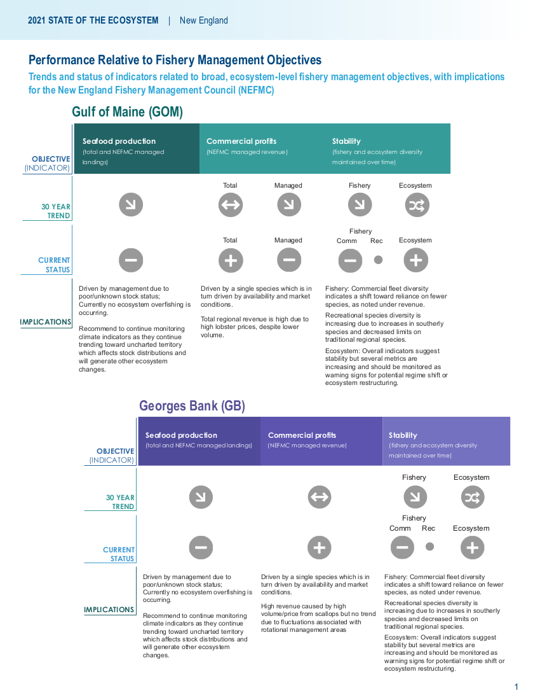
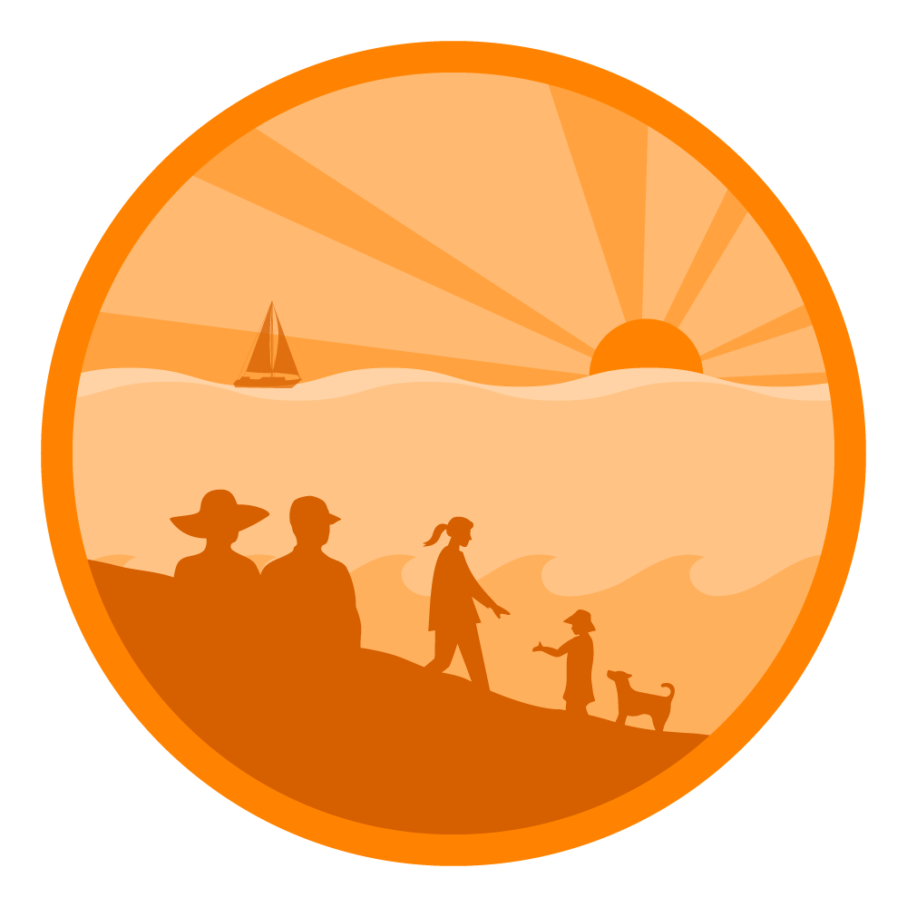

class: top, left

<style>
p.caption {
  font-size: 0.6em;
}
</style>

```{r setup, include=FALSE}

options(htmltools.dir.version = FALSE)
knitr::opts_chunk$set(echo = F,
                      fig.retina = 3,
                      #fig.width = 4,
                      #fig.height = 2,
                      fig.asp = 0.45,
                      warning = F,
                      message = F)
#Plotting and data libraries
library(tidyverse)
library(tidyr)
library(here)
library(kableExtra)
library(ecodata)
library(readxl); library(data.table)
library(DT)
#library(widgetframe)


```

```{r, load_refs, include=FALSE, cache=FALSE}
library(RefManageR)
BibOptions(check.entries = FALSE,
           bib.style = "authoryear",
           cite.style = "authoryear",
           longnamesfirst = FALSE,
           max.names = 1,
           style = "markdown")
myBib <- ReadBib("./MidSOE.bib", check = FALSE)

#,
#           hyperlink = FALSE,
#           dashed = FALSE

```

```{r, code = readLines("https://raw.githubusercontent.com/NOAA-EDAB/ecodata/master/chunk-scripts/human_dimensions_NE.Rmd-setup.R")}
```

```{r, code = readLines("https://raw.githubusercontent.com/NOAA-EDAB/ecodata/master/chunk-scripts/human_dimensions_NE.Rmd-GIS-setup.R")}
```

```{r, code = readLines("https://raw.githubusercontent.com/NOAA-EDAB/ecodata/master/chunk-scripts/macrofauna_NE.Rmd-setup.R")}
```

```{r, code = readLines("https://raw.githubusercontent.com/NOAA-EDAB/ecodata/master/chunk-scripts/LTL_NE.Rmd-setup.R")}
```

# State of the Ecosystem (SOE) reporting
## Improving ecosystem information and synthesis for fishery managers using Integrated Ecosystem Assessment Approach (IEA)

.pull-left[
<br />
- Ecosystem indicators linked to management objectives `r Cite(myBib, "depiper_operationalizing_2017")`
    + Report evolving since 2016
    + Contextual information
    + Fishery-relevant subset of full Ecosystem Status Reprorts

- Open science emphasis `r Cite(myBib, "bastille_improving_2020")`

]

.pull-right[
*The IEA Loop<sup>1</sup>*

.footnote[
[1] https://www.integratedecosystemassessment.noaa.gov/national/IEA-approach
]
]


---
## State of the Ecosystem: Report Structure
.pull-left[

1. Graphical summary
    + Page 1 report card re: objectives &rarr;
    + Page 2 risk summary bullets
    + Page 3 synthesis themes
1. Body of the Report 
    + Performance relative to management objectives
    + Risks to meeting management objectives

]

.pull-right[

```{r management-objectives}
mng_obj <- data.frame("Objective Categories" = c("Seafood Production",
                                                 "Profits","Recreation",
                                                 "Stability","Social & Cultural",
                                                 "Protected Species",
                                                 "Biomass","Productivity",
                                                 "Trophic structure","Habitat"),
"Indicators reported here" = c("Landings; commercial total and by feeding guild; recreational harvest",
                               "Revenue decomposed to price and volume",
                               "Days fished; recreational fleet diversity",
                               "Diversity indices (fishery and ecosystem)",
                               "Community engagement/reliance status",
                               "Bycatch; population (adult and juvenile) numbers, mortalities",
                               "Biomass or abundance by feeding guild from surveys",
                               "Condition and recruitment of managed species, Primary productivity",
                               "Relative biomass of feeding guilds, Zooplankton",
                               "Estuarine and offshore habitat conditions"))

knitr::kable(mng_obj, linesep = "",
      col.names = c("Objective Categories","Indicators reported here"),
      caption = "Example ecosystem-scale fishery management objectives",
      #align = 'c',
      booktabs = T) %>%
  kable_styling(font_size = 14) %>%
 # kable_styling(latex_options = "hold_position", "scale_down") %>%
 # column_spec(c(2), width = c("25em")) %>%
  row_spec(0, bold = TRUE) %>%
 # group_rows("Provisioning/Cultural", 1,4) %>%
 # group_rows("Supporting/Regulating", 5,9)
  pack_rows("Provisioning and Cultural Services", 1,6) %>%
  pack_rows("Supporting and Regulating Services", 7,10)


```
]

---
## Report card page 1 and 2

.pull-left[
.center[


]
]

.pull-right[
.center[


]
]

---
## Risk summary bullets page 3

.center[

]

---
## Graphical summary of ecosystem synthesis themes, page 4

Characterizing ecosystem change for fishery management

* Societal, biological, physical and chemical factors comprise the **multiple system drivers** that influence marine ecosystems through a variety of different pathways. 
* Changes in the multiple drivers can lead to **regime shifts** — large, abrupt and persistent changes in the structure and function of an ecosystem.  
* Regime shifts and changes in how the multiple system drivers interact can result in **ecosystem reorganization** as species and humans respond and adapt to the new environment.

.pull-left[


]

.pull-right[

]

---
## Document Orientation

.pull-left[
Spatial scale


A [glossary of terms](https://noaa-edab.github.io/tech-doc/glossary.html), detailed [technical methods documentation](https://NOAA-EDAB.github.io/tech-doc) and [indicator data](https://github.com/NOAA-EDAB/ecodata) are available online.  
]

.pull-right[
Key to figures
```{r , code = readLines("https://raw.githubusercontent.com/NOAA-EDAB/ecodata/master/chunk-scripts/macrofauna_MAB.Rmd-species-dist.R"), fig.width=5.5, fig.asp=.9}
#species-dist, fig.cap = "Aggregate species distribution metrics for species in the Northeast Large Marine Ecosystem."
```  

.contrib[
Trends assessed only for 30+ years: [more information](https://noaa-edab.github.io/tech-doc/trend-analysis.html)

<p style="color:#FF8C00;">Orange line = significant increase</p>
<p style="color:#9932CC;">Purple line = significant decrease</p>
No color line = not significant or < 30 years
<p style="background-color:#D3D3D3;">Grey background = last 10 years</p>
]
]


---
# Performance relative to management objectives

.center[
 &nbsp; &nbsp; &nbsp;  &nbsp; &nbsp; &nbsp;  &nbsp; &nbsp; &nbsp;  &nbsp; &nbsp; &nbsp; 
]

---
## Objective: Seafood production  

.pull-left[
Indicators: Commercial landings 

.reduced_opacity[
```{r, code = readLines("https://raw.githubusercontent.com/NOAA-EDAB/ecodata/master/chunk-scripts/human_dimensions_NE.Rmd-comdat-total-landings.R"), fig.asp=.4}
#total-landings, fig.cap = paste0("Total commercial seafood landings (black) and ",region," managed seafood landings (red).")
```
.contrib[
Key: Black = Landings of all species combined; <p style="color:#FF6A6A;">Red = Landings of NEFMC managed species</p>
]
]

Coastwide landings at the Federal fishery management plan (FMP) level were mixed in 2020 when compared to recent years. Landings of groundfish were up, while monkfish and scallop were down.  Lobster landings also decreased in 2020.*
]

---

## Objective: Commercial Profits  *New England*
### Indicators: Revenue and Bennet Index of Price and Volume

.pull-left[
```{r, code = readLines("https://raw.githubusercontent.com/NOAA-EDAB/ecodata/master/chunk-scripts/human_dimensions_NE.Rmd-setup.R")}
```

```{r, code = readLines("https://raw.githubusercontent.com/NOAA-EDAB/ecodata/master/chunk-scripts/human_dimensions_NE.Rmd-comdat-comm-revenue.R"), fig.width=8, fig.height=0.25}
```
.contrib[
Key: Black = Revenue of all species combined; <p style="color:#FF6A6A;">Red = Revenue of NEFMC managed species</p>
]
* Driven by single species.
* GB: Fluctuations associated with rotational management areas.
* GB: High revenue caused by high volume/price from scallops.
]

.pull-right[

```{r, code = readLines("https://raw.githubusercontent.com/NOAA-EDAB/ecodata/master/chunk-scripts/human_dimensions_NE.Rmd-bennet-all.R"), fig.asp=0.65, fig.width=8 }
```

* GOM: Total regional revenue high due to high lobster prices, despite lower volume.
]

---