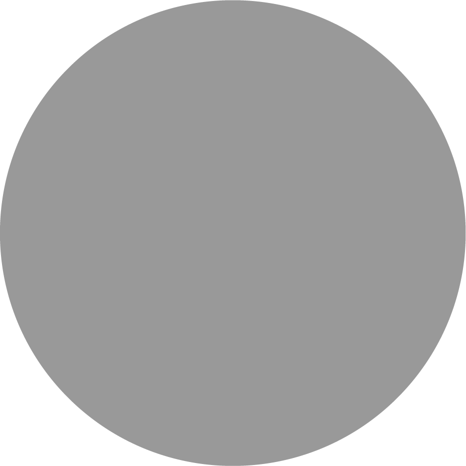
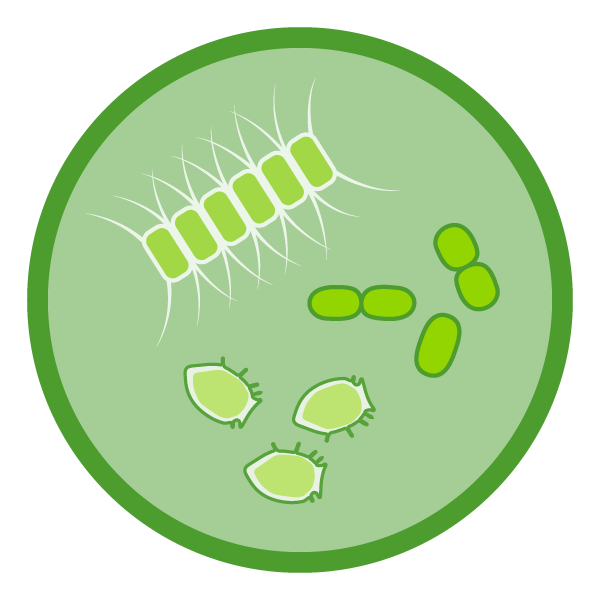
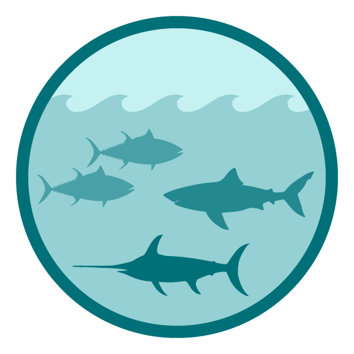
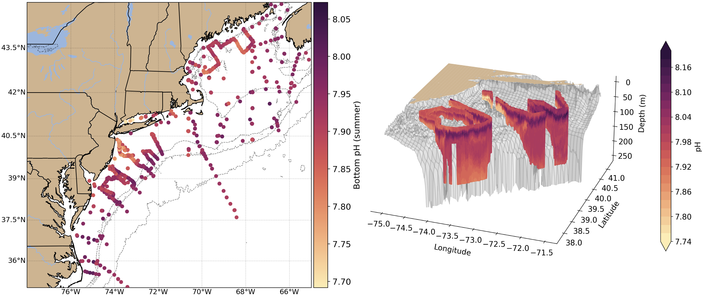

class: top, left

<style>
p.caption {
  font-size: 0.6em;
}
</style>

<style>
.reduced_opacity {
  opacity: 0.5;
}
</style>

```{r setup, include=FALSE}

options(htmltools.dir.version = FALSE)
knitr::opts_chunk$set(echo = F,
                      fig.retina = 3,
                      #fig.width = 4,
                      #fig.height = 2,
                      fig.asp = 0.45,
                      warning = F,
                      message = F)
#Plotting and data libraries
library(tidyverse)
library(tidyr)
library(here)
library(kableExtra)
library(ecodata)
library(readxl); library(data.table)
library(DT)
#library(widgetframe)

x.shade.max<-2021
```

```{r, load_refs, include=FALSE, cache=FALSE}
library(RefManageR)
BibOptions(check.entries = FALSE,
           bib.style = "authoryear",
           cite.style = "authoryear",
           longnamesfirst = FALSE,
           max.names = 1,
           style = "markdown")
myBib <- ReadBib("./MidSOE.bib", check = FALSE)

#,
#           hyperlink = FALSE,
#           dashed = FALSE

```

```{r, code = readLines("https://raw.githubusercontent.com/NOAA-EDAB/ecodata/master/chunk-scripts/human_dimensions_NE.Rmd-setup.R")}
```

```{r, code = readLines("https://raw.githubusercontent.com/NOAA-EDAB/ecodata/master/chunk-scripts/human_dimensions_NE.Rmd-GIS-setup.R")}
```

```{r, code = readLines("https://raw.githubusercontent.com/NOAA-EDAB/ecodata/master/chunk-scripts/macrofauna_NE.Rmd-setup.R")}
```

```{r, code = readLines("https://raw.githubusercontent.com/NOAA-EDAB/ecodata/master/chunk-scripts/LTL_NE.Rmd-setup.R")}
x.shade.max <- 2021
```

# State of the Ecosystem (SOE) reporting
## Improving ecosystem information and synthesis for fishery managers using Integrated Ecosystem Assessment Approach (IEA)

.pull-left[
<br />
- Ecosystem indicators linked to management objectives `r Cite(myBib, "depiper_operationalizing_2017")`

- Two annual reports evolving since 2016
    + Contextual information
    + Fishery-relevant subset of full Ecosystem Status Reprorts

- Open science emphasis `r Cite(myBib, "bastille_improving_2020")`

]

.pull-right[
*The IEA Loop<sup>1</sup>*

.footnote[
[1] https://www.integratedecosystemassessment.noaa.gov/national/IEA-approach
]
]


---
## State of the Ecosystem: Report Structure
.pull-left[

1. Graphical summary
    + Page 1 report card re: objectives &rarr;
    + Page 2 risk summary bullets
    + Page 3 synthesis themes
1. Performance relative to management objectives
    - **What** does the indicator say--up, down, stable?
    - **Why** do we think it is changing: integrates synthesis themes
        - Multiple drivers
        - Regime shifts
        - Ecosystem reorganization
1. Risks to meeting management objectives
    - Climate Change/Ecosystem Productivity
    - Other ocean uses: Offshore Wind Development
]

.pull-right[

```{r management-objectives}
mng_obj <- data.frame("Objective Categories" = c("Seafood Production",
                                                 "Profits","Recreation",
                                                 "Stability","Social & Cultural",
                                                 "Protected Species",
                                                 "Biomass","Productivity",
                                                 "Trophic structure","Habitat"),
"Indicators reported here" = c("Landings; commercial total and by feeding guild; recreational harvest",
                               "Revenue decomposed to price and volume",
                               "Days fished; recreational fleet diversity",
                               "Diversity indices (fishery and ecosystem)",
                               "Community engagement/reliance status",
                               "Bycatch; population (adult and juvenile) numbers, mortalities",
                               "Biomass or abundance by feeding guild from surveys",
                               "Condition and recruitment of managed species, Primary productivity",
                               "Relative biomass of feeding guilds, Zooplankton",
                               "Estuarine and offshore habitat conditions"))

knitr::kable(mng_obj, linesep = "",
      col.names = c("Objective Categories","Indicators reported here"),
      caption = "Example ecosystem-scale fishery management objectives",
      #align = 'c',
      booktabs = T) %>%
  kable_styling(font_size = 14) %>%
 # kable_styling(latex_options = "hold_position", "scale_down") %>%
 # column_spec(c(2), width = c("25em")) %>%
  row_spec(0, bold = TRUE) %>%
 # group_rows("Provisioning/Cultural", 1,4) %>%
 # group_rows("Supporting/Regulating", 5,9)
  pack_rows("Provisioning and Cultural Services", 1,6) %>%
  pack_rows("Supporting and Regulating Services", 7,10)


```
]

---
## Report card page 1 and 2

.pull-left[
.center[


]
]

.pull-right[
.center[


]
]


---
## Graphical summary of ecosystem synthesis themes, page 4

Characterizing ecosystem change for fishery management

* Societal, biological, physical and chemical factors comprise the **multiple system drivers** that influence marine ecosystems through a variety of different pathways. 
* Changes in the multiple drivers can lead to **regime shifts** — large, abrupt and persistent changes in the structure and function of an ecosystem.  
* Regime shifts and changes in how the multiple system drivers interact can result in **ecosystem reorganization** as species and humans respond and adapt to the new environment.

.pull-left[


]

.pull-right[

]

---
## Document Orientation

.pull-left[
Spatial scale


A [glossary of terms](https://noaa-edab.github.io/tech-doc/glossary.html), detailed [technical methods documentation](https://NOAA-EDAB.github.io/tech-doc) and [indicator data](https://github.com/NOAA-EDAB/ecodata) are available online.  
]

.pull-right[
Key to figures
```{r , code = readLines("https://raw.githubusercontent.com/NOAA-EDAB/ecodata/master/chunk-scripts/macrofauna_MAB.Rmd-species-dist.R"), fig.width=5.5, fig.asp=.9}
#species-dist, fig.cap = "Aggregate species distribution metrics for species in the Northeast Large Marine Ecosystem."
```  

.contrib[
Trends assessed only for 30+ years: [more information](https://noaa-edab.github.io/tech-doc/trend-analysis.html)

<p style="color:#FF8C00;">Orange line = significant increase</p>
<p style="color:#9932CC;">Purple line = significant decrease</p>
No color line = not significant or < 30 years
<p style="background-color:#D3D3D3;">Grey background = last 10 years</p>
]
]


---
# Performance relative to management objectives

.center[
 &nbsp; &nbsp; &nbsp;  &nbsp; &nbsp; &nbsp;  &nbsp; &nbsp; &nbsp;  &nbsp; &nbsp; &nbsp; 
]
---
## Objective: New England Seafood Production  

.pull-left[
Indicators: Commercial landings 

.reduced_opacity[
```{r, code = readLines("https://raw.githubusercontent.com/NOAA-EDAB/ecodata/master/chunk-scripts/human_dimensions_NE.Rmd-comdat-total-landings.R"), fig.asp=.4}
#total-landings, fig.cap = paste0("Total commercial seafood landings (black) and ",region," managed seafood landings (red).")
```
.contrib[
Key: Black = Landings of all species combined; <p style="color:#FF6A6A;">Red = Landings of NEFMC managed species</p>
]
]

Multiple drivers: ecosystem and stock production, management, market conditions (including COVID-19 disruptions), and environmental change
]

.pull-right[
Indicators: Recreational harvest
<br />

```{r, code = readLines("https://raw.githubusercontent.com/NOAA-EDAB/ecodata/master/chunk-scripts/human_dimensions_NE.Rmd-recdat-landings.R"), fig.asp=.4}
#, rec-landings, fig.cap = paste0("Total recreational seafood harvest (millions of fish) in the ",region," region.")

```

```{r , code = readLines("https://raw.githubusercontent.com/NOAA-EDAB/ecodata/master/chunk-scripts/human_dimensions_NE.Rmd-rec_hms.R")}
#, fig.width=5
#rec_hms, fig.cap="Recreational shark landings from Large Pelagics Survey." , fig.width=5, fig.asp=.35

```

*[US Seafood Industry and For-Hire
Sector Impacts from COVID-19: 2020 in Perspective](https://spo.nmfs.noaa.gov/sites/default/files/TM221.pdf) 

]


---

## Objective: New England Commercial Profits  

Indicators: Revenue and Bennet Index of Price and Volume

.pull-left[
.reduced_opacity[
```{r, code = readLines("https://raw.githubusercontent.com/NOAA-EDAB/ecodata/master/chunk-scripts/human_dimensions_NE.Rmd-setup.R")}
```

```{r, code = readLines("https://raw.githubusercontent.com/NOAA-EDAB/ecodata/master/chunk-scripts/human_dimensions_NE.Rmd-comdat-comm-revenue.R"), fig.width=8, fig.height=0.25}
```

.contrib[
Key: Black = Revenue of all species combined; <p style="color:#FF6A6A;">Red = Revenue of NEFMC managed species</p>
]
]
* Driven by single species.
* GB: Fluctuations associated with rotational management areas.
* GB: High revenue caused by high volume/price from scallops.
]

.pull-right[
.reduced_opacity[
```{r, code = readLines("https://raw.githubusercontent.com/NOAA-EDAB/ecodata/master/chunk-scripts/human_dimensions_NE.Rmd-bennet-all.R"), fig.asp=0.65, fig.width=8 }
```
]
* GOM: Total regional revenue high due to high lobster prices, despite lower volume.
]

---
## Objective: Mid-Atlantic Recreational Opportunities  ;   

```{r, code = readLines("https://raw.githubusercontent.com/NOAA-EDAB/ecodata/master/chunk-scripts/human_dimensions_MAB.Rmd-setup.R")}
```

.pull-left[
Indicators: Recreational effort and fleet diversity   
```{r , code = readLines("https://raw.githubusercontent.com/NOAA-EDAB/ecodata/master/chunk-scripts/human_dimensions_MAB.Rmd-recdat-effort.R")}
#rec-op, fig.cap = paste0("Recreational effort in the ",region,".")
```

```{r , code = readLines("https://raw.githubusercontent.com/NOAA-EDAB/ecodata/master/chunk-scripts/human_dimensions_MAB.Rmd-recdat-diversity.R")}
#rec-div, fig.cap = paste0("Recreational fleet effort diversity in the ",region,".")
```
]

.pull-right[
Implications:

* Increased angler trips in 2020 relative to previous years strongly influence the long term increase in recreational effort. Recreational effort (angler trips) has increased over the long term, with 2020 effort above the long-term average.


* Decline in recreational fleet diversity suggests a potentially reduced range of opportunities. 

* Driven by party/charter contraction (from a high of 24% of angler trips to 7% currently), and a shift toward shore based angling.

]


---
## Objective: New England Stability  Com ; Rec 

.pull-left[
**Fishery**  Indicators: commercial species revenue diversity, recreational species catch diversity
```{r, code = readLines("https://raw.githubusercontent.com/NOAA-EDAB/ecodata/master/chunk-scripts/human_dimensions_NE.Rmd-setup.R")}
```

```{r, code = readLines("https://raw.githubusercontent.com/NOAA-EDAB/ecodata/master/chunk-scripts/human_dimensions_NE.Rmd-GIS-setup.R")}
```

<!-- ```{r, code = readLines("https://raw.githubusercontent.com/NOAA-EDAB/ecodata/master/chunk-scripts/human_dimensions_NE.Rmd-commercial-div-species-div.R")} -->
<!-- ``` -->

```{r}
comm_div <- ecodata::commercial_div %>% 
  dplyr::filter(EPU == region_abbr) %>% 
  dplyr::group_by(Var) %>% 
  dplyr::mutate(hline = mean(Value))

ylim_fc <- c(min(comm_div[comm_div$Var == "Fleet count",]$Value) - 10, max(comm_div[comm_div$Var == "Fleet count",]$Value) + 10 )
ylim_fd <- c(3, max(comm_div[comm_div$Var == "Fleet diversity in revenue",]$Value) + 3 )

comm_div %>% 
  dplyr::filter(Var == "Fleet diversity in revenue") %>% 
  ggplot2::ggplot() + 
 #Highlight last ten years
  ggplot2::annotate("rect", fill = shade.fill, alpha = shade.alpha,
      xmin = x.shade.min , xmax = x.shade.max,
      ymin = -Inf, ymax = Inf) +
  ggplot2::geom_line(aes(x = Time, y = Value), size = lwd) +
  ggplot2::geom_point(aes(x = Time, y = Value), size = pcex) +
  ggplot2::ylim(ylim_fd)+
  ggplot2::scale_x_continuous(expand = c(0.01, 0.01)) +
  ggplot2::scale_color_manual(values = "black", aesthetics = "color")+
  ggplot2::guides(color = FALSE) +
  ggplot2::ggtitle("Fleet diversity in revenue") +
  ggplot2::ylab(expression("Effective Shannon")) +
  ggplot2::xlab(element_blank())+
  ggplot2::geom_hline(aes(yintercept = hline,
               color = Var),
           size = hline.size,
           alpha = hline.alpha,
           linetype = hline.lty) +
  ecodata::theme_ts()+
  ecodata::theme_title()

```

```{r , code = readLines("https://raw.githubusercontent.com/NOAA-EDAB/ecodata/master/chunk-scripts/human_dimensions_NE.Rmd-recdat-div-catch.R")}

```

] 

.pull-right[
**Ecological** Indicator: expected number of species, NEFSC bottom trawl survey
```{r , code = readLines("https://raw.githubusercontent.com/NOAA-EDAB/ecodata/master/chunk-scripts/macrofauna_NE.Rmd-exp-n.R")}
#exp-n, fig.cap = "Adult fish diversity the Mid-Atlantic Bight, based on expected number of species."
```

Implications:  
* Commercial fishery diversity driven by small number of species
* Diminished capacity to respond to future fishing opportunities
* Recreational diversity due to species distributions and regulations
* Adult diversity in GOM suggests increase in warm-water species
]

???
* Overall stability in the fisheries and ecosystem components
* Increasing diversity in several indicators warrants continued monitoring

---
## Objective: Mid-Atlantic Environmental Justice and Social Vulnerability &emsp; 
Indicators: Environmental justice vulnerability, commercial fishery engagement and reliance  
.pull-left[
```{r , code = readLines("https://raw.githubusercontent.com/NOAA-EDAB/ecodata/master/chunk-scripts/human_dimensions_MAB.Rmd-commercial-engagement.R"), fig.width = 6.5, fig.asp = 0.75}
#commercial-engagement, fig.cap= "Commercial engagement, reliance, and social vulnerability for the top commercial fishing communities in the Mid-Atlantic."
```
]

.pull-right[

```{r, out.width="100%"}
#get rid of the gray excel outline using R package magick
ComEJ <- magick::image_read("EDAB_images/EJ_Commercial_MAB.png") 

# from https://stackoverflow.com/questions/64597525/r-magick-square-crop-and-circular-mask
# get height, width and crop longer side to match shorter side
ii <- magick::image_info(ComEJ)

cropComEJ <- ComEJ %>%
  #magick::image_crop(cropComEJ, "820x580+5+5")
  magick::image_crop(paste0(ii$width-10,"x",ii$height-10, "+5+5"))

cropComEJ
```

<!---->
]

Implications: Highlighted communities may be vulnerable to changes in fishing patterns due to regulations and/or climate change. When also experiencing environmental justice issues, they may have lower ability to successfully respond to change.

---
## Objectives: Protected species *Maintain bycatch below thresholds*  

.pull-left[
Indicators: Harbor porpoise and gray seal bycatch
.reduced_opacity[
```{r, code = readLines("https://raw.githubusercontent.com/NOAA-EDAB/ecodata/master/chunk-scripts/macrofauna_MAB.Rmd-harborporpoise.R"), fig.height=3}
```

```{r, code = readLines("https://raw.githubusercontent.com/NOAA-EDAB/ecodata/master/chunk-scripts/macrofauna_MAB.Rmd-grayseal.R"), fig.height=3}
```
]
]

.pull-right[
Implications: 

* Currently meeting objectives

* The downward trend in harbor porpoise bycatch can also be due to a decrease in harbor porpoise abundance in US waters, reducing their overlap with fisheries, and a decrease in gillnet effort. 

* The increasing trend in gray seal bycatch may be related to an increase in the gray seal population.
]

---
## Objectives: Protected species *Recover endangered populations*  

.pull-left[
Indicators: North Atlantic right whale population, calf counts

```{r, code = readLines("https://raw.githubusercontent.com/NOAA-EDAB/ecodata/master/chunk-scripts/macrofauna_NE.Rmd-GIS-setup.R")}
```

```{r, code = readLines("https://raw.githubusercontent.com/NOAA-EDAB/ecodata/master/chunk-scripts/macrofauna_MAB.Rmd-narw-abundance.R"), fig.height=3}
```

```{r, code = readLines("https://raw.githubusercontent.com/NOAA-EDAB/ecodata/master/chunk-scripts/macrofauna_MAB.Rmd-NARW-calf-abundance.R"), fig.height=3}
```
]

.pull-right[
Implications:  

* Population drivers for North Atlantic Right Whales (NARW) include combined fishery interactions/ship strikes, distribution shifts, and copepod availability.

* Additional potential stressors include offshore wind development, which overlaps with important habitat areas used year-round by right whales, including mother and calf migration corridors and foraging habitat.

* Unusual mortality events continue for 3 large whale species.
]


---
# Risks to meeting fishery management objectives

.center[
 &nbsp; &nbsp; &nbsp; 
] 

.center[
 &nbsp; &nbsp; &nbsp;  &nbsp; &nbsp; &nbsp;  &nbsp; &nbsp; &nbsp;   &nbsp; &nbsp; &nbsp;  
]
---
## Risks: Climate Change
```{r, code = readLines("https://raw.githubusercontent.com/NOAA-EDAB/ecodata/master/chunk-scripts/human_dimensions_MAB.Rmd-setup.R")}
```
.pull-left[
Indicators: MAB surface and bottom temperature

```{r, code =readLines("https://raw.githubusercontent.com/NOAA-EDAB/ecodata/master/chunk-scripts/LTL_MAB.Rmd-seasonal-sst-anom-gridded.R"), fig.width = 10, fig.asp="200%"}

```

```{r, code =readLines("https://raw.githubusercontent.com/NOAA-EDAB/ecodata/master/chunk-scripts/LTL_MAB.Rmd-bottom-temp.R"), fig.height=2, fig.asp="70%"}

```
]

.pull-right[
Indicators: MAB marine heatwaves

```{r , code=readLines("https://raw.githubusercontent.com/NOAA-EDAB/ecodata/master/chunk-scripts/LTL_MAB.Rmd-heatwave-year.R"), fig.width=5, fig.asp=.6}

```

```{r, code = readLines("https://raw.githubusercontent.com/NOAA-EDAB/ecodata/master/chunk-scripts/LTL_MAB.Rmd-heatwave.R")}
```
]
---
## Risks: Climate change

.pull-left[
Indicators: ocean currents

```{r, code = readLines("https://raw.githubusercontent.com/NOAA-EDAB/ecodata/master/chunk-scripts/LTL_MAB.Rmd-gsi.R")}
```


```{r , code=readLines("https://raw.githubusercontent.com/NOAA-EDAB/ecodata/master/chunk-scripts/LTL_NE.Rmd-slopewater.R"), fig.height=2}
```

]

.pull-right[

Indicator: warm core rings

```{r , code=readLines("https://raw.githubusercontent.com/NOAA-EDAB/ecodata/master/chunk-scripts/LTL_MAB.Rmd-wcr.R")}
```

.center[
 
]
]


---
## Risks: Climate change


.pull-left[

Indicator: cold pool indices

```{r , code=readLines("https://raw.githubusercontent.com/NOAA-EDAB/ecodata/master/chunk-scripts/LTL_MAB.Rmd-cold_pool.R")}
```

]
.pull-right[

Indicator: ocean acidifictaion 


]

Implications: Changes in cold pool could have impacts on multiple managed species. Areas of lower pH are in known surfclam habitat. 


 
---
## Risks: Climate change and estuarine habitat &emsp; 

.pull-left[
Indicators: Chesapeake Bay temperature
```{r, fig.asp=1}
sst<- ecodata::ches_bay_sst

map.lwd <- 0.4

# Set lat/lon window for maps
xmin = -77.5
xmax = -74.5
ymin = 36.5
ymax = 40
xlims <- c(xmin, xmax)
ylims <- c(ymin, ymax)
#sst <- ecodata::seasonal_sst_anomaly_gridded
crs<- "+proj=longlat +lat_1=35 +lat_2=45 +lat_0=40 +lon_0=-77 +x_0=0 +y_0=0 +datum=NAD83 +no_defs +ellps=GRS80 +towgs84=0,0,0"
sst$Season <- factor(sst$Season, levels = c("Winter",
                                            "Spring",
                                            "Summer",
                                            "Fall"))

sst<- sst %>% dplyr::mutate(Value = replace(Value, Value > 5, 5))
#sst_map <-
  ggplot2::ggplot() +
  ggplot2::geom_sf(data = ecodata::coast, size = map.lwd) +
  ggplot2::scale_fill_gradient2(name = "Temp.\nAnomaly (C)",
                                low = scales::muted("blue"),
                                mid = "white",
                                high = scales::muted("red"),
                                limits = c(-4,4),
                                labels = c("<-5", "-2.5", "0", "2.5", ">5")) +
  ggplot2::coord_sf(crs = crs, xlim = xlims, ylim = ylims) +

  ggplot2::geom_tile(data = sst, aes(x = Latitude, y = Longitude,fill = Value)) +
  ggplot2::facet_wrap(Season~.) +
  ecodata::theme_map() +
  ggplot2::ggtitle("Chesapeake Bay SST anomaly (2021)") +
  ggplot2::xlab(element_blank()) +
  ggplot2::ylab(element_blank()) +
  scale_y_continuous(breaks = seq(37, 40, by = 1))+
  scale_x_continuous(breaks = seq(-77, -75, by = 1))+
  ggplot2::theme(panel.border = element_rect(colour = "black", fill=NA, size=0.75),
                 legend.key = element_blank(),
                 axis.title = element_text(size = 6),
                 strip.background = element_blank(),
                 strip.text=element_text(hjust=0),
                 axis.text = element_text(size = 6),
                 axis.title.y = element_text(angle = 90) )+
  ecodata::theme_title()
```

<!--
```{r , code=readLines("https://raw.githubusercontent.com/NOAA-EDAB/ecodata/master/chunk-scripts/LTL_MAB.Rmd-ch-bay-temp.R"), fig.width = 5, fig.asp=.5 }
```

```{r , code=readLines("https://raw.githubusercontent.com/NOAA-EDAB/ecodata/master/chunk-scripts/LTL_MAB.Rmd-ch-bay-sal.R"), fig.width = 5, fig.asp=.5 }
```
-->
]

.pull-right[
Indicator: SAV trends in Chesapeake Bay
```{r , code=readLines("https://raw.githubusercontent.com/NOAA-EDAB/ecodata/master/chunk-scripts/LTL_MAB.Rmd-sav.R"), fig.width = 6}
```

Indicator: water quality attainment
```{r , code=readLines("https://raw.githubusercontent.com/NOAA-EDAB/ecodata/master/chunk-scripts/LTL_MAB.Rmd-ches-bay-wq.R"), fig.width = 6}
```
]

---
## Risks: Ecosystem productivity  

Indicators: chlorophyll, primary production, phytoplankton size class

.pull-left[
```{r , code=readLines("https://raw.githubusercontent.com/NOAA-EDAB/ecodata/master/chunk-scripts/LTL_MAB.Rmd-chl-weekly.R"), fig.asp = 0.9}
#chl-weekly, fig.cap = "Weekly chlorophyll concentrations and primary productivity in the Mid-Atlantic are shown by the colored line for 2021 (dashed portion indicates preliminary data from a near real-time satellite source). The long-term mean is shown in black and shading indicates +/- 1 standard deviation.", fig.width = 5
```

]

.pull-right[

```{r , code=readLines("https://raw.githubusercontent.com/NOAA-EDAB/ecodata/master/chunk-scripts/LTL_MAB.Rmd-weekly-phyto-size.R"), fig.asp=.55}
#weekly-phyto-size, fig.cap="The annual climatology (1998-2019) percent composition of the phytoplankton size classes in the Mid-Atlantic bight based on satellite observations."
```

Implications: increased production by smaller phytoplankton implies less efficient transfer of primary production to higher trophic levels. 

]


  


---

## Risks: Ecosystem productivity

```{r , code=readLines("https://raw.githubusercontent.com/NOAA-EDAB/ecodata/master/chunk-scripts/macrofauna_MAB.Rmd-energy-density.R"), out.width = "90%", fig.asp = 0.5}
#energy-density, fig.cap="Forage fish mean energy density mean and standard deviation by season and year, compared with 1980s (Steimle and Terranove 1985) and 1990s (Lawson et al. 1998) values.", 
```

Implications: fluctuating environmental conditions and prey for forage species affect both abundance and energy content. Energy content varies by season, and has changed over time most dramatically for Atlantic herring

---
## Risks: Ecosystem productivity 

.pull-left[
Indicator: fish condition 

```{r, fig.dim=c(10,10)}
knitr::include_graphics("EDAB_images/MAB_Condition_allsex_2022_viridis.jpg")

```

]

.pull-right[
Indicator: fish productivity anomaly
```{r , code=readLines("https://raw.githubusercontent.com/NOAA-EDAB/ecodata/master/chunk-scripts/macrofauna_MAB.Rmd-productivity-anomaly.R"), fig.asp=.75}

```

]

Implications: 
Most species in the MAB had below average or poor condition again in 2021. Preliminary results of synthetic analyses show that changes in temperature, zooplankton, fishing pressure, and population size influence the condition of different fish species. 


---
## Risks: Ecosystem Structure

Indicator: species distribution 

```{r , code = readLines("https://raw.githubusercontent.com/NOAA-EDAB/ecodata/master/chunk-scripts/macrofauna_MAB.Rmd-species-dist.R"), fig.height=10, fig.asp=.9}
#species-dist, fig.cap = "Aggregate species distribution metrics for species in the Northeast Large Marine Ecosystem."
``` 

Implications: Species as a whole moving could mean new species interactions and potential for fishers.


---
## Risks: Ecosystem structure

Indicators: predator status and trends
.pull-left[

```{r , code=readLines("https://raw.githubusercontent.com/NOAA-EDAB/ecodata/master/chunk-scripts/macrofauna_MAB.Rmd-hms-cpue-sharks.R")}
#hms-cpue-sharks, fig.cap="Estimated number of sharks per unit effort from Highly Migratory Species Pelagic Observer Program data."
```


]

.pull-right[

```{r , code=readLines("https://raw.githubusercontent.com/NOAA-EDAB/ecodata/master/chunk-scripts/human_dimensions_MAB.Rmd-hms-stock-status.R")}
```
.contrib[
[HMS stock codes](https://noaa-edab.github.io/tech-doc/atlantic-highly-migratory-species-stock-status.html)
]
]

Implications: No trend in aggregate sharks and HMS populations mainly at or above taget. Stable predator populations suggest stable predation pressure on managed species, but increasing seal populations may reflect increasing predation pressure.

 


---

## Risks: Habitat climate vulnerability

Indicators: climate sensitive species life stages mapped to climate vulnerable habitats  

```{r , message=FALSE}
#Read in habitat table

ne <- as.data.table(readxl::read_xlsx('habitat_vulnerability.xlsx',
                         sheet = 'New England', skip = 1))

#Identify individual species climate vulnerability
vhigh.vul <- unique(ne[`Species Vulnerability Rank (FCVA)` == 'Very high', Species])
high.vul  <- unique(ne[`Species Vulnerability Rank (FCVA)` == 'High', Species])
mod.vul   <- unique(ne[`Species Vulnerability Rank (FCVA)` == 'Moderate', Species])
low.vul   <- unique(ne[`Species Vulnerability Rank (FCVA)` == 'Low', Species])

#Grab habitat vulnerability 
hab.vul <- unique(ne[, c('Habitat Name', 'Habitat Vulnerability Rank (HVCA)')])
habitats <- hab.vul[, 'Habitat Name']
hab.vul <- data.table('Habitat Vulnerability' = c(NA, NA, t(hab.vul[, 'Habitat Vulnerability Rank (HVCA)'])))

#Rearrange table
ne <- data.table::melt.data.table(ne, id.vars = c('Habitat Name', 'Species'),
                                   measure.vars = c('Eggs/Larva', 'Juvenile/YOY',
                                                    'Adult', 'Spawning Adult'),
                                   variable.name = 'Stage', value.name = 'Dependence')
ne[, Habitat := as.factor(ne$'Habitat Name')]
ne <- data.table::dcast.data.table(ne, Species + Stage ~ Habitat,
                                    value.var = 'Dependence')
setcolorder(ne, c('Species', 'Stage', habitats$'Habitat Name'))

#Add Habitat Vulnerbaility
#hab.table <- rbindlist(list(as.data.table(t(hab.vul)), ne), use.names = F)
hab.table <- ne
#Add names back in
names(hab.table) <- names(ne)
hab.table <- hab.table %>% mutate_if(is.character, str_trim)

#from examples here https://rstudio.github.io/DT/010-style.html

#color coding cells works
#need to add column with species vulnerability and color code species by it but not show it, like #hideV6 example at link
#if we show it we can sort by species vulnerability though... alphabetical doesnt work so use numbers to go lowest-highest
#still need to color code headers
hab.table <- hab.table %>%
  mutate(spVul = #Color code species based on climate vul
    # case_when(Species %in% low.vul ~ "low.vul",
    #           Species %in% mod.vul ~ "mod.vul",
    #           Species %in% high.vul ~ "high.vul",
    #           Species %in% vhigh.vul ~ "vhigh.vul")
    # )
    case_when(Species %in% low.vul ~ 1,
              Species %in% mod.vul ~ 2,
              Species %in% high.vul ~ 3,
              Species %in% vhigh.vul ~ 4)
    )

colnames(hab.table)[c(3:4)] <- paste0('<span style="box-shadow: -10px 0 0 red, 10px 0 0 red; background-color:red; color:white">',colnames(hab.table)[c(3:4)],'</span>')
colnames(hab.table)[c(5:9)] <- paste0('<span style="box-shadow: -10px 0 0 orange, 10px 0 0 orange; background-color:',c("orange"),'">',colnames(hab.table)[c(5:10)],'</span>')
colnames(hab.table)[c(10:14)] <- paste0('<span style="box-shadow: -10px 0 0 yellow, 10px 0 0 yellow; background-color:',c("yellow"),'">',colnames(hab.table)[c(11:15)],'</span>')

dt <- datatable(hab.table, rownames = FALSE, escape = FALSE,
          extensions = c('Scroller', 'FixedColumns'), #add scrolling and fixed column
          options = list(deferRender = TRUE,
          scrollY = 300, scroller = TRUE,
          dom = 't',scrollX = TRUE,fixedColumns = TRUE)
          #, options = list(columnDefs = list(list(targets = 16, visible = FALSE)))
  ) %>% 
  formatStyle(
    names(hab.table)[3:4],
    backgroundColor = '#FF000080'
  ) %>%
  formatStyle(
    names(hab.table)[5:9],
    backgroundColor = '#FFA50080'
  ) %>%
  formatStyle(
    names(hab.table)[10:14],
    backgroundColor = '#FFFF0080'
  ) %>%

  formatStyle(#Color code base on dependence
    'Species', "spVul",
    backgroundColor = styleEqual(#c("low.vul", "mod.vul", "high.vul", "vhigh.vul"),
                                 c(1,2,3,4),
                                 c('lightgreen', 'yellow', 'orange', 'red')), #Color code base on dependence)
    color = styleEqual(c(1,2,3,4),
                                 c('black', 'black', 'black', 'white'))
    ) %>%
    formatStyle(
    names(hab.table),
    backgroundColor = styleEqual(c("Low", "Moderate", "High", "Very high"), 
                                 c('lightgreen', 'yellow', 'orange', 'red')), 
    color = styleEqual(c("Low", "Moderate", "High", "Very high"), 
                                 c('black', 'black', 'black', 'white'))
  )

widgetframe::frameWidget(dt)
```

---
## Risks: Offshore Wind Development 

.pull-left[
Indicators: development timeline, fishery and community specific revenue in lease areas

```{r, code = readLines("https://raw.githubusercontent.com/NOAA-EDAB/ecodata/master/chunk-scripts/human_dimensions_MAB.Rmd-wind-proposed-dev.R"), fig.height=3}
```

```{r, code=readLines("https://raw.githubusercontent.com/NOAA-EDAB/ecodata/master/chunk-scripts/human_dimensions_MAB.Rmd-wea-spp-rev.R")}
#, fig.width=5, fig.asp=.4
#wea-spp-rev, fig.cap="Wind energy revenue in the Mid-Atlantic."
```

]

.pull-right[
```{r, code = readLines("https://raw.githubusercontent.com/NOAA-EDAB/ecodata/master/chunk-scripts/human_dimensions_MAB.Rmd-wind-port.R"), fig.asp=1.1}
```

]

---

## Risks: Offshore Wind Development 

.pull-left[
Implications: 

*  Current plans for rapid buildout of offshore wind in a patchwork of areas spreads the impacts differentially throughout the region.

*  Development will affect species differently, negatively affecting species that prefer soft bottom habitat while potentially benefiting species that prefer hard structured habitat.

*  Up to 20% of annual commercial landings and revenue for Mid-Atlantic species occur in lease areas.


]

.pull-right[
```{r, out.width="80%"}
knitr::include_graphics("EDAB_images/offshore_wind_timeline.png")
#fishcond <- magick::image_read("EDAB_images/MAB_Condition_allsex_2022_viridis.jpg") 
#magick::image_trim(fishcond)
```
]


---
background-image: url("EDAB_images/noaa-iea.png")
background-size: 350px
background-position: right bottom

## Contributors - THANK YOU!

The New England and Mid-Atlantic SOEs made possible by (at least) 61 contributors from 14 institutions 

.pull-left[
.contrib[
Kimberly Bastille<br>
Aaron Beaver (Anchor QEA)<br>
Andy Beet<br>
Ruth Boettcher (Virginia Department of Game and Inland Fisheries)<br>
Mandy Bromilow (NOAA Chesapeake Bay Office)<br>
Zhuomin Chen (Woods Hole Oceanographic Institute)<br>
Joseph Caracappa<br>
Doug Christel (GARFO)<br>
Patricia Clay<br>
Lisa Colburn<br>
Jennifer Cudney (NMFS Atlantic HMS Management Division)<br>
Tobey Curtis (NMFS Atlantic HMS Management Division)<br>
Geret DePiper<br>
Dan Dorfman (NOAA-NOS-NCCOS)<br>
Emily Farr (NMFS Office of Habitat Conservation)<br>
Michael Fogarty<br>
Paula Fratantoni<br>
Kevin Friedland<br>
Marjy Friedrichs (VIMS)<br>
Sarah Gaichas<br>
Ben Galuardi (GARFO)<br>
Avijit Gangopadhyay (School for Marine Science and Technology, University of Massachusetts Dartmouth)<br>
James Gartland (Virginia Institute of Marine Science)<br>
Glen Gawarkiewicz (Woods Hole Oceanographic Institution)<br>
Sean Hardison<br>
Kimberly Hyde<br>
John Kosik<br>
Steve Kress (National Audubon Society’s Seabird Restoration Program)<br>
Young-Oh Kwon (Woods Hole Oceanographic Institute)<br>

]
]

.pull-right[
.contrib[
Scott Large<br>
Andrew Lipsky<br>
Sean Lucey<br>
Don Lyons (National Audubon Society’s Seabird Restoration Program)<br>
Chris Melrose<br>
Shannon Meseck<br>
Ryan Morse<br>
Brandon Muffley (MAFMC)<br>
Kimberly Murray<br>
Chris Orphanides<br>
Richard Pace<br>
Tom Parham (Maryland DNR)
Charles Perretti<br>
CJ Pellerin (NOAA Chesapeake Bay Office)<br>
Grace Roskar (NMFS Office of Habitat Conservation)<br>
Grace Saba (Rutgers)<br>
Vincent Saba<br>
Chris Schillaci (GARFO)<br>
Dave Secor (CBL)<br>
Angela Silva<br>
Adrienne Silver (UMass/SMAST)<br>
Emily Slesinger (Rutgers University)<br>
Laurel Smith<br>
Talya tenBrink (GARFO)<br>
Bruce Vogt (NOAA Chesapeake Bay Office)<br>
Ron Vogel (UMD Cooperative Institute for Satellite Earth System Studies and NOAA/NESDIS Center for Satellite Applications and Research)<br>
John Walden<br>
Harvey Walsh<br>
Changhua Weng<br>
Mark Wuenschel  

]
]


---
## References

.contrib[
```{r refs, echo=FALSE, results="asis"}
PrintBibliography(myBib)
```
]

## Additional resources

.pull-left[
* [ecodata R package](https://github.com/noaa-edab/ecodata)

* Visualizations:
  * [New England Human Dimensions indicators](http://noaa-edab.github.io/ecodata/human_dimensions_NE)
  * [New England Macrofauna indicators](http://noaa-edab.github.io/ecodata/macrofauna_NE)
  * [New England Lower trophic level indicators](https://noaa-edab.github.io/ecodata/LTL_NE)
  * [Mid-Atlantic Human Dimensions indicators](http://noaa-edab.github.io/ecodata/human_dimensions_MAB)
  * [Mid-Atlantic Macrofauna indicators](http://noaa-edab.github.io/ecodata/macrofauna_MAB)
  * [Mid-Atlantic Lower trophic level indicators](https://noaa-edab.github.io/ecodata/LTL_MAB)
]
.pull-right[
* [SOE MAFMC 2022](https://doi.org/10.25923/5s5y-0h81)

* [SOE NEFMC 2022](https://doi.org/10.25923/ypv2-mw79)

* [SOE Technical Documentation](https://noaa-edab.github.io/tech-doc)

* [Draft indicator catalog](https://noaa-edab.github.io/catalog/)

.contrib[

* Slides available at https://noaa-edab.github.io/presentations
* Contact: <kimberly.bastille@noaa.gov>
]
]

---
background-image: url("EDAB_images/SOE_feature_image.png")
background-size: 1200px
background-position: center

.right[
<br />
<br />
<br />
<br />
<br />
<br />
<br />
<br />
<br />
<br />
# Thank you!

# Questions?
]