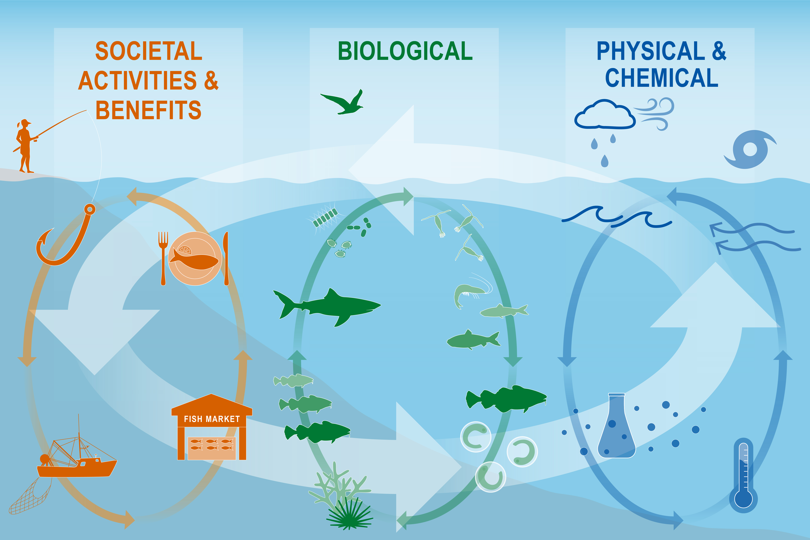
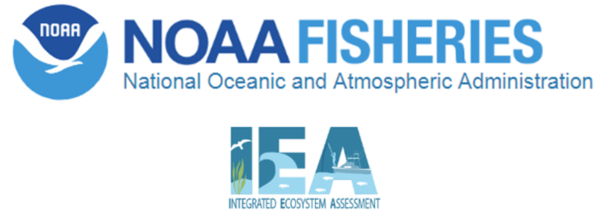

class: top, left

```{r setup, include=FALSE}

options(htmltools.dir.version = FALSE)
knitr::opts_chunk$set(echo = F,
                      fig.retina = 3,
                      warning = F,
                      message = F)
#Plotting and data libraries
library(tidyverse)
library(tidyr)
library(here)
library(kableExtra)
library(ecodata)
library(readxl); library(data.table)
library(DT)
library(widgetframe)

#Region identifiers
epu <- "Mid-Atlantic Bight"
epu_abbr <- "MAB"
region <- "Mid-Atlantic"
region_abbr <- "MA" #Some commercial data organized by "MA" or "NE" regions, not by EPU 

#General inline text input for report

#Council
council <- "Mid-Atlantic Fishery Management Council"
council_abbr <- "MAFMC"

#Define constants for commercial landings figure plot
series.col <- c("indianred","black")


#Time series constants
shade.alpha <- 0.3
shade.fill <- "lightgrey"
lwd <- 1
pcex <- 2
trend.alpha <- 0.5
trend.size <- 2
hline.size <- 1
hline.alpha <- 0.35
hline.lty <- "dashed"
label.size <- 5
hjust.label <- 1.5
letter_size <- 4
feeding.guilds1<- c("Piscivore","Planktivore","Benthivore","Benthos")
feeding.guilds <- c("Apex Predator","Piscivore","Planktivore","Benthivore","Benthos")
x.shade.min <- 2010
x.shade.max <- 2020
#Function for custom ggplot facet labels
label <- function(variable,value){
  return(facet_names[value])
}

```

```{r, load_refs, include=FALSE, cache=FALSE}
library(RefManageR)
BibOptions(check.entries = FALSE,
           bib.style = "authoryear",
           cite.style = "authoryear",
           longnamesfirst = FALSE,
           max.names = 1,
           style = "markdown")
myBib <- ReadBib("./MidSOE.bib", check = FALSE)

#,
#           hyperlink = FALSE,
#           dashed = FALSE

```

# Integrated Ecosystem Assessment

.pull-left[
<br>

IEA Approach

- Supports shift to ecosystem based management

- Iterative

- Collaborative


]

.pull-right[
*The IEA Loop<sup>1</sup>*

]

.footnote[
[1] https://www.integratedecosystemassessment.noaa.gov/national/IEA-approach
]

???
---

## State of the Ecosystem (SOE) reporting
Improving ecosystem information and synthesis for fishery managers

.pull-left[

- Ecosystem indicators linked to management objectives `r Cite(myBib, "depiper_operationalizing_2017")`
    + Contextual information
    + Report evolving since 2016
    + Fishery-relevant subset of full Ecosystem Status Reports

- Open science emphasis `r Cite(myBib, "bastille_improving_2020")`

- Used within Mid-Atlantic Fishery Management Council's Ecosystem Process `r Cite(myBib, "muffley_there_2020")`
 
]

.pull-right[

]

---

background-image: url("EDAB_images/nes-components-abstracted.png")
background-size: 700px
background-position: right bottom

## State of the Ecosystem (SOE) Reporting: Context for busy people

*"So what?" --John Boreman, September 2016*

1. Clear linkage of ecosystem indicators with management objectives

1. Synthesis across indicators for big picture

1. Objectives related to human-well being placed first in report

1. Short (< 30 pages), non-technical (but rigorous) text

1. Emphasis on reproducibility


???
In 2016, we began taking steps to address these common critiques of the ESR model
Many indicators presented at WGNARS, used in larger Ecosystem Status reports
Shorter, fishery specific State of the Ecosystem (SOE) report with conceptual models prototyped based on California Current reporting
Feedback from fishery managers redesigned reporting to align with objectives outlined by WGNARS

---
## State of the Ecosystem Scope

.pull-left[


]
.pull-right[
Mapping trawl survey strata to Ecological Production Units (EPUs)  

.contrib[
[More information on EPUs](https://noaa-edab.github.io/tech-doc/epu.html)  
[More information on survey data](https://noaa-edab.github.io/tech-doc/survdat.html)  
]
]


---
## State of the Ecosystem Report Structure
.pull-left[

## 2021 Report
1. Summary pages
    + summary table 
    + possible risks
    + synthesis themes
    
1. Performance against management objectives
    + ------------------------------------>
    
1. Risks
    + Climate
    + Wind

]

.pull-right[

*Established ecosystem-scale objectives*

```{r management-objectives}
mng_obj <- data.frame("Objective Categories" = c("Seafood Production",
                                                 "Profits","Recreation",
                                                 "Social & Cultural", "Stability",
                                                 "Biomass","Productivity",
                                                 "Trophic structure","Habitat"),
"Indicators reported here" = c("Landings by feeding guild","Revenue decomposed to price and volume",
                               "Days fished; recreational catch",
                               "Engagement, Reliance and Social Vulnerability",
                               "Diversity indices (fishery and species)",
                               "Biomass or abundance by feeding guild from surveys",
                               "Condition and recruitment of managed species, Primary productivity",
                               "Relative biomass of feeding guilds, Zooplankton",
                               "Estuarine and offshore habitat conditions"))

#knitr::kable(mng_obj, linesep = "",
mng_obj %>%
      #col.names = c("Objective Categories","Indicators reported here") %>%
      #caption = "Established ecosystem-scale objectives in the Mid-Atlantic Bight",
      #align = 'c',
      #booktabs = T) %>%
  #kable_styling(latex_options = "hold_position", "scale_down") %>%
 # column_spec(c(2), width = c("25em")) %>%
  kable(format = "html", escape = F, #table.attr='class="risktable"',
        col.names = c("Objective Categories","Indicators reported here")) %>%
  kable_styling(font_size = 14) %>%
  row_spec(0, bold = TRUE) %>%
  group_rows("Provisioning/Cultural", 1,4) %>%
  group_rows("Supporting/Regulating", 5,9)


```
]

---
## [2021 Report](https://doi.org/10.25923/1f8j-d564): Summary with visualizations 


 Table from Summary Pages


---
## Ecosystem synthesis themes for 2021

Characterizing ecosystem change for fishery management 

* **Multiple drivers** - Societal, biological, physical and chemical factors that influence the marine ecosystems. 
* **Regime shifts** - large, abrupt and persistent changes in the structure and function of an ecosystem
* **Ecosystem Reorganization** - e.g. Tropicalization

.pull-left[


]

.pull-right[

]

---
## Objective: Seafood production 

Mid-Atlantic - Landings
.pull-left[

```{r, code = readLines("https://raw.githubusercontent.com/NOAA-EDAB/ecodata/master/chunk-scripts/human_dimensions_MAB.Rmd-setup.R")}
```

```{r, code = readLines("https://raw.githubusercontent.com/NOAA-EDAB/ecodata/master/chunk-scripts/human_dimensions_MAB.Rmd-comdat-total-landings.R"), fig.height=3}
```
 
```{r, code = readLines("https://raw.githubusercontent.com/NOAA-EDAB/ecodata/master/chunk-scripts/human_dimensions_MAB.Rmd-recdat-landings.R"), fig.height=3}
```

]

.pull-right[

* Surfclams/Ocean quahogs driving decline
* Likely market driven
* Recreational decline do to different drivers
]


---
## Objective: Seafood production


Mid-Atlantic - Stock status & Ecosystem overfishing
.pull-left[
```{r, code = readLines("https://raw.githubusercontent.com/NOAA-EDAB/ecodata/master/chunk-scripts/human_dimensions_MAB.Rmd-setup.R")}
```

```{r, code = readLines("https://raw.githubusercontent.com/NOAA-EDAB/ecodata/master/chunk-scripts/human_dimensions_MAB.Rmd-stock-status.R"), fig.height=3 }
```

```{r, code = readLines("https://raw.githubusercontent.com/NOAA-EDAB/ecodata/master/chunk-scripts/human_dimensions_MAB.Rmd-fogarty.R"), fig.height=3}
```
]

.pull-right[
* Ecosystem overfishing unlikely
* Stock status mostly good
* System biomass trends stable

```{r, code = readLines("https://raw.githubusercontent.com/NOAA-EDAB/ecodata/master/chunk-scripts/human_dimensions_MAB.Rmd-ppr.R"), fig.height=3}
```

]
---

## Objective: Profits

New England - Revenue & Bennet


.pull-left[

* Driven by single species.
* GB: High revenue caused by high volume/price from scallops.
* GB: Fluctuations associated with rotational management areas.
* GOM: Total regional revenue high due to high lobster prices, despite lower volume.

]

.pull-right[
```{r, code = readLines("https://raw.githubusercontent.com/NOAA-EDAB/ecodata/master/chunk-scripts/human_dimensions_NE.Rmd-setup.R")}
```

```{r, code = readLines("https://raw.githubusercontent.com/NOAA-EDAB/ecodata/master/chunk-scripts/human_dimensions_NE.Rmd-comdat-comm-revenue.R"), fig.height=3 }
```

```{r, code = readLines("https://raw.githubusercontent.com/NOAA-EDAB/ecodata/master/chunk-scripts/human_dimensions_NE.Rmd-bennet-all.R"), fig.height=3 }
```
]

---

## Objective: Recreation

Mid-Atlantic - Recreational effort and diversity
.pull-left[

```{r, code = readLines("https://raw.githubusercontent.com/NOAA-EDAB/ecodata/master/chunk-scripts/human_dimensions_MAB.Rmd-setup.R")}
```

```{r, code = readLines("https://raw.githubusercontent.com/NOAA-EDAB/ecodata/master/chunk-scripts/human_dimensions_MAB.Rmd-recdat-effort.R"), fig.height=3 }
```

```{r, code = readLines("https://raw.githubusercontent.com/NOAA-EDAB/ecodata/master/chunk-scripts/human_dimensions_MAB.Rmd-recdat-diversity.R"), fig.height=3 }
```
]

.pull-right[
* Effort near long-term average. 
* Fleet diversity decreasing due to a shift away from party/charter to shore-based fishing. 
* Shore-based anglers access different species/sizes than vessel-based anglers.

]

---

## Objective: Stability 

New England - Commercial Diversity & Zooplankton Diversity
.pull-left[

* Commercial fleet diversity indicates a shift toward reliance on fewer species, as noted under revenue.
<br>
<br>
<br>
<br>
* Overall indicators suggest stability but several metrics are increasing and should be monitored as warning signs for potential regime shift or ecosystem restructuring.

]

.pull-right[
```{r, code = readLines("https://raw.githubusercontent.com/NOAA-EDAB/ecodata/master/chunk-scripts/human_dimensions_NE.Rmd-setup.R")}
```

```{r, code = readLines("https://raw.githubusercontent.com/NOAA-EDAB/ecodata/master/chunk-scripts/human_dimensions_NE.Rmd-commercial-div.R"), fig.height=3 }
```

```{r, code = readLines("https://raw.githubusercontent.com/NOAA-EDAB/ecodata/master/chunk-scripts/LTL_NE.Rmd-zoo-diversity.R"), fig.height=2 }
```
]
---

## Objective: Social & Cultural

Mid-Atlantic - Recreational and Commercial engagement, reliance & vulnerability

* Highlighted communities vulnerable to changes in fishing patterns. 
* May have lower ability to successfully respond to change. 
* May also be vulnerable to environmental justice issues.

.pull-left[
```{r, code = readLines("https://raw.githubusercontent.com/NOAA-EDAB/ecodata/master/chunk-scripts/human_dimensions_MAB.Rmd-setup.R")}
```

```{r, code = readLines("https://raw.githubusercontent.com/NOAA-EDAB/ecodata/master/chunk-scripts/human_dimensions_MAB.Rmd-recreational-engagement.R"), fig.height=6}
```

]

.pull-right[

```{r, code = readLines("https://raw.githubusercontent.com/NOAA-EDAB/ecodata/master/chunk-scripts/human_dimensions_MAB.Rmd-setup.R")}
```

```{r, code = readLines("https://raw.githubusercontent.com/NOAA-EDAB/ecodata/master/chunk-scripts/human_dimensions_MAB.Rmd-commercial-engagement.R"), fig.height=6}
```

]
---

## Objective: Protected Species
Shelfwide - Species by-catch and endangered species abundance
.pull-left[

```{r, code = readLines("https://raw.githubusercontent.com/NOAA-EDAB/ecodata/master/chunk-scripts/macrofauna_MAB.Rmd-harborporpoise.R"), fig.height=3}
```

```{r, code = readLines("https://raw.githubusercontent.com/NOAA-EDAB/ecodata/master/chunk-scripts/macrofauna_MAB.Rmd-grayseal.R"), fig.height=3}
```
]

.pull-right[

```{r, code = readLines("https://raw.githubusercontent.com/NOAA-EDAB/ecodata/master/chunk-scripts/macrofauna_MAB.Rmd-narw-abundance.R"), fig.height=3}
```

```{r, code = readLines("https://raw.githubusercontent.com/NOAA-EDAB/ecodata/master/chunk-scripts/macrofauna_MAB.Rmd-NARW-calf-abundance.R"), fig.height=3}
```
]


---

## Risks to meeting fishery management objectives -  Climate 

.pull-left[

```{r, code = readLines("https://raw.githubusercontent.com/NOAA-EDAB/ecodata/master/chunk-scripts/LTL_MAB.Rmd-setup.R")}
```


```{r, code = readLines("https://raw.githubusercontent.com/NOAA-EDAB/ecodata/master/chunk-scripts/LTL_MAB.Rmd-gsi.R"), fig.height=3}
```

```{r, code = readLines("https://raw.githubusercontent.com/NOAA-EDAB/ecodata/master/chunk-scripts/LTL_NE.Rmd-setup.R")}
```

```{r, code = readLines("https://raw.githubusercontent.com/NOAA-EDAB/ecodata/master/chunk-scripts/LTL_NE.Rmd-slopewater.R"), fig.height=3}
```

]

.pull-right[
* Gulf stream continues to push further north. 
* Little to no Labrador Slope Water entering the Gulf of Maine. 
]

---

## Risks to meeting fishery management objectives - Climate 
* New observations show that acidification in surfclam summer habitat is approaching, but not yet at, levels affecting surf clam growth. 

.pull-left[

]
.pull-right[
```{r, code = readLines("https://raw.githubusercontent.com/NOAA-EDAB/ecodata/master/chunk-scripts/LTL_MAB.Rmd-setup.R")}
```

```{r, code =readLines("https://raw.githubusercontent.com/NOAA-EDAB/ecodata/master/chunk-scripts/LTL_MAB.Rmd-shelf-seasonal-sst-anomaly-gridded.R"), fig.height=6}

```
]

---
## Risks to meeting fishery management objectives - Climate 

.pull-left[
* Frequent marine heatwaves occurred, with Georges Bank experiencing the warmest event on record at 4.3 degrees above average.
```{r, code = readLines("https://raw.githubusercontent.com/NOAA-EDAB/ecodata/master/chunk-scripts/LTL_NE.Rmd-setup.R")}
```

```{r, code = readLines("https://raw.githubusercontent.com/NOAA-EDAB/ecodata/master/chunk-scripts/LTL_NE.Rmd-heatwave-year-gb.R"), fig.height=3}
```
]

.pull-right[

```{r, code = readLines("https://raw.githubusercontent.com/NOAA-EDAB/ecodata/master/chunk-scripts/LTL_NE.Rmd-setup.R")}
```

```{r, code = readLines("https://raw.githubusercontent.com/NOAA-EDAB/ecodata/master/chunk-scripts/LTL_NE.Rmd-heatwave.R"), fig.height=6}
```


]

---
## Risks to meeting fishery management objectives - Climate indicators
Indicators:  Chesapeake Bay
.pull-left[

]

.pull-right[
```{r, code = readLines("https://raw.githubusercontent.com/NOAA-EDAB/ecodata/master/chunk-scripts/LTL_MAB.Rmd-setup.R")}
```

```{r, code =readLines("https://raw.githubusercontent.com/NOAA-EDAB/ecodata/master/chunk-scripts/LTL_MAB.Rmd-ch-bay-temp.R"), fig.height=4}

```

* Blue Crabs - reduced overwintering mortality
* Striped Bass - low recruitment success
]

<!-- --- -->

<!-- ## Risks to meeting fishery management objectives - Climate indicators - Habitat Vulnerability -->

<!-- ```{r setup1, include=FALSE} -->
<!-- library(here); library(kableExtra); library(dplyr); library(readxl); library(data.table); library(DT); -->
<!-- library(stringr) -->
<!-- knitr::opts_chunk$set(echo = FALSE) -->
<!-- options(knitr.kable.NA = '') -->
<!-- ``` -->

<!-- ```{css, echo=FALSE} -->
<!-- /*alter risk assessment table formatting*/ -->
<!-- .risktable { -->
<!--     border-collapse: collapse; -->
<!-- } -->
<!-- .risktable th { -->
<!--     padding: 2px; -->
<!-- } -->
<!-- .risktable td { -->
<!--     padding: 1px; -->
<!-- } -->
<!-- .risktable tbody tr:nth-of-type(even) { -->
<!--   background-color:transparent; -->
<!-- } -->
<!-- ``` -->

<!-- Mid-Atlantic Habitat Vulnerability Table -->

<!-- ```{r class.source="risktable"} -->
<!-- #Read in Mid-Atlantic table -->


<!-- mid <- as.data.table(readxl::read_xlsx(here('EDAB_images/habitat_vulnerability.xlsx'), -->
<!--                          sheet = 'Mid-Atlantic', skip = 1)) -->
<!-- #Identify individual species climate vulnerability -->
<!-- vhigh.vul <- unique(mid[`Species Vulnerability Rank (FCVA)` == 'Very high', Species]) -->
<!-- high.vul  <- unique(mid[`Species Vulnerability Rank (FCVA)` == 'High', Species]) -->
<!-- mod.vul   <- unique(mid[`Species Vulnerability Rank (FCVA)` == 'Moderate', Species]) -->
<!-- low.vul   <- unique(mid[`Species Vulnerability Rank (FCVA)` == 'Low', Species]) -->
<!-- #Grab habitat vulnerability -->
<!-- hab.vul <- unique(mid[, c('Habitat Name', 'Habitat Vulnerability Rank (HVCA)')]) -->
<!-- habitats <- hab.vul[, 'Habitat Name'] -->
<!-- hab.vul <- data.table('Habitat Vulnerability' = c(NA, NA, t(hab.vul[, 'Habitat Vulnerability Rank (HVCA)']))) -->
<!-- #Rearrange table -->
<!-- mid <- data.table::melt.data.table(mid, id.vars = c('Habitat Name', 'Species'), -->
<!--                                    measure.vars = c('Eggs/Larva', 'Juvenile/YOY', -->
<!--                                                     'Adult', 'Spawning Adult'), -->
<!--                                    variable.name = 'Stage', value.name = 'Dependence') -->
<!-- mid[, Habitat := as.factor(mid$'Habitat Name')] -->
<!-- mid <- data.table::dcast.data.table(mid, Species + Stage ~ Habitat, -->
<!--                                     value.var = 'Dependence') -->
<!-- setcolorder(mid, c('Species', 'Stage', habitats$'Habitat Name')) -->
<!-- #Add Habitat Vulnerbaility -->
<!-- hab.table <- rbindlist(list(as.data.table(t(hab.vul)), mid), use.names = F) -->
<!-- #Add names back in -->
<!-- names(hab.table) <- names(mid) -->
<!-- hab.table <- hab.table %>% mutate_if(is.character, str_trim) #one cell has a space, not getting color -->
<!-- #generalize to all -->
<!-- # hab.table %>% -->
<!-- #   mutate_at(vars(Species), function(x){ #Color code species based on climate vul -->
<!-- #     case_when(x %in% low.vul ~ cell_spec(x, format = "html", color = "black", -->
<!-- #                                      background = "lightgreen"), -->
<!-- #               x %in% mod.vul ~ cell_spec(x, format = "html", color = "black", -->
<!-- #                                      background = "yellow"), -->
<!-- #               x %in% high.vul ~ cell_spec(x, format = "html", color = "black", -->
<!-- #                                      background = "orange"), -->
<!-- #               x %in% vhigh.vul ~ cell_spec(x, format = "html", color = "white", -->
<!-- #                                      background = "red"))}) %>% -->
<!-- #   mutate_at(vars(-c(Species, Stage)), function(x){ #Color code base on dependence -->
<!-- #     case_when(x == "Low" ~ cell_spec(x, format = "html", color = "black", -->
<!-- #                                      background = "lightgreen"), -->
<!-- #               x == "Moderate" ~ cell_spec(x, format = "html", color = "black", -->
<!-- #                                      background = "yellow"), -->
<!-- #               x == "High" ~ cell_spec(x, format = "html", color = "black", -->
<!-- #                                      background = "orange"), -->
<!-- #               x == "Very high" ~ cell_spec(x, format = "html", color = "white", -->
<!-- #                                      background = "red"))}) %>% -->
<!-- #   kable(format = "html", escape = F, table.attr='class="risktable"') %>% -->
<!-- #   kable_styling(font_size = 14, fixed_thead = T) -->
<!-- ``` -->

<!-- ```{r midDT} -->
<!-- #from examples here https://rstudio.github.io/DT/010-style.html -->
<!-- #color coding cells works -->
<!-- #need to add column with species vulnerability and color code species by it but not show it, like #hideV6 example at link -->
<!-- #if we show it we can sort by species vulnerability though... alphabetical doesnt work so use numbers to go lowest-highest -->
<!-- #still need to color code headers--done with spans below -->
<!-- hab.table <- hab.table %>% -->
<!--   filter(Species != "") %>% #remove row with habitat vul because headers now in color -->
<!--   mutate(spVul = #Color code species based on climate vul -->
<!--     # case_when(Species %in% low.vul ~ "low.vul", -->
<!--     #           Species %in% mod.vul ~ "mod.vul", -->
<!--     #           Species %in% high.vul ~ "high.vul", -->
<!--     #           Species %in% vhigh.vul ~ "vhigh.vul") -->
<!--     # ) -->
<!--     case_when(Species %in% low.vul ~ 1, -->
<!--               Species %in% mod.vul ~ 2, -->
<!--               Species %in% high.vul ~ 3, -->
<!--               Species %in% vhigh.vul ~ 4) -->
<!--     ) -->
<!-- colnames(hab.table)[c(3:4)] <- paste0('<span style="box-shadow: -10px 0 0 red, 10px 0 0 red; background-color:red; color:white">',colnames(hab.table)[c(3:4)],'</span>') -->
<!-- colnames(hab.table)[c(5:10)] <- paste0('<span style="box-shadow: -10px 0 0 orange, 10px 0 0 orange; background-color:',c("orange"),'">',colnames(hab.table)[c(5:10)],'</span>') -->
<!-- colnames(hab.table)[c(11:15)] <- paste0('<span style="box-shadow: -10px 0 0 yellow, 10px 0 0 yellow; background-color:',c("yellow"),'">',colnames(hab.table)[c(11:15)],'</span>') -->
<!-- dt <- datatable(hab.table, rownames = FALSE, escape = FALSE, -->
<!--           extensions = c('Scroller', 'FixedColumns'), #add scrolling and fixed column -->
<!--           options = list(deferRender = TRUE, -->
<!--           scrollY = 300, scroller = TRUE, -->
<!--           dom = 't',scrollX = TRUE,fixedColumns = TRUE) -->
<!--           #, options = list(columnDefs = list(list(targets = 16, visible = FALSE))) -->
<!--   ) %>%  -->
<!--   formatStyle( -->
<!--     names(hab.table)[3:4], -->
<!--     backgroundColor = '#FF000080' -->
<!--   ) %>% -->
<!--   formatStyle( -->
<!--     names(hab.table)[5:10], -->
<!--     backgroundColor = '#FFA50080' -->
<!--   ) %>% -->
<!--   formatStyle( -->
<!--     names(hab.table)[11:15], -->
<!--     backgroundColor = '#FFFF0080' -->
<!--   ) %>% -->
<!--   formatStyle(#Color code base on dependence -->
<!--     'Species', "spVul", -->
<!--     backgroundColor = styleEqual(#c("low.vul", "mod.vul", "high.vul", "vhigh.vul"), -->
<!--                                  c(1,2,3,4), -->
<!--                                  c('lightgreen', 'yellow', 'orange', 'red')), #Color code base on dependence) -->
<!--     color = styleEqual(c(1,2,3,4), -->
<!--                                  c('black', 'black', 'black', 'white')) -->
<!--     ) %>% -->
<!--     formatStyle( -->
<!--     names(hab.table), -->
<!--     backgroundColor = styleEqual(c("Low", "Moderate", "High", "Very high"),  -->
<!--                                  c('lightgreen', 'yellow', 'orange', 'red')),  -->
<!--     color = styleEqual(c("Low", "Moderate", "High", "Very high"),  -->
<!--                                  c('black', 'black', 'black', 'white')) -->
<!--   ) -->
<!-- dt -->
<!-- ``` -->

<!-- .footnote[ -->
<!-- [] https://noaa-edab.github.io/ecodata/Hab_table -->
<!-- ] -->
<!-- ??? -->
---

## Risks to Meeting fishery management objectives - Climate

```{r, code = readLines("https://raw.githubusercontent.com/NOAA-EDAB/ecodata/master/chunk-scripts/LTL_NE.Rmd-setup.R")}
```

```{r, code = readLines("https://raw.githubusercontent.com/NOAA-EDAB/ecodata/master/chunk-scripts/LTL_NE.Rmd-pp-weekly.R"), fig.height=3}
```

```{r, code = readLines("https://raw.githubusercontent.com/NOAA-EDAB/ecodata/master/chunk-scripts/LTL_NE.Rmd-chl-weekly.R"), fig.height=3}
```

* Primary production continues to be high. Years with large fall phytoplankton blooms, such as 2020, have been linked to large haddock recruitment events on Georges Bank.

---
## Risks to Meeting fishery management objectives - Wind

.pull-left[

]

.pull-right[
```{r, code = readLines("https://raw.githubusercontent.com/NOAA-EDAB/ecodata/master/chunk-scripts/human_dimensions_MAB.Rmd-wind-dev-speed0.30.R"), fig.height=3}
```

* More than 20 offshore wind development projects proposed. 
* Offshore wind areas may cover more than 1.7 million acres by 2030. 
* Scientific surveys collecting data for ocean and ecosystem conditions, fish, and protected species will be altered, potentially increasing uncertainty for management decision-making. 

---

## Risks to Meeting fishery management objectives - Wind
.pull-left[
```{r, code = readLines("https://raw.githubusercontent.com/NOAA-EDAB/ecodata/master/chunk-scripts/LTL_MAB.Rmd-setup.R")}
```

```{r, code = readLines("https://raw.githubusercontent.com/NOAA-EDAB/ecodata/master/chunk-scripts/human_dimensions_MAB.Rmd-wind-revenue.R"), fig.height=3}
```
]

.pull-right[
* If all sites are developed, 2-24% of total average revenue could be displaced for major Mid-Atlantic species in lease areas.
* Displaced fishing effort can alter fishing methods, which can in turn change habitat, species (managed and protected), and fleet interactions.
* Right whales may be displaced, and altered local oceanography could affect distribution of their zooplankton prey.

]

---
## How to get involved - Timeline


```{r SOEtime, out.width="100%"}
library(timevis)
library(widgetframe)
SOEtime <- data.frame(
  id = 1:11,
  content = c("MAFMC SSC", "NEFMC SSC","MAFMC Council","NEFMC Council","2021 debrief", "SOE 2022 workshop",
              "subgroups",  "data submission", "initial synthesis", "synthesis workshop",
              "internal review"),
  start = c("2021-03-9", "2021-03-26", "2021-04-06", "2021-04-13",
            "2021-05-01", "2021-08-17", "2021-08-25", "2021-12-10",
            "2021-12-17", "2022-01-18", "2022-02-15"),
  end = c(NA, NA, NA, 
          NA, NA,NA, 
          "2021-12-01",  NA, NA,
          "2022-01-20", "2022-02-29"),
  type = c("point","point","point",
           "point","point","point", "range",
           "box", "point","range",
           "range"),
  group = c( rep("Both", 11))
)

fulltl <- timevis(SOEtime)
#fulltl
frameWidget(fulltl)
```


--- 
## How to get involved

Questions to ask:

* Is my data relevant to a management objective?

* How could my data/work be used to support a story relevant to the fisheries managers?

* Is this data already being included in the report or is it missing?

* Is my data private? Can an aggregated version be made available to the public? 

Next Steps: 

* Fill out the linked form. 


---
## Contributors - THANK YOU!

The New England and Mid-Atlantic SOEs made possible by (at least) 38 contributors from 8 intstitutions 

.pull-left[
.contrib[
Donald Anderson (Woods Hole Oceanographic Institute) <br>
Andy Beet<br>
Jennifer Cudney (NMFS Atlantic HMS Management Division) <br>
Doug Christel (GARFO)<br>
Patricia Clay<br>
Lisa Colburn<br>
Geret DePiper<br>
Michael Fogarty<br>
Paula Fratantoni <br>
Kevin Friedland<br>
Sarah Gaichas<br>
Andrew Lipsky<br>
Shannon Meseck<br>
Chris Schillaci (GARFO)<br>
Avijit Gangopadhyay (School for Marine Science and Technology, University of Massachusetts Dartmouth)<br>
James Gartland (Virginia Institute of Marine Science)<br>
Glen Gawarkiewicz (Woods Hole Oceanographic Institution)<br> 
Sean Hardison<br>
Kimberly Hyde<br>
Terry Joyce (Woods Hole Oceanographic Institute)<br>
John Kocik<br>
Steve Kress (National Audubon Society)<br>
Scott Large
]
]

.pull-right[
.contrib[
Don Lyons (National Audubon Society)<br>
Young-Oh Kwon (Woods Hole Oceanographic Institution)<br> 
Zhuomin Chen (Woods Hole Oceanographic Institution)<br>
Tobey Curtis (NMFS Atlantic HMS Management Division)<br>
Glen Gawarkiewicz (Woods Hole Oceanographic Institution)<br>
Sean Lucey<br>
Young-Oh Kwon (Woods Hole Oceanographic Institute)<br>
Talya tenBrink (GARFO)<br>
Chris Melrose<br>
Ryan Morse<br>
Kimberly Murray<br>
Angela Silva<br>
Chris Orphanides<br>
Richard Pace<br>
Charles Perretti<br>
Vincent Saba<br>
Grace Saba (Rutgers)<br>
Laurel Smith<br>
Mark Terceiro<br>
John Walden<br>
Changhua Weng<br<
Harvey Walsh<br>
Mark Wuenschel
]
]

.center[

]


---
## Additional resources

.pull-left[
* [2020 State of the Ecosystem Reports](https://www.fisheries.noaa.gov/new-england-mid-atlantic/ecosystems/state-ecosystem-reports-northeast-us-shelf)

* [ecodata R package](https://github.com/noaa-edab/ecodata)

* Visualizations:
  * [Mid-Atlantic Human Dimensions indicators](http://noaa-edab.github.io/ecodata/human_dimensions_MAB)
  * [Mid-Atlantic Macrofauna indicators](http://noaa-edab.github.io/ecodata/macrofauna_MAB)
  * [Mid-Atlantic Lower trophic level indicators](https://noaa-edab.github.io/ecodata/LTL_MAB)
  * [New England Human Dimensions indicators](http://noaa-edab.github.io/ecodata/human_dimensions_NE)
  * [New England Macrofauna indicators](http://noaa-edab.github.io/ecodata/macrofauna_NE)
  * [New England Lower trophic level indicators](https://noaa-edab.github.io/ecodata/LTL_NE)

* [SOE Technical Documentation](https://noaa-edab.github.io/tech-doc)

* [Draft indicator catalogue](https://noaa-edab.github.io/catalog/)


.contrib[

* Slides available at https://noaa-edab.github.io/presentations
* Contact: <Kimberly.bastille@noaa.gov>, <Sarah.gaichas@noaa.gov>, <Sean.Lucey@noaa.gov>
]
]
.pull-right[

]

