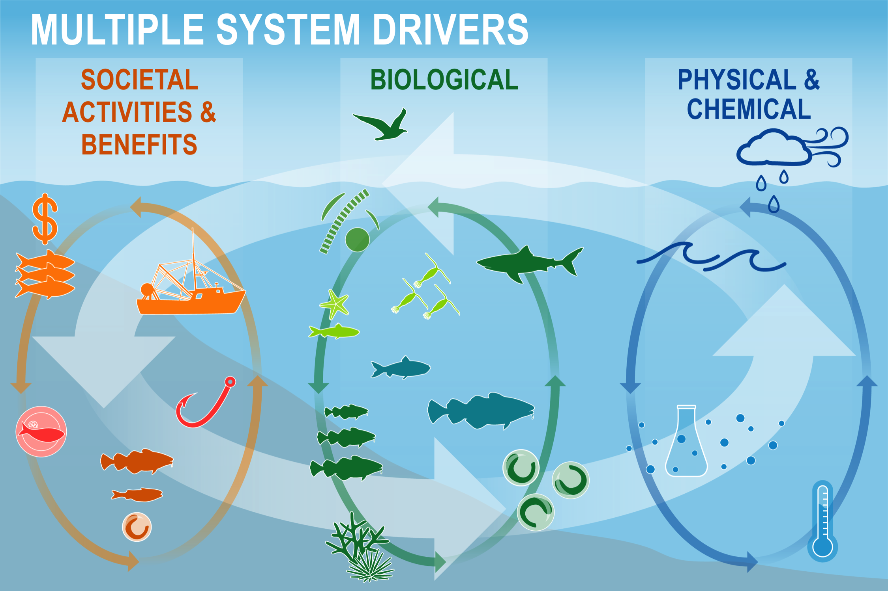
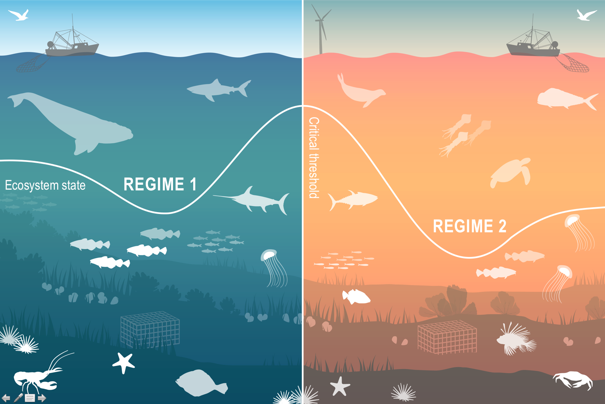
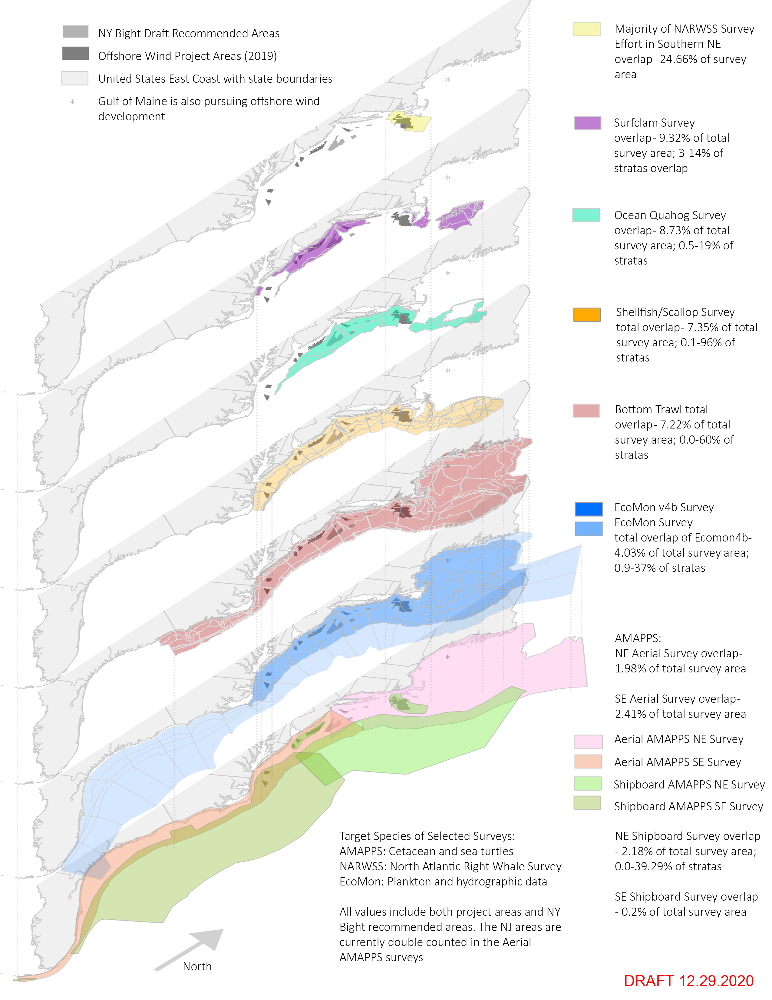

class: top, left

```{r setup, include=FALSE}

options(htmltools.dir.version = FALSE)
knitr::opts_chunk$set(echo = F,
                      fig.retina = 3,
                      warning = F,
                      message = F)
#Plotting and data libraries
library(tidyverse)
library(tidyr)
library(here)
library(kableExtra)
library(ecodata)
library(readxl); library(data.table)
library(DT)
library(widgetframe)

#Region identifiers
epu <- "Mid-Atlantic Bight"
epu_abbr <- "MAB"
region <- "Mid-Atlantic"
region_abbr <- "MA" #Some commercial data organized by "MA" or "NE" regions, not by EPU 

#General inline text input for report

#Council
council <- "Mid-Atlantic Fishery Management Council"
council_abbr <- "MAFMC"

#Define constants for commercial landings figure plot
series.col <- c("indianred","black")


#Time series constants
shade.alpha <- 0.3
shade.fill <- "lightgrey"
lwd <- 1
pcex <- 2
trend.alpha <- 0.5
trend.size <- 2
hline.size <- 1
hline.alpha <- 0.35
hline.lty <- "dashed"
label.size <- 5
hjust.label <- 1.5
letter_size <- 4
feeding.guilds1<- c("Piscivore","Planktivore","Benthivore","Benthos")
feeding.guilds <- c("Apex Predator","Piscivore","Planktivore","Benthivore","Benthos")
x.shade.min <- 2010
x.shade.max <- 2020
#Function for custom ggplot facet labels
label <- function(variable,value){
  return(facet_names[value])
}

```

```{r, load_refs, include=FALSE, cache=FALSE}
library(RefManageR)
BibOptions(check.entries = FALSE,
           bib.style = "authoryear",
           cite.style = "authoryear",
           longnamesfirst = FALSE,
           max.names = 1,
           style = "markdown")
myBib <- ReadBib("./MidSOE.bib", check = FALSE)

#,
#           hyperlink = FALSE,
#           dashed = FALSE

```

# State of the Ecosystem (SOE) reporting
## Improving ecosystem information and synthesis for fishery managers

.pull-left[

- Ecosystem indicators linked to management objectives `r Cite(myBib, "depiper_operationalizing_2017")`
    + Contextual information
    + Report evolving since 2016
    + Fishery-relevant subset of full Ecosystem Status Reprorts

- Open science emphasis `r Cite(myBib, "bastille_improving_2020")`

- Used within Mid-Atlantic Fishery Management Council's Ecosystem Process `r Cite(myBib, "muffley_there_2020")`
 
]

.pull-right[
*The IEA Loop<sup>1</sup>*


.footnote[
[1] https://www.integratedecosystemassessment.noaa.gov/national/IEA-approach
]
]
???

---background-image: url("EDAB_images/nes-components-abstracted.png")
background-size: 700px
background-position: right bottom

## State of the Ecosystem (SOE) Reporting: Context for busy people

*"So what?" --John Boreman, September 2016*

1. Clear linkage of ecosystem indicators with management objectives

1. Synthesis across indicators for big picture

1. Objectives related to human-well being placed first in report

1. Short (< 30 pages), non-technical (but rigorous) text

1. Emphasis on reproducibility


???
In 2016, we began taking steps to address these common critiques of the ESR model
Many indicators presented at WGNARS, used in larger Ecosystem Status reports
Shorter, fishery specific State of the Ecosystem (SOE) report with conceptual models prototyped based on California Current reporting
Feedback from fishery managers redesigned reporting to align with objectives outlined by WGNARS

---
## State of the Ecosystem Report Structure
.pull-left[

## 2020 Report
1. Summary 2 pager
1. Human dimensions
1. Protected species
1. Fish and invertebrates (managed and otherwise)
1. Habitat quality and ecosystem productivity

## 2021 Report
1. Summary 2 pager
    + Page 1 summary table
    + Page 2 synthesis themes
1. Performance against management objectives
1. Risks

]

.pull-right[

*Established ecosystem-scale objectives*

```{r management-objectives}
mng_obj <- data.frame("Objective Categories" = c("Seafood Production",
                                                 "Profits","Recreation",
                                                 "Social & Cultural", "Stability",
                                                 "Biomass","Productivity",
                                                 "Trophic structure","Habitat"),
"Indicators reported here" = c("Landings by feeding guild","Revenue decomposed to price and volume",
                               "Days fished; recreational catch",
                               "Commercial engagement trends",
                               "Diversity indices (fishery and species)",
                               "Biomass or abundance by feeding guild from surveys",
                               "Condition and recruitment of managed species, Primary productivity",
                               "Relative biomass of feeding guilds, Zooplankton",
                               "Estuarine and offshore habitat conditions"))

#knitr::kable(mng_obj, linesep = "",
mng_obj %>%
      #col.names = c("Objective Categories","Indicators reported here") %>%
      #caption = "Established ecosystem-scale objectives in the Mid-Atlantic Bight",
      #align = 'c',
      #booktabs = T) %>%
  #kable_styling(latex_options = "hold_position", "scale_down") %>%
 # column_spec(c(2), width = c("25em")) %>%
  kable(format = "html", escape = F, #table.attr='class="risktable"',
        col.names = c("Objective Categories","Indicators reported here")) %>%
  kable_styling(font_size = 14) %>%
  row_spec(0, bold = TRUE) %>%
  group_rows("Provisioning/Cultural", 1,4) %>%
  group_rows("Supporting/Regulating", 5,9)


```
]

---
## [2020 Report](https://doi.org/10.25923/1f8j-d564): Summary 2 pager with visualizations, 28 pages of narrative/plots, 1 page orientation

.pull-left[
.center[

]
]

.pull-right[
.center[

]
]


---
## Ecosystem synthesis themes for 2021

Characterizing ecosystem change for fishery management: plain language summary for 2 pager

* Multiple drivers of abundance, defined by the competing factors that influence the amount of fish in the ocean;
* Regime shifts, or ecosystem change can happen rapidly as multiple drivers change; and,
* Reorganization of the ecosystem, multiple factors that interact that change the structure and organization of the ecosystem, e.g. Tropicalization

.pull-left[


]

.pull-right[

]

---
## 2021 outline: two sections, each with "what" and "why"

.pull-left[
* Performance against management objectives
    - *What* does the indicator say--up, down, stable?
    - *Why* do we think it is changing: integrates synthesis themes
        - Multiple drivers
        - Regime shifts
        - Ecosystem reorganization
* Objectives
    - Seafood production
    - Profits
    - Recreational opportunities
    - Stability
    - Social and cultural
    - Protected species
]

.pull-right[
* Risks
    - *What* does the indicator say--up, down, stable?
    - *Why* this is important to managers: integrates synthesis themes
        - Multiple drivers
        - Regime shifts
        - Ecosystem reorganization
* Risk categories
    - Climate: warming, ocean currents, acidification
        - Habitat changes (incl. vulnerability analysis)
        - Productivity changes (system and fish)
        - Species interaction changes
        - Community structure changes
    - Other ocean uses
        - Wind
]

---
## Objective: Seafood production

.pull-left[
Indicator: Total landings Trend: Decreasing
Mid-Atlantic
```{r, code = readLines("https://raw.githubusercontent.com/NOAA-EDAB/ecodata/master/chunk-scripts/human_dimensions_MAB.Rmd-setup.R")}
```

```{r, code = readLines("https://raw.githubusercontent.com/NOAA-EDAB/ecodata/master/chunk-scripts/human_dimensions_MAB.Rmd-comdat-total-landings.R"), fig.height=3}
```

```{r, code = readLines("https://raw.githubusercontent.com/NOAA-EDAB/ecodata/master/chunk-scripts/human_dimensions_MAB.Rmd-recdat-landings.R"), fig.height=3}
```

]

.pull-right[

New England
```{r, code = readLines("https://raw.githubusercontent.com/NOAA-EDAB/ecodata/master/chunk-scripts/human_dimensions_NE.Rmd-setup.R")}
```
 
```{r, code = readLines("https://raw.githubusercontent.com/NOAA-EDAB/ecodata/master/chunk-scripts/human_dimensions_NE.Rmd-recdat-landings.R"), fig.height=3}
```
]


---
## Objective: Seafood production

Why?: multiple drivers: stock status/management, engagement, markets, fish population drivers

.pull-left[

```{r, code = readLines("https://raw.githubusercontent.com/NOAA-EDAB/ecodata/master/chunk-scripts/human_dimensions_MAB.Rmd-setup.R")}
```

```{r, code = readLines("https://raw.githubusercontent.com/NOAA-EDAB/ecodata/master/chunk-scripts/human_dimensions_MAB.Rmd-stock-status.R"), fig.height=3 }
```

```{r, code = readLines("https://raw.githubusercontent.com/NOAA-EDAB/ecodata/master/chunk-scripts/human_dimensions_MAB.Rmd-fogarty.R"), fig.height=3}
```


]

.pull-right[
```{r, code = readLines("https://raw.githubusercontent.com/NOAA-EDAB/ecodata/master/chunk-scripts/human_dimensions_MAB.Rmd-setup.R")}
```

```{r, code = readLines("https://raw.githubusercontent.com/NOAA-EDAB/ecodata/master/chunk-scripts/human_dimensions_NE.Rmd-aquaculture-pieces.R") }
```

]

---
## Objective: Profits
.pull-left[
Mid-Atlantic
```{r, code = readLines("https://raw.githubusercontent.com/NOAA-EDAB/ecodata/master/chunk-scripts/human_dimensions_MAB.Rmd-comdat-comm-revenue.R"), fig.height=3 }
```

```{r, code = readLines("https://raw.githubusercontent.com/NOAA-EDAB/ecodata/master/chunk-scripts/human_dimensions_MAB.Rmd-bennet-all.R"), fig.height=3 }
```


]

.pull-right[
New England

```{r, code = readLines("https://raw.githubusercontent.com/NOAA-EDAB/ecodata/master/chunk-scripts/human_dimensions_NE.Rmd-setup.R")}
```

```{r, code = readLines("https://raw.githubusercontent.com/NOAA-EDAB/ecodata/master/chunk-scripts/human_dimensions_NE.Rmd-comdat-comm-revenue.R"), fig.height=3 }
```

```{r, code = readLines("https://raw.githubusercontent.com/NOAA-EDAB/ecodata/master/chunk-scripts/human_dimensions_NE.Rmd-bennet-all.R"), fig.height=3 }
```

]

---
## Objective: Profits


---

## Objective: Recreation
Mid-Atlantic

```{r, code = readLines("https://raw.githubusercontent.com/NOAA-EDAB/ecodata/master/chunk-scripts/human_dimensions_MAB.Rmd-setup.R")}
```

```{r, code = readLines("https://raw.githubusercontent.com/NOAA-EDAB/ecodata/master/chunk-scripts/human_dimensions_MAB.Rmd-recdat-effort.R"), fig.height=3 }
```


New England
```{r, code = readLines("https://raw.githubusercontent.com/NOAA-EDAB/ecodata/master/chunk-scripts/human_dimensions_NE.Rmd-setup.R")}
```

```{r, code = readLines("https://raw.githubusercontent.com/NOAA-EDAB/ecodata/master/chunk-scripts/human_dimensions_NE.Rmd-recdat-effort.R"), fig.height=3 }
```


---

## Objective: Recreation

---

## Objective: Stability - Fishery Diversity
.pull-left[

Mid-Atlantic

```{r, code = readLines("https://raw.githubusercontent.com/NOAA-EDAB/ecodata/master/chunk-scripts/human_dimensions_MAB.Rmd-setup.R")}
```

```{r, code = readLines("https://raw.githubusercontent.com/NOAA-EDAB/ecodata/master/chunk-scripts/human_dimensions_MAB.Rmd-recdat-diversity.R"), fig.height=3 }
```

```{r, code = readLines("https://raw.githubusercontent.com/NOAA-EDAB/ecodata/master/chunk-scripts/human_dimensions_MAB.Rmd-recdat-div-catch.R"), fig.height=3 }
```
]

.pull-right[
New England
```{r, code = readLines("https://raw.githubusercontent.com/NOAA-EDAB/ecodata/master/chunk-scripts/human_dimensions_MAB.Rmd-setup.R")}
```

```{r, code = readLines("https://raw.githubusercontent.com/NOAA-EDAB/ecodata/master/chunk-scripts/human_dimensions_MAB.Rmd-recdat-diversity.R"), fig.height=3 }
```

```{r, code = readLines("https://raw.githubusercontent.com/NOAA-EDAB/ecodata/master/chunk-scripts/human_dimensions_MAB.Rmd-recdat-div-catch.R"), fig.height=3 }
```
]
---

## Objective: Stability - Ecological Diversity

Zooplankton

Expected N 

---

## Objective: Social & Cultural - Mid-Atlantic

.pull-left[
Indicator: Recreational engagement, reliance, vulnerability
```{r, code = readLines("https://raw.githubusercontent.com/NOAA-EDAB/ecodata/master/chunk-scripts/human_dimensions_MAB.Rmd-setup.R")}
```

```{r, code = readLines("https://raw.githubusercontent.com/NOAA-EDAB/ecodata/master/chunk-scripts/human_dimensions_MAB.Rmd-recreational-engagement.R"), fig.height=6}
```
Mid-Atlantic communities
]

.pull-right[
Indicator: Commercial Vulnerability engagement, reliance, vulnerability
<br />
```{r, code = readLines("https://raw.githubusercontent.com/NOAA-EDAB/ecodata/master/chunk-scripts/human_dimensions_MAB.Rmd-setup.R")}
```

```{r, code = readLines("https://raw.githubusercontent.com/NOAA-EDAB/ecodata/master/chunk-scripts/human_dimensions_MAB.Rmd-commercial-engagement.R"), fig.height=6}
```

]

---

## Objective: Social & Cultural - New England

.pull-left[
Indicator: Recreational engagement, reliance, vulnerability
```{r, code = readLines("https://raw.githubusercontent.com/NOAA-EDAB/ecodata/master/chunk-scripts/human_dimensions_NE.Rmd-setup.R")}
```

```{r, code = readLines("https://raw.githubusercontent.com/NOAA-EDAB/ecodata/master/chunk-scripts/human_dimensions_NE.Rmd-recreational-engagement.R"), fig.height=6}
```
Mid-Atlantic communities
]

.pull-right[
Indicator: Commercial Vulnerability engagement, reliance, vulnerability
<br />
```{r, code = readLines("https://raw.githubusercontent.com/NOAA-EDAB/ecodata/master/chunk-scripts/human_dimensions_NE.Rmd-setup.R")}
```

```{r, code = readLines("https://raw.githubusercontent.com/NOAA-EDAB/ecodata/master/chunk-scripts/human_dimensions_NE.Rmd-commercial-engagement.R"), fig.height=6}
```

]


---

## Objective: Protected Species

.pull-left[
Indicators: Species By-catch
```{r, code = readLines("https://raw.githubusercontent.com/NOAA-EDAB/ecodata/master/chunk-scripts/macrofauna_MAB.Rmd-harborporpoise.R"), fig.height=3}
```

```{r, code = readLines("https://raw.githubusercontent.com/NOAA-EDAB/ecodata/master/chunk-scripts/macrofauna_MAB.Rmd-grayseal.R"), fig.height=3}
```
]

.pull-right[
Indicators: Endangered Species Populations
```{r, code = readLines("https://raw.githubusercontent.com/NOAA-EDAB/ecodata/master/chunk-scripts/macrofauna_MAB.Rmd-narw-abundance.R"), fig.height=3}
```

```{r, code = readLines("https://raw.githubusercontent.com/NOAA-EDAB/ecodata/master/chunk-scripts/macrofauna_MAB.Rmd-NARW-calf-abundance.R"), fig.height=3}
```
]


---

## Risks to Meeting fishery management objectives
### Climate indicators
.pull-left[
Indicators: Gulf Stream index, bottom and surface temperature, heat waves
Trends:
```{r, code = readLines("https://raw.githubusercontent.com/NOAA-EDAB/ecodata/master/chunk-scripts/LTL_MAB.Rmd-setup.R")}
```


```{r, code = readLines("https://raw.githubusercontent.com/NOAA-EDAB/ecodata/master/chunk-scripts/LTL_MAB.Rmd-gsi.R"), fig.height=3, out.width='60%'}
```

```{r, code =readLines("https://raw.githubusercontent.com/NOAA-EDAB/ecodata/master/chunk-scripts/LTL_MAB.Rmd-bottom-temp.R"), fig.height=3, out.width='60%'}

```

```{r, code = readLines("https://raw.githubusercontent.com/NOAA-EDAB/ecodata/master/chunk-scripts/LTL_MAB.Rmd-heatwave.R"), fig.height=3, out.width='70%'}
```
]

.pull-right[

Why this matters:
Habitat change from multiple drivers alters:
- species distributions--allocation
- system productivity--fishery resource productivity
```{r, code = readLines("https://raw.githubusercontent.com/NOAA-EDAB/ecodata/master/chunk-scripts/macrofauna_MAB.Rmd-nefsc-survey-disaggregated-mafmc-spp-in-ne.R"), fig.height=6}
```

]

---

## Risks to Meeting fishery management objectives
### Ecosystem productivity indicators


---

## Risks to Meeting fishery management objectives
### Ecosystem structure indicators


---

## Risks to Meeting fishery management objectives
### Wind indicators

.pull-left[

]

.pull-right[
```{r, code = readLines("https://raw.githubusercontent.com/NOAA-EDAB/ecodata/master/chunk-scripts/human_dimensions_MAB.Rmd-wind-dev-speed0.30.R"), fig.height=3}
```

```{r, code = readLines("https://raw.githubusercontent.com/NOAA-EDAB/ecodata/master/chunk-scripts/human_dimensions_MAB.Rmd-wind-revenue.R"), fig.height=3}
```

---

## Additional resources
.pull-left[
* [2020 State of the Ecosystem Reports](https://www.fisheries.noaa.gov/new-england-mid-atlantic/ecosystems/state-ecosystem-reports-northeast-us-shelf)

* [ecodata R package](https://github.com/noaa-edab/ecodata)

* Visualizations:
  * [Mid-Atlantic Human Dimensions indicators](http://noaa-edab.github.io/ecodata/human_dimensions_MAB)
  * [Mid-Atlantic Macrofauna indicators](http://noaa-edab.github.io/ecodata/macrofauna_MAB)
  * [Mid-Atlantic Lower trophic level indicators](https://noaa-edab.github.io/ecodata/LTL_MAB)
  * [New England Human Dimensions indicators](http://noaa-edab.github.io/ecodata/human_dimensions_NE)
  * [New England Macrofauna indicators](http://noaa-edab.github.io/ecodata/macrofauna_NE)
  * [New England Lower trophic level indicators](https://noaa-edab.github.io/ecodata/LTL_NE)

* [SOE Technical Documentation](https://noaa-edab.github.io/tech-doc)

* [Draft indicator catalogue](https://noaa-edab.github.io/catalog/)

]
.pull-right[


.contrib[

* Slides available at https://noaa-edab.github.io/presentations
* Contact: <Kimberly.bastille@noaa.gov>, <Sarah.gaichas@noaa.gov>, <Sean.Lucey@noaa.gov>
]
]
---
