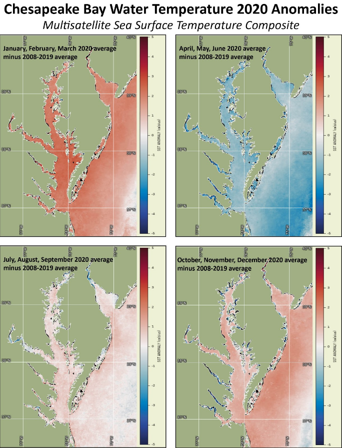
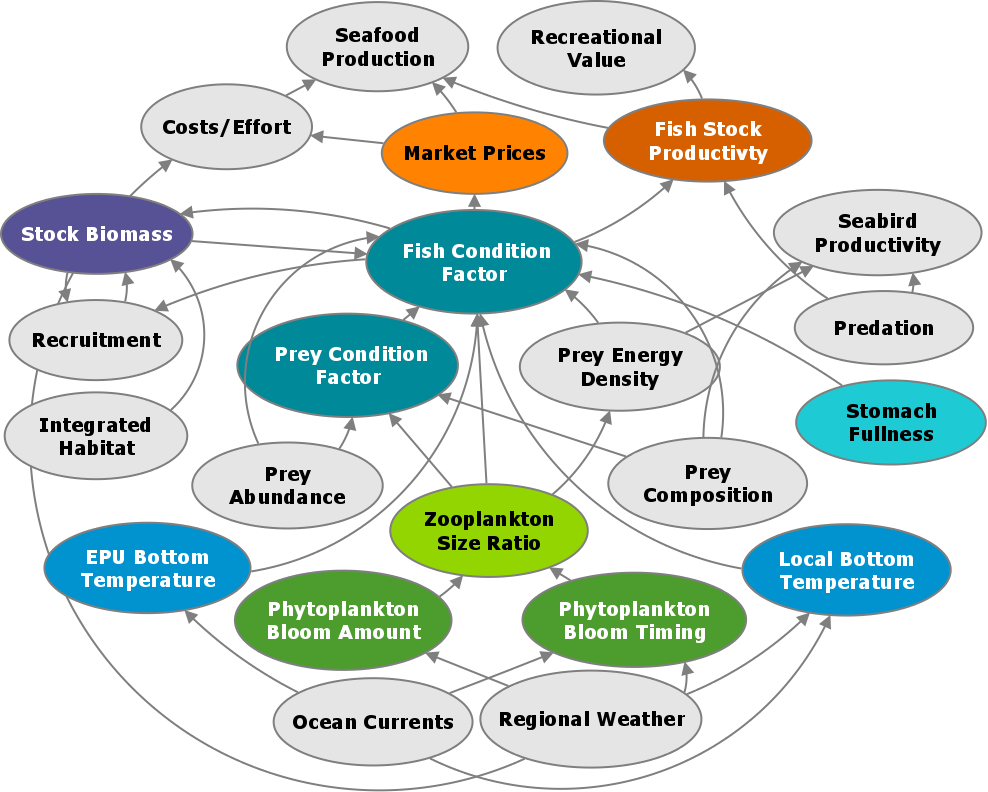

class: top, left

```{r setup, include=FALSE}

options(htmltools.dir.version = FALSE)
knitr::opts_chunk$set(echo = F,
                      fig.retina = 3,
                      warning = F,
                      message = F)
#Plotting and data libraries
library(tidyverse)
library(tidyr)
library(here)
library(kableExtra)
library(ecodata)
library(readxl); library(data.table)
library(DT)
library(widgetframe)

#Region identifiers
epu <- "Mid-Atlantic Bight"
epu_abbr <- "MAB"
region <- "Mid-Atlantic"
region_abbr <- "MA" #Some commercial data organized by "MA" or "NE" regions, not by EPU 

#General inline text input for report

#Council
council <- "Mid-Atlantic Fishery Management Council"
council_abbr <- "MAFMC"

#Define constants for commercial landings figure plot
series.col <- c("indianred","black")


#Time series constants
shade.alpha <- 0.3
shade.fill <- "lightgrey"
lwd <- 1
pcex <- 2
trend.alpha <- 0.5
trend.size <- 2
hline.size <- 1
hline.alpha <- 0.35
hline.lty <- "dashed"
label.size <- 5
hjust.label <- 1.5
letter_size <- 4
feeding.guilds1<- c("Piscivore","Planktivore","Benthivore","Benthos")
feeding.guilds <- c("Apex Predator","Piscivore","Planktivore","Benthivore","Benthos")
x.shade.min <- 2010
x.shade.max <- 2020
#Function for custom ggplot facet labels
label <- function(variable,value){
  return(facet_names[value])
}

```

```{r, load_refs, include=FALSE, cache=FALSE}
library(RefManageR)
BibOptions(check.entries = FALSE,
           bib.style = "authoryear",
           cite.style = "authoryear",
           longnamesfirst = FALSE,
           max.names = 1,
           style = "markdown")
myBib <- ReadBib("./MidSOE.bib", check = FALSE)

#,
#           hyperlink = FALSE,
#           dashed = FALSE

```


# State of the Ecosystem (SOE) reporting
## Improving ecosystem information and synthesis for fishery managers

.pull-left[

- Ecosystem indicators linked to management objectives `r Cite(myBib, "depiper_operationalizing_2017")`
    + Contextual information
    + Report evolving since 2016
    + Fishery-relevant subset of full Ecosystem Status Reprorts

- Open science emphasis `r Cite(myBib, "bastille_improving_2020")`

- Used within Mid-Atlantic Fishery Management Council's Ecosystem Process `r Cite(myBib, "muffley_there_2020")`
 
]

.pull-right[
*The IEA Loop<sup>1</sup>*


.footnote[
[1] https://www.integratedecosystemassessment.noaa.gov/national/IEA-approach
]
]
???

---

background-image: url("EDAB_images/nes-components-abstracted.png")
background-size: 700px
background-position: right bottom

## State of the Ecosystem (SOE) Reporting: Context for busy people

*"So what?" --John Boreman, September 2016*

1. Clear linkage of ecosystem indicators with management objectives

1. Synthesis across indicators for big picture

1. Objectives related to human-well being placed first in report

1. Short (< 30 pages), non-technical (but rigorous) text

1. Emphasis on reproducibility


???
In 2016, we began taking steps to address these common critiques of the ESR model
Many indicators presented at WGNARS, used in larger Ecosystem Status reports
Shorter, fishery specific State of the Ecosystem (SOE) report with conceptual models prototyped based on California Current reporting
Feedback from fishery managers redesigned reporting to align with objectives outlined by WGNARS

---
## State of the Ecosystem Report Structure
.pull-left[

## 2021 Report
1. Summary 2 pager
    + Page 1 summary table
    + Page 2 synthesis themes
1. Performance against management objectives
1. Risks

]

.pull-right[

*Established ecosystem-scale objectives*

```{r management-objectives}
mng_obj <- data.frame("Objective Categories" = c("Seafood Production",
                                                 "Profits","Recreation",
                                                 "Social & Cultural", "Stability",
                                                 "Biomass","Productivity",
                                                 "Trophic structure","Habitat"),
"Indicators reported here" = c("Landings by feeding guild","Revenue decomposed to price and volume",
                               "Days fished; recreational catch",
                               "Commercial engagement trends",
                               "Diversity indices (fishery and species)",
                               "Biomass or abundance by feeding guild from surveys",
                               "Condition and recruitment of managed species, Primary productivity",
                               "Relative biomass of feeding guilds, Zooplankton",
                               "Estuarine and offshore habitat conditions"))

#knitr::kable(mng_obj, linesep = "",
mng_obj %>%
      #col.names = c("Objective Categories","Indicators reported here") %>%
      #caption = "Established ecosystem-scale objectives in the Mid-Atlantic Bight",
      #align = 'c',
      #booktabs = T) %>%
  #kable_styling(latex_options = "hold_position", "scale_down") %>%
 # column_spec(c(2), width = c("25em")) %>%
  kable(format = "html", escape = F, #table.attr='class="risktable"',
        col.names = c("Objective Categories","Indicators reported here")) %>%
  kable_styling(font_size = 14) %>%
  row_spec(0, bold = TRUE) %>%
  group_rows("Provisioning/Cultural", 1,4) %>%
  group_rows("Supporting/Regulating", 5,9)


```
]

---
## [2021 Report](https://doi.org/10.25923/1f8j-d564): Summary with visualizations 


Summary Table from 2-pager


---
## Ecosystem synthesis themes for 2021

Characterizing ecosystem change for fishery management 

* Multiple drivers of abundance, defined by the competing factors that influence the amount of fish in the ocean;
* Regime shifts, or ecosystem change can happen rapidly as multiple drivers change; and,
* Reorganization of the ecosystem, multiple factors that interact that change the structure and organization of the ecosystem, e.g. Tropicalization

.pull-left[


]

.pull-right[

]

---
## 2021 reports: two sections, each with "what" and "why"


* Performance against management objectives
    - *What* does the indicator say--up, down, stable?
    - *Why* do we think it is changing: integrates synthesis themes
        - Multiple drivers
        - Regime shifts
        - Ecosystem reorganization

* Risks
    - *What* does the indicator say--up, down, stable?
    - *Why* this is important to managers: integrates synthesis themes
        - Multiple drivers
        - Regime shifts
        - Ecosystem reorganization


---
## Objective: Seafood production
.pull-left[


Mid-Atlantic
```{r, code = readLines("https://raw.githubusercontent.com/NOAA-EDAB/ecodata/master/chunk-scripts/human_dimensions_MAB.Rmd-setup.R")}
```

```{r, code = readLines("https://raw.githubusercontent.com/NOAA-EDAB/ecodata/master/chunk-scripts/human_dimensions_MAB.Rmd-comdat-total-landings.R"), fig.height=3}
```

```{r, code = readLines("https://raw.githubusercontent.com/NOAA-EDAB/ecodata/master/chunk-scripts/human_dimensions_MAB.Rmd-recdat-landings.R"), fig.height=3}
```

]

.pull-right[

New England
```{r, code = readLines("https://raw.githubusercontent.com/NOAA-EDAB/ecodata/master/chunk-scripts/human_dimensions_NE.Rmd-setup.R")}
```


 
```{r, code = readLines("https://raw.githubusercontent.com/NOAA-EDAB/ecodata/master/chunk-scripts/human_dimensions_NE.Rmd-recdat-landings.R"), fig.height=3}
```

]


---
## Objective: Seafood production

.pull-left[

Mid-Atlantic
```{r, code = readLines("https://raw.githubusercontent.com/NOAA-EDAB/ecodata/master/chunk-scripts/human_dimensions_MAB.Rmd-setup.R")}
```

```{r, code = readLines("https://raw.githubusercontent.com/NOAA-EDAB/ecodata/master/chunk-scripts/human_dimensions_MAB.Rmd-rec_hms.R"), fig.height=4}
```

]

.pull-right[

New England
```{r, code = readLines("https://raw.githubusercontent.com/NOAA-EDAB/ecodata/master/chunk-scripts/human_dimensions_NE.Rmd-setup.R")}
```
 
```{r, code = readLines("https://raw.githubusercontent.com/NOAA-EDAB/ecodata/master/chunk-scripts/human_dimensions_NE.Rmd-rec_hms.R"), fig.height=3, warning= FALSE, message=FALSE, echo=FALSE}
```

```{r, code = readLines("https://raw.githubusercontent.com/NOAA-EDAB/ecodata/master/chunk-scripts/human_dimensions_NE.Rmd-aquaculture-pieces.R"), fig.height=2}
```
]

---
## Objective: Seafood production

.pull-left[

MId-Atlantic
```{r, code = readLines("https://raw.githubusercontent.com/NOAA-EDAB/ecodata/master/chunk-scripts/human_dimensions_MAB.Rmd-setup.R")}
```

```{r, code = readLines("https://raw.githubusercontent.com/NOAA-EDAB/ecodata/master/chunk-scripts/human_dimensions_MAB.Rmd-stock-status.R"), fig.height=3 }
```

```{r, code = readLines("https://raw.githubusercontent.com/NOAA-EDAB/ecodata/master/chunk-scripts/human_dimensions_MAB.Rmd-fogarty.R"), fig.height=3}
```


]

.pull-right[

New England

```{r, code = readLines("https://raw.githubusercontent.com/NOAA-EDAB/ecodata/master/chunk-scripts/human_dimensions_NE.Rmd-setup.R")}
```

```{r, code = readLines("https://raw.githubusercontent.com/NOAA-EDAB/ecodata/master/chunk-scripts/human_dimensions_NE.Rmd-stock-status.R"), fig.height=3 }
```

```{r, code = readLines("https://raw.githubusercontent.com/NOAA-EDAB/ecodata/master/chunk-scripts/human_dimensions_NE.Rmd-fogarty.R"), fig.height=3}
```
]

---

## Objective: Profits
.pull-left[
Mid-Atlantic
```{r, code = readLines("https://raw.githubusercontent.com/NOAA-EDAB/ecodata/master/chunk-scripts/human_dimensions_MAB.Rmd-setup.R")}
```

```{r, code = readLines("https://raw.githubusercontent.com/NOAA-EDAB/ecodata/master/chunk-scripts/human_dimensions_MAB.Rmd-comdat-comm-revenue.R"), fig.height=3 }
```

```{r, code = readLines("https://raw.githubusercontent.com/NOAA-EDAB/ecodata/master/chunk-scripts/human_dimensions_MAB.Rmd-bennet-all.R"), fig.height=3 }
```


]

.pull-right[
New England

```{r, code = readLines("https://raw.githubusercontent.com/NOAA-EDAB/ecodata/master/chunk-scripts/human_dimensions_NE.Rmd-setup.R")}
```

```{r, code = readLines("https://raw.githubusercontent.com/NOAA-EDAB/ecodata/master/chunk-scripts/human_dimensions_NE.Rmd-comdat-comm-revenue.R"), fig.height=3 }
```

```{r, code = readLines("https://raw.githubusercontent.com/NOAA-EDAB/ecodata/master/chunk-scripts/human_dimensions_NE.Rmd-bennet-all.R"), fig.height=3 }
```

]


---

## Objective: Recreation

.pull-left[
Mid-Atlantic
```{r, code = readLines("https://raw.githubusercontent.com/NOAA-EDAB/ecodata/master/chunk-scripts/human_dimensions_MAB.Rmd-setup.R")}
```

```{r, code = readLines("https://raw.githubusercontent.com/NOAA-EDAB/ecodata/master/chunk-scripts/human_dimensions_MAB.Rmd-recdat-effort.R"), fig.height=3 }
```
]

.pull-right[

New England
```{r, code = readLines("https://raw.githubusercontent.com/NOAA-EDAB/ecodata/master/chunk-scripts/human_dimensions_NE.Rmd-setup.R")}
```

```{r, code = readLines("https://raw.githubusercontent.com/NOAA-EDAB/ecodata/master/chunk-scripts/human_dimensions_NE.Rmd-recdat-effort.R"), fig.height=3 }
```
]

---

## Objective: Stability - Fishery Diversity
.pull-left[

Mid-Atlantic

```{r, code = readLines("https://raw.githubusercontent.com/NOAA-EDAB/ecodata/master/chunk-scripts/human_dimensions_MAB.Rmd-setup.R")}
```

```{r, code = readLines("https://raw.githubusercontent.com/NOAA-EDAB/ecodata/master/chunk-scripts/human_dimensions_MAB.Rmd-recdat-diversity.R"), fig.height=3 }
```

```{r, code = readLines("https://raw.githubusercontent.com/NOAA-EDAB/ecodata/master/chunk-scripts/human_dimensions_MAB.Rmd-recdat-div-catch.R"), fig.height=3 }
```
]

.pull-right[
New England
```{r, code = readLines("https://raw.githubusercontent.com/NOAA-EDAB/ecodata/master/chunk-scripts/human_dimensions_NE.Rmd-setup.R")}
```


```{r, code = readLines("https://raw.githubusercontent.com/NOAA-EDAB/ecodata/master/chunk-scripts/human_dimensions_MAB.Rmd-recdat-diversity.R"), fig.height=3 }
```

```{r, code = readLines("https://raw.githubusercontent.com/NOAA-EDAB/ecodata/master/chunk-scripts/human_dimensions_MAB.Rmd-recdat-div-catch.R"), fig.height=3 }
```
]
---

## Objective: Stability - Ecological Diversity

.pull-left[
Mid-Atlantic
```{r, code = readLines("https://raw.githubusercontent.com/NOAA-EDAB/ecodata/master/chunk-scripts/human_dimensions_MAB.Rmd-setup.R")}
```


```{r, code = readLines("https://raw.githubusercontent.com/NOAA-EDAB/ecodata/master/chunk-scripts/macrofauna_MAB.Rmd-exp-n.R"), fig.height=3 }
```


```{r, code = readLines("https://raw.githubusercontent.com/NOAA-EDAB/ecodata/master/chunk-scripts/LTL_MAB.Rmd-zoo-diversity.R"), fig.height=3 }
```
]


.pull-right[
New England
```{r, code = readLines("https://raw.githubusercontent.com/NOAA-EDAB/ecodata/master/chunk-scripts/human_dimensions_NE.Rmd-setup.R")}
```


```{r, code = readLines("https://raw.githubusercontent.com/NOAA-EDAB/ecodata/master/chunk-scripts/macrofauna_NE.Rmd-exp-n.R"), fig.height=3 }
```

```{r, code = readLines("https://raw.githubusercontent.com/NOAA-EDAB/ecodata/master/chunk-scripts/LTL_NE.Rmd-zoo-diversity.R"), fig.height=2 }
```

]

---

## Objective: Social & Cultural - Mid-Atlantic

.pull-left[
Indicator: Recreational engagement, reliance, vulnerability
```{r, code = readLines("https://raw.githubusercontent.com/NOAA-EDAB/ecodata/master/chunk-scripts/human_dimensions_MAB.Rmd-setup.R")}
```

```{r, code = readLines("https://raw.githubusercontent.com/NOAA-EDAB/ecodata/master/chunk-scripts/human_dimensions_MAB.Rmd-recreational-engagement.R"), fig.height=6}
```

]

.pull-right[
Indicator: Commercial engagement, reliance, vulnerability

```{r, code = readLines("https://raw.githubusercontent.com/NOAA-EDAB/ecodata/master/chunk-scripts/human_dimensions_MAB.Rmd-setup.R")}
```

```{r, code = readLines("https://raw.githubusercontent.com/NOAA-EDAB/ecodata/master/chunk-scripts/human_dimensions_MAB.Rmd-commercial-engagement.R"), fig.height=6}
```

]

---

## Objective: Social & Cultural - New England

.pull-left[
Indicator: Recreational engagement, reliance, vulnerability
```{r, code = readLines("https://raw.githubusercontent.com/NOAA-EDAB/ecodata/master/chunk-scripts/human_dimensions_NE.Rmd-setup.R")}
```

```{r, code = readLines("https://raw.githubusercontent.com/NOAA-EDAB/ecodata/master/chunk-scripts/human_dimensions_NE.Rmd-recreational-engagement.R"), fig.height=6}
```

]

.pull-right[
Indicator: Commercial engagement, reliance, vulnerability

```{r, code = readLines("https://raw.githubusercontent.com/NOAA-EDAB/ecodata/master/chunk-scripts/human_dimensions_NE.Rmd-setup.R")}
```

```{r, code = readLines("https://raw.githubusercontent.com/NOAA-EDAB/ecodata/master/chunk-scripts/human_dimensions_NE.Rmd-commercial-engagement.R"), fig.height=6}
```

]


---

## Objective: Protected Species

.pull-left[
Indicators: Species By-catch

```{r, code = readLines("https://raw.githubusercontent.com/NOAA-EDAB/ecodata/master/chunk-scripts/macrofauna_MAB.Rmd-harborporpoise.R"), fig.height=3}
```

```{r, code = readLines("https://raw.githubusercontent.com/NOAA-EDAB/ecodata/master/chunk-scripts/macrofauna_MAB.Rmd-grayseal.R"), fig.height=3}
```
]

.pull-right[
Indicators: Endangered Species Populations

```{r, code = readLines("https://raw.githubusercontent.com/NOAA-EDAB/ecodata/master/chunk-scripts/macrofauna_MAB.Rmd-narw-abundance.R"), fig.height=3}
```

```{r, code = readLines("https://raw.githubusercontent.com/NOAA-EDAB/ecodata/master/chunk-scripts/macrofauna_MAB.Rmd-NARW-calf-abundance.R"), fig.height=3}
```
]


---

## Risks to meeting fishery management objectives -  Climate indicators
Indicators: Gulf Stream index, warm core rings, bottom temperature, slopewater
.pull-left[

Mid-Atlantic

```{r, code = readLines("https://raw.githubusercontent.com/NOAA-EDAB/ecodata/master/chunk-scripts/LTL_MAB.Rmd-setup.R")}
```


```{r, code = readLines("https://raw.githubusercontent.com/NOAA-EDAB/ecodata/master/chunk-scripts/LTL_MAB.Rmd-gsi.R"), fig.height=2}
```

```{r, code = readLines("https://raw.githubusercontent.com/NOAA-EDAB/ecodata/master/chunk-scripts/LTL_MAB.Rmd-wcr.R"), fig.height=2}
```

```{r, code =readLines("https://raw.githubusercontent.com/NOAA-EDAB/ecodata/master/chunk-scripts/LTL_MAB.Rmd-bottom-temp.R"), fig.height=2}

```


]
.pull-right[
New England
```{r, code = readLines("https://raw.githubusercontent.com/NOAA-EDAB/ecodata/master/chunk-scripts/LTL_NE.Rmd-setup.R")}
```


```{r, code = readLines("https://raw.githubusercontent.com/NOAA-EDAB/ecodata/master/chunk-scripts/LTL_NE.Rmd-slopewater.R"), fig.height=3}
```

```{r, code =readLines("https://raw.githubusercontent.com/NOAA-EDAB/ecodata/master/chunk-scripts/LTL_MAB.Rmd-bottom-temp.R"), fig.height=3}

```

]

---

## Risks to meeting fishery management objectives - Climate indicators
Indicators:  sea surface temperature, marine heatwaves
.pull-left[

Shelfwide
```{r, code = readLines("https://raw.githubusercontent.com/NOAA-EDAB/ecodata/master/chunk-scripts/LTL_MAB.Rmd-setup.R")}
```

```{r, code =readLines("https://raw.githubusercontent.com/NOAA-EDAB/ecodata/master/chunk-scripts/LTL_MAB.Rmd-shelf-seasonal-sst-anomaly-gridded.R"), fig.height=6}

```


]

.pull-right[
Mid-Atlantic
```{r, code = readLines("https://raw.githubusercontent.com/NOAA-EDAB/ecodata/master/chunk-scripts/LTL_MAB.Rmd-setup.R")}
```

```{r, code = readLines("https://raw.githubusercontent.com/NOAA-EDAB/ecodata/master/chunk-scripts/LTL_MAB.Rmd-heatwave.R"), fig.height=2}
```
New England

```{r, code = readLines("https://raw.githubusercontent.com/NOAA-EDAB/ecodata/master/chunk-scripts/LTL_NE.Rmd-setup.R")}
```

```{r, code = readLines("https://raw.githubusercontent.com/NOAA-EDAB/ecodata/master/chunk-scripts/LTL_NE.Rmd-heatwave.R"), fig.height=4}
```

]
---
## Risks to meeting fishery management objectives - Climate indicators
Indicators:  cold pool


---
## Risks to meeting fishery management objectives - Climate indicators
Indicators:  ocean acidification

.pull-left[

]
.pull-right[

]
---
## Risks to meeting fishery management objectives - Climate indicators
Indicators:  Chesapeake Bay
.pull-left[

]

.pull-right[
```{r, code = readLines("https://raw.githubusercontent.com/NOAA-EDAB/ecodata/master/chunk-scripts/LTL_MAB.Rmd-setup.R")}
```

```{r, code =readLines("https://raw.githubusercontent.com/NOAA-EDAB/ecodata/master/chunk-scripts/LTL_MAB.Rmd-ch-bay-temp.R"), fig.height=4}

```

]
---

## Risks to meeting fishery management objectives - Climate indicators - Habitat Vulnerability

```{r setup1, include=FALSE}
library(here); library(kableExtra); library(dplyr); library(readxl); library(data.table); library(DT);
library(stringr)
knitr::opts_chunk$set(echo = FALSE)
options(knitr.kable.NA = '')
```

```{css, echo=FALSE}
/*alter risk assessment table formatting*/
.risktable {
    border-collapse: collapse;
}
.risktable th {
    padding: 2px;
}
.risktable td {
    padding: 1px;
}
.risktable tbody tr:nth-of-type(even) {
  background-color:transparent;
}
```

Mid-Atlantic Habitat Vulnerability Table

```{r class.source="risktable"}
#Read in Mid-Atlantic table


mid <- as.data.table(readxl::read_xlsx(here('EDAB_images/habitat_vulnerability.xlsx'),
                         sheet = 'Mid-Atlantic', skip = 1))
#Identify individual species climate vulnerability
vhigh.vul <- unique(mid[`Species Vulnerability Rank (FCVA)` == 'Very high', Species])
high.vul  <- unique(mid[`Species Vulnerability Rank (FCVA)` == 'High', Species])
mod.vul   <- unique(mid[`Species Vulnerability Rank (FCVA)` == 'Moderate', Species])
low.vul   <- unique(mid[`Species Vulnerability Rank (FCVA)` == 'Low', Species])
#Grab habitat vulnerability
hab.vul <- unique(mid[, c('Habitat Name', 'Habitat Vulnerability Rank (HVCA)')])
habitats <- hab.vul[, 'Habitat Name']
hab.vul <- data.table('Habitat Vulnerability' = c(NA, NA, t(hab.vul[, 'Habitat Vulnerability Rank (HVCA)'])))
#Rearrange table
mid <- data.table::melt.data.table(mid, id.vars = c('Habitat Name', 'Species'),
                                   measure.vars = c('Eggs/Larva', 'Juvenile/YOY',
                                                    'Adult', 'Spawning Adult'),
                                   variable.name = 'Stage', value.name = 'Dependence')
mid[, Habitat := as.factor(mid$'Habitat Name')]
mid <- data.table::dcast.data.table(mid, Species + Stage ~ Habitat,
                                    value.var = 'Dependence')
setcolorder(mid, c('Species', 'Stage', habitats$'Habitat Name'))
#Add Habitat Vulnerbaility
hab.table <- rbindlist(list(as.data.table(t(hab.vul)), mid), use.names = F)
#Add names back in
names(hab.table) <- names(mid)
hab.table <- hab.table %>% mutate_if(is.character, str_trim) #one cell has a space, not getting color
#generalize to all
# hab.table %>%
#   mutate_at(vars(Species), function(x){ #Color code species based on climate vul
#     case_when(x %in% low.vul ~ cell_spec(x, format = "html", color = "black",
#                                      background = "lightgreen"),
#               x %in% mod.vul ~ cell_spec(x, format = "html", color = "black",
#                                      background = "yellow"),
#               x %in% high.vul ~ cell_spec(x, format = "html", color = "black",
#                                      background = "orange"),
#               x %in% vhigh.vul ~ cell_spec(x, format = "html", color = "white",
#                                      background = "red"))}) %>%
#   mutate_at(vars(-c(Species, Stage)), function(x){ #Color code base on dependence
#     case_when(x == "Low" ~ cell_spec(x, format = "html", color = "black",
#                                      background = "lightgreen"),
#               x == "Moderate" ~ cell_spec(x, format = "html", color = "black",
#                                      background = "yellow"),
#               x == "High" ~ cell_spec(x, format = "html", color = "black",
#                                      background = "orange"),
#               x == "Very high" ~ cell_spec(x, format = "html", color = "white",
#                                      background = "red"))}) %>%
#   kable(format = "html", escape = F, table.attr='class="risktable"') %>%
#   kable_styling(font_size = 14, fixed_thead = T)
```

```{r midDT}
#from examples here https://rstudio.github.io/DT/010-style.html
#color coding cells works
#need to add column with species vulnerability and color code species by it but not show it, like #hideV6 example at link
#if we show it we can sort by species vulnerability though... alphabetical doesnt work so use numbers to go lowest-highest
#still need to color code headers--done with spans below
hab.table <- hab.table %>%
  filter(Species != "") %>% #remove row with habitat vul because headers now in color
  mutate(spVul = #Color code species based on climate vul
    # case_when(Species %in% low.vul ~ "low.vul",
    #           Species %in% mod.vul ~ "mod.vul",
    #           Species %in% high.vul ~ "high.vul",
    #           Species %in% vhigh.vul ~ "vhigh.vul")
    # )
    case_when(Species %in% low.vul ~ 1,
              Species %in% mod.vul ~ 2,
              Species %in% high.vul ~ 3,
              Species %in% vhigh.vul ~ 4)
    )
colnames(hab.table)[c(3:4)] <- paste0('<span style="box-shadow: -10px 0 0 red, 10px 0 0 red; background-color:red; color:white">',colnames(hab.table)[c(3:4)],'</span>')
colnames(hab.table)[c(5:10)] <- paste0('<span style="box-shadow: -10px 0 0 orange, 10px 0 0 orange; background-color:',c("orange"),'">',colnames(hab.table)[c(5:10)],'</span>')
colnames(hab.table)[c(11:15)] <- paste0('<span style="box-shadow: -10px 0 0 yellow, 10px 0 0 yellow; background-color:',c("yellow"),'">',colnames(hab.table)[c(11:15)],'</span>')
dt <- datatable(hab.table, rownames = FALSE, escape = FALSE,
          extensions = c('Scroller', 'FixedColumns'), #add scrolling and fixed column
          options = list(deferRender = TRUE,
          scrollY = 300, scroller = TRUE,
          dom = 't',scrollX = TRUE,fixedColumns = TRUE)
          #, options = list(columnDefs = list(list(targets = 16, visible = FALSE)))
  ) %>% 
  formatStyle(
    names(hab.table)[3:4],
    backgroundColor = '#FF000080'
  ) %>%
  formatStyle(
    names(hab.table)[5:10],
    backgroundColor = '#FFA50080'
  ) %>%
  formatStyle(
    names(hab.table)[11:15],
    backgroundColor = '#FFFF0080'
  ) %>%
  formatStyle(#Color code base on dependence
    'Species', "spVul",
    backgroundColor = styleEqual(#c("low.vul", "mod.vul", "high.vul", "vhigh.vul"),
                                 c(1,2,3,4),
                                 c('lightgreen', 'yellow', 'orange', 'red')), #Color code base on dependence)
    color = styleEqual(c(1,2,3,4),
                                 c('black', 'black', 'black', 'white'))
    ) %>%
    formatStyle(
    names(hab.table),
    backgroundColor = styleEqual(c("Low", "Moderate", "High", "Very high"), 
                                 c('lightgreen', 'yellow', 'orange', 'red')), 
    color = styleEqual(c("Low", "Moderate", "High", "Very high"), 
                                 c('black', 'black', 'black', 'white'))
  )
dt
```

.footnote[
[] https://noaa-edab.github.io/ecodata/Hab_table
]
???
---

## Risks to Meeting fishery management objectives - Ecosystem productivity indicators - Primary production
.pull-left[

Mid-Atlantic

```{r, code = readLines("https://raw.githubusercontent.com/NOAA-EDAB/ecodata/master/chunk-scripts/LTL_MAB.Rmd-setup.R")}
```


```{r, code = readLines("https://raw.githubusercontent.com/NOAA-EDAB/ecodata/master/chunk-scripts/LTL_MAB.Rmd-chl-weekly.R"), fig.height=6}
```


]
.pull-right[
New England
```{r, code = readLines("https://raw.githubusercontent.com/NOAA-EDAB/ecodata/master/chunk-scripts/LTL_NE.Rmd-setup.R")}
```

```{r, code =readLines("https://raw.githubusercontent.com/NOAA-EDAB/ecodata/master/chunk-scripts/LTL_NE.Rmd-pp-weekly.R"), fig.height=3}

```

```{r, code = readLines("https://raw.githubusercontent.com/NOAA-EDAB/ecodata/master/chunk-scripts/LTL_NE.Rmd-chl-weekly.R"), fig.height=3}
```


]


---

## Risks to Meeting fishery management objectives - Ecosystem productivity indicators - Zooplankton
.pull-left[

Mid-Atlantic

```{r, code = readLines("https://raw.githubusercontent.com/NOAA-EDAB/ecodata/master/chunk-scripts/LTL_MAB.Rmd-setup.R")}
```


```{r, code = readLines("https://raw.githubusercontent.com/NOAA-EDAB/ecodata/master/chunk-scripts/LTL_MAB.Rmd-zoo-abund.R"), fig.height=3}
```


]
.pull-right[
New England
```{r, code = readLines("https://raw.githubusercontent.com/NOAA-EDAB/ecodata/master/chunk-scripts/LTL_NE.Rmd-setup.R")}
```


```{r, code = readLines("https://raw.githubusercontent.com/NOAA-EDAB/ecodata/master/chunk-scripts/LTL_NE.Rmd-ne-sm-lg.R"), fig.height=3}
```


]

```{r, code =readLines("https://raw.githubusercontent.com/NOAA-EDAB/ecodata/master/chunk-scripts/LTL_NE.Rmd-gom-calanus-stage.R"), fig.height=3}

```

---

## Risks to Meeting fishery management objectives - Ecosystem productivity indicators - Forage Fish
```{r, code = readLines("https://raw.githubusercontent.com/NOAA-EDAB/ecodata/master/chunk-scripts/LTL_MAB.Rmd-setup.R")}
```


```{r, code = readLines("https://raw.githubusercontent.com/NOAA-EDAB/ecodata/master/chunk-scripts/macrofauna_MAB.Rmd-energy-density.R"), fig.height=7}
```


---
## Risks to Meeting fishery management objectives - Ecosystem productivity indicators - Fish Condition

.pull-left[

]

.pull-left[

]

---
## Risks to Meeting fishery management objectives - Ecosystem Structure


---
## Risks to Meeting fishery management objectives - Wind indicators

.pull-left[

]

.pull-right[
```{r, code = readLines("https://raw.githubusercontent.com/NOAA-EDAB/ecodata/master/chunk-scripts/human_dimensions_MAB.Rmd-wind-dev-speed0.30.R"), fig.height=3}
```

```{r, code = readLines("https://raw.githubusercontent.com/NOAA-EDAB/ecodata/master/chunk-scripts/human_dimensions_MAB.Rmd-wind-revenue.R"), fig.height=3}
```
]

---
## Thank You

LIST OF CONTRIBUTORS

---
## Additional resources

* [2020 State of the Ecosystem Reports](https://www.fisheries.noaa.gov/new-england-mid-atlantic/ecosystems/state-ecosystem-reports-northeast-us-shelf)

* [ecodata R package](https://github.com/noaa-edab/ecodata)

* Visualizations:
  * [Mid-Atlantic Human Dimensions indicators](http://noaa-edab.github.io/ecodata/human_dimensions_MAB)
  * [Mid-Atlantic Macrofauna indicators](http://noaa-edab.github.io/ecodata/macrofauna_MAB)
  * [Mid-Atlantic Lower trophic level indicators](https://noaa-edab.github.io/ecodata/LTL_MAB)
  * [New England Human Dimensions indicators](http://noaa-edab.github.io/ecodata/human_dimensions_NE)
  * [New England Macrofauna indicators](http://noaa-edab.github.io/ecodata/macrofauna_NE)
  * [New England Lower trophic level indicators](https://noaa-edab.github.io/ecodata/LTL_NE)

* [SOE Technical Documentation](https://noaa-edab.github.io/tech-doc)

* [Draft indicator catalogue](https://noaa-edab.github.io/catalog/)


.contrib[

* Slides available at https://noaa-edab.github.io/presentations
* Contact: <Kimberly.bastille@noaa.gov>, <Sarah.gaichas@noaa.gov>, <Sean.Lucey@noaa.gov>
]


