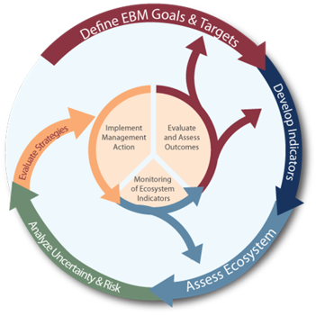

class: top, left

<style>
p.caption {
  font-size: 0.6em;
}
</style>

```{r setup, include=FALSE}
options(htmltools.dir.version = FALSE)
knitr::opts_chunk$set(echo = F,
                      fig.retina = 3,
                      #fig.width = 4,
                      #fig.height = 2,
                      fig.asp = 0.45,
                      warning = F,
                      message = F)
#Plotting and data libraries
library(tidyverse)
library(tidyr)
library(here)
library(kableExtra)
library(ecodata)
library(readxl); library(data.table)
library(DT)
library(widgetframe)
```

```{r, load_refs, include=FALSE, cache=FALSE}
library(RefManageR)
BibOptions(check.entries = FALSE,
           bib.style = "authoryear",
           cite.style = "authoryear",
           longnamesfirst = FALSE,
           max.names = 1,
           style = "markdown")
myBib <- ReadBib("./MidSOE.bib", check = FALSE)
#,
#           hyperlink = FALSE,
#           dashed = FALSE
```

# State of the Ecosystem 101
.pull-left[
Presentation Overview 
- State of the Ecosystem (SOE)
  - Overview
  - Structure
  - Workflow
- Data
  - Information Needed
  - Desired Structure
  - Delivery Pathways
- Expectations
  - What we expect from Contributors
  - What Contributors can expect from us 
]

.pull-right[

]

---

# State of the Ecosystem Overview
## Improving ecosystem information and synthesis for fishery managers

.pull-left[

- Integrated Ecosystem Assessment (IEA)
- Part of IEA loop
 - Develop indicators
 - Assess ecosystem


]

.pull-right[
*The IEA Loop<sup>1</sup>*


.footnote[
[1] https://www.integratedecosystemassessment.noaa.gov/national/IEA-approach
]
]


---

# State of the Ecosystem Overview

.pull-left[

- Fishery-relevant subset of full Ecosystem Status Reports
  - Report evolving since 2016
  - Contextual information
- Ecosystem indicators linked to management objectives `r Cite(myBib, "depiper_operationalizing_2017")`
- Open science emphasis `r Cite(myBib, "bastille_improving_2020")`

]

.pull-right[


]

---
## State of the Ecosystem Structure
.pull-left[

## Report Structure
1. Graphical summary
    + Page 1 report card re: objectives &rarr;
    + Page 2 risk summary bullets
    + Page 3 synthesis themes
1. Performance relative to management objectives
1. Risks to meeting management objectives

]
.pull-right[

```{r management-objectives}
mng_obj <- data.frame("Objective Categories" = c("Seafood Production",
                                                 "Profits","Recreation",
                                                 "Stability","Social & Cultural",
                                                 "Protected Species",
                                                 "Biomass","Productivity",
                                                 "Trophic structure","Habitat"),
"Indicators reported here" = c("Landings; commercial total and by feeding guild; recreational harvest",
                               "Revenue decomposed to price and volume",
                               "Days fished; recreational fleet diversity",
                               "Diversity indices (fishery and ecosystem)",
                               "Community engagement/reliance status",
                               "Bycatch; population (adult and juvenile) numbers, mortalities",
                               "Biomass or abundance by feeding guild from surveys",
                               "Condition and recruitment of managed species, Primary productivity",
                               "Relative biomass of feeding guilds, Zooplankton",
                               "Estuarine and offshore habitat conditions"))
knitr::kable(mng_obj, linesep = "",
      col.names = c("Objective Categories","Indicators reported here"),
      caption = "Example ecosystem-scale fishery management objectives",
      #align = 'c',
      booktabs = T) %>%
  kable_styling(font_size = 14) %>%
 # kable_styling(latex_options = "hold_position", "scale_down") %>%
 # column_spec(c(2), width = c("25em")) %>%
  row_spec(0, bold = TRUE) %>%
 # group_rows("Provisioning/Cultural", 1,4) %>%
 # group_rows("Supporting/Regulating", 5,9)
  pack_rows("Provisioning and Cultural Services", 1,6) %>%
  pack_rows("Supporting and Regulating Services", 7,10)
```
]

---
# State of the Ecosystem Workflow


---
# Data Needed
image of icons??
---
# Data Structure

image of ideal data set
---
# Data Delivery Pathways
- Google form
- Data Uploader
---
# Expectations

## What we expect of data contributors

## What data contributors can expect from us

---
 