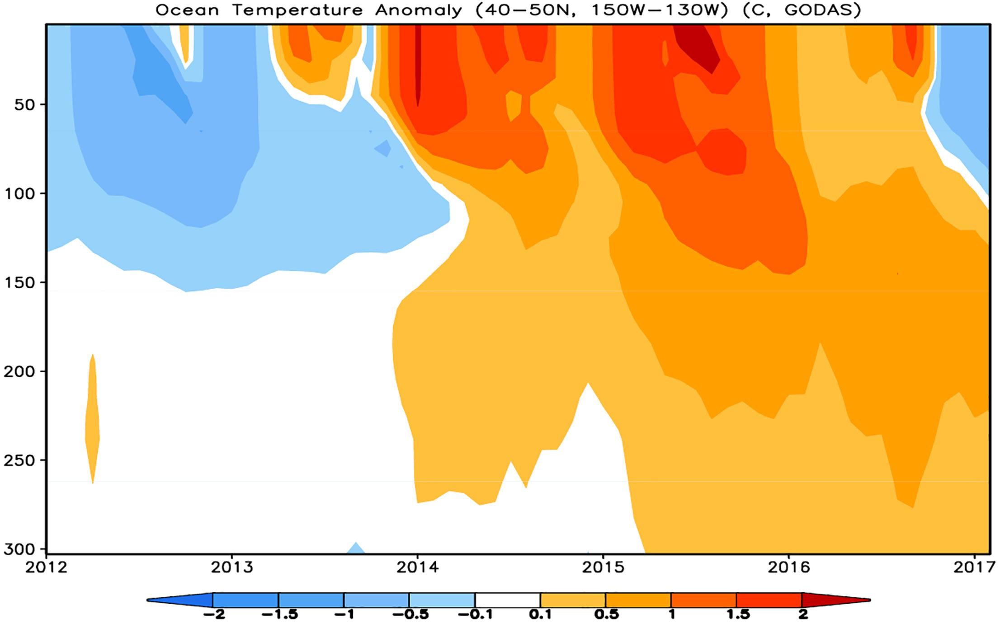
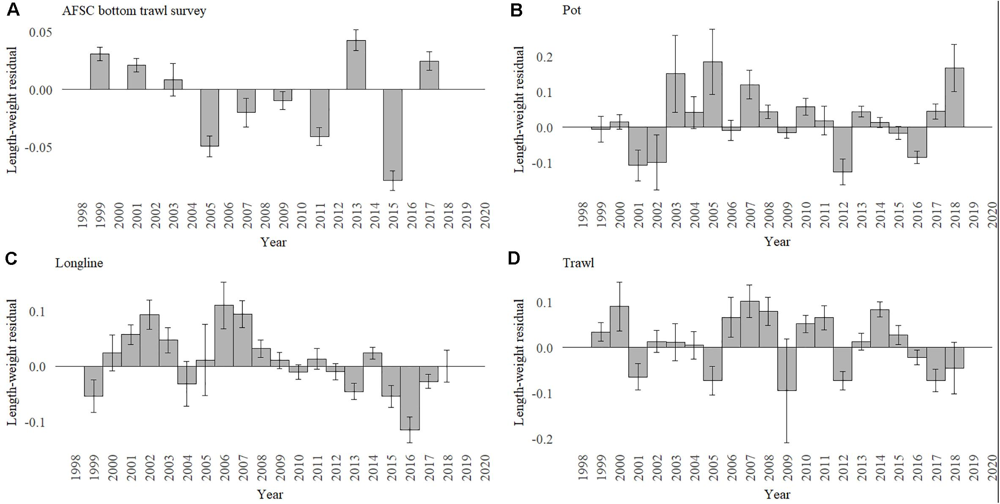

class: top, left

```{r setup, include=FALSE}

options(htmltools.dir.version = FALSE)
knitr::opts_chunk$set(echo = F,
                      fig.retina = 3,
                      #fig.width = 4,
                      #fig.height = 2,
                      fig.asp = 0.45,
                      warning = F,
                      message = F)
#Plotting and data libraries
library(tidyverse)
library(tidyr)
library(here)
library(kableExtra)


```

## Council Feedback on Updated structure: Keep!
.pull-left[

## 2020 Report
1. Summary 2 pager
1. Human dimensions
1. Protected species
1. Fish and invertebrates (managed and otherwise)
1. Habitat quality and ecosystem productivity

## 2021 Report
1. Graphical summary
    + Page 1 report card re: objectives &rarr;
    + Page 2 risk summary bullets
    + Page 3 synthesis themes
1. Performance relative to management objectives
1. Risks to meeting management objectives

]

.pull-right[

```{r management-objectives}
mng_obj <- data.frame("Objective Categories" = c("Seafood Production",
                                                 "Profits","Recreation",
                                                 "Stability","Social & Cultural",
                                                 "Protected Species",
                                                 "Biomass","Productivity",
                                                 "Trophic structure","Habitat"),
"Indicators reported here" = c("Landings; commercial total and by feeding guild; recreational harvest",
                               "Revenue decomposed to price and volume",
                               "Days fished; recreational fleet diversity",
                               "Diversity indices (fishery and ecosystem)",
                               "Community engagement/reliance status",
                               "Bycatch; population (adult and juvenile) numbers, mortalities",
                               "Biomass or abundance by feeding guild from surveys",
                               "Condition and recruitment of managed species, Primary productivity",
                               "Relative biomass of feeding guilds, Zooplankton",
                               "Estuarine and offshore habitat conditions"))

knitr::kable(mng_obj, linesep = "",
      col.names = c("Objective Categories","Indicators reported here"),
      caption = "Ecosystem-scale fishery management objectives",
      #align = 'c',
      booktabs = T) %>%
  kable_styling(font_size = 14) %>%
 # kable_styling(latex_options = "hold_position", "scale_down") %>%
 # column_spec(c(2), width = c("25em")) %>%
  row_spec(0, bold = TRUE) %>%
 # group_rows("Provisioning/Cultural", 1,4) %>%
 # group_rows("Supporting/Regulating", 5,9)
  pack_rows("Provisioning and Cultural Services", 1,6) %>%
  pack_rows("Supporting and Regulating Services", 7,10)


```
]

---
## 2022 Request tracking memo: prioritze with current outline, SSCs

```{r, results='hide'}
 resultfile <- googledrive::drive_find(pattern = "SOE 2021 Response Checklist", type = "spreadsheet")
# 
 requests <- googledrive::drive_download(resultfile, type = "csv", overwrite = TRUE) %>%
   {read.csv(.$local_path)} 

#requests <- read.csv(here("SOE_Request_Checklist.csv"))
```

.scroll-output[

```{r memo}

# requests <- googledrive::drive_download(resultfile, type = "csv", overwrite = TRUE) %>%
#   {read.csv(.$local_path)} 

requeststab <- requests %>%
  dplyr::select(Request, Year, Source, Progress) #%>%
  #dplyr::mutate("Memo Section" = rownames(.))

knitr::kable(requeststab, longtable = T, booktabs = TRUE, linesep = "") %>%
  kable_styling(font_size=12#, latex_options = c("hold_position", "striped", "repeat_header")
                ) %>%
  row_spec(0,bold=TRUE) %>%
  column_spec(1, width="9.5cm") %>%
  column_spec(2, width="1cm") %>%
  column_spec(3, width="2.5cm") %>%
  column_spec(4, width="13.5cm") #%>%
  #column_spec(5, width="1.5cm")

```
]


---
background-image: url("EDAB_images/SOE-MAFMC-2021-plusgraphicsummary_Page_02.png")
background-size: 500px
background-position: right

## SSC State of the Ecosystem Working Group
.pull-left-60[
Objective: make better use of existing ecosystem information presented each year, and develop more tailored products and processes to use this information in management

Possible tasks for this WG include:  
*  Review and prioritize current ecosystem indicator work (analyses of indicators/groups, thresholds, etc) for the 2022 SOE report or prototype stock specific reports 
*  Develop and test decision frameworks that use ecosystem information in setting Acceptable Biological Catch (ABC) for individual stocks
*  Provide scientific support for MAFMC's comprehensive review and update of EAFM risk assessment, and for the Council's use of SOE and risk assessment in strategic planning.

]

---

## Seeking Council Feedback 

What types of ecosystem data/information, tools, or approaches may be missing or would be informative to help support Council decision making, strategic planning, and priority setting (management and research)?

## Examples

1. The North Pacific Fishery Management Council has used Ecosystem Status Reports to inform OFL and ABC setting for coming years (Bering Sea pollock 2006, Gulf of Alaska cod 2018-2019)
1. California Department of Fish and Wildlife utilizes habitat compression and forage indices to inform their [Risk Assessment and Mitigation Program](https://wildlife.ca.gov/Conservation/Marine/Whale-Safe-Fisheries#559972749-2020-21-season) for humpback whales, blue whales, and Pacific leatherback turtles


.pull-left[

]
.pull-right[

]

---
background-image: url("EDAB_images/work-in-progress.png")
background-size: 200px
background-position: right bottom

## SSC Proposal in Progress

* Includes stock specific and ecosystem level processes, co-develop with stock specific reporting (ESPs)
    - Overfishing Limit coefficient of variation (OFL CV) can include both
    - Multispecies and system level decisions to be considered for development
--
* Potential analyses: OFL CV
    - For selected stocks and/or general life history types
        - Which ecosystem factors affect uncertainty in current stock biomass and Fmsy?
        - Conceptual model mapping ecosystem factors to stock processes
        - Which current ecosystem indicators best match relevant ecosystem factors?
        - Empirical or simulation analysis: do changes in those indicators predictably change uncertainty?
    - Coordinate with with upcoming research track assessments
--
* Potential analyses: multispecies and system level advice
    - Where are there multispecies/multifleet tradeoffs linking to economic and social outcomes?
    - Identify initial priorities in collaboration with Council
    - Are there multi-indicators thresholds suggesting when FMP level management needs to change?
    - Are there changes in ecosystem productivity that imply standardized approaches for
        - Setting reference points? 
        - Developing rebuilding plans?
        - Other analyses requiring short-term projections?
        

???
Under this short term objective, the SSC ecosystem group would first outline a set of hypotheses for which ecosystem factors would be reasonably expected to affect uncertainty in OFL for a range of life history types or selected individual stocks. A conceptual model mapping ecosystem factors to stock attributes and stock assessment components directly affecting OFL would be constructed to focus on the most relevant considerations for OFL CV. NEFSC staff (EDAB and others as appropriate) would match the ecosystem factors to existing ecosystem indicators, or identify information to develop new indicators if necessary. The SSC ecosystem work group would then collaborate with NEFSC staff to develop analyses relating changes in selected ecosystem indicators to increases/decreases in OFL uncertainty for general life history types, individual stocks, or both. Coordination with specific upcoming research track assessments is also possible. 

We propose a longer term objective of developing prototype processes to provide multispecies and system level scientific advice appropriate for Council decision making, in particular where there are multispecies and multifleet tradeoffs linking directly to economic and social outcomes. This is obviously more complex, and requires collaborative work with the Council and Council staff to identify initial priorities with concrete endpoints. One suggestion from the working group was to evaluate thresholds across multiple indicators that, if crossed, might cause the Council to reconsider broad management objectives at the FMP level or across FMPs. Another suggestion could be to address ecosystem productivity comprehensively across stocks in estimation of reference points and approaches for short term projections as well as rebuilding plans. 


