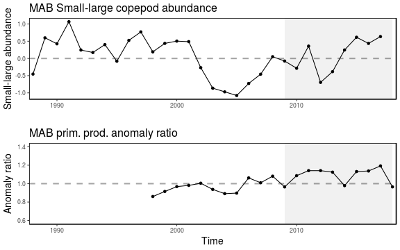

class: top, left

```{r setup, include=FALSE}

options(htmltools.dir.version = FALSE)
knitr::opts_chunk$set(echo = F,
                      fig.retina = 3,
                      warning = F,
                      message = F)
#Plotting and data libraries
library(tidyverse)
library(tidyr)
library(here)
library(kableExtra)
library(ecodata)
library(readxl); library(data.table)
library(DT)
library(widgetframe)

#Region identifiers
epu <- "Mid-Atlantic Bight"
epu_abbr <- "MAB"
region <- "Mid-Atlantic"
region_abbr <- "MA" #Some commercial data organized by "MA" or "NE" regions, not by EPU 

#General inline text input for report

#Council
council <- "Mid-Atlantic Fishery Management Council"
council_abbr <- "MAFMC"

#Define constants for commercial landings figure plot
series.col <- c("indianred","black")


#Time series constants
shade.alpha <- 0.3
shade.fill <- "lightgrey"
lwd <- 1
pcex <- 2
trend.alpha <- 0.5
trend.size <- 2
hline.size <- 1
hline.alpha <- 0.35
hline.lty <- "dashed"
label.size <- 5
hjust.label <- 1.5
letter_size <- 4
feeding.guilds1<- c("Piscivore","Planktivore","Benthivore","Benthos")
feeding.guilds <- c("Apex Predator","Piscivore","Planktivore","Benthivore","Benthos")
x.shade.min <- 2010
x.shade.max <- 2020
#Function for custom ggplot facet labels
label <- function(variable,value){
  return(facet_names[value])
}

```

```{r, load_refs, include=FALSE, cache=FALSE}
library(RefManageR)
BibOptions(check.entries = FALSE,
           bib.style = "authoryear",
           cite.style = "authoryear",
           longnamesfirst = FALSE,
           max.names = 1,
           style = "markdown")
myBib <- ReadBib("./MidSOE.bib", check = FALSE)

#,
#           hyperlink = FALSE,
#           dashed = FALSE

```

# State of the Ecosystem (SOE) reporting
## Improving ecosystem information and synthesis for fishery managers

.pull-left[

- Ecosystem indicators linked to management objectives `r Cite(myBib, "depiper_operationalizing_2017")`
    + Contextual information
    + Report evolving since 2016
    + Fishery-relevant subset of full Ecosystem Status Reprorts

- Open science emphasis `r Cite(myBib, "bastille_improving_2020")`

- Used within Mid-Atlantic Fishery Management Council's Ecosystem Process `r Cite(myBib, "muffley_there_2020")`
 
]

.pull-right[
*The IEA Loop<sup>1</sup>*


.footnote[
[1] https://www.integratedecosystemassessment.noaa.gov/national/IEA-approach
]
]
???

---
## State of the Ecosystem: Structure
.pull-left[

## 2020 Report
1. Summary 2 pager
1. Human dimensions
1. Protected species
1. Fish and invertebrates (managed and otherwise)
1. Habitat quality and ecosystem productivity

## 2021 Proposed
1. Summary 2 pager
    + Page 1 summary bullets
    + Page 2 synthesis themes
1. Performance against management objectives
1. Risks

]

.pull-right[

*Established ecosystem-scale objectives*

```{r management-objectives}
mng_obj <- data.frame("Objective Categories" = c("Seafood Production",
                                                 "Profits","Recreation",
                                                 "Social & Cultural", "Stability",
                                                 "Biomass","Productivity",
                                                 "Trophic structure","Habitat"),
"Indicators reported here" = c("Landings by feeding guild","Revenue decomposed to price and volume",
                               "Days fished; recreational catch",
                               "Commercial engagement trends",
                               "Diversity indices (fishery and species)",
                               "Biomass or abundance by feeding guild from surveys",
                               "Condition and recruitment of managed species, Primary productivity",
                               "Relative biomass of feeding guilds, Zooplankton",
                               "Estuarine and offshore habitat conditions"))

#knitr::kable(mng_obj, linesep = "",
mng_obj %>%
      #col.names = c("Objective Categories","Indicators reported here") %>%
      #caption = "Established ecosystem-scale objectives in the Mid-Atlantic Bight",
      #align = 'c',
      #booktabs = T) %>%
  #kable_styling(latex_options = "hold_position", "scale_down") %>%
 # column_spec(c(2), width = c("25em")) %>%
  kable(format = "html", escape = F, #table.attr='class="risktable"',
        col.names = c("Objective Categories","Indicators reported here")) %>%
  kable_styling(font_size = 14) %>%
  row_spec(0, bold = TRUE) %>%
  group_rows("Provisioning/Cultural", 1,4) %>%
  group_rows("Supporting/Regulating", 5,9)


```
]

---
## [2020 Report](https://doi.org/10.25923/1f8j-d564): Summary 2 pager with visualizations, 28 pages of narrative/plots, 1 page orientation

.pull-left[
.center[

]
]

.pull-right[
.center[

]
]

---
## Proposed ecosystem synthesis themes for 2021

Characterizing ecosystem change for fishery management: plain language summary for 2 pager

* Multiple drivers of abundance, defined by the competing factors that influence the amount of fish in the ocean; 
* Regime shifts, or ecosystem change can happen rapidly as multiple drivers change; and, 
* Reorganization of the ecosystem, multiple factors that interact that change the structure and organization of the ecosystem, e.g. Tropicalization

.pull-left[


]

.pull-right[

]

---
## Proposed outline: two sections, each with "what" and "why"

.pull-left[
* Performance against management objectives
    - *What* does the indicator say--up, down, stable?
    - *Why* do we think it is changing: integrates synthesis themes
        - Multiple drivers
        - Regime shifts
        - Ecosystem reorganization
* Objectives
    - Seafood production
    - Profits
    - Recreational opportunities
    - Stability
    - Social and cultural
    - Protected species
]

.pull-right[
* Risks
    - *What* does the indicator say--up, down, stable?
    - *Why* this is important to managers: integrates synthesis themes
        - Multiple drivers
        - Regime shifts
        - Ecosystem reorganization
* Risk categories
    - Climate: warming, ocean currents, acidification
        - Habitat changes (incl. vulnerability analysis)
        - Productivity changes (system and fish)
        - Species interaction changes
        - Community structure changes
    - Other ocean uses
        - Wind
]

---
## Example: Seafood production objective

.pull-left[
Indicator: Total landings Trend: Decreasing  
Mid-Atlantic  
```{r, code = readLines("https://raw.githubusercontent.com/NOAA-EDAB/ecodata/master/chunk-scripts/human_dimensions_MAB.Rmd-comdat-total-landings.R"), fig.height=3}
```
New England  
```{r, code = readLines("https://raw.githubusercontent.com/NOAA-EDAB/ecodata/master/chunk-scripts/human_dimensions_NE.Rmd-setup.R")}
```

```{r, code = readLines("https://raw.githubusercontent.com/NOAA-EDAB/ecodata/master/chunk-scripts/human_dimensions_NE.Rmd-comdat-total-landings.R"), fig.height=3}
```

]

.pull-right[
Why: multiple drivers: stock status/management, engagement, markets, fish population drivers
```{r, code = readLines("https://raw.githubusercontent.com/NOAA-EDAB/ecodata/master/chunk-scripts/human_dimensions_MAB.Rmd-setup.R")}
```

```{r, code = readLines("https://raw.githubusercontent.com/NOAA-EDAB/ecodata/master/chunk-scripts/human_dimensions_MAB.Rmd-stock-status.R"), fig.height=3 }
```

.center[]
]

---
## Multiple drivers of fish production analysis in progress: environment - fish condition - market price linkages

   

* Identify multiple and changing drivers of condition and market prices over time
* Recognize regime shifts and potential system reorganization

* Work in progress has identified the following potential drivers
    - *Temperature?*
    - *Zooplankton...? get list from Laurel*

---
## Example: Profits objective
.pull-left[
Indicator: Total Revenue   
Mid-Atlantic  
```{r, code = readLines("https://raw.githubusercontent.com/NOAA-EDAB/ecodata/master/chunk-scripts/human_dimensions_MAB.Rmd-comdat-comm-revenue.R"), fig.height=3}
```
New England
```{r, code = readLines("https://raw.githubusercontent.com/NOAA-EDAB/ecodata/master/chunk-scripts/human_dimensions_NE.Rmd-setup.R")}
```

```{r, code = readLines("https://raw.githubusercontent.com/NOAA-EDAB/ecodata/master/chunk-scripts/human_dimensions_NE.Rmd-comdat-comm-revenue.R"), fig.height=3}
```

]

.pull-right[
Why: multiple drivers: Revenue decomposed to price and volume
Mid-Atlantic
```{r, code = readLines("https://raw.githubusercontent.com/NOAA-EDAB/ecodata/master/chunk-scripts/human_dimensions_MAB.Rmd-setup.R")}
```

```{r, code = readLines("https://raw.githubusercontent.com/NOAA-EDAB/ecodata/master/chunk-scripts/human_dimensions_MAB.Rmd-bennet.R"), fig.height=3}
```
New England  
```{r, code = readLines("https://raw.githubusercontent.com/NOAA-EDAB/ecodata/master/chunk-scripts/human_dimensions_NE.Rmd-bennet.R"), fig.height=3}
```
]

---
## Example: Recreational opportunities objective
.pull-left[
Indicator: Recreational Landings   
Mid-Atlantic  
```{r, code = readLines("https://raw.githubusercontent.com/NOAA-EDAB/ecodata/master/chunk-scripts/human_dimensions_MAB.Rmd-recdat-landings.R"), fig.height=3}
```
New England
```{r, code = readLines("https://raw.githubusercontent.com/NOAA-EDAB/ecodata/master/chunk-scripts/human_dimensions_NE.Rmd-setup.R")}
```

```{r, code = readLines("https://raw.githubusercontent.com/NOAA-EDAB/ecodata/master/chunk-scripts/human_dimensions_NE.Rmd-recdat-landings.R"), fig.height=3}
```

]

.pull-right[
Why: multiple drivers: Engagement and diversity
Mid-Atlantic
```{r, code = readLines("https://raw.githubusercontent.com/NOAA-EDAB/ecodata/master/chunk-scripts/human_dimensions_MAB.Rmd-setup.R")}
```

```{r, code = readLines("https://raw.githubusercontent.com/NOAA-EDAB/ecodata/master/chunk-scripts/human_dimensions_MAB.Rmd-recdat-diversity.R"), fig.height=6}
```
]

---
## Example: Stability objective
.pull-left[
Indicator: Diversity in fishery/species   
Fishery (Mid-Atlantic) 

]

.pull-right[
Why: multiple drivers:
Mid-Atlantic

]

---
## Example: Social and cultural objectives

---
## Example: Protected species objectives (multiple slides?)

---
## Example: Climate risks: multiple potential impacts on management
.pull-left[
Indicators: Gulf Stream index, bottom and surface temperature, heat waves  
Trends:
```{r, code = readLines("https://raw.githubusercontent.com/NOAA-EDAB/ecodata/master/chunk-scripts/LTL_MAB.Rmd-setup.R")}
```


```{r, code = readLines("https://raw.githubusercontent.com/NOAA-EDAB/ecodata/master/chunk-scripts/LTL_MAB.Rmd-gsi.R"), fig.height=3, out.width='60%'}
```

```{r, code =readLines("https://raw.githubusercontent.com/NOAA-EDAB/ecodata/master/chunk-scripts/LTL_MAB.Rmd-bottom-temp.R"), fig.height=3, out.width='60%'}

```

```{r, code = readLines("https://raw.githubusercontent.com/NOAA-EDAB/ecodata/master/chunk-scripts/LTL_MAB.Rmd-heatwave.R"), fig.height=3, out.width='70%'}
```
]

.pull-right[

Why this matters: 
Habitat change from multiple drivers alters:
    - species distributions--allocation
    - system productivity--fishery resource productivity
```{r}

```

]

---
## Example: Climate risks to species distribution--allocation issues

* Changing species distributions
* Habitat conditions, habitat vulnerability?

---
## Example: Climate risks to species production--fishery yields

* OA impact on shellfish growth
* Ecosystem productivity link to fishery productivity
* Diversity changes (tropicalizaton? affects species available for fishing, FMPs)
* Predation increasing? sharks, seals


---
## Example: Other ocean uses

* Wind

---
## Future: Better integration of habitats with managed species for managers

* Mid-Atlantic Council very interested in estuarine conditions and habitat supporting managed stocks
* Chesapeake Bay has excellent indicators and synthesis
* Prioritize next steps for identifying high risk combinations: Key species, habitats, and drivers
* 2021 SOE introduces Habitat Climate Vulerability Assessment results linked to species

```{r midHabTable}
#Read in Mid-Atlantic table

#src <- "https://github.com/NOAA-EDAB/ecodata/blob/master/data-raw/habitat_vulnerability.xlsx"
#lcl <- basename(src)
#download.file(url = src, destfile = lcl)

mid <- as.data.table(readxl::read_xlsx(here('habitat_vulnerability.xlsx'), 
                         sheet = 'Mid-Atlantic', skip = 1))

#if (file.exists(lcl)) {
  #Delete file if it exists
#  file.remove(lcl)
#}

#Identify individual species climate vulnerability
vhigh.vul <- unique(mid[`Species Vulnerability Rank (FCVA)` == 'Very high', Species])
high.vul  <- unique(mid[`Species Vulnerability Rank (FCVA)` == 'High', Species])
mod.vul   <- unique(mid[`Species Vulnerability Rank (FCVA)` == 'Moderate', Species])
low.vul   <- unique(mid[`Species Vulnerability Rank (FCVA)` == 'Low', Species])

#Grab habitat vulnerability 
hab.vul <- unique(mid[, c('Habitat Name', 'Habitat Vulnerability Rank (HVCA)')])
habitats <- hab.vul[, 'Habitat Name']
hab.vul <- data.table('Habitat Vulnerability' = c(NA, NA, t(hab.vul[, 'Habitat Vulnerability Rank (HVCA)'])))

#Rearrange table
mid <- data.table::melt.data.table(mid, id.vars = c('Habitat Name', 'Species'),
                                   measure.vars = c('Eggs/Larva', 'Juvenile/YOY',
                                                    'Adult', 'Spawning Adult'),
                                   variable.name = 'Stage', value.name = 'Dependence')
mid[, Habitat := as.factor(mid$'Habitat Name')]
mid <- data.table::dcast.data.table(mid, Species + Stage ~ Habitat,
                                    value.var = 'Dependence')
setcolorder(mid, c('Species', 'Stage', habitats$'Habitat Name'))

#Add Habitat Vulnerbaility
#hab.table <- rbindlist(list(as.data.table(t(hab.vul)), mid), use.names = F)
hab.table <- mid
#Add names back in
names(hab.table) <- names(mid)
hab.table <- hab.table %>% mutate_if(is.character, str_trim)

#from examples here https://rstudio.github.io/DT/010-style.html

#color coding cells works
#need to add column with species vulnerability and color code species by it but not show it, like #hideV6 example at link
#if we show it we can sort by species vulnerability though... alphabetical doesnt work so use numbers to go lowest-highest
#still need to color code headers
hab.table <- hab.table %>%
  mutate(spVul = #Color code species based on climate vul
    # case_when(Species %in% low.vul ~ "low.vul",
    #           Species %in% mod.vul ~ "mod.vul",
    #           Species %in% high.vul ~ "high.vul",
    #           Species %in% vhigh.vul ~ "vhigh.vul")
    # )
    case_when(Species %in% low.vul ~ 1,
              Species %in% mod.vul ~ 2,
              Species %in% high.vul ~ 3,
              Species %in% vhigh.vul ~ 4)
    )

colnames(hab.table)[c(3:4)] <- paste0('<span style="box-shadow: -10px 0 0 red, 10px 0 0 red; background-color:red; color:white">',colnames(hab.table)[c(3:4)],'</span>')
colnames(hab.table)[c(5:10)] <- paste0('<span style="box-shadow: -10px 0 0 orange, 10px 0 0 orange; background-color:',c("orange"),'">',colnames(hab.table)[c(5:10)],'</span>')
colnames(hab.table)[c(11:15)] <- paste0('<span style="box-shadow: -10px 0 0 yellow, 10px 0 0 yellow; background-color:',c("yellow"),'">',colnames(hab.table)[c(11:15)],'</span>')

dt <- datatable(hab.table, rownames = FALSE, escape = FALSE,
          extensions = c('Scroller', 'FixedColumns'), #add scrolling and fixed column
          options = list(deferRender = TRUE,
          scrollY = 300, scroller = TRUE,
          dom = 't',scrollX = TRUE,fixedColumns = TRUE)
          #, options = list(columnDefs = list(list(targets = 16, visible = FALSE)))
  ) %>% 
  formatStyle(
    names(hab.table)[3:4],
    backgroundColor = '#FF000080'
  ) %>%
  formatStyle(
    names(hab.table)[5:10],
    backgroundColor = '#FFA50080'
  ) %>%
  formatStyle(
    names(hab.table)[11:15],
    backgroundColor = '#FFFF0080'
  ) %>%

  formatStyle(#Color code base on dependence
    'Species', "spVul",
    backgroundColor = styleEqual(#c("low.vul", "mod.vul", "high.vul", "vhigh.vul"),
                                 c(1,2,3,4),
                                 c('lightgreen', 'yellow', 'orange', 'red')), #Color code base on dependence)
    color = styleEqual(c(1,2,3,4),
                                 c('black', 'black', 'black', 'white'))
    ) %>%
    formatStyle(
    names(hab.table),
    backgroundColor = styleEqual(c("Low", "Moderate", "High", "Very high"), 
                                 c('lightgreen', 'yellow', 'orange', 'red')), 
    color = styleEqual(c("Low", "Moderate", "High", "Very high"), 
                                 c('black', 'black', 'black', 'white'))
  )

frameWidget(dt)
```


---
## References

.contrib[
```{r refs, echo=FALSE, results="asis"}
PrintBibliography(myBib)
```
]


## Additional resources
.pull-left[
* [SOE Technical Documentation](https://noaa-edab.github.io/tech-doc)

* [ecodata R package](https://github.com/noaa-edab/ecodata)

  * [Macrofauna indicators](http://noaa-edab.github.io/ecodata/macrofauna)
  * [Human Dimensions indicators](http://noaa-edab.github.io/ecodata/human_dimensions)
  * [Lower trophic level indicators](http://noaa-edab.github.io/ecodata/LTL)
]
.pull-right[
* [Mid-Atlantic ecosystem approach](https://www.mafmc.org/eafm)

* [State of the Ecosystem Reports](https://www.fisheries.noaa.gov/new-england-mid-atlantic/ecosystems/state-ecosystem-reports-northeast-us-shelf)

* [Draft indicator catalogue](https://noaa-edab.github.io/catalog/)

.contrib[

* Slides available at https://noaa-edab.github.io/presentations
* Contact: <Sarah.Gaichas@noaa.gov>
]
]

