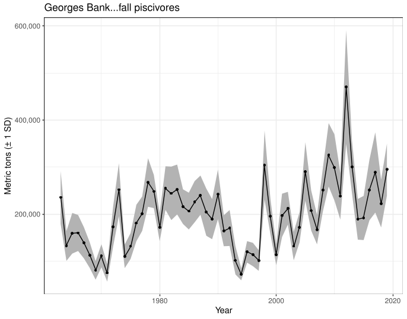
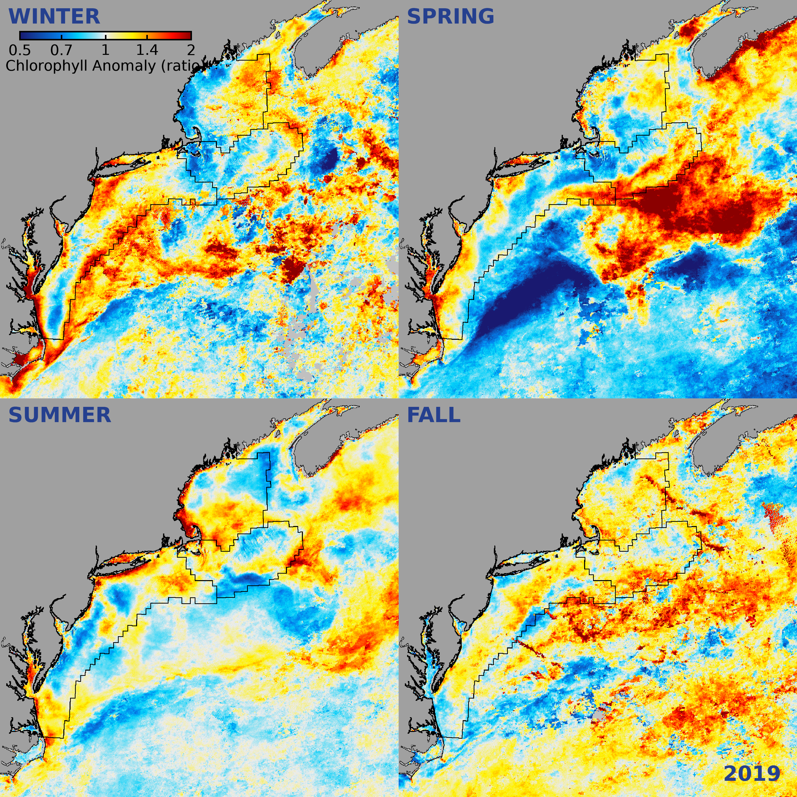

class: top, left

```{r setup, include=FALSE}

options(htmltools.dir.version = FALSE)
knitr::opts_chunk$set(echo = F,
                      warning = F,
                      message = F)
#Plotting and data libraries
library(tidyverse)
library(tidyr)
library(ecodata)
library(here)
library(kableExtra)
library(ggrepel)
library(patchwork)
library(grid)
library(ggiraph)
library(vegan)
library(rpart)
library(ks)
library(cowplot)

#GIS libraries
library(sf)
library(rgdal)
library(raster)
library(rnaturalearth)

data.dir <- here::here("data")
gis.dir <- here::here("data")

#General inline text input for report
#Council
council <- "Mid-Atlantic Fishery Management Council"
council_abbr <- "MAFMC"

#Region identifiers
epu <- "Mid-Atlantic Bight"
epu_abbr <- "MAB"
region <- "Mid-Atlantic"
region_abbr <- "MA" #Some commercial data organized by "MA" or "NE" regions, not by EPU 

#Time series constants
shade.alpha <- 0.3
shade.fill <- "lightgrey"
lwd <- 1
pcex <- 2
trend.alpha <- 0.5
trend.size <- 2
hline.size <- 1
hline.alpha <- 0.35
hline.lty <- "dashed"
label.size <- 5
hjust.label <- 1.5
letter_size <- 4
feeding.guilds1<- c("Piscivore","Planktivore","Benthivore","Benthos")
feeding.guilds <- c("Apex Predator","Piscivore","Planktivore","Benthivore","Benthos")
x.shade.min <- 2009
x.shade.max <- 2019
#Function for custom ggplot facet labels
label <- function(variable,value){
  return(facet_names[value])
}

#CRS
crs <- "+proj=longlat +lat_1=35 +lat_2=45 +lat_0=40 +lon_0=-77 +x_0=0 +y_0=0 +datum=NAD83 +no_defs +ellps=GRS80 +towgs84=0,0,0"

#Coastline shapefile
coast <- ne_countries(scale = 10,
                          continent = "North America",
                          returnclass = "sf") %>%
             sf::st_transform(crs = crs)

#State polygons
ne_states <- ne_states(country = "united states of america",
                                      returnclass = "sf") %>%
  sf::st_transform(crs = crs)

#high-res polygon of Maine
#new_england <- read_sf(gis.dir,"new_england")

#EPU shapefile
epu_sf <- ecodata::epu_sf %>% 
  filter(EPU %in% c("MAB","GB","GOM"))

#Map line parameters
map.lwd <- 0.4

# Set lat/lon window for maps
xmin = -77
xmax = -65
ymin = 36
ymax = 45
xlims <- c(xmin, xmax)
ylims <- c(ymin, ymax)

```

# Today's Talk

.pull-left[

- Role of Ecosystem reporting in MAFMC EAFM

- New! Response memo

- 2020 Mid-Atlantic Report

- EAFM risk assessment update

- SSC discussion and feedback
]

.pull-right[
*The IEA Loop<sup>1</sup>*

]

.footnote[
[1] https://www.integratedecosystemassessment.noaa.gov/national/IEA-approach
]

???

---
## Mid-Atlantic Council Ecosystem Approach

* 2016 EAFM Policy Guidance document; revised 2019<sup>1</sup> 

* MAFMC EAFM framework<sup>2</sup>
.center[

]
* 2017 Inital EAFM risk assessment completed; revised and published 2018<sup>3</sup>

* SOE indicators to be used for annual risk assessment updates


.footnote[
[1] http://www.mafmc.org/s/EAFM-Doc-Revised-2019-02-08.pdf
[2] https://www.frontiersin.org/articles/10.3389/fmars.2016.00105/full
[3] https://www.frontiersin.org/articles/10.3389/fmars.2018.00442/full
]

???
The Council’s EAFM framework has similarities to the IEA loop on slide 2. It uses risk assessment as a first step to prioritize combinations of managed species, fleets, and ecosystem interactions for consideration. Second, a conceptual model is developed identifying key environmental, ecological, social, economic, and management linkages for a high-priority fishery. Third, quantitative modeling addressing Council-specified questions and based on interactions identified in the conceptual model is applied to evaluate alternative management strategies that best balance management objectives. As strategies are implemented, outcomes are monitored and the process is adjusted, and/or another priority identified in risk assessment can be addressed. 

---
## State of the Ecosystem (SOE) Reporting: Context for busy people

*"So what?" --John Boreman, September 2016*

1. Clear linkage of ecosystem indicators with management objectives

1. Synthesis across indicators for big picture

1. Objectives related to human-well being placed first in report

1. Short (< 30 pages), non-technical (but rigorous) text

1. Emphasis on reproducibility 

.center[

]

???
In 2016, we began taking steps to address these common critiques of the ESR model

---
## State of the Ecosystem 2020: Response Memo

Our response to the need for more formal response to comments!

  * 30 comments or requests from 2019
  * One addressed by having the response memo
  * 21 addressed within the SOE at SSC/Council request
    * New summary section with synthetic overview addresses 3 requests
    * 5 new indicators added 
    * 3 existing indicators modified
    * 5 editorial updates 
    * 5 partially addressed requests
  * 8 not currently addressed within SOE
    * 2 have information summaries in the response memo
    * 2 may be addressed by student projects 
    * 1 needs feedback on how to deal with known data issue
    * 1 seeking data
    * 1 relevant to 2019 visualization that was replaced in 2020
    * 1 beyond capacity to address at present
    
SSC feedback requested on the approach and all details, memo has specific questions

---
## State of the Ecosystem 2020: Structure
.pull-left[

### Report Structure
1. Summary 2 pager

1. Human dimensions

1. Protected species

1. Fish and invertebrates (managed and otherwise)

1. Habitat quality and ecosystem productivity
]

.pull-right[

*Established ecosystem-scale objectives in the Mid-Atlantic*

```{r management-objectives}
mng_obj <- data.frame("Objective Categories" = c("Seafood Production",
                                                 "Profits","Recreation",
                                                 "Stability","Social & Cultural",
                                                 "Biomass","Productivity",
                                                 "Trophic structure","Habitat"),
"Indicators reported here" = c("Landings by feeding guild","Revenue decomposed to price and volume",
                               "Days fished; recreational catch",
                               "Diversity indices (fishery and species)",
                               "Commercial engagement trends",
                               "Biomass or abundance by feeding guild from surveys",
                               "Condition and recruitment of managed species, Primary productivity",
                               "Relative biomass of feeding guilds, Zooplankton",
                               "Estuarine and offshore habitat conditions"))

#knitr::kable(mng_obj, linesep = "",
mng_obj %>%
      #col.names = c("Objective Categories","Indicators reported here") %>%
      #caption = "Established ecosystem-scale objectives in the Mid-Atlantic Bight",
      #align = 'c',
      #booktabs = T) %>%
  #kable_styling(latex_options = "hold_position", "scale_down") %>%
 # column_spec(c(2), width = c("25em")) %>%
  kable(format = "html", escape = F, table.attr='class="risktable"',
        col.names = c("Objective Categories","Indicators reported here")) %>%
  kable_styling(font_size = 14) %>%
  row_spec(0, bold = TRUE)


```
]

---
## Memo 1-2: Summary 2 pager with visualizations

.pull-left[

]

.pull-right[

]

---
## Memo 3: Indicator uncertainty

```{r nefsc-biomass-mab, fig.cap = "Spring (left) and fall (right) surveyed biomass in the Mid-Atlantic Bight. Data from the NEFSC Bottom Trawl Survey are shown in black, with NEAMAP shown in red. The shaded area around each annual mean represents 2 standard deviations from the mean. ", fig.width=10, fig.asp = 0.75}
agg<-ecodata::agg_bio %>% 
  filter(!str_detect(Var, "Apex|inshore|offshore|managed|NEFMC|MAFMC|JOINT|NA")) %>% #remove unused datasets
  separate(Var, c("feeding.guild", "season", "Biomass", "Var1"), sep = " ") %>% 
  unite("Var", feeding.guild:season, sep = " ") %>% 
  mutate(stat = recode(Var1, Index = "Mean", 
                      Standard = "SD")) %>% 
  dplyr::select(-Biomass, -Var1) %>% 
  group_by(Var, Time, EPU) %>% 
  spread(stat, Value) %>% 
  mutate(upper = Mean + (2*SD), 
         lower = Mean - (2*SD))


agg_bio<-agg %>% filter(EPU == epu_abbr,
         Time >= 1968) %>% 
  group_by(Var, EPU) %>% 
  mutate(hline = mean(Mean, na.rm = T)) %>% 
  ungroup() 

agg_bio$Var <- factor(agg_bio$Var,levels = c("Piscivore Spring",
                                                   "Piscivore Fall",
                                                    "Benthivore Spring",
                                                   "Benthivore Fall",
                                                    "Planktivore Spring",
                                                    "Planktivore Fall",
                                                    "Benthos Spring",
                                                   "Benthos Fall"))
series.col <- rep("black",length(unique(agg_bio$Var)))
facet_names <- list("Piscivores" = expression("Piscivores"),
                    "Planktivores" = expression("Planktivores"),
                    "Benthivores" = expression("Benthivores"),
                    "Benthos" = expression("Benthos"))
#Get NEAMAP
neamap <- ecodata::mab_inshore_survey %>% 
  group_by(Var) %>% 
  mutate(hline = mean(Value),
         SD = Value * CV, #calculate SD from CV
         upper = Value + (2*SD), 
         lower = Value - (2*SD))

neamap$Var <- factor(neamap$Var,levels = c("Piscivore Spring","Piscivore Fall",
                                           "Benthivore Spring", "Benthivore Fall",
                                           "Planktivore Spring", "Planktivore Fall",  
                                           "Benthos Spring", "Benthos Fall"))
## Piscivore 
neamap.1<-neamap %>% 
  filter(str_detect(Var,"Piscivore"))
p1<-agg_bio %>% 
  filter(str_detect(Var,"Piscivore")) %>% 
  ggplot() +
  
  #Highlight last ten years
  annotate("rect", fill = shade.fill, alpha = shade.alpha,
      xmin = x.shade.min , xmax = x.shade.max ,
      ymin = -Inf, ymax = Inf) +
  #Test for trend and add lines
  geom_gls(aes(x = Time, y = Mean,
               color = Var),
             alpha = trend.alpha, size = trend.size) +

  #Add time series
  geom_ribbon(aes(x = Time, ymin = pmax(lower,0), ymax = upper), 
              alpha = 0.5,
              fill = "grey") +
  geom_line(aes(x = Time, y = Mean),size = lwd-0.5) +
  geom_point(aes(x = Time, y = Mean),size = pcex-0.5) +
  scale_color_manual(values = series.col, aesthetics = "color")+
  guides(color = FALSE) +
  geom_hline(aes(yintercept = hline,
                 group = Var),
             size = hline.size,
             alpha = hline.alpha,
             linetype = hline.lty)+
  facet_wrap(Var~.,ncol = 2) +
     #Add NEAMAP
    geom_ribbon(data = neamap.1, aes(x = Time, ymin = pmax(lower,0), ymax = upper), 
              alpha = 0.5,
              fill = "pink")+
  geom_line(data = neamap.1, aes(x = Time, y = Value),
            color = "#ca0020")+
  geom_point(data = neamap.1, aes(x = Time, y = Value),
             size = pcex-0.5,
             color = "#ca0020")+

  #Axis and theme
  scale_x_continuous(breaks = seq(1965, 2015, by = 10), expand = c(0.01, 0.01)) +
  #ylim(0, 1200)+
  ylab(expression("Biomass (kg tow"^-1*")")) +
  theme_facet()+
  theme(strip.text=element_text(hjust=0), 
        axis.title.x=element_blank())

## Benthivore
neamap.2<-neamap %>% 
  filter(str_detect(Var,"Benthivore"))
p2<-agg_bio %>% 
  filter(str_detect(Var,"Benthivore")) %>% 
  ggplot() +
  
  #Highlight last ten years
  annotate("rect", fill = shade.fill, alpha = shade.alpha,
      xmin = x.shade.min , xmax = x.shade.max ,
      ymin = -Inf, ymax = Inf) +
  #Test for trend and add lines
  geom_gls(aes(x = Time, y = Mean,
               color = Var),
             alpha = trend.alpha, size = trend.size) +
  
  #Add time series
  geom_ribbon( aes(x = Time, ymin = pmax(lower,0), ymax = upper), 
              alpha = 0.5,
              fill = "grey") +
  geom_line(aes(x = Time, y = Mean),size = lwd-0.5) +
  geom_point(aes(x = Time, y = Mean),size = pcex-0.5) +
  scale_color_manual(values = series.col, aesthetics = "color")+
  guides(color = FALSE) +
  geom_hline(aes(yintercept = hline,
                 group = Var),
             size = hline.size,
             alpha = hline.alpha,
             linetype = hline.lty)+
  facet_wrap(Var~.,ncol = 2) +
       #Add NEAMAP
  geom_ribbon(data = neamap.2, aes(x = Time, ymin = pmax(lower,0), ymax = upper), 
              alpha = 0.5, fill = "pink")+
  geom_line(data = neamap.2, aes(x = Time, y = Value),
            color = "#ca0020")+
  geom_point(data = neamap.2, aes(x = Time, y = Value),
             size = pcex-0.5,
             color = "#ca0020")+

  #Axis and theme
  scale_x_continuous(breaks = seq(1965, 2015, by = 10), expand = c(0.01, 0.01)) +
  ylab(expression("Biomass (kg tow"^-1*")")) +
  theme_facet()+
  theme(strip.text=element_text(hjust=0), 
        axis.title.x=element_blank())


### Planktivore
neamap.3<-neamap %>% 
  filter(str_detect(Var,"Planktivore"))
p3<-agg_bio %>% 
  filter(str_detect(Var,"Planktivore")) %>% 
  ggplot() +
  
  #Highlight last ten years
  annotate("rect", fill = shade.fill, alpha = shade.alpha,
      xmin = x.shade.min , xmax = x.shade.max ,
      ymin = -Inf, ymax = Inf) +
  #Test for trend and add lines
  geom_gls(aes(x = Time, y = Mean,
               color = Var),
             alpha = trend.alpha, size = trend.size) +
  
  #Add time series
  geom_ribbon(aes(x = Time, ymin = pmax(lower,0), ymax = upper), 
              alpha = 0.5,
              fill = "grey") +
  geom_line(aes(x = Time, y = Mean),size = lwd-0.5) +
  geom_point(aes(x = Time, y = Mean),size = pcex-0.5) +
  scale_color_manual(values = series.col, aesthetics = "color")+
  guides(color = FALSE) +
  geom_hline(aes(yintercept = hline,
                 group = Var),
             size = hline.size,
             alpha = hline.alpha,
             linetype = hline.lty)+
  facet_wrap(Var~.,ncol = 2) +
       #Add NEAMAP
    geom_ribbon(data = neamap.3, aes(ymax = pmax(upper, 0), ymin = lower, x = Time), 
                fill = "pink", alpha = 0.5) +
  geom_line(data = neamap.3, aes(x = Time, y = Value),
            color = "#ca0020")+
  geom_point(data = neamap.3, aes(x = Time, y = Value),
             size = pcex-0.5,
             color = "#ca0020")+

  #Axis and theme
  scale_x_continuous(breaks = seq(1965, 2015, by = 10), expand = c(0.01, 0.01)) +
  #ylim(0, 600)+
  ylab(expression("Biomass (kg tow"^-1*")")) +
  theme_facet()+
  theme(strip.text=element_text(hjust=0), 
        axis.title.x=element_blank())

### Benthos
neamap.4<-neamap %>% 
  filter(str_detect(Var,"Benthos"))
p4<-agg_bio %>% 
  filter(str_detect(Var,"Benthos")) %>% 
  #ggplot(aes(x = Time, y = Mean)) +
  ggplot() +
  #Highlight last ten years
  annotate("rect", fill = shade.fill, alpha = shade.alpha,
      xmin = x.shade.min , xmax = x.shade.max ,
      ymin = -Inf, ymax = Inf) +
  #Test for trend and add lines
  geom_gls(aes(x = Time, y = Mean,
               color = Var),
             alpha = trend.alpha, size = trend.size) +
  #Add time series
  geom_ribbon( aes(x = Time, ymin = pmax(lower,0), ymax = upper), 
              alpha = 0.5,
              fill = "grey") + 
  geom_line(aes(x = Time, y = Mean),size = lwd-0.5) +
  geom_point(aes(x = Time, y = Mean), size = pcex-0.5) +
  scale_color_manual(values = series.col, aesthetics = "color")+
  guides(color = FALSE) +
  geom_hline(aes(yintercept = hline,
                 group = Var),
             size = hline.size,
             alpha = hline.alpha,
             linetype = hline.lty)+
  facet_wrap(Var~.,ncol = 2) +
       #Add NEAMAP
  geom_ribbon(data = neamap.4, aes(ymax = pmax(upper, 0), ymin = lower, x = Time),
              fill = "pink", alpha = 0.5) +
  geom_line(data = neamap.4, aes(x = Time, y = Value),
            color = "#ca0020")+
  geom_point(data = neamap.4, aes(x = Time, y = Value),
             size = pcex-0.5,
             color = "#ca0020")+

  scale_x_continuous(breaks = seq(1965, 2015, by = 10), expand = c(0.01, 0.01)) +

  ylab(expression("Biomass (kg tow"^-1*")")) +
  theme_facet()+
  theme(strip.text=element_text(hjust=0), 
        axis.title.x=element_blank())
plot_grid(p1, p2, p3, p4, nrow=4)
```

---
## Memo 3: Indicator uncertainty questions: VAST?


  
---
## Memo 3: Indicator uncertainty questions: VAST? plus

.pull-left[

]

.pull-right[
Uncertainty already included in:
  * Right whale abundance
  
Uncertainty difficult to include in:
  * Landings
  * Some diversity indices
  * Condition and productivity plots
  
]


## Priorities for uncertainty in other indicators?

## Recommended methods?

---
## Memo 4: Downeast ME (EPU-survey strata update)
.center[

]

---
## Memo 5: Link zooplankton, fish condition

.pull-left[

]

.pull-right[

]

Conceptual model links indicators in the report with management objectives.

A subset of objectives are currently under investigation using GAMs. We plan to extend this work with structural equation modeling and or other methods in 2020. 

---
## Memo 6: Ocean Acidification

NOAA is finalizing an Ocean Acidification research plan<sup>1</sup>. 

Work is in progress to to bolster monitoring and to develop a baseline climatology for our region. 

.center[

]

A time series indicator may be several years away. Until then, we seek feedback on what available information (for example, initial monitoring<sup>2</sup>) would be useful to the Councils right now.

.footnote[
[1] [https://sab.noaa.gov/sites/SAB/Meetings/2019_Documents/Dec_Meeting/2020%20OA%20Research%20Plan%20DRAFT%20External%20Review.pdf]
[2] [https://www.aoml.noaa.gov/ocd/ocdweb/occ_oa.html]
]
---
## Memo 7: Gulf Stream and Labrador Current

.pull-left-40[
```{r GSI, fig.width = 5, fig.asp = 0.45, fig.cap = "Index representing changes in the location of the Gulf Stream north wall. Positive values represent a more northerly Gulf Stream position."}
gsi %>% 
  mutate(Year = floor(Time)) %>% 
  group_by(Year) %>% 
  dplyr::summarise(Value = mean(Value)) %>% 
  mutate(hline = mean(Value)) %>% 
  dplyr::rename(Time = Year) %>% 
  ggplot(aes(x = Time, y = Value)) +
         annotate("rect", fill = shade.fill, alpha = shade.alpha,
      xmin = x.shade.min , xmax = x.shade.max,
      ymin = -Inf, ymax = Inf) +
  geom_gls() +
  geom_line() +
  geom_point() +
  ylab("Gulf Stream position anomaly") +
  xlab(element_blank())+
  ggtitle("Gulf Stream Index") +
    scale_x_continuous(expand = c(0.01, 0.01))+
      geom_hline(aes(yintercept = hline),
           size = hline.size,
           alpha = hline.alpha,
           linetype = hline.lty)+
  theme_ts() +
  theme(axis.title.y = element_text(size = 8),
        strip.text=element_text(hjust=0,
                                face = "italic"))
```
]

.pull-right-60[
```{r wsw-prop, fig.width=6, fig.asp = 0.45, fig.cap = "Proportion of Warm Slope Water (WSW) and Labrador slope water (LSLW) entering the GOM through the Northeast Channel."}

sw.df <- slopewater %>% 
  mutate(Var, Var = plyr::mapvalues(Var, from = c("WSW proportion ne channel",
                                                  "LSLW proportion ne channel"),
                                    to = c("WSW","LSLW"))) %>% 
  dplyr::rename(Flavor  = Var) %>% 
  group_by(Flavor) %>% 
  mutate(hline = mean(Value)) 

sw.df$Origin <- factor(sw.df$Flavor, levels = c("WSW","LSLW"))

ggplot(data = sw.df) +
  geom_line(aes(x = Time, y = Value, color = Origin))+
  geom_point(aes(x = Time, y = Value, color = Origin)) +
  ylab("Percent of Total Slopewater") +
  xlab(element_blank())+
  ggtitle("Slopewater Proportions in NE Channel")+
  scale_x_continuous(expand = c(0.01, 0.01))+
  geom_hline(aes(yintercept = hline, color = Origin),
           size = hline.size, alpha = hline.alpha,
           linetype = hline.lty)+
  theme_ts() 

```
]


## Memo 11: Warm Core Rings

.center[
```{r warm-core-rings, fig.width = 6, fig.asp = 0.45, fig.cap= "Interannual Variability of the WCR formation between 1980 and 2019. The regime shift (denoted by the split in the red solid line) is significant at the turn of the century.  Figure reproduced with permission from Gangopadhyay, et al. (2019).  2018 and 2019 data points based on personal communication with A. Gangopadhyay (2020)."}
upper.line<-ecodata::wcr %>%
  filter(Time>2000) %>% 
  mutate(hline = c(mean(Value)))
lower.line<-ecodata::wcr%>%
  filter(Time<2000) %>% 
  mutate(hline = c(mean(Value)))
wcr<- upper.line %>% 
  rbind(lower.line)

wcr %>% 
  ggplot(aes(x = Time, y = Value))+
  geom_point()+
  geom_line()+
  annotate("rect", fill = shade.fill, alpha = shade.alpha,
      xmin = x.shade.min , xmax = x.shade.max,
      ymin = -Inf, ymax = Inf) +
  ylab("Warm Core Ring Births")+
  xlab(element_blank())+
  ggtitle("Warm Core Rings")+
  theme_ts()+
  geom_segment(data = upper.line, aes(x = min(Time), y = hline, 
                                      xend = max(Time), yend = hline, color = "segment") )+
  geom_segment(data = lower.line, aes(x = min(Time), y = hline, 
                                      xend = max(Time), yend = hline, color = "segment") )+
  theme(legend.position = "none")
```
]

???
MAFMC requested that this indicator be included (in past years it was in the New England report only).

---
## Memo 8: PP Source

.pull-left-30[Satellite for all indicators]

.pull-right-70[

]

## Memo 9: Shellfish Growth

Roger Mann (VIMS) looking to fund student at NEFSC to evaluate

## Memo 10: Power Plants

Unable to address this aspect of estuarine water quality this year, but see 13

---
## Memo 12: Cold Pool Index

.pull-left[

]

.pull-right[
```{r cold-pool, fig.width = 6, fig.asp = 0.45, eval = T, echo = F, fig.cap="Temperature anomaly in cold pool region, defined as the area with a mean September-October bottom temperature <12°C from 1963 to 2013." }

ecodata::cold_pool %>% 
    mutate(hline = mean(Value, na.rm = T)) %>% 
  ggplot() + 
 #Highlight last ten years
  annotate("rect", fill = shade.fill, alpha = shade.alpha,
      xmin = x.shade.min , xmax = x.shade.max,
      ymin = -3, ymax = 3) +
  geom_gls(aes(x = Time, y = Value),
             alpha = trend.alpha, size = trend.size) +
  geom_line(aes(x = Time, y = Value), size = lwd) +
  geom_point(aes(x = Time, y = Value), size = pcex) +
    geom_hline(aes(yintercept = hline),
     size = hline.size,
     alpha = hline.alpha,
     linetype = hline.lty)+
  ggtitle("Cold Pool Index")+
  ylab(expression("Cold Pool Temp Anomaly (C) ")) +
  xlab("")+
  theme(axis.title.y = element_text(size = 8))+
  theme_ts()
```

Temperature change within the cold pool vs volume or other metric?
]

---
## Memo 13: Estuarine Water Quality


---
## Memo 14: Link Environment and Society


---
## Memo 15: Wind Energy Habitat Overlap


---
## Memo 16: Other Social Science Indicators


## Memo 17: Management Complexity


## Memo 18: SAFMC and ASMFC Species


## Memo 19: Conceptual Model Social Elements


---
## Memo 20: Fish Diet Indicators


---
## Memo 21: Right Whale Calves


---
## Memo 22: Distinguish Managed Species

## Memo 23: Marine Mammal Consumptuon

## Memo 24: Small Pelagic Abundance


---
## Memo 25: Young of Year Index


---
## Memo 26: Shark Biomass

## Memo 27: Trawl Species Diversity

---
## Memo 28: Ecosystem Risk Score


---
## Memo 29: Thresholds and Inflection Points


---
## SOE Take Home Messages


---
## EAFM Risk Assessment update (I)

### Decreased Risk


### Increased Risk


---
## EAFM Risk Assessment update (II)

### Re-evaluate Risk

### New Risk Indicators

---
## EAFM Risk Assessment: 2020 update
*Species level risk elements*
```{r sptable}
#tab.cap="Species level risk analysis results; l=low risk (green), lm= low-moderate risk (yellow), mh=moderate to high risk (orange), h=high risk (red)\\label{sptable}",

# spplist     oc,  sc,  flk, scp, bsb, mack, but, lsq, ssq, gtile,  btile,  blu, dog, monk
risk.species<-data.frame(
  Species = c("Ocean Quahog", "Surfclam", "Summer flounder", "Scup", "Black sea bass", "Atl. mackerel", "Butterfish", "Longfin squid", "Shortfin squid", "Golden tilefish", "Blueline tilefish", "Bluefish", "Spiny dogfish", "Monkfish", "Unmanaged forage", "Deepsea corals"),
  Assess  = c("l", "l", "l",  "l", "l", "l",  "l", "lm", "lm", "l", "h", "l", "lm", "h", "na", "na"),
  Fstatus = c("l", "l", "l", "l", "l", "h", "l", "lm", "lm", "l", "h", "l", "l", "lm", "na", "na"),
  Bstatus = c("l", "l", "lm", "l", "l", "h", "l", "lm", "lm", "lm", "mh", "h", "lm", "lm", "na", "na"),
  FW1Pred = c("l", "l", "l", "l", "l", "l", "l", "l", "l", "l", "l", "l", "l", "l", "l", "l"),
  FW1Prey = c("l", "l", "l", "l", "l", "l", "l", "l", "l", "l", "l", "l", "l", "l", "lm", "l"),
  FW2Prey = c("l", "l", "l", "l", "l", "l", "l", "lm", "lm", "l", "l", "l", "l", "l", "lm", "l"),
  Climate = c("h", "mh", "lm", "lm", "mh", "lm", "l", "l", "l", "mh", "mh","l", "l", "l", "na", "na"),
  DistShift = c("mh", "mh", "mh", "mh", "mh", "mh", "h", "mh", "h", "l", "l", "mh", "h", "mh", "na", "na"),
  EstHabitat = c("l", "l", "h", "h", "h", "l", "l", "l", "l", "l", "l", "h", "l", "l", "na", "na")#,
#  OffHabitat = c("na", "na", "l", "l", "l", "l", "l", "l", "h", "na", "na", "na", "l", "l", "na", "na")#,
)

# these elements were removed by the council
#  PopDiv = c("na", "na", "na", "na", "na", "na", "na", "na", "na", "na", "na", "na", "na", "na"),
#  FoodSafe = c(),

# one column test
# risk.species %>%
#   mutate(Fstatus = 
#     cell_spec(Fstatus, format="latex", color = "black", align = "c", background =factor(Fstatus, c("na", "l", "lm", "mh", "h"),c("white", "green", "yellow", "orange", "red")))) %>%
#   kable(risk.species, format="latex", escape = F, booktabs = T, linesep = "")

#convert to longer text for consistency and display in html table
risk.species <- risk.species %>%
     mutate_at(vars(-Species), function(x){
       recode(x,'l'="lowest",'lm'="lowmod",'mh'="modhigh",'h'="highest")}) %>%
     as.data.frame()

#generalize to all
risk.species %>%
  mutate_at(vars(-Species), function(x){ 
    cell_spec(x, format="html", color = factor(x, c("na", "lowest", "lowmod", "modhigh", "highest"),c("black", "black", "black", "black", "white")), align = "c", background =factor(x, c("na", "lowest", "lowmod", "modhigh", "highest"),c("white", "lightgreen", "yellow", "orange", "red")), background_as_tile=F)}) %>%
  kable(format = "html", escape = F, table.attr='class="risktable"') %>%
  kable_styling(font_size = 14) 
```

*Ecosystem level risk elements*
```{r ecotable}
#tab.cap="Ecosystem level risk analysis results; l=low risk (green), lm= low-moderate risk (yellow), mh=moderate to high risk (orange), h=high risk (red)\\label{sptable}",

risk.eco<-data.frame(
  System = c("Mid-Atlantic"),
  EcoProd = c("lm"),
  #EcoDiv = c("lm"),
  CommRev = c("mh"),
  RecVal = c("h"),
  FishRes1 = c("l"),
  FishRes4 = c("mh"),
  #CommJobs = c("mh"),
  #RecJobs = c("l"),
  FleetDiv = c("l"),
  Social = c("lm"),
  ComFood = c("h"),
  RecFood = c("mh")
)

#convert to longer text for consistency and display in html table
risk.eco <- risk.eco %>%
     mutate_at(vars(-System), function(x){
       recode(x,'l'="lowest",'lm'="lowmod",'mh'="modhigh",'h'="highest")}) %>%
     as.data.frame()

#make table
risk.eco %>%
  mutate_at(vars(-System), function(x){ 
    cell_spec(x, format="html", color = factor(x, c("na", "lowest", "lowmod", "modhigh", "highest"),c("black", "black", "black", "black", "white")), align = "c", background =factor(x, c("na", "lowest", "lowmod", "modhigh", "highest"),c("white", "lightgreen", "yellow", "orange", "red")), background_as_tile=F)}) %>%
  kable(format = "html", escape = F, table.attr='class="risktable"') %>%
  kable_styling(font_size = 14) 

```

---
## EAFM Risk Assessment: 2020 update
*Species and Sector level risk elements*
```{r mgttable,  echo=FALSE, message=FALSE, warnings=FALSE}
#tab.cap="Species and sector level risk analysis results; l=low risk (green), lm= low-moderate risk (yellow), mh=moderate to high risk (orange), h=high risk (red)\\label{sptable}",

risk.sppsector<-data.frame(
  Species = c("Ocean Quahog-C", "Surfclam-C", "Summer flounder-R", "Summer flounder-C","Scup-R", "Scup-C","Black sea bass-R", "Black sea bass-C","Atl. mackerel-R", "Atl. mackerel-C","Butterfish-C", "Longfin squid-C", "Shortfin squid-C", "Golden tilefish-R", "Golden tilefish-C","Blueline tilefish-R","Blueline tilefish-C", "Bluefish-R", "Bluefish-C","Spiny dogfish-R", "Spiny dogfish-C", "Chub mackerel-C", "Unmanaged forage", "Deepsea corals"),
  MgtControl = c(1,1,3,2,2,1,4,4,2,1,1,1,2,9,1,1,1,2,1,1,1,1,1,9),
  TecInteract = c(1,1,1,3,1,2,1,2,1,2,2,3,2,1,1,1,1,1,1,1,3,2,1,9),
  OceanUse = c(2,2,2,2,2,3,3,4,1,3,3,4,2,1,1,1,1,1,2,1,3,2,3,3),
  RegComplex = c(1,1,3,3,3,3,4,3,1,4,4,4,2,1,1,3,3,2,2,1,3,2,1,9),
  Discards = c(3,3,4,3,3,3,4,4,1,2,3,4,1,1,1,1,1,3,2,1,2,1,1,9),
  Allocation = c(1,1,4,4,4,4,4,4,2,4,1,2,4,1,1,4,4,4,4,1,3,1,1,9) 
)


#convert to text for consistency
risk.sppsector <- risk.sppsector %>%
     mutate_at(vars(-Species), function(x){
       recode(x,'1'="lowest",'2'="lowmod",'3'="modhigh",'4'="highest",'9'="na")}) %>%
     as.data.frame()

#make table
risk.sppsector %>%
  mutate_at(vars(-Species), function(x){ 
    cell_spec(x, format="html", color = factor(x, c("na", "lowest", "lowmod", "modhigh", "highest"),c("black", "black", "black", "black", "white")), align = "c", background =factor(x, c("na", "lowest", "lowmod", "modhigh", "highest"),c("white", "lightgreen", "yellow", "orange", "red")), background_as_tile=F)}) %>%
  kable(format = "html", escape = F, table.attr='class="risktable"') %>%
  kable_styling(font_size = 13) 

```

---
## EAFM Conceptual Model

---
## External Resources

* [SOE Technical Documentation](https://noaa-edab.github.io/tech-doc)

* [ecodata R package](https://github.com/noaa-edab/ecodata)

  * [Macrofauna indicators](http://noaa-edab.github.io/ecodata/macrofauna)
  * [Human Dimensions indicators](http://noaa-edab.github.io/ecodata/human_dimensions)
  * [Lower trophic level indicators](http://noaa-edab.github.io/ecodata/LTL)
  
* [ERDDAP server](https://comet.nefsc.noaa.gov/erddap/index.html)

* Slides available at https://sgaichas.github.io/soe-presentation

---
## Contributors - UPDATE!!! THANK YOU!

The New England and Mid-Atlantic SOEs made possible by (at least) 38 contributors from 8 intstitutions 

.pull-left[
.contrib[
Donald Anderson (Woods Hole Oceanographic Institute) <br>
Amani Bassyouni (Virginia Department of Health)<br>
Lisa Calvo (Rutgers)<br>
Matthew Camisa (MA Division of Marine Fisheries) <br>
Patricia Clay<br>
Lisa Colburn<br>
Geret DePiper<br>
Deb Duarte<br>
Michael Fogarty<br>
Paula Fratantoni <br>
Kevin Friedland<br>
Sarah Gaichas<br>
James Gartland (Virginia Institute of Marine Science)<br>
Heather Haas<br>
Sean Hardison <br>
Kimberly Hyde<br>
Terry Joyce (Woods Hole Oceanographic Institute)<br>
John Kosik<br>
Steve Kress (National Audubon Society)<br>
Scott Large
]
]

.pull-right[
.contrib[
Don Lyons (National Audubon Society)<br>
Loren Kellogg<br>
David Kulis (Woods Hole Oceanographic Institute)<br>
Sean Lucey<br>
Chris Melrose<br>
Ryan Morse<br>
Kimberly Murray<br>
Chris Orphanides<br>
Richard Pace<br>
Charles Perretti<br>
Karl Roscher (Maryland Department of Natural Resources)<br>
Vincent Saba<br>
Laurel Smith<br>
Mark Terceiro<br>
John Walden<br>
Harvey Walsh<br>
Mark Wuenschel<br>
Qian Zhang (Unversity of Maryland and US EPA Chesapeake Bay Program)
]
]

.center[

]
---
## Appendix: General feeding guilds

```{r guilds}
# new table with all species listed by management entity
df <- ecodata::species_groupings %>%
  dplyr::select(SOE.20, COMNAME, Fed.Managed) %>%
  filter(SOE.20 != "Other") %>%
  distinct() %>%
  group_by(SOE.20, Fed.Managed) %>%
  summarize_all(funs(paste(na.omit(.), collapse = ", "))) %>%
  spread(Fed.Managed, COMNAME) %>%
  arrange(factor(SOE.20, levels = c("Apex Predator", "Piscivore", "Planktivore", "Benthivore", "Benthos")))
df<-df[c(1,3,2,4,5)] %>%
  mutate_all(tolower)


knitr::kable(df, booktabs = TRUE, caption = 'Feeding guilds and management bodies.', 
             col.names = c("Guild", "MAFMC", "Joint", "NEFMC", "State or Other")) %>%
  #kable_styling(font_size=10, latex_options=c("repeat_header", "scale_down", "hold_position")) %>%
  kable_styling(font_size = 12) %>%
  row_spec(0,bold=TRUE) %>%
  column_spec(1, width="2cm") %>%
  column_spec(2, width="4cm") %>%
  column_spec(3, width="2cm") %>%
  column_spec(4, width="5cm") %>%
  column_spec(5, width="6cm") %>%
  #column_spec(3, width="7.5cm") #%>%
  collapse_rows(columns = 1, latex_hline = "major", valign = "middle")
```

---
## Appendix: 
