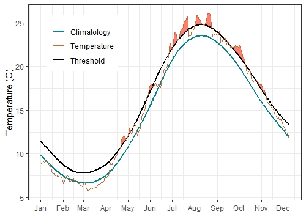

class: top, left

```{r setup, include=FALSE}

options(htmltools.dir.version = FALSE)
knitr::opts_chunk$set(echo = F,
                      warning = F,
                      message = F)
#Plotting and data libraries
library(tidyverse)
library(tidyr)
library(ecodata)
library(here)
library(kableExtra)
library(ggrepel)
library(patchwork)
library(grid)
library(ggiraph)
library(vegan)
library(rpart)
library(ks)
library(cowplot)

#GIS libraries
library(sf)
library(rgdal)
library(raster)
library(rnaturalearth)

data.dir <- here::here("data")
gis.dir <- here::here("data")

#General inline text input for report
#Council
council <- "Mid-Atlantic Fishery Management Council"
council_abbr <- "MAFMC"

#Region identifiers
epu <- "Mid-Atlantic Bight"
epu_abbr <- "MAB"
region <- "Mid-Atlantic"
region_abbr <- "MA" #Some commercial data organized by "MA" or "NE" regions, not by EPU 

#Time series constants
shade.alpha <- 0.3
shade.fill <- "lightgrey"
lwd <- 1
pcex <- 2
trend.alpha <- 0.5
trend.size <- 2
hline.size <- 1
hline.alpha <- 0.35
hline.lty <- "dashed"
label.size <- 5
hjust.label <- 1.5
letter_size <- 4
feeding.guilds1<- c("Piscivore","Planktivore","Benthivore","Benthos")
feeding.guilds <- c("Apex Predator","Piscivore","Planktivore","Benthivore","Benthos")
x.shade.min <- 2009
x.shade.max <- 2019
#Function for custom ggplot facet labels
label <- function(variable,value){
  return(facet_names[value])
}

#CRS
crs <- "+proj=longlat +lat_1=35 +lat_2=45 +lat_0=40 +lon_0=-77 +x_0=0 +y_0=0 +datum=NAD83 +no_defs +ellps=GRS80 +towgs84=0,0,0"

#Coastline shapefile
coast <- ne_countries(scale = 10,
                          continent = "North America",
                          returnclass = "sf") %>%
             sf::st_transform(crs = crs)

#State polygons
ne_states <- ne_states(country = "united states of america",
                                      returnclass = "sf") %>%
  sf::st_transform(crs = crs)

#high-res polygon of Maine
#new_england <- read_sf(gis.dir,"new_england")

#EPU shapefile
epu_sf <- ecodata::epu_sf %>% 
  filter(EPU %in% c("MAB","GB","GOM"))

#Map line parameters
map.lwd <- 0.4

# Set lat/lon window for maps
xmin = -77
xmax = -65
ymin = 36
ymax = 45
xlims <- c(xmin, xmax)
ylims <- c(ymin, ymax)

```

# Today's discussion: 
## Improving State of the Ecosystem (SOE) report utility for SSC decisions

.pull-left[

- Ecosystem synthesis approaches
    + General themes
    + Concrete worked example analysis

- Response memo review

- SSC discussion and feedback
    + Decisions where SOE report could help
    + Synthesis themes and management connections
    + Suggestions for 2021+
]

.pull-right[
*The IEA Loop<sup>1</sup>*

]

.footnote[
[1] https://www.integratedecosystemassessment.noaa.gov/national/IEA-approach
]

???

---
background-image: url("EDAB_images/Framework.png")
background-size: 540px
background-position: right

## Mid-Atlantic Council Ecosystem Approach
.pull-left-60[
2016 EAFM Policy Guidance document; revised 2019<sup>1</sup> 

2016 MAFMC EAFM framework<sup>2</sup>

2017 Inital EAFM risk assessment completed; revised and published 2018<sup>3</sup>

2018 Council selected summer flounder as high risk fishery

2019 EAFM conceptual model linking summer flounder drivers and risks

2020 Council starting EAFM MSE for summer flounder recreational discards

SOE indicators to be used for annual risk assessment updates

But can the SSC get more from the SOE and risk assessment?
]
.pull-right-40[
.footnote[
[1] http://www.mafmc.org/s/EAFM-Doc-Revised-2019-02-08.pdf  
[2] https://www.frontiersin.org/articles/10.3389/fmars.2016.00105/full  
[3] https://www.frontiersin.org/articles/10.3389/fmars.2018.00442/full
]
]

???
The Council’s EAFM framework has similarities to the IEA loop on slide 2. It uses risk assessment as a first step to prioritize combinations of managed species, fleets, and ecosystem interactions for consideration. Second, a conceptual model is developed identifying key environmental, ecological, social, economic, and management linkages for a high-priority fishery. Third, quantitative modeling addressing Council-specified questions and based on interactions identified in the conceptual model is applied to evaluate alternative management strategies that best balance management objectives. As strategies are implemented, outcomes are monitored and the process is adjusted, and/or another priority identified in risk assessment can be addressed. 

---
background-image: url("EDAB_images/nes-components-abstracted.png")
background-size: 700px
background-position: right bottom

## State of the Ecosystem (SOE) Reporting: Context for busy people

*"So what?" --John Boreman, September 2016*

1. Clear linkage of ecosystem indicators with management objectives

1. Synthesis across indicators for big picture

1. Objectives related to human-well being placed first in report

1. Short (< 30 pages), non-technical (but rigorous) text

1. Emphasis on reproducibility 


???
In 2016, we began taking steps to address these common critiques of the ESR model


---
## State of the Ecosystem: Structure
.pull-left[

### 2020 Report
1. Summary 2 pager
1. Human dimensions
1. Protected species
1. Fish and invertebrates (managed and otherwise)
1. Habitat quality and ecosystem productivity

### 2021 Possibilities
1. Summary 2 pager
    + Page 1 summary bullets
    + Page 2 synthesis themes
1. Provisioning and cultural services indicators
1. Supporting and regulating services indicators

]

.pull-right[

*Established ecosystem-scale objectives in the Mid-Atlantic*

```{r management-objectives}
mng_obj <- data.frame("Objective Categories" = c("Seafood Production",
                                                 "Profits","Recreation",
                                                 "Stability","Social & Cultural",
                                                 "Biomass","Productivity",
                                                 "Trophic structure","Habitat"),
"Indicators reported here" = c("Landings by feeding guild","Revenue decomposed to price and volume",
                               "Days fished; recreational catch",
                               "Diversity indices (fishery and species)",
                               "Commercial engagement trends",
                               "Biomass or abundance by feeding guild from surveys",
                               "Condition and recruitment of managed species, Primary productivity",
                               "Relative biomass of feeding guilds, Zooplankton",
                               "Estuarine and offshore habitat conditions"))

#knitr::kable(mng_obj, linesep = "",
mng_obj %>%
      #col.names = c("Objective Categories","Indicators reported here") %>%
      #caption = "Established ecosystem-scale objectives in the Mid-Atlantic Bight",
      #align = 'c',
      #booktabs = T) %>%
  #kable_styling(latex_options = "hold_position", "scale_down") %>%
 # column_spec(c(2), width = c("25em")) %>%
  kable(format = "html", escape = F, table.attr='class="risktable"',
        col.names = c("Objective Categories","Indicators reported here")) %>%
  kable_styling(font_size = 14) %>%
  row_spec(0, bold = TRUE)


```
]

---
## Memo 1-2: Summary 2 pager with visualizations

.pull-left[

]

.pull-right[

]


---
## Memo 5: Link zooplankton, fish condition

.pull-left[

]

.pull-right[

]

Conceptual model links indicators in the report with management objectives.

A subset of objectives are currently under investigation using GAMs. We plan to extend this work with structural equation modeling and or other methods in 2020. 


---
## Memo 28: Ecosystem Risk Score; how would the SSC use this? Add to EAFM Risk Assessment?

Options from the literature, or combine existing indicators?

.center[
```{r heatwave-mab, fig.width = 8, fig.asp = 0.35, fig.cap="Marine heatwave cumulative intensity (left) and maximum intensity (right) in the Mid-Atlantic Bight."}

cumu <- ecodata::heatwave %>% 
  filter(Var == "cumulative intensity") %>% 
  mutate(Var = dplyr::recode(Var, "cumulative intensity" = "Cumulative Intensity (°C x days)"))

maxin <- ecodata::heatwave %>% 
  dplyr::filter(Var == "maximum intensity") %>% 
  dplyr::group_by(Time, EPU, Var, Units) %>% 
  dplyr::summarise(Value = max(Value)) %>% 
  dplyr::ungroup() %>% 
  dplyr::mutate(Var = dplyr::recode(Var, "maximum intensity" = "Maximum Intensity (°C)"))

hw<- cumu %>%
  rbind(maxin) %>% 
  dplyr::group_by(Var, EPU) %>% 
  dplyr::mutate(hline = mean(Value))

mab.hw<- hw %>% filter(EPU == epu_abbr)
mab.hw %>% 
  ggplot() +
  geom_line(aes(x = Time, y = Value)) +
  geom_point(aes(x = Time, y = Value)) +
  geom_gls(aes(x = Time, y = Value, group = Var)) +
  ylab("") +
  xlab(element_blank())+
  ggtitle("Mid-Atlantic Marine Heatwave Intesity") +
  scale_x_continuous(expand = c(0.01, 0.01))+
  geom_hline(aes(yintercept = hline),
           size = hline.size,
           alpha = hline.alpha,
           linetype = hline.lty)+
  annotate("rect", fill = shade.fill, alpha = shade.alpha,
      xmin = x.shade.min , xmax = x.shade.max,
      ymin = -Inf, ymax = Inf) +
  facet_wrap(~Var, scales = "free")+
  theme_ts()+
  theme(strip.text=element_text(hjust=0,
                                face = "italic"))

```
]

.pull-left[

]

.pull-right[
```{r mab-heatwave-max, fig.cap="Maximum intensity heatwave anomaly in the Mid-Atlantic Bight occurring on July 22, 2019."}
#EPU shapefile
mab_epu_sf <- ecodata::epu_sf %>% 
  filter(EPU %in% c("MAB"))

#Map line parameters
map.lwd <- 0.4

# Set lat/lon window for maps
xmin = -81
xmax = -66
ymin = 35.5
ymax = 43
xlims <- c(xmin, xmax)
ylims <- c(ymin, ymax)
hw <- ecodata::heatwave_anom_gridded %>% 
  filter(EPU == "MAB")

mab_map <- 
  ggplot() +
  geom_tile(data =hw, aes(x = Longitude, y = Latitude,fill = Value)) +
  geom_sf(data = coast, size = map.lwd) +
  geom_sf(data = mab_epu_sf, fill = "transparent", size = map.lwd) +
  scale_fill_gradient2(name = "Temp.\nAnomaly (°C)",
                       low = scales::muted("blue"),
                       mid = "white",
                       high = scales::muted("red"),
                       limits = c(-5,7)) +
  coord_sf(crs = crs, xlim = xlims, ylim = ylims) +
  #facet_wrap(Season~.) +
  theme_map() +
  ggtitle("MAB heatwave anomaly (July 22, 2019)") +
  xlab("Longitude") +
  ylab("Latitude") +
  theme(panel.border = element_rect(colour = "black", fill=NA, size=0.75),
        legend.key = element_blank(),
        axis.title = element_text(size = 11),
        strip.background = element_blank(),
        strip.text=element_text(hjust=0),
        axis.text = element_text(size = 8), 
        axis.title.y = element_text(angle = 90),
        plot.margin=grid::unit(c(0,0,0,0), "mm"))

mab_map 

```
]

---
## Memo 29: Thresholds and Inflection Points; How would the SSC use these?

Individual indicators or using many indicators at once? Single indicator example:  
.center[
```{r gom-heatwave, eval= T, echo = F, fig.width = 8, fig.asp = .35, fig.cap="Marine heatwave cumulative intensity (left) and maximum intensity (right) in the Gulf of Maine ."}
cumu <- ecodata::heatwave %>% 
  filter(Var == "cumulative intensity") %>% 
  mutate(Var = recode(Var, "cumulative intensity" = "Cumulative Intensity (degree C x days)"))

maxin <- ecodata::heatwave %>% 
  filter(Var == "maximum intensity") %>% 
  group_by(Time, EPU, Var, Units) %>% 
  summarise(Value = max(Value)) %>% 
  ungroup() %>% 
  mutate(Var = recode(Var, "maximum intensity" = "Maximum Intensity (degree C)"))

hw<- cumu %>%
  rbind(maxin) %>% 
  group_by(Var, EPU) %>% 
  mutate(hline = mean(Value))

gom.hw<-hw %>% filter(EPU == "GOM") %>% 
  ggplot() +
  annotate("rect", fill = shade.fill, alpha = shade.alpha,
      xmin = x.shade.min , xmax = x.shade.max,
      ymin = -Inf, ymax = Inf) +
  geom_line(aes(x = Time, y = Value)) +
  geom_point(aes(x = Time, y = Value)) +
  geom_gls(aes(x = Time, y = Value)) +
  ylab("") +
  xlab(element_blank())+
  ggtitle("Gulf of Maine") +
  scale_x_continuous(expand = c(0.01, 0.01))+
  geom_hline(aes(yintercept = hline),
           size = hline.size,
           alpha = hline.alpha,
           linetype = hline.lty)+
  facet_wrap(~Var, scales = "free") +
  theme_ts()+
  theme(strip.text=element_text(hjust=0,
                                face = "italic"), 
        axis.title.y = element_text(angle = 90))

gom.hw

```
]

## Lots of academic work on this: what is a useful starting point?

.contrib[
Large, S. I., Fay, G., Friedland, K. D., and Link, J. S. 2013. Defining trends and thresholds in responses of ecological indicators to fishing and environmental pressures. ICES Journal of Marine Science, 70: 755–767.

Large, S. I., Fay, G., Friedland, K. D., and Link, J. S. 2015. Quantifying Patterns of Change in Marine Ecosystem Response to Multiple Pressures: e0119922. PLoS One, 10. http://search.proquest.com/docview/1664222461/abstract/120C1207C54548BEPQ/1 (Accessed 14 October 2016).

Samhouri, J. F., Andrews, K. S., Fay, G., Harvey, C. J., Hazen, E. L., Hennessey, S. M., Holsman, K., et al. 2017. Defining ecosystem thresholds for human activities and environmental pressures in the California Current. Ecosphere, 8: e01860.

Tam, J. C., Link, J. S., Large, S. I., Andrews, K., Friedland, K. D., Gove, J., Hazen, E., et al. 2017. Comparing Apples to Oranges: Common Trends and Thresholds in Anthropogenic and Environmental Pressures across Multiple Marine Ecosystems. Frontiers in Marine Science, 4. Frontiers. https://www.frontiersin.org/articles/10.3389/fmars.2017.00282/full (Accessed 9 March 2020).

]


---
## External Resources

* [SOE Technical Documentation](https://noaa-edab.github.io/tech-doc)

* [ecodata R package](https://github.com/noaa-edab/ecodata)

  * [Macrofauna indicators](http://noaa-edab.github.io/ecodata/macrofauna)
  * [Human Dimensions indicators](http://noaa-edab.github.io/ecodata/human_dimensions)
  * [Lower trophic level indicators](http://noaa-edab.github.io/ecodata/LTL)
  
* [ERDDAP server](https://comet.nefsc.noaa.gov/erddap/index.html)

* Slides available at https://noaa-edab.github.io/presentations/

---
class: inverse
background-image: url("EDAB_images/IMG_2809.jpg")
background-size: cover

## Questions? Discussion. Thank you!

&nbsp;

&nbsp;

&nbsp;

&nbsp;

&nbsp;

&nbsp;

&nbsp;

.pull-left[
Contacts:  
]
.pull-right[
<sarah.gaichas@noaa.gov>,  <geret.depiper@noaa.gov>
]
 
