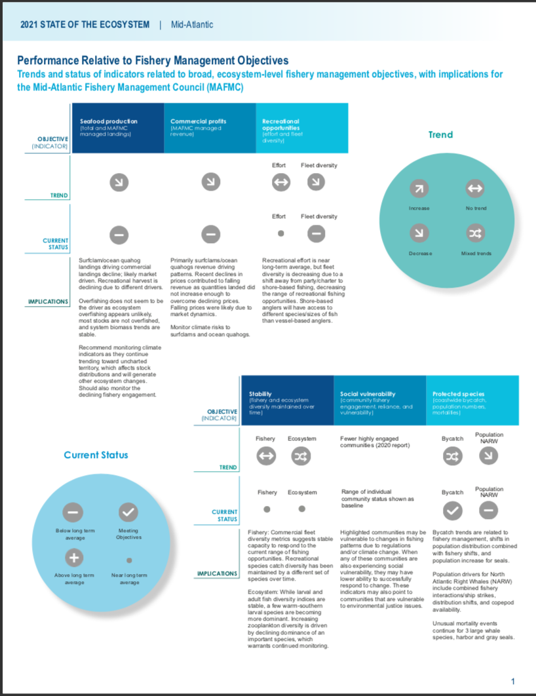
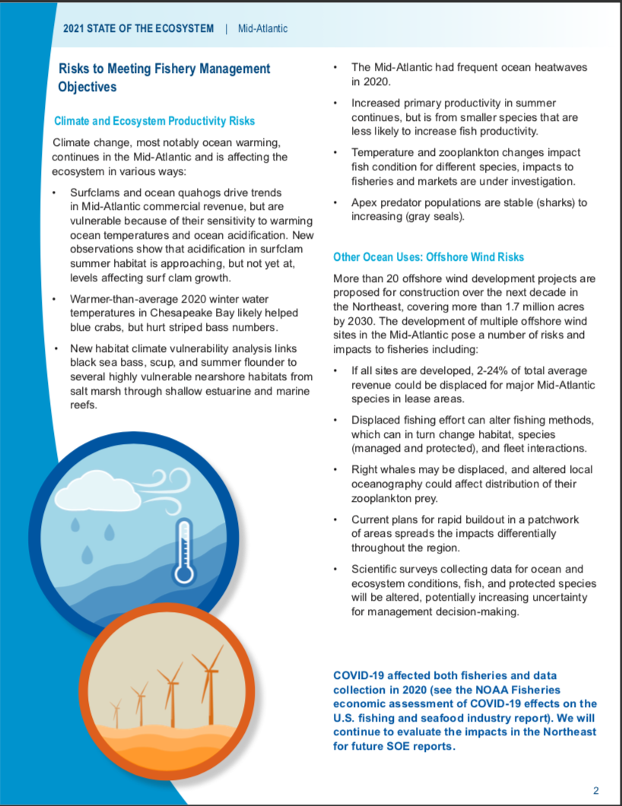

class: top, left

```{r setup, include=FALSE}

options(htmltools.dir.version = FALSE)
knitr::opts_chunk$set(echo = F,
                      fig.retina = 3,
                      warning = F,
                      message = F)
#Plotting and data libraries
library(tidyverse)
library(tidyr)
library(here)
library(kableExtra)
library(ecodata)
library(readxl); library(data.table)
library(DT)
library(widgetframe)


```

```{r, load_refs, include=FALSE, cache=FALSE}
library(RefManageR)
BibOptions(check.entries = FALSE,
           bib.style = "authoryear",
           cite.style = "authoryear",
           longnamesfirst = FALSE,
           max.names = 1,
           style = "markdown")
myBib <- ReadBib("./MidSOE.bib", check = FALSE)

#,
#           hyperlink = FALSE,
#           dashed = FALSE

```

```{r, code = readLines("https://raw.githubusercontent.com/NOAA-EDAB/ecodata/master/chunk-scripts/human_dimensions_MAB.Rmd-setup.R")}
```

```{r, code = readLines("https://raw.githubusercontent.com/NOAA-EDAB/ecodata/master/chunk-scripts/human_dimensions_MAB.Rmd-GIS-setup.R")}
```

```{r, code = readLines("https://raw.githubusercontent.com/NOAA-EDAB/ecodata/master/chunk-scripts/macrofauna_MAB.Rmd-setup.R")}
```

```{r, code = readLines("https://raw.githubusercontent.com/NOAA-EDAB/ecodata/master/chunk-scripts/LTL_MAB.Rmd-setup.R")}
```


# State of the Ecosystem (SOE) reporting
## Improving ecosystem information and synthesis for fishery managers

.pull-left[

- Ecosystem indicators linked to management objectives `r Cite(myBib, "depiper_operationalizing_2017")`
    + Contextual information
    + Report evolving since 2016
    + Fishery-relevant subset of full Ecosystem Status Reprorts

- Open science emphasis `r Cite(myBib, "bastille_improving_2020")`

- Used within Mid-Atlantic Fishery Management Council's Ecosystem Process `r Cite(myBib, "muffley_there_2020")`
 
]

.pull-right[
*The IEA Loop<sup>1</sup>*


.footnote[
[1] https://www.integratedecosystemassessment.noaa.gov/national/IEA-approach
]
]
???

---
## State of the Ecosystem: Updated structure
.pull-left[

## 2020 Report
1. Summary 2 pager
1. Human dimensions
1. Protected species
1. Fish and invertebrates (managed and otherwise)
1. Habitat quality and ecosystem productivity

## 2021 Report
1. Graphical summary
    + Page 1 objectives summary table &rarr;
    + Page 2 risk summary bullets
    + Page 3 synthesis themes
1. Performance relative to management objectives &rarr;
1. Risks to meeting management objectives

]

.pull-right[

```{r management-objectives}
mng_obj <- data.frame("Objective Categories" = c("Seafood Production",
                                                 "Profits","Recreation",
                                                 "Stability","Social & Cultural",
                                                 "Protected Species",
                                                 "Biomass","Productivity",
                                                 "Trophic structure","Habitat"),
"Indicators reported here" = c("Landings; commercial total and by feeding guild; recreational harvest",
                               "Revenue decomposed to price and volume",
                               "Days fished; recreational fleet diversity",
                               "Diversity indices (fishery and ecosystem)",
                               "Community engagement/reliance status",
                               "Bycatch; population (adult and juvenile) numbers, mortalities",
                               "Biomass or abundance by feeding guild from surveys",
                               "Condition and recruitment of managed species, Primary productivity",
                               "Relative biomass of feeding guilds, Zooplankton",
                               "Estuarine and offshore habitat conditions"))

knitr::kable(mng_obj, linesep = "",
      col.names = c("Objective Categories","Indicators reported here"),
      caption = "Ecosystem-scale fishery management objectives",
      #align = 'c',
      booktabs = T) %>%
  kable_styling(font_size = 14) %>%
 # kable_styling(latex_options = "hold_position", "scale_down") %>%
 # column_spec(c(2), width = c("25em")) %>%
  row_spec(0, bold = TRUE) %>%
 # group_rows("Provisioning/Cultural", 1,4) %>%
 # group_rows("Supporting/Regulating", 5,9)
  pack_rows("Provisioning and Cultural Services", 1,6) %>%
  pack_rows("Supporting and Regulating Services", 7,10)


```
]

---
## 2021 Request tracking memo

```{r, results='hide'}
resultfile <- googledrive::drive_find(pattern = "SOE_Request_Checklist", type = "spreadsheet")

requests <- googledrive::drive_download(resultfile, type = "csv", overwrite = TRUE) %>%
  {read.csv(.$local_path)} 

```

```{r memo}

# requests <- googledrive::drive_download(resultfile, type = "csv", overwrite = TRUE) %>%
#   {read.csv(.$local_path)} 

requeststab <- requests %>%
  dplyr::select(Request, Year, Source, Progress) %>%
  dplyr::mutate("Memo Section" = rownames(.))

knitr::kable(requeststab, longtable = T, booktabs = TRUE, linesep = "") %>%
  kable_styling(font_size=9#, latex_options = c("hold_position", "striped", "repeat_header")
                ) %>%
  row_spec(0,bold=TRUE) %>%
  column_spec(1, width="8cm") %>%
  column_spec(2, width="1cm") %>%
  column_spec(3, width="2cm") %>%
  column_spec(4, width="10cm") %>%
  column_spec(5, width="2cm")

```


---
## Memo 1: 2 page graphical summary

.pull-left[
.center[

]
]

.pull-right[
.center[

]
]

---
## Memo 1: Graphical summary of ecosystem synthesis themes

Characterizing ecosystem change for fishery management

* Societal, biological, physical and chemical factors comprise the **multiple system drivers** that influence marine ecosystems through a variety of different pathways. 
* Changes in the multiple drivers can lead to **regime shifts** — large, abrupt and persistent changes in the structure and function of an ecosystem.  
* Regime shifts and changes in how the multiple system drivers interact can result in **ecosystem reorganization** as species and humans respond and adapt to the new environment.

.pull-left[


]

.pull-right[

]

---
## Revised structure to address Council requests and improve synthesis 

.pull-left[
* Performance relative to management objectives
    - *What* does the indicator say--up, down, stable?
    - *Why* do we think it is changing: integrates synthesis themes
        - Multiple drivers
        - Regime shifts
        - Ecosystem reorganization
* Objectives
    - Seafood production
    - Profits
    - Recreational opportunities
    - Stability
    - Social and cultural
    - Protected species
]

.pull-right[
* Risks to meeting fishery management objectives
    - *What* does the indicator say--up, down, stable?
    - *Why* this is important to managers: integrates synthesis themes
        - Multiple drivers
        - Regime shifts
        - Ecosystem reorganization
* Risk categories
    - Climate: warming, ocean currents, acidification
        - Habitat changes (incl. vulnerability analysis)
        - Productivity changes (system and fish)
        - Species interaction changes
        - Community structure changes
    - Other ocean uses
        - Offshore wind development
]

---
# Performance relative to management objectives


---
## Objective: Seafood production 

.pull-left[
Indicators: Commercial and recreational landings 
Trends: Decreasing  

```{r, code = readLines("https://raw.githubusercontent.com/NOAA-EDAB/ecodata/master/chunk-scripts/human_dimensions_MAB.Rmd-comdat-total-landings.R"), fig.height=3}
```
.contrib[
Black line = total landings and red line = total landings from council-managed species
]

```{r, code = readLines("https://raw.githubusercontent.com/NOAA-EDAB/ecodata/master/chunk-scripts/human_dimensions_MAB.Rmd-recdat-landings.R"), fig.height=3}
```


.pull-right[
Multiple drivers: combinations of ecosystem and stock production, management actions, market conditions, and environmental change

```{r, code = readLines("https://raw.githubusercontent.com/NOAA-EDAB/ecodata/master/chunk-scripts/human_dimensions_MAB.Rmd-stock-status.R"), fig.height=3 }
```


]

---
## Multiple drivers of fish production analysis in progress: environment - fish condition - market price linkages

   

* Identify multiple and changing drivers of condition and market prices over time
* Recognize regime shifts and potential system reorganization

* Work in progress has identified the following potential drivers
    - *Temperature?*
    - *Zooplankton...? Laurel and team to specify*

---
## Example: Profits objective
.pull-left[
Indicator: Total Revenue   
Mid-Atlantic  
```{r, code = readLines("https://raw.githubusercontent.com/NOAA-EDAB/ecodata/master/chunk-scripts/human_dimensions_MAB.Rmd-comdat-comm-revenue.R"), fig.height=3}
```
New England
```{r, code = readLines("https://raw.githubusercontent.com/NOAA-EDAB/ecodata/master/chunk-scripts/human_dimensions_NE.Rmd-setup.R")}
```

```{r, code = readLines("https://raw.githubusercontent.com/NOAA-EDAB/ecodata/master/chunk-scripts/human_dimensions_NE.Rmd-comdat-comm-revenue.R"), fig.height=3}
```

]

.pull-right[
Why: multiple drivers: price and volume  
Mid-Atlantic
```{r, code = readLines("https://raw.githubusercontent.com/NOAA-EDAB/ecodata/master/chunk-scripts/human_dimensions_MAB.Rmd-setup.R")}
```

```{r, code = readLines("https://raw.githubusercontent.com/NOAA-EDAB/ecodata/master/chunk-scripts/human_dimensions_MAB.Rmd-bennet.R"), fig.height=3}
```

New England 
```{r, code = readLines("https://raw.githubusercontent.com/NOAA-EDAB/ecodata/master/chunk-scripts/human_dimensions_NE.Rmd-setup.R")}
```

```{r, code = readLines("https://raw.githubusercontent.com/NOAA-EDAB/ecodata/master/chunk-scripts/human_dimensions_NE.Rmd-GIS-setup.R")}
```

```{r, code = readLines("https://raw.githubusercontent.com/NOAA-EDAB/ecodata/master/chunk-scripts/human_dimensions_NE.Rmd-bennet.R"), fig.height=3, echo = FALSE, message=FALSE, results='hide'}
```


]

---
## Example: Recreational opportunities objective
.pull-left[
Indicator: Recreational Landings   
Mid-Atlantic  
```{r, code = readLines("https://raw.githubusercontent.com/NOAA-EDAB/ecodata/master/chunk-scripts/human_dimensions_MAB.Rmd-setup.R")}
```

```{r, code = readLines("https://raw.githubusercontent.com/NOAA-EDAB/ecodata/master/chunk-scripts/human_dimensions_MAB.Rmd-recdat-landings.R"), fig.height=3}
```
New England
```{r, code = readLines("https://raw.githubusercontent.com/NOAA-EDAB/ecodata/master/chunk-scripts/human_dimensions_NE.Rmd-setup.R")}
```

```{r, code = readLines("https://raw.githubusercontent.com/NOAA-EDAB/ecodata/master/chunk-scripts/human_dimensions_NE.Rmd-recdat-landings.R"), fig.height=3}
```

]

.pull-right[
Why: multiple drivers: Diversity
Mid-Atlantic  

```{r, code = readLines("https://raw.githubusercontent.com/NOAA-EDAB/ecodata/master/chunk-scripts/human_dimensions_MAB.Rmd-setup.R")}
```

```{r, code = readLines("https://raw.githubusercontent.com/NOAA-EDAB/ecodata/master/chunk-scripts/human_dimensions_MAB.Rmd-recdat-diversity.R"), fig.height=6}
```
]

---
## Example: Stability objective
.pull-left[
Indicator: Diversity in fishery/species   
Fishery (Mid-Atlantic) 
```{r, code = readLines("https://raw.githubusercontent.com/NOAA-EDAB/ecodata/master/chunk-scripts/human_dimensions_MAB.Rmd-setup.R")}
```

```{r, code = readLines("https://raw.githubusercontent.com/NOAA-EDAB/ecodata/master/chunk-scripts/human_dimensions_MAB.Rmd-commercial-div.R"), fig.height=4}
```

```{r, code = readLines("https://raw.githubusercontent.com/NOAA-EDAB/ecodata/master/chunk-scripts/human_dimensions_MAB.Rmd-commercial-div-species-div.R"), fig.height=2}
```
]

.pull-right[
Indicator: Zooplankton/Ichthyoplankton diversities
<br />
```{r, code = readLines("https://raw.githubusercontent.com/NOAA-EDAB/ecodata/master/chunk-scripts/LTL_MAB.Rmd-zoo-diversity.R"), fig.height=3}
```

```{r, code = readLines("https://raw.githubusercontent.com/NOAA-EDAB/ecodata/master/chunk-scripts/macrofauna_MAB.Rmd-ichthyo-diversity.R"), fig.height=3}
```

]

---
## Example: Stability objective
Why? Multiple drivers
- Consolidation of fleets?
- Changing species interactions?
- Links to risk section

---
## Example: Social and cultural objectives
.pull-left[
Indicator: Recreational Vulnerability
```{r, code = readLines("https://raw.githubusercontent.com/NOAA-EDAB/ecodata/master/chunk-scripts/human_dimensions_MAB.Rmd-setup.R")}
```

```{r, code = readLines("https://raw.githubusercontent.com/NOAA-EDAB/ecodata/master/chunk-scripts/human_dimensions_MAB.Rmd-recreational-engagement.R"), fig.height=6}
```
Mid-Atlantic communities
]

.pull-right[
Indicator: Commercial Vulnerability
<br />
```{r, code = readLines("https://raw.githubusercontent.com/NOAA-EDAB/ecodata/master/chunk-scripts/human_dimensions_MAB.Rmd-setup.R")}
```

```{r, code = readLines("https://raw.githubusercontent.com/NOAA-EDAB/ecodata/master/chunk-scripts/human_dimensions_MAB.Rmd-commercial-engagement.R"), fig.height=6}
```

]

---
## Example: Social and cultural objectives
Why?
...

---
## Example: Protected species objectives--add the "Why" linking to other SOE indicators
.pull-left[
Indicators: Species By-catch
```{r, code = readLines("https://raw.githubusercontent.com/NOAA-EDAB/ecodata/master/chunk-scripts/macrofauna_MAB.Rmd-harborporpoise.R"), fig.height=3}
```

```{r, code = readLines("https://raw.githubusercontent.com/NOAA-EDAB/ecodata/master/chunk-scripts/macrofauna_MAB.Rmd-grayseal.R"), fig.height=3}
```
]

.pull-right[
Indicators: Endangered Species Populations
```{r, code = readLines("https://raw.githubusercontent.com/NOAA-EDAB/ecodata/master/chunk-scripts/macrofauna_MAB.Rmd-narw-abundance.R"), fig.height=3}
```

```{r, code = readLines("https://raw.githubusercontent.com/NOAA-EDAB/ecodata/master/chunk-scripts/macrofauna_MAB.Rmd-NARW-calf-abundance.R"), fig.height=3}
```
]

---
## Example: Climate risks: multiple potential impacts on management
.pull-left[
Indicators: Gulf Stream index, bottom and surface temperature, heat waves  
Trends:
```{r, code = readLines("https://raw.githubusercontent.com/NOAA-EDAB/ecodata/master/chunk-scripts/LTL_MAB.Rmd-setup.R")}
```


```{r, code = readLines("https://raw.githubusercontent.com/NOAA-EDAB/ecodata/master/chunk-scripts/LTL_MAB.Rmd-gsi.R"), fig.height=3, out.width='60%'}
```

```{r, code =readLines("https://raw.githubusercontent.com/NOAA-EDAB/ecodata/master/chunk-scripts/LTL_MAB.Rmd-bottom-temp.R"), fig.height=3, out.width='60%'}

```

```{r, code = readLines("https://raw.githubusercontent.com/NOAA-EDAB/ecodata/master/chunk-scripts/LTL_MAB.Rmd-heatwave.R"), fig.height=3, out.width='70%'}
```
]

.pull-right[

Why this matters: 
Habitat change from multiple drivers alters:
- species distributions--allocation
- system productivity--fishery resource productivity
```{r, code = readLines("https://raw.githubusercontent.com/NOAA-EDAB/ecodata/master/chunk-scripts/macrofauna_MAB.Rmd-nefsc-survey-disaggregated-mafmc-spp-in-ne.R"), fig.height=6}
```

]

---
## Example: Climate risks to species distribution--allocation issues
.pull-left[
* Changing species distributions
```{r, code = readLines("https://raw.githubusercontent.com/NOAA-EDAB/ecodata/master/chunk-scripts/macrofauna_MAB.Rmd-species-dist.R"), fig.height=6}
```

]

.pull-right[
* Habitat conditions, habitat vulnerability
```{r midHabTable1, message=FALSE}
#Read in Mid-Atlantic table

src <- "https://github.com/NOAA-EDAB/ecodata/raw/master/data-raw/habitat_vulnerability.xlsx"
lcl <- basename(src)
download.file(url = src, destfile = lcl, quiet=TRUE)

mid <- as.data.table(readxl::read_xlsx(here('habitat_vulnerability.xlsx'), 
                         sheet = 'Mid-Atlantic', skip = 1))

if (file.exists(lcl)) {
  #Delete file if it exists
  invisible(file.remove(lcl))
}

#Identify individual species climate vulnerability
vhigh.vul <- unique(mid[`Species Vulnerability Rank (FCVA)` == 'Very high', Species])
high.vul  <- unique(mid[`Species Vulnerability Rank (FCVA)` == 'High', Species])
mod.vul   <- unique(mid[`Species Vulnerability Rank (FCVA)` == 'Moderate', Species])
low.vul   <- unique(mid[`Species Vulnerability Rank (FCVA)` == 'Low', Species])

#Grab habitat vulnerability 
hab.vul <- unique(mid[, c('Habitat Name', 'Habitat Vulnerability Rank (HVCA)')])
habitats <- hab.vul[, 'Habitat Name']
hab.vul <- data.table('Habitat Vulnerability' = c(NA, NA, t(hab.vul[, 'Habitat Vulnerability Rank (HVCA)'])))

#Rearrange table
mid <- data.table::melt.data.table(mid, id.vars = c('Habitat Name', 'Species'),
                                   measure.vars = c('Eggs/Larva', 'Juvenile/YOY',
                                                    'Adult', 'Spawning Adult'),
                                   variable.name = 'Stage', value.name = 'Dependence')
mid[, Habitat := as.factor(mid$'Habitat Name')]
mid <- data.table::dcast.data.table(mid, Species + Stage ~ Habitat,
                                    value.var = 'Dependence')
setcolorder(mid, c('Species', 'Stage', habitats$'Habitat Name'))

#Add Habitat Vulnerbaility
#hab.table <- rbindlist(list(as.data.table(t(hab.vul)), mid), use.names = F)
hab.table <- mid
#Add names back in
names(hab.table) <- names(mid)
hab.table <- hab.table %>% mutate_if(is.character, str_trim)

#from examples here https://rstudio.github.io/DT/010-style.html

#color coding cells works
#need to add column with species vulnerability and color code species by it but not show it, like #hideV6 example at link
#if we show it we can sort by species vulnerability though... alphabetical doesnt work so use numbers to go lowest-highest
#still need to color code headers
hab.table <- hab.table %>%
  mutate(spVul = #Color code species based on climate vul
    # case_when(Species %in% low.vul ~ "low.vul",
    #           Species %in% mod.vul ~ "mod.vul",
    #           Species %in% high.vul ~ "high.vul",
    #           Species %in% vhigh.vul ~ "vhigh.vul")
    # )
    case_when(Species %in% low.vul ~ 1,
              Species %in% mod.vul ~ 2,
              Species %in% high.vul ~ 3,
              Species %in% vhigh.vul ~ 4)
    )

colnames(hab.table)[c(3:4)] <- paste0('<span style="box-shadow: -10px 0 0 red, 10px 0 0 red; background-color:red; color:white">',colnames(hab.table)[c(3:4)],'</span>')
colnames(hab.table)[c(5:10)] <- paste0('<span style="box-shadow: -10px 0 0 orange, 10px 0 0 orange; background-color:',c("orange"),'">',colnames(hab.table)[c(5:10)],'</span>')
colnames(hab.table)[c(11:15)] <- paste0('<span style="box-shadow: -10px 0 0 yellow, 10px 0 0 yellow; background-color:',c("yellow"),'">',colnames(hab.table)[c(11:15)],'</span>')

dt <- datatable(hab.table, rownames = FALSE, escape = FALSE,
          extensions = c('Scroller', 'FixedColumns'), #add scrolling and fixed column
          options = list(deferRender = TRUE,
          scrollY = 300, scroller = TRUE,
          dom = 't',scrollX = TRUE,fixedColumns = TRUE)
          #, options = list(columnDefs = list(list(targets = 16, visible = FALSE)))
  ) %>% 
  formatStyle(
    names(hab.table)[3:4],
    backgroundColor = '#FF000080'
  ) %>%
  formatStyle(
    names(hab.table)[5:10],
    backgroundColor = '#FFA50080'
  ) %>%
  formatStyle(
    names(hab.table)[11:15],
    backgroundColor = '#FFFF0080'
  ) %>%

  formatStyle(#Color code base on dependence
    'Species', "spVul",
    backgroundColor = styleEqual(#c("low.vul", "mod.vul", "high.vul", "vhigh.vul"),
                                 c(1,2,3,4),
                                 c('lightgreen', 'yellow', 'orange', 'red')), #Color code base on dependence)
    color = styleEqual(c(1,2,3,4),
                                 c('black', 'black', 'black', 'white'))
    ) %>%
    formatStyle(
    names(hab.table),
    backgroundColor = styleEqual(c("Low", "Moderate", "High", "Very high"), 
                                 c('lightgreen', 'yellow', 'orange', 'red')), 
    color = styleEqual(c("Low", "Moderate", "High", "Very high"), 
                                 c('black', 'black', 'black', 'white'))
  )

frameWidget(dt)
```

]

---
## Example: Climate risks to species production--fishery yields
.pull-left[
* OA impact on shellfish growth
    - Areas of low pH identified in surfclam and scallop habitat
    - Lab work in progress identified pH thresholds for surfclam growth: *approaching threshold* 

.contrib[
* Ecosystem productivity link to fishery productivity
    - Condition links work in progress
    - [Forage energy density](https://noaa-edab.github.io/ecodata/macrofauna_MAB#forage-fish-energy-content)
    - Other examples?
    
* Diversity changes (tropicalizaton? affects species available for fishing, FMPs)
    - Recreational catch diversity in Mid supported by "southern" species
    
* Predation increasing? sharks, seals
    - [Shark bycatch stable](https://noaa-edab.github.io/ecodata/macrofauna_MAB#Observed_Shark_Numbers)
    - Seal population increasing, diet work in progress
]
]

.pull-right[


]


---
## Example: Other ocean uses (Wind): area covered, fisheries impacted
.pull-left[

]

.pull-right[
```{r, code = readLines("https://raw.githubusercontent.com/NOAA-EDAB/ecodata/master/chunk-scripts/human_dimensions_MAB.Rmd-wind-dev-speed0.30.R"), fig.height=3}
```

```{r, code = readLines("https://raw.githubusercontent.com/NOAA-EDAB/ecodata/master/chunk-scripts/human_dimensions_MAB.Rmd-wind-revenue.R"), fig.height=3}
```

]

---
## Future: Better integration of habitats with managed species for managers

* Mid-Atlantic Council very interested in estuarine conditions and habitat supporting managed stocks
* Chesapeake Bay has excellent indicators and synthesis
* Prioritize next steps for identifying high risk combinations: Key species, habitats, and drivers
* 2021 SOE introduces Habitat Climate Vulerability Assessment results linked to species

```{r midHabTable, message=FALSE}
#Read in Mid-Atlantic table

src <- "https://github.com/NOAA-EDAB/ecodata/raw/master/data-raw/habitat_vulnerability.xlsx"
lcl <- basename(src)
download.file(url = src, destfile = lcl, quiet=TRUE)

mid <- as.data.table(readxl::read_xlsx(here('habitat_vulnerability.xlsx'),
                         sheet = 'Mid-Atlantic', skip = 1))

if (file.exists(lcl)) {
  #Delete file if it exists
  invisible(file.remove(lcl))
}

#Identify individual species climate vulnerability
vhigh.vul <- unique(mid[`Species Vulnerability Rank (FCVA)` == 'Very high', Species])
high.vul  <- unique(mid[`Species Vulnerability Rank (FCVA)` == 'High', Species])
mod.vul   <- unique(mid[`Species Vulnerability Rank (FCVA)` == 'Moderate', Species])
low.vul   <- unique(mid[`Species Vulnerability Rank (FCVA)` == 'Low', Species])

#Grab habitat vulnerability 
hab.vul <- unique(mid[, c('Habitat Name', 'Habitat Vulnerability Rank (HVCA)')])
habitats <- hab.vul[, 'Habitat Name']
hab.vul <- data.table('Habitat Vulnerability' = c(NA, NA, t(hab.vul[, 'Habitat Vulnerability Rank (HVCA)'])))

#Rearrange table
mid <- data.table::melt.data.table(mid, id.vars = c('Habitat Name', 'Species'),
                                   measure.vars = c('Eggs/Larva', 'Juvenile/YOY',
                                                    'Adult', 'Spawning Adult'),
                                   variable.name = 'Stage', value.name = 'Dependence')
mid[, Habitat := as.factor(mid$'Habitat Name')]
mid <- data.table::dcast.data.table(mid, Species + Stage ~ Habitat,
                                    value.var = 'Dependence')
setcolorder(mid, c('Species', 'Stage', habitats$'Habitat Name'))

#Add Habitat Vulnerbaility
#hab.table <- rbindlist(list(as.data.table(t(hab.vul)), mid), use.names = F)
hab.table <- mid
#Add names back in
names(hab.table) <- names(mid)
hab.table <- hab.table %>% mutate_if(is.character, str_trim)

#from examples here https://rstudio.github.io/DT/010-style.html

#color coding cells works
#need to add column with species vulnerability and color code species by it but not show it, like #hideV6 example at link
#if we show it we can sort by species vulnerability though... alphabetical doesnt work so use numbers to go lowest-highest
#still need to color code headers
hab.table <- hab.table %>%
  mutate(spVul = #Color code species based on climate vul
    # case_when(Species %in% low.vul ~ "low.vul",
    #           Species %in% mod.vul ~ "mod.vul",
    #           Species %in% high.vul ~ "high.vul",
    #           Species %in% vhigh.vul ~ "vhigh.vul")
    # )
    case_when(Species %in% low.vul ~ 1,
              Species %in% mod.vul ~ 2,
              Species %in% high.vul ~ 3,
              Species %in% vhigh.vul ~ 4)
    )

colnames(hab.table)[c(3:4)] <- paste0('<span style="box-shadow: -10px 0 0 red, 10px 0 0 red; background-color:red; color:white">',colnames(hab.table)[c(3:4)],'</span>')
colnames(hab.table)[c(5:10)] <- paste0('<span style="box-shadow: -10px 0 0 orange, 10px 0 0 orange; background-color:',c("orange"),'">',colnames(hab.table)[c(5:10)],'</span>')
colnames(hab.table)[c(11:15)] <- paste0('<span style="box-shadow: -10px 0 0 yellow, 10px 0 0 yellow; background-color:',c("yellow"),'">',colnames(hab.table)[c(11:15)],'</span>')

dt <- datatable(hab.table, rownames = FALSE, escape = FALSE,
          extensions = c('Scroller', 'FixedColumns'), #add scrolling and fixed column
          options = list(deferRender = TRUE,
          scrollY = 300, scroller = TRUE,
          dom = 't',scrollX = TRUE,fixedColumns = TRUE)
          #, options = list(columnDefs = list(list(targets = 16, visible = FALSE)))
  ) %>% 
  formatStyle(
    names(hab.table)[3:4],
    backgroundColor = '#FF000080'
  ) %>%
  formatStyle(
    names(hab.table)[5:10],
    backgroundColor = '#FFA50080'
  ) %>%
  formatStyle(
    names(hab.table)[11:15],
    backgroundColor = '#FFFF0080'
  ) %>%

  formatStyle(#Color code base on dependence
    'Species', "spVul",
    backgroundColor = styleEqual(#c("low.vul", "mod.vul", "high.vul", "vhigh.vul"),
                                 c(1,2,3,4),
                                 c('lightgreen', 'yellow', 'orange', 'red')), #Color code base on dependence)
    color = styleEqual(c(1,2,3,4),
                                 c('black', 'black', 'black', 'white'))
    ) %>%
    formatStyle(
    names(hab.table),
    backgroundColor = styleEqual(c("Low", "Moderate", "High", "Very high"), 
                                 c('lightgreen', 'yellow', 'orange', 'red')), 
    color = styleEqual(c("Low", "Moderate", "High", "Very high"), 
                                 c('black', 'black', 'black', 'white'))
  )

frameWidget(dt)
```

---
# Our charge this week

1. Finalize structure and outline
1. Are current examples correct?
1. Fill in the "why" emphasizing synthesis themes: multiple drivers, regime shifts, system reorganization
   - In each topical break out meeting
   - Together at the synthesis break out Thursday
   - *Where does your indicator fit in? Multiple places* 
1. Develop main messages for front page
1. Finalize main messages Friday plenary

# Thank you!

---
## References

.contrib[
```{r refs, echo=FALSE, results="asis"}
PrintBibliography(myBib)
```
]


## Additional resources
.pull-left[
* [ecodata R package](https://github.com/noaa-edab/ecodata)

* Visualizations:
  * [Mid-Atlantic Human Dimensions indicators](http://noaa-edab.github.io/ecodata/human_dimensions_MAB)
  * [Mid-Atlantic Macrofauna indicators](http://noaa-edab.github.io/ecodata/macrofauna_MAB)
  * [Mid-Atlantic Lower trophic level indicators](https://noaa-edab.github.io/ecodata/LTL_MAB)
  * [New England Human Dimensions indicators](http://noaa-edab.github.io/ecodata/human_dimensions_NE)
  * [New England Macrofauna indicators](http://noaa-edab.github.io/ecodata/macrofauna_NE)
  * [New England Lower trophic level indicators](https://noaa-edab.github.io/ecodata/LTL_NE)
]
.pull-right[
* [SOE Technical Documentation](https://noaa-edab.github.io/tech-doc)

* [State of the Ecosystem Reports](https://www.fisheries.noaa.gov/new-england-mid-atlantic/ecosystems/state-ecosystem-reports-northeast-us-shelf)

* [Draft indicator catalogue](https://noaa-edab.github.io/catalog/)

.contrib[

* Slides available at https://noaa-edab.github.io/presentations
* Contact: <Sarah.Gaichas@noaa.gov>
]
]

