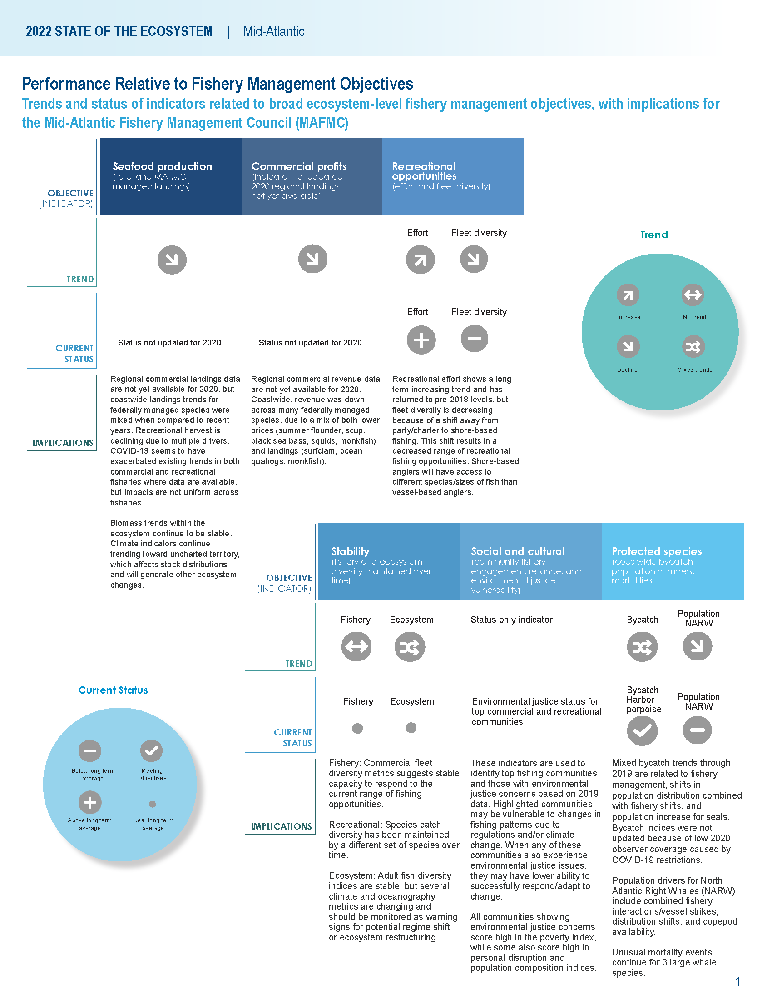
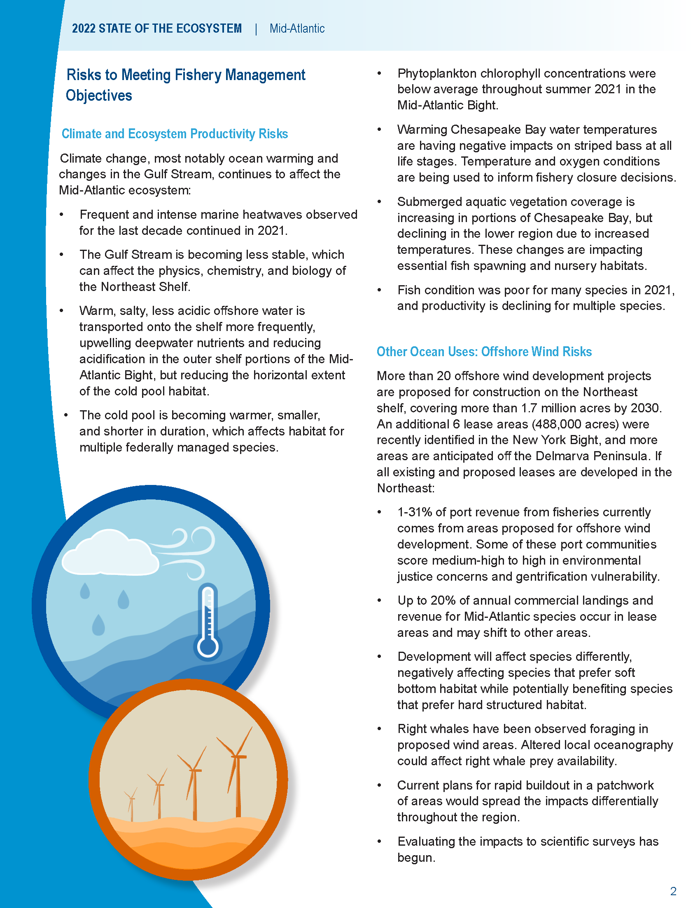
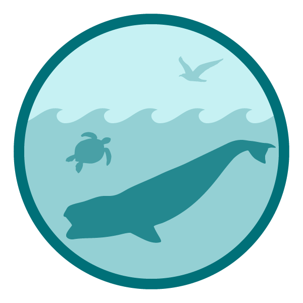
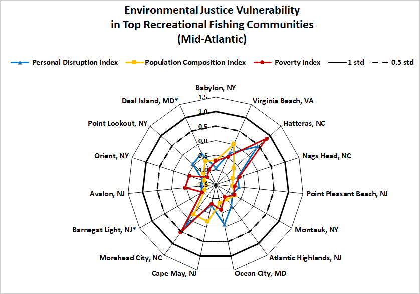
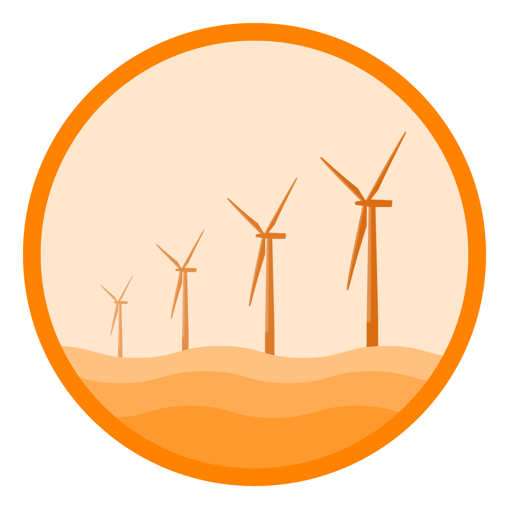
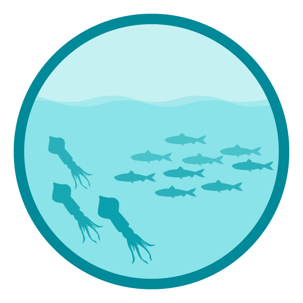
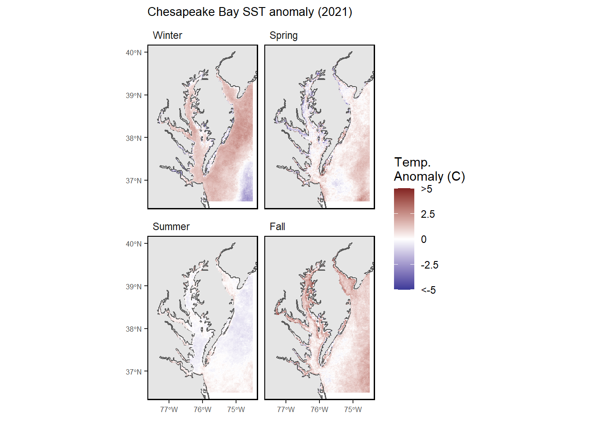
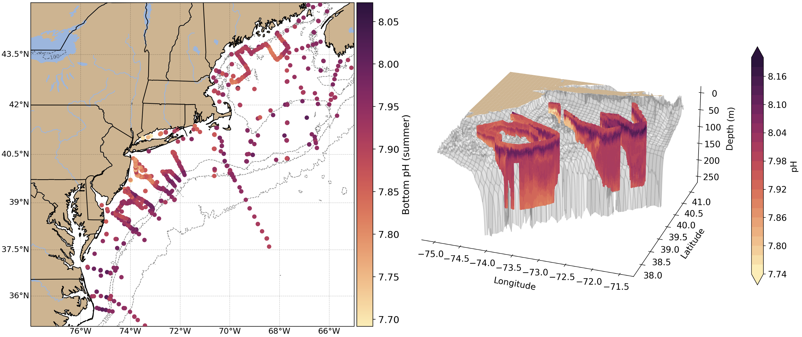

class: top, left

<style>
p.caption {
  font-size: 0.6em;
}
</style>

<style>
.reduced_opacity {
  opacity: 0.5;
}
</style>

```{r setup, include=FALSE}

options(htmltools.dir.version = FALSE)
knitr::opts_knit$set(unnamed.chunk.label = "20220316-MAFMCSSC")
knitr::opts_chunk$set(echo = F,
                      fig.retina = 3,
                      #fig.width = 4,
                      #fig.height = 2,
                      fig.asp = 0.45,
                      warning = F,
                      message = F,
                      fig.path = "20220316-MAFMCSSC/")
#Plotting and data libraries
library(tidyverse)
library(tidyr)
library(here)
library(kableExtra)
library(ecodata)
library(readxl); library(data.table)
library(DT)
library(widgetframe)

# if figure output defaults to docs/imaages/ replace with this before moving to 
# presentations/docs in both the html output (search and replace)
# and folder name
# 20220316_MAFMCSSC_Gaichas_files/figure-html/

```

```{r, load_refs, include=FALSE, cache=FALSE}
library(RefManageR)
BibOptions(check.entries = FALSE,
           bib.style = "authoryear",
           cite.style = "authoryear",
           longnamesfirst = FALSE,
           max.names = 1,
           style = "markdown")
myBib <- ReadBib("./MidSOE.bib", check = FALSE)

#,
#           hyperlink = FALSE,
#           dashed = FALSE

```

```{r, code = readLines("https://raw.githubusercontent.com/NOAA-EDAB/ecodata/master/chunk-scripts/human_dimensions_MAB.Rmd-setup.R")}
```

```{r, code = readLines("https://raw.githubusercontent.com/NOAA-EDAB/ecodata/master/chunk-scripts/human_dimensions_MAB.Rmd-GIS-setup.R")}
```

```{r, code = readLines("https://raw.githubusercontent.com/NOAA-EDAB/ecodata/master/chunk-scripts/macrofauna_MAB.Rmd-setup.R")}
```

```{r, code = readLines("https://raw.githubusercontent.com/NOAA-EDAB/ecodata/master/chunk-scripts/LTL_MAB.Rmd-setup.R")}
```


# State of the Ecosystem (SOE) reporting
## Improving ecosystem information and synthesis for fishery managers

.pull-left[

- Ecosystem indicators linked to management objectives `r Cite(myBib, "depiper_operationalizing_2017")`
    + Contextual information
    + Report evolving since 2016
    + Fishery-relevant subset of full Ecosystem Status Reports

- Open science emphasis `r Cite(myBib, "bastille_improving_2020")`

- Used within Mid-Atlantic Fishery Management Council's Ecosystem Process `r Cite(myBib, "muffley_there_2020")`
 
]

.pull-right[
*The IEA Loop<sup>1</sup>*


.footnote[
[1] https://www.integratedecosystemassessment.noaa.gov/national/IEA-approach
]
]
???

---
## State of the Ecosystem: Maintain 2021 structure for 2022
.pull-left[


## 2022 Report
1. Graphical summary
    + Page 1 report card re: objectives &rarr;
    + Page 2 risk summary bullets
    + Page 3 synthesis themes
1. Performance relative to management objectives
1. Risks to meeting management objectives

]

.pull-right[

```{r management-objectives}
mng_obj <- data.frame("Objective Categories" = c("Seafood Production",
                                                 "Profits","Recreation",
                                                 "Stability","Social & Cultural",
                                                 "Protected Species",
                                                 "Biomass","Productivity",
                                                 "Trophic structure","Habitat"),
"Indicators reported" = c("Landings; commercial total and by feeding guild; recreational harvest",
                               "Revenue decomposed to price and volume",
                               "Angler trips; recreational fleet diversity",
                               "Diversity indices (fishery and ecosystem)",
                               "Community engagement/reliance and environmental justice status",
                               "Bycatch; population (adult and juvenile) numbers, mortalities",
                               "Biomass or abundance by feeding guild from surveys",
                               "Condition and recruitment of managed species, primary productivity",
                               "Relative biomass of feeding guilds, zooplankton",
                               "Estuarine and offshore habitat conditions"))


knitr::kable(mng_obj, linesep = "",
      col.names = c("Objective Categories","Indicators reported"),
      caption = "Ecosystem-scale fishery management objectives",
      #align = 'c',
      booktabs = T) %>%
  kable_styling(font_size = 14) %>%
 # kable_styling(latex_options = "hold_position", "scale_down") %>%
 # column_spec(c(2), width = c("25em")) %>%
  row_spec(0, bold = TRUE) %>%
 # group_rows("Provisioning/Cultural", 1,4) %>%
 # group_rows("Supporting/Regulating", 5,9)
  pack_rows("Provisioning and Cultural Services", 1,6) %>%
  pack_rows("Supporting and Regulating Services", 7,10)


```
]


---
## State of the Ecosystem summary 2022
.pull-left[
.center[

]
]

.pull-right[
.center[

]
]

---
## Ecosystem synthesis themes

Characterizing ecosystem change for fishery management

* Societal, biological, physical and chemical factors comprise the **multiple system drivers** that influence marine ecosystems through a variety of different pathways. 
* Changes in the multiple drivers can lead to **regime shifts** — large, abrupt and persistent changes in the structure and function of an ecosystem.  
* Regime shifts and changes in how the multiple system drivers interact can result in **ecosystem reorganization** as species and humans respond and adapt to the new environment.

.pull-left[


]

.pull-right[

]

---
## Document Orientation

.pull-left[
Spatial scale


A [glossary of terms](https://noaa-edab.github.io/tech-doc/glossary.html) (2021 Memo 5), detailed [technical methods documentation](https://NOAA-EDAB.github.io/tech-doc) and [indicator data](https://github.com/NOAA-EDAB/ecodata) are available online.  
]

.pull-right[
Key to figures
```{r , code = readLines("https://raw.githubusercontent.com/NOAA-EDAB/ecodata/master/chunk-scripts/macrofauna_MAB.Rmd-species-dist.R"), fig.width=5.5, fig.asp=.9}
#species-dist, fig.cap = "Aggregate species distribution metrics for species in the Northeast Large Marine Ecosystem."
```  

.contrib[
Trends assessed only for 30+ years: [more information](https://noaa-edab.github.io/tech-doc/trend-analysis.html)

<p style="color:#FF8C00;">Orange line = significant increase</p>
<p style="color:#9932CC;">Purple line = significant decrease</p>
No color line = not significant or < 30 years
<p style="background-color:#D3D3D3;">Grey background = last 10 years</p>
]
]

---
## 2022 Request tracking memo

```{r, results='hide'}
# resultfile <- googledrive::drive_find(pattern = "SOE 2021 Response Checklist", type = "spreadsheet")
# 
# requests <- googledrive::drive_download(resultfile, type = "csv", overwrite = TRUE) %>%
#   {read.csv(.$local_path)} 

requests <- read.csv(here("SOE 2021 Response Checklist.csv"))
```

```{r memo}

# requests <- googledrive::drive_download(resultfile, type = "csv", overwrite = TRUE) %>%
#   {read.csv(.$local_path)} 

requeststab <- requests %>%
  dplyr::select(Request, Year, Source, Status, Progress) %>%
  dplyr::mutate(Source = str_trim(str_extract(Source, "[^-]+"))) %>%
  dplyr::arrange(match(Status, c("In SOE", 
                          "In SOE-MAFMC",
                          "In SOE-MAFMC, In progress-NEFMC",
                          "In progress", 
                          "Not started")), desc(Year)) %>%
  dplyr::mutate("Memo Section" = rownames(.))

knitr::kable(requeststab, longtable = T, booktabs = TRUE, linesep = "") %>%
  kable_styling(font_size=12#, latex_options = c("hold_position", "striped", "repeat_header")
                ) %>%
  row_spec(0,bold=TRUE) %>%
  column_spec(1, width="10.5cm") %>%
  column_spec(2, width="1cm") %>%
  column_spec(3, width="2cm") %>%
  column_spec(4, width="4.5cm") %>%
  column_spec(5, width="13.5cm") %>%
  column_spec(6, width="1.5cm")
  #column_spec(1, width="9.5cm") %>%
  #column_spec(1, width="13.5cm") %>%
  #column_spec(2, width="1cm") %>%
  #column_spec(3, width="13.5cm")
  #column_spec(3, width="2.5cm") %>%
  #column_spec(4, width="13.5cm") %>%
  #column_spec(5, width="1.5cm")

```


---
## Revised structure in 2021 to address Council requests and improve synthesis 

.pull-left[
* Performance relative to management objectives
    - *What* does the indicator say--up, down, stable?
    - *Why* do we think it is changing: integrates synthesis themes
        - Multiple drivers
        - Regime shifts
        - Ecosystem reorganization
* Objectives
    - Seafood production
    - Profits
    - Recreational opportunities
    - Stability
    - Social and cultural
    - Protected species
]

.pull-right[
* Risks to meeting fishery management objectives
    - *What* does the indicator say--up, down, stable?
    - *Why* this is important to managers: integrates synthesis themes
        - Multiple drivers
        - Regime shifts
        - Ecosystem reorganization
* Risk categories
    - Climate: warming, ocean currents, acidification
        - Habitat changes (incl. vulnerability analysis)
        - Productivity changes (system and fish)
        - Species interaction changes
        - Community structure changes
    - Other ocean uses
        - Offshore wind development
]


---
## State of the Ecosystem &rarr; MAFMC Risk assessent example: Commercial revenue

This element is applied at the ecosystem level. Revenue serves as a proxy for commercial profits.

.table[
.pull-left[

```{r riskcomval, echo=FALSE, message=FALSE, warnings=FALSE, results='asis'}
# tabl <- "
# | Risk Level         | Definition                                                          |  
# |:-------------------|:--------------------------------------------------------------------|
# | Low  | No trend and low variability in revenue |
# | Low-Moderate | Increasing or high variability in revenue |
# | Moderate-High | Significant long term revenue decrease |
# | High | Significant recent decrease in revenue |
# "
# cat(tabl) # output the table in a format good for HTML/PDF/docx conversion

tabl <- data.frame("Risk Level" = c("Low", "Low-Moderate", "Moderate-High", "High"),
                   "Definition" = c("No trend and low variability in revenue",
                                    "Increasing or high variability in revenue",
                                    "Significant long term revenue decrease",
                                    "Significant recent decrease in revenue"))

knitr::kable(tabl, format="html",
             col.names = c("Risk Level", "Definition"),
                           booktabs = T) %>%
  #kable_styling(full_width = TRUE) %>%
  column_spec(1:2, width = "20em")%>%
  row_spec(3, bold = T, background = "orange")
```

  
Ranked moderate-high risk due to the significant long term revenue decrease for Mid-Atlantic managed species (red points in top plot)

]
]
.pull-right[
```{r , code = readLines("https://raw.githubusercontent.com/NOAA-EDAB/ecodata/master/chunk-scripts/human_dimensions_MAB.Rmd-comdat-comm-revenue.R"),fig.asp = 0.5}
#comm-revenue, fig.width = 4, fig.asp = 0.45, fig.cap = "Total revenue for the region (black) and revenue from MAFMC managed species (red)."
```

Key: Black = Revenue of all species combined; <p style="color:#FF6A6A;">Red = Revenue of MAFMC managed species</p>

]

--

## Risk element: <span style="background-color:orange;">CommRev</span>, unchanged


---
# Performance relative to management objectives

.center[
 &nbsp; &nbsp; &nbsp;  &nbsp; &nbsp; &nbsp;  &nbsp; &nbsp; &nbsp;  &nbsp; &nbsp; &nbsp; 
]

---
## Objective: Seafood production   &emsp; Risk elements: <span style="background-color:red;">ComFood</span> and <span style="background-color:orange;">RecFood</span>, unchanged

.pull-left[
Indicator: Commercial landings 

.reduced_opacity[
```{r, code = readLines("https://raw.githubusercontent.com/NOAA-EDAB/ecodata/master/chunk-scripts/human_dimensions_MAB.Rmd-comdat-total-landings.R"), fig.asp=.4}
#total-landings, fig.cap = paste0("Total commercial seafood landings (black) and ",region," managed seafood landings (red).")
```
.contrib[
Key: Black = Landings of all species combined; <p style="color:#FF6A6A;">Red = Landings of MAFMC managed species</p>
]
]

Coastwide landings at the Federal fishery management plan (FMP) level were mixed in 2020 when compared to recent years. Landings of monkfish and of combined surfclam and ocean quahog declined in 2020, while landings of combined summer flounder, scup, and black sea bass increased, and landings of combined squid species increased in 2020.* 

]

.pull-right[
Indicators: Recreational harvest
```{r, code = readLines("https://raw.githubusercontent.com/NOAA-EDAB/ecodata/master/chunk-scripts/human_dimensions_MAB.Rmd-recdat-landings.R"), fig.asp=.4}
#, rec-landings, fig.cap = paste0("Total recreational seafood harvest (millions of fish) in the ",region," region.")

```


```{r , code = readLines("https://raw.githubusercontent.com/NOAA-EDAB/ecodata/master/chunk-scripts/human_dimensions_MAB.Rmd-rec_hms.R")}
#, fig.width=5
#rec_hms, fig.cap="Recreational shark landings from Large Pelagics Survey." , fig.width=5, fig.asp=.35

```

*[US Seafood Industry and For-Hire
Sector Impacts from COVID-19: 2020 in Perspective](https://spo.nmfs.noaa.gov/sites/default/files/TM221.pdf) 

]

Multiple potential drivers of landings changes: ecosystem and stock production, management actions, market conditions (including COVID-19 disruptions), and environmental change.

???
However, we do not anticipate the long-term declining trend in landings to change.
---
## Landings drivers: Stock status? TAC? &emsp; Risk elements: Fstatus, Bstatus  unchanged

.pull-left[
Indicator: Stock status

```{r , code = readLines("https://raw.githubusercontent.com/NOAA-EDAB/ecodata/master/chunk-scripts/human_dimensions_MAB.Rmd-stock-status.R"), fig.asp=0.9}
#, fig.width = 7.5, fig.asp = 0.5
#stock-status, fig.cap = paste0("Summary of single species status for ",council_abbr," and jointly federally managed stocks (Goosefish and Spiny dogfish). Stocks in green are below the biomass threshold (overfished), stocks in orange are above the biomass threshold but below the biomass target, and stocks in purple are above the biomass target. Only one stock, Atlantic mackerel, has fishing mortality above the limit (subject to overfishing).")
```

]


.pull-right[

New Indicators: Total ABC or ACL, and Realized catch relative to management target

```{r , code =  readLines("https://raw.githubusercontent.com/NOAA-EDAB/ecodata/master/chunk-scripts/human_dimensions_MAB.Rmd-abcacl-stacked.R")}
#, fig.width = 5, fig.asp = 0.5
#abcacl-stacked, fig.cap="Sum of catch limits across all MAFMC managed fisheries."
```


```{r , code = readLines("https://raw.githubusercontent.com/NOAA-EDAB/ecodata/master/chunk-scripts/human_dimensions_MAB.Rmd-abc-acl.R")}
#comm-revenue, fig.width = 4, fig.asp = 0.45, fig.cap = "Total revenue for the region (black) and revenue from MAFMC managed species (red)."
```

]
???
Stock status affects catch limits established by the Council, which in turn may affect landings trends. Summed across all MAFMC managed species, total Acceptable Biological Catch or Annual Catch Limits (ABC or ACL) have been relatively stable 2012-2020 (top). With the addition of blueline tilefish management in 2017, an additional ABC and ACL contribute to the total 2017-2020. Discounting blueline tilefish, the recent total ABC or ACL is lower relative to 2012-2013, with much of that decrease due to declining Atlantic mackerel ABC. 

Nevertheless, the percentage caught for each stock’s ABC/ACL suggests that these catch limits are not generally constraining as most species are well below the 1/1 ratio (bottom). Therefore, stock status and associated management constraints are unlikely to be driving decreased landings for the majority of species.

---
## Implications: Seafood Production
.pull-left[

Biomass does not appear to drive landings trends
```{r , code = readLines("https://raw.githubusercontent.com/NOAA-EDAB/ecodata/master/chunk-scripts/macrofauna_MAB.Rmd-aggregate-biomass.R"), fig.width=8, fig.asp = 0.85}

#nefsc-biomass-mab, fig.cap = "Spring (left) and fall (right) surveyed biomass in the Mid-Atlantic Bight. Data from the NEFSC Bottom Trawl Survey are shown in black, with NEAMAP shown in red. The shaded area around each annual mean represents 2 standard deviations from the mean."
```

.contrib[
Key: Black = NEFSC survey; <p style="color:#FF6A6A;">Red = NEAMAP survey</p>
]

]

.pull-right[
Drivers:
* Recreational landings differ: shark fishery management, possibly survey methodology

Monitor: 
* climate risks including warming, ocean acidification, and shifting distributions  
```{r , code = readLines("https://raw.githubusercontent.com/NOAA-EDAB/ecodata/master/chunk-scripts/macrofauna_MAB.Rmd-species-dist.R"), fig.width=3.5, fig.asp=.9}
#species-dist, fig.cap = "Aggregate species distribution metrics for species in the Northeast Large Marine Ecosystem."
```  
* ecosystem composition and production changes  
* fishing engagement  

]


???
Because stock status is mostly acceptable, ABCs don't appear to be constraining for many stocks, and aggregate biomass trends appear stable, the decline in commercial landings is most likely driven by market dynamics affecting the landings of surfclams and ocean quahogs, as quotas are not binding for these species.

Climate change also seems to be shifting the distribution of surfclams and ocean quahogs, resulting in areas with overlapping distributions and increased mixed landings. Given the regulations governing mixed landings, this could become problematic in the future and is currently being evaluated by the Council. 


---
## Objective: Commercial Profits   &emsp; Risk element: <span style="background-color:orange;">CommRev</span>, unchanged

.pull-left[
Indicator: Commercial Revenue 
.reduced_opacity[
```{r , code = readLines("https://raw.githubusercontent.com/NOAA-EDAB/ecodata/master/chunk-scripts/human_dimensions_MAB.Rmd-comdat-comm-revenue.R")}
#, fig.width = 5, fig.asp = 0.45
#comm-revenue, fig.width = 4, fig.asp = 0.45, fig.cap = "Total revenue for the region (black) and revenue from MAFMC managed species (red)."
```
.contrib[
Key: Black = Revenue of all species combined; <p style="color:#FF6A6A;">Red = Revenue of MAFMC managed species</p>
]
Recent change driven by benthos  
]

]
.pull-right[
Monitor changes in climate and landings drivers:   

-  Climate risk element: <span style="background-color:orange;">Surfclams</span> and <span style="background-color:red;">ocean quahogs</span> are sensitive to ocean warming and acidification. 
 
-  pH in surfclam summer habitat is approaching, but not yet at, pH affecting surfclam growth
]

???
Recent declines in prices contributed to falling revenue as quantities landed did not increase enough to counteract declining prices. 

---
## Objective: Recreational opportunities  ;     Risk element: <span style="background-color:yellow;">RecValue</span>, decreased risk; add diversity?

.pull-left[
Indicators: Recreational effort and fleet diversity   
```{r , code = readLines("https://raw.githubusercontent.com/NOAA-EDAB/ecodata/master/chunk-scripts/human_dimensions_MAB.Rmd-recdat-effort.R")}
#rec-op, fig.cap = paste0("Recreational effort in the ",region,".")
```

```{r , code = readLines("https://raw.githubusercontent.com/NOAA-EDAB/ecodata/master/chunk-scripts/human_dimensions_MAB.Rmd-recdat-diversity.R")}
#rec-div, fig.cap = paste0("Recreational fleet effort diversity in the ",region,".")
```
]

.pull-right[
Implications

* Increased angler trips in 2020 relative to previous years strongly influence the long term increase in recreational effort. Recreational effort (angler trips) has increased over the long term, with 2020 effort above the long-term average.

* The increasing long term trend changes the risk categories for the RecValue element to low-moderate (previously ranked high risk).

* Decline in recreational fleet diversity suggests a potentially reduced range of opportunities. 

* Driven by party/charter contraction (from a high of 24% of angler trips to 7% currently), and a shift toward shore based angling.

]

???
Changes in recreational fleet diversity can be considered when managers seek options to maintain recreational opportunities. Shore anglers will have access to different species than vessel-based anglers, and when the same species, typically smaller fish. Many states have developed shore-based regulations where the minimum size is lower than in other areas and sectors to maintain opportunities in the shore angling sector. 

---
## Objective: Stability   &emsp; Risk elements: <span style="background-color:lightgreen;">FishRes1</span> and <span style="background-color:lightgreen;">FleetDiv</span>, unchanged, add recreational elements?

.pull-left[
*Fishery*  Indicators: Commercial fleet count, fleet diversity   

```{r, code = readLines("https://raw.githubusercontent.com/NOAA-EDAB/ecodata/master/chunk-scripts/human_dimensions_MAB.Rmd-commercial-div.R"), fig.asp=.9}
```

]

.pull-right[
*Fishery*  Indicators: commercial species revenue diversity, recreational species catch diversity
```{r, code = readLines("https://raw.githubusercontent.com/NOAA-EDAB/ecodata/master/chunk-scripts/human_dimensions_MAB.Rmd-commercial-div-species-div.R")}
```

```{r , code = readLines("https://raw.githubusercontent.com/NOAA-EDAB/ecodata/master/chunk-scripts/human_dimensions_MAB.Rmd-recdat-div-catch.R")}
#recdat-div-catch, fig.cap = paste0("Diversity of recreational catch in the ",region,".")
```

]
---
## Objective: Stability   &emsp; Risk element: ecological diversity put aside, new indices

.pull-left[
*Ecological* Indicators: zooplankton diversity
.reduced_opacity[
```{r, code = readLines("https://raw.githubusercontent.com/NOAA-EDAB/ecodata/master/chunk-scripts/LTL_MAB.Rmd-zoo-diversity.R")}
```

]
]

.pull-right[
*Ecological* Indicator: expected number of species, NEFSC bottom trawl survey 
```{r , code = readLines("https://raw.githubusercontent.com/NOAA-EDAB/ecodata/master/chunk-scripts/macrofauna_MAB.Rmd-exp-n.R")}
#exp-n, fig.cap = "Adult fish diversity the Mid-Atlantic Bight, based on expected number of species."
```

Implications:  
* stable capacity to respond to the current range of commercial fishing opportunities  
* recreational catch diversity maintained by a different set of species over time  
* monitor zooplankton diversity driven by declining dominant species  

]
???
While larval and adult fish diversity indices are stable, a few warm-southern larval species are becoming more dominant. Increasing zooplankton diversity is driven by declining dominance of an important species, which warrants continued monitoring.

---
## Objective: Environmental Justice and Social Vulnerability &emsp; Risk element: <span style="background-color:yellow;">Social</span>, unchanged
Indicators: Environmental justice vulnerability, fishery engagement and reliance  
.pull-left[
```{r , code = readLines("https://raw.githubusercontent.com/NOAA-EDAB/ecodata/master/chunk-scripts/human_dimensions_MAB.Rmd-commercial-engagement.R"), fig.width = 6.5, fig.asp = 0.75}
#commercial-engagement, fig.cap= "Commercial engagement, reliance, and social vulnerability for the top commercial fishing communities in the Mid-Atlantic."
```
Mid-Atlantic commercial fishing communities
]

.pull-right[

```{r, out.width="100%"}
#get rid of the gray excel outline using R package magick
ComEJ <- magick::image_read("EDAB_images/EJ_Commercial_MAB.png") 

# from https://stackoverflow.com/questions/64597525/r-magick-square-crop-and-circular-mask
# get height, width and crop longer side to match shorter side
ii <- magick::image_info(ComEJ)

cropComEJ <- ComEJ %>%
  #magick::image_crop(cropComEJ, "820x580+5+5")
  magick::image_crop(paste0(ii$width-10,"x",ii$height-10, "+5+5"))

cropComEJ
```

<!---->
]

Implications: Highlighted communities may be vulnerable to changes in fishing patterns due to regulations and/or climate change. When also experiencing environmental justice issues, they may have lower ability to successfully respond to change.

???
These plots provide a snapshot of the presence of environmental justice issues in the most highly engaged and most highly reliant commercial and recreational fishing communities in the Mid-Atlantic. These communities may be vulnerable to changes in fishing patterns due to regulations and/or climate change. When any of these communities are also experiencing social vulnerability including environmental justice issues, they may have lower ability to successfully respond to change. 
---
## Objective: Environmental Justice and Social Vulnerability  &emsp; Risk element: <span style="background-color:yellow;">Social</span>, unchanged 
Indicators: Environmental justice vulnerability, fishery engagement and reliance  
.pull-left[
```{r , code = readLines("https://raw.githubusercontent.com/NOAA-EDAB/ecodata/master/chunk-scripts/human_dimensions_MAB.Rmd-recreational-engagement.R"), fig.width = 6.5, fig.asp = 0.75}
#recreational-engagement, fig.cap= "Recreational engagement, reliance, and social vulnerability for the top recreational fishing communities in the Mid-Atlantic."
```
Mid-Atlantic recreational fishing communities
]

.pull-right[
```{r, out.width="100%"}
#get rid of the gray excel outline using R package magick
RecEJ <- magick::image_read("EDAB_images/EJ_Recreational_MAB.png") 

# from https://stackoverflow.com/questions/64597525/r-magick-square-crop-and-circular-mask
# get height, width and crop longer side to match shorter side
ii <- magick::image_info(RecEJ)

cropRecEJ <- RecEJ %>%
  #magick::image_crop(cropComEJ, "820x580+5+5")
  magick::image_crop(paste0(ii$width-10,"x",ii$height-10, "+5+5"))

cropRecEJ
```

<!----> 
]

Implications: Highlighted communities may be vulnerable to changes in fishing patterns due to regulations and/or climate change. When also experiencing environmental justice issues, they may have lower ability to successfully respond to change.

---
## Objectives: Protected species *Maintain bycatch below thresholds*  

.pull-left[
Indicators: Harbor porpoise and gray seal bycatch
.reduced_opacity[
```{r, code = readLines("https://raw.githubusercontent.com/NOAA-EDAB/ecodata/master/chunk-scripts/macrofauna_MAB.Rmd-harborporpoise.R"), fig.height=3}
```

```{r, code = readLines("https://raw.githubusercontent.com/NOAA-EDAB/ecodata/master/chunk-scripts/macrofauna_MAB.Rmd-grayseal.R"), fig.height=3}
```
]
]

.pull-right[
Implications: 

* Currently meeting objectives

* Risk element: TechInteract, evaluated by species and sector:  14 <span style="background-color:lightgreen;">low</span>, 6 <span style="background-color:yellow;">low-mod</span>, 3 <span style="background-color:orange;">mod-high</span> risk, unchanged

* The downward trend in harbor porpoise bycatch can also be due to a decrease in harbor porpoise abundance in US waters, reducing their overlap with fisheries, and a decrease in gillnet effort. 

* The increasing trend in gray seal bycatch may be related to an increase in the gray seal population (U.S. pup counts).
]

---
## Objectives: Protected species *Recover endangered populations*  

.pull-left[
Indicators: North Atlantic right whale population, calf counts
```{r, code = readLines("https://raw.githubusercontent.com/NOAA-EDAB/ecodata/master/chunk-scripts/macrofauna_MAB.Rmd-narw-abundance.R"), fig.height=3}
```

```{r, code = readLines("https://raw.githubusercontent.com/NOAA-EDAB/ecodata/master/chunk-scripts/macrofauna_MAB.Rmd-NARW-calf-abundance.R"), fig.height=3}
```
]

.pull-right[
Implications:  

* Population drivers for North Atlantic Right Whales (NARW) include combined fishery interactions/ship strikes, distribution shifts, and copepod availability. 

* Additional potential stressors include offshore wind development, which overlaps with important habitat areas used year-round by right whales, including mother and calf migration corridors and foraging habitat.

* Unusual mortality events continue for 3 large whale species.

<!--* Risk elements: 
    - FW2Prey evaluated by species: 13 <span style="background-color:lightgreen;">low</span>, 3 <span style="background-color:yellow;">low-mod</span> risk, unchanged 
    - TechInteract, evaluated by species and sector, unchanged-->
]


---
# Risks to meeting fishery management objectives

.center[
 &nbsp; &nbsp; &nbsp; 
] 

.center[
 &nbsp; &nbsp; &nbsp;  &nbsp; &nbsp; &nbsp;  &nbsp; &nbsp; &nbsp;   &nbsp; &nbsp; &nbsp;  
]


---
background-image: url("EDAB_images/seasonal-sst-anom-gridded-2021.png")
background-size: 700px
background-position: right top

## Risks: Climate change
.pull-left[
Indicators: ocean currents, bottom and surface temperature, marine heatwaves
```{r, code = readLines("https://raw.githubusercontent.com/NOAA-EDAB/ecodata/master/chunk-scripts/LTL_MAB.Rmd-gsi.R"), fig.width=4}
```


```{r, code =readLines("https://raw.githubusercontent.com/NOAA-EDAB/ecodata/master/chunk-scripts/LTL_MAB.Rmd-bottom-temp.R"), fig.width=4}

```

```{r, code = readLines("https://raw.githubusercontent.com/NOAA-EDAB/ecodata/master/chunk-scripts/LTL_MAB.Rmd-heatwave.R")}
```
]

.pull-right[

&nbsp;  
&nbsp;  
&nbsp; 
&nbsp; 
&nbsp;  
&nbsp;  
&nbsp;  
&nbsp; 
&nbsp;  
&nbsp;  
&nbsp; 
&nbsp;  
&nbsp; 
&nbsp;  
&nbsp;  
&nbsp; 
&nbsp;  
&nbsp;  

```{r , code=readLines("https://raw.githubusercontent.com/NOAA-EDAB/ecodata/master/chunk-scripts/LTL_MAB.Rmd-heatwave-year.R"), fig.width=5, fig.asp=.6}
#heatwave-year, fig.cap="Marine heatwave events (red) in the Mid-Atlantic occuring in 2020."
```

]
???
A marine heatwave is a warming event that lasts for five or more days with sea surface temperatures above the 90th percentile of the  historical daily climatology (1982-2011). 
---
## Risks: Climate change and estuarine habitat &emsp; Risk element: EstHabitat 10 <span style="background-color:lightgreen;">low</span>, 4 <span style="background-color:red;">high</span> risk species, unchanged, new indices

Indicators: Estuarine conditions, Chesapeake Bay
.pull-left[

]

.pull-right[

```{r , code=readLines("https://raw.githubusercontent.com/NOAA-EDAB/ecodata/master/chunk-scripts/LTL_MAB.Rmd-ch-bay-temp.R"), fig.asp=.5 }
```

```{r , code=readLines("https://raw.githubusercontent.com/NOAA-EDAB/ecodata/master/chunk-scripts/LTL_MAB.Rmd-ch-bay-sal.R"), fig.asp=.5 }
```

]

---
## Risks: Climate change and estuarine habitat

Indicator: SAV trends in Chesapeake Bay
.pull-left[
```{r , code=readLines("https://raw.githubusercontent.com/NOAA-EDAB/ecodata/master/chunk-scripts/LTL_MAB.Rmd-sav.R")}
```
]
.pull-right[
Indicator: Water quality attainment
```{r , code=readLines("https://raw.githubusercontent.com/NOAA-EDAB/ecodata/master/chunk-scripts/LTL_MAB.Rmd-ches-bay-wq.R")}
```
]

Implications: *(synthesize with Chesapeake Bay summary a few slides from now)*

---
## Risks: Climate change and offshore habitat &emsp; Risk element: offshore habitat put aside, new indices 
.pull-left[
Indicator: cold pool indices
```{r , code=readLines("https://raw.githubusercontent.com/NOAA-EDAB/ecodata/master/chunk-scripts/LTL_MAB.Rmd-cold_pool.R")}
```

Indicator: warm core rings
```{r , code=readLines("https://raw.githubusercontent.com/NOAA-EDAB/ecodata/master/chunk-scripts/LTL_MAB.Rmd-wcr.R")}
```

]
.pull-right[
Indicator: acidification

]

---
## Risks: Ecosystem productivity  &emsp; Risk element: <span style="background-color:yellow;">EcoProd</span>, unchanged, new indices

Indicators: primary production, zooplankton

.pull-left[
```{r , code=readLines("https://raw.githubusercontent.com/NOAA-EDAB/ecodata/master/chunk-scripts/LTL_MAB.Rmd-pp-monthly.R"), fig.width=8}
#pp-monthly,  fig.cap="Monthly primary production trends show the annual cycle (i.e. the peak during the summer months) and the changes over time for each month."
```

```{r , code=readLines("https://raw.githubusercontent.com/NOAA-EDAB/ecodata/master/chunk-scripts/LTL_MAB.Rmd-weekly-phyto-size.R"), fig.asp=.55}
#weekly-phyto-size, fig.cap="The annual climatology (1998-2019) percent composition of the phytoplankton size classes in the Mid-Atlantic bight based on satellite observations."
```

]

.pull-right[
.reduced_opacity[
```{r , code=readLines("https://raw.githubusercontent.com/NOAA-EDAB/ecodata/master/chunk-scripts/LTL_MAB.Rmd-zoo-strat-abun.R"), fig.width=8, fig.asp=.25}
#zoo-strat-abun, fig.cap="Stratified abundance of cnidarians and euphausiids in Mid-Atlantic Bight."
```

```{r , code=readLines("https://raw.githubusercontent.com/NOAA-EDAB/ecodata/master/chunk-scripts/LTL_MAB.Rmd-zoo-abund.R")}
#zoo-abund,  fig.cap= "Large (red) and small-bodied (blue) copepod abundance in the Mid-Atlantic Bight."
```
]
Implications: increased production by smaller phytoplankton implies less efficient transfer of primary production to higher trophic levels. Monitor implications of increasing gelatinous zooplankton and krill.
]

  
???
Increased temperatures, as reported above, can increase the rate of photosynthesis by phytoplankton (i.e. primary productivity). Annual primary production has increased over time, primarily driven by increased productivity in the summer months. 

Larger zooplankton (i.e. *Calanus finmarchicus*) had above average abundance in 2018-2019, while smaller-bodied copepods were near or below average.

---
## Risks: Ecosystem productivity &emsp; Risk element: <span style="background-color:yellow;">EcoProd</span>, unchanged, new indices

Indicators: plankton-based forage anomaly and forage fish energy content (2021 Memo 17)

.pull-left-30[
.reduced_opacity[
```{r  code=readLines("https://raw.githubusercontent.com/NOAA-EDAB/ecodata/master/chunk-scripts/macrofauna_MAB.Rmd-forage-anomaly.R")}
#forage-anomaly, fig.cap="Changes from 2000-2019 average abundance for an aggregate of 13 zooplankton and 16 ichthyoplankton groups sampled on NEFSC ECOMON surveys.",
```
]
]
.pull-right-70[
```{r , code=readLines("https://raw.githubusercontent.com/NOAA-EDAB/ecodata/master/chunk-scripts/macrofauna_MAB.Rmd-energy-density.R"), fig.width = 8, fig.asp = 0.5}
#energy-density, fig.cap="Forage fish mean energy density mean and standard deviation by season and year, compared with 1980s (Steimle and Terranove 1985) and 1990s (Lawson et al. 1998) values."
```
]

Implications: fluctuating environmental conditions and prey for forage species affect both abundance and energy content. Energy content varies by season, and has changed over time most dramatically for Atlantic herring

---
## Risks: Ecosystem productivity  &emsp; Risk element: <span style="background-color:yellow;">EcoProd</span>, unchanged, new analyses

Indicators: fish condition (2021 Memo 18)
.pull-left[

Preliminary results (2021):  
* Multiple, different condition drivers by species  
* Acadian redfish, butterfish and winter flounder more affected by fishing pressure and stock size  
* Weakfish, windowpane flounder, and American plaice more affected by local bottom temperatures and zooplankton   
]
.pull-right[
Indicator: fish productivity anomaly
```{r , code=readLines("https://raw.githubusercontent.com/NOAA-EDAB/ecodata/master/chunk-scripts/macrofauna_MAB.Rmd-productivity-anomaly.R"), fig.asp=.9}

```

<!---->
]
Implications: 

???
See memo for preliminary results
These relationships can potentially provide insights on which species may be more vulnerable to environmental changes such as climate change, as well as what biomass changes may be expected from certain species given current environmental conditions

---
## Risks: Ecosystem structure &emsp; Risk element: DistShift, unchanged, add elements?

Indicators: distribution shifts continue (slide 7), diversity mixed (slide 16), here summarize predator status and trends (2021 Memo 12, 15, 25)
.pull-left[
*No trend in aggregate sharks*
```{r , code=readLines("https://raw.githubusercontent.com/NOAA-EDAB/ecodata/master/chunk-scripts/macrofauna_MAB.Rmd-observed-sharks.R")}
#observed-sharks, fig.cap="Estimated number of sharks per unit effort from Northeast Fisheries Observer Program data."
```

```{r , code=readLines("https://raw.githubusercontent.com/NOAA-EDAB/ecodata/master/chunk-scripts/macrofauna_MAB.Rmd-hms-cpue-sharks.R")}
#hms-cpue-sharks, fig.cap="Estimated number of sharks per unit effort from Highly Migratory Species Pelagic Observer Program data."
```


]
.pull-right[
*Shark populations mainly at or above target*
```{r , code=readLines("https://raw.githubusercontent.com/NOAA-EDAB/ecodata/master/chunk-scripts/human_dimensions_MAB.Rmd-hms-stock-status.R")}
```


*Gray seals increasing (details in NE report)*

<!--
* Breeding season ~ 27,000 US gray seals, Canada's population ~ 425,000 (2016) 
* Canada's population increasing at ~ 4% per year
* U.S. pupping sites increased from 1 (1988) to 9 (2019)
* Harbor and gray seals are generalist predators that consume more than 30 different prey species: red, white and silver hake, sand lance, yellowtail flounder, four-spotted flounder, Gulf-stream flounder, haddock, herring, redfish, and squids.-->

Implications: stable predator populations suggest stable predation pressure on managed species, but increasing predator populations may reflect increasing predation pressure.
]  


???
A survey conducted in 2021 in both countries will provide updated estimates of abundance. 

---
## Risks: Habitat climate vulnerability &emsp; New, opportunity to refine habitat risks

Indicators: climate sensitive species life stages mapped to climate vulnerable habitats  

*See MAFMC 2021 EAFM risk assessment for example species narratives*  
```{r midHabTable, message=FALSE}
#Read in Mid-Atlantic table

src <- "https://github.com/NOAA-EDAB/ecodata/raw/master/data-raw/habitat_vulnerability_2022.xlsx"
lcl <- basename(src)
download.file(url = src, destfile = lcl, quiet=TRUE)

mid <- as.data.table(readxl::read_xlsx(here('habitat_vulnerability_2022.xlsx'),
                         sheet = 'Mid-Atlantic', skip = 1))

if (file.exists(lcl)) {
  #Delete file if it exists
  invisible(file.remove(lcl))
}

#Identify individual species climate vulnerability
vhigh.vul <- unique(mid[`Species Vulnerability Rank (FCVA)` == 'Very high', Species])
high.vul  <- unique(mid[`Species Vulnerability Rank (FCVA)` == 'High', Species])
mod.vul   <- unique(mid[`Species Vulnerability Rank (FCVA)` == 'Moderate', Species])
low.vul   <- unique(mid[`Species Vulnerability Rank (FCVA)` == 'Low', Species])

#Grab habitat vulnerability 
hab.vul <- unique(mid[, c('Habitat Name', 'Habitat Vulnerability Rank (HVCA)')])
habitats <- hab.vul[, 'Habitat Name']
hab.vul <- data.table('Habitat Vulnerability' = c(NA, NA, t(hab.vul[, 'Habitat Vulnerability Rank (HVCA)'])))

#Rearrange table
mid <- data.table::melt.data.table(mid, id.vars = c('Habitat Name', 'Species'),
                                   measure.vars = c('Eggs/Larva', 'Juvenile/YOY',
                                                    'Adult', 'Spawning Adult'),
                                   variable.name = 'Stage', value.name = 'Dependence')
mid[, Habitat := as.factor(mid$'Habitat Name')]
mid <- data.table::dcast.data.table(mid, Species + Stage ~ Habitat,
                                    value.var = 'Dependence')
setcolorder(mid, c('Species', 'Stage', habitats$'Habitat Name'))

#Add Habitat Vulnerability
#hab.table <- rbindlist(list(as.data.table(t(hab.vul)), mid), use.names = F)
hab.table <- mid
#Add names back in
names(hab.table) <- names(mid)
hab.table <- hab.table %>% mutate_if(is.character, str_trim)

#from examples here https://rstudio.github.io/DT/010-style.html

#color coding cells works
#need to add column with species vulnerability and color code species by it but not show it, like #hideV6 example at link
#if we show it we can sort by species vulnerability though... alphabetical doesnt work so use numbers to go lowest-highest
#still need to color code headers
hab.table <- hab.table %>%
  mutate(spVul = #Color code species based on climate vul
    # case_when(Species %in% low.vul ~ "low.vul",
    #           Species %in% mod.vul ~ "mod.vul",
    #           Species %in% high.vul ~ "high.vul",
    #           Species %in% vhigh.vul ~ "vhigh.vul")
    # )
    case_when(Species %in% low.vul ~ 1,
              Species %in% mod.vul ~ 2,
              Species %in% high.vul ~ 3,
              Species %in% vhigh.vul ~ 4)
    )

colnames(hab.table)[c(3:4)] <- paste0('<span style="box-shadow: -10px 0 0 red, 10px 0 0 red; background-color:red; color:white">',colnames(hab.table)[c(3:4)],'</span>')
colnames(hab.table)[c(5:10)] <- paste0('<span style="box-shadow: -10px 0 0 orange, 10px 0 0 orange; background-color:',c("orange"),'">',colnames(hab.table)[c(5:10)],'</span>')
colnames(hab.table)[c(11:15)] <- paste0('<span style="box-shadow: -10px 0 0 yellow, 10px 0 0 yellow; background-color:',c("yellow"),'">',colnames(hab.table)[c(11:15)],'</span>')

dt <- datatable(hab.table, rownames = FALSE, escape = FALSE,
          extensions = c('Scroller', 'FixedColumns'), #add scrolling and fixed column
          options = list(deferRender = TRUE,
          scrollY = 300, scroller = TRUE,
          dom = 't',scrollX = TRUE,fixedColumns = TRUE)
          #, options = list(columnDefs = list(list(targets = 16, visible = FALSE)))
  ) %>% 
  formatStyle(
    names(hab.table)[3:4],
    backgroundColor = '#FF000080'
  ) %>%
  formatStyle(
    names(hab.table)[5:10],
    backgroundColor = '#FFA50080'
  ) %>%
  formatStyle(
    names(hab.table)[11:15],
    backgroundColor = '#FFFF0080'
  ) %>%

  formatStyle(#Color code base on dependence
    'Species', "spVul",
    backgroundColor = styleEqual(#c("low.vul", "mod.vul", "high.vul", "vhigh.vul"),
                                 c(1,2,3,4),
                                 c('lightgreen', 'yellow', 'orange', 'red')), #Color code base on dependence)
    color = styleEqual(c(1,2,3,4),
                                 c('black', 'black', 'black', 'white'))
    ) %>%
    formatStyle(
    names(hab.table),
    backgroundColor = styleEqual(c("Low", "Moderate", "High", "Very high"), 
                                 c('lightgreen', 'yellow', 'orange', 'red')), 
    color = styleEqual(c("Low", "Moderate", "High", "Very high"), 
                                 c('black', 'black', 'black', 'white'))
  )

frameWidget(dt)
```


---
## Implications: Climate change and managed species &emsp; Risk elements unchanged, new info:

.pull-left[
Climate: 6 <span style="background-color:lightgreen;">low</span>, 3 <span style="background-color:yellow;">low-mod</span>, 4 <span style="background-color:orange;">mod-high</span>, 1 <span style="background-color:red;">high</span> risk

*Multiple drivers with different impacts by species*    
* Chesapeake Bay   
.contrib[

    - Warm winter water temperatures may have lowered striped bass recruitment; recruitments have trended down over the last 20 years.
    - High summer salinities may have benefited oyster recruitment, growth, and survival.
    - Average water temperatures and low hypoxic volume in summer are better for striped bass.
    - Hurricane Ida reduced hypoxia in the short term, but warm fall temperatures and high-precipitation events resulted in above-average hypoxia overall.
    
] 
    
* Ocean acidification impact on shellfish growth  
    - Surfclams vulnerable to increased temperature and acidification  
    - Areas of low pH identified in surfclam and scallop habitat  
    - Lab work in progress identified pH thresholds for surfclam growth: *approaching threshold*   

]

.pull-right[
DistShift: 2 <span style="background-color:lightgreen;">low</span>, 9 <span style="background-color:orange;">mod-high</span>, 3 <span style="background-color:red;">high</span> risk species 

Shifting species distributions alter both species interactions, fishery interactions, and expected management outcomes from spatial allocations and bycatch measures based on historical fish and protected species distributions.  
.center[

]
]


---
## Risks: Offshore Wind Development &emsp; Element: OceanUse

.pull-left[
Indicators: development timeline, fishery and community specific revenue in lease areas

```{r, code = readLines("https://raw.githubusercontent.com/NOAA-EDAB/ecodata/master/chunk-scripts/human_dimensions_MAB.Rmd-wind-proposed-dev.R"), fig.height=3}
```

```{r, code=readLines("https://raw.githubusercontent.com/NOAA-EDAB/ecodata/master/chunk-scripts/human_dimensions_MAB.Rmd-wea-spp-rev.R"), fig.width=5, fig.asp=.4}
#wea-spp-rev, fig.cap="Wind energy revenue in the Mid-Atlantic."
```

]

.pull-right[
```{r, code = readLines("https://raw.githubusercontent.com/NOAA-EDAB/ecodata/master/chunk-scripts/human_dimensions_MAB.Rmd-wind-port.R"), fig.asp=1.1}
```

]

---
background-image: url("EDAB_images/offshore_wind_timeline.png")
background-size: 500px
background-position: right

## Risks: Offshore Wind Development &emsp; Element: OceanUse

.pull-left[
Implications: 
*  1-31% of port revenue from fisheries currently comes from areas proposed for offshore wind development. Some of these port communities score medium-high to high in environmental justice concerns and gentrification vulnerability.
*  Up to 20% of annual commercial landings and revenue for Mid-Atlantic species occur in lease areas and may shift to other areas.
*  Development will affect species differently, negatively affecting species that prefer soft bottom habitat while potentially benefiting species that prefer hard structured habitat.
*  Planned wind areas overlap with one of the only  known right whale foraging habitats, and altered local oceanography could affect right whale prey availability. Development also brings increased vessel strike risk and the potential impacts of pile driving noise.
*  Current plans for rapid buildout in a patchwork of areas would spread the impacts differentially throughout the region.
*  Evaluating the impacts to scientific surveys has begun.
]
.pull-right[]


---
## EAFM Risk Assessment: 2022 Update

.pull-left[
*Species level risk elements*
```{r sptable}
#tab.cap="Species level risk analysis results; l=low risk (green), lm= low-moderate risk (yellow), mh=moderate to high risk (orange), h=high risk (red)\\label{sptable}",

# spplist     oc,  sc,  flk, scp, bsb, mack, but, lsq, ssq, gtile,  btile,  blu, dog, monk
risk.species<-data.frame(
  Species = c("Ocean Quahog", "Surfclam", "Summer flounder", "Scup", "Black sea bass", "Atl. mackerel", "Chub mackerel", "Butterfish", "Longfin squid", "Shortfin squid", "Golden tilefish", "Blueline tilefish", "Bluefish", "Spiny dogfish", "Monkfish", "Unmanaged forage", "Deepsea corals"),
  Assess  = c("l", "l", "l",  "l", "l", "l", "h", "l", "lm", "lm", "l", "h", "l", "lm", "h", "na", "na"),
  Fstatus = c("l", "l", "l", "l", "l", "h", "lm", "l", "lm", "lm", "l", "h", "l", "l", "lm", "na", "na"),
  Bstatus = c("l", "l", "lm", "l", "l", "h", "lm", "lm", "lm", "lm", "lm", "mh", "h", "lm", "lm", "na", "na"),
  FW1Pred = c("l", "l", "l", "l", "l", "l", "l", "l", "l", "l", "l", "l", "l", "l", "l", "l", "l"),
  FW1Prey = c("l", "l", "l", "l", "l", "l", "l", "l", "l", "l", "l", "l", "l", "l", "l", "lm", "l"),
  FW2Prey = c("l", "l", "l", "l", "l", "l", "l", "l", "lm", "lm", "l", "l", "l", "l", "l", "lm", "l"),
  Climate = c("h", "mh", "lm", "lm", "mh", "lm", "na", "l", "l", "l", "mh", "mh","l", "l", "l", "na", "na"),
  DistShift = c("mh", "mh", "mh", "mh", "mh", "mh", "na", "h", "mh", "h", "l", "l", "mh", "h", "mh", "na", "na"),
  EstHabitat = c("l", "l", "h", "h", "h", "l", "l", "l", "l", "l", "l", "l", "h", "l", "l", "na", "na")#,
#  OffHabitat = c("na", "na", "l", "l", "l", "l", "na", "l", "l", "h", "na", "na", "na", "l", "l", "na", "na")#,
)


# these elements were removed by the council
#  PopDiv = c("na", "na", "na", "na", "na", "na", "na", "na", "na", "na", "na", "na", "na", "na"),
#  FoodSafe = c(),

# one column test
# risk.species %>%
#   mutate(Fstatus = 
#     cell_spec(Fstatus, format="latex", color = "black", align = "c", background =factor(Fstatus, c("na", "l", "lm", "mh", "h"),c("white", "green", "yellow", "orange", "red")))) %>%
#   kable(risk.species, format="latex", escape = F, booktabs = T, linesep = "")

#convert to longer text for consistency and display in html table
risk.species <- risk.species %>%
     mutate_at(vars(-Species), function(x){
       recode(x,'l'="lowest",'lm'="lowmod",'mh'="modhigh",'h'="highest")}) %>%
     as.data.frame()

#generalize to all
risk.species %>%
  mutate_at(vars(-Species), function(x){ 
    cell_spec(x, format="html", color = factor(x, c("na", "lowest", "lowmod", "modhigh", "highest"),c("black", "black", "black", "black", "white")), align = "c", background =factor(x, c("na", "lowest", "lowmod", "modhigh", "highest"),c("white", "lightgreen", "yellow", "orange", "red")), background_as_tile=F)}) %>%
  kable(format = "html", escape = F, table.attr='class="risktable"') %>%
  kable_styling(font_size = 9) 
```
.contrib[
* Chub mackerel were added to the table
]  

*Ecosystem level risk elements*
```{r ecotable}
#tab.cap="Ecosystem level risk analysis results; l=low risk (green), lm= low-moderate risk (yellow), mh=moderate to high risk (orange), h=high risk (red)\\label{sptable}",

risk.eco<-data.frame(
  System = c("Mid-Atlantic"),
  EcoProd = c("lm"),
  #EcoDiv = c("lm"),
  CommRev = c("mh"),
  RecVal = c("lm"),
  FishRes1 = c("l"),
  FishRes4 = c("mh"),
  #CommJobs = c("mh"),
  #RecJobs = c("l"),
  FleetDiv = c("l"),
  Social = c("lm"),
  ComFood = c("h"),
  RecFood = c("mh")
)

#convert to longer text for consistency and display in html table
risk.eco <- risk.eco %>%
     mutate_at(vars(-System), function(x){
       recode(x,'l'="lowest",'lm'="lowmod",'mh'="modhigh",'h'="highest")}) %>%
     as.data.frame()

#make table
risk.eco %>%
  mutate_at(vars(-System), function(x){ 
    cell_spec(x, format="html", color = factor(x, c("na", "lowest", "lowmod", "modhigh", "highest"),c("black", "black", "black", "black", "white")), align = "c", background =factor(x, c("na", "lowest", "lowmod", "modhigh", "highest"),c("white", "lightgreen", "yellow", "orange", "red")), background_as_tile=F)}) %>%
  kable(format = "html", escape = F, table.attr='class="risktable"') %>%
  kable_styling(font_size = 9) 

```
.contrib[
* Recreational value risk decreased from high to low-moderate
]  
]  

.pull-right[ 
*Species and Sector level risk elements*
```{r mgttable,  echo=FALSE, message=FALSE, warnings=FALSE}
#tab.cap="Species and sector level risk analysis results; l=low risk (green), lm= low-moderate risk (yellow), mh=moderate to high risk (orange), h=high risk (red)\\label{sptable}",

risk.sppsector<-data.frame(
  Species = c("Ocean Quahog-C", "Surfclam-C", "Summer flounder-R", "Summer flounder-C","Scup-R", "Scup-C","Black sea bass-R", "Black sea bass-C","Atl. mackerel-R", "Atl. mackerel-C","Butterfish-C", "Longfin squid-C", "Shortfin squid-C", "Golden tilefish-R", "Golden tilefish-C","Blueline tilefish-R","Blueline tilefish-C", "Bluefish-R", "Bluefish-C","Spiny dogfish-R", "Spiny dogfish-C", "Chub mackerel-C", "Unmanaged forage", "Deepsea corals"),
  MgtControl =  c(1,1,3,2,2,1,4,4,2,1,1,1,2,9,1,2,2,2,1,1,1,1,1,9),
  TecInteract = c(1,1,1,3,1,2,1,2,1,2,2,3,2,1,1,1,1,1,1,1,3,2,1,9),
  OceanUse =    c(2,2,2,2,2,3,3,4,1,3,3,4,2,1,1,1,1,1,2,1,3,2,3,3),
  RegComplex =  c(1,1,3,3,3,3,3,3,2,4,3,3,3,1,1,2,2,2,2,1,3,2,1,9),
  Discards =    c(3,3,4,3,3,3,4,4,1,2,3,4,1,1,1,1,1,3,2,1,2,1,1,9),
  Allocation =  c(1,1,4,1,4,1,4,1,1,4,1,1,4,1,1,1,1,4,1,1,1,1,1,9) 
)


#convert to text for consistency
risk.sppsector <- risk.sppsector %>%
     mutate_at(vars(-Species), function(x){
       recode(x,'1'="lowest",'2'="lowmod",'3'="modhigh",'4'="highest",'9'="na")}) %>%
     as.data.frame()

#make table
risk.sppsector %>%
  mutate_at(vars(-Species), function(x){ 
    cell_spec(x, format="html", color = factor(x, c("na", "lowest", "lowmod", "modhigh", "highest"),c("black", "black", "black", "black", "white")), align = "c", background =factor(x, c("na", "lowest", "lowmod", "modhigh", "highest"),c("white", "lightgreen", "yellow", "orange", "red")), background_as_tile=F)}) %>%
  kable(format = "html", escape = F, table.attr='class="risktable"') %>%
  kable_styling(font_size = 11) 

```
.contrib[
* Allocation risk decreased for 4 fisheries from high to low (intermediate rankings not applied) 
* Regulatory complexity risk decreased for 4 fisheries and increased for 2 fisheries
* Management control risk incresed for both blueline tilefish fisheries to low-moderate  
]
]


???
Changes:
Recreational value decreased from high to low-mod
Allocation risk decreased for 4 fisheries from high to low (intermediate rankings not applied)
Black sea bass regulatory complexity risk decreased from highest to moderate-high

Potential new indicators from new SOE sections on climate risk, habitat vulnerability, offshore wind

Habitat vulnerability analysis writeups--comments?


---
background-image: url("EDAB_images/noaa-iea.png")
background-size: 350px
background-position: right bottom

## Contributors - THANK YOU!

The New England and Mid-Atlantic SOEs made possible by (at least) 52 contributors from 10 institutions 

.pull-left[
.contrib[
Andy Beet<br>
Kimberly Bastille<br>
Ruth Boettcher (Virginia Department of Game and Inland Fisheries)<br>
Mandy Bromilow (NOAA Chesapeake Bay Office)<br>
Zhuomin Chen (Woods Hole Oceanographic Institution)<br>
Joseph Caracappa<br>
Doug Christel (GARFO)<br>
Patricia Clay<br>
Lisa Colburn<br>
Jennifer Cudney (NMFS Atlantic HMS Management Division)<br>
Tobey Curtis (NMFS Atlantic HMS Management Division)<br>
Geret DePiper<br>
Emily Farr (NMFS Office of Habitat Conservation)<br>
Michael Fogarty<br>
Paula Fratantoni<br>
Kevin Friedland<br>
Sarah Gaichas<br>
Ben Galuardi (GARFO)<br>
Avijit Gangopadhyay (School for Marine Science and Technology, University of Massachusetts Dartmouth)<br>
James Gartland (Virginia Institute of Marine Science)<br>
Glen Gawarkiewicz (Woods Hole Oceanographic Institution)<br>
Sean Hardison<br>
Kimberly Hyde<br>
John Kosik<br>
Steve Kress (National Audubon Society’s Seabird Restoration Program)<br>
Young-Oh Kwon (Woods Hole Oceanographic Institution)<br>

]
]

.pull-right[
.contrib[
Scott Large<br>
Andrew Lipsky<br>
Sean Lucey
Don Lyons (National Audubon Society’s Seabird Restoration Program)<br>
Chris Melrose<br>
Shannon Meseck<br>
Ryan Morse<br>
Kimberly Murray<br>
Chris Orphanides<br>
Richard Pace<br>
Charles Perretti<br>
CJ Pellerin (NOAA Chesapeake Bay Office)<br>
Grace Roskar (NMFS Office of Habitat Conservation)<br>
Grace Saba (Rutgers)<br>
Vincent Saba<br>
Chris Schillaci (GARFO)<br>
Angela Silva<br>
Emily Slesinger (Rutgers University)<br>
Laurel Smith<br>
Talya tenBrink (GARFO)<br>
Bruce Vogt (NOAA Chesapeake Bay Office)<br>
Ron Vogel (UMD Cooperative Institute for Satellite Earth System Studies and NOAA/NESDIS Center for Satellite Applications and Research)<br>
John Walden<br>
Harvey Walsh<br>
Changhua Weng<br>
Mark Wuenschel  

]
]


---
## References

.contrib[
```{r refs, echo=FALSE, results="asis"}
PrintBibliography(myBib)
```
]


## Additional resources
.pull-left[
* [ecodata R package](https://github.com/noaa-edab/ecodata)

* Visualizations:
  * [Mid-Atlantic Human Dimensions indicators](http://noaa-edab.github.io/ecodata/human_dimensions_MAB)
  * [Mid-Atlantic Macrofauna indicators](http://noaa-edab.github.io/ecodata/macrofauna_MAB)
  * [Mid-Atlantic Lower trophic level indicators](https://noaa-edab.github.io/ecodata/LTL_MAB)
]
.pull-right[
* [SOE Reports on the web](https://www.fisheries.noaa.gov/new-england-mid-atlantic/ecosystems/state-ecosystem-reports-northeast-us-shelf)

* [SOE Technical Documentation](https://noaa-edab.github.io/tech-doc)

* [Draft indicator catalog](https://noaa-edab.github.io/catalog/)

.contrib[

* Slides available at https://noaa-edab.github.io/presentations
* Contact: <Sarah.Gaichas@noaa.gov>
]
]

---
background-image: url("EDAB_images/SOE-MA-final-02.11.22-KH 1.png")
background-size: 600px
background-position: bottom right

# Discussion
.pull-left[
1. Feedback on State of the Ecosystem report
1. Feedback on EAFM risk assessment update
1. Feedback on Request memo points
    +  1 to 18 included in SOE
    +  19 to 25 in progress
    +  26 to 33 less progress
1. Prorities for 2023 and future reports

# Thank you!
]


???
SOE has been like an annual benchmark with new data and structure... hold pattern for a few years?

