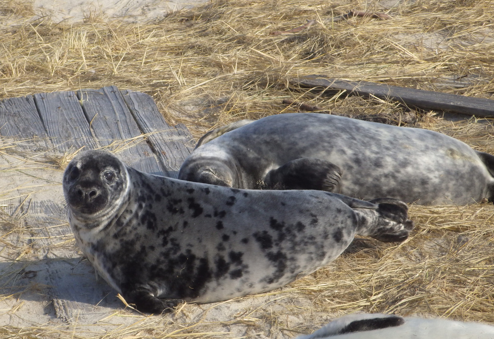
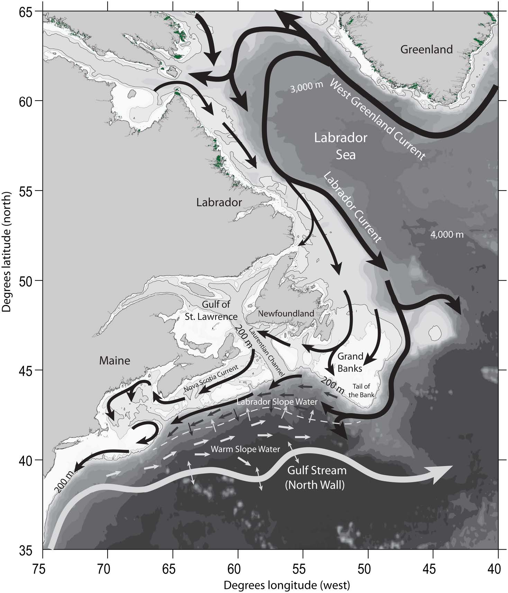
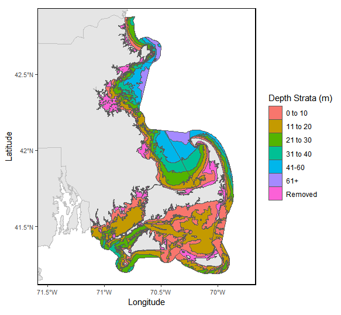

class: top, left

```{r setup, include=FALSE}

options(htmltools.dir.version = FALSE)
knitr::opts_chunk$set(echo = F,
                      warning = F,
                      message = F)
#Plotting and data libraries
library(ggplot2)
library(dplyr)
library(tidyr)
library(ecodata)
library(here)
library(kableExtra)
library(ggrepel)
library(stringr)
library(patchwork)
library(grid)
library(plotly)
library(vegan)
library(rpart)
library(colorRamps)

#GIS libraries
library(sf)
library(rgdal)
library(raster)
library(rnaturalearth)

data.dir <- here::here("data")
r.dir <- here::here("R")

#Time series constants
shade.alpha <- 0.3
shade.fill <- "lightgrey"
lwd <- 1
pcex <- 2
trend.alpha <- 0.5
trend.size <- 2
hline.size <- 1
hline.alpha <- 0.35
hline.lty <- "dashed"
label.size <- 5
hjust.label <- 1.5
letter_size <- 4
feeding.guilds <- c("Apex Predator","Piscivore","Planktivore","Benthivore","Benthos")
x.shade.min <- 2009
x.shade.max <- 2018
map.lwd <- 0.4
#Function for custom ggplot facet labels
label <- function(variable,value){
  return(facet_names[value])
}

#facet names for titles
facet_names <- list("Apex predators" = expression("Apex predators"),
                    "Piscivores" = expression("Piscivores"),
                    "Planktivores" = expression("Planktivores"),
                    "Benthivores" = expression("Benthivores"),
                    "Benthos" = expression("Benthos"))
#CRS
crs <- "+proj=longlat +lat_1=35 +lat_2=45 +lat_0=40 +lon_0=-77 +x_0=0 +y_0=0 +datum=NAD83 +no_defs +ellps=GRS80 +towgs84=0,0,0"

#Coastline shapefile
coast <- ne_countries(scale = 10,
                          continent = "North America",
                          returnclass = "sf") %>%
             sf::st_transform(crs = crs)

#State polygons
ne_states <- ne_states(country = "united states of america",
                                      returnclass = "sf") %>%
  sf::st_transform(crs = crs)

#high-res polygon of Maine
#new_england <- read_sf(gis.dir,"new_england")

#EPU shapefile
epu_sf <- ecodata::epu_sf %>% 
  filter(EPU %in% c("MAB","GB","GOM"))
```

# Today's Talk

.pull-left[

- New avenues for ecosystem information

- Report structure

- Overview of results for New England 2019

- Notable improvements: open-source data and technical documentation
]

.pull-right[
*The IEA Loop<sup>1</sup>*


]

.footnote[
[1] https://www.integratedecosystemassessment.noaa.gov/national/IEA-approach
]

???

---

## New avenues for ecosystem reporting

**Ecosystem Context for Stock Assessment (ECSA)**

.pull-left[
* First provided for 2018 summer flounder assessment

* Provides seasonal ecosystem information for **stock areas**
  * Ocean temperature and salinity, chlorophyll, zooplankton, estimated habitat occupancy, diet composition
]

.pull-right[

[Summer flounder ECSA](noaa-edab.github.io/ECSA)
]
  
???
A new approach to incorporating ecosystem information into the management process is the ECSA, or the Ecosystem Context for Stock Assessment, which is the brainchild of Kevin Friedland, and relies heavily on his modeling work on the shelf.  

The goal of the ECSA is to provide seasonal ecosystem information for specific stocks, so that ecosystem information can form a backdrop for the stock assessment process. 


---

## Ecosystem Context for Stock Assessment (ECSA)


???
An exciting part of the ECSA is that the data are visualized in an interactive way and data are quickly accessible

---

## Ecosystem Context for Stock Assessment (ECSA)

* Automated workflows for rapid generation of reports

--

* Transparent and reproducible methods

--

* Developed specifically for science audience
  * More technical language, includes methods and full references

--

* Positive feedback overall, will continue building out ECSA for assessments

???
The ECSA is a very different product from the State of the Ecosystem report, but relies on many of the same principals we use to develop the SOE

Specifically, we rely upon automated workflows, and in the case of the ECSA, this allows us to rapidly generate reports for single stocks. 

By hosting our work on open-source platforms like github, we ensure that our analyses are transparent for those whom are interested. This further allows us to elaborate upon our methods in detail without overwhelming readers. 

A major difference in the two reports is the audience each report is aimed at. By design, State of the Ecosystem reports are high-level overviews, whereas the ECSA is technical and aimed at stock-assessment scientists.

---

## SOE 2019 Overview Results

```{r nes-comp1, echo = F}

```

???
The purpose of this report is to synthesize available information relevant to fishery management in the New England portion of the US Northeast Shelf. This 2019 report highlights where management interventions have proven successful to achieve ecological objectives, but also characterizes the considerable challenges for management posed by climate change and increasing trade-offs across conservation, fishing, and other human activities in this region. Finally, we describe combinations of ecological signals that present opportunities for further integrated research and possibly creative management solutions.

---
## State of the Ecosystem 2019: Structure
.pull-left[

### Report Structure
1. Human dimensions

2. Protected species

3. Fish and invertebrates (managed and otherwise)

4. Habitat quality and ecosystem productivity
]

.pull-right[
.table[
<table class="table" style="width: 50; margin-left: auto; margin-right: auto;">
<caption>Ecosystem-scale objectives and indicators on the Northeast US shelf</caption>
 <thead>
  <tr>
   <th style="text-align:left;font-weight: bold;"> Objective Categories </th>
   <th style="text-align:left;font-weight: bold;"> Indicators </th>
  </tr>
 </thead>
<tbody>
  <tr>
   <td style="text-align:left;"> Seafood Production </td>
   <td style="text-align:left;"> Landings by feeding guild </td>
  </tr>
  <tr>
   <td style="text-align:left;"> Profits </td>
   <td style="text-align:left;"> Revenue by feeding guild </td>
  </tr>
  <tr>
   <td style="text-align:left;"> Recreation </td>
   <td style="text-align:left;"> Number of anglers and trips; recreational catch </td>
  </tr>
  <tr>
   <td style="text-align:left;"> Stability </td>
   <td style="text-align:left;"> Diversity indices (fishery and species) </td>
  </tr>
  <tr>
   <td style="text-align:left;"> Social &amp; Cultural </td>
   <td style="text-align:left;"> Commercial and recreational reliance </td>
  </tr>
  <tr>
   <td style="text-align:left;"> Biomass </td>
   <td style="text-align:left;"> Biomass or abundance by feeding guild from surveys </td>
  </tr>
  <tr>
   <td style="text-align:left;"> Productivity </td>
   <td style="text-align:left;"> Condition and recruitment of managed species </td>
  </tr>
  <tr>
   <td style="text-align:left;"> Trophic structure </td>
   <td style="text-align:left;"> Relative biomass of feeding guilds, primary productivity </td>
  </tr>
  <tr>
   <td style="text-align:left;"> Habitat </td>
   <td style="text-align:left;"> Estuarine and offshore habitat conditions </td>
  </tr>
</tbody>
</table>
]
]


---
## SOE Orientation: Indicator visualization

Status (short-term) and trend (long-term) of components are measured as **indicators** and plotted in a standardized way

Indicators are selected to

1. Be broadly informative about a component in a management context<sup>1-3</sup>

1. Minimize redundancy of information

1. Be responsive to ecosystem change


```{r doc-orientation, echo = F, warning = F, message=F, fig.height = 3, fig.width=8, fig.align = "center"}
m <- 0.1
x <- 1989:2018
y <-  m*x + rnorm(30, sd = 0.35)

data <- data.frame(x = x,
                  y = y)

#Define constants for figure plot
x.shade.max <- max(x)
x.shade.min <- x.shade.max - 9 
hline = mean(y)

#Plot series with trend 
ggplot2::ggplot(data = data,aes(x = x, y = y)) +
  #Highlight last ten years
  annotate("rect", fill = shade.fill, alpha = shade.alpha,
      xmin = x.shade.min , xmax = x.shade.max,
      ymin = -Inf, ymax = Inf) +
  geom_point(size = pcex) +
  scale_color_manual(aesthetics = "color")+
  guides(color = FALSE) +
  geom_hline(aes(yintercept = hline),
              size = hline.size,
             alpha = hline.alpha,
             linetype = hline.lty)+
  geom_line() +
  geom_gls() +
  scale_y_continuous(labels = function(l){trans = l / 1000})+
  scale_x_continuous(breaks = seq(1985, 2015, by = 5), expand = c(0.01, 0.01)) +
  ylab(expression("Invented Index, 10"^3*"widgets")) +
  xlab("Year") +
  ggtitle("Indicator Z") +
  theme_ts() +
  theme(plot.title = element_text(size = 16),
        axis.title = element_text(size = 14))
```


.footnote[
[1] Rice J. C.Rochet M. J. "A framework for selecting a suite of indicators for fisheries management." ICES Journal of Marine Science 62 (2005): 516–527.

[2] Link J. 2010. Ecosystem-Based Fisheries Management: Confronting Tradeoffs . Cambridge University Press, New York.

[3] Zador, Stephani G., et al. "Ecosystem considerations in Alaska: the value of qualitative assessments." ICES Journal of Marine Science 74.1 (2017): 421-430.
]


---

## SOE Orientation: Indicator spatial scales

```{r epus, echo = F, out.width = "70%", fig.align = "center"}
knitr::include_graphics("20190329_NEFMC_SSC_Hardison_images/SOE_Map.jpg")
```

.footnote[
https://noaa-edab.github.io/tech-memo/epu.html
]

---

## SOE Orientation: Feeding guilds
.table[
```{r feeding-guilds}
# new table with all species listed by management entity
df <- ecodata::species_groupings %>%
  dplyr::select(SOE_18, COMNAME, Fed_Managed) %>%
  filter(SOE_18 != "Other") %>%
  distinct() %>%
  group_by(SOE_18, Fed_Managed) %>%
  summarize_all(funs(paste(na.omit(.), collapse = ", "))) %>%
  spread(Fed_Managed, COMNAME) %>%
  arrange(factor(SOE_18, levels = c("Apex Predator", "Piscivore", "Planktivore", "Benthivore", "Benthos")))
df<-df[-6,c(1,4,3,5,6)] %>%
  mutate_all(tolower)


knitr::kable(df, caption = 'Feeding guilds and management bodies.', 
             col.names = c("Guild", "MAFMC", "Joint", "NEFMC", "State or Other")) %>%
  kable_styling(bootstrap_options = c("striped", "hover")) %>%
  column_spec(1, width="2cm") %>%
  column_spec(2, width="4cm") %>%
  column_spec(3, width="2cm") %>%
  column_spec(4, width="5cm") %>%
  column_spec(5, width="6cm")

```
]
???
* Feeding guilds assigned based on NEFSC food habits data base
  * Food habits change with age and size, so guilds assigned based on most common size class

* Simplified from existing guild structures<sup>1,2</sup>

.footnote[
[1] Garrison, Lance P, and Jason S Link. 2000. “Dietary guild structure of the fish community in the Northeast United States continental shelf ecosystem.” Marine Ecology Progress Series 202:231–40.

[2] Link, Jason S, Carolyn A Griswold, Elizabeth T Methratta, and Jessie Gunnard. 2006. Documentation for the energy modeling and analysis exercise (EMAX). US Department of Commerce, National Oceanic; Atmospheric Administration.
]


Because we focus on ecosystem context, we've aggregated species in most of our indicators up to the level of feeding guild, shown here.

These feeding guilds were derived from NEFSC food habits data and existing guilds identified in the literature


---

## Good news: Management works 

Current bycatch levels suggest that management actions have been effective in reducing harbor porpoise bycatch

```{r harbor-porpoise-bars, fig.width = 8, fig.align="center", fig.height = 6}
source("R/hp_density_plot.R")
hp_bycatch  <- ecodata::harborporpoise %>% 
  spread(.,Var,Value) %>% 
ggplot() +
    annotate("rect", fill = shade.fill, alpha = shade.alpha,
      xmin = x.shade.min , xmax = x.shade.max,
      ymin = -Inf, ymax = Inf) +
  geom_line(aes(x = Time, y = `harbor porpoise bycatch estimate`, color = "Harbor Porpoise Bycatch"), size = lwd) +
  geom_point(aes(x = Time, y = `harbor porpoise bycatch estimate`, color = "Harbor Porpoise Bycatch"), size = pcex) +
  geom_errorbar(aes(x = Time,
                    ymin = `harbor porpoise bycatch lo95ci`,
                  ymax = `harbor porpoise bycatch up95ci`,
                  color = "Harbor Porpoise Bycatch"), 
                width = 0.25)+
  geom_line(aes(x = Time, y = `harbor porpoise bycatch pbr`, color = "PBR"), size = lwd-0.1) +
  scale_color_manual("", values = c("Harbor Porpoise Bycatch" = "black", "PBR" = "red")) +
  guides(color = guide_legend(override.aes = list(shape = c(19,NA)))) +
  scale_x_continuous(expand = c(0.01, 0.01)) +
  ggtitle("Harbor porpoise bycatch") +
  ylab("Bycatch Estimate (n)") +
  theme_ts() +
  theme(legend.position = c(0.4, 0.85),
        legend.background = element_rect(fill = "transparent"),
        axis.title = element_text(size = 14),
        plot.title = element_text(size = 16, face = "bold"))

xlims <- c(-78, -66)
ylims <- c(35, 46)
fall_hp <- hp_density("Fall", lat = F)
spring_hp <- hp_density("Spring", leg = F)

(spring_hp | fall_hp ) /
  hp_bycatch + plot_layout(ncol = 1, heights = c(1.5, 1.25)) & theme(plot.margin = margin(0,0,0.3,0,"cm"))

```


???
The maps here show density estimates of the widely distributed harbor porpoise in the spring and fall months, as estimated by the Atlantic Marine Assessment Program for Protected Species.

The red line in the time series plot shows the potential biological removal. Above this line removals from the population will prevent the stock from reaching a stable population size. 

2016 and 2017 estimates for bycatch are among the lowest values in the series, suggest that management actions have been effective in reducing harbor porpoise bycatch. 

---
## Challenges: F and B objectives

  * Objectives being met for 20 stocks
  * 4 stocks below B and above F thresholds
  * Herring dropped to B/Bmsy < 1

```{r stock-status, fig.width = 8, fig.asp = 0.75, fig.align="center"}

#Get data, spread for plotting, and filter
stock_status <- ecodata::stock_status %>%
  spread(.,Var,Value) %>% 
  filter(Council %in% c("NEFMC","Both"))

#Plot constants
y.max <- 4.5
x.max <- 7.5

all_missing <- stock_status %>%
  filter(is.na(B.Bmsy),is.na(F.Fmsy)) %>% 
  dplyr::select(Code, Council)

b_missing <- stock_status %>%
  filter(is.na(B.Bmsy), !is.na(F.Fmsy)) %>% 
  dplyr::select(Code, Council)

f_missing <- stock_status %>%
  filter(is.na(F.Fmsy), !is.na(B.Bmsy)) %>% 
  dplyr::select(Code, Council)

#A dataframe that defines custom legend for stocks with unknown status

all.df <- data.frame(text = all_missing$Code,
                    x = rep(x.max,length(all_missing$Code)),
                    y = seq(4.35,2.85,-0.22),
                    color = all_missing$Council)

b.df <- data.frame(text = b_missing$Code,
                    x = rep(x.max*0.8,length(b_missing$Code)),
                    y = c(4.35,4.14),
                    color = b_missing$Council)

f.df <- data.frame(text = f_missing$Code,
                    x = rep(x.max*0.6,length(f_missing$Code)),
                    y = seq(4.35,2.85,-0.22),
                    color = f_missing$Council)


#Plotting code
ggplot(data = stock_status) +
  geom_vline(xintercept = 1, linetype = "dotted", color = "grey60")+
  geom_vline(xintercept = 0.5, linetype = "dashed", color = "grey60")+
  geom_hline(yintercept = 1, linetype = "dashed", color = "grey60") +
  geom_point(aes(x = B.Bmsy,
                 y = F.Fmsy,
                 color = Council,
                 shape = Council)) +
  geom_text_repel(aes(x = B.Bmsy, #geom_text_repel auto-jitters text around points
                      y = F.Fmsy,
                      label = Code,
                      color = Council), show.legend = FALSE,nudge_y = 0.05, nudge_x = 0.05) +
  ylim(0,y.max) +
  xlim(0,x.max*1.1) +
  geom_text(data = all.df, aes(x = x, y = y, label = text, color = color),show.legend = FALSE, size = 3)+
  geom_text(data = b.df, aes(x = x, y = y, label = text, color = color),show.legend = FALSE, size = 3)+
  geom_text(data = f.df, aes(x = x, y = y, label = text, color = color),show.legend = FALSE, size = 3)+
  scale_color_manual(values = c("purple","blue"),#c("purple","blue"), #Change legend labels for clarity
                   name = "Managed by",
                   breaks = c("Both","NEFMC"),
                   labels = c("MAFMC/NEFMC","NEFMC"))+
  scale_shape_manual(values = c(1, 19), #Change legend labels for clarity
                     name = "Managed by",
                     breaks = c("Both","NEFMC"),
                     labels = c("MAFMC/NEFMC","NEFMC"))+
  annotate("rect", xmin = 0.924*x.max,
           xmax = 1.08*x.max,
           ymin = 0.645*y.max,
           ymax = 0.98*y.max,
           alpha = 0.01) +
  annotate("text", x = 7.5, y = 4.5, label = "F and B missing", fontface =2, size = 3)+
    annotate("rect", 
             xmin = 0.729*x.max,
           xmax = 0.871*x.max,
           ymin = 0.905*y.max,
           ymax = 0.98*y.max,
           alpha = 0.01) +
  annotate("text", x = 6, y = 4.5, label = "B missing", fontface =2, size = 3)+
    annotate("rect", xmin = 0.509*x.max,
           xmax = 0.681*x.max,
           ymin = 0.65*y.max,
           ymax = 0.98*y.max,
           alpha = 0.01) +
  annotate("text", x = 4.5, y = 4.5, label = "F missing", fontface =2, size = 3)+
  xlab(expression(~B/B[msy])) +
  ylab(expression(~F/F[msy])) +
  theme_ts()
```

???
While management action has had a postive impact on harbor porpoise mortality, there are multiple signals indicating challenges to meeting management goals. 

Management objectives are being met for 20 species at the single species level, but 9 stocks are below biomass thresholds. 

---

## Challenges: Community reliance and vulnerability

* High social-ecological reliance on scallop and lobster
* Species considered moderately to highly at risk due to climate change (OA, temp)


```{r com-eng1, fig.width = 8, fig.height = 5, fig.align="center"}
source("R/engagement_plots.R")
engagement_plots(type = "comm",epu = "GOM")
```

???
Many social-ecological systems in New England are reliant on lobster, as in Gulf of Maine, or scallop, for Georges Bank. As these species are considered moderately to highly at risk due to climate change, the communities dependent on them could be a heightened risk as well. 

Maine and South coast of MA have high reliance
---
## Commercial drivers
```{r bennet-ne, out.width = "65%", fig.align="center"}

source("R/bennet_plots_NE.R")

ne_bennet <- bennet_plots_NE(scale_x_min = 1986)

ne_bennet[[1]] + ne_bennet[[2]] + plot_layout(ncol = 1)
```


???
This reliance becomes apparent if we look at the breakdown of catch volume and prices by feeding guild.

In these figures, the catch price is shown in blue and the catch volume is shown in green, and total revenue change from the long term is shown by the black line. It's not perfect, but it's relatively clear that the benthivore feeding guild is driving revenue in Gulf of Maine and benthos in Georges Bank. 

---
## Challenges: Long-term decline in seafood production

```{r ne-total-landings, out.width = "65%", fig.align="center"}
source("R/total_landings_plot.R")

gom_total <- plot_total_landings(epu = "GOM", council = "NEFMC")
gb_total <- plot_total_landings(epu = "GB", council = "NEFMC")


gom_total + gb_total + plot_layout(ncol = 1)
```


???
Along with strong reliance on a few species in New England, we've also seen a decline in catch of managed species since the mid 1980s. 


---
## Recreational fishing

.pull-left[
NE: 
* Positive long-term trend for diversity of catch in New England recreational fisheries

* Overall decline in rec seafood harvest since 1980s
  * Trending upwards since mid-90s

* Increase in recreational effort (n anglers) since the mid 90s
]
.pull-right[
```{r rec-div1, fig.height=9}
source("R/rec_div_plots.R")
source("R/rec_harvest_plots.R")
source("R/rec_effort_plots.R")
ne_rec_div <- rec_div_plots("NE")
ne_rec_harvest <- rec_harvest_plots("NE")
ne_rec_effort <- rec_effort_plots("NE")

ne_rec_div[[2]] + ne_rec_harvest + ne_rec_effort[[2]] + plot_layout(ncol = 1)
```
]

???
While commercial fisheries have high specialization of catch, there's a positive long-term trend for recreational catch diversity in the recreational sector. 

Updated Marine Recreational Information Program data shows that there's been an upswing in harvest since the mid-90s, although the trend overall is negative

An increase in diversity of recreational catch will likely benefit communities that are reliant upon recreational fisheries by increasing their resilience to ecosystem changes.

---
## Challenges: Protected species interactions (I)

* 2018: 4 unusual mortality events for three large whale species and two seal species

**North Atlantic right whales (NARW)**
  * Strong consensus of population decline
  * Diverging abundance trends between sexes, with higher female mortality rates

* Evidence suggests that the level of interaction between NARWs, fixed gear (US and CAN) is contributing to the decline of the species

  * 20 NARW deaths in 2017 and 2018, >50% due to human interactions (5 vessel strike, 6 entanglement)

```{r NARW-abundance, fig.width = 7.25, fig.height = 3, fig.align = "center"}
hline <- mean(narw[narw$Var == "right whale abundance median",]$Value)
series.col <- "black"
ecodata::narw %>% 
  spread(.,Var,Value) %>% 
  ggplot() +
#Highlight last ten years
  annotate("rect", fill = shade.fill, alpha = shade.alpha,
      xmin = x.shade.min , xmax = x.shade.max,
      ymin = -Inf, ymax = Inf) +
  geom_line(aes(x = Time, y = `right whale abundance median`), size = lwd-0.75) +
  geom_point(aes(x = Time, y = `right whale abundance median`), size = pcex-0.75) +
  geom_errorbar(aes(x = Time,
                    ymin = `right whale abundance lcl`,
                  ymax = `right whale abundance ucl`), 
                width = 0.25) +
  scale_x_continuous(expand = c(0.01, 0.01)) +
  scale_color_manual(values = series.col, aesthetics = "color")+
  guides(color = FALSE) +
  ggtitle("NARW abundance") +
  ylab(expression("Abundance (n)")) +
  xlab("Time")+
  geom_hline(aes(yintercept = hline),
           color = "black",
           size = hline.size,
           alpha = hline.alpha,
           linetype = hline.lty) +
  theme_ts() + 
  theme(axis.title = element_text(size = 14),
        plot.title = element_text(size = 16, face = "bold"))
```

???
Fisheries interactions are the largest contributor to NARW mortality, with more than half of the mortality events in 2018-2019 attributed to vessel strikes or entanglement

Changing ecosystem conditions may contribute to increased interactions between NARW and fisheries. 

Changes in fishery management to address the issue of fishery interactions with protected species could have large implications for the fixed gear sector, and particularly for pot gear fisheries like lobster.

---
## Challenges: Proctected species interactions (II)

* MA gray seal population between 30-40,000 individuals

* Annual gray seal bycatch mortality ~900

* Unusual Mortality Event declared for seals (gray and harbor)

* Seal diet studies underway to understand role in fisheries

```{r, out.width = "50%", fig.align= "center"}

```
*Image credit: NOAA Fisheries*


???
Unusual mortality event in gray and harbor seals may be caused by phocine distemper virus

---

## Challenge: Unprecedented ecosystem observations

* Northeast US shelf is still among the fastest warming waters globally
  * 7/10 warmest years observed in the past decade
  
* Most northerly Gulf Stream north wall positions ever recorded 2014-2017 
  * associated with warmer ocean temperature in the Northeast US shelf

Advice for managing in the face of rapid, unprecedented ecosystem changes?

.pull-left[

```{r long-term sst, echo = F, fig.height=4}

lt_sst <- ecodata::long_term_sst %>% 
  mutate(hline = mean(Value))

lt_sst %>% 
  ggplot(aes(x = Time, y = Value, group = Var)) +
         annotate("rect", fill = shade.fill, alpha = shade.alpha,
      xmin = x.shade.min , xmax = x.shade.max,
      ymin = -Inf, ymax = Inf) +
  geom_gls() +
  geom_line() +
  geom_point() +
  ylab("Temperature (°C)") +
  # ggtitle("") +
    scale_x_continuous(expand = c(0.01, 0.01), breaks = seq(1840,2010,20))+
      geom_hline(aes(yintercept = hline),
           size = hline.size,
           alpha = hline.alpha,
           linetype = hline.lty)+
  theme_facet() +
  theme(strip.text=element_text(hjust=0,
                                face = "italic"),
        axis.title = element_text(size = 14))

```
*NE Shelf Long-term SST*
]

.pull-right[
```{r GSI, fig.height = 4, echo = F}
gsi %>% 
  mutate(Year = floor(Time)) %>% 
  group_by(Year) %>% 
  dplyr::summarise(Value = mean(Value)) %>% 
  mutate(hline = mean(Value)) %>% 
  dplyr::rename(Time = Year) %>% 
  ggplot(aes(x = Time, y = Value)) +
         annotate("rect", fill = shade.fill, alpha = shade.alpha,
      xmin = x.shade.min , xmax = x.shade.max,
      ymin = -Inf, ymax = Inf) +
  geom_gls() +
  geom_line() +
  geom_point() +
  ylab("Gulf Stream position anomaly") +
  # ggtitle("") +
    scale_x_continuous(expand = c(0.01, 0.01))+
      geom_hline(aes(yintercept = hline),
           size = hline.size,
           alpha = hline.alpha,
           linetype = hline.lty)+
  theme_ts() +
  theme(strip.text=element_text(hjust=0,
                                face = "italic"),
        axis.title = element_text(size = 14))
```
*Gulf Stream Index*
]

???
SST
Figure on left shows estimated time series of SST extending back to to 1850s. 
*7 out of 10 of the hottest years have been in the past decade

GSI
The figure on the right shows that deviation from the mean latitude of the north wall of the gulf stream, showing anomalously high value for the past 5 years

---
## Ocean circulation in NW Atlantic

```{r atl-circ, out.width="50%", fig.align="center"}

```


.footnote[
Townsend, D. W., Pettigrew, N. R., Thomas, M. A., Neary, M. G., McGillidcuddy, D. J., O'Donnell, J (2015), Water masses and nutrient sources to the Gulf of Maine, Journal of Marine Research, 73: 93-122.
]

???
Regional currents are major influencers of ocean temperatures in the NW Atlantic 

The Gulf Stream is a reliable indicator of bottom water temps

An offshoot of the gulf stream is the warm slope water, which makes its way into gulf of maine through the northeast channel

---
## Challenges: Ocean circulation

```{r gsi_sw, out.width = "65%", fig.align="center"}
gsi_plt <- gsi %>% 
  mutate(Year = floor(Time)) %>% 
  group_by(Year) %>% 
  dplyr::summarise(Value = mean(Value)) %>% 
  mutate(hline = mean(Value)) %>% 
  dplyr::rename(Time = Year) %>% 
  ggplot(aes(x = Time, y = Value)) +
         annotate("rect", fill = shade.fill, alpha = shade.alpha,
      xmin = x.shade.min , xmax = x.shade.max,
      ymin = -Inf, ymax = Inf) +
  geom_gls() +
  geom_line() +
  geom_point() +
  ylab("Position anomaly") +
  ggtitle("Gulf Stream Index") +
    scale_x_continuous(expand = c(0.01, 0.01))+
      geom_hline(aes(yintercept = hline),
           size = hline.size,
           alpha = hline.alpha,
           linetype = hline.lty)+
  theme_ts() +
  theme(strip.text=element_text(hjust=0,
                                face = "italic"),
        axis.title = element_text(size = 14),
        plot.title = element_text(size = 16, face = "bold"))

sw.df <- slopewater %>% 
  mutate(Var, Var = plyr::mapvalues(Var, from = c("WSW proportion ne channel",
                                                  "LSLW proportion ne channel"),
                                    to = c("WSW","LSLW"))) %>% 
  dplyr::rename(Flavor  = Var) %>% 
  group_by(Flavor) %>% 
  mutate(hline = mean(Value)) 

sw.df$Flavor <- factor(sw.df$Flavor, levels = c("WSW","LSLW"))

sw_plt <- ggplot(data = sw.df) +
  geom_line(aes(x = Time, y = Value, color = Flavor))+
  geom_point(aes(x = Time, y = Value, color = Flavor)) +
  ylab("Percent of Total Slopewater") +
  ggtitle("Slopewater Proportions in NE Channel")+
    scale_x_continuous(expand = c(0.01, 0.01))+
      geom_hline(aes(yintercept = hline,
                     color = Flavor),
           size = hline.size,
           alpha = hline.alpha,
           linetype = hline.lty)+
  theme_ts() +
  theme(strip.text=element_text(hjust=0,
                                face = "italic"),
        axis.title = element_text(size = 14),
        plot.title = element_text(size = 16, face = "bold"))

gsi_plt + sw_plt + plot_layout(ncol = 1)
```

---
## Challenges: A warming Shelf

Warming oceans have implications for suitable fish habitat, which is predicted to decline for many NE species<sup>1</sup>

.footnote[
Kleisner, Kristin M., et al. "Marine species distribution shifts on the US Northeast Continental Shelf under continued ocean warming." Progress in Oceanography 153 (2017): 24-36.
]

```{r ne-sst, fig.align = "center", fig.height = 6, fig.width = 12}
epu_sf <- ecodata::epu_sf %>% 
  filter(EPU %in% c("GOM","GB"))

#Map line parameters
map.lwd <- 0.4

# Set lat/lon window for maps
xmin = -73
xmax = -65
ymin = 39
ymax = 45
xlims <- c(xmin, xmax)
ylims <- c(ymin, ymax)
sst <- seasonal_oisst_anom_gridded 

sst$Season <- factor(sst$Season, levels = c("Winter",
                                            "Spring",
                                            "Summer",
                                            "Fall"))
sst_map <- 
  ggplot() +
  geom_tile(data = sst, aes(x = Longitude, y = Latitude,fill = Value)) +
  geom_sf(data = coast, size = map.lwd) +
  geom_sf(data = epu_sf, fill = "transparent", size = map.lwd) +
  scale_fill_gradient2(name = "Temp.\nAnomaly (°C)",
                       low = scales::muted("blue"),
                       mid = "white",
                       high = scales::muted("red"),
                       limits = c(-5,5)) +
  coord_sf(crs = crs, xlim = xlims, ylim = ylims) +
  facet_wrap(Season~.) +
  theme_map() +
  ggtitle("SST anomaly (2018)") +
  xlab("Longitude") +
  ylab("Latitude") +
  theme(panel.border = element_rect(colour = "black", fill=NA, size=0.75),
        legend.key = element_blank(),
        axis.title = element_text(size = 11),
        strip.background = element_blank(),
        strip.text=element_text(hjust=0),
        axis.text = element_text(size = 8))


ne_anom <- seasonal_oisst_anom %>% 
  filter(EPU %in% c("GOM","GB")) %>% 
    mutate(hline = 0,
           Var = str_to_title(str_extract(Var,"winter|spring|summer|fall")))
ne_anom$Var <- factor(ne_anom$Var, levels= c("Winter","Spring","Summer","Fall"))

ne_anom_plt <- ggplot(data = ne_anom, 
       aes(x = Time, y = Value, color = EPU, group = EPU))+ #plot
     annotate("rect", fill = shade.fill, alpha = shade.alpha,
      xmin = x.shade.min , xmax = x.shade.max,
      ymin = -Inf, ymax = Inf) +
  geom_line()+
  geom_point()+
  ylim(-2,3)+
  geom_gls() +
  ylab(expression("SST Anomaly (°C)")) +
  ggtitle("Gulf of Maine & Georges Bank SST Anomaly") +
    scale_color_manual(values = c("black","indianred"))+
    scale_x_continuous(expand = c(0.01, 0.01)) +
    geom_hline(aes(yintercept = hline),
           size = hline.size,
           alpha = hline.alpha,
           linetype = hline.lty) +
  facet_wrap(Var ~., ncol = 2, scales = "free_y")+
  theme_facet() +
  theme(strip.text=element_text(hjust=0),
        plot.title = element_text(size = 16))

sst_map + ne_anom_plt 
```


???
These changes have implications for fish populations in the region that are already at the southern extent of their ranges, like Atlantic cod. Suitable habitat for these species is predicted to contract as waters continue to warm. 

* Gulf of Maine summer SSTs were the highest on record in 2018 (~3°C > long-term mean)

---
## Challenges: A warming Shelf

* Bottom temperatures are also increasing in the region

```{r ne-bot-temp, fig.height = 5, fig.align = "center", fig.width = 7}
bot_temp_insitu_gom <- oceantemp_insitu %>%
  filter(EPU == "GOM",
         Var == "bottom temp anomaly in situ") %>% 
  mutate(hline = 0) %>% 
    ggplot()+ #plot
     annotate("rect", fill = shade.fill, alpha = shade.alpha,
      xmin = x.shade.min , xmax = x.shade.max,
      ymin = -Inf, ymax = Inf) +
  geom_line(aes(x = Time, y = Value)) +
  geom_gls(aes(x = Time, y = Value)) +
  geom_point(aes(x = Time, y = Value), size = 1) +
  ylab("Temp. Anomaly (°C)") +
  ggtitle("GOM Bottom Temperature Anomaly") +
  scale_x_continuous(expand = c(0.01, 0.01)) +
    geom_hline(aes(yintercept = hline),
           size = hline.size,
           alpha = hline.alpha,
           linetype = hline.lty) +
  theme_ts() +
  theme(strip.text=element_text(hjust=0),
        plot.title = element_text(size = 16),
        axis.title = element_text(size = 14))


bot_temp_insitu_gb <- oceantemp_insitu %>%
  filter(EPU == "GB",
         Var == "bottom temp anomaly in situ") %>%
   mutate(hline = 0) %>% 
    ggplot()+ #plot
     annotate("rect", fill = shade.fill, alpha = shade.alpha,
      xmin = x.shade.min , xmax = x.shade.max,
      ymin = -Inf, ymax = Inf) +
  geom_line(aes(x = Time, y = Value)) +
  geom_gls(aes(x = Time, y = Value)) +
  geom_point(aes(x = Time, y = Value), size = 1) +
  ylab("Temp. Anomaly (°C)") +
  ggtitle("GB Bottom Temperature Anomaly") +
  scale_x_continuous(expand = c(0.01, 0.01)) +
    geom_hline(aes(yintercept = hline),
           size = hline.size,
           alpha = hline.alpha,
           linetype = hline.lty) +
  theme_ts() +
  theme(strip.text=element_text(hjust=0),
        plot.title = element_text(size = 16),
        axis.title = element_text(size = 14))


bot_temp_insitu_gom +
 bot_temp_insitu_gb + 
  plot_layout(ncol =  1) &
  theme(plot.margin = unit(c(0, 0, 0, 0), "cm"))
```

---
## Management implications: species shifts

```{r spec_prop, fig.width = 8, fig.height = 8, fig.align="center"}
source("R/get_spec_prop.R")
nefmc_benth_in_mid <- get_species_prop_plots(guild = "Benthivore", epu = "MAB",managed_by = "NEFMC",region = "the Mid-Atlantic")

mafmc_plank_in_gom <- get_species_prop_plots(guild = "Planktivore", epu = "GOM",managed_by = "MAFMC",region = "Gulf of Maine")

mafmc_plank_in_gb <- get_species_prop_plots(guild = "Planktivore", epu = "GB",managed_by = "MAFMC",region = "Georges Bank")

nefmc_benth_in_mid +
mafmc_plank_in_gom +
mafmc_plank_in_gb + plot_layout(ncol = 1)
```


???
Distributions of managed species within feeding guilds have changed. 

Increase in MAFMC species proportiongs in GOM/GB driven by mackerel

The decline in NEFMC species in the mid survey is driven mostly by ocean pout, which has seen proportional declines in the gulf of maine and georges bank survey


---
## Implications for protected species: Common tern diet

.pull-left[
* Warmer waters affect vertical distribution of prey species
  * Results in more generalist diet choices
  
* High diet diversity in past decade may be the result of decreases in preferred prey type (hake, sandlance)
  * Butterfish appear in diet in warm years, are difficult to digest; may cause starvation
]
.pull-right[
```{r tern-diet-diversity, fig.height=8}

diet_div <- ecodata::common_tern %>% 
  filter(str_detect(Var, "Diet"),
         !str_detect(Var, "Sum")) %>% 
  mutate(Island = word(Var, 1),
         Var = word(Var, 4)) %>% 
  group_by(Island, Time) %>%
  dplyr::summarise(evenness = diversity(Value)/log(specnumber(Value)),
                   shannon = diversity(Value),
                   simpson = diversity(Value, index = "simpson")) %>% 
  gather(.,Var,Value,-Island, -Time) %>% 
  group_by(Var, Time) %>%
  dplyr::summarize(Value = mean(Value, na.rm = T),
                   sd = sd(Value, na.rm = T),
                   n = n()) %>%
  group_by(Var) %>% 
  mutate(hline = mean(Value, na.rm = T))

shannon <- diet_div %>% 
  filter(Var == "shannon") %>% 
ggplot(aes(x = Time, y = Value)) +
      annotate("rect", fill = shade.fill, alpha = shade.alpha,
      xmin = x.shade.min , xmax = x.shade.max,
      ymin = -Inf, ymax = Inf) +
  geom_line() +
  geom_point() +
  #geom_gls() +
  scale_x_continuous(expand = c(0.01, 0.01),limits = c(1992,2018)) +
  ggtitle("Common tern diet diversity")+
  ylab(expression("Shannon Diversity")) +
  xlab("")+
  geom_hline(aes(yintercept = hline),
           size = hline.size,
           alpha = hline.alpha,
           linetype = hline.lty) +
  theme_ts() +
  theme(axis.title = element_text(size = 14),
          plot.title = element_text(size = 16, face = "bold"))

source("R/get_tern_map.R")
tern_loc <- get_tern_map()
tern_loc + shannon + plot_layout(ncol = 1, heights = c(1,0.75))
```
]


---
## Surveys trends: Maine/New Hampshire Inshore Survey
.pull-left[
```{r inshore-menh, fig.height=9}
source("R/get_ne_surveys.R")

survs <- get_ne_surveys()
survs[[1]] 

```
]

.pull-right[
```{r menh-strata, out.width = "100%"}
knitr::include_graphics("20190329_NEFMC_SSC_Hardison_images/menh-survey-strata.png")
```
]

.footnote[
[ME/NH Survey Protocols](https://www.maine.gov/dmr/science-research/projects/trawlsurvey/reports/documents/proceduresandprotocols.pdf)
]

---
## Surveys trends: Massachusetts Inshore Survey

.pull-left[
```{r ma-strata, out.width = "100%"}

```
]

.pull-right[
```{r inshore-ma, fig.height=9}
survs <- get_ne_surveys()
survs[[2]] 

```
]


---
## Surveys trends: Offshore
```{r offshore, fig.width=15, fig.height=8}
survs[[3]] + survs[[4]] + plot_layout(ncol = 2)
```


---
## Survey trends: Inshore and offshore

```{r benthivore_ne, fig.width = 7.5, fig.height = 8, fig.align="center"}
load(file = "data/benthivore_survey_NE.rdata")
benthivore_NE %>% 
  ggplot(aes(x = Time, y = Value, color = Var), color = "black") +
  annotate("rect", fill = shade.fill, alpha = shade.alpha,
           xmin = x.shade.min , xmax = x.shade.max ,
           ymin = -Inf, ymax = Inf) +
  geom_gls(data = benthivore_NE %>% filter(Survey != "MENH"),
           aes(x = Time, y = Value,
               color = Var),
           alpha = trend.alpha, size = trend.size) +
  geom_line(size = lwd-0.5) +
  geom_point(size = pcex-0.5) +
  scale_color_manual(values = rep("black",8), aesthetics = "color")+
  scale_x_continuous(breaks = seq(1965, 2015, by = 10), expand = c(0.01, 0.01)) +
  guides(color = FALSE) +
  geom_hline(aes(yintercept = hline,
                 group = Var),
             size = hline.size,
             alpha = hline.alpha,
             linetype = hline.lty)+
  facet_wrap(group~.,scales = "free_y", ncol = 2) +
  ylab(expression("Biomass (kg tow"^-1*")")) +
  ggtitle("Benthivore survey biomass in New England") +
  theme_facet()+
    theme(strip.text=element_text(hjust=0,
                                  size = 12),
          axis.text = element_text(size = 12),
          axis.title = element_text(size = 12),
          title = element_text(size = 14))
```

---
## Survey trends: Inshore and offshore piscivores

```{r piscivore_ne, fig.width = 7.5, fig.height = 8, fig.align="center"}
load(file = "data/piscivore_survey_NE.rdata")
piscivore_NE %>% 
  ggplot(aes(x = Time, y = Value, color = Var), color = "black") +
  annotate("rect", fill = shade.fill, alpha = shade.alpha,
           xmin = x.shade.min , xmax = x.shade.max ,
           ymin = -Inf, ymax = Inf) +
  geom_gls(data = piscivore_NE %>% filter(Survey != "MENH"),
           aes(x = Time, y = Value,
               color = Var),
           alpha = trend.alpha, size = trend.size) +
  geom_line(size = lwd-0.5) +
  geom_point(size = pcex-0.5) +
  scale_color_manual(values = rep("black",8), aesthetics = "color")+
  scale_x_continuous(breaks = seq(1965, 2015, by = 10), expand = c(0.01, 0.01)) +
  guides(color = FALSE) +
  geom_hline(aes(yintercept = hline,
                 group = Var),
             size = hline.size,
             alpha = hline.alpha,
             linetype = hline.lty)+
  facet_wrap(group~.,scales = "free_y", ncol = 2) +
  ylab(expression("Biomass (kg tow"^-1*")")) +
  ggtitle("Piscivore survey biomass in New England") +
  theme_facet()+
    theme(strip.text=element_text(hjust=0,
                                  size = 12),
          axis.text = element_text(size = 12),
          axis.title = element_text(size = 12),
          title = element_text(size = 14))
```
---
## Changing base of the food web: primary production

* Summer PP is increasing in the Mid-Atlantic (and in New England)
  * Driven by warmer temperatures and increased bacterial remineralization and nutrient recycling
  * Increasing primary production likely due to higher productivity of smaller phytoplankton

```{r pp-trends, fig.width=10, fig.height = 5}
out_pp <- ecodata::chl_pp %>%
  filter(EPU %in% c("GOM","GB"),
         str_detect(Var, "MONTHLY_PPD_MEDIAN")) %>%
  separate(.,Time, into = c("Year","Month"), sep = 4) %>%
    mutate(Month = plyr::mapvalues(Month, from = c("01","02","03","04","05","06",
                                                   "07","08","09","10","11","12"),
                                   to = c(month.abb))) %>%
  group_by(EPU, Month) %>%
  mutate(hline = mean(Value))
out_pp$Month <- factor(out_pp$Month, levels = month.abb)


 pp_cci_gb <-out_pp %>%
  filter(EPU == "GB") %>%
 ggplot() +
   # geom_gls(aes(x = Year, y = Value, group = Month))+
    geom_point(aes(x = Year, y = Value, group = Month)) +
    geom_line(aes(x = Year, y = Value, group = Month)) +
    scale_x_discrete(name = "Time", breaks = seq(min(out_pp$Year),max(out_pp$Year),10)) +
    facet_wrap(Month~., ncol = 6) +
    ggtitle("GB Monthly median PPD") +
    ylab(expression("PP (gC m"^-2*" d"^-1*")")) +
        geom_hline(aes(yintercept = hline,
                     group = Month),
           size = hline.size,
           alpha = hline.alpha,
           linetype = hline.lty)+
    theme_facet() +
    theme(axis.text.x = element_text(angle=45, hjust = 1),
          panel.spacing = unit(1, "lines"),
          plot.margin = unit(c(0.1, 0, 0, 0), "cm"))

 pp_cci_gb

```


???
* Driven by warmer temperatures and increased bacterial remineralization and nutrient recycling
* Increasing primary production likely due to higher productivity of smaller phytoplankton

---
## Changing base of the food web: Zooplankton size structure

* Lower copepod size index means higher abundance of large copepods (<i>Calanus</i>)
* Primary production may play a role in zooplankton size dynamics on the shelf


```{r NE-sli, fig.height = 5, fig.align = "center", fig.width = 8}
source("R/sli_plots.R")
gom_out <- sli_plots("GOM")
gb_out <- sli_plots("GB")

gom_out[[1]] +  gb_out[[1]] +gom_out[[2]] + gb_out[[2]] + plot_layout(ncol=2)
```

???
To assess the size structure of copepods in the region, we use the small-large index.
* A measure of relative size composition of the dominant copepod taxa
* A lower value means higher abundance of large copepods (<i>Calanus</i>)
* Primary production may play a role in copepod size dynamics***


---
## Changing base of the food web and fish conditions

* Fish condition is measured at the weight at a given length relative to the average
  * Drop-off in condition around 2000 aligns with the shift in zooplankton size-structure on the shelf

*NEFMC Condition Factor*
```{r fish-con2, fig.align="center",out.width="75%"}
knitr::include_graphics("20190329_NEFMC_SSC_Hardison_images/NEFMC_Fish_Condition_2019.jpg")
```


???
Looking at condition in aggregate across all managed stocks, we can see a clear decline in condition between 2000-2010

Recent improvement within past decade

Interestingly, the drop-off in condition around 2000 resembles a shift in zooplankton size-structure on the shelf, and this is a topic for future research

---
## SOE 2019: Improvements to reproducibility and provenance

* Reporting the information is not enough

* Managers appreciate the concise format, but back-end critical for describing collection, analyses, and processing
  
  

???
This workflows also ensures that there's no information lost between SOE cycles. We know exactly how a data set was analyzed and handled so that the data can be updated for next year's reports.

---
## External Resources

* [SOE Technical Documentation](https://noaa-edab.github.io/tech-doc)

* [ecodata R package](https://github.com/noaa-edab/ecodata)

  * [Macrofauna indicators](http://noaa-edab.github.io/ecodata/macrofauna)
  * [Human Dimensions indicators](http://noaa-edab.github.io/ecodata/human_dimensions)
  * [Lower trophic level indicators](http://noaa-edab.github.io/ecodata/LTL)
  
* [ERDDAP server](https://comet.nefsc.noaa.gov/erddap/index.html)

* Slides available at https://noaa-edab.github.io/presentations/20190329_NEFMC_SSC_Hardison.html

---
## Contributors - THANK YOU!

The New England and Mid-Atlantic SOEs made possible by (at least) 38 contributors from 8 intstitutions 

.pull-left[
.contrib[
Donald Anderson (Woods Hole Oceanographic Institute) <br>
Amani Bassyouni (Virginia Department of Health)<br>
Lisa Calvo (Rutgers)<br>
Matthew Camisa (MA Division of Marine Fisheries) <br>
Patricia Clay<br>
Lisa Colburn<br>
Geret DePiper<br>
Deb Duarte<br>
Michael Fogarty<br>
Paula Fratantoni <br>
Kevin Friedland<br>
Sarah Gaichas<br>
James Gartland (Virginia Institute of Marine Science)<br>
Heather Haas<br>
Sean Hardison <br>
Kimberly Hyde<br>
Terry Joyce (Woods Hole Oceanographic Institute)<br>
John Kosik<br>
Steve Kress (National Audubon Society)<br>
Scott Large
]
]

.pull-right[
.contrib[
Don Lyons (National Audubon Society)<br>
Loren Kellogg<br>
David Kulis (Woods Hole Oceanographic Institute)<br>
Sean Lucey<br>
Chris Melrose<br>
Ryan Morse<br>
Kimberly Murray<br>
Chris Orphanides<br>
Richard Pace<br>
Charles Perretti<br>
Karl Roscher (Maryland Department of Natural Resources)<br>
Vincent Saba<br>
Laurel Smith<br>
Mark Terceiro<br>
John Walden<br>
Harvey Walsh<br>
Mark Wuenschel<br>
Qian Zhang (Unversity of Maryland and US EPA Chesapeake Bay Program)
]
]

```{r iea-logo, fig.align="center", out.width = "50%"}
knitr::include_graphics("20190329_NEFMC_SSC_Hardison_images/noaa-iea.png")
```

