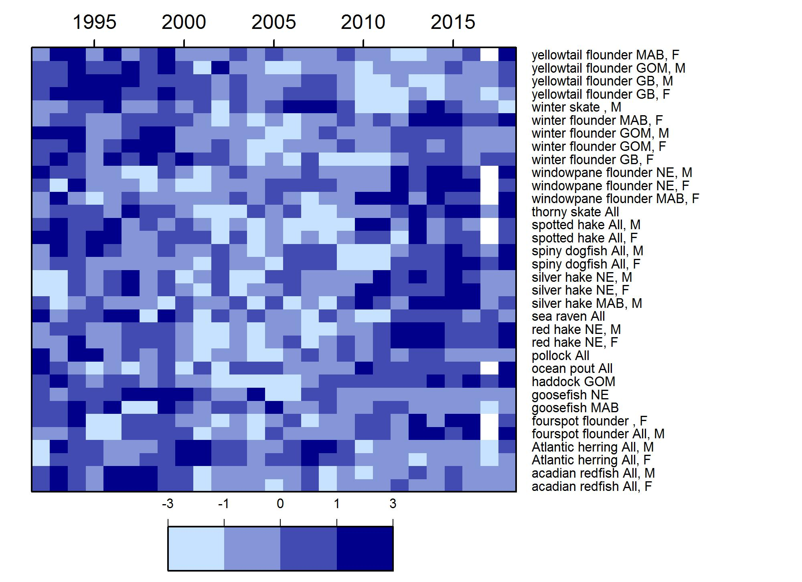

class: top, left

```{r setup, include=FALSE}
source("setup.R")
```


---
## Changing base of the food web: primary production

* Summer PP is increasing in the Mid-Atlantic (and in New England)
  * Driven by warmer temperatures and increased bacterial remineralization and nutrient recycling
  * Increasing primary production likely due to higher productivity of smaller phytoplankton

```{r pp-trends, fig.width=10, fig.height = 5}
out_pp <- ecodata::chl_pp %>%
  filter(EPU %in% c("GOM","GB"),
         str_detect(Var, "MONTHLY_PPD_MEDIAN")) %>%
  separate(.,Time, into = c("Year","Month"), sep = 4) %>%
    mutate(Month = plyr::mapvalues(Month, from = c("01","02","03","04","05","06",
                                                   "07","08","09","10","11","12"),
                                   to = c(month.abb))) %>%
  group_by(EPU, Month) %>%
  mutate(hline = mean(Value))
out_pp$Month <- factor(out_pp$Month, levels = month.abb)


 pp_cci_gb <-out_pp %>%
  filter(EPU == "GB") %>%
 ggplot() +
   # geom_gls(aes(x = Year, y = Value, group = Month))+
    geom_point(aes(x = Year, y = Value, group = Month)) +
    geom_line(aes(x = Year, y = Value, group = Month)) +
    scale_x_discrete(name = "Time", breaks = seq(min(out_pp$Year),max(out_pp$Year),10)) +
    facet_wrap(Month~., ncol = 6) +
    ggtitle("GB Monthly median PPD") +
    ylab(expression("PP (gC m"^-2*" d"^-1*")")) +
        geom_hline(aes(yintercept = hline,
                     group = Month),
           size = hline.size,
           alpha = hline.alpha,
           linetype = hline.lty)+
    theme_facet() +
    theme(axis.text.x = element_text(angle=45, hjust = 1),
          panel.spacing = unit(1, "lines"),
          plot.margin = unit(c(0.1, 0, 0, 0), "cm"))

 pp_cci_gb

```


???
* Driven by warmer temperatures and increased bacterial remineralization and nutrient recycling
* Increasing primary production likely due to higher productivity of smaller phytoplankton


## Changing base of the food web: Zooplankton size structure

* Lower copepod size index means higher abundance of large copepods (<i>Calanus</i>)
* Primary production may play a role in zooplankton size dynamics on the shelf


```{r NE-sli, fig.height = 5, fig.align = "center", fig.width = 8}
source("R/sli_plots.R")
gom_out <- sli_plots("GOM")
gb_out <- sli_plots("GB")

gom_out[[1]] +  gb_out[[1]] +gom_out[[2]] + gb_out[[2]] + plot_layout(ncol=2)
```

???
To assess the size structure of copepods in the region, we use the small-large index.
* A measure of relative size composition of the dominant copepod taxa
* A lower value means higher abundance of large copepods (<i>Calanus</i>)
* Primary production may play a role in copepod size dynamics***


---
## Changing base of the food web and fish conditions

* Fish condition is measured at the weight at a given length relative to the average
  * Drop-off in condition around 2000 aligns with the shift in zooplankton size-structure on the shelf

*NEFMC Condition Factor*
```{r fish-con2, fig.align="center",out.width="75%"}

```


???
Looking at condition in aggregate across all managed stocks, we can see a clear decline in condition between 2000-2010

Recent improvement within past decade

Interestingly, the drop-off in condition around 2000 resembles a shift in zooplankton size-structure on the shelf, and this is a topic for future research

---
## SOE 2019: Improvements to reproducibility and provenance

* Reporting the information is not enough

* Managers appreciate the concise format, but back-end critical for describing collection, analyses, and processing
  
  

???
This workflows also ensures that there's no information lost between SOE cycles. We know exactly how a data set was analyzed and handled so that the data can be updated for next year's reports.

---
## External Resources

* [SOE Technical Documentation](https://noaa-edab.github.io/tech-doc)

* [ecodata R package](https://github.com/noaa-edab/ecodata)

  * [Macrofauna indicators](http://noaa-edab.github.io/ecodata/macrofauna)
  * [Human Dimensions indicators](http://noaa-edab.github.io/ecodata/human_dimensions)
  * [Lower trophic level indicators](http://noaa-edab.github.io/ecodata/LTL)
  
* [ERDDAP server](https://comet.nefsc.noaa.gov/erddap/index.html)

* Slides available at https://noaa-edab.github.io/presentations/20190329_NEFMC_SSC_Hardison.html

---
## Contributors - THANK YOU!

The New England and Mid-Atlantic SOEs made possible by (at least) 38 contributors from 8 intstitutions 

.pull-left[
.contrib[
Donald Anderson (Woods Hole Oceanographic Institute) <br>
Amani Bassyouni (Virginia Department of Health)<br>
Lisa Calvo (Rutgers)<br>
Matthew Camisa (MA Division of Marine Fisheries) <br>
Patricia Clay<br>
Lisa Colburn<br>
Geret DePiper<br>
Deb Duarte<br>
Michael Fogarty<br>
Paula Fratantoni <br>
Kevin Friedland<br>
Sarah Gaichas<br>
James Gartland (Virginia Institute of Marine Science)<br>
Heather Haas<br>
Sean Hardison <br>
Kimberly Hyde<br>
Terry Joyce (Woods Hole Oceanographic Institute)<br>
John Kosik<br>
Steve Kress (National Audubon Society)<br>
Scott Large
]
]

.pull-right[
.contrib[
Don Lyons (National Audubon Society)<br>
Loren Kellogg<br>
David Kulis (Woods Hole Oceanographic Institute)<br>
Sean Lucey<br>
Chris Melrose<br>
Ryan Morse<br>
Kimberly Murray<br>
Chris Orphanides<br>
Richard Pace<br>
Charles Perretti<br>
Karl Roscher (Maryland Department of Natural Resources)<br>
Vincent Saba<br>
Laurel Smith<br>
Mark Terceiro<br>
John Walden<br>
Harvey Walsh<br>
Mark Wuenschel<br>
Qian Zhang (Unversity of Maryland and US EPA Chesapeake Bay Program)
]
]

```{r iea-logo, fig.align="center", out.width = "50%"}
knitr::include_graphics("20190329_NEFMC_SSC_Hardison_images/noaa-iea.png")
```


