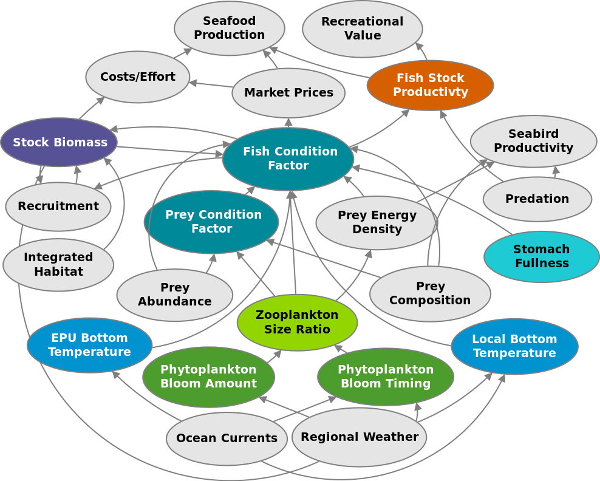
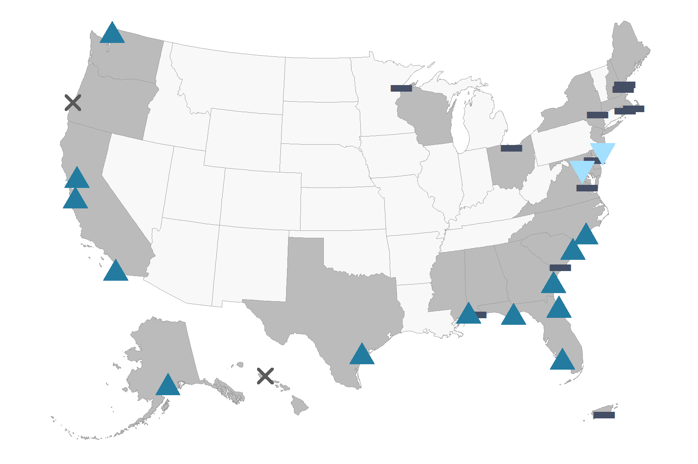

class: top, left

```{r setup, include=FALSE}

options(htmltools.dir.version = FALSE)
knitr::opts_chunk$set(echo = F,
                      warning = F,
                      message = F)
#Plotting and data libraries
library(tidyverse)
library(tidyr)
library(ecodata)
library(here)
library(kableExtra)
library(ggrepel)
library(patchwork)
library(grid)
library(ggiraph)
library(vegan)
library(rpart)
library(ks)
library(cowplot)

#GIS libraries
library(sf)
library(rgdal)
library(raster)
library(rnaturalearth)

data.dir <- here::here("data")
gis.dir <- here::here("data")

#General inline text input for report
#Council
council <- "New England Fishery Management Council"
council_abbr <- "NEFMC"

#Region identifiers
epu <- "New England"
epu_abbr <- c("GOM","GB")
region <- "New England"
region_abbr <- "NE" #Some commercial data organized by "MA" or "NE" regions, not by EPU 

#Time series constants
shade.alpha <- 0.3
shade.fill <- "lightgrey"
lwd <- 1
pcex <- 2
trend.alpha <- 0.5
trend.size <- 2
hline.size <- 1
hline.alpha <- 0.35
hline.lty <- "dashed"
label.size <- 5
hjust.label <- 1.5
letter_size <- 4
feeding.guilds1<- c("Piscivore","Planktivore","Benthivore","Benthos")
feeding.guilds <- c("Apex Predator","Piscivore","Planktivore","Benthivore","Benthos")
x.shade.min <- 2009
x.shade.max <- 2019
#Function for custom ggplot facet labels
label <- function(variable,value){
  return(facet_names[value])
}

#CRS
crs <- "+proj=longlat +lat_1=35 +lat_2=45 +lat_0=40 +lon_0=-77 +x_0=0 +y_0=0 +datum=NAD83 +no_defs +ellps=GRS80 +towgs84=0,0,0"

#Coastline shapefile
coast <- ne_countries(scale = 10,
                          continent = "North America",
                          returnclass = "sf") %>%
             sf::st_transform(crs = crs)

#State polygons
ne_states <- ne_states(country = "united states of america",
                                      returnclass = "sf") %>%
  sf::st_transform(crs = crs)

#high-res polygon of Maine
#new_england <- read_sf(gis.dir,"new_england")

#EPU shapefile
epu_sf <- ecodata::epu_sf %>% 
  filter(EPU %in% c("MAB","GB","GOM"))

#Map line parameters
map.lwd <- 0.4

# Set lat/lon window for maps
xmin = -77
xmax = -65
ymin = 36
ymax = 45
xlims <- c(xmin, xmax)
ylims <- c(ymin, ymax)

```

# Today's Talk

.pull-left[

- Review of Ecosystem reporting for NEFMC

- New! Response memo

- 2020 New England Report

- SSC discussion and feedback
]

.pull-right[
*The IEA Loop<sup>1</sup>*

]

.footnote[
[1] https://www.integratedecosystemassessment.noaa.gov/national/IEA-approach
]

???

---
## State of the Ecosystem (SOE) Reporting: Context for busy people

*"So what?" --John Boreman, September 2016*

1. Clear linkage of ecosystem indicators with management objectives

1. Synthesis across indicators for big picture

1. Objectives related to human-well being placed first in report

1. Short (< 30 pages), non-technical (but rigorous) text

1. Emphasis on reproducibility 

.center[

]

???
In 2016, we began taking steps to address these common critiques of the ESR model

---
## State of the Ecosystem 2020: Response Memo

Our response to the need for more formal response to comments!

  * 30 comments or requests from 2019
  * One addressed by having the response memo
  * 21 addressed within the SOE at SSC/Council request
    * New summary section with synthetic overview addresses 3 requests
    * 5 new indicators added 
    * 3 existing indicators modified
    * 5 editorial updates 
    * 5 partially addressed requests
  * 8 not currently addressed within SOE
    * 2 have information summaries in the response memo
    * 2 may be addressed by student projects 
    * 1 needs feedback on how to deal with known data issue
    * 1 seeking data
    * 1 relevant to 2019 visualization that was replaced in 2020
    * 1 beyond capacity to address at present
    
SSC feedback requested on the approach and all details, memo has specific questions

---
## State of the Ecosystem 2020: Structure
.pull-left[

### Report Structure
1. Summary 2 pager

1. Human dimensions

1. Protected species

1. Fish and invertebrates (managed and otherwise)

1. Habitat quality and ecosystem productivity
]

.pull-right[

*Established ecosystem-scale objectives in New England*

```{r management-objectives}
mng_obj <- data.frame("Objective Categories" = c("Seafood Production",
                                                 "Profits","Recreation",
                                                 "Stability","Social & Cultural",
                                                 "Biomass","Productivity",
                                                 "Trophic structure","Habitat"),
"Indicators reported here" = c("Landings by feeding guild","Revenue decomposed to price and volume",
                               "Days fished; recreational catch",
                               "Diversity indices (fishery and species)",
                               "Commercial engagement trends",
                               "Biomass or abundance by feeding guild from surveys",
                               "Condition and recruitment of managed species, Primary productivity",
                               "Relative biomass of feeding guilds, Zooplankton",
                               "Estuarine and offshore habitat conditions"))

#knitr::kable(mng_obj, linesep = "",
mng_obj %>%
      #col.names = c("Objective Categories","Indicators reported here") %>%
      #caption = "Established ecosystem-scale objectives in the Mid-Atlantic Bight",
      #align = 'c',
      #booktabs = T) %>%
  #kable_styling(latex_options = "hold_position", "scale_down") %>%
 # column_spec(c(2), width = c("25em")) %>%
  kable(format = "html", escape = F, table.attr='class="risktable"',
        col.names = c("Objective Categories","Indicators reported here")) %>%
  kable_styling(font_size = 14) %>%
  row_spec(0, bold = TRUE)


```
]

---
## Memo 1-2: Summary 2 pager with visualizations

.pull-left[

]

.pull-right[

]

---
## Memo 3: Indicator uncertainty

```{r gb-biomass-ne, fig.cap = paste0("Spring (left) and fall (right) NEFSC surveyed biomass on Georges Bank. The shaded area around each annual mean represents 2 standard deviations from the mean."), fig.width=10, fig.asp = 0.75}

agg<-ecodata::aggregate_biomass %>% 
  dplyr::filter(!stringr::str_detect(Var, "Apex|inshore|offshore|managed|NEFMC|MAFMC|JOINT|NA")) %>% #remove unused datasets
  tidyr::separate(Var, c("feeding.guild", "season", "Biomass", "Var1"), sep = " ") %>% 
  tidyr::unite("Var", feeding.guild:season, sep = " ") %>% 
  dplyr::mutate(stat = recode(Var1, Index = "Mean", 
                      Standard = "SD")) %>% 
  dplyr::select(-Biomass, -Var1) %>% 
  dplyr::group_by(Var, Time, EPU) %>% 
  tidyr::spread(stat, Value) %>% 
  dplyr::mutate(upper = Mean + (2*SD), 
         lower = Mean - (2*SD))


agg_bio<-agg %>% dplyr::filter(EPU %in% c(epu_abbr),
         Time >= 1968) %>% 
  dplyr::group_by(Var, EPU) %>% 
  dplyr::mutate(hline = mean(Mean, na.rm = T)) %>% 
  dplyr::ungroup() 

agg_bio$Var <- factor(agg_bio$Var,levels = c("Piscivore Spring",
                                                   "Piscivore Fall",
                                                    "Benthivore Spring",
                                                   "Benthivore Fall",
                                                    "Planktivore Spring",
                                                    "Planktivore Fall",
                                                    "Benthos Spring",
                                                   "Benthos Fall"))
series.col <- rep("black",length(unique(agg_bio$Var)))
facet_names <- list("Piscivores" = expression("Piscivores"),
                    "Planktivores" = expression("Planktivores"),
                    "Benthivores" = expression("Benthivores"),
                    "Benthos" = expression("Benthos"))

gb_surv <- agg_bio %>% 
  filter(EPU == "GB") 

## plot 1
p1<- gb_surv %>% 
  filter(str_detect(Var, "Piscivore")) %>% 
  ggplot(aes(x = Time, y = Mean)) +
  
  #Highlight last ten years
  annotate("rect", fill = shade.fill, alpha = shade.alpha,
      xmin = x.shade.min , xmax = x.shade.max,
      ymin = -Inf, ymax = Inf) +
  
  #Test for trend and add lines
  geom_gls(aes(x = Time, y = Mean,
               color = Var),
             alpha = trend.alpha, size = trend.size) +
  
  #Add time series
  geom_ribbon(aes(x = Time, ymin = pmax(lower,0), ymax = upper), 
              alpha = 0.5,
              fill = "grey") + 
  geom_line(size = lwd-0.5) +
  geom_point(size = pcex-0.5) +
  scale_color_manual(values = series.col, aesthetics = "color")+
  guides(color = FALSE) +
  geom_hline(aes(yintercept = hline,
                 group = Var),
             size = hline.size,
             alpha = hline.alpha,
             linetype = hline.lty)+

  #Facet 
  facet_wrap(Var~., ncol = 2) +
 
  #Axis and theme
  scale_x_continuous(breaks = seq(1965, 2015, by = 10), expand = c(0.01, 0.01)) +
  ylab(expression("Biomass (kg tow"^-1*")")) +
  #ggtitle("GB NEFSC BTS") +
  theme_facet()+
  theme(strip.text=element_text(hjust=0),
        axis.title.x=element_blank())

## plot 2
p2<- gb_surv %>% 
  filter(str_detect(Var, "Benthivore")) %>% 
  ggplot(aes(x = Time, y = Mean)) +
  
  #Highlight last ten years
  annotate("rect", fill = shade.fill, alpha = shade.alpha,
      xmin = x.shade.min , xmax = x.shade.max,
      ymin = -Inf, ymax = Inf) +
  
  #Test for trend and add lines
  geom_gls(aes(x = Time, y = Mean,
               color = Var),
             alpha = trend.alpha, size = trend.size) +
  
  #Add time series
  geom_ribbon(aes(x = Time, ymin = pmax(lower,0), ymax = upper), 
              alpha = 0.5,
              fill = "grey") + 
  geom_line(size = lwd-0.5) +
  geom_point(size = pcex-0.5) +
  scale_color_manual(values = series.col, aesthetics = "color")+
  guides(color = FALSE) +
  geom_hline(aes(yintercept = hline,
                 group = Var),
             size = hline.size,
             alpha = hline.alpha,
             linetype = hline.lty)+

  #Facet 
  facet_wrap(Var~., ncol = 2) +
  #Axis and theme
  scale_x_continuous(breaks = seq(1965, 2015, by = 10), expand = c(0.01, 0.01)) +
  ylab(expression("Biomass (kg tow"^-1*")")) +
  theme_facet()+
  theme(strip.text=element_text(hjust=0),
        axis.title.x=element_blank())

## plot 3
p3<- gb_surv %>% 
  filter(str_detect(Var, "Planktivore")) %>% 
  ggplot(aes(x = Time, y = Mean)) +
  
  #Highlight last ten years
  annotate("rect", fill = shade.fill, alpha = shade.alpha,
      xmin = x.shade.min , xmax = x.shade.max,
      ymin = -Inf, ymax = Inf) +
  
  #Test for trend and add lines
  geom_gls(aes(x = Time, y = Mean,
               color = Var),
             alpha = trend.alpha, size = trend.size) +
  
  #Add time series
  geom_ribbon(aes(x = Time, ymin = pmax(lower,0), ymax = upper), 
              alpha = 0.5,
              fill = "grey") +
  geom_line(size = lwd-0.5) +
  geom_point(size = pcex-0.5) +
  scale_color_manual(values = series.col, aesthetics = "color")+
  guides(color = FALSE) +
  geom_hline(aes(yintercept = hline,
                 group = Var),
             size = hline.size,
             alpha = hline.alpha,
             linetype = hline.lty)+
 
  #Facet 
  facet_wrap(Var~., ncol = 2) +

  #Axis and theme
  scale_x_continuous(breaks = seq(1965, 2015, by = 10), expand = c(0.01, 0.01)) +
  ylab(expression("Biomass (kg tow"^-1*")")) +
  theme_facet()+
  theme(strip.text=element_text(hjust=0),
        axis.title.x=element_blank())

## plot 4
p4<- gb_surv %>% 
  filter(str_detect(Var, "Benthos")) %>% 
  ggplot(aes(x = Time, y = Mean)) +
  
  #Highlight last ten years
  annotate("rect", fill = shade.fill, alpha = shade.alpha,
      xmin = x.shade.min , xmax = x.shade.max,
      ymin = -Inf, ymax = Inf) +
  
  #Test for trend and add lines
  geom_gls(aes(x = Time, y = Mean,
               color = Var),
             alpha = trend.alpha, size = trend.size) +
  
  #Add time series
    geom_ribbon(aes(x = Time, ymin = pmax(lower,0), ymax = upper), 
              alpha = 0.5,
              fill = "grey") + 
  geom_line(size = lwd-0.5) +
  geom_point(size = pcex-0.5) +
  scale_color_manual(values = series.col, aesthetics = "color")+
  guides(color = FALSE) +
  geom_hline(aes(yintercept = hline,
                 group = Var),
             size = hline.size,
             alpha = hline.alpha,
             linetype = hline.lty)+

  #Facet 
  facet_wrap(Var~., ncol = 2) +

  #Axis and theme
  scale_x_continuous(breaks = seq(1965, 2015, by = 10), expand = c(0.01, 0.01)) +
  ylab(expression("Biomass (kg tow"^-1*")")) +
  theme_facet()+
  theme(strip.text=element_text(hjust=0),
        axis.title.x=element_blank())

ptitle <- ggdraw() + 
  draw_label(
    "GB NEFSC BTS",
    fontface = 'bold',
    x = 0,
    hjust = 0
  ) +
  theme(
    # add margin on the left of the drawing canvas,
    # so title is aligned with left edge of first plot
    plot.margin = margin(0, 0, 0, 7)
  )

plot_grid(ptitle, p1, p2, p3, p4, nrow=5,   rel_heights = c(0.1, 1,1,1,1))

```

---
## Memo 3: Indicator uncertainty questions: try model based (VAST)?


  
---
## Memo 3: Indicator uncertainty questions: VAST? plus

.pull-left[

]

.pull-right[
Uncertainty already included in:
  * Right whale abundance
  
Uncertainty difficult to include in:
  * Landings
  * Some diversity indices
  * Condition and productivity plots
  
]


## Priorities for uncertainty in other indicators?

## Recommended methods?

---
## Memo 4: Downeast ME (EPU-survey strata update)
.center[

]

---
## Memo 5: Link zooplankton, fish condition

.pull-left[

]

.pull-right[

]

Conceptual model links indicators in the report with management objectives.

A subset of objectives are currently under investigation using GAMs. We plan to extend this work with structural equation modeling and or other methods in 2020. 

---
## Memo 6: Ocean Acidification

NOAA is finalizing an Ocean Acidification research plan<sup>1</sup>. 

Work is in progress to to bolster monitoring and to develop a baseline climatology for our region. 

.center[

]

A time series indicator may be several years away. Until then, we seek feedback on what available information (for example, initial monitoring<sup>2</sup>) would be useful to the Councils right now.

.footnote[
[1] https://sab.noaa.gov/sites/SAB/Meetings/2019_Documents/Dec_Meeting/2020%20OA%20Research%20Plan%20DRAFT%20External%20Review.pdf
[2] https://www.aoml.noaa.gov/ocd/ocdweb/occ_oa.html
]
---
## Memo 7: Gulf Stream and Labrador Current

.pull-left-40[
```{r GSI, fig.width = 5, fig.asp = 0.45, fig.cap = "Index representing changes in the location of the Gulf Stream north wall. Positive values represent a more northerly Gulf Stream position."}
gsi %>% 
  mutate(Year = floor(Time)) %>% 
  group_by(Year) %>% 
  dplyr::summarise(Value = mean(Value)) %>% 
  mutate(hline = mean(Value)) %>% 
  dplyr::rename(Time = Year) %>% 
  ggplot(aes(x = Time, y = Value)) +
         annotate("rect", fill = shade.fill, alpha = shade.alpha,
      xmin = x.shade.min , xmax = x.shade.max,
      ymin = -Inf, ymax = Inf) +
  geom_gls() +
  geom_line() +
  geom_point() +
  ylab("Gulf Stream position anomaly") +
  xlab(element_blank())+
  ggtitle("Gulf Stream Index") +
    scale_x_continuous(expand = c(0.01, 0.01))+
      geom_hline(aes(yintercept = hline),
           size = hline.size,
           alpha = hline.alpha,
           linetype = hline.lty)+
  theme_ts() +
  theme(axis.title.y = element_text(size = 8),
        strip.text=element_text(hjust=0,
                                face = "italic"))
```
]

.pull-right-60[
```{r wsw-prop, fig.width=6, fig.asp = 0.45, fig.cap = "Proportion of Warm Slope Water (WSW) and Labrador slope water (LSLW) entering the GOM through the Northeast Channel."}

sw.df <- slopewater %>% 
  mutate(Var, Var = plyr::mapvalues(Var, from = c("WSW proportion ne channel",
                                                  "LSLW proportion ne channel"),
                                    to = c("WSW","LSLW"))) %>% 
  dplyr::rename(Flavor  = Var) %>% 
  group_by(Flavor) %>% 
  mutate(hline = mean(Value)) 

sw.df$Origin <- factor(sw.df$Flavor, levels = c("WSW","LSLW"))

ggplot(data = sw.df) +
  geom_line(aes(x = Time, y = Value, color = Origin))+
  geom_point(aes(x = Time, y = Value, color = Origin)) +
  ylab("Percent of Total Slopewater") +
  xlab(element_blank())+
  ggtitle("Slopewater Proportions in NE Channel")+
  scale_x_continuous(expand = c(0.01, 0.01))+
  geom_hline(aes(yintercept = hline, color = Origin),
           size = hline.size, alpha = hline.alpha,
           linetype = hline.lty)+
  theme_ts() 

```
]


## Memo 11: Warm Core Rings

.center[
```{r warm-core-rings, fig.width = 6, fig.asp = 0.45, fig.cap= "Interannual Variability of the WCR formation between 1980 and 2019. The regime shift (denoted by the split in the red solid line) is significant at the turn of the century.  Figure reproduced with permission from Gangopadhyay, et al. (2019).  2018 and 2019 data points based on personal communication with A. Gangopadhyay (2020)."}
upper.line<-ecodata::wcr %>%
  filter(Time>2000) %>% 
  mutate(hline = c(mean(Value)))
lower.line<-ecodata::wcr%>%
  filter(Time<2000) %>% 
  mutate(hline = c(mean(Value)))
wcr<- upper.line %>% 
  rbind(lower.line)

wcr %>% 
  ggplot(aes(x = Time, y = Value))+
  geom_point()+
  geom_line()+
  annotate("rect", fill = shade.fill, alpha = shade.alpha,
      xmin = x.shade.min , xmax = x.shade.max,
      ymin = -Inf, ymax = Inf) +
  ylab("Warm Core Ring Births")+
  xlab(element_blank())+
  ggtitle("Warm Core Rings")+
  theme_ts()+
  geom_segment(data = upper.line, aes(x = min(Time), y = hline, 
                                      xend = max(Time), yend = hline, color = "segment") )+
  geom_segment(data = lower.line, aes(x = min(Time), y = hline, 
                                      xend = max(Time), yend = hline, color = "segment") )+
  theme(legend.position = "none")
```
]

???
MAFMC requested that this indicator be included (in past years it was in the New England report only).

---
.pull-left-30[
## Memo 8: PP Source

Satellite for all indicators
]

.pull-right-70[
.center[

]
]

## Memo 9: Shellfish Growth

Roger Mann (VIMS) looking to fund student at NEFSC to evaluate

## Memo 10: Power Plants

Unable to address this aspect of estuarine water quality this year, but see 13

---
.pull-left[
## Memo 12: Cold Pool Index

```{r cold-pool, fig.width = 6, fig.asp = 0.45, eval = T, echo = F, fig.cap="Temperature anomaly in cold pool region, defined as the area with a mean September-October bottom temperature <12°C from 1963 to 2013." }

ecodata::cold_pool %>% 
    mutate(hline = mean(Value, na.rm = T)) %>% 
  ggplot() + 
 #Highlight last ten years
  annotate("rect", fill = shade.fill, alpha = shade.alpha,
      xmin = x.shade.min , xmax = x.shade.max,
      ymin = -3, ymax = 3) +
  geom_gls(aes(x = Time, y = Value),
             alpha = trend.alpha, size = trend.size) +
  geom_line(aes(x = Time, y = Value), size = lwd) +
  geom_point(aes(x = Time, y = Value), size = pcex) +
    geom_hline(aes(yintercept = hline),
     size = hline.size,
     alpha = hline.alpha,
     linetype = hline.lty)+
  ggtitle("Cold Pool Index")+
  ylab(expression("Cold Pool Temp Anomaly (C) ")) +
  xlab("")+
  theme(axis.title.y = element_text(size = 8))+
  theme_ts()
```

Temperature change within the cold pool vs. volume or other metric?
]

.pull-right[

]

---
## Memo 13: Estuarine Water Quality

.pull-left[
*Chesapeake Bay water quality update* 
```{r cb-salinity,fig.width = 5, fig.asp = 0.45, fig.cap = "Salinity in Chesapeake Bay throughout 2018 (blue) and 2019 (red)  as well as the daily average 2008-2019 (black) and the full observed range 2008-2019 (gray shading)."}

ches_sal<-ecodata::ch_bay_sal %>% 
  filter(!Var == "UTCTime") %>% 
  drop_na() %>%
  mutate(Time =  as.numeric(str_sub(Time, 2, -1)),
         Time1 = as.Date(Time, origin = "2018-12-31")) %>% 
  pivot_wider(names_from = Var, values_from = Value)

ches_sal %>% 
  ggplot() +
  geom_ribbon(aes(x = Time1, ymin = AvgMinLim, ymax = AvgMaxLim))+
  geom_ribbon(aes(x = Time1, ymin = MinDataLim, ymax = MaxDataLim), alpha = 0.3)+
  geom_line(aes(x = Time1, y = Daily18), color = "blue") +
  geom_line(aes(x = Time1, y = Daily19), color = "red") +
  ylab(expression("PSU")) +
  ggtitle("Chesapeake Bay Salinity") +
  theme_ts()
```

High precipitation let to extreme low salinity event in spring 2019

<br />
 
## What spatial scale to combine NERR data?

## What indicators of most interest?

## Use existing thresholds?

]

.pull-right[
*How best to incorporate NERR data?*



]

---
## Memo 14: Link Environment and Society

*Primary Production Required to support landings (see also Memo 5, Memo 15)*
.pull-left[
```{r ppr-ne, fig.cap="Primary production required to support the commercial landings on Georges Bank (left) and in the Gulf of Maine (right). Included are the top species accounting for 80\\% of the landings in each year, with 15\\% transfer efficiency assumed between trophic levels.", fig.width = 4, fig.asp = 0.75}

ecodata::ppr %>% 
  group_by(EPU) %>% 
  mutate(hline = mean(Value)) %>% 
  filter(EPU != "MAB") %>% 
  ggplot() +
  annotate("rect", fill = shade.fill, alpha = shade.alpha,
      xmin = x.shade.min , xmax = x.shade.max,
      ymin = -Inf, ymax = Inf) +
  geom_point(aes(x = Time, y = Value))+
  geom_line(aes(x = Time, y = Value))+
  geom_hline(aes(yintercept = hline),
           size = hline.size,
           alpha = hline.alpha,
           linetype = hline.lty)+
  scale_x_continuous(expand = c(0.01, 0.01)) +
  expand_limits(y=0) +
  facet_wrap(. ~ EPU, ncol = 1,
             labeller = 
               labeller(EPU = c(GB = "Georges Bank", 
                                GOM = "Gulf of Maine")))+
  ggtitle("Primary Production Required")+
  ylab("Proportion of Total PPD")+
  theme_ts()
```


## Transfer efficiency 15%

## Unlagged landings and primary production

## Landings threshold 80%

## Which sensitivities to explore?
]

.pull-right[
*Georges Bank species comprising 80% of landings*

]

---
## New Indicator: Fishery links to society

.center[ 

```{r NE-comm-eng, message=F, fig.width = 10, fig.asp = 0.4, fig.cap= "Commercial engagement scores (total pounds landed, value landed, commercial permits, and commercial dealers in a community)  for New England fishing communities, 2004-2018."}

eng<-ecodata::engagement %>% 
  filter(!Var == "med.high.scores")
eng$Var <- factor(eng$Var, levels = c("%High","%Medium High","%Moderate", "%Low"))

engbar <- eng %>% filter(EPU == "NE") %>% 
  ggplot()+
   #ylim(0.8, NA)+
  geom_bar(aes(x = Time, y = Value, 
               fill = Var), 
           stat = "identity")+
  #scale_y_continuous(labels = Value(suffix = "%", prefix = "")) +
  #geom_text(aes(x = Time, y = Value,
  #             label = paste0(Value,"%")), size=4) +
  theme(#legend.position="bottom", legend.direction="horizontal",
        legend.title = element_blank())+
  coord_cartesian(ylim=c(0.75,1))+
  xlab("Time") +
  ylab("% Communities in each category (Low to High)")+
  ggtitle("Commercial Engagement")+
  theme_ts()


mhtrend <- ecodata::engagement %>% 
  filter(Var == "med.high.scores", 
         EPU == "NE") %>% 
  mutate(hline = mean(Value)) %>% 
  ggplot()+
  annotate("rect", fill = shade.fill, alpha = shade.alpha,
      xmin = x.shade.min , xmax = x.shade.max,
      ymin = -Inf, ymax = Inf) +
  geom_line(aes(x = Time, y = Value), size = lwd) +
  geom_point(aes(x = Time, y = Value), size = pcex) +
  scale_x_continuous(expand = c(0.01, 0.01)) +
  expand_limits(y=0) +
  ggtitle("Medium-High communities ") +
  ylab(expression("Average score for Med High communities")) +
  geom_hline(aes(yintercept = hline),
           size = hline.size,
           alpha = hline.alpha,
           linetype = hline.lty) +
 theme_ts()

cowplot::plot_grid(engbar, 
                   mhtrend,
                   ncol = 2, 
                   align = "h", 
                   rel_widths = c(1, 0.7)) +
    theme(plot.margin = unit(c(0.1, 0, 0, 0), "cm"))

```
]

Increase in highly engaged New England communities; changing score driven by scallop and lobster value? 

```{r bennet-ne, fig.cap = paste0("Revenue change from the 2015 base year in 2015 dollars (black), Price (PI), and Volume Indicators (VI) for commercial benthos landings on Georges Bank (left) and for commercial benthivore landings in the Gulf of Maine (right)"), fig.height = 3.5, fig.width=10}

#Filter data into two dataframes for plotting

indicators <- ecodata::bennet %>% 
  filter(!EPU == "MAB") %>% 
  filter(stringr::str_detect(Var, pattern="Benth"),
         #!Var == "Total Revenue Change - Bennet", 
         !Time < 1985) %>% 
  mutate(Var, Var = plyr::mapvalues(Var, from = c("Benthos Value Index - Bennet","Benthos Price Index - Bennet","Benthivore Value Index - Bennet","Benthivore Price Index - Bennet"),
                                    to = c("Benthos Volume","Benthos Price","Benthivore Volume","Benthivore Price"))) 
revchange1<-indicators %>% 
  group_by(Time, EPU) %>% 
  summarise(revchange.line = sum(Value))


revchange <- ecodata::bennet %>% 
  filter(!EPU == "MAB",
         Var %in% c("Total Revenue Change - Bennet"),
         !Time<1985)
revchange.gom<-revchange1 %>% 
  filter(EPU == "GOM") 
revchange.gb<-revchange1 %>% 
  filter(EPU == "GB")
#custom bar fill color (color-blind friendly)
ind_fill <- c("#a6cee3", "#b2df8a")

#limits
y.lim <- c(-350,350)

#plot

gom_bennet <- indicators %>% 
  filter(EPU == "GOM", 
         stringr::str_detect(Var, pattern="Benthivore")) %>% 
ggplot()+
  
  #Highlight last ten years
  annotate("rect", fill = shade.fill, alpha = shade.alpha,
      xmin = x.shade.min , xmax = x.shade.max,
      ymin = -Inf, ymax = Inf)+
  #guides(color = F, fill = F)+
  geom_bar(aes(x=Time, y= Value, fill = Var), stat="identity")+
  scale_fill_manual(name = "Indicators", values = ind_fill, guide = FALSE) +
  geom_line(data = revchange.gom, 
            aes(x = Time, y = revchange.line, colour = "$"))+
  scale_colour_grey(name ="Revenue Change") +
  ggtitle("Gulf of Maine Benthivore Component")+
  labs(y="Value $1,000,000 ($2015)") +
  scale_x_continuous(breaks = seq(1965, 2015, by = 10), expand = c(0.01, 0.01)) +
  scale_y_continuous(breaks = seq(y.lim[1], y.lim[2], by = 100), limits = y.lim,
                     expand = c(0.01, 0.01)) +
  theme_ts() +
  theme(title = element_text(size = 10))+
  theme(legend.position="bottom", legend.direction = "horizontal",
        legend.background = element_rect(fill = "transparent"), 
        legend.title = element_blank(), legend.text = element_blank())

gb_bennet <- indicators %>% 
  filter(EPU == "GB", 
         stringr::str_detect(Var, pattern="Benthos")) %>% 
ggplot()+
  
  #Highlight last ten years
  annotate("rect", fill = shade.fill, alpha = shade.alpha,
      xmin = x.shade.min , xmax = x.shade.max,
      ymin = -Inf, ymax = Inf)+
  
  geom_bar(aes(x=Time, y= Value, fill = Var), stat="identity")+
  scale_fill_manual(name = "Indicators", values = ind_fill) +
  geom_line(data = revchange.gb, 
            aes(x = Time, y = revchange.line, colour = "$"))+
  scale_colour_grey(name ="Revenue Change") +
  ggtitle("Georges Bank Benthos Component")+
  labs(y="") +
  scale_x_continuous(breaks = seq(1965, 2015, by = 10), expand = c(0.01, 0.01)) +
  scale_y_continuous(breaks = seq(y.lim[1], y.lim[2], by = 100), limits = y.lim, expand = c(0.01, 0.01)) +
  theme_ts() +
  theme(title = element_text(size = 10)) +
  theme(legend.position="bottom", legend.direction = "horizontal",
        legend.background = element_rect(fill = "transparent"), 
        legend.title = element_text(size = 8), 
        legend.text = element_text(size = 8)) +
  guides(color = guide_legend(order = 1),
         fill = guide_legend(order = 0))

#cowplot::plot_grid(gom_bennet, gb_bennet, ncol = 2, rel_widths = c(0.7,1))

g_legend<-function(a.gplot){
  tmp <- ggplot_gtable(ggplot_build(a.gplot))
  leg <- which(sapply(tmp$grobs, function(x) x$name) == "guide-box")
  legend <- tmp$grobs[[leg]]
  return(legend)}
mylegend<-g_legend(gb_bennet)
p3 <- gridExtra::grid.arrange(gridExtra::arrangeGrob(gb_bennet + theme(legend.position="none"),
                         gom_bennet + theme(legend.position="none"),
                         nrow=1),
             mylegend, nrow=2,heights=c(6, 1))

```

---
## Memo 15: Wind Energy Habitat Overlap

```{r wind-habitat-table, eval = T, echo = F, fig.cap='', out.width='80%'}
wind1 <- ecodata::wind_occupancy

wind1$trend<- ifelse(wind1$Trend == "pos", 
                    "$\\nearrow$",
                    ifelse(wind1$Trend == "neg",
                    "$\\searrow$", 
                    " ")) 


wind2<-wind1 %>% dplyr::select(Area, Season, Species, trend)
names<-c("Area", "Season", "Species", "trend")
bnew<-c("Area.1", "Season.1", "Species.1", "trend.1")
cnew<-c("Area.2", "Season.2", "Species.2", "trend.2")
dnew<-c("Area.3", "Season.3", "Species.3", "trend.3")
enew<-c("Area.4", "Season.4", "Species.4", "trend.4")

a<-wind2 %>% filter(Area == "Existing-North") 
b<-wind2 %>% filter(Area == "Proposed-North") %>% 
  dplyr::rename_at(vars(names), ~ bnew)
c<-wind2 %>% filter(Area == "Existing-Mid")%>% 
  dplyr::rename_at(vars(names), ~ cnew)
d<-wind2 %>% filter(Area == "Proposed-Mid")%>% 
  dplyr::rename_at(vars(names), ~ dnew)
e<-wind2 %>% filter(Area == "Existing-South")%>% 
  dplyr::rename_at(vars(names), ~ enew)

all<- a %>% cbind(b,c,d,e) %>% 
  dplyr::select(2:4,7:8,11:12,15:16,19:20) #%>% 
  # rename(Trend = trend, 
  #        Species = Species.1, 
  #        Trend = trend.1, 
  #        Species = Species.2, 
  #        Trend = trend.2, 
  #        Species = Species.3, 
  #        Trend = trend.3, 
  #        Species = Species.4, 
  #        Trend = trend.4 )
  
kable(all, format = "html", escape = F, table.attr='class="risktable"',
      col.names = c("Season", "Species", "Trend", "Species", "Trend", "Species","Trend", "Species","Trend", "Species", "Trend")) %>%
      #caption = "Species with highest probability of occupancy species each season and area, with observed trends",
      #align = 'c',
      #booktabs = T) %>%
    add_header_above(c(" " = 1, "Existing - North" = 2, "Proposed - North" = 2, 
                     "Existing - Mid" = 2, "Proposed - Mid" = 2, 
                     "Existing - South" = 2)) %>%
  #kable_styling(latex_options = c("hold_position", "scale_down")) 
  kable_styling(font_size = 11) %>%
  row_spec(0, bold = TRUE)
```

.pull-left[
```{r wind-hab, eval = T, echo = F, fig.height = 6, fig.cap="Map of BOEM existing (black) and proposed (red) lease areas in North (N), Mid (M) and South (S) portions of the coast as of February 2019.", message=FALSE, results=FALSE}
library(rnaturalearthhires)
library(sf)
library(raster)
library(ggspatial)
library(marmap)

crs <- "+proj=longlat +lat_1=35 +lat_2=45 +lat_0=40 +lon_0=-77 +x_0=0 +y_0=0 +datum=NAD83 +no_defs +ellps=GRS80 +towgs84=0,0,0"
#gis.dir <- here::here("data-raw/gis")
nesbath <- fortify.bathy(getNOAA.bathy(lon1 = -77, lon2 = -65, lat1 = 35, lat2 = 45,
              resolution = 5))

lease_s<-st_read(file.path(gis.dir, 'BOEM lease areas/ne_existing_leasesSPoly.shp'))
lease_n<-st_read(file.path(gis.dir, 'BOEM lease areas/ne_existing_leasesNPoly.shp'))
lease_m<-st_read(file.path(gis.dir, 'BOEM lease areas/ne_existing_leasesMPoly.shp'))
prop_n<-st_read(file.path(gis.dir, 'BOEM lease areas/ne_proposed_leases_NPoly.shp'))
prop_m<-st_read(file.path(gis.dir, 'BOEM lease areas/ne_proposed_leases_MPoly.shp'))

invisible(st_crs(lease_s)<-crs)
invisible(st_crs(lease_n)<-crs)
invisible(st_crs(lease_m)<-crs)
invisible(st_crs(prop_n)<-crs)
invisible(st_crs(prop_m)<-crs)

ggplot() +
  geom_raster(data = nesbath, aes(x=x,y=y, fill = z)) +
  scale_fill_gradientn(colors =c("lightcyan","lightblue4"))+
  geom_sf(data = coast, size = map.lwd) +
  geom_sf(data = epu_sf, fill = "transparent", size = map.lwd) +
  geom_sf(data = lease_s, size = map.lwd, color = "black")+
  geom_sf(data = lease_n, size = map.lwd, color = "black")+
  geom_sf(data = lease_m, size = map.lwd, color = "black")+
  geom_sf(data = prop_n, size = map.lwd, color = "red3")+
  geom_sf(data = prop_m, size = map.lwd, color = "red3")+
  coord_sf(crs = crs, xlim = c(-77, -69), ylim = c(36,42))+
  geom_segment(aes(x = -74.6, y = 37.4, xend =-75.4, yend =38), colour = "blue4")+
  geom_segment(aes(x = -71.1, y = 40.2, xend =-71.6, yend =41.1), colour = "blue4")+
  annotate("text", x = -74.9, y = 37, label = "S")+
  annotate("text", x = -73.5, y = 38.7, label = "M")+
  annotate("text", x = -70.5, y = 40.2, label = "N")+
  annotation_scale(location = "br", width_hint = 0.4) +
  theme_bw( ) +
  ylab("")+
  xlab("")+
  theme(legend.position = "none") +
  ggtitle("BOEM lease areas")

``` 
]

.pull-right[
## Fishery overlap to be added

## What habitat model outputs most useful?
]
---
## Memo 16: Other Social Science Indicators

Included https://www.st.nmfs.noaa.gov/humandimensions/social-indicators/

## Memo 17: Management Complexity

Define how to use indicator to refine further

## Memo 18: SAFMC and ASMFC Species

.pull-left[
Unchanged NE rec. catch diversity trend

```{r rec-div, fig.width = 5, fig.asp = 0.45, fig.cap = paste0("Recreational effort diversity and diversity of recreational catch in the ",region,".")}

recdat <- ecodata::recdat %>% 
  filter(EPU == region_abbr) %>% 
  group_by(Var) %>% 
  mutate(hline = mean(Value))

series.col <- "black"

ylim_re <- c(2e7, 7e7)
ylim_rd <- c(1.75,2.75)
ylim_ra  <- c(1e6, 3.5e6)

rec_div_catch <- recdat %>% 
  filter(Var == "Recreational Diversity of Catch") %>% 
  ggplot() + 
 #Highlight last ten years
  annotate("rect", fill = shade.fill, alpha = shade.alpha,
      xmin = x.shade.min , xmax = x.shade.max,
      ymin = -Inf, ymax = Inf) +
    # annotate("text", 
    #        x = label_loc[label_loc$Var == "Recreational anglers",]$xloc,
    #        y = label_loc[label_loc$Var == "Recreational anglers",]$yloc,
    #        label = label_loc[label_loc$Var == "Recreational anglers",]$labels,
    #        size = letter_size)+
  geom_gls(aes(x = Time, y = Value,
               group = Var),
             alpha = trend.alpha, size = trend.size) +
  geom_line(aes(x = Time, y = Value, color = Var), size = lwd) +
  geom_point(aes(x = Time, y = Value, color = Var), size = pcex) +

  scale_x_continuous(expand = c(0.01, 0.01)) +
  scale_color_manual(values = series.col, aesthetics = "color")+
  guides(color = FALSE) +
  ggtitle("Rec. diversity of catch")+
  ylab(expression("Effective Shannon")) +
  xlab("Time")+
  geom_hline(aes(yintercept = hline,
               color = Var),
           size = hline.size,
           alpha = hline.alpha,
           linetype = hline.lty) +
  theme_ts()

rec_div_catch

```
]

.pull-right[
```{r blue-runner, fig.height = 5, fig.cap = "Blue runner presence on Northeast Shelf"}
blue<-ecodata::blue_runner %>% 
  separate(Var, c("Var", "Pos"), "L") %>% 
  spread(., Pos, Value) %>% 
  rename(Lat = at, 
         Lon = on) %>% 
  mutate(Var = recode(Var,
                      "Positive Blue Runner Tows before 2001 - " = "Prior to 2000",
                      "Positive Blue Runner Tows 2001 - 2010 - " = "2001-2010", 
                      "Positive Blue Runner Tows since 2010 - " = "Since 2010"))
blue$Var <- factor(blue$Var, levels = c("Prior to 2000", "2001-2010", "Since 2010"))
  
#EPU shapefile
epu_sf <- ecodata::epu_sf %>% 
  filter(EPU %in% c("GOM","GB", "MAB"))

#Map line parameters
map.lwd <- 0.4

# Set lat/lon window for maps
xmin = -77
xmax = -65
ymin = 35
ymax = 45
xlims <- c(xmin, xmax)
ylims <- c(ymin, ymax)

## Map plotting blue runner
blue_map <- 
  ggplot() +
  geom_sf(data = coast, size = map.lwd) +
  geom_sf(data = epu_sf, fill = "transparent", size = map.lwd) +
  geom_point(data = blue, aes(x = Lon, y = Lat, color = Var, shape = Var))+
  scale_shape_manual(values=c(16, 3, 17))+
  scale_color_manual(values = c("blue", "black", "red"))+
  coord_sf(crs = crs, xlim = xlims, ylim = ylims) +
  theme_map() +
  ggtitle("Blue Runner Presence") +
  xlab("") +
  ylab("") +
  theme(panel.border = element_rect(colour = "black", fill=NA, size=0.75),
        legend.key = element_blank(),
        axis.title = element_text(size = 11),
        strip.background = element_blank(),
        strip.text=element_text(hjust=0),
        axis.text = element_text(size = 8), 
        legend.title = element_blank(), 
        legend.position = c(0.6, 0.15))

blue_map
```

]

## Memo 19: Conceptual Model Social Elements

Not added because the previous conceptual model was replaced

---
## Memo 20: Fish Diet Indicators

```{r ne-stomachs, fig.cap=" Stomach Fullness Anomaly in New England.", fig.width=10 }

gb_fullness <- ecodata::stom_fullness %>%
  group_by(Var, EPU) %>% ## Remove values with missing data
  filter(n()> 10) %>% ## at least tens years
  ungroup() %>% 
  filter(EPU == "GB") %>%
  ggplot(aes(x = Time, y = Value)) +
  geom_line() +
  #geom_point() +
  annotate("rect", fill = shade.fill, alpha = shade.alpha,
      xmin = x.shade.min , xmax = x.shade.max,
      ymin = -Inf, ymax = Inf) +
  geom_hline(aes(yintercept = 0),
           size = hline.size,
           alpha = hline.alpha,
           linetype = hline.lty) +
  ggtitle("GB Stomach fullness") +
  ylab("Stomach fullness anomaly") +
  facet_wrap(~Var, ncol = 6)+
  theme(strip.text=element_text(hjust=0), 
        legend.position = "none", 
        axis.text.x = element_text(angle = 45))+
  theme_ts()

gom_fullness <- ecodata::stom_fullness %>%
  group_by(Var, EPU) %>% ## Remove values with missing data
  filter(n()> 10) %>% ## at least tens years
  ungroup() %>% 
  filter(EPU == "GOM") %>%
  ggplot(aes(x = Time, y = Value)) +
  geom_line() +
  #geom_point() +
  annotate("rect", fill = shade.fill, alpha = shade.alpha,
      xmin = x.shade.min , xmax = x.shade.max,
      ymin = -Inf, ymax = Inf) +
  geom_hline(aes(yintercept = 0),
           size = hline.size,
           alpha = hline.alpha,
           linetype = hline.lty) +
  ggtitle("GOM Stomach fullness") +
  ylab("Stomach fullness anomaly") +
  facet_wrap(~Var, ncol = 6)+
  theme(strip.text=element_text(hjust=0), 
        legend.position = "none", 
        axis.text.x = element_text(angle = 45))+
  theme_ts()

#gb_fullness
gom_fullness
```

Define objectives for this indicator for further refinement.

---
## Memo 21: Right Whale Calves

.center[
```{r NARW-calf-abundance, fig.width = 6, fig.asp = 0.45, fig.cap = "Number of North Atlantic right whale calf births, 1990 - 2019."}

ecodata::narw %>% 
  dplyr::filter(Var == "Calves") %>%
  dplyr::mutate(hline = mean(Value, na.rm = T)) %>% 
  ggplot() +
#Highlight last ten years
  annotate("rect", fill = shade.fill, alpha = shade.alpha,
      xmin = x.shade.min , xmax = x.shade.max,
      ymin = -Inf, ymax = Inf) +
  geom_line(aes(x = Time, y = Value), size = lwd-0.75) +
  geom_point(aes(x = Time, y = Value), size = pcex-0.75) +
  scale_x_continuous(expand = c(0.01, 0.01)) +
  guides(color = FALSE) +
  ggtitle("NARW calf abundance") +
  ylab(expression("Abundance (n)")) +
  xlab("Time")+
  geom_hline(aes(yintercept = hline),
           color = "black",
           size = hline.size,
           alpha = hline.alpha,
           linetype = hline.lty) +
  theme_ts()
```
]

## Memo 22: Distinguish Managed Species

Council-managed species separated in landings plots; see Appendix table.

## Memo 23: Marine Mammal Consumption

Seal diet information added, but inadequate information to estimate consumption.

---
## Memo 24: Small Pelagic Abundance

```{r planktivores, fig.cap = "Spring (left) and fall (right) surveyed biomass of planktivores on Georges Bank. Data from the NEFSC Bottom Trawl Survey are shown in black. The shaded area around each annual mean represents 2 standard deviations from the mean. ", fig.width=10, fig.asp=.3}

gb_surv <-agg_bio %>% 
  filter(EPU == "GB") 

## Plot 3
p3<-gb_surv %>% 
  filter(str_detect(Var, "Planktivore")) %>% 
ggplot(aes(x = Time, y = Mean)) +
  
  #Highlight last ten years
  annotate("rect", fill = shade.fill, alpha = shade.alpha,
      xmin = x.shade.min , xmax = x.shade.max,
      ymin = -Inf, ymax = Inf) +
  
  #Test for trend and add lines
  geom_gls(aes(x = Time, y = Mean,
               color = Var),
             alpha = trend.alpha, size = trend.size) +
  
  #Add time series
  geom_ribbon(aes(x = Time, ymin = pmax(lower,0), ymax = upper), 
              alpha = 0.5,
              fill = "grey") + 
  geom_line(size = lwd-0.5) +
  geom_point(size = pcex-0.5) +
  scale_color_manual(values = series.col, aesthetics = "color")+
  guides(color = FALSE) +
  geom_hline(aes(yintercept = hline,
                 group = Var),
             size = hline.size,
             alpha = hline.alpha,
             linetype = hline.lty)+

  #Facet 
  facet_wrap(Var~., ncol = 2) +  

  #Axis and theme
  scale_x_continuous(breaks = seq(1965, 2015, by = 10), expand = c(0.01, 0.01)) +
  ylab(expression("Biomass (kg tow"^-1*")")) +
  theme_facet()+
  theme(strip.text=element_text(hjust=0),
        axis.title.x=element_blank())

p3
```

Attempt VAST? Other data sources and suggestions? *Forage energy density:*

```{r forage, eval=T, echo=F}

d<-ecodata::energy_density #%>% 
    # rename("Mean ED (SD)" = "Mean.ED..SD.", 
    #        "N" = "n",
    #        "Mean ED (SD)" = "Mean.ED..SD..1", 
    #        "N" = "n.1", 
    #        "Mean ED (SD)" = "Mean.ED..SD..2", 
    #        "N" = "n.2", 
    #        "Mean ED (SD)" = "Mean.ED..SD..3", 
    #        "N" = "n.3",
    #        "Mean ED (SD)" = "Mean.ED..SD..4", 
    #        "N" = "X",
    #        "Mean ED (SD)" = "Mean.ED..SD..5", 
    #        "Mean ED" = "Mean.ED" )
kable(d, format = "html", escape = F, #table.attr='class="risktable"', 
      col.names = c("Species", "ED (SD)", "N", "ED (SD)", "N",
                    "ED (SD)", "N","ED (SD)", "N",
                    "ED (SD)", "N","ED", "ED (SD)")) %>%
      #caption = "Forage fish mean energy density (ED) mean and standard deviation (SD) by season and year, compared with 1980s (Steimle and Terranove 1985) and 1990s (Lawson et al. 1998) values. N = number sampled.") %>% 
  #kable_styling(latex_options = c("hold_position", "scale_down")) %>% 
  #add_header_above(c(" " = 1, "Spring" = 2, "Fall" = 2, "Spring" = 2, "Fall" = 2, " " = 4)) %>% 
  add_header_above(c(" " = 1, "Spring 2017" = 2, "Fall 2017" = 2, "Spring 2018" = 2,  "Fall 2018"= 2,"Total" = 2, "1980s" = 1, "1990s" = 1)) %>%
  kable_styling(font_size = 11, full_width = T) %>%
  row_spec(0, bold = TRUE)

```
---
## Memo 25: Young of Year Index
.pull-left-40[
```{r GOM-recruitment, fig.width = 6, fig.height = 5.5}
#fig.cap = "Small fish per large fish biomass anomaly in the Gulf of Maine.", 
#### Adjust plot properties -------------------------------
adjustAxes <- 
  ggplot2::theme(axis.title   = element_text(size = 18),
                 axis.text    = element_text(size = 15),
                 plot.title   = element_text(size = 20))


#### Plot stacked bar with cpts for single var ------------
plot_stackbarcpts_single <- function(YEAR, var2bar,
                                     x, xlab, ylab,
                                     titl,
                                     file_suffix,
                                     leg_font_size = 10,
                                     remove_leg = FALSE,
                                     leg_ncol = 1,
                                     wcpts = TRUE,
                                     wdashed = TRUE,
                                     height = 5.5,
                                     width = 8,
                                     filt = TRUE,
                                     label = label,
                                     y.text = y.text,
                                     aggregate = FALSE, 
                                     intplot = FALSE) {
  
  dat2bar <- data.frame(YEAR, var2bar,
                        x)
  if (filt == TRUE){mab_species <-  list("SUMMER FLOUNDER","SCUP","BLACK SEA BASS","BLUEFISH",
                                         "NORTHERN SHORTFIN SQUID", "LONGFIN SQUID", "ATLANTIC MACKEREL",
                                         "BUTTERFISH","ATLANTIC SURFCLAM", "OCEAN QUAHOG", "TILEFISH",
                                         "BLUELINE TILEFISH","SPINY DOGFISH", "GOOSEFISH")
  dat2plot <-
    dat2bar %>%
    tidyr::gather(variable, value, -YEAR, -var2bar) %>%
    dplyr::mutate(var2bar = gsub(pattern      = "_", 
                                 replacement  = " ", 
                                 x            = var2bar),
                  var2bar = gsub(pattern      = "Atl.", 
                                 replacement  = "ATLANTIC", 
                                 x            = var2bar),
                  var2bar = gsub(pattern      = "Atl", 
                                 replacement  = "ATLANTIC", 
                                 x            = var2bar),
                  var2bar = gsub(pattern      = "NS and combined", 
                                 replacement  = "", 
                                 x            = var2bar),
                  var2bar = gsub(pattern      = "YT", 
                                 replacement  = "Yellowtail", 
                                 x            = var2bar),
                  var2bar = gsub(pattern      = " GoM", 
                                 replacement  = " GOM", 
                                 x            = var2bar),
                  var2bar = gsub(pattern      = " by EPU", 
                                 replacement  = "", 
                                 x            = var2bar)) %>%
    filter(var2bar %in% mab_species)
} else if (filt == FALSE){
    dat2plot <-
    dat2bar %>%
    tidyr::gather(variable, value, -YEAR, -var2bar) %>%
    dplyr::mutate(var2bar = gsub(pattern      = "_", 
                                 replacement  = " ", 
                                 x            = var2bar),
                  var2bar = gsub(pattern      = "Atl.", 
                                 replacement  = "ATLANTIC", 
                                 x            = var2bar),
                  var2bar = gsub(pattern      = "Atl", 
                                 replacement  = "ATLANTIC", 
                                 x            = var2bar),
                  var2bar = gsub(pattern      = "NS and combined", 
                                 replacement  = "", 
                                 x            = var2bar),
                  var2bar = gsub(pattern      = "YT", 
                                 replacement  = "Yellowtail", 
                                 x            = var2bar),
                  var2bar = gsub(pattern      = " GoM", 
                                 replacement  = " GOM", 
                                 x            = var2bar),
                  var2bar = gsub(pattern      = " by EPU", 
                                 replacement  = "", 
                                 x            = var2bar))
}
  if (aggregate){
   agg <- dat2plot %>%
     group_by(YEAR) %>%
     dplyr::summarise(Total = sum(value, na.rm = T)) %>% 
     mutate(Total = ifelse(Total == 0, NA, Total))
  }
  
  p <-   
    ggplot(dat2plot,
           aes(x = YEAR)) +
    {if(intplot) geom_bar_interactive(data = dat2plot %>% filter(value > 0),
                           aes(y = value, fill = var2bar,
                               tooltip =  var2bar, data_id =  var2bar),
                           stat = "identity")} +
    {if(intplot) geom_bar_interactive(data = dat2plot %>% filter(value < 0),
                             aes(y = value, fill = var2bar,
                                 tooltip =  var2bar, data_id =  var2bar),
                             stat = "identity")} +
    {if(!intplot) geom_bar(data = dat2plot %>% filter(value > 0),
             aes(y = value, fill = var2bar),
             stat = "identity")} +
    {if(!intplot) geom_bar(data = dat2plot %>% filter(value < 0),
             aes(y = value, fill = var2bar),
             stat = "identity")} +
    {if(aggregate) geom_line(data = agg,aes(x = YEAR, y = Total),
                             size = 1)} +
    geom_hline(size = 0.3, aes(yintercept = 0)) +
    xlab(xlab) +
    ylab(ylab) +
    ggtitle(titl) +
    guides(fill = guide_legend(ncol = leg_ncol)) +
    theme_ts()+
    theme(axis.title   = element_text(size = 16),
          axis.text    = element_text(size = 15),
          plot.title   = element_text(size = 20),
          legend.text  = element_text(size = leg_font_size),
          legend.title = element_blank()) +
    annotate("text", label = label, x = 1980, y = y.text,size = 8, colour = "black")
  
  if(remove_leg) p <- p + theme(legend.position = "none")
  
  return(p)
}

## GOM
bar_dat <- ecodata::productivity_anomaly %>% 
  filter(EPU == "GOM")

gom <- plot_stackbarcpts_single(YEAR = bar_dat$Time,
                         var2bar = bar_dat$Var,
                         x = bar_dat$Value,
                         titl = "Gulf of Maine",
                         xlab = "",
                         ylab = "Small fish per large fish biomass (anomaly)",
                         height = 5.5,
                         width = 9,
                         filt = FALSE,
                         label = "",
                         y.text = 10,
                         aggregate = TRUE,
                         intplot = FALSE,
                         remove_leg = TRUE)

gom
#ggiraph(code = print(gom), pointsize = 14, width_svg = 8, height_svg = 6)

```
]

.pull-right-60[
```{r GB-recruitment, fig.width = 8, fig.height = 5}
#fig.cap = "Small fish per large fish biomass anomaly on Georges Bank. Point cursor to a bar for species name; this will highlight that species in all years.",
## GB
bar_dat <- ecodata::productivity_anomaly %>% 
  filter(EPU == "GB")
gb <- plot_stackbarcpts_single(YEAR = bar_dat$Time,
                         var2bar = bar_dat$Var,
                         x = bar_dat$Value,
                         titl = "Georges Bank",
                         xlab = "",
                         ylab = "Small fish per large fish biomass (anomaly)",
                         height = 5.5,
                         width = 9,
                         filt = FALSE,
                         label = "",
                         y.text = 10,
                         aggregate = TRUE,
                         intplot = FALSE,
                         remove_leg = FALSE)
gb
#ggiraph(code = print(gb), pointsize = 14, width_svg = 8, height_svg = 6)
```
]

## Memo 26: Shark Biomass

Still looking for a source; HMS provided 2017-2019 landings

## Memo 27: Trawl Species Diversity

Inappropriate to combine Albatross and Bigelow--separate indices?

---
## Memo 28: Ecosystem Risk Score

Options from the literature, or combine existing indicators?

.center[
```{r heatwave-gb, fig.width = 8, fig.asp = 0.35, fig.cap="Marine heatwave cumulative intensity (left) and maximum intensity (right) on Georges Bank."}

cumu <- ecodata::heatwave %>% 
  filter(Var == "cumulative intensity") %>% 
  mutate(Var = dplyr::recode(Var, "cumulative intensity" = "Cumulative Intensity (°C x days)"))

maxin <- ecodata::heatwave %>% 
  dplyr::filter(Var == "maximum intensity") %>% 
  dplyr::group_by(Time, EPU, Var, Units) %>% 
  dplyr::summarise(Value = max(Value)) %>% 
  dplyr::ungroup() %>% 
  dplyr::mutate(Var = dplyr::recode(Var, "maximum intensity" = "Maximum Intensity (°C)"))

hw<- cumu %>%
  rbind(maxin) %>%
  group_by(Var, EPU) %>%
  mutate(hline = mean(Value))

gb.hw<-hw %>% filter(EPU == "GB") %>% 
  ggplot() +
  annotate("rect", fill = shade.fill, alpha = shade.alpha,
      xmin = x.shade.min , xmax = x.shade.max,
      ymin = -Inf, ymax = Inf) +
  geom_line(aes(x = Time, y = Value)) +
  geom_point(aes(x = Time, y = Value)) +
  geom_gls(aes(x = Time, y = Value)) +
  ylab("") +
  xlab(element_blank())+
  ggtitle("Georges Bank") +
  scale_x_continuous(expand = c(0.01, 0.01))+
  geom_hline(aes(yintercept = hline),
           size = hline.size,
           alpha = hline.alpha,
           linetype = hline.lty)+
  
  facet_wrap(~Var, scales = "free") +
  theme_ts()+
  theme(strip.text=element_text(hjust=0,
                                face = "italic"), 
        axis.title.y = element_text(angle = 90))

gb.hw
```
]

.pull-left[

]
.pull-right[
```{r gb-heatwave-max, fig.cap="Maximum intensity heatwave anomaly on Georges Bank occurring on August 23, 2019.", fig.height=5}
#EPU shapefile
ne_epu_sf <- ecodata::epu_sf %>% 
  filter(EPU %in% c("GOM","GB"))

#Map line parameters
map.lwd <- 0.4

# Set lat/lon window for maps
xmin = -73
xmax = -65
ymin = 39
ymax = 45
xlims <- c(xmin, xmax)
ylims <- c(ymin, ymax)
hw <- ecodata::heatwave_anom_gridded %>% 
  filter(EPU == "GB")

gb_map <- 
  ggplot() +
  geom_tile(data =hw, aes(x = Longitude, y = Latitude,fill = Value)) +
  geom_sf(data = coast, size = map.lwd) +
  geom_sf(data = ne_epu_sf, fill = "transparent", size = map.lwd) +
  scale_fill_gradient2(name = "Temp.\nAnomaly (°C)",
                       low = scales::muted("blue"),
                       mid = "white",
                       high = scales::muted("red"),
                       limits = c(-5,7)) +
  coord_sf(crs = crs, xlim = xlims, ylim = ylims) +
  #facet_wrap(Season~.) +
  theme_map() +
  ggtitle("GB heatwave anomaly (Aug 23, 2019)") +
  xlab("Longitude") +
  ylab("Latitude") +
  theme(panel.border = element_rect(colour = "black", fill=NA, size=0.75),
        legend.key = element_blank(),
        axis.title = element_text(size = 11),
        strip.background = element_blank(),
        strip.text=element_text(hjust=0),
        axis.text = element_text(size = 8))


gb_map 

```
]

---
## Memo 29: Thresholds and Inflection Points

Individual indicators or using many indicators at once? Single indicator example:  
.center[
```{r gom-heatwave, eval= T, echo = F, fig.width = 8, fig.asp = .35, fig.cap="Marine heatwave cumulative intensity (left) and maximum intensity (right) in the Gulf of Maine ."}
cumu <- ecodata::heatwave %>% 
  filter(Var == "cumulative intensity") %>% 
  mutate(Var = recode(Var, "cumulative intensity" = "Cumulative Intensity (degree C x days)"))

maxin <- ecodata::heatwave %>% 
  filter(Var == "maximum intensity") %>% 
  group_by(Time, EPU, Var, Units) %>% 
  summarise(Value = max(Value)) %>% 
  ungroup() %>% 
  mutate(Var = recode(Var, "maximum intensity" = "Maximum Intensity (degree C)"))

hw<- cumu %>%
  rbind(maxin) %>% 
  group_by(Var, EPU) %>% 
  mutate(hline = mean(Value))

gom.hw<-hw %>% filter(EPU == "GOM") %>% 
  ggplot() +
  annotate("rect", fill = shade.fill, alpha = shade.alpha,
      xmin = x.shade.min , xmax = x.shade.max,
      ymin = -Inf, ymax = Inf) +
  geom_line(aes(x = Time, y = Value)) +
  geom_point(aes(x = Time, y = Value)) +
  geom_gls(aes(x = Time, y = Value)) +
  ylab("") +
  xlab(element_blank())+
  ggtitle("Gulf of Maine") +
  scale_x_continuous(expand = c(0.01, 0.01))+
  geom_hline(aes(yintercept = hline),
           size = hline.size,
           alpha = hline.alpha,
           linetype = hline.lty)+
  facet_wrap(~Var, scales = "free") +
  theme_ts()+
  theme(strip.text=element_text(hjust=0,
                                face = "italic"), 
        axis.title.y = element_text(angle = 90))

gom.hw

```
]

## Lots of academic work on this: what is a useful starting point?

.contrib[
Large, S. I., Fay, G., Friedland, K. D., and Link, J. S. 2013. Defining trends and thresholds in responses of ecological indicators to fishing and environmental pressures. ICES Journal of Marine Science, 70: 755–767.

Large, S. I., Fay, G., Friedland, K. D., and Link, J. S. 2015. Quantifying Patterns of Change in Marine Ecosystem Response to Multiple Pressures: e0119922. PLoS One, 10. http://search.proquest.com/docview/1664222461/abstract/120C1207C54548BEPQ/1 (Accessed 14 October 2016).

Samhouri, J. F., Andrews, K. S., Fay, G., Harvey, C. J., Hazen, E. L., Hennessey, S. M., Holsman, K., et al. 2017. Defining ecosystem thresholds for human activities and environmental pressures in the California Current. Ecosphere, 8: e01860.

Tam, J. C., Link, J. S., Large, S. I., Andrews, K., Friedland, K. D., Gove, J., Hazen, E., et al. 2017. Comparing Apples to Oranges: Common Trends and Thresholds in Anthropogenic and Environmental Pressures across Multiple Marine Ecosystems. Frontiers in Marine Science, 4. Frontiers. https://www.frontiersin.org/articles/10.3389/fmars.2017.00282/full (Accessed 9 March 2020).

]

---
## SOE Take Home Messages  

  * Primary production required to support commercial fisheries has declined since 2000
--

  * Commercial fishing engagement has increased in some communities, and New England commercial fisheries catch and revenue remain dependent on single species (lobster and scallops)
--

  * Commercial catch and revenue increased in 2018 (due to lobster and scallops) 
--
  
  * Habitat models identified species most likely to occur in wind lease areas; habitat has improved in wind lease areas for NEFMC species except for Atlantic herring
--
  
  * While aggregate fish biomass is mainly stable over time (aside from high haddock), shifts to the northeast and into deeper water continue 
--
  
  * Forage fish energy content varies by season and year; herring energy content may be half what it was in the 1980s-90s 
--
  
  * Gulf stream instability produces more warm core rings with higher likelihood of warm salty water and associated species on the shelf
--
  
  * Almost no cold Labrador slope water has entered the Gulf of Maine for the last 3 years

---
## SOE Take Home Messages 

  * The Gulf of Maine has changed over the past decade
  
    * Marine surface water heatwaves are increasing in duration and intensity, bottom temperatures and surface water is warming
    * Small zooplankton are more abundant than large fatty zooplankton favored by right whales
    * Spring blooms below average since 2013
--
  
  * Georges Bank has also experienced warming and heat waves over the past decade
  
    * Surrounded by warm core rings in summer 2019
    * Small zooplankton also dominant here
    * Average phytoplankton biomass in 2019

---
## External Resources

* [SOE Technical Documentation](https://noaa-edab.github.io/tech-doc)

* [ecodata R package](https://github.com/noaa-edab/ecodata)

  * [Macrofauna indicators](http://noaa-edab.github.io/ecodata/macrofauna)
  * [Human Dimensions indicators](http://noaa-edab.github.io/ecodata/human_dimensions)
  * [Lower trophic level indicators](http://noaa-edab.github.io/ecodata/LTL)
  
* [ERDDAP server](https://comet.nefsc.noaa.gov/erddap/index.html)

* Slides available at https://noaa-edab.github.io/presentations/

---
## Contributors - THANK YOU!

The New England and Mid-Atlantic SOEs made possible by (at least) 38 contributors from 8 intstitutions 

.pull-left[
.contrib[
Donald Anderson (Woods Hole Oceanographic Institute) <br>
Andy Beet<br>
Patricia Clay<br>
Lisa Colburn<br>
Geret DePiper<br>
Michael Fogarty<br>
Paula Fratantoni <br>
Kevin Friedland<br>
Sarah Gaichas<br>
Avijit Gangopadhyay (School for Marine Science and Technology, University of Massachusetts Dartmouth)<br>
James Gartland (Virginia Institute of Marine Science)<br>
Glen Gawarkiewicz (Woods Hole Oceanographic Institution)<br> 
Sean Hardison<br>
Kimberly Hyde<br>
Terry Joyce (Woods Hole Oceanographic Institute)<br>
John Kocik<br>
Steve Kress (National Audubon Society)<br>
Scott Large
]
]

.pull-right[
.contrib[
Don Lyons (National Audubon Society)<br>
Ruth Boettcher (Virginia Department of Game and Inland Fisheries)<br>
Young-Oh Kwon (Woods Hole Oceanographic Institute)<br> 
Zhuomin Chen (Woods Hole Oceanographic Institute)<br>
Sean Lucey<br>
Chris Melrose<br>
Ryan Morse<br>
Kimberly Murray<br>
Chris Orphanides<br>
Richard Pace<br>
Charles Perretti<br>
Vincent Saba<br>
Laurel Smith<br>
Mark Terceiro<br>
John Walden<br>
Harvey Walsh<br>
Mark Wuenschel
]
]

.center[

]
---
## Appendix: Updated feeding guilds

```{r guilds}
# new table with all species listed by management entity
df <- ecodata::species_groupings %>%
  dplyr::select(SOE.20, COMNAME, Fed.Managed) %>%
  filter(SOE.20 != "Other") %>%
  distinct() %>%
  group_by(SOE.20, Fed.Managed) %>%
  summarize_all(funs(paste(na.omit(.), collapse = ", "))) %>%
  spread(Fed.Managed, COMNAME) %>%
  arrange(factor(SOE.20, levels = c("Apex Predator", "Piscivore", "Planktivore", "Benthivore", "Benthos")))
df<-df[c(1,3,2,4,5)] %>%
  mutate_all(tolower)


knitr::kable(df, booktabs = TRUE, caption = 'Feeding guilds and management bodies.', 
             col.names = c("Guild", "MAFMC", "Joint", "NEFMC", "State or Other")) %>%
  #kable_styling(font_size=10, latex_options=c("repeat_header", "scale_down", "hold_position")) %>%
  kable_styling(font_size = 12) %>%
  row_spec(0,bold=TRUE) %>%
  column_spec(1, width="2cm") %>%
  column_spec(2, width="4cm") %>%
  column_spec(3, width="2cm") %>%
  column_spec(4, width="5cm") %>%
  column_spec(5, width="6cm") %>%
  #column_spec(3, width="7.5cm") #%>%
  collapse_rows(columns = 1, latex_hline = "major", valign = "middle")
```

---
class: inverse
background-image: url("EDAB_images/IMG_2809.jpg")
background-size: cover

## Questions? Thank you!

&nbsp;

&nbsp;

&nbsp;

&nbsp;

&nbsp;

&nbsp;

&nbsp;

.pull-left[
Contacts:  
]
.pull-right[
sarah.gaichas@noaa.gov  
]
 
