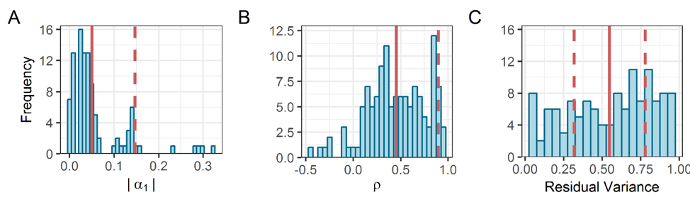
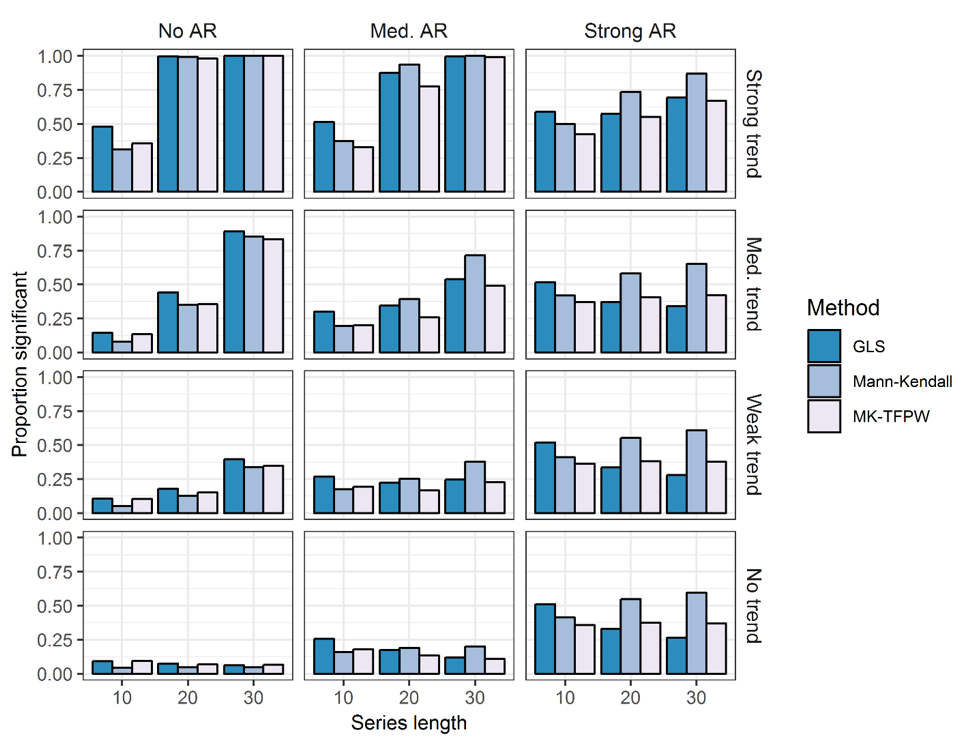
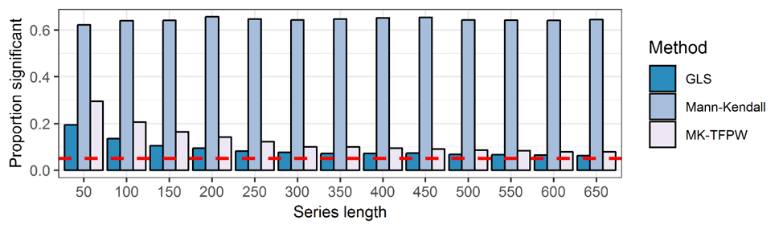
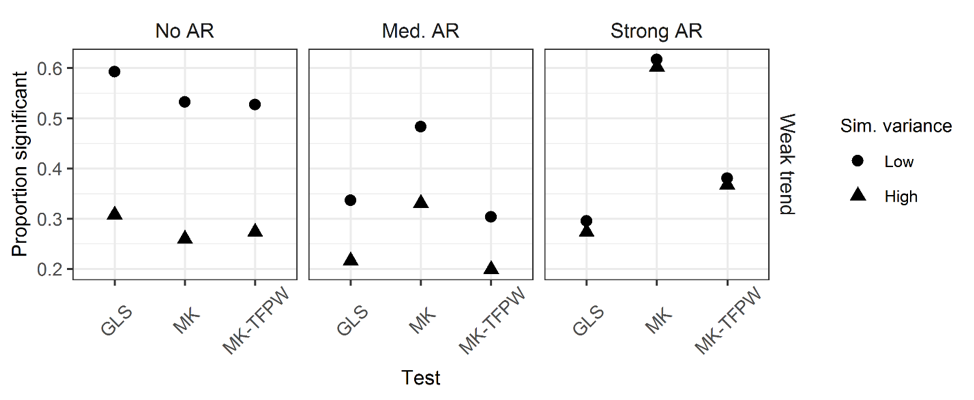
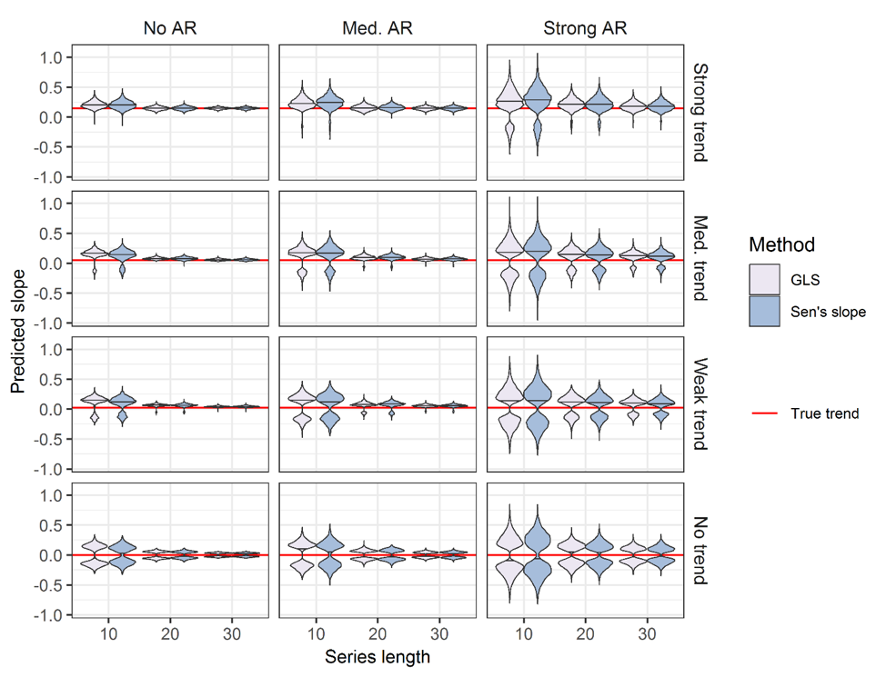
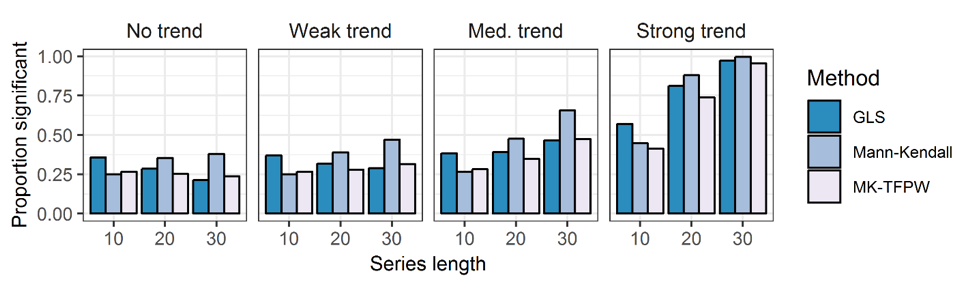

class: top, left 

```{r setup, echo = F, message=F}
options(htmltools.dir.version = FALSE)
knitr::opts_chunk$set(echo = F,
                      warning = F,
                      message = F)
library(ggplot2)
library(dplyr)
library(tidyr)
library(ecodata)
library(patchwork)

#Time series constants
shade.alpha <- 0.3
shade.fill <- "lightgrey"
x.shade.min <- 2010
x.shade.max <- 2019

```


**Trend Detection in Integrated Ecosystem Assessment**

* Assessing trends in time series is a key component of the IEA approach

* As analysts, we want to identify the limitations of these methods to ensure sound assessments of risk and indicator change

* Key statistical assumptions in trend analysis are often not properly accounted for

```{r random_trend, fig.height=3, fig.width = 8,echo = F, warning = F, fig.align = "center"}

set.seed(2)


norm_plot <- data.frame(x = 1990:2019,
           y = 1:30*0.1 + rnorm(30)) %>% 
  mutate(hline = mean(y)) %>% 
ggplot() +
    geom_line(aes(x = x, y = y)) +
  geom_point(aes(x = x, y = y)) +
  geom_gls(aes(x = x, y = y)) +
  scale_x_continuous(expand = c(0.01, 0.01)) +
  guides(color = FALSE) +
  ggtitle("No AR(1) component") +
  ylab(expression("Indicator Value")) +
  xlab("Time") +
  geom_hline(aes(yintercept = hline),
           size = 1,
           alpha = 0.5,
           linetype = 2) +
   #Highlight last ten years
  annotate("rect", fill = shade.fill, alpha = shade.alpha,
      xmin = x.shade.min , xmax = x.shade.max,
      ymin = -Inf, ymax = Inf) +
  annotate("text", x = 1995, y = 3.5, label = expression(alpha["1"]~"= 0.1")) +
 theme_ts()


ar1_series <- arima.sim(n = 30, list(ar = .6), sd = 1)

ar1_plot <- data.frame(x = 1990:2019,
           y = 1:30*0.1 + ar1_series) %>% 
  mutate(hline = mean(y)) %>% 
ggplot() +
    geom_line(aes(x = x, y = y)) +
  geom_point(aes(x = x, y = y)) +
  geom_gls(aes(x = x, y = y)) +
  scale_x_continuous(expand = c(0.01, 0.01)) +
  guides(color = FALSE) +
  ggtitle(expression("Series with AR(1) error ("~rho~"= 0.6)")) +
  ylab(expression("")) +
  xlab("Time") +
  geom_hline(aes(yintercept = hline),
           size = 1,
           alpha = 0.5,
           linetype = 2) +
   #Highlight last ten years
  annotate("rect", fill = shade.fill, alpha = shade.alpha,
      xmin = x.shade.min , xmax = x.shade.max,
      ymin = -Inf, ymax = Inf) +
  
  annotate("text", x = 1995, y = 3.5, label = expression(alpha["1"]~"= 0.1")) +
 theme_ts()

norm_plot + ar1_plot

```

---
**Trend Detection in Integrated Ecosystem Assessment**

* Study question: What are the limitations of trend detection for IEA?

* Commonalities in IEA time series:
  * Short (often < 30 years)
  * Variety of error structures

* Time series assessed with single method

```{r all-trends, out.width = "100%", fig.align = "center"}


```
.image-cap2[
Frequency of estimated slopes (absolute values) (A), autocorrelation strengths (B), and time series residual variances (C) in 124 time series considered for inclusion in the 2017 State of the Ecosystem report. 
]

---
**AR(1) Simulation Methods**

1. Simulations:
  * Series of varying lengths (N = 10, 20, 30)
  * AR1 process strengths (&rho;<sub>1</sub> = 0, 0.43, 0.9)
  * Trend strengths (&alpha;<sub>1</sub> = 0, 0.026, 0.051, and 0.147) 

2. Test for trend:
  * GLS model selection 
  * Mann-Kendall test<sup>1</sup>
  * Mann-Kendall test with trend-free pre-whitening<sup>2</sup>
  
```{r all-trends2, out.width = "100%", fig.align = "center"}

```
  
.footnote[

[1] Mann, H. B. 1945b. Nonparametric tests against trend. Econometrica: Journal of the Econometric Society: 245–259. JSTOR.

[2] Yue, S., and Wang, C. Y. 2002. Applicability of prewhitening to eliminate the influence of serial correlation on the Mann-Kendall test. Water Resources Research, 38: 4–1–4–7. http://doi.wiley.com/10.1029/2001WR000861.

]

---
**AR(1) Simulation Results: Significance Testing**

```{r ar1_results, out.width = "100%", fig.align = "center"}

```

---
**Results: Extending N under Strong AR(1)**

```{r ar1_results_extended, out.width = "100%", fig.align = "center"}

```
.image-cap[
The dashed red line shows the nominal rejection rate of 0.05.
]

.box-highlight[
**Parameters**
* N = 50 - 650
* Strong AR(1) (&rho;<sub>1</sub> = 0.9)
* No trend
]
---
**Results: The role of series variance in significance testing**

```{r iea_trend_variance, out.width = "100%", fig.align = "center"}

```


.box-highlight[
**Parameters**
* N = 30
* σ<sup>2</sup> = 0.3 ("low") and σ<sup>2</sup> = 0.8 ("high") 
* Weak trend (&beta; = 0.026)

]

---
**Results: Estimating slope from autocorrelated data**

```{r iea_slope_id, out.width="100%", fig.align="center"}

```


---
**Results: Testing for trend in data simulated from AR(2) model**

* How do tests for trend handle data with AR(2) error?
 
.box-highlight[
**Parameters**
* N = 10, 20, 30
* AR(2) process strength: &rho;<sub>1</sub> = 0.43, &rho;<sub>2</sub> = 0.2
* &alpha;<sub>1</sub> = 0, 0.026, 0.051, and 0.147
]

```{r iea_ar2_results, out.width= "100%", fig.align= "center"}

```


---
**Summary**
.summary-highlight[
Testing for trend in short time series results in high incidence of false positive and false negative findings
  * Both become more prevalent when autocorrelated error is present in data 
  
Tests designed to account for AR error structure are biased when N is small

Estimates of trend strength often mischaracterize true trend when N is small or AR error is present

Which test performed best?
  * GLS-MS; although difference between tests are small (and all performed poorly)
  * Benefit of GLS-MS is ability to characterize uncertainty in estimate from probability distribution
]

---
**Lessons?**
* Applying tests for trend broadly without considering underlying error structures will likely result in assigning spurious trends or missing key patterns

* If hypothesis testing is to be used to identify trends for IEA, a more nuanced approach should be developed to account for characteristics that could bias tests
  * R package with flexible diagnostic functions currently in development to address shortcomings
  
```{r noaa-iea, out.width= "100%", fig.align= "center"}

```